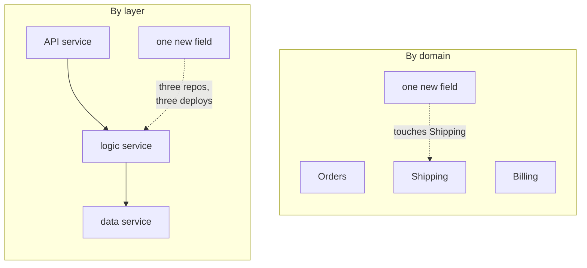

# Bestpeers Infosystem — experience stories

**Senior Software Engineer** · Sep 2021 – Nov 2022
**Software Engineer** · Sep 2020 – Sep 2021

Agency work across concurrent client products. Four stories covering all 7
resume bullets, every follow-up answered.

Probed less deeply than Contentstack, but the leadership bullet and the
monolith split get real questions.

---

## Story 1 — Technical leadership without the title

*Covers bullet 1.*

**Situation.** Multiple client projects running concurrently, no formal tech
lead assigned.

**Task.** Keep delivery predictable across teams while staying hands-on.

**Action.** Led 5+ developers technically; ran sprint planning, grooming and
retrospectives under Scrum/Kanban.

**Result.** 80%+ on-time delivery across concurrent client projects.

**Framing note.** The resume no longer carries the "(no formal title)"
parenthetical it once did — the bullet now just states the work. Keep your
spoken version matching that: *"I was the de facto technical lead for that
group — I ran the ceremonies and owned delivery."* State it, don't qualify it.
If asked directly about the title, answer plainly; volunteering it unprompted
is what made the old phrasing read as apologetic.

### Q: You led without the title — how did you get people to follow you?
**Level:** intermediate · **Tags:** leadership, influence, behavioral

Model answer

Influence without authority comes down to being useful before being
directive.

Three things that work. **Be the person who unblocks people** — if you're
reliably the one who makes someone's stuck problem go away, they bring you in
early, and being brought in early *is* the authority. **Make the work visible**
— the ceremonies weren't process for its own sake; sprint planning and grooming
gave everyone a shared picture of what was happening, which is most of what a
lead provides. **Take the unglamorous ownership** — the release, the flaky
pipeline, the client conversation nobody wants.

What doesn't work is acting like a manager without being one. You can't direct
people who don't report to you, so the use has to come from being the
person whose judgement they'd seek anyway.

**Follow-ups:**

1. Q: How do you handle a developer who repeatedly misses commitments?
   

Answer

   Diagnose before escalating, because "missing commitments" has several very
   different causes and only one of them is a performance problem.

   Usually it's estimation — they're optimistic, not unreliable. The fix is
   breaking work down smaller until estimates are testable, not a conversation
   about accountability. Sometimes it's being blocked and not saying so, often
   because asking for help feels like admitting failure; the fix is making
   "I'm stuck" a normal thing to say in standup, which is mostly about how you
   respond the first time someone does it. Sometimes it's competing priorities
   from another project, which isn't theirs to solve.

   Genuine performance issues are the minority, and without formal authority
   that's a conversation for their manager — but with specifics, privately, not
   as a complaint.

   The thing I'd avoid is raising it in standup. Public pressure produces
   padded estimates and hidden blockers, which makes the original problem worse.

   

2. Q: Scrum or Kanban — which, and why?
   

Answer

   Different problems, and in an agency you often need both.

   **Scrum** suits committed scope over a fixed period — client agrees a
   sprint's worth of work, you deliver it, you demo. The ceremonies give the
   client predictable checkpoints, which is largely what they're paying for.
   It's poor at absorbing interruptions: an urgent client request mid-sprint
   either breaks the commitment or waits.

   **Kanban** suits continuous flow and unpredictable arrival — maintenance,
   support, bug work. WIP limits rather than sprint commitments, and no
   ceremony overhead for work that can't be planned a fortnight ahead.

   In practice: Scrum for feature delivery on a project with a roadmap, Kanban
   for the support stream. Saying "we used both" is only a good answer if you
   can say *when each applied* — otherwise it sounds like you had no process.

   

3. Q: 80% on-time — what happened to the other 20%?
   

Answer

   Don't get defensive; 100% on-time usually means padded estimates rather
   than good delivery.

   The honest causes: scope changing mid-sprint (common in agency work, where
   the client is close to the process), underestimating unfamiliar work, and
   dependencies outside the team — a client's API, a third-party integration,
   sign-off that didn't arrive.

   What matters is what you changed. Breaking work smaller so estimates were
   testable, surfacing slippage early rather than at the deadline, and making
   scope changes explicit as a trade — "yes, and this drops out" rather than
   silently absorbing them, which is how agency teams end up permanently late.

   > **FILL IN:** one concrete example of unblocking or redirecting another
   > developer. Leadership claims need an anecdote or they're assertions.

   

---

## Story 2 — Splitting the monolith into 3 services

*Covers bullets 2, 3.*

**Situation.** A monolith limiting scalability across the product line.

**Task.** Break it into independently deployable services.

**Action.** Split into **3 microservices**; established E2E and unit test
suites to make the change safe.

**Result.** Independently deployable services; 85%+ sustained coverage.

### The decision that matters

*The test is whether a service can ship without coordinating with another. On the left every feature is a three-repo release train — the cost of microservices with none of the benefit.*

**Split by technical layer** (API service → logic service → data service) and
every feature crosses all three: adding one field means three repos, three
deploys, one release train — a distributed monolith with none of the benefits.
**Split by domain** (Orders, Billing, Shipping, each owning its own table and
talking via events) and adding a field to Shipping touches Shipping.

**The test:** can this service be deployed without coordinating with another?
If not, you have the operational cost of microservices and none of the benefit.

### Q: How did you choose the service boundaries?
**Level:** senior · **Tags:** microservices, ddd, architecture

Model answer

This is the decision the whole thing lives or dies on, so I'd talk about the
criteria rather than the outcome.

**Domain boundaries first.** Services should map to bounded contexts — areas
with their own vocabulary and rules. If two parts of the system use the same
word to mean different things, that's usually a boundary.

**Data ownership.** Each service owns its data exclusively. If two services
need to write the same table, they're one service. Shared database across
"microservices" is the classic anti-pattern — you get distributed deployment
with none of the independence.

**Rate and reason of change.** Code that changes together should live together.
If every feature touches all three services, the split is wrong.

**Team ownership.** A service with no clear owner rots.

The anti-pattern is splitting by technical layer — API service, business logic
service, data service — because every feature then crosses all three and you've
built a distributed monolith: all the network complexity, none of the
independence.

The practical test I'd apply: can I deploy this service without coordinating
with another team? If no, the boundary is wrong.

**Follow-ups:**

1. Q: What data did they share, and how did you handle it?
   

Answer

   Some sharing is unavoidable — the question is the mechanism.

   The options, in order of preference: **duplicate the data** each service
   needs, kept eventually consistent via events. Each service owns its own
   copy, shaped for its own use. Feels wrong to people trained on
   normalisation, but it's the correct trade in a distributed system: you're
   buying independence with storage and a consistency window.

   Or **call the owning service** synchronously. Simple and always current, but
   it creates runtime coupling — the caller is now only as available as the
   callee, and latency compounds.

   Or a **shared read-only view** for reporting, which is a pragmatic middle
   ground.

   What you avoid is two services writing the same table, because then neither
   can change its schema independently and you've coupled them at the worst
   possible layer.

   > **FILL IN:** what the 3 services actually were, and what drove the split
   > — scaling need, team boundaries, or deploy contention?

   

2. Q: How do you keep data consistent across 3 services?
   

Answer

   You give up distributed ACID transactions and design for eventual
   consistency instead.

   **Two-phase commit** exists but is rarely the right answer at this scale —
   it's a blocking protocol, and the coordinator is a single point of failure
   that can leave participants locked.

   **Sagas** are the usual pattern: a business transaction becomes a sequence
   of local transactions, each with a compensating action if a later step
   fails. Order placed → payment taken → stock reserved; if stock fails, refund
   the payment. Note it's *compensation*, not rollback — the payment did happen
   and is then reversed, which is visible and must be acceptable to the
   business.

   **The outbox pattern** solves the piece people miss: writing to your
   database and publishing an event must be atomic, or you get a state change
   with no event (or vice versa). Write the event to an outbox table in the
   same local transaction, then relay it to the broker separately. That gives
   at-least-once delivery, so consumers must be idempotent.

   See `02-distributed-systems/07-transactions-sagas.md`.

   

3. Q: Was it worth it?
   

Answer

   The question tests whether you can articulate the *cost*, not just the
   benefit — and a candidate who says "yes, obviously" fails it.

   The costs are real: every in-process call becomes a network call that can
   fail slowly, debugging needs distributed tracing rather than a stack trace,
   you need per-service CI/CD and monitoring, data consistency becomes your
   problem, and local development gets meaningfully harder.

   Worth it when: teams are blocked deploying independently, one component
   needs to scale differently from the rest, or fault isolation genuinely
   matters.

   Not worth it when the real problem is a badly-structured codebase. A
   **modular monolith** — clear internal boundaries, one deployable — gets you
   most of the structural benefit with none of the operational cost, and
   remains splittable later once the boundaries have proven themselves.

   Being able to say "with three services and one team, a modular monolith
   might have been the better call for another year" is a stronger answer than
   defending the decision — if that's what you actually think.

   

---

## Story 3 — Xtensio: editor performance

*Covers bullet 4.*

**Situation.** Xtensio, a Canva-like design platform. Editor render time was
hurting the core interaction.

**Action.** Rebuilt component rendering into lightweight components; shipped
layering support and new design components.

**Result.** Editor render time cut by **30%**.

### Q: What made the original components heavy?
**Level:** intermediate · **Tags:** react, performance, rendering

Model answer

In a canvas editor the usual culprit is that every element re-renders when any
element changes, because state lives too high and is passed down as a
frequently-changing object.

The specific causes: **state at the wrong level** so a change to one shape
re-renders the whole canvas; **new object or function identities every render**,
which defeats `memo` because props are never referentially equal; **expensive
work in render** rather than memoised; and **layout thrash** — reading a DOM
measurement then writing a style in a loop forces synchronous reflow per
element.

The fixes follow: push state down so a component owns what changes; stabilise
prop identity with `useMemo`/`useCallback` so memoisation actually engages;
split components so the re-rendering subtree is as small as possible; and batch
DOM reads and writes.

For very large canvases the next step is virtualisation — only render what's
in the viewport.

> **FILL IN:** which of these it actually was, and how you diagnosed it.

**Follow-ups:**

1. Q: How did you measure it?
   

Answer

   The measurement method matters as much as the number, because "30% faster"
   is meaningless without saying faster *at what*.

   React Profiler for component-level render cost — which components re-render,
   how often, and why (it reports the triggering prop). Browser performance
   timeline for the full picture including layout, paint and composite, which
   is where canvas editors actually spend time. And a scripted interaction
   benchmark — drag a shape, add an element — measured repeatedly, because
   ad-hoc "feels faster" is not evidence.

   The number that matters in an editor is interaction latency, not initial
   load: does dragging stay under the frame budget. 60fps means ~16ms per
   frame, which is the bar.

   

2. Q: How did you avoid regressions?
   

Answer

   Performance work decays unless it's defended, because the next feature
   reintroduces the pattern you removed.

   The layers: a benchmark in CI on the key interactions with a threshold that
   fails the build — imperfect on shared runners, but it catches order-of-
   magnitude regressions. Lint rules for the specific footguns (unstable props
   into memoised components). Review awareness so the team knows the pattern.
   And real-user monitoring of interaction latency in production, since
   synthetic benchmarks miss the machines and document sizes real users have.

   

3. Q: Layering — how did you model z-order?
   

Answer

   A nice data-structure question hiding inside a product feature.

   The naive model is an integer `z` per element, which breaks quickly: to
   insert between 2 and 3 you must renumber everything above, which is O(n)
   writes and awful for collaborative editing.

   Better options. **Ordered list** where position is the z-order — reordering
   is a move, no renumbering, and it matches how users think about a layers
   panel. **Fractional indexing** — insert between 2.0 and 3.0 at 2.5 — gives
   O(1) inserts with no renumbering, at the cost of precision drift needing
   occasional rebalancing. Fractional indexing is what collaborative editors
   generally use, because two users inserting simultaneously don't conflict.

   Then z-order maps to render order, with CSS `z-index` or draw sequence
   following from it.

   

---

## Story 4 — Healthcare and marketplace products

*Covers bullets 5, 6, 7.*

**Pinzon Health** (remote patient monitoring): built the patient
onboarding-to-monitoring flow, ingesting live vitals from connected BP and
other devices so doctors could monitor remotely and assign medications in-app.
Added automated alerts and reminders that cut manual review effort.

**Clipboard Health** (nurse staffing marketplace): built the nurse-side shift
search — geolocation filtering and apply-for-shift logic.

### Q: Live vitals from devices — how did you ingest them reliably?
**Level:** senior · **Tags:** ingestion, iot, reliability

Model answer

Device ingestion is unreliable by nature — intermittent connectivity, battery
limits, clock drift — so the design assumption has to be that readings arrive
late, out of order, or in bursts after a reconnect.

The properties I'd design for:

**Idempotency.** Each reading carries a device-generated ID, so a device
retrying after an unacknowledged send doesn't create duplicates. Without this,
retries corrupt the record.

**Two timestamps.** Event time (when the reading was taken, from the device)
and ingest time (when you received it). These diverge — sometimes by hours
after an offline period — and clinical logic must use event time while
operational monitoring uses ingest time. Conflating them is the classic bug.

**Out-of-order tolerance.** Store by event time and let a late reading slot
into its correct position rather than being appended or rejected.

**Buffering and backfill.** The device buffers offline and replays on
reconnect, which means a burst — so the ingest path needs to absorb spikes,
typically via a queue rather than synchronous writes.

**Clock skew.** Device clocks drift; you may need to correct against a
server-side reference or at least record the skew.

**Follow-ups:**

1. Q: What happens if a reading is missed or arrives very late?
   

Answer

   In healthcare this is a safety question, not just a correctness one, and
   the important distinction is between *no reading* and *a bad reading* —
   silence is ambiguous.

   A missing reading could mean the patient is fine and the device is off, or
   the patient is in trouble and the device was knocked off. You can't tell
   from absence, so you monitor for absence explicitly: if a device that
   reports every 15 minutes hasn't reported in an hour, that's an alert in its
   own right — a device-health alert, distinct from a clinical one, because
   they route to different people.

   For late arrivals, the reading is still recorded at its event time, but
   whether it triggers a *clinical alert* depends on age. An alarming reading
   from three hours ago shouldn't page as though it were live, but it also
   can't be silently dropped — it goes into the record and into review, flagged
   as delayed.

   

2. Q: How did you design the alerting thresholds?
   

Answer

   The real failure mode is alert fatigue: too many alerts and clinicians
   ignore all of them, including the one that mattered. So the design goal is
   *fewer, better* alerts, not comprehensive coverage.

   What helps: thresholds set clinically rather than by engineers, and
   ideally per-patient, since a baseline that's alarming for one person is
   normal for another. Requiring persistence — sustained over multiple readings
   rather than one spike, since single anomalous readings are often artefacts.
   Severity tiers so not everything pages. Deduplication so an ongoing
   condition alerts once rather than every reading. And measuring the
   false-positive rate as a first-class metric, because if nobody's tracking
   it, fatigue creeps in invisibly.

   

3. Q: Any compliance constraints?
   

Answer — scope honestly

   Patient data is regulated — HIPAA in the US, and equivalents elsewhere —
   which constrains engineering in practice: encryption in transit and at rest,
   access controls with least privilege, audit logging of every access to
   patient data, retention and deletion policies, and care with third-party
   processors.

   Answer at the level you actually operated. If compliance was handled by
   others and you implemented against requirements, say that — claiming
   ownership of a compliance programme you supported is the kind of
   overstatement that unravels under one follow-up.

   > **FILL IN:** whether there were real compliance requirements here and what
   > they constrained in your work.

   

4. Q: Two nurses apply for the last shift simultaneously. What happens?
   

Answer

   A concurrency question in disguise, and a good one — the naive
   check-then-act ("is it available? then assign it") has a race between the
   two steps, so both nurses can pass the check before either writes.

   The fixes:

   **Atomic conditional update** — a single `UPDATE ... WHERE status =
   'open'`, then check rows affected. One wins, the other gets zero rows and a
   clean "already taken". Simplest and usually correct.

   **Optimistic locking** — a version column; the update fails if the version
   moved. Same effect, generalises to richer state.

   **Pessimistic locking** — `SELECT FOR UPDATE`. Correct but serialises on a
   hot row, and popular shifts *are* hot rows.

   **A queue per shift**, if you want fair ordering rather than
   first-write-wins.

   The product question matters as much as the technical one: is instant
   assignment even right? Many staffing marketplaces deliberately use an
   application-then-selection model, which removes the race entirely by making
   applying non-exclusive.

   

5. Q: How did geolocation filtering work at scale?
   

Answer

   Naively computing distance to every shift and sorting is a full scan per
   query — fine at small scale, hopeless as inventory grows, because you can't
   index an arbitrary distance calculation.

   The approaches: **geospatial index** — MongoDB `2dsphere` or PostGIS —
   which supports "within N km of this point" as an indexed query directly.
   Simplest if your database supports it, and MongoDB does, which matters given
   your stack.

   **Geohashing** — encode lat/long into a string where shared prefixes mean
   proximity, so a proximity search becomes a prefix match on a normal B-tree
   index. Works in any database, with the caveat of edge cases at cell
   boundaries where physically close points have different prefixes, usually
   handled by searching neighbouring cells too.

   **Bounding box pre-filter** — cheap indexed lat/long range query to narrow
   the candidate set, then exact distance on what remains. Crude but effective
   and easy to add.

   In practice you also filter on more than distance — shift time,
   qualifications, pay — so the geo filter is one predicate among several, and
   which one leads depends on selectivity.

   > **FILL IN:** which approach you actually used.

   

