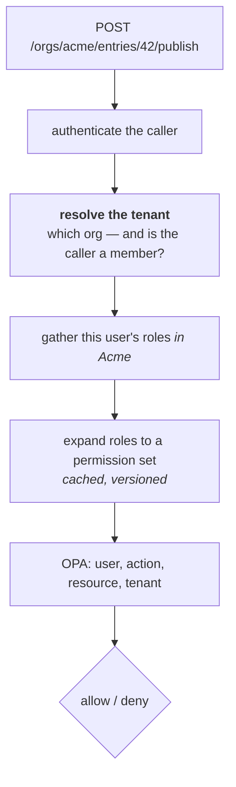
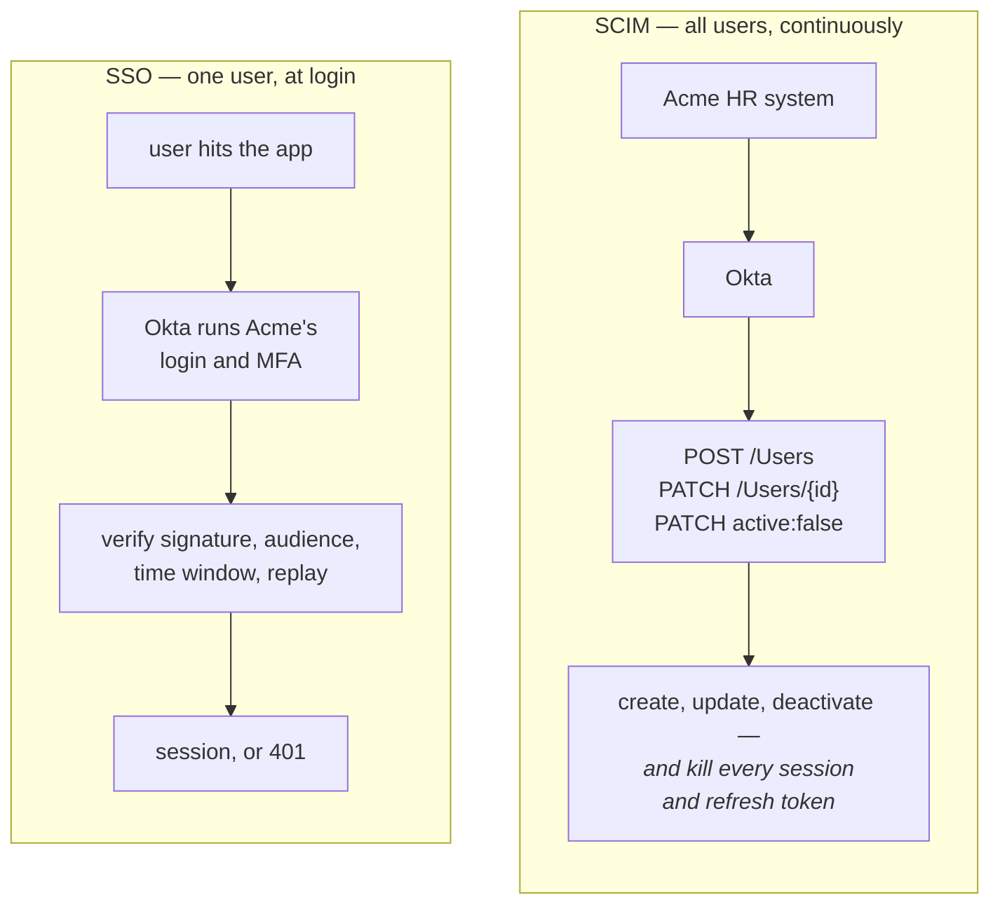
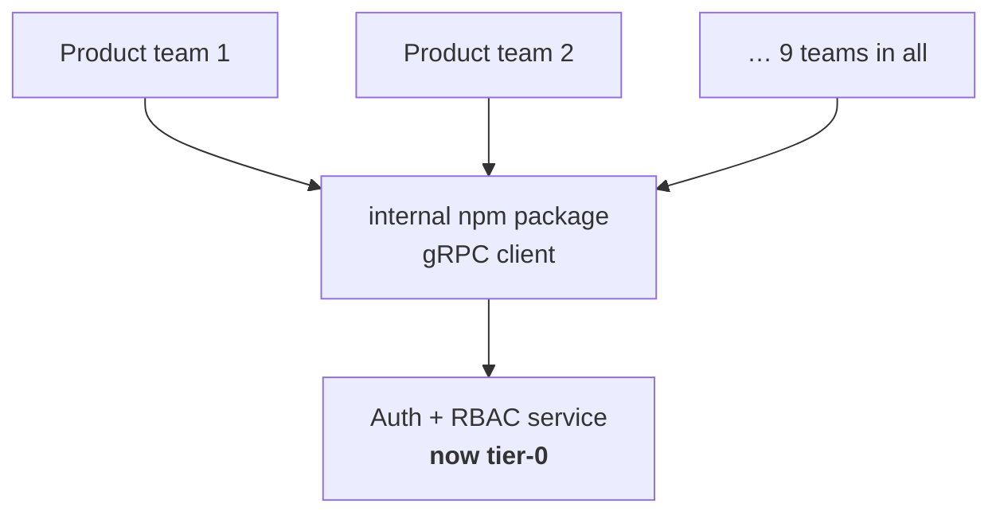
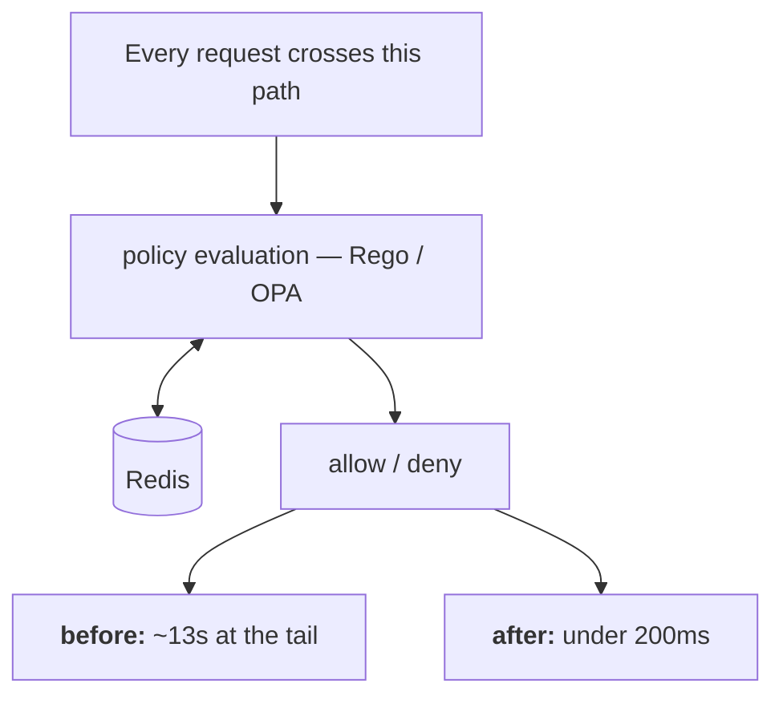

# Contentstack — experience stories

**Senior Software Engineer I** · Aug 2024 – Aug 2026
**Software Engineer II** · Nov 2022 – Jul 2024

Eight stories covering all 14 resume bullets. Interviewers ask about
*projects*, not bullets, so related bullets are grouped into the narrative
you'd actually tell.

Every follow-up has a model answer. Two kinds:

- **Technical follow-ups** — full answers you can learn and adapt.
- **`> **FILL IN:**` follow-ups** — only you have the facts, so you get the
  *shape* of a strong answer with blanks to slot them into. Fill these before
  drilling; a story that collapses on the second follow-up is worse than one
  you never told.

---

## Story 1 — RBAC from 0 to 1 *(flagship)*

*Covers bullets 1, 2, 3.*

**Situation.** A multi-tenant content platform with only 2 fixed roles.
Customers — especially enterprise buyers — couldn't express who was allowed to
do what. Users can belong to multiple organizations, so permissions had to
resolve per org, not per user globally.

**Task.** Design and ship granular RBAC across the platform, from nothing,
without breaking existing customers on the 2-role model.

**Action.** Designed the permission model (granular permissions, 2–3 default
roles per product, plus customer-defined custom roles); extended it into SSO
onboarding, SCIM onboarding and the role-update flow; and earlier in the same
arc redesigned the multi-org invitation and onboarding flow so role assignment
happens at invite time.

**Result.** Migration from 2 fixed roles to full-scale granular RBAC across
products. Thank You Award, Q4 2024, for sustained ownership.

### The model

One human, many orgs. A user account is a member of several tenants; each
tenant holds its own role binding for that user (admin in Acme, viewer in
Globex), scoped to that tenant; a role bundles permissions
(`entry:publish`, `asset:delete`); permissions act on a resource such as an
entry in Acme.

So the user is an **admin in Acme and a viewer in Globex**. That is why "can
they publish?" has no answer without naming the org.

A user can belong to many orgs, and the role binding is **per-org** — which is
why the check below must resolve a tenant before it can resolve anything else.


*Tenant resolution sits second for a reason: every step below it is meaningless without an org, which is why “can they publish?” has no answer until you name one.*

**The check, at request time**, on `POST /orgs/acme/entries/42/publish`:
authenticate the caller → **resolve the tenant** (which org, and is the caller
a member of it?) → gather that user's roles *in Acme* → expand roles to a
permission set (cached, versioned) → hand `{user, action, resource, tenant}` to
OPA → allow or deny.

**Resolve tenant is the step candidates forget.** Skip it and the check is
meaningless — or worse, a user in one org passes a check against another. The
question "may this user publish?" has no answer until the org is named: they
may publish in org A and not in org B.

### Q: Walk me through your permission model.
**Level:** intermediate · **Tags:** rbac, modelling, multi-tenancy

<details><summary>Model answer</summary>

Four entities. **Permissions** are the atoms — an action on a resource type,
like `entry:publish` or `asset:delete`. **Roles** bundle permissions. **Users**
hold roles, but always *scoped to an organization*, because a user can belong
to many orgs with different rights in each. **Resources** are what's acted on.

We shipped 2–3 sensible default roles per product so most customers never had
to think about it, and custom roles for enterprises that needed to express
their own structure.

The important design decision is that the role binding is per-org, not global.
So the authorization question is never "can this user publish" — it's "can
this user publish *in this org*". Every check carries a tenant, and the tenant
is resolved before roles are gathered.

At request time: authenticate, resolve the tenant, gather that user's roles in
that tenant, expand to a permission set, evaluate the policy, allow or deny.

</details>

**Follow-ups:**

1. Q: Why permissions as atoms rather than roles checked directly in code?
   <details><summary>Answer</summary>

   Because checking roles in code hard-codes policy into the application.
   `if (user.role === 'admin')` means every new role requires a code change,
   and role semantics drift between services as people copy that check around.

   Checking permissions inverts it: code asks "does this principal have
   `entry:publish`?" and never knows which role granted it. Roles become pure
   data, so adding a role, or letting a customer define one, is a
   configuration change rather than a deploy.

   It's also what makes custom roles possible at all — you can't ship
   customer-defined roles if the application branches on role names.

   </details>

2. Q: How do you stop the permission list becoming unmanageable — the role explosion problem?
   <details><summary>Answer</summary>

   Role explosion happens when you create a new role for every combination of
   circumstances — `editor-eu-readonly-contractor` — and end up with hundreds
   nobody can reason about.

   Three defences. **Keep permissions coarse enough to be meaningful**: one per
   real capability, not one per endpoint. **Ship good defaults** so the common
   cases need no custom roles at all — that's what the 2–3 per product were
   for. **Push the varying dimensions out of the role and into policy
   attributes**: instead of a role per region, keep one editor role and let
   the policy consider a region attribute. That's the ABAC hybrid, and it's
   what OPA gave us — the role provides the permission set, the policy layer
   handles the conditional dimensions.

   The signal that you've got it wrong is roles whose names encode conditions.

   </details>

3. Q: A user belongs to three orgs. How does a permission check know which org's roles to use?
   <details><summary>Answer</summary>

   The tenant has to be explicit in the request context — it's never inferred.

   Two viable designs. **Tenant in the token**: the access token carries
   `org_id` and is valid for one org, so switching orgs means getting a new
   token. Simple, and it fails safe because a token literally cannot address
   another org. The cost is re-issuing tokens on switch, which is awkward if
   the UI shows cross-org views.

   **Tenant in the request**: the token identifies the user, the org comes
   from the path or a header, and roles are resolved per request. More
   flexible, but now every endpoint must validate that the user actually
   belongs to the org they named — miss that check on one endpoint and you
   have a cross-tenant vulnerability.

   If I were choosing again for a platform with cross-org UI, I'd take the
   second but enforce the membership check in shared middleware rather than
   per-endpoint, so it can't be forgotten.

   </details>

### Q: How did you migrate existing customers from 2 fixed roles without breaking them?
**Level:** senior · **Tags:** migration, rollout, backwards-compatibility

<details><summary>Model answer — structure to fill</summary>

The shape of a strong answer, whatever the specifics were:

**Map the old to the new.** The two legacy roles become two default roles in
the new model, defined as exactly the permission set they previously implied.
Nobody's effective access changes on day one — that's the property you're
protecting.

**Backfill.** Every existing user gets an explicit role binding matching what
they had implicitly.

**Run both paths behind a flag.** New authorization path computes a decision;
old path computes a decision; compare them in production without enforcing the
new one. Any divergence is a bug found before it touches a customer. (This is
the "dark launch" / shadow-mode technique, and naming it is a strong signal.)

**Roll out progressively** — internal orgs, then small customers, then
enterprise — with a per-org kill switch back to the old path.

**Remove the old path** only after divergence is zero for a sustained period.

> **FILL IN:** what did you actually do? Which of these applied, and what
> went wrong? The migration is the part interviewers find most interesting and
> it's completely absent from your resume. Even "we had a bad week when X
> diverged" is a better answer than a clean abstraction.

</details>

**Follow-ups:**

1. Q: What's your rollback plan if the new model gets a decision wrong in production?
   <details><summary>Answer</summary>

   Per-org kill switch back to the legacy path, because a global rollback for
   one customer's problem is too blunt. The switch has to be config, not a
   deploy — you want it flipped in seconds during an incident.

   The subtlety is the direction of failure. If the new path is *more*
   permissive than the old one, that's a security incident and you fail closed
   immediately. If it's *less* permissive, it's an availability problem —
   users blocked from work — which is urgent but not a breach. Those warrant
   different response speeds and different people being woken up.

   </details>

2. Q: How did you test it?
   <details><summary>Answer</summary>

   Three layers. **Unit tests on policy evaluation** — a decision table of
   (role, permission, resource, tenant) → expected outcome, including the
   negative cases, which matter more: authorization bugs are usually
   wrongly-permitted rather than wrongly-denied.

   **Shadow comparison in production** — the highest-value one, because it
   tests against real traffic shapes you'd never think to write.

   **Explicit cross-tenant tests** — user in org A attempting every action in
   org B, expecting denial across the board. In multi-tenant systems this is
   the failure class that ends up in an incident report, so it deserves its
   own suite rather than being folded into general authz tests.

   </details>

> **FILL IN:** team size, duration, and your specific surface — what you
> designed, what you built yourself, what you reviewed. "Led 0 to 1" gets
> probed for inflation ([WEAK-SPOTS](../WEAK-SPOTS.md) #4). A precise boundary sounds
> confident; a vague one sounds inflated even when it's true.

> **FILL IN:** your first design that didn't survive contact with reality.
> Admitting a wrong turn is the strongest evidence you were actually there.

---

## Story 2 — Unifying OAuth, SSO and SCIM

*Covers bullets 4, 5.*

**Situation.** OAuth server scope was fragmented across products; enterprise
customers wanted native SSO and automated provisioning from their own IdP.

**Task.** Consolidate into one multi-tenant auth layer, and ship native
marketplace integrations.

**Action.** Unified the OAuth server's scope across all products; partnered
with Okta and Microsoft Entra ID engineering to build native SAML SSO and SCIM
applications.

**Result.** Both live in the Okta and Entra ID marketplaces — externally
verifiable work, which is rare. Say so plainly.

### The two halves, and why they're different


*Two systems that share a vocabulary and nothing else: one runs once at login, the other runs forever in the background. Conflating them is the classic trap.*

**SSO — authentication. At login, one user, synchronous.** The user hits
`app.contentstack.com`; Contentstack (the SP) redirects to Acme's Okta with a
`SAMLRequest`; Okta runs Acme's own login and MFA policy; Okta POSTs a signed
SAML assertion back to the ACS URL via the browser; Contentstack verifies
signature, audience, `NotBefore`/`NotOnOrAfter` and replay, then either
establishes a session with Acme roles or rejects with 401.

**The verify step is the whole security of SAML.** Skip the audience check and
an assertion minted for a different SP is accepted here; skip replay and a
captured assertion is reusable.

**SCIM — provisioning. Continuous, all users, asynchronous.** Acme's HR system
drives Okta, which calls Contentstack's SCIM endpoints: `POST /scim/v2/Users`
on a new hire (create account + default role), `PATCH /Users/{id}` on a
promotion (update the role binding), and `PATCH active:false` on departure —
which must deactivate the account **and revoke every session and refresh
token**, in seconds, not overnight.

**Session revocation on deprovision is the part that matters commercially.**
Deprovisioning without it means a fired employee keeps working access until
their token expires — which is exactly what the security questionnaire asks
about.

**The distinction to state up front:** SSO answers "may this person in right
now"; SCIM answers "who exists, and what are they entitled to" on an ongoing
basis. SSO alone means a terminated employee's account lingers until someone
remembers to delete it. SCIM is what makes offboarding immediate — and that's
a security control, not a convenience feature.

### Q: Why SAML for enterprise SSO when you already had OIDC?
**Level:** intermediate · **Tags:** saml, oidc, enterprise

<details><summary>Model answer</summary>

Because enterprise buyers already have SAML. It's been the corporate SSO
standard since the mid-2000s, their IdP is configured for it, their identity
team knows how to operate it, and their procurement checklist asks for it. You
support the protocol your customer has, not the one you'd prefer.

Technically OIDC is the better design — JSON and JWTs rather than XML, far
simpler to implement correctly, and no XML signature-wrapping attack surface.
For new integrations and anything mobile, OIDC every time.

In practice a B2B platform supports both: OIDC for modern and first-party
integrations, SAML because enterprise deals require it. That's what we did —
the OAuth/OIDC layer was the platform's own, SAML was the enterprise
onboarding path.

</details>

**Follow-ups:**

1. Q: What's actually harder about implementing SAML correctly?
   <details><summary>Answer</summary>

   XML signature validation. The assertion is signed XML, and the classic
   attack is **signature wrapping**: the attacker keeps the validly-signed
   element but restructures the document so the parser reads a *different*,
   attacker-controlled element while signature verification still passes over
   the original. It's caused real vulnerabilities in many SAML libraries.

   The defences are to validate that the signature covers the element you
   actually consume, canonicalise carefully, and — most importantly — never
   write your own. Use a maintained library and keep it patched.

   Beyond that: clock skew on `NotBefore`/`NotOnOrAfter` conditions, replay
   prevention on assertion IDs, and strict audience restriction so an
   assertion minted for another service provider can't be replayed at yours.

   </details>

2. Q: What does SCIM give you that a nightly CSV sync doesn't?
   <details><summary>Answer</summary>

   Deprovisioning latency, and that's a security argument rather than a
   convenience one. With a nightly sync, a terminated employee keeps access for
   up to 24 hours — which is exactly the window that matters after an
   involuntary departure. With SCIM the IdP pushes the deactivation as it
   happens, so access ends in seconds.

   It's also a real schema with defined semantics and a standard REST
   interface, so the same integration works across Okta, Entra and anything
   else that speaks SCIM — versus a bespoke pipeline per customer. And it's
   bidirectional in the sense that the IdP knows whether the push succeeded,
   so failures surface instead of silently drifting.

   </details>

3. Q: A SCIM DELETE arrives for a user who owns content. What happens?
   <details><summary>Answer</summary>

   You never hard-delete, for two reasons: their content would lose its owner
   or cascade-delete, and audit trails must survive the user.

   The right behaviour is soft-deactivate: revoke access immediately —
   sessions, tokens, everything — but retain the record. The content stays,
   attributed to a now-inactive user, and an admin can transfer ownership
   deliberately.

   Worth knowing the spec detail: SCIM has both `DELETE` and a `PATCH` setting
   `active: false`. Okta and Entra typically send the deactivation patch
   rather than a hard delete for exactly this reason, and treating `DELETE` as
   deactivation is the safe interpretation.

   The security requirement is that revocation is immediate on either — which
   loops back to session termination in Story 6.

   </details>

4. Q: How were OAuth clients and tokens isolated per tenant?
   <details><summary>Answer — structure to fill</summary>

   The requirements, whatever the implementation: every client registration
   belongs to exactly one tenant; every issued token carries the tenant it was
   issued for; and the resource server validates that the token's tenant
   matches the tenant of the resource being accessed. A token minted for
   tenant A presented against tenant B's resource must fail — and that should
   be enforced centrally, not per-endpoint.

   The `audience` claim is the standard mechanism, with the tenant either in
   the audience or as a dedicated claim.

   > **FILL IN:** what "unified the scope across all products" in practice
   > meant. Merging previously separate OAuth servers? One server with
   > per-product scopes? Consolidating token formats? The resume phrasing is
   > vague and this will be asked directly.

   </details>

> **FILL IN:** roughly how long marketplace certification took with Okta and
> Microsoft, and what their reviewers pushed back on. Partnership stories are
> memorable and this one is unusual.

---

## Story 3 — Security audit remediation: ~150 → 10

*Covers bullet 6.*

**Situation.** A third-party audit returned roughly 150 open findings against
the auth surface.

**Task.** Drive them down without stalling delivery.

**Action.** Owned the remediation programme — triage, prioritisation, and the
fixes — across two quarters.

**Result.** ~150 → 10 open findings.

### Q: How do you prioritise 150 findings?
**Level:** senior · **Tags:** security, triage, prioritisation

<details><summary>Model answer</summary>

Not top to bottom, and not by the auditor's severity label alone — those are
assigned without knowing your architecture.

I'd triage on three axes. **Severity** — what's the impact if exploited.
**Exploitability** — is it reachable from the internet by an unauthenticated
attacker, or does it need an authenticated insider and a specific race? A
"critical" finding behind three other controls may genuinely rank below a
"medium" that's directly reachable. **Blast radius** — in a multi-tenant
platform, anything crossing a tenant boundary outranks anything scoped to a
single tenant, because one exploit means every customer.

Then a practical overlay: group findings by *root cause*. 150 findings is
rarely 150 problems — it's often 20 problems appearing in many places. Fixing
one missing validation helper can close a dozen findings at once, so batching
by cause rather than by report line is what actually produces the curve from
150 to 10.

Finally, separate "fix" from "accept with compensating control" early, so the
genuinely-won't-fix items stop consuming triage attention.

</details>

**Follow-ups:**

1. Q: Why are 10 still open?
   <details><summary>Answer</summary>

   The honest and expected answer is that not every finding should be fixed.
   Three legitimate categories:

   **Accepted risk** — low severity, high cost to fix, documented and signed
   off by someone with the authority to accept it.

   **Compensating controls** — the underlying issue remains but is mitigated
   by other layers, e.g. a weakness only exploitable from inside a network
   segment that's independently restricted.

   **Dependent on external change** — waiting on an upstream library fix or a
   customer-side migration you can't force.

   What matters is that each one is a *decision with an owner and a date*, not
   a backlog item that quietly aged. Being able to say why something is
   deliberately unfixed is a stronger signal than claiming zero open findings.

   </details>

2. Q: How did you stop the same class of bug recurring?
   <details><summary>Answer</summary>

   Remediation without prevention just resets the clock to the next audit.

   The order I'd work in: **secure defaults** first — make the safe path the
   default so the vulnerable pattern requires deliberate effort. Then
   **automated detection** in CI: linting or SAST rules for the specific
   patterns found, so a regression fails the build rather than waiting for the
   next audit. Then **shared helpers** so authorization checks aren't
   hand-written per endpoint — the single most effective structural change,
   because it converts "remember to check" into "impossible to forget".
   Finally **review guidance** so humans know what to look for.

   Documentation alone is the weakest control and the one most teams reach for
   first.

   </details>

> **FILL IN:** two or three specific findings you can describe safely, and
> what class they were — authz bypass, injection, token handling, dependency
> CVEs? "We had about 150 findings" without a single concrete example sounds
> like you managed a spreadsheet rather than fixed bugs.

---

## Story 4 — Auth as a platform: the gRPC npm package

*Covers bullet 7.*

**Situation.** Product teams were each reimplementing auth and RBAC
integration — duplicated effort, inconsistent enforcement, and a new security
risk every time someone got it subtly wrong.

**Task.** Make correct auth the easy path.

**Action.** Built an internal npm package backed by gRPC, so any service could
consume auth and RBAC without reimplementing it.

**Result.** Adopted by **9 product teams**.

### The shape


*The arrow everything converges on is also the new risk: nine inconsistent implementations are gone, and one shared dependency's outage is now everyone's outage.*

Nine inconsistent implementations became **one dependency every service
shares** — a better problem, but still a problem: the auth service is now
tier-0.

The trade is worth naming yourself: nine inconsistent implementations are gone,
replaced by **one dependency every service now shares**. That's a better
problem — but it is a problem, and it makes the auth service tier-0.

The trade is explicit and worth naming yourself: you've removed nine
inconsistent implementations and created one dependency that every service now
shares. That's a better problem, but it *is* a problem.

### Q: Why gRPC rather than REST for this?
**Level:** intermediate · **Tags:** grpc, api-design, performance

<details><summary>Model answer</summary>

Three reasons, in order of importance.

**It's on the hot path.** Every request in every service makes an authorization
call, so per-call overhead multiplies by total platform traffic. gRPC uses
Protobuf — a compact binary encoding, far cheaper to serialise than JSON — over
HTTP/2 with multiplexed, reused connections, so there's no per-call handshake.

**Typed contracts.** The `.proto` file is the contract, and clients are
generated from it. Across nine consuming teams that matters enormously: a
breaking change is a compile error rather than a runtime surprise in someone
else's service at 3am.

**Streaming**, if you need it — for pushing policy or revocation updates rather
than having every service poll.

The honest counterpoint: gRPC is worse at the edge — browser support needs
grpc-web, it's harder to debug with curl, and load balancers need HTTP/2
awareness. For an internal service-to-service call none of that applies, which
is exactly where gRPC fits.

</details>

**Follow-ups:**

1. Q: A shared auth library across 9 teams is a versioning nightmare. How did you handle breaking changes?
   <details><summary>Answer</summary>

   The rule is that the *wire contract* and the *client library* version
   separately, and the wire contract must stay backward compatible far longer.

   On the Protobuf side, the discipline is additive-only: never reuse or
   renumber a field tag, never change a type, mark removed fields `reserved`.
   Old clients then keep working against a newer server indefinitely, which is
   what you need when you don't control nine teams' deploy schedules.

   On the library side: semver, and treat a major bump as a project rather
   than a release. Publish the new version, support both in parallel, migrate
   teams individually with help, and only then deprecate — with a deadline
   that's communicated well ahead and actually enforced, or nobody moves.

   The main point: you cannot do a synchronised upgrade across
   nine teams. Any design that requires everyone to deploy at once will fail,
   so the architecture has to tolerate mixed versions permanently.

   </details>

2. Q: What happens to a consuming service if the auth service is down?
   <details><summary>Answer</summary>

   You have to choose fail-open or fail-closed, and you must have a reasoned
   position — this is the question I'd expect a senior candidate to have
   thought about before being asked.

   **Fail closed** is the default for authorization: if you can't determine
   whether someone is allowed, deny. It's secure, and it means an auth outage
   is a total platform outage — auth becomes a hard dependency for everything.

   **Fail open** keeps the platform up and is almost always wrong for authz,
   because an attacker who can DoS the auth service gets unrestricted access.

   The practical answer is neither, but **degrade**: cache recent decisions
   locally with a short TTL so a brief blip is invisible, serve from that stale
   cache during an outage while refusing anything not already cached, and fail
   closed for high-sensitivity operations regardless of cache state. You bound
   the staleness window deliberately instead of choosing between two bad
   absolutes.

   You should also be honest that this makes the auth service a tier-0
   dependency requiring the availability budget to match — which is a real
   organisational cost of centralising.

   </details>

3. Q: Every request now makes a network call for authorization. How did you keep that acceptable?
   <details><summary>Answer</summary>

   Client-side caching in the SDK, with the cache key being the decision
   inputs — principal, tenant, permission, resource — and a short TTL bounding
   staleness.

   The correctness problem is invalidation: a cached "allow" for a user whose
   role was just revoked is a security bug, not a stale read. That's why the
   TTL is short and why role changes push invalidation rather than waiting for
   expiry. It's the same tension as Story 5, one layer out.

   Beyond caching: connection reuse via HTTP/2 so there's no per-call setup,
   batching where a request needs several checks, and keeping the auth service
   close to consumers in network terms.

   </details>

> **FILL IN:** how you drove adoption across 9 teams — mandate from
> leadership, or persuasion? Both make a good story, but only one is true, and
> "influence without authority" is a senior-level signal if it was the latter.

---

## Story 5 — Policy evaluation and caching: 13s → under 200ms

*Covers bullet 8.*

**Situation.** The slowest authorization requests took ~13 seconds, on a hot
path every request crosses.

**Task.** Get worst-case latency into the low hundreds of milliseconds.

**Action.** Redesigned the Rego/OPA policy evaluation and the Redis caching
data model together.

**Result.** Slowest requests ~13s → **under 200ms**, roughly 65x at the tail.


*The redesign changed the policy evaluation and the Redis data model together. Which of the two held the 13 seconds is the FILL IN below — and the first thing you will be asked.*

### Q: What was the 13 seconds actually doing?
**Level:** senior · **Tags:** performance, profiling, opa, redis

<details><summary>Answer — structure to fill (THE question)</summary>

**This is the question**, and hesitating on it undermines the whole bullet.
See [WEAK-SPOTS](../WEAK-SPOTS.md) #6.

A strong answer names the bottleneck in one sentence, then explains how you
found it. The usual suspects in a policy-evaluation hot path:

- **Policy evaluation scaling with rule count** — Rego walking every rule for
  every request instead of being indexed, so cost grew with the number of
  policies rather than staying flat.
- **N+1 against the policy or role store** — one query per role, per
  permission, per resource, instead of one batched fetch.
- **Cache misses on the hot path** — a key design where the natural lookup
  never hit, so effectively every request went to origin.
- **Over-fetching and deserialisation** — pulling and parsing a large policy
  document per request when only a fragment was needed.

The tell of the tail being at 13s while the median was fine is usually
*fan-out*: a user with many roles or a resource with deep hierarchy multiplies
the work, so the p99 is a different code path from the p50, not just a slower
one.

> **FILL IN:** which of these was it, and how did you find it — Datadog flame
> graph, distributed trace, local profiling? Name the tool; it's what makes the
> story sound lived rather than reconstructed.

</details>

**Follow-ups:**

1. Q: What was wrong with the original Redis data model?
   <details><summary>Answer — structure to fill</summary>

   Common failure modes, one of which is probably yours:

   **Key granularity wrong.** Caching per-user-per-resource gives a huge key
   space and a low hit rate; caching per-role gives a small space and high hit
   rate, because roles are shared across many users.

   **Value too large.** Storing an entire policy document per key means
   network transfer and deserialisation cost on every hit, which can make a
   cache hit barely faster than a miss.

   **No TTL discipline**, so either stale forever or evicted constantly.

   **Serialisation cost** — JSON parse of a large blob per request.

   The fix is usually to cache the *decision* rather than the *inputs*: don't
   cache the policy and re-evaluate, cache the boolean outcome keyed on the
   decision inputs.

   > **FILL IN:** what the original keys looked like and what you changed them
   > to.

   </details>

2. Q: How do you invalidate a cached authorization decision when a role changes?
   <details><summary>Answer</summary>

   The hardest correctness problem in this story, and worth flagging as such:
   a stale permission cache isn't a performance issue, it's a security one. A
   cached "allow" for a revoked user is exactly the bug you're paid to prevent.

   Options, roughly in order of strength:

   **Short TTL only.** Simple, no invalidation logic, bounded staleness. You
   accept that a revocation takes up to the TTL to propagate — fine at 30
   seconds, not fine at an hour.

   **Explicit invalidation on write.** Role changes publish an invalidation for
   affected keys. Precise, but you must know every key affected, and with
   permission inheritance that fan-out is easy to get wrong. Missing one is a
   silent security hole.

   **Versioned keys.** Every user (or tenant) has a version counter included in
   the cache key. A role change bumps the version, so all old keys become
   unreachable at once and expire naturally. No enumeration needed, no fan-out
   to get wrong — this is usually the best answer, and it's the one I'd reach
   for.

   **Deny-path bypass.** For high-sensitivity operations, skip the cache
   entirely and evaluate fresh. Accept the latency where the stakes justify it.

   In practice: versioned keys plus a short TTL as a backstop, and cache bypass
   on the most sensitive actions.

   </details>

3. Q: What's your cache hit rate, and what happens on a miss storm?
   <details><summary>Answer</summary>

   The failure mode is **cache stampede** (or thundering herd): a hot key
   expires, and every concurrent request for it misses simultaneously and
   stampedes the origin. The origin is now serving its full uncached load at
   once — which, if it's a policy store that was never sized for that, falls
   over. Then the cache can't be repopulated, and you have a cascading outage
   from a single expiry.

   Three standard mitigations:

   **Request coalescing / single-flight** — the first miss fetches, concurrent
   misses for the same key wait on that one result instead of each issuing
   their own.

   **Probabilistic early expiry** — refresh slightly before the TTL with a
   randomised jitter, so keys don't expire in lockstep and the refresh happens
   while the old value is still servable.

   **Stale-while-revalidate** — serve the expired value while refreshing in
   the background. Excellent for availability, but for *authorization* it must
   be bounded tightly, because serving stale means serving a possibly-revoked
   permission.

   The related issue is **hot keys** — one tenant's key taking
   disproportionate traffic and saturating a single Redis shard, which no TTL
   strategy fixes. That needs replication of that key or a local in-process
   cache in front. See `02-distributed-systems/09-caching-at-scale.md`.

   </details>

4. Q: Why 200ms and not 20ms? What's the next bottleneck?
   <details><summary>Answer</summary>

   A good question because it tests whether you understand the system beyond
   the win you already got.

   At 200ms on the slow path you're almost certainly no longer bound by policy
   evaluation — you're bound by network round-trips and the remaining
   uncacheable work. The next targets would be: collapsing multiple sequential
   lookups into one batched call, moving the decision cache in-process so the
   common case involves no network at all, and precomputing permission sets on
   role change rather than expanding them at request time.

   The honest framing is also that 200ms at the tail may simply have been good
   enough — the p50 was presumably far lower, and further optimisation would
   have traded complexity for latency nobody was complaining about. Knowing
   when to stop optimising is itself a senior signal.

   </details>

---

## Story 6 — Session governance and 2FA hardening

*Covers bullets 9, 10.*

**Situation.** Enterprise buyers demanded self-serve control over session
lifetime and the ability to terminate sessions; SMS-based 2FA was a known
weakness.

**Task.** Ship a session governance suite; strengthen the second factor.

**Action.** Built configurable idle and absolute timeouts, user whitelisting,
and active session termination — all self-serve. Moved 2FA from SMS to
authenticator apps.

**Result.** Cleared a **separate** third-party security audit with **zero
findings**. Thank You Award, Q1 2026.

### The two timeouts

```
  idle timeout (30 min)          absolute timeout (8 hours)
  ────────────────────           ──────────────────────────
  resets on every request        never resets
                                 
  ●───req───●───req───●          ●─────────────────────────▶│
  0        10m       20m ...     login                   forced
                     │                                   re-auth
                     └─ 30 min silence ─▶ expired
                                          
  protects: unattended device    protects: stolen long-lived session,
            walked away from               credential change not
                                           yet propagated
```

Both exist because they defend different things. Idle-only means a stolen
session that's kept warm lives forever. Absolute-only means an abandoned
session stays live for the full window.

### Q: How do you terminate a session immediately if you're using stateless JWTs?
**Level:** senior · **Tags:** jwt, revocation, sessions

<details><summary>Model answer</summary>

You can't, in the strict sense — that's the fundamental trade of stateless
tokens. A signed JWT is valid until it expires because verification is local
and offline by design. So "immediate termination" is always an engineering
approximation, and the honest answer names the approximation.

Four approaches:

**Short-lived access tokens + revocable refresh.** The standard answer.
Access tokens live 5–15 minutes; the refresh token is server-side and
revocable. Terminating a session revokes the refresh token, so the user is out
within one access-token lifetime. Bounded staleness, no per-request lookup.

**Denylist of revoked token IDs.** Check the `jti` against a revocation set on
each request. Truly immediate, but reintroduces a lookup — though a cheap one,
since the set only holds tokens revoked *before* natural expiry, which with
short TTLs is small enough to hold in memory and replicate.

**Token versioning.** Each user has a counter in their token; termination
increments it server-side and any token with an older version is rejected.
Needs a per-user version lookup, but that's tiny and highly cacheable.

**Server-side sessions.** Give up statelessness for this surface. Entirely
reasonable if immediate revocation is a hard product requirement — which for
an enterprise "terminate this session now" button, it arguably is.

What I'd say in an interview: for a customer-facing termination feature,
promising "immediate" and delivering "within 15 minutes" is a product problem,
not just a technical one. Either the UI communicates the window honestly, or
you accept the lookup cost on sensitive paths.

</details>

**Follow-ups:**

1. Q: How fast is "immediate" really, across a distributed system?
   <details><summary>Answer</summary>

   Longer than people assume, because there are several layers of staleness
   stacked:

   Token TTL is the floor — up to the remaining access-token lifetime. Then any
   decision cache in the SDK adds its own TTL on top (Story 4). Then
   replication lag if the revocation is written to a primary and read from
   replicas. Then per-instance in-memory caches, which are the worst offenders
   because they're invisible and don't expire on deploy boundaries.

   So a system advertising 15-minute revocation might really be 15 minutes plus
   30 seconds of decision cache plus replication lag. The senior move is to
   *measure* end-to-end revocation latency rather than reasoning about it from
   the configured TTLs, and to have an alarm if it exceeds the number you told
   customers.

   </details>

2. Q: Why is SMS 2FA weak, and what's the standards position?
   <details><summary>Answer</summary>

   The attacks: **SIM swap**, where an attacker social-engineers the carrier
   into porting the number to their device; **number porting** fraud more
   broadly; **SS7 interception** at the telecom signalling layer; and plain
   device theft, since SMS often previews on a lock screen.

   Be precise on the standards position, because overstating it is a common
   tell. NIST SP 800-63B-4 classifies SMS/PSTN OTP as a **restricted
   authenticator** — still permitted, but only with a documented risk
   assessment, a migration roadmap, and user notification. It is *not*
   prohibited. Saying "NIST banned SMS" is wrong and a specialist will catch
   it.

   TOTP via an authenticator app removes the carrier from the trust path
   entirely — the secret is on the device and codes are computed locally, so
   there's nothing to intercept in transit. It's still phishable in real time,
   which is why WebAuthn/passkeys are the stronger endpoint: they're
   origin-bound and therefore phishing-resistant in a way TOTP is not.

   </details>

3. Q: How do you migrate users off SMS without locking anyone out?
   <details><summary>Answer</summary>

   The constraint is that you're changing a credential people need in order to
   log in, so any mistake locks out real users — and the support cost of a
   botched 2FA migration is severe.

   The staged approach: **enrol before enforce.** Offer app-based 2FA
   alongside SMS and prompt at login, so users enrol while still having a
   working fallback. Track enrolment rate rather than a date. Then **enforce
   for new users** so the population stops growing. Then **deadline the
   remainder** with escalating notice, keeping SMS working until the cutoff.

   For the tail who never enrol, you need a recovery path that doesn't become
   the weakest link: single-use recovery codes issued at enrolment, and an
   identity-verified support flow for people who lose everything — which must
   be strong, because account recovery is where attackers go once the front
   door is hardened.

   The subtlety worth mentioning: recovery codes and the support path define
   your *real* security level. Hardening 2FA while leaving a weak reset flow
   moves the attack rather than stopping it.

   </details>

4. Q: "Zero findings" — what was actually in scope?
   <details><summary>Answer — be careful here</summary>

   Don't oversell. A strong answer scopes it honestly: the audit covered the
   session management and 2FA surface specifically, it was a third-party
   assessment, and it returned no findings against that scope.

   Overstating "we passed a security audit with zero findings" as though it
   covered the whole platform invites a follow-up that will expose the
   overstatement — particularly awkward given Story 3 describes a *different*
   audit that found ~150 things. Interviewers notice when two claims sit oddly
   together, and being the one to explain the distinction without being asked is much
   better than being caught by it.

   > **FILL IN:** what the scope actually was, and who performed it.

   </details>

> **FILL IN:** the session/token architecture — stateless JWT, server-side
> sessions, or hybrid? Every answer in this story depends on it, and you need
> it precise rather than reconstructed on the spot.

---

## Story 7 — Owning auth incidents

*Covers bullet 11.*

**Situation.** Auth incidents are the highest-severity class in the platform —
when auth breaks, everything is down and every customer notices simultaneously.

**Task.** Own them end to end.

**Action.** Took ownership of incident response for the auth surface:
detection, mitigation, root cause, follow-through.

**Result.** 3x more incidents resolved, ~30% faster, consistently within SLA.
Thank You Award, Q3 2023.

### The timeline to tell

The timeline to walk: **detect → triage → mitigate → diagnose → fix → prevent.**

**MTTR — the number you cut by 30% — spans detect through mitigate.** But the
senior signal is spending most of your answer on the last step, *prevent*:
anyone can firefight, not everyone closes the whole class of problem.

### Q: Walk me through your worst incident.
**Level:** senior · **Tags:** incidents, rca, ownership

<details><summary>Answer — structure to fill</summary>

Tell it as a timeline, not a summary. The structure that lands:

**What broke, and how you found out** — alarm or customer report? (Customer
report is a worse answer but an honest one, and it sets up "so we added the
alarm" as the prevention step.)

**Blast radius** — how many tenants, which capability, was it total or partial.

**What you did first** — the mitigation, before the diagnosis. Senior
responders stop the bleeding before they understand the cause; junior ones
debug while the system is down.

**Root cause** — what actually happened, stated plainly.

**The fix, and the prevention** — separate these. The fix restores service;
the prevention stops the class.

**What you'd do differently** — always include this.

> **FILL IN:** pick one real incident and write it out at this level of
> detail. This is the single most likely behavioural question in an
> infrastructure interview and a generic answer wastes it.

</details>

**Follow-ups:**

1. Q: How did you cut resolution time by 30%?
   <details><summary>Answer</summary>

   Attribute it honestly, and note that MTTR improvements almost always come
   from *detection and diagnosis*, not from fixing faster — the fix is usually
   quick once you know what's wrong.

   The levers: better alerting so detection isn't a customer email; dashboards
   that answer the first three questions immediately (which tenants, which
   endpoint, when did it start); runbooks so the responder isn't reconstructing
   the system from memory at 3am; and — plausibly in your case — the
   AI-assisted RCA from Story 8, summarising logs and diffs into a timeline.

   If the AI tooling contributed, say so. It connects two of your stories and
   makes the AI-adoption claim concrete rather than abstract.

   </details>

2. Q: "3x more resolved" — were there more incidents, or were more reaching you?
   <details><summary>Answer</summary>

   A sharp interviewer will notice the ambiguity, and pre-empting it is much
   stronger than being caught by it.

   The honest framings: you took ownership of a class of incidents previously
   spread across people, so more routed to you deliberately. Or detection
   improved, so incidents that were previously invisible became visible and
   counted. Or the platform genuinely had more incidents that period, which is
   worth saying plainly if true.

   The one to avoid is implying you personally caused a 3x improvement in
   platform stability, because the next question exposes it. Owning the
   distinction without being asked signals you think carefully about your own metrics —
   which is exactly what the question is testing.

   </details>

3. Q: How do you debug an auth failure affecting only some tenants?
   <details><summary>Answer</summary>

   Partial failure is usually more informative than total failure, because the
   difference between working and broken tenants *is* the clue.

   I'd work by elimination: what do the affected tenants share that the others
   don't? Common axes — a specific IdP or SSO configuration, a feature flag
   rolled out to a cohort, a shard or region, an unusual data shape (very many
   roles, deeply nested groups), or the tenants onboarded most recently onto a
   new code path.

   Operationally this needs tenant-scoped observability: logs and metrics
   tagged with tenant ID so you can filter rather than grep, and the ability to
   replay one tenant's request against a debug build. If you can't slice
   telemetry by tenant in a multi-tenant platform, this class of incident takes
   hours instead of minutes — which is itself a prevention item worth naming.

   </details>

---

## Story 8 — AI adoption and tooling

*Covers bullets 12, 13, 14.*

**Situation.** Team throughput was the constraint; headcount wasn't growing.

**Task.** Raise output without raising headcount.

**Action.** Drove team-wide AI adoption across pre-review, test generation and
conflict resolution. Authored AGENT.md/SKILLS.md docs and a cross-repo
agent-navigation index mapping features and flows to exact files, applying
prompt caching and per-task model selection. Built a feature-wise
prompt/playbook library (RCA, test generation, conflict resolution).

**Result.** 2–3x more PRs per sprint; coverage 75% → 85%+; bug turnaround 2–3
days → one day with the fix ready.

### The architecture

Three inputs feed every agent session: **AGENT.md / SKILLS.md** (conventions and
how the team works), a **navigation index** (feature/flow → the exact files,
across repos — this turns search into lookup and is the highest-value piece),
and a **playbook library** (RCA, test generation, conflict resolution). On top
of that, **prompt caching** reuses the stable prefix across turns and **model
routing** sends cheap steps to a cheap model. Result: 2–3× PRs per sprint,
coverage 75% → 85%+, bug turnaround 2–3 days → 1 day.

**Worth saying out loud:** this interview-prep repo is built on the same
architecture — navigation index plus a thin skill layer over a knowledge base.
It's a live demonstration, and offering to show it is a strong close.

### Q: More PRs per sprint — did quality drop?
**Level:** senior · **Tags:** ai, metrics, quality

<details><summary>Model answer</summary>

Pair the throughput number with the quality number immediately, because
throughput alone reads as churn.

Coverage went from 75% to 85%+ over the same period — so output rose while the
test safety net got stronger, not weaker. That's the counterpoint, and leading
with it defuses the question before it becomes an interrogation.

The fuller answer is that AI was applied where it *reduces* defect risk rather
than where it increases it: pre-review catching issues before human review,
test generation covering edge cases people skip when they're bored, RCA
assistance on incidents. Nothing merged without human review, and the AI's
output was treated as a draft to be judged, never as a result to be trusted.

If I'm being rigorous, PR count is a weak proxy for delivery — you can inflate
it by splitting work. The metrics I'd actually defend are coverage and the bug
turnaround dropping from 2–3 days to one, because both are outcomes rather
than activity.

</details>

**Follow-ups:**

1. Q: What do you *not* let AI do?
   <details><summary>Answer</summary>

   The best question in this story, because a candidate with no boundaries
   hasn't used it seriously.

   My boundaries: **security-sensitive logic** — authorization checks, token
   handling, cryptographic code. Not because a model can't write it, but
   because reviewing subtly-wrong security code is harder than writing it, and
   a plausible-looking authz bug is exactly the kind that survives review.

   **Final review authority.** AI pre-reviews; a human approves. The moment
   approval is automated you've removed the only real check.

   **Anything requiring context it can't have** — why a weird workaround
   exists, which customer depends on an undocumented behaviour, what the team
   agreed in a meeting. That's what the AGENT.md docs partially address, but
   they're never complete.

   **Production actions.** Diagnosis, yes. Executing a mitigation
   unsupervised, no.

   </details>

2. Q: How did you get a whole team to change how they work?
   <details><summary>Answer — structure to fill</summary>

   Adoption is the hard part; the tooling is the easy part. What works:

   **Start with a painful, unglamorous task** rather than the exciting one.
   Merge-conflict resolution and test generation are ideal — nobody enjoys
   them, so there's no territorial resistance and the win is immediately felt.

   **Make it reusable, not heroic.** A demo impresses; a playbook library
   others can run is what actually spreads. That's why the prompt library
   mattered more than the individual results.

   **Show, don't mandate.** Internal demos with real before/after on the
   team's own code.

   **Respect the skeptics.** The engineer worried about AI-generated code
   quality is usually right about the risk, and converting them by taking the
   concern seriously — with review boundaries — produces a stronger advocate
   than any demo.

   > **FILL IN:** what actually happened. Was there resistance? Who was the
   > hardest to convince, and what changed their mind? A concrete adoption
   > story is far more memorable than the abstract version.

   </details>

3. Q: What's in the agent-navigation index and why did it help?
   <details><summary>Answer</summary>

   It maps features and flows to the exact files that implement them, across
   repos.

   The problem it solves is that an agent working a large unfamiliar codebase
   spends most of its effort *locating* relevant code — searching, reading the
   wrong files, filling context with noise. In a multi-repo platform where one
   feature spans several services, that's most of the work and most of the
   cost.

   The index converts search into lookup. Instead of "find where SSO
   onboarding is handled", it's "SSO onboarding → these four files in these
   two repos". Less context wasted, faster and more accurate results.

   The framing I'd use is **context engineering**: the constraint on an agent
   isn't intelligence, it's whether the right context reaches it. Curating that
   deliberately, rather than hoping retrieval finds it, is the highest-use
   thing you can do — and it's a durable artifact that helps every future
   session, including for human onboarding.

   </details>

4. Q: How did prompt caching and model routing cut cost?
   <details><summary>Answer</summary>

   **Prompt caching**: a long stable prefix — conventions, navigation index,
   repo context — is identical across requests, so it's cached and reused
   rather than reprocessed and re-billed each time. The saving grows with how
   much fixed context you carry, which is exactly the situation when you've
   invested in good agent docs. It requires keeping the stable part at the
   *front* of the prompt and the varying part at the end, which is a real
   design constraint on how you assemble prompts.

   **Per-task model routing**: match model capability to task difficulty. A
   large model for architectural reasoning or a subtle bug; a smaller, cheaper,
   faster one for mechanical work like formatting a test, summarising a diff,
   or classifying an error. Routing everything to the largest model is the
   default and it's the most common source of waste.

   Together they're the difference between AI tooling that's cost-justified at
   team scale and one that gets switched off when finance notices.

   </details>

---

## Cross-cutting questions

### Q: What changed when you were promoted from SE II to Senior SE I?
**Level:** intermediate · **Tags:** behavioral, scope, growth

<details><summary>Answer — structure to fill</summary>

The wrong answer is "more of the same work". Promotion questions are about
**scope of influence**, and the axes that matter:

**From task to system** — owning an area's direction rather than assigned
work. Your arc supports this: implementing RBAC → owning the auth platform.

**From your code to others' code** — the npm package (Story 4) is the clearest
evidence: building something nine other teams depend on is a different job
from building a feature.

**From asked to asking** — identifying what should be done, not just doing it.
The AI adoption programme (Story 8) is that: nobody assigned it.

**From individual to multiplier** — enabling others, whether through the
package, the playbook library, or incident ownership.

> **FILL IN:** what in practice changed for you — headcount you influenced,
> decisions you started owning, meetings you started being in.

</details>

**Other cross-cutting questions to prepare:**

- **"What are you most proud of?"** Pick one and commit — Story 1 or 5. A
  candidate who can't choose sounds like they didn't own any of it.
- **"What would you do differently across these two years?"** See the FILL INs
  in Stories 1 and 5; the RBAC design misstep is the best raw material.
- **"Why are you leaving?"** → [hard questions](hard-questions.md).
