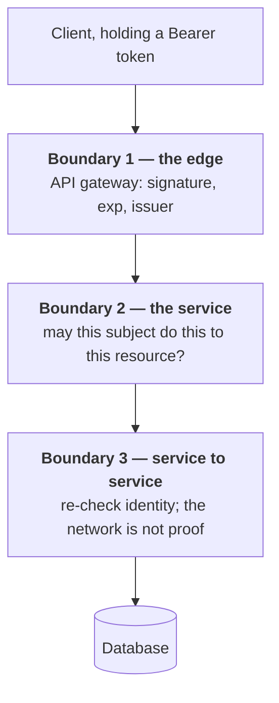

# Foundations: authentication vs authorization

The base layer everything else in this module sits on. If any of this is
shaky, the protocol files won't stick.

---

## Foundations

**Authentication (authn)** — *who are you?* Proving identity. Password,
passkey, TOTP code, client certificate.

**Authorization (authz)** — *what are you allowed to do?* Deciding whether an
already-identified principal may perform an action on a resource.

They're separate concerns and they fail differently. An authn bug lets the
wrong person in. An authz bug lets the right person do the wrong thing — and
authz bugs are far more common in practice, because authn is usually delegated
to a well-tested library or IdP while authz is hand-written business logic
scattered across a codebase.

**The vocabulary that matters:**

| Term | Meaning |
| --- | --- |
| **Principal / subject** | The entity acting — user, service, API key |
| **Credential** | What proves identity — password, key, assertion |
| **Claim** | A statement about a principal — `email`, `role`, `org_id` |
| **Session** | Server-tracked state proving continued authentication |
| **Token** | A bearer artifact carrying identity and/or authorization |
| **Scope** | What a *client application* may request (OAuth) |
| **Permission** | What a *principal* may do (your RBAC layer) |
| **Trust boundary** | Where you stop trusting the caller and must verify |

**Scope vs permission is the distinction people fumble.** A token with
`scope=read:content` means *the application* is allowed to attempt content
reads on the user's behalf. It says nothing about whether *this user* can read
*this particular entry* — that's your RBAC check. Both must pass. Conflating
them is a genuine security bug: it's how you end up granting a low-privilege
user admin access because their client app requested an admin scope.

---

## How it actually works

### Sessions vs tokens

```
  SERVER-SIDE SESSIONS                  STATELESS TOKENS (JWT)
  ════════════════════                  ══════════════════════

  login                                 login
    │                                     │
    ▼                                     ▼
  ┌─────────────────┐                  ┌──────────────────────┐
  │ create session  │                  │ sign {sub,exp,roles} │
  │ store server    │                  │ nothing stored       │
  │ side            │                  └──────────┬───────────┘
  └────────┬────────┘                             │
           │ Set-Cookie: sid=abc123               │ ← token to client
           ▼                                      ▼
    ┌────────────┐                          ┌────────────┐
    │  request   │                          │  request   │
    └─────┬──────┘                          └─────┬──────┘
          │ cookie: sid=abc123                    │ Bearer eyJhbGci…
          ▼                                       ▼
   ╔═════════════════╗                     ┌────────────────┐
   ║ LOOKUP in store ║ ← every request     │ verify sig     │ ← local,
   ║ who is abc123?  ║   network hop       │ locally        │   no I/O
   ╚════════┬════════╝   shared dep        └───────┬────────┘
            ▼                                      ▼
       identified                             identified

  logout / revoke                       logout / revoke
    │                                     │
    ▼                                     ▼
  ┌─────────────────┐                  ┌──────────────────────┐
  │ DELETE the row  │                  │ …nothing you can do. │
  │ → instant,      │                  │ The token stays      │
  │   guaranteed    │                  │ valid until exp.     │
  └─────────────────┘                  └──────────────────────┘

   ✅ instant revocation                 ✅ no shared dependency
   ✅ change privileges live             ✅ scales horizontally
   ❌ lookup per request                 ❌ revocation is HARD
   ❌ store = shared dependency          ❌ stale claims until exp
```

**Server-side sessions.** Revocation is trivial: delete the row. The cost is a
state lookup on every request, and that store becomes a dependency every
service shares — and therefore a single point of failure.

**Stateless tokens.** No lookup, no shared store, horizontal scale without
coordination. **But you have handed out a self-contained credential and cannot
take it back.**

**The standard resolution**, and the one you should be able to state
immediately: short-lived access tokens (5–15 min) plus a long-lived refresh
token that *is* tracked server-side. You accept a bounded window of staleness
on access tokens in exchange for statelessness on the hot path, and you retain
real revocation at the refresh step.

> **In your own work.** This is exactly the trade-off behind your session
> governance suite — "active session termination" only means anything if you
> can answer *how fast* termination actually takes effect. See
> [contentstack](../00-experience/contentstack.md) §6, and [jwt](06-jwt.md) for revocation strategies.

### Trust boundaries


*Stop at boundary 1 and anything that reaches the internal network inherits full trust — the mistake Zero Trust exists to reject.*

A trust boundary is where data stops being trustworthy and must be validated.
The classic senior mistake is enforcing authz only at the edge (API gateway)
and letting internal services trust each other implicitly — so anything that
reaches the internal network can do anything. That assumption is precisely
what Zero Trust rejects (see [zero trust idps](10-zero-trust-idps.md)).


## Building it

**Libraries**

| Need | Library | Why |
| --- | --- | --- |
| Server-side sessions | `express-session` + `connect-redis` | Session store abstraction over Redis; battle-tested, don't hand-roll cookie signing |
| Stateless tokens | `jose` | Signing/verification with JWKS support, actively maintained |

**Pseudocode — the hybrid from "The standard resolution"**

```ts
// Access token: stateless, 10 min, no lookup on the hot path
const accessToken = await new SignJWT({ sub: userId, roles })
  .setProtectedHeader({ alg: 'RS256' })
  .setExpirationTime('10m')
  .sign(privateKey);

// Refresh token: opaque, tracked server-side — this is where revocation lives
const refreshToken = randomBytes(32).toString('hex');
await redis.set(`refresh:${refreshToken}`, userId, 'EX', 60 * 60 * 24 * 30);
```

The access token is never looked up; the refresh token is nothing *but* a
lookup key. Revoking a user is one `DEL` on the refresh side — the access
token they're still holding simply expires within the window you chose.

---

## Interview Q&A

### Q: What's the difference between authentication and authorization?
**Level:** foundation · **Tags:** authn, authz, basics

<details><summary>Model answer</summary>

Authentication establishes *who* the principal is — verifying a credential.
Authorization decides *what* that principal may do — evaluating a policy
against an action and a resource.

They run in that order, and they fail differently: an authn failure means an
impostor got in; an authz failure means a legitimate user exceeded their
privileges. Authz is where most real bugs live, because authn is usually
handled by a battle-tested library or IdP while authz is bespoke logic spread
across the application.

A concrete framing: logging in with a password is authn. Being told you can't
delete another team's content is authz.

</details>

**Follow-ups:**
1. Q: Which fails more often in production, and why?
   <details><summary>Answer</summary>

   Authorization. Authentication is a solved, centralised problem you delegate.
   Authorization is business logic — it's written per-feature, often
   inconsistently, and every new endpoint is a new chance to forget a check.
   It also fails silently: nothing errors when a check is missing, it just
   quietly permits.

   </details>
2. Q: Where should the authorization check live — gateway, service, or data layer?
   <details><summary>Answer</summary>

   Ideally at the service that owns the resource, because only it knows the
   full context (ownership, tenant, state). A gateway can do coarse checks
   (valid token, correct audience, rate limits) but can't make fine-grained
   decisions without duplicating domain knowledge.

   Defence in depth means both: coarse at the edge, authoritative at the owner.
   What you must avoid is the gateway being the *only* check, which makes the
   internal network an implicit trust zone.

   </details>

### Q: Sessions or stateless JWTs — how do you choose?
**Level:** intermediate · **Tags:** sessions, jwt, tradeoffs

<details><summary>Model answer</summary>

It's a trade between revocation and coordination.

Server-side sessions give instant revocation and let you change a user's
privileges immediately, at the cost of a lookup on every request and a store
every service depends on.

Stateless JWTs remove that dependency — any service can verify a signature
locally, which matters for horizontal scale and cross-service calls — but you
can't withdraw a token you've already issued.

In practice most systems land on a hybrid: short-lived access tokens (5–15
minutes) so the damage window is bounded, plus a server-side refresh token
that can be revoked. You get statelessness where the volume is (every API
request) and statefulness where the control is (refresh).

I'd choose pure sessions for a single monolith with a strong immediate-logout
requirement, and the hybrid for a multi-service platform.

</details>

**Follow-ups:**
1. Q: A user's role is downgraded from admin to viewer. When does that take effect?
   <details><summary>Answer</summary>

   With stateless tokens, not until their current access token expires — so
   with a 15-minute TTL they keep admin rights for up to 15 minutes. That's
   usually acceptable, but you have to *decide* it's acceptable rather than
   discover it.

   If it isn't: check a revocation/version list on sensitive operations only,
   bump a per-user token version on privilege change and validate against it,
   or keep authorization decisions out of the token entirely and evaluate
   policy per request (which is the OPA model — see [opa rego](09-opa-rego.md)).

   </details>
2. Q: Doesn't checking a revocation list defeat the point of stateless tokens?
   <details><summary>Answer</summary>

   Partly, and that's the honest answer. But it's not all-or-nothing: you can
   check only on high-value operations, or keep the revocation set small and
   replicated in memory (it only needs entries for tokens revoked *before*
   their natural expiry, which is a tiny set with short TTLs).

   You've moved from "a lookup on every request" to "a cheap local check on
   some requests", which is a real improvement even though it isn't purity.

   </details>

### Q: What's the difference between a scope and a permission?
**Level:** senior · **Tags:** oauth, rbac, authz

<details><summary>Model answer</summary>

A scope constrains what *the client application* is allowed to ask for on the
user's behalf. A permission constrains what *the user* is allowed to do.

They're independent, and both must pass. A token with `scope=delete:content`
means the app may attempt deletions — it does not mean this user may delete
this entry. That's the RBAC check, evaluated against the user's roles in the
relevant tenant.

Treating the scope as the authorization decision is a real vulnerability: any
user of an app requesting admin scopes would inherit admin capability. Scope
is the ceiling on delegation; permission is the actual grant.

</details>

**Follow-ups:**
1. Q: In a multi-tenant system, where does the tenant fit into this?
   <details><summary>Answer</summary>

   It's a third dimension. The same user can be an admin in org A and a viewer
   in org B, so a permission check is meaningless without the tenant context —
   the question is always "may this user do this action on this resource *in
   this org*".

   You resolve the tenant either from the token (an `org_id` claim, meaning a
   token is scoped to one org) or from the request (an org identifier in the
   path or header, with roles resolved per request). The first is simpler and
   safer; the second avoids re-issuing tokens on org switch.

   </details>

---

## What a weak answer sounds like

- **"Authentication is login, authorization is permissions."** True but shallow
  — it's a dictionary answer with no consequence attached. At senior level,
  reach for how they fail differently, without being asked.
- **"JWTs are better because they're stateless."** Stateless is a trade, not a
  virtue. An answer that names only the benefit signals you haven't operated
  one. The revocation problem is the first thing an interviewer will probe.
- **"We validate the token, so the user is authorized."** Conflates authn with
  authz. This is a security bug spoken aloud.
- **Not mentioning tenancy** when the role you're interviewing for is
  multi-tenant. Your entire background is multi-tenant auth; bring it in
  yourself.

---

## Glossary

- **Principal** — the entity performing an action.
- **Claim** — an assertion about a principal, carried in a token.
- **Bearer token** — a credential where possession alone grants access; anyone
  holding it can use it, so transport security is mandatory.
- **Scope** — the delegated capability granted to a client application.
- **Permission** — what a principal may do on a resource.
- **Trust boundary** — the point at which input must be validated.
- **Confused deputy** — a privileged component tricked into acting for a
  less-privileged caller; the attack class OAuth's `audience` and PKCE defend
  against.
- **Defence in depth** — layered checks, so one missed check isn't fatal.
