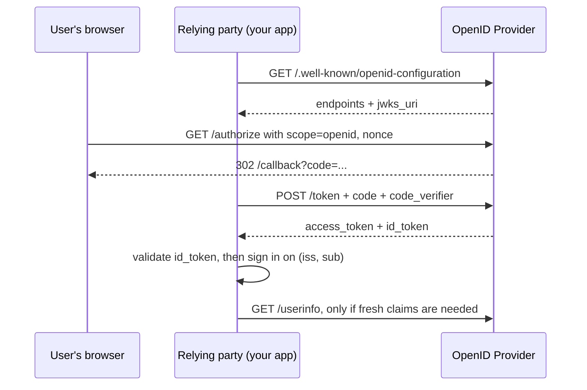
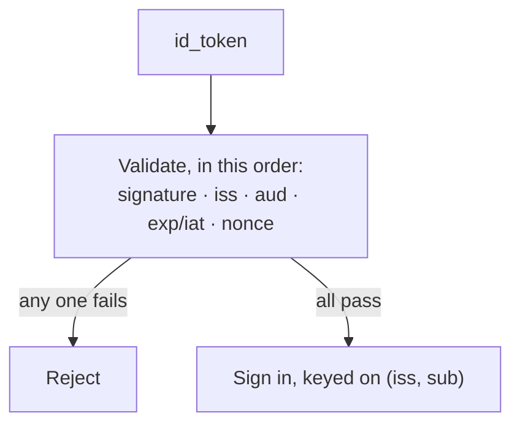

# OpenID Connect (OIDC)

The authentication layer on top of OAuth 2.0. If you take one thing from this
chapter: **OAuth authorises, OIDC authenticates**, and confusing them is the
most common — and most damaging — error in an IAM interview.

Spec: [OpenID Connect Core 1.0](https://openid.net/specs/openid-connect-core-1_0.html)

---

## Foundations

OAuth 2.0 gives a client an access token so it can *act on a user's behalf*.
It says nothing reliable about **who the user is**. People built login on top
of it anyway, badly, and OIDC is the standardisation of doing it properly.

OIDC adds three things to OAuth:

| Addition | What it does |
| --- | --- |
| **`openid` scope** | Signals "this is an authentication request" |
| **ID token** | A JWT *about the user*, for the client, with a verifiable audience |
| **UserInfo endpoint** | Fetch claims about the user with the access token |

Plus standardised claim names (`sub`, `email`, `name`), and discovery so a
client can configure itself from a URL.

**The critical distinction, stated the way you'd say it in an interview:**

- **Access token** — opaque *to the client*, meant for the resource server.
  The client must never parse it or make decisions from it.
- **ID token** — meant *for the client*, describes the authentication event,
  and carries an `aud` claim naming that client.

That `aud` claim is the whole point.

---

## How it actually works

Same flow as OAuth's authorization code + PKCE, with `scope=openid` in the
request and an extra token — the **ID token** — in the `/token` response. The
relying party validates that ID token (`iss`, `aud == my client_id`, signature,
`exp`/`iat`, `nonce`) and, on success, signs the user in keyed on `(iss, sub)`.


*OIDC is the OAuth code flow plus one extra token. Everything that turns it into authentication happens in the validate step, not on the wire.*

### Who's who, and what you actually get back

| Party | Plain terms | Example |
| --- | --- | --- |
| **OP** (OpenID Provider) | Issues the tokens and knows who the user is | Google, Okta, your own auth server |
| **RP** (Relying Party) | Your app, relying on the OP to say who they are | `app.example.com` |
| **End user** | The human signing in | |

The flow is OAuth's authorization code + PKCE, with `openid` in the scope. What
changes is the **response**:

```json
{
  "access_token": "...",        // for calling APIs — opaque to you
  "id_token": "eyJhbGciOiJSUzI1NiIsImtpZCI6ImsxIn0.eyJpc3MiOi...",
  "token_type": "Bearer",
  "expires_in": 900
}
```

That `id_token` is the whole addition. Decoded, its payload looks like:

```json
{
  "iss": "https://auth.example.com",      // who issued it
  "sub": "248289761001",                  // stable user id — key your records on this
  "aud": "dashboard-spa",                 // WHO IT IS FOR — must be your client_id
  "exp": 1761240000,                      // expiry
  "iat": 1761239400,                      // issued at
  "nonce": "n-0S6_WzA2Mj",                // must match what you sent
  "email": "ada@example.com",
  "email_verified": true
}
```

| Claim | What it's for | What goes wrong without it |
| --- | --- | --- |
| `iss` | Which provider issued it | Accept a token from an attacker's own issuer |
| **`aud`** | **Which client it was minted for** | **Token substitution — an attacker's token works on your app** |
| `sub` | Stable user identifier | Keying on email instead breaks when someone changes address |
| `exp` / `iat` | Freshness | Replay of an old token |
| `nonce` | Ties the token to *your* request | Replay of a previously-issued token |
| `email_verified` | Whether the OP checked the address | Auto-linking accounts on an unverified email = takeover |

### Discovery and keys, with the actual calls

A client configures itself from one URL rather than hardcoding endpoints:

```bash
curl https://auth.example.com/.well-known/openid-configuration
```

```json
{
  "issuer": "https://auth.example.com",
  "authorization_endpoint": "https://auth.example.com/authorize",
  "token_endpoint": "https://auth.example.com/token",
  "userinfo_endpoint": "https://auth.example.com/userinfo",
  "jwks_uri": "https://auth.example.com/.well-known/jwks.json",
  "id_token_signing_alg_values_supported": ["RS256"]
}
```

Then fetch the public keys used to verify signatures:

```bash
curl https://auth.example.com/.well-known/jwks.json
```

```json
{"keys":[{"kty":"RSA","kid":"k1","use":"sig","alg":"RS256","n":"0vx7...","e":"AQAB"}]}
```

The token header names which key signed it, and `kid` is how you pick:

```json
{"alg":"RS256","kid":"k1","typ":"JWT"}
```

**Cache JWKS with a TTL, and refetch on an unknown `kid`.** Caching forever
breaks every login when the provider rotates keys; not caching at all means a
network call per login.

### UserInfo, when you want fresh claims

```bash
curl https://auth.example.com/userinfo \
  -H "Authorization: Bearer <access_token>"
```

```json
{"sub":"248289761001","name":"Ada Lovelace","email":"ada@example.com"}
```

Note it takes the **access token**, not the ID token — and `sub` must match the
one in your ID token, or something is wrong.

### Validating the ID token — the part that gets skipped


*Skip any one of these and the token still looks like a successful login — which is exactly why an unvalidated ID token is worse than none.*

An unvalidated ID token is worse than no authentication, because it looks
like authentication. Every check is worth it:

| Check | Attack it stops |
| --- | --- |
| `iss` matches the expected provider | Token from a different, attacker-run issuer |
| **`aud` equals your `client_id`** | **Token minted for another app, replayed at yours** |
| Signature verifies against the provider's JWKS | Forged token |
| `exp` / `iat` are fresh | Replay of an old token |
| `nonce` matches the one you sent | Replay of a previously-issued token |
| `azp` when multiple audiences present | Confused authorised party |

**The `aud` check is the one that matters most.** Without it you have the
classic **confused deputy**: an attacker obtains a valid token for *their* app
— trivial, they control it — and presents it to yours. If you accept any
correctly-signed token from the provider, you're now logged in as them, or as
anyone.

### `nonce` vs `state`

Both are random values echoed back, so they're easy to conflate:

- **`state`** — CSRF protection for the *OAuth flow*. Ties the callback to the
  browser session that started it. Belongs to OAuth.
- **`nonce`** — replay protection for the *ID token*. You send it, the provider
  embeds it in the token, you verify it matches. Belongs to OIDC.

Different layers, both required.

### Discovery and JWKS

`GET https://provider/.well-known/openid-configuration` returns endpoints,
supported algorithms, and the `jwks_uri`. The client fetches public keys from
JWKS to verify signatures, and **caches them with respect to key rotation** —
a provider rotating keys while you cache indefinitely means every login breaks;
fetching JWKS on every request means a hard dependency and rate limits. Cache
with a TTL, and refetch on an unknown `kid`.

> **In your own work.** You ran an OAuth server across all products and shipped
> enterprise SSO. Expect: *"you had OAuth already — what did adding OIDC give
> you?"* and *"how did a client know which tenant a user belonged to?"* See
> [contentstack](../00-experience/contentstack.md) §2.


## Building it

**Libraries**

| Need | Library | Why |
| --- | --- | --- |
| ID token verification | `jose` | `createRemoteJWKSet` + `jwtVerify` do signature, `iss`, `aud`, `exp` in one call |
| Discovery | built into `openid-client`, or a raw `fetch` of `.well-known/openid-configuration` cached at startup |

**Setting it up**

Same client registration as OAuth2 above, with `scope=openid` added. Two
extra things OIDC needs that plain OAuth doesn't:

1. Fetch the discovery document once at startup and cache `jwks_uri` — don't
   refetch it per request.
2. Set the verifying library's expected `audience` to your `client_id` and
   allow a small clock-skew window (commonly 300s) for `exp`/`iat`.

**Pseudocode — validating the ID token**

```ts
import { createRemoteJWKSet, jwtVerify } from 'jose';
const JWKS = createRemoteJWKSet(new URL(jwks_uri));

async function verifyIdToken(idToken: string, expectedNonce: string) {
  const { payload } = await jwtVerify(idToken, JWKS, {
    issuer: 'https://auth.example.com',
    audience: CLIENT_ID,
  });
  if (payload.nonce !== expectedNonce) {
    throw new Error('nonce mismatch — possible replay');
  }
  return payload; // sign in keyed on (payload.iss, payload.sub)
}
```

`jwtVerify` covers signature, `iss`, `aud`, `exp` in one call — `nonce` is the
one check no library can do for you, because only your app knows what it sent.

---

## Interview Q&A

### Q: What's the difference between OAuth 2.0 and OpenID Connect?
**Level:** foundation · **Tags:** oidc, oauth2, basics

<details><summary>Model answer</summary>

OAuth 2.0 is authorization — it issues an access token so an application can
act on a user's behalf against an API. It deliberately says nothing about who
the user is.

OIDC is an authentication layer built on top of it. It adds the `openid`
scope, an **ID token** (a JWT describing the authentication event, addressed to
the client via its `aud` claim), a UserInfo endpoint, standard claim names, and
discovery.

The practical difference: with plain OAuth, receiving an access token tells you
the user authorised *something* — it isn't proof of identity, and the token
isn't addressed to you. With OIDC you get a token that names your client as its
audience, is signed, and can be validated, which is what makes it safe to log
someone in.

"Log in with Google" is OIDC. Using OAuth alone for login is a known
anti-pattern that leads to token-substitution attacks.

</details>

**Follow-ups:**

1. Q: Why is using an access token to identify a user unsafe?
   <details><summary>Answer</summary>

   Because an access token has no binding to the client that received it. It's
   issued for a resource server, and to the client it's meant to be opaque.

   The attack is straightforward: an attacker builds their own app, gets a user
   to authorise it — or uses their own account — and obtains a valid access
   token from the same provider. They present that token to your app. If your
   app's logic is "the provider accepted this token, so the user is who the
   token's userinfo says", you've just authenticated the attacker's session
   against your app. This is the **confused deputy** problem.

   The ID token fixes it by carrying `aud` — you check it names *your*
   client_id and reject anything else. There is no equivalent check on a bare
   access token.

   </details>

2. Q: A client is receiving an ID token. Which checks must it perform?
   <details><summary>Answer</summary>

   Signature against the provider's JWKS, with the `kid` from the header
   selecting the key. `iss` exactly matching the expected issuer. **`aud`
   equal to my own client_id.** `exp` not passed and `iat` recent. `nonce`
   equal to the value I generated for this request.

   If multiple audiences are present, `azp` must be my client_id too.

   The two that get skipped are `aud` and `nonce`, and they're the two that
   stop the real attacks — token substitution and replay respectively. Also
   worth stating: never accept `alg: none`, and never let the token's header
   choose the verification algorithm, which is the classic JWT bypass.

   </details>

3. Q: What happens if the provider rotates its signing keys?
   <details><summary>Answer</summary>

   Your cached JWKS goes stale and signature validation fails for every new
   token — a total login outage, and one that arrives without a deploy.

   The correct behaviour: cache JWKS with a TTL, and treat an unknown `kid` as
   a trigger to refetch immediately rather than a validation failure. Providers
   publish both old and new keys during an overlap window precisely so clients
   can pick up the new one before the old is withdrawn.

   The two failure modes are caching forever (breaks on rotation) and not
   caching at all (a network call per login, plus provider rate limits and a
   hard availability dependency).

   </details>

### Q: What's the difference between `nonce` and `state`?
**Level:** intermediate · **Tags:** oidc, oauth2, security

<details><summary>Model answer</summary>

They look alike — random values you send and verify on return — but they
protect different layers.

`state` is OAuth's CSRF defence. The client generates it, ties it to the
browser session, and checks it on the callback. It stops an attacker injecting
their own authorization code into your session so that your account gets bound
to their identity.

`nonce` is OIDC's replay defence for the ID token specifically. The client
sends it in the authorization request, the provider embeds it in the issued ID
token, and the client verifies the value matches. It stops a previously-issued
ID token being replayed at the client later.

You need both, and one does not substitute for the other. PKCE is a third,
separate thing — it binds the authorization code to the token exchange.

</details>

**Follow-ups:**

1. Q: PKCE, state and nonce all protect the flow. Is that redundant?
   <details><summary>Answer</summary>

   No — three attacks, three defences, and it's worth being able to separate
   them because interviewers use this to test depth.

   **PKCE** — an attacker who *intercepts the authorization code* can't
   exchange it, because they don't have the verifier.

   **`state`** — an attacker can't *inject their own code* into your session,
   because the callback won't match the value bound to your session.

   **`nonce`** — an attacker can't *replay an old ID token*, because it won't
   carry the nonce for this request.

   They overlap slightly in effect but not in coverage. Dropping any one leaves
   a real gap.

   </details>

### Q: ID token claims or the UserInfo endpoint — which should a client use?
**Level:** senior · **Tags:** oidc, design

<details><summary>Model answer</summary>

Depends on freshness and size, and there's a real trade.

The **ID token** is a snapshot at authentication time. It's already in hand, no
extra call, and it's signed — but its claims are frozen at issuance, and
stuffing a lot into it makes every request carrying it larger. If a user
changes their name or has a role revoked, the ID token doesn't know.

**UserInfo** is a live call with the access token, so claims are current and
the token stays small — at the cost of a network round trip and a runtime
dependency on the provider.

In practice: put the stable identifier (`sub`) and whatever you need to
establish the session in the ID token; fetch volatile or bulky profile data
from UserInfo, and cache it in your own user record rather than refetching per
request.

The thing I'd flag is that **`sub` is the only claim you should key your user
records on**. Email is mutable and can be reassigned; keying on it means a
changed address orphans the account, or worse, a reassigned corporate address
grants someone else's access.

</details>

**Follow-ups:**

1. Q: `sub` is unique per provider. What about a user with accounts at several providers?
   <details><summary>Answer</summary>

   `sub` is only unique *within an issuer*, so the real key is the pair
   `(iss, sub)`. Two providers can independently issue the same `sub` value,
   so storing `sub` alone across multiple IdPs is a collision waiting to
   happen — and a potential account takeover.

   For account linking — the same human arriving via Google and via corporate
   SSO — you need a deliberate flow: link on verified email, but only if the
   provider asserts `email_verified`, and ideally with an explicit confirmation
   step. Auto-linking on unverified email is a well-known takeover vector:
   register at a sloppy IdP with someone else's address, sign in, inherit their
   account.

   </details>

2. Q: How would you handle tenant identity in a multi-tenant platform using OIDC?
   <details><summary>Answer</summary>

   The tenant has to be explicit, and there are two shapes.

   **Tenant-per-connection**: each customer's IdP is a separate connection, so
   the issuer identifies the tenant. Clean, and it fails safe — a token from
   tenant A's issuer can't be mistaken for tenant B. It's how most B2B SaaS do
   enterprise SSO.

   **Tenant as a claim**: one issuer, an `org_id` claim in the token. Simpler
   to operate, but now every authorization check must use that claim, and you
   are trusting the provider to populate it correctly.

   Either way the invariant is the same: resolve tenant before authorising
   anything, and never infer it from the resource being requested. That's the
   cross-tenant vulnerability class.

   </details>

---

## What a weak answer sounds like

- **"OIDC is just OAuth with a login screen."** Misses the ID token entirely,
  which is the whole substance of the standard.
- **"We decode the access token to get the user's email."** Two errors: access
  tokens are opaque to the client, and their format is not a contract. The
  provider can change it and your login breaks.
- **Listing ID token checks but omitting `aud`.** The one that stops the actual
  attack.
- **"We match users on email."** Emails change and get reassigned. `(iss, sub)`.
- **Conflating `nonce` and `state`**, or asserting one replaces the other.

---

## Glossary

- **OP / Relying Party** — OpenID Provider (issues tokens) / the client app.
- **ID token** — signed JWT about the authentication event, addressed to the
  client via `aud`.
- **UserInfo** — endpoint returning claims, called with the access token.
- **`sub`** — stable subject identifier, unique within an issuer.
- **`nonce`** — replay protection for the ID token.
- **`azp`** — authorised party, when a token has multiple audiences.
- **JWKS** — the provider's published public keys, selected by `kid`.
- **Discovery** — `/.well-known/openid-configuration`, self-configuration.
- **Confused deputy** — a privileged component tricked into acting for a
  less-privileged caller; what `aud` validation prevents.
