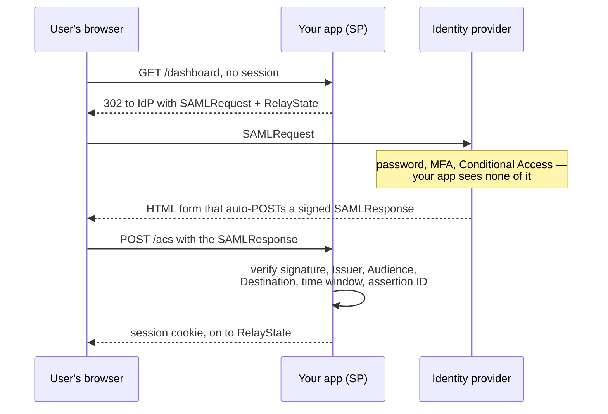
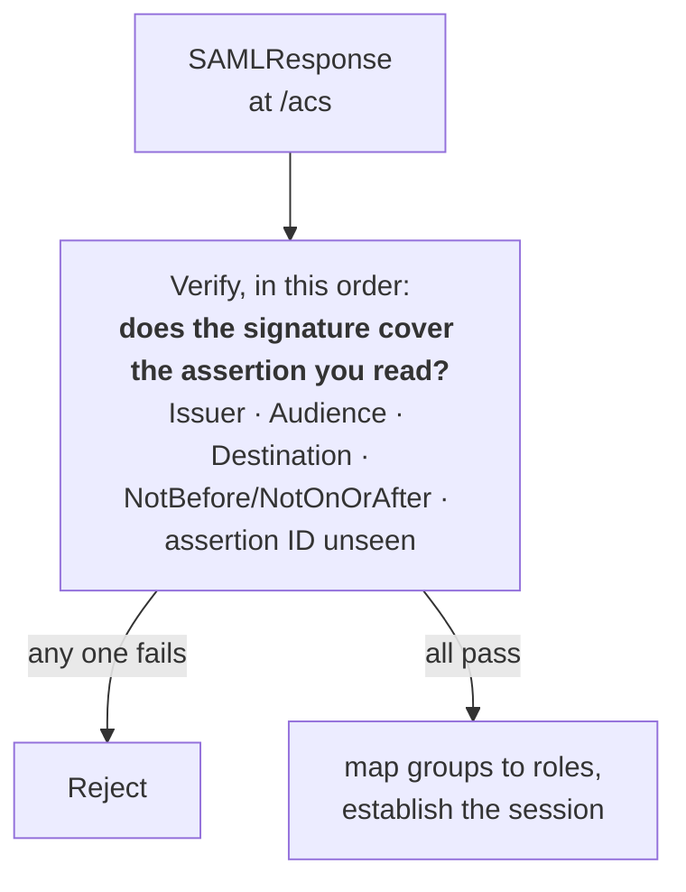

# SAML 2.0 and enterprise SSO

The protocol enterprise buyers actually have. You shipped native SSO apps into
the Okta and Entra ID marketplaces, so expect this to go past "explain SAML"
into operating it for many tenants.

Spec: [SAML 2.0 Technical Overview (OASIS)](https://docs.oasis-open.org/security/saml/Post2.0/sstc-saml-tech-overview-2.0.html)

---

## Foundations

**SSO** is the outcome: authenticate once with your organisation's identity
provider, reach many applications without authenticating again. **SAML** is one
protocol that delivers it; OIDC is the other.

The three roles:

| Role | Who | Also called |
| --- | --- | --- |
| **IdP** — Identity Provider | Okta, Entra ID, Ping | The org's source of truth |
| **SP** — Service Provider | Your product | The "relying party" in OIDC terms |
| **Principal** | The employee logging in | |

**Why enterprises want it.** Not developer preference — control. One place to
enforce MFA and password policy. One place to disable a leaving employee and
have access die everywhere. Auditability across every SaaS the company buys.
Selling to enterprise without SSO means failing the security questionnaire.

**SAML vs OIDC, honestly.** OIDC is the better-engineered protocol — JSON and
JWTs, far simpler to implement correctly, no XML canonicalisation footguns. But
SAML has been the corporate standard since the mid-2000s, and the customer's
IdP, identity team and procurement checklist are all built around it. You
support what the buyer has. Most B2B platforms ship both.

---

## How it actually works

**SP-initiated** (the common case — user starts at your app). No session, so
your app 302s the browser to the IdP with a `SAMLRequest` and a `RelayState`
bookmark. The IdP runs its own password + MFA + Conditional Access — you see
none of it — then returns an HTML form that auto-POSTs a signed `SAMLResponse`
to your ACS URL. Your app verifies the signature covers what it reads, checks
`Issuer`, `Audience` = your entityID, `Destination`, the `NotBefore`/`NotOnOrAfter`
window and that the assertion ID is unseen, then maps groups to roles and
establishes a session.

**IdP-initiated** — the user starts in their Okta dashboard and clicks your
tile, so an unsolicited `SAMLResponse` arrives at your ACS with no
corresponding request. It's convenient and enterprises expect it, but it's
strictly weaker: there's no `InResponseTo` to correlate, so CSRF-style
injection of someone else's assertion is easier to attempt, and replay defence
rests entirely on your assertion-ID cache.


*Every hop goes through the browser as a redirect or an auto-submitting form. There is no back channel to fall back on, which is what makes the signature checks load-bearing.*

### Walking the flow, with what actually moves

There is no curl for most of SAML — it travels through the browser as
redirects and auto-submitting forms. That *is* the design, and saying so shows
you understand the difference from a REST API.

**1. Your app builds an `AuthnRequest`** and redirects. Deflated and
base64-encoded into the URL:

```
302 Location: https://acme.okta.com/app/example_sso/sso/saml
                ?SAMLRequest=fVLLTsMwEPyVyPfEiZs2rZVEKu0BJB4RLRy4IMfZUqPE...
                &RelayState=%2Fdashboard%2Fentries
```

| Parameter | What it is |
| --- | --- |
| `SAMLRequest` | The deflated, base64'd XML asking the IdP to authenticate |
| `RelayState` | Where to send the user *after* login — your own bookmark |

**2. The IdP authenticates the user** — password, MFA, Conditional Access.
You see none of this, which is exactly what the customer is buying.

**3. The IdP POSTs an assertion back** via an auto-submitting HTML form:

```html
<form method="POST" action="https://app.example.com/sso/acs">
  <input type="hidden" name="SAMLResponse" value="PHNhbWxwOlJlc3BvbnNlIHhtbG5z..."/>
  <input type="hidden" name="RelayState" value="/dashboard/entries"/>
</form>
```

Decoded, the assertion is the thing you validate:

```xml
<saml:Assertion ID="_a1b2c3" IssueInstant="2026-09-06T09:15:00Z">
  <saml:Issuer>http://www.okta.com/exk1a2b3c4</saml:Issuer>
  <ds:Signature>…</ds:Signature>                    <!-- verify this -->
  <saml:Subject>
    <saml:NameID Format="…emailAddress">ada@acme.com</saml:NameID>
  </saml:Subject>
  <saml:Conditions NotBefore="2026-09-06T09:14:30Z"
                   NotOnOrAfter="2026-09-06T09:20:00Z">
    <saml:AudienceRestriction>
      <saml:Audience>https://app.example.com/metadata</saml:Audience>
    </saml:AudienceRestriction>
  </saml:Conditions>
  <saml:AttributeStatement>
    <saml:Attribute Name="groups">
      <saml:AttributeValue>acme-engineering</saml:AttributeValue>
      <saml:AttributeValue>acme-admins</saml:AttributeValue>
    </saml:Attribute>
  </saml:AttributeStatement>
</saml:Assertion>
```

### Every element, and what it's for

| Element | Purpose | If you skip checking it |
| --- | --- | --- |
| `Issuer` | Which IdP sent it | You accept another org's IdP for this tenant |
| `ds:Signature` | Proof it wasn't altered | Anyone can forge an assertion |
| `NameID` | Who the user is | — |
| `NotBefore` / `NotOnOrAfter` | Validity window | Old assertions replay forever |
| **`Audience`** | **Which SP may consume it** | **An assertion for another SP works on yours** |
| `Attribute name="groups"` | What you map to roles | No role assignment |
| `ID` (`_a1b2c3`) | Unique per assertion | Straight replay of the same assertion |

The two you must not skip are the **signature** and the **`Audience`**. The
`Audience` check is SAML's equivalent of OIDC's `aud` claim, and skipping it is
the same vulnerability.

### The one call you *can* curl

Metadata — how the SP and IdP exchange configuration:

```bash
curl https://app.example.com/sso/metadata
```

```xml
<EntityDescriptor entityID="https://app.example.com/metadata">
  <SPSSODescriptor>
    <AssertionConsumerService
      Binding="urn:oasis:names:tc:SAML:2.0:bindings:HTTP-POST"
      Location="https://app.example.com/sso/acs" index="0"/>
  </SPSSODescriptor>
</EntityDescriptor>
```

`entityID` is what the IdP puts in `Audience`. `Location` is your ACS URL.
Those two values plus their signing certificate are the whole per-tenant
configuration.

### The bindings

A **binding** is how the message rides HTTP:

- **HTTP-Redirect** — message deflated, base64'd, in the query string. Used for
  the `AuthnRequest`; URL length limits make it unsuitable for assertions.
- **HTTP-POST** — base64 in a form field, auto-submitted by JavaScript. Used for
  the `SAMLResponse`, because assertions are large.
- **HTTP-Artifact** — pass a reference, SP fetches the real thing over a back
  channel. Rare, but genuinely more secure: the assertion never touches the
  browser.


*The first check is deliberately two questions: a signature that is valid over some other element is the classic signature-wrapping bypass.*

### Validating an assertion

This is where implementations get breached. Every check maps to an attack:

| Check | Attack it stops |
| --- | --- |
| Signature verifies **over the element you consume** | Signature wrapping |
| `Issuer` is the one expected *for this tenant* | Assertion from another org's IdP |
| **`AudienceRestriction` == your entityID** | Assertion minted for a different SP, replayed at yours |
| `Destination` == your ACS URL | Endpoint confusion |
| `NotBefore` / `NotOnOrAfter` within skew | Replay of an expired assertion |
| Assertion ID unseen (cache until expiry) | Straight replay |
| `InResponseTo` matches your request (SP-initiated) | Injected unsolicited response |

**XML Signature Wrapping (XSW)** is the attack worth naming. XML signatures
cover a referenced element, and the signature can still verify while a parser
reads a *different* element. The attacker keeps the validly-signed original,
adds a forged assertion elsewhere in the document, and the SP validates one
element but consumes the other. It has produced real CVEs in many SAML
libraries.

The defence is not clever validation logic — it's *never write your own*. Use a
maintained library, keep it patched, and ensure the code that reads the
assertion reads the same node that was verified.

### Multi-tenant SAML

Each customer brings their own IdP, so per tenant you store: entityID, SSO
URL, the signing certificate, and attribute mappings (their `groups` claim →
your roles). Practical realities you should be able to speak to:

- **Certificate expiry** is the number one support ticket. Certs expire, SSO
  breaks for a whole company at once, and nobody noticed the renewal email.
  Monitor expiry dates and alert weeks ahead — this is an operational answer
  that signals you've actually run it.
- **A break-glass local admin** per tenant, so a misconfigured SSO doesn't lock
  a customer out of their own account entirely.
- **JIT provisioning** — create the user on first successful SSO — versus SCIM,
  which provisions ahead of time and, importantly, *deprovisions*.

> **In your own work.** You partnered with Okta and Entra engineering to ship
> marketplace apps. Expect questions on their review process, on attribute
> mapping across tenants, and on what happens when a customer's cert rotates.
> See [contentstack](../00-experience/contentstack.md) §2.


## Building it

**Libraries**

| Need | Library | Why |
| --- | --- | --- |
| SP-side SAML | `@node-saml/passport-saml` (or `samlify`) | Builds the AuthnRequest, validates the SAMLResponse's signature, conditions and replay — this is not code worth hand-rolling |

**Setting it up — creating the SAML app integration**

1. Okta admin → **Applications → Create App Integration → SAML 2.0**.
2. Set the **Single sign-on URL** to your ACS URL, and the **Audience URI
   (SP entityID)** — these are exactly the two fields "Validating an
   assertion" above checks the assertion's `Destination` and `Audience`
   against.
3. Configure **Attribute Statements** to map Okta groups to a role claim, so
   the assertion arrives already carrying what you need to establish a
   session.
4. Download the **IdP metadata** (or copy the SSO URL and signing
   certificate) — your SP needs the certificate to verify the signature.

**Pseudocode — verifying an assertion**

```ts
import { Strategy as SamlStrategy } from '@node-saml/passport-saml';

passport.use(new SamlStrategy({
  entryPoint: idpSsoUrl,
  issuer: spEntityId,
  cert: idpSigningCert,          // from the metadata in step 4
  audience: spEntityId,
  wantAssertionsSigned: true,    // reject anything the IdP didn't sign
}, (profile, done) => {
  // profile.nameID, profile.groups — map to a session here
  done(null, toSessionUser(profile));
}));
```

The library owns the signature, time-window and replay checks from
"Validating an assertion". `wantAssertionsSigned: true` is the one flag that
turns them on — leaving it at its default is the classic misconfiguration.

---

## Interview Q&A

### Q: Walk me through an SP-initiated SAML login.
**Level:** intermediate · **Tags:** saml, sso, flows

<details><summary>Model answer</summary>

The user hits our app without a session. We identify their tenant — usually
from the email domain or a tenant-specific URL — and look up that tenant's IdP
configuration.

We build a `SAMLRequest` (an `AuthnRequest`) and redirect the browser to the
IdP's SSO URL using the HTTP-Redirect binding, deflated and base64-encoded.

The IdP authenticates the user against its own policy — password, MFA,
conditional access, whatever the org enforces. We don't see or control any of
that, which is precisely what the customer is buying.

The IdP returns a `SAMLResponse` containing a signed assertion, delivered via
the HTTP-POST binding: an auto-submitting form that POSTs to our Assertion
Consumer Service URL.

We then validate: signature against that tenant's configured certificate,
issuer matches, `AudienceRestriction` is our entityID, `Destination` is our ACS
URL, the `NotBefore`/`NotOnOrAfter` window is current allowing for clock skew,
`InResponseTo` matches the request we sent, and the assertion ID hasn't been
seen before.

Only then do we map attributes to a local user and establish a session.

</details>

**Follow-ups:**

1. Q: You said "identify their tenant". How, before they've authenticated?
   <details><summary>Answer</summary>

   Home realm discovery, and there are three usual approaches.

   **Email domain** — ask for the email first, map the domain to a tenant, then
   redirect. Familiar, but it leaks which domains are customers, and it breaks
   for a company with several domains unless you map them all.

   **Tenant-specific URL** — `acme.yourapp.com` or `/login/acme`. Unambiguous,
   no guessing, and it's what most B2B products settle on.

   **IdP-initiated** — the question doesn't arise, because the assertion tells
   you the issuer. But then you're relying on issuer-to-tenant mapping being
   unique, so two tenants must never share an issuer, or you can cross wires.

   </details>

2. Q: What's XML signature wrapping, and how do you defend against it?
   <details><summary>Answer</summary>

   An XML signature covers a specific referenced element. The attack keeps a
   genuinely-signed assertion in the document but restructures the XML so the
   application reads a *different*, attacker-controlled element — while
   signature verification still passes over the original. Signature valid,
   content attacker's.

   It has caused real CVEs across many SAML libraries because the gap is
   between "verify" and "consume" being two separate traversals of the
   document.

   Defence: use a maintained library rather than assembling XML parsing and
   signature verification yourself; make sure the code that extracts claims
   reads the exact node that was verified, not a fresh XPath query; verify the
   signature covers the whole assertion or response as configured; and keep
   the library patched, because this class recurs.

   The meta-answer, and the honest one: SAML is a protocol where writing your
   own implementation is a mistake.

   </details>

3. Q: What if the assertion is valid but the user doesn't exist in your system?
   <details><summary>Answer</summary>

   That's the JIT-provisioning decision, and it's a policy question as much as
   a technical one.

   **JIT create** — the assertion is trusted, so create the user from its
   attributes on first login. Frictionless, and it's what most products do. The
   risk is that anyone the IdP authenticates gets an account, so if the
   customer's IdP covers contractors or the whole company, your seat count and
   access surface grow silently.

   **Require pre-provisioning** — reject the login if there's no user, and
   require SCIM or an invite first. Tighter control, and it's what
   security-conscious customers want, but it means SSO alone isn't enough to
   onboard.

   The nuance worth adding: JIT creates but never *deletes*. A user who leaves
   the company stops being able to log in — the IdP won't authenticate them —
   but their account, sessions and API tokens persist in your system. That's
   why SCIM matters alongside SSO, and it's the gap the next chapter covers.

   </details>

### Q: SAML or OIDC for a new integration — how do you choose?
**Level:** senior · **Tags:** saml, oidc, tradeoffs

<details><summary>Model answer</summary>

Technically OIDC, almost always. JSON and JWTs instead of XML, no
canonicalisation or signature-wrapping surface, far better mobile and SPA
story, simpler to implement correctly, and discovery makes configuration
largely automatic.

Practically, you support what the customer has. Large enterprises have had
SAML deployed for fifteen years; their identity team knows it, their IdP is
configured for it, and their security questionnaire asks for it by name. Telling
a customer their IdP is outdated does not win the deal.

So a B2B platform ships both: OIDC as the modern path and for anything mobile
or first-party, SAML because enterprise procurement requires it. What you can
do is normalise them internally — both flows produce the same
"authenticated principal + attributes" object, so the rest of the system never
branches on protocol. That's the design point I'd make: keep the protocol
difference at the edge.

</details>

**Follow-ups:**

1. Q: A customer's SSO breaks at 9am and their whole company is locked out. Walk me through it.
   <details><summary>Answer</summary>

   First, scope it: one tenant or many? One tenant points at their
   configuration or their IdP; many points at us.

   For a single tenant, the overwhelmingly likely cause is **an expired signing
   certificate** — it's the most common SSO failure in production by a wide
   margin. Others: the customer changed IdP configuration, rotated a cert
   without telling us, changed the entityID, or their IdP itself is down.

   Immediate mitigation matters more than diagnosis: the customer needs a way
   in. That's what a break-glass local admin account is for — password-based,
   MFA-enforced, exempt from the SSO requirement. If we haven't provided one,
   the customer is fully locked out of their own tenant and we're doing manual
   intervention under pressure, which is exactly the wrong time.

   Then the prevention answer, which is what the question is really testing:
   monitor certificate expiry across every tenant and alert weeks ahead;
   support two valid certs during rotation so it's not a hard cutover; and
   surface SSO health in the customer's own admin UI so their identity team
   sees it before their employees do.

   </details>

2. Q: How do you map a customer's IdP groups to roles in your product?
   <details><summary>Answer</summary>

   Attribute mapping, configured per tenant, and the interesting part is that
   customers' group structures are nothing alike.

   The mechanics: the assertion carries attributes — often a multi-valued
   `groups` or `memberOf` — and the tenant's configuration maps those values to
   our roles. `acme-engineering` → Editor.

   The design decisions I'd raise. **Whether the IdP is authoritative on every
   login**: if it is, in-app role changes get overwritten at next sign-in,
   which is what most enterprises actually want — one source of truth. If it
   isn't, the two drift.

   **Unmapped groups**: default to the lowest-privilege role, never to nothing
   (user is stuck) and never to a permissive default.

   **Group explosion**: enterprises send hundreds of groups in an assertion,
   which bloats it and can hit header/size limits. Filter to relevant prefixes.

   And **never derive admin from an unfiltered group name match** — a customer
   can create a group called anything. Mapping must be explicit configuration,
   not pattern matching.

   </details>

### Q: What does SSO *not* solve?
**Level:** senior · **Tags:** sso, scim, lifecycle

<details><summary>Model answer</summary>

SSO controls *authentication at login time*. It does not control the lifecycle
of accounts, and that gap is where the real security exposure sits.

Concretely: when an employee is terminated, disabling them in the IdP stops
future logins. It does not delete their account in your product, does not
invalidate their existing session, and does not revoke API tokens or personal
access tokens they created. If your sessions are long-lived, they may retain
access for hours or days after being walked out of the building.

SCIM closes the account-lifecycle half — the IdP pushes deactivation as it
happens. Session and token revocation is *your* responsibility on receiving
that signal, and it's the part apps most often skip.

The complete picture is three layers: SSO for authentication, SCIM for
lifecycle, and your own session/token revocation reacting to both. Being able
to say that without being asked is the difference between having integrated SSO and
having thought about identity.

</details>

---

## Worked example: role mapping at login, and how far to trust the IdP

Once SSO is live, the recurring design question is: **when a user signs in
via SAML, where do their in-app roles come from?** Three positions, in order
of how much you trust the IdP:

- **IdP as source of truth for group membership only.** The assertion
  carries group names; your app maps groups → roles at every login (JIT —
  just-in-time provisioning), so a group change on the IdP side takes effect
  on the user's next sign-in with no sync job needed.
- **Strict SSO.** Once an org enables it, in-app role edits are disabled for
  SSO users entirely — the IdP is the only place roles change, closing the
  "admin edited a role that got silently overwritten by the next SAML login"
  class of bug, at the cost of losing per-app role nuance.
- **Provisioning gap for orgs without group support.** Not every IdP
  configuration sends usable groups; the honest fallback is a default role
  on first login plus a manual assignment step, and saying so explicitly is
  better than implying every SSO integration gets full JIT role mapping.

The follow-up worth having an answer for: **what happens to a user's
sessions when their SSO role changes or they're deprovisioned?** If
sessions are stateless (a signed cookie or JWT), the answer is "nothing,
until it expires" — which is usually not acceptable for immediate access
revocation, and is the strongest argument for opaque, centrally-checked
sessions over stateless ones on an enterprise product.

---

## What a weak answer sounds like

- **"SAML is the old one, OIDC is the new one, so use OIDC."** True and
  useless. The question is what your customers have.
- **Describing the flow but not the validation.** The flow is public knowledge;
  knowing which checks stop which attacks is what they are looking for.
- **Omitting `AudienceRestriction`.** Same class of miss as omitting `aud` in
  OIDC, and it's the assertion-replay hole.
- **"We parse the XML and read the attributes."** If you built the parsing
  yourself, that's a red flag, not a credential.
- **Treating SSO as complete identity integration.** Without deprovisioning,
  leavers keep accounts.

---

## Glossary

- **IdP / SP** — issues assertions / consumes them (your app).
- **Assertion** — signed XML statement about an authenticated principal.
- **ACS** — Assertion Consumer Service; your endpoint receiving the POST.
- **entityID** — the unique identifier of an SP or IdP.
- **AudienceRestriction** — names the SP allowed to consume the assertion.
- **Binding** — how a message rides HTTP: Redirect, POST, Artifact.
- **Metadata** — XML describing endpoints, certs, entityID; how SP and IdP
  exchange configuration.
- **XSW** — XML Signature Wrapping; signature valid, content swapped.
- **JIT provisioning** — create the account on first successful SSO.
- **Break-glass account** — local admin exempt from SSO, for when SSO breaks.
- **Home realm discovery** — working out which IdP a user belongs to.
