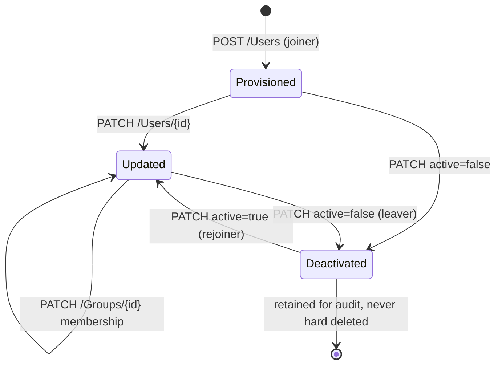

# SCIM — provisioning and deprovisioning

SSO decides who may log in *now*. SCIM decides who *exists* and what they're
entitled to, continuously. The gap between them is where leavers keep access.

Spec: [RFC 7644 (Protocol)](https://www.rfc-editor.org/info/rfc7644/) ·
[RFC 7643 (Schema)](https://www.rfc-editor.org/info/rfc7643/)

---

## Foundations

**System for Cross-domain Identity Management** — a REST API with a defined
schema that an identity provider calls to keep user and group records in your
application in step with theirs.

The IdP is the client; **your app is the SCIM server**. That inversion catches
people out: you implement endpoints, Okta and Entra call them.

**The security argument**, which is the one to lead with:

Without SCIM, offboarding depends on someone remembering to remove the user
from every SaaS tool. With a nightly CSV sync, a terminated employee retains
access for up to 24 hours — precisely the window that matters after an
involuntary departure.

---

## How it actually works

Standard REST over a `/scim/v2` base:

| Method | Path | Meaning |
| --- | --- | --- |
| `POST` | `/Users` | Create |
| `GET` | `/Users/{id}` | Read |
| `GET` | `/Users?filter=userName eq "x"` | Search |
| `PUT` | `/Users/{id}` | Replace the whole resource |
| `PATCH` | `/Users/{id}` | Partial update — **the important one** |
| `DELETE` | `/Users/{id}` | Delete |
| | `/Groups` | Same verbs, for group membership |


*The leaver path is a PATCH, not a DELETE. The account has to outlive the person, or "who published this?" stops having an answer a year later.*

### The entities, and what a user actually looks like

| Party | Role | Example |
| --- | --- | --- |
| **IdP** | The SCIM **client** — it calls you | Okta, Microsoft Entra ID |
| **Your app** | The SCIM **server** — you implement the endpoints | `api.example.com/scim/v2` |
| **`User` resource** | One person, in SCIM's schema | |
| **`Group` resource** | A collection, usually mapped to a role | |

That inversion catches people out: **you build the API, the IdP calls it.**

A SCIM user, as Okta would send it:

```json
{
  "schemas": ["urn:ietf:params:scim:schemas:core:2.0:User"],
  "userName": "ada@acme.com",
  "name": { "givenName": "Ada", "familyName": "Lovelace" },
  "emails": [{ "value": "ada@acme.com", "primary": true }],
  "active": true,
  "externalId": "00u1a2b3c4d5e6f7g8h9"
}
```

| Field | Why it matters |
| --- | --- |
| `userName` | The unique key. Usually corporate email |
| `active` | **The access switch.** `false` = deprovisioned |
| `externalId` | The IdP's own id — store it, it's how updates correlate |
| `schemas` | Declares which schema the body follows |

### The lifecycle, as real requests

**1. Does this user exist?** The IdP checks before creating — which is why
`filter` support is not optional:

```bash
curl 'https://api.example.com/scim/v2/Users?filter=userName%20eq%20%22ada@acme.com%22' \
  -H "Authorization: Bearer <scim_token>"
```

```json
{ "schemas":["urn:ietf:params:scim:api:messages:2.0:ListResponse"],
  "totalResults": 0, "Resources": [] }
```

Miss this endpoint and the IdP creates duplicates on every sync.

**2. New hire — create:**

```bash
curl -X POST https://api.example.com/scim/v2/Users \
  -H "Authorization: Bearer <scim_token>" \
  -H "Content-Type: application/scim+json" \
  -d '{
    "schemas":["urn:ietf:params:scim:schemas:core:2.0:User"],
    "userName":"ada@acme.com",
    "name":{"givenName":"Ada","familyName":"Lovelace"},
    "emails":[{"value":"ada@acme.com","primary":true}],
    "active":true,
    "externalId":"00u1a2b3c4d5e6f7g8h9"
  }'
```

You reply `201 Created` with the resource plus **your** `id` — the IdP stores
that id and uses it for every later call.

**3. Role change — the IdP PATCHes:**

```bash
curl -X PATCH https://api.example.com/scim/v2/Users/9f8e7d6c \
  -H "Content-Type: application/scim+json" \
  -d '{
    "schemas":["urn:ietf:params:scim:api:messages:2.0:PatchOp"],
    "Operations":[{"op":"replace","path":"name.givenName","value":"Ada"}]
  }'
```

**4. Departure — deprovision. This is the request that matters:**

```bash
curl -X PATCH https://api.example.com/scim/v2/Users/9f8e7d6c \
  -H "Content-Type: application/scim+json" \
  -d '{
    "schemas":["urn:ietf:params:scim:api:messages:2.0:PatchOp"],
    "Operations":[{"op":"replace","path":"active","value":false}]
  }'
```

### The detail that breaks real integrations

**Okta and Entra ID deprovision by sending `PATCH` with `active: false` — not
`DELETE`.**

An app that only implements `DELETE` for offboarding will pass a naive test
and then silently fail to deprovision anyone in production. The account stays
active, and everyone believes offboarding works because the IdP reports
success — it did what the spec says; you ignored it.

So: **treat `active: false` as the deprovisioning signal** (the step 4 request
above), and treat `DELETE` as deactivation too rather than a hard delete.

### Deactivate, never hard delete

Hard deletion is wrong for two independent reasons: their content loses its
owner or cascade-deletes, and audit trails must outlive the user — you have to
be able to answer "who published this?" a year later.

Correct behaviour on deprovision:

1. Mark the user inactive.
2. **Revoke every session and API token immediately.** This is the step apps
   skip, and it's the one that matters — a deactivated user with a live
   session is still logged in.
3. Keep the record, attribution and audit history.
4. Let an admin transfer ownership of their content deliberately.

### Schema and filtering

Core `User` attributes: `userName` (unique), `name`, `emails`, `active`,
`externalId` (the IdP's identifier — store it, it's how updates correlate).
Enterprise extension adds `department`, `manager`, `employeeNumber`.

`filter` support is mandatory in practice because IdPs use
`userName eq "someone@corp.com"` to check existence before creating. Miss it
and you get duplicate users. Pagination via `startIndex` and `count` matters
once a customer has thousands of employees.

> **In your own work.** You built SCIM onboarding and shipped a SCIM app to two
> marketplaces, and extended RBAC into SCIM onboarding. Expect: how do IdP
> groups become roles, what happens on delete, and how fast is "immediate"?
> See [contentstack](../00-experience/contentstack.md) §2.


## Building it

**Libraries**

| Need | Library | Why |
| --- | --- | --- |
| SCIM endpoints | Plain Express/NestJS routes | No dominant SCIM *server* package exists — the surface is small enough that hand-rolling the six routes is normal |
| Filter parsing | `scim2-parse-filter` | The one piece worth not hand-rolling — `filter=userName eq "x"` has real grammar behind it |

**Setting it up — enabling provisioning on the IdP side**

1. Okta admin → the app's **Provisioning** tab → **Configure API
   Integration** → enable, then set the **base URL** of your `/scim/v2`
   endpoint and the bearer token (or OAuth client credentials) Okta
   authenticates to you with.
2. Enable exactly the actions you support: **Create Users**, **Update User
   Attributes**, **Deactivate Users**.
3. Map Okta profile attributes to your schema — this is where "the detail
   that breaks real integrations" (multi-valued email/phone) has to be
   handled on your side, not Okta's.

**Pseudocode — the deprovision handler**

```ts
router.patch('/scim/v2/Users/:id', authenticateScimToken, async (req, res) => {
  const deactivate = req.body.Operations.find(
    (op) => op.path === 'active' && op.value === false
  );
  if (deactivate) {
    await db.users.update({ id: req.params.id }, { active: false }); // never DELETE
    await sessions.revokeAll(req.params.id);
    await refreshTokens.revokeAll(req.params.id);
  }
  res.sendStatus(204);
});
```

---

## Interview Q&A

### Q: What does SCIM give you that SSO doesn't?
**Level:** foundation · **Tags:** scim, sso, lifecycle

<details><summary>Model answer</summary>

SSO handles authentication at the moment of login. SCIM handles the account
lifecycle continuously — creation, updates, and critically deprovisioning.

The concrete gap: when someone is terminated, disabling them in the IdP means
they can't complete a new login. It does nothing about the account that already
exists in your product, the session they're currently holding, or any API
tokens they generated. With long-lived sessions, they may keep working for
hours after leaving.

SCIM closes that: the IdP pushes the deactivation as it happens, so access ends
in seconds rather than whenever someone remembers to audit.

It's also a standard schema over a standard REST interface, so one
implementation serves Okta, Entra and anything else that speaks SCIM — rather
than a bespoke integration per customer.

</details>

**Follow-ups:**

1. Q: Why not just sync from the IdP nightly?
   <details><summary>Answer</summary>

   Latency, and it's a security property rather than a convenience one. A
   nightly sync means a terminated employee has up to 24 hours of continued
   access — exactly the window that matters after an involuntary termination,
   which is when access revocation is most urgent.

   It's also pull rather than push, so you're polling an entire directory to
   find the few things that changed. That scales badly and gives you no signal
   about *when* a change happened.

   And it's usually bespoke per customer, where SCIM is one implementation
   serving every IdP.

   </details>

2. Q: Which HTTP call actually deprovisions a user?
   <details><summary>Answer</summary>

   In practice, `PATCH` setting `active` to `false` — **not** `DELETE`. Okta
   and Entra ID both deprovision that way.

   This matters enormously and it's a real production trap: an app that
   implements only `DELETE` will appear to work in testing and then silently
   fail to offboard anyone. The IdP reports success because it sent what the
   spec prescribes; the app ignored it. Everyone believes offboarding works
   until an audit finds live accounts for departed staff.

   So the safe implementation treats `active: false` as the authoritative
   deprovisioning signal, and treats `DELETE` as deactivation as well rather
   than as a hard delete.

   </details>

### Q: A SCIM request arrives to deprovision a user who owns content. What do you do?
**Level:** senior · **Tags:** scim, data, lifecycle

<details><summary>Model answer</summary>

Deactivate, don't delete — for two separate reasons. Their content would lose
its owner or cascade-delete, and audit history has to outlive the user; "who
published this?" must still be answerable next year.

The sequence I'd implement:

Mark the user inactive so they can't authenticate. **Then immediately revoke
every active session and API token they hold** — this is the step most
implementations skip, and it's the one that actually ends access. A deactivated
user with a live session is still working.

Retain the user record and all attribution. Surface the content to an admin so
ownership can be transferred deliberately, rather than reassigning it
automatically to someone who didn't ask for it.

The bit I'd emphasise: deactivation without session and token revocation is
theatre. If your sessions are stateless JWTs with a long TTL, "immediate"
deprovisioning is a claim you can't actually honour — which ties directly into
how you designed revocation.

</details>

**Follow-ups:**

1. Q: How fast is "immediate", really?
   <details><summary>Answer</summary>

   Slower than people assume, because the delays stack.

   The SCIM call arrives in seconds — that part is genuinely fast. Then: any
   remaining access-token lifetime if you use stateless JWTs; any authorization
   decision cache in front of your policy engine; replication lag if you write
   to a primary and read from replicas; and per-instance in-memory caches,
   which are the worst because they're invisible.

   So a system that advertises "instant deprovisioning" might really be a few
   seconds plus a token TTL plus a cache TTL. The honest engineering answer is
   to *measure* end-to-end revocation latency rather than reasoning from
   configured values, and to alert if it exceeds what you told customers.

   For high-security tenants you can bypass the caches on deactivation —
   publish an explicit revocation rather than waiting for expiry.

   </details>

2. Q: The IdP sends a user update that conflicts with a change made in your app. Who wins?
   <details><summary>Answer</summary>

   You have to decide and document it, because both answers are defensible and
   silently picking one causes support tickets.

   The usual enterprise expectation is **the IdP is authoritative** for anything
   it manages — name, email, group-derived roles. It's the reason they bought
   the integration: one source of truth. That means in-app edits to those
   fields get overwritten on the next sync, so the honest thing is to make them
   read-only in your UI when SCIM is enabled, rather than letting someone
   change something that will silently revert.

   Fields the IdP doesn't manage — app-specific preferences, notification
   settings — stay owned by your app.

   The failure mode to avoid is a field that both sides think they own, which
   produces flapping and confuses everyone.

   </details>

3. Q: How do you handle groups?
   <details><summary>Answer</summary>

   `/Groups` with membership operations, and the design question is how a group
   becomes a permission.

   The mapping should be explicit configuration per tenant — this IdP group
   maps to this role — never inferred from group names, because customers
   control those and a group called "admins" must not grant admin by accident.

   Practical issues. Membership changes arrive as PATCH operations on the group
   rather than the user, so you need to handle both directions. Large
   enterprises have hundreds of groups and you only care about a few — filter
   rather than storing everything. And removing someone from a group is a
   privilege *reduction*, which should take effect as fast as a deprovision:
   same cache-invalidation problem, same urgency.

   Unmapped groups should resolve to the least privilege, never to a default
   that grants something.

   </details>

---

## Worked example: mapping SCIM Groups onto in-app teams

SCIM's `/Groups` resource and a product's own notion of "team" rarely line
up one-to-one, and the mapping decision is where the interesting design
questions live:

- **One SCIM Group ↔ one in-app team**, membership synced on every
  `PATCH /Groups/{id}`. Simple, but a customer's IdP group structure now
  dictates their in-app team structure exactly, which surprises admins who
  expect the two to be independent.
- **A SCIM Group maps to a role binding, not a team.** Group membership
  grants a role rather than team placement; teams stay a purely in-app
  concept. More flexible, but means "add this group" and "give this access"
  are two different admin actions on the IdP side that people expect to be
  one.
- **Deprovisioning is the path that has to be airtight either way.** A
  `DELETE` on a `/Users/{id}` resource (or a `PATCH` setting `active: false`)
  must revoke access immediately, not on the next scheduled sync — treat it
  the same way as an SSO session revocation: kill active sessions, not just
  the account record, or a deprovisioned employee keeps working until their
  token happens to expire.

The failure mode worth naming unprompted: a SCIM sync job that's eventually
consistent (runs every N minutes) is fine for provisioning a new hire a few
minutes late, and is not fine for deprovisioning — "the group sync hadn't
run yet" is not an acceptable answer to "why did a terminated employee still
have access."

---

## What a weak answer sounds like

- **"SCIM is for creating users."** Creation is the easy half. Deprovisioning is
  the reason it exists.
- **Implementing only `DELETE`.** Okta and Entra send `PATCH active:false`;
  the integration will silently fail to offboard.
- **Hard-deleting on deprovision.** Breaks content ownership and destroys audit
  trails.
- **Deactivating without revoking sessions.** The user is still logged in. This
  is the most common real-world gap.
- **Auto-mapping group names to roles.** The customer controls those strings.

---

## Glossary

- **SCIM server** — your application; the IdP is the client.
- **`active`** — the boolean that gates access; `false` is deprovisioning.
- **`externalId`** — the IdP's identifier for the user; store it to correlate.
- **`userName`** — unique identifier, usually the corporate email.
- **PatchOp** — the `PATCH` body format: a list of add/replace/remove ops.
- **Enterprise extension** — schema adding department, manager, employeeNumber.
- **JIT vs SCIM** — create-on-first-login vs provision-ahead; only SCIM
  deprovisions.
- **Soft delete / deactivation** — retain the record, revoke the access.
