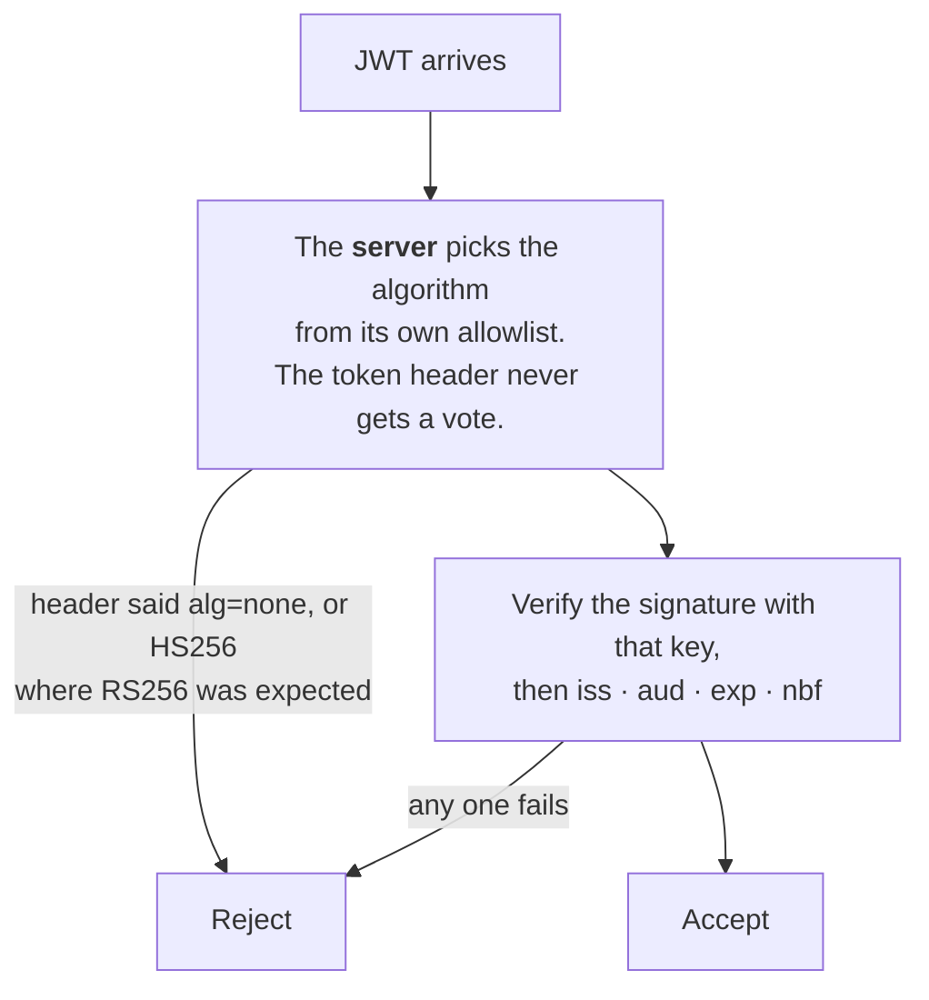
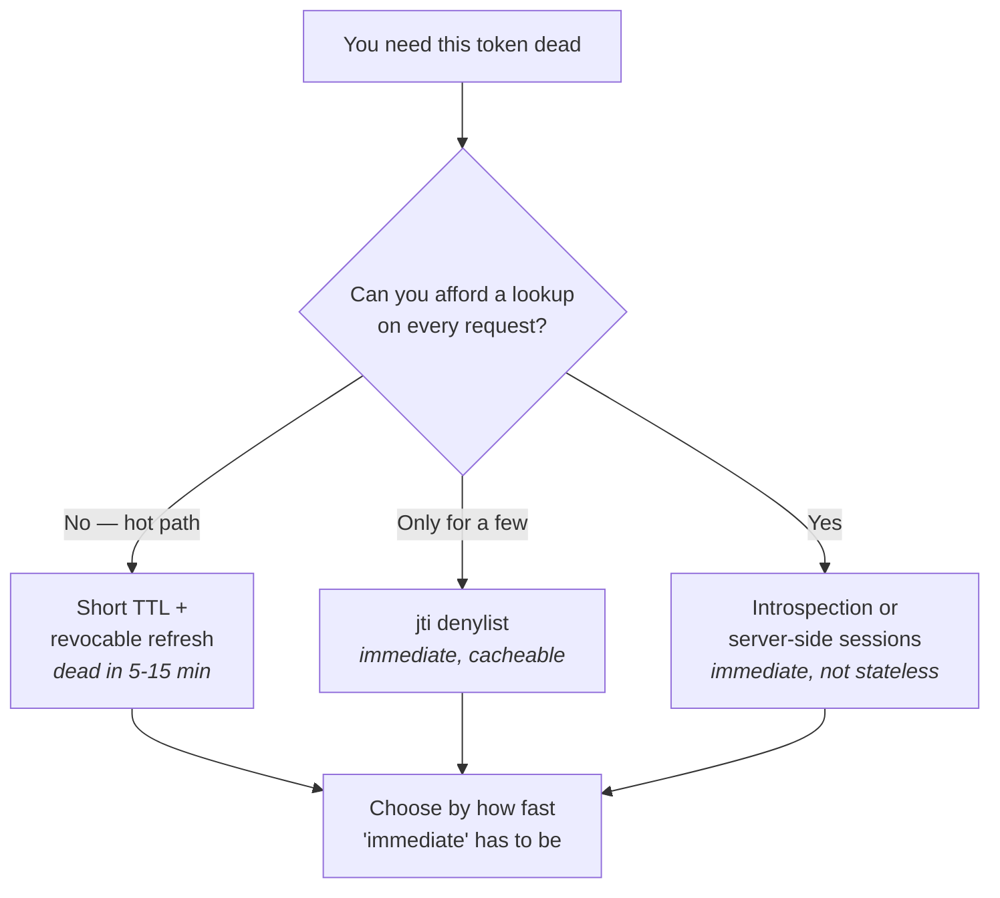

# JWT — structure, validation, revocation

The token format under most of modern auth, and the one with the most
foot-guns. You shipped session termination on top of tokens, so the revocation
half of this chapter is where your interview will go.

Spec: [RFC 7519](https://datatracker.ietf.org/doc/html/rfc7519) ·
[JWT BCP, RFC 8725](https://datatracker.ietf.org/doc/html/rfc8725)

---

## Foundations

A JWT is three base64url segments joined by dots:

```
eyJhbGciOiJSUzI1NiIsImtpZCI6ImsxIn0 . eyJzdWIiOiIxMjMiLCJleHAiOjE3...} . SflKxwRJ...
└──────────── header ─────────────┘   └────────── payload ─────────┘   └ signature ┘
```

- **Header** — `alg` (signing algorithm) and usually `kid` (which key).
- **Payload** — the claims. Registered ones: `iss`, `sub`, `aud`, `exp`,
  `nbf`, `iat`, `jti`.
- **Signature** — over `header.payload`, with the issuer's key.

**Signed is not encrypted.** The payload is base64, not ciphertext — anyone
holding the token can read every claim. Never put anything secret in a JWT.
(JWE encrypts, and is comparatively rare.)

**JWS vs JWE** — JWS signs (integrity, authenticity, readable). JWE encrypts
(confidentiality). "JWT" in casual use almost always means JWS.

### Algorithms

| Family | Kind | Use |
| --- | --- | --- |
| `HS256` | Symmetric (HMAC) | Same secret signs and verifies. Fine when one party does both. |
| `RS256` / `PS256` | Asymmetric (RSA) | Issuer signs with a private key; anyone verifies with the public key. |
| `ES256` | Asymmetric (ECDSA) | Same, smaller keys and signatures. |
| `none` | — | **Never.** |

Asymmetric is the right default for distributed systems: verifiers need only
the public key, so a compromised service can't mint tokens.

---

## How it actually works


*Both classic attacks die at the same step: the server decides the algorithm, and the token's header never gets a vote.*

### The two classic attacks

**`alg: none`.** The header claims no algorithm; a naive library returns
"valid" for a token with an empty signature. The attacker rewrites the payload
freely.

**Algorithm confusion (RS256 → HS256).** Subtler and more dangerous. The
server expects RS256 and holds the RSA *public* key — which is public. An
attacker changes the header to `HS256` and signs the token using that public
key as the HMAC secret. A library that picks the algorithm *from the token
header* will verify it with the public key as an HMAC key, and it passes.

**The fix for both is the same:** the *server* decides the acceptable
algorithm; the token's header never gets a vote. Pin an allowlist.

### Validation checklist

| Check | Why |
| --- | --- |
| `alg` against a server-side allowlist | `none` and algorithm confusion |
| Signature via the key selected by `kid` | Forgery |
| `iss` expected | Token from another issuer |
| `aud` is this service | Token minted for a different service, replayed here |
| `exp`, `nbf`, small clock skew | Expired or not-yet-valid tokens |
| `sub` present | Identify the principal |
| `jti` against a denylist, if you revoke | Revoked tokens |

### Validation, written correctly

```js
const { createRemoteJWKSet, jwtVerify } = require('jose');

// Cached with a TTL, and refetched automatically on an unknown kid.
const jwks = createRemoteJWKSet(new URL('https://auth.example.com/.well-known/jwks.json'));

const { payload } = await jwtVerify(token, jwks, {
  algorithms: ['RS256'],                       // ← PINNED. never read alg from the token
  issuer:   'https://auth.example.com',
  audience: 'api.example.com',                 // ← this service, not "any of ours"
  clockTolerance: 5,                           // seconds, for skew
});
```

`algorithms: ['RS256']` is the line that matters. Without it the library may
take the algorithm from the token's own header, which is what both classic
attacks exploit.

**Attack 1 — `alg: none`:**

```js
// header {"alg":"none"} and an empty signature
const forged = b64url('{"alg":"none"}') + '.' + b64url('{"sub":"admin"}') + '.';
// A library that honours the header returns "valid" for this.
```

**Attack 2 — algorithm confusion, RS256 → HS256:**

```js
// The server holds an RSA PUBLIC key. It is published at /jwks.json.
// The attacker HMAC-signs with that public key as the shared secret:
const pub = fs.readFileSync('jwks-public.pem');
const forged = jwt.sign({ sub: 'admin' }, pub, { algorithm: 'HS256' });

// Server: jwt.verify(token, pub)   ← no algorithms option
//   sees alg=HS256, uses `pub` as an HMAC key, signature matches. Accepted.
```

Both die to the same one-line fix: the server states the algorithm, the token
never gets a vote.

### Revocation, in code

```js
// Token carries a per-user version…
const token = await new SignJWT({ sub: userId, ver: user.tokenVersion })
  .setProtectedHeader({ alg: 'RS256', kid: 'k1' })
  .setIssuedAt().setExpirationTime('15m')
  .setIssuer('https://auth.example.com').setAudience('api.example.com')
  .sign(privateKey);

// …checked against a small, highly cacheable lookup.
const current = await redis.get(`tokenver:${payload.sub}`);
if (String(payload.ver) !== current) throw new Error('token_revoked');

// Terminating every session for a user is then one command:
await redis.incr(`tokenver:${userId}`);
```

That `incr` invalidates every token that user holds, immediately, without
enumerating any of them.

### Revocation — the real problem


*There is no free revocation. Every option trades hot-path cost against how long a stolen token keeps working — say which you bought.*

A signed JWT is valid until it expires, because verification is local and
offline. That's the point of the design and also its cost. Four ways out:

| Approach | Revocation speed | Cost |
| --- | --- | --- |
| **Short TTL + revocable refresh** | Up to the access-token lifetime (5–15 min) | None on the hot path — the standard answer |
| **`jti` denylist** | Immediate | A lookup per request, though a small, cacheable set |
| **Token version claim** | Immediate | A per-user version lookup, tiny and cacheable |
| **Server-side sessions** | Immediate | Gives up statelessness entirely |

The denylist is smaller than people expect: it only needs entries for tokens
revoked *before* their natural expiry. With 15-minute tokens, that set is tiny
and fits in memory.

**Token versioning** is often the best of both. Each user record holds a
counter; the token carries it; a privilege change or forced logout increments
it, and every older token becomes invalid at once. No enumeration of tokens,
no fan-out to get wrong.

### Storage in browsers

`localStorage` is readable by any injected script — one XSS and the token is
exfiltrated. `httpOnly` cookies are not script-readable, but need CSRF
protection (`SameSite`). The strongest option is a **backend-for-frontend**:
tokens live server-side, the browser holds only a session cookie, and the XSS
exfiltration path disappears.

> **In your own work.** "Active session termination" is a JWT revocation
> question in disguise. Know your architecture — stateless, server-side, or
> hybrid — because every follow-up depends on it. See
> [contentstack](../00-experience/contentstack.md) §6.


## Building it

**Libraries**

| Need | Library | Why |
| --- | --- | --- |
| Sign/verify | `jose` | Built-in JWKS support and active maintenance make it the current default over `jsonwebtoken` |
| Legacy codebases | `jsonwebtoken` | Simpler API, no JWKS handling — still common, fine for a single fixed key |

**Pseudocode — verify with an explicit algorithm allowlist**

```ts
import { jwtVerify, importSPKI } from 'jose';
const publicKey = await importSPKI(PEM, 'RS256');

async function verify(token: string) {
  const { payload } = await jwtVerify(token, publicKey, {
    algorithms: ['RS256'],   // never read the algorithm from the token itself
  });
  return payload;
}
```

`algorithms: ['RS256']` is the line that stops the RS256→HS256 confusion
attack from "The two classic attacks" — the library refuses to verify with
anything else, no matter what the header claims.

---

## Interview Q&A

### Q: What's in a JWT, and what does the signature guarantee?
**Level:** foundation · **Tags:** jwt, basics

<details><summary>Model answer</summary>

Three base64url-encoded parts: a header with the algorithm and usually a key
id, a payload of claims, and a signature over the first two.

The signature guarantees **integrity and authenticity** — the token was issued
by someone holding the signing key and hasn't been altered since. It does not
provide confidentiality: the payload is encoded, not encrypted, so anyone with
the token can read every claim. That's the most common misunderstanding, and
it means you never put anything sensitive in a JWT.

Standard claims worth knowing: `iss` issuer, `sub` subject, `aud` audience,
`exp` expiry, `nbf` not-before, `iat` issued-at, `jti` a unique token id used
for revocation.

</details>

**Follow-ups:**

1. Q: Can you change a claim in a JWT you've been issued?
   <details><summary>Answer</summary>

   You can decode and edit it trivially — it's base64 — but the signature won't
   match, so any server validating properly rejects it.

   The interesting part is the two ways servers fail to validate properly. If
   the server accepts `alg: none`, the attacker strips the signature entirely.
   If the server takes the algorithm from the token header and it's using
   asymmetric keys, the attacker can switch to HS256 and sign with the public
   key as the HMAC secret — algorithm confusion.

   Both are defeated by the same rule: the server pins the acceptable
   algorithm; the token never chooses.

   </details>

2. Q: When would you use HS256 over RS256?
   <details><summary>Answer</summary>

   HS256 when a single party both issues and verifies — a monolith signing its
   own session tokens. It's faster and simpler, with one secret.

   RS256 or ES256 as soon as more than one party verifies. The issuer holds the
   private key; verifiers need only the public key, published via JWKS. That
   means a compromised verifying service cannot mint tokens, which with a
   shared HMAC secret it absolutely could — every service holding the secret is
   a potential forger.

   For anything distributed, or where third parties validate, asymmetric is the
   right default. ES256 over RS256 if token size matters.

   </details>

### Q: How do you revoke a JWT before it expires?
**Level:** senior · **Tags:** jwt, revocation, sessions

<details><summary>Answer</summary>

Strictly, you can't — a signed token verifies offline, so any revocation is an
engineering workaround. The honest answer names the approach and its cost.

**Short-lived access tokens with a revocable refresh token** is the standard.
Access tokens live 5–15 minutes; the refresh token is tracked server-side.
Revoking kills the refresh, so the user is out within one access-token
lifetime. Bounded staleness, no per-request lookup.

**A `jti` denylist** gives true immediacy at the cost of a lookup — but a small
one, because it only holds tokens revoked before their natural expiry. With
short TTLs that set is tiny, memory-resident and replicable.

**A version claim per user** is often the best trade: the token carries a
counter, and bumping it server-side invalidates every existing token for that
user at once. No enumerating tokens, no fan-out to miss.

**Server-side sessions** if immediate revocation is a hard product
requirement — which for an enterprise "terminate this session now" button it
arguably is.

What I'd add: if the product promises immediate termination and the
architecture delivers "within 15 minutes", that's a discrepancy to resolve
deliberately — either the UI says so honestly, or you accept a lookup on
sensitive paths.

</details>

**Follow-ups:**

1. Q: Doesn't a denylist defeat the point of stateless tokens?
   <details><summary>Answer</summary>

   Partly, and I'd concede that rather than pretend otherwise. But it isn't
   all-or-nothing.

   The denylist is small and highly cacheable, so the check can be a local
   in-memory lookup rather than a network call — very different from a full
   session store hit per request. You can also check it only on
   privilege-sensitive operations rather than every read.

   So you've moved from "a database lookup on every request" to "a cheap local
   check on some requests". That's a real improvement over server-side
   sessions even if it isn't architectural purity.

   The deeper point is that pure statelessness and instant revocation are
   genuinely incompatible; every design here is a chosen point on that trade,
   and the mistake is not choosing consciously.

   </details>

2. Q: A user's admin role is revoked. Their token says admin and expires in 12 minutes. What happens?
   <details><summary>Answer</summary>

   With plain stateless validation, they keep admin for up to 12 minutes.
   Whether that's acceptable is a decision to make explicitly rather than
   discover during an incident.

   For most applications it's fine — the exposure window is small and bounded.
   For a privilege *reduction* triggered by a security event, it isn't: the
   whole point of revoking is that you no longer trust them.

   Options, roughly in order of how much I'd reach for them: bump a token
   version on any privilege change, so their token is invalid on the next
   request; check a revocation set on privileged operations only, leaving reads
   fast; or keep authorization decisions out of the token entirely and evaluate
   policy per request against current state — which is the OPA model and
   sidesteps the whole problem, at the cost of an evaluation per request.

   The last is what I'd argue for in a system where roles change meaningfully:
   putting durable authorization *decisions* inside a token is what creates
   this problem in the first place.

   </details>

3. Q: Where should a browser store the token?
   <details><summary>Answer</summary>

   Not `localStorage` — any XSS reads it, and the token leaves with the
   attacker.

   Better: an `httpOnly`, `Secure`, `SameSite` cookie, which script can't read.
   That trades the XSS exfiltration risk for CSRF, which `SameSite=Lax` or
   `Strict` plus normal CSRF defences handle.

   Best, for a SPA: a **backend-for-frontend**. Tokens never reach the browser
   at all — the BFF holds them server-side and the browser gets an opaque
   session cookie. The exfiltration path stops existing, and you get real
   revocation as a bonus, because the BFF holds server-side state.

   A common middle ground is access token in memory (lost on refresh, but not
   readable from storage) with the refresh token in an httpOnly cookie.

   </details>

---

## What a weak answer sounds like

- **"JWTs are encrypted."** They're signed and base64-encoded. Anyone can read
  the payload.
- **"JWTs are more secure than sessions."** Different trade, not more secure —
  and worse at revocation.
- **Not knowing `alg: none` or algorithm confusion.** These are the canonical
  JWT attacks and an IAM interviewer will expect them.
- **"We store the JWT in localStorage for convenience."** Says XSS hasn't been
  considered.
- **Claiming instant revocation with stateless tokens** and no mechanism behind
  it.

---

## Glossary

- **JWS / JWE** — signed / encrypted. "JWT" usually means JWS.
- **`kid`** — key id in the header, selecting the verification key.
- **`jti`** — unique token id; the handle for denylisting.
- **JWKS** — the issuer's published public keys.
- **`alg: none`** — unsigned token; always reject.
- **Algorithm confusion** — forcing HS256 and signing with the public key.
- **Token versioning** — a per-user counter in the token; bump to invalidate all.
- **BFF** — backend-for-frontend; tokens stay server-side.
- **Clock skew** — the tolerance allowed on `exp`/`nbf` between machines.
