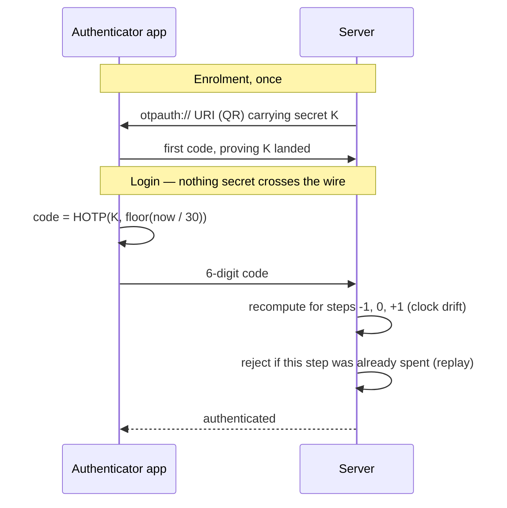

# MFA and TOTP

You moved 2FA from SMS to authenticator apps across a platform, so expect this
to go past "what is MFA" into why SMS is weak, how the migration worked, and
what happens to people who lose their device.

Spec: [TOTP, RFC 6238](https://datatracker.ietf.org/doc/html/rfc6238) ·
[HOTP, RFC 4226](https://datatracker.ietf.org/doc/html/rfc4226) ·
[NIST SP 800-63B](https://pages.nist.gov/800-63-3/sp800-63b.html)

---

## Foundations

Multi-factor authentication requires evidence from more than one category:

| Factor | Examples |
| --- | --- |
| **Something you know** | Password, PIN |
| **Something you have** | Phone, hardware key, authenticator app |
| **Something you are** | Fingerprint, face |

Two passwords are not MFA. A password plus a security question is not MFA —
both are things you know.

**Strength, weakest to strongest:**

```
SMS OTP  <  TOTP app  <  Push with number matching  <  WebAuthn / passkeys
   │            │                  │                          │
carrier     shared secret     still phishable        origin-bound:
in the      on the device,    in real time           phishing-resistant
trust path  phishable                                by design
```

Only WebAuthn is *phishing-resistant*, because the credential is bound to the
origin and simply won't produce a signature for `acme-login.evil.com`.
Everything left of it can be relayed by a convincing fake login page in real
time.

---

## How TOTP works

Time-based One-Time Password is HOTP with time as the counter:

```
code = HOTP(K, T)   where  T = floor((now - T0) / X)

  K  = shared secret, established once at enrolment
  T0 = epoch (0)
  X  = time step, 30 seconds by default
```

Both sides compute the same code from the same secret and the same 30-second
window. **Nothing is transmitted at login time** — that's the security
property. There is no channel to intercept, unlike SMS.


*The login half has no channel to intercept — that is the whole reason TOTP beats SMS. The spent-step check is what stops a code being reused inside its own 30 seconds.*

### The enrolment payload, concretely

The QR code is just this URI encoded as an image:

```
otpauth://totp/Example:ada@acme.com?secret=JBSWY3DPEHPK3PXP&issuer=Example&algorithm=SHA1&digits=6&period=30
```

| Part | Meaning |
| --- | --- |
| `Example:ada@acme.com` | Label shown in the authenticator app |
| `secret` | The shared key, base32-encoded. **This is the whole secret** |
| `algorithm=SHA1` | The HMAC algorithm; SHA1 is the interoperable default |
| `digits=6` | Code length |
| `period=30` | Time step in seconds |

You can verify a code by hand, which is a good way to prove to yourself nothing
is transmitted:

```bash
# Both sides compute this independently from the same secret and clock
oathtool --totp -b JBSWY3DPEHPK3PXP
# -> 486521
```

And in Node, the computation the server does at login:

```js
const counter = Math.floor(Date.now() / 1000 / 30);   // the time step
const hmac = crypto.createHmac('sha1', base32Decode(secret))
                   .update(intToBuffer8(counter)).digest();
const offset = hmac[hmac.length - 1] & 0x0f;          // dynamic truncation
const code = ((hmac.readUInt32BE(offset) & 0x7fffffff) % 1e6)
               .toString().padStart(6, '0');
```

Accept `counter - 1`, `counter`, and `counter + 1` for clock drift — and record
the accepted step so the same code can't be replayed inside its window.

Practical details worth knowing:

- **HMAC-SHA1** is the default and is fine here — the HMAC construction isn't
  affected by SHA-1's collision weaknesses.
- **Drift window**: accept ±1 step, so ~90 seconds total. Wider is friendlier
  and weaker.
- **Replay**: record the last accepted step per user and reject reuse within
  the window, or a shoulder-surfed code works twice.
- **Secret storage**: encrypted at rest. Anyone with `K` can generate codes
  forever, so a leaked secrets table is a total 2FA bypass.
- **Rate limiting**: six digits is a million possibilities, but at unlimited
  attempts per 30-second window that's brute-forceable. Lock after a handful.

### Why SMS is weak — stated precisely

The attacks: **SIM swap** (social-engineer the carrier into porting the number),
**number porting** fraud, **SS7 interception** at the telecom signalling layer,
and lock-screen previews on a stolen device.

**Be precise on the standards position, because overstating it is a tell.**
NIST SP 800-63B classifies SMS/PSTN OTP as a **restricted authenticator** — it
remains permitted, but only with a documented risk assessment, a migration
roadmap, and user notification. It is *not* prohibited. Saying "NIST banned
SMS" is wrong, and an IAM specialist will catch it.

TOTP removes the carrier from the trust path entirely. It's still phishable in
real time — a fake login page relays the code within its 30-second window —
which is the argument for WebAuthn.

### Recovery is where security actually lands

Hardening the front door moves the attacker to account recovery. If recovery is
"email a reset link", your MFA is only as strong as the user's email.

Reasonable design: single-use recovery codes issued at enrolment, shown once,
stored hashed. An identity-verified support path for people who lose
everything — deliberately slow and high-friction, because it's the softest
target. And optional multiple enrolled factors so losing one isn't a crisis.

> **In your own work.** You extended 2FA from SMS to authenticator apps
> platform-wide. The migration question — how nobody got locked out — is where
> this goes. See [contentstack](../00-experience/contentstack.md) §6.


## Building it

**Libraries**

| Need | Library | Why |
| --- | --- | --- |
| TOTP generate/verify | `otplib` | Handles the time-step window and secret encoding to spec (RFC 6238) |
| Enrolment QR | `qrcode` | Renders the `otpauth://` URI as a scannable code |

**Setting it up — enrolment**

1. Generate a secret server-side: `authenticator.generateSecret()`.
2. Build the URI —
   `otpauth://totp/YourApp:user@example.com?secret=...&issuer=YourApp` — and
   render it with `qrcode`.
3. **Don't mark the factor active until the user proves possession.** Require
   one correct code before persisting the secret as enrolled — otherwise a
   broken scan locks the user out silently.

**Pseudocode**

```ts
import { authenticator } from 'otplib';
authenticator.options = { window: 1 }; // tolerate ±1 step of clock drift

function verifyCode(secret: string, code: string, spent: Set<string>) {
  if (spent.has(code)) return false;         // stop reuse inside one window
  return authenticator.check(code, secret);
}
```

---

## Interview Q&A

### Q: How does TOTP work?
**Level:** intermediate · **Tags:** totp, mfa, crypto

<details><summary>Model answer</summary>

At enrolment the server generates a random secret and shows it as a QR code —
an `otpauth://` URI the authenticator app scans. Both sides now hold the same
shared secret.

At login, both independently compute `HMAC-SHA1(secret, floor(unix_time / 30))`
and truncate to six digits. Same secret, same 30-second window, same code.

The key property is that **nothing is transmitted** — the code is computed
locally on both sides. There's no channel to intercept, which is exactly what
SMS gets wrong.

The implementation details that matter: accept ±1 time step for clock drift;
record the last accepted step and reject reuse so a code can't be replayed
within its window; store the secret encrypted, since anyone holding it can
generate codes indefinitely; and rate-limit attempts, because six digits is
brute-forceable given unlimited tries.

</details>

**Follow-ups:**

1. Q: SHA-1 is broken. Why is TOTP still using it?
   <details><summary>Answer</summary>

   Because the break is collision resistance, and HMAC doesn't depend on it.

   SHA-1 collisions mean an attacker can construct two inputs hashing to the
   same value. HMAC's security rests on the pseudorandomness of the keyed
   construction, not on collision resistance, and there's no practical attack
   on HMAC-SHA1.

   RFC 6238 does permit SHA-256 and SHA-512, but authenticator app support is
   inconsistent, so SHA-1 remains the interoperable default. It's a case where
   "SHA-1 is broken, change it" is the wrong instinct — worth being able to
   explain rather than just assert.

   </details>

2. Q: Two users' phones are out of sync by two minutes. What happens?
   <details><summary>Answer</summary>

   Their codes won't validate — the computed time step is off by four,
   well outside a ±1 window.

   Options. Widen the window, which trades security for tolerance and I'd
   resist beyond ±1. Better: **resynchronisation at verification** — if a code
   fails, check a wider range, and if it matches at an offset, record that
   offset for the user and apply it thereafter. That fixes persistent device
   drift without permanently weakening the window for everyone.

   Practically, most phones sync time over NTP so this is rarer than it used to
   be. The bigger real-world cause of "my code doesn't work" is a user reading
   a code that expired between reading and typing — which is why a clear
   countdown in the UI reduces support load more than any protocol change.

   </details>

### Q: Why is SMS-based 2FA considered weak, and what's the standards position?
**Level:** intermediate · **Tags:** sms, mfa, standards

<details><summary>Answer</summary>

The attacks are on the carrier, not on your system, which is what makes it
uncomfortable — you can't fix it.

**SIM swap**: an attacker social-engineers the carrier into porting the number
to their SIM, and now receives the codes. **Number porting** fraud more
broadly. **SS7 interception** at the telecom signalling layer, which is
feasible for well-resourced attackers. And a stolen phone often previews SMS on
the lock screen without unlocking.

On standards, precision matters: NIST SP 800-63B classifies SMS/PSTN OTP as a
**restricted authenticator**. That means still permitted, but requiring a
documented risk assessment, a migration roadmap, and notifying users of the
risk. It is not banned — saying "NIST prohibited SMS" is a common overstatement.

The pragmatic position is that SMS 2FA is far better than no second factor —
it stops credential stuffing and password reuse attacks, which are the bulk of
real account compromise. It's a weak factor, not a useless one. But you should
be migrating off it, which is what we did.

</details>

**Follow-ups:**

1. Q: How do you migrate a platform off SMS without locking anyone out?
   <details><summary>Answer</summary>

   The constraint is that you're changing a credential people need in order to
   get in, so mistakes lock out real users and support cost is severe.

   The staging I'd use: **enrol before enforce.** Offer app-based 2FA alongside
   SMS and prompt at login, so people enrol while SMS still works as a
   fallback. Track enrolment rate rather than working to a date.

   Then **enforce for new users**, so the SMS population stops growing.

   Then **deadline the remainder** with escalating in-product and email notice,
   keeping SMS working right up to the cutoff.

   For the tail who never enrol, recovery has to be ready: recovery codes
   issued at enrolment, and an identity-verified support path.

   The subtlety I'd raise: recovery codes and the support flow define your
   *actual* security level. Hardening the second factor while leaving a weak
   reset path just moves the attack rather than stopping it.

   </details>

2. Q: Is push notification approval better than TOTP?
   <details><summary>Answer</summary>

   Better UX, and better against some attacks, but it introduced its own
   problem: **MFA fatigue**. Attackers with valid credentials spam approval
   prompts until the user taps approve to make it stop — which worked in
   several high-profile breaches.

   The fix is **number matching**: the login screen shows a number the user
   must type into the prompt, so blind approval is impossible. With number
   matching, push is genuinely stronger than TOTP — it binds the approval to
   the session and shows context like location and application.

   Without number matching, I'd rate plain push as *weaker* than TOTP, because
   TOTP requires deliberate action and can't be triggered remotely by an
   attacker at all.

   Neither is phishing-resistant. Only WebAuthn is.

   </details>

### Q: What's the strongest second factor, and why?
**Level:** senior · **Tags:** webauthn, passkeys, phishing

<details><summary>Model answer</summary>

WebAuthn — passkeys or hardware security keys — because it's the only widely
deployed factor that is **phishing-resistant by design**, rather than by
user vigilance.

The mechanism: at registration the authenticator generates a keypair bound to
the site's origin, and the server stores the public key. At login the server
sends a challenge, the authenticator signs it with the private key, which never
leaves the device.

The phishing resistance comes from origin binding. If a user lands on
`acme-login.evil.com`, the authenticator simply has no credential for that
origin and will not produce a signature. There is nothing for the user to get
wrong and nothing for the attacker to relay — unlike TOTP, where a real-time
proxy just forwards the six digits.

It also removes the shared secret entirely: a breach of the server yields
public keys, which are useless.

The practical trade is recovery and portability. Losing a hardware key without
a backup factor is genuinely hard to recover from — which is what passkeys
address by syncing through a platform keychain, at the cost of trusting that
keychain.

</details>

**Follow-ups:**

1. Q: If WebAuthn is that much better, why isn't everyone on it?
   <details><summary>Answer</summary>

   Adoption friction rather than technical doubt.

   Recovery is the hard one: what happens when someone loses their device? Any
   fallback you provide becomes the weakest link, so a platform with WebAuthn
   plus SMS recovery is only as strong as the SMS.

   Then: enterprise device fleets and shared workstations complicate platform
   authenticators; hardware keys cost money and someone has to distribute them;
   older browsers and enterprise environments lag; and users find it unfamiliar,
   so support load spikes during rollout.

   Passkeys solve much of this by syncing through iCloud or Google accounts —
   at the cost of the security now resting on that account, which is a real
   trade rather than a free win.

   The realistic position for a B2B platform is offering WebAuthn, encouraging
   it, and keeping TOTP as the broadly-supported baseline.

   </details>

2. Q: Should MFA be required on every login?
   <details><summary>Answer</summary>

   Not usually — prompting constantly trains people to approve reflexively,
   which is exactly the behaviour MFA fatigue exploits.

   The better model is **risk-based**: always require it for the sensitive
   things — privilege changes, adding a payment method, changing MFA settings
   themselves — and otherwise prompt when signals say the situation is unusual:
   new device, new location, a big impossible-travel jump, a login after a
   password change.

   Remembering a device for 30 days is the common compromise, with the
   remembered-device token bound to that device and revocable centrally so an
   admin can force re-challenge.

   The important connection is that this *is* Zero Trust thinking applied to
   authentication — continuous evaluation of signals rather than a single gate
   at the door.

   </details>

---

## What a weak answer sounds like

- **"NIST banned SMS."** It's restricted, not prohibited. Precision here is a
  cheap credibility win in an IAM interview.
- **"TOTP sends a code to your app."** Nothing is sent — both sides compute it.
  This misunderstanding misses the entire security property.
- **"Password plus security question is 2FA."** Both are things you know.
- **Ignoring recovery.** Hardening the factor while leaving a weak reset moves
  the attack.
- **Not mentioning replay** — accepting a code twice within its window.

---

## Glossary

- **TOTP / HOTP** — time-based / counter-based one-time password.
- **Time step** — the 30-second window; codes change per step.
- **Drift window** — steps accepted either side, usually ±1.
- **`otpauth://`** — the URI encoded in the enrolment QR code.
- **SIM swap** — porting a victim's number to an attacker's SIM.
- **Restricted authenticator** — NIST's category for SMS: permitted with a
  documented risk assessment and migration plan.
- **MFA fatigue** — spamming push prompts until the user approves.
- **Number matching** — typing a displayed number into the push prompt.
- **WebAuthn / passkey** — origin-bound public-key credential;
  phishing-resistant.
- **Recovery codes** — single-use fallbacks issued at enrolment.
