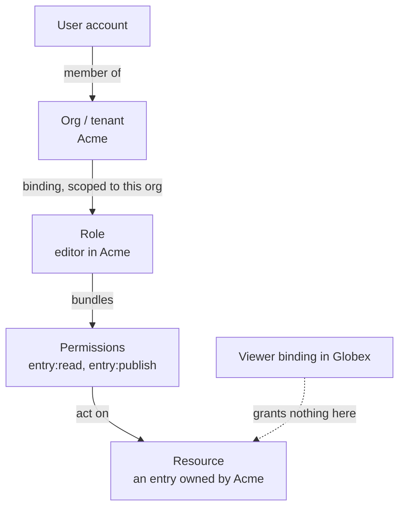
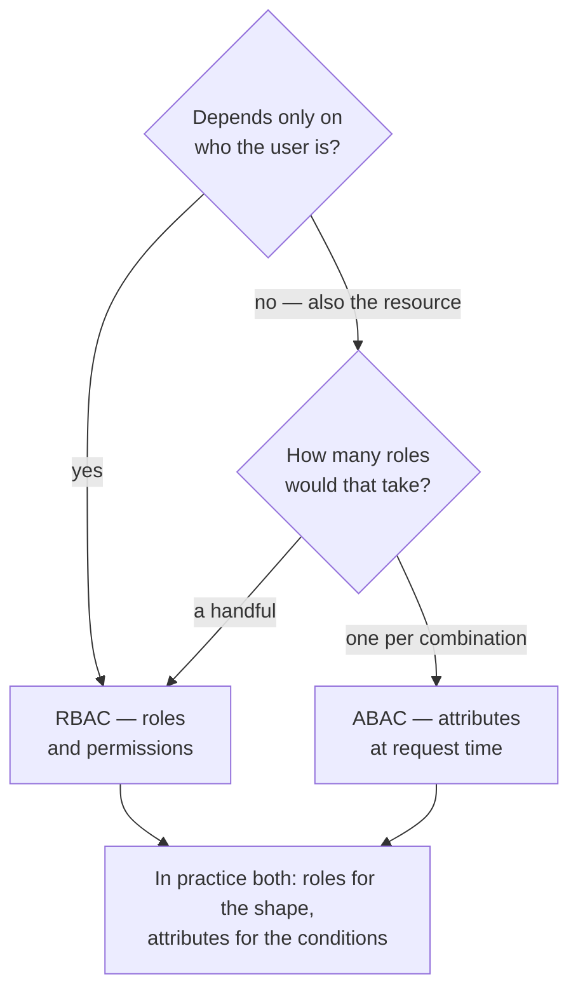
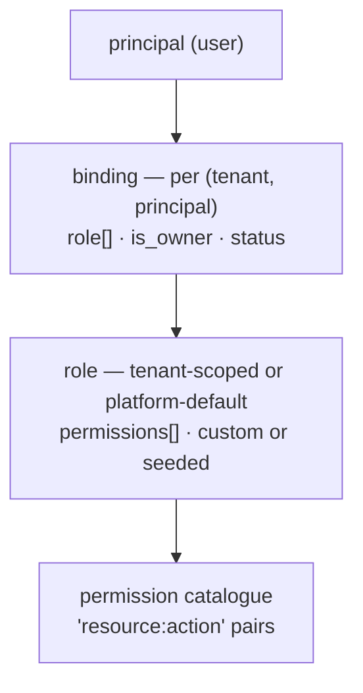

# RBAC, ABAC and ReBAC

Your flagship project. You led RBAC 0→1 in a multi-tenant platform, so this
chapter needs to go deeper than the others — expect design questions, not
definition questions.

---

## Foundations

Three authorization models, each answering "may this principal do this to this
resource?" differently:

| Model | Decision based on | Example |
| --- | --- | --- |
| **RBAC** | The principal's **role** | Editors may publish |
| **ABAC** | **Attributes** of principal, resource, environment | Editors in the EU may publish EU content during business hours |
| **ReBAC** | **Relationships** in a graph | You may edit this doc because you own the folder containing it |

**RBAC** is the default because it matches how organisations describe
themselves. Its ceiling is conditions: any rule involving "…but only if" pushes
you toward roles-per-condition.

**ABAC** handles conditions natively but is harder to reason about — "who can
publish?" has no simple answer, you have to evaluate policy against a
population. Auditors hate that.

**ReBAC** (Google Zanzibar, and OpenFGA/SpiceDB after it) shines where
permissions flow through containment or sharing — Drive, GitHub. It answers
"who can see this?" well, at the cost of a graph to maintain and traverse.

Most real systems are **RBAC with attribute conditions** — the role provides
the permission set, the policy layer handles the conditional dimensions. That's
what OPA gave you.

---

## How it actually works


*The binding is the load-bearing link. Drop the org from any arrow in this chain and you have a cross-tenant hole.*

The model you shipped, in one chain: a **user account** is a member of one or
more **orgs (tenants)**. Each org **binds** that user to a **role** — editor in
Acme, viewer in Globex — and the binding is scoped to that one org. A role
**bundles permissions** (`entry:read`, `entry:publish`), and permissions are
what **act on a resource** (an entry that belongs to Acme). A viewer binding in
Globex grants nothing on an Acme entry.

**The whole point is the binding step.** The role binding is scoped to an
organisation, so "the user is an editor" is never true on its own — they are an
editor *in Acme*. Drop the org from any link in that chain and you have a
cross-tenant hole.

**Permissions are the atoms.** Code asks "does this principal hold
`entry:publish`?" and never knows which role granted it. That's what lets roles
be data — added, edited, defined by a customer — without a deploy. Checking
roles directly (`if user.role === 'admin'`) hard-codes policy into the
application and drifts between services as the check gets copied.


*Almost nobody picks one. The senior answer is where you draw the line between the role that grants the verb and the attributes that qualify it.*

### Role explosion

The characteristic RBAC failure: a new role for every combination of
circumstances — `editor-eu-readonly-contractor` — until nobody can say what any
role means or safely delete one.

**The tell is roles whose names encode conditions.** When you see a region, a
tenure, or a time in a role name, that dimension belongs in policy, not in the
role.

Three defences:

1. **Permissions coarse enough to be meaningful** — one per real capability,
   not one per endpoint.
2. **Good defaults** so most customers never create a custom role at all.
3. **Push varying dimensions into attributes** — one Editor role, plus a policy
   that considers region. The RBAC/ABAC hybrid.

### Multi-tenancy

The dimension people forget, and the one your background makes fair game.

The same user can be admin in org A and viewer in org B, so **"can this user
publish?" is not a well-formed question**. Every check carries a tenant, and
the tenant is resolved *before* roles are gathered.

Two designs:

| | Tenant in the token | Tenant in the request |
| --- | --- | --- |
| Shape | `org_id` claim; token valid for one org | Token = user; org from path/header |
| Switching orgs | New token | Same token |
| Cross-org UI | Awkward | Natural |
| Risk | Low — a token can't address another org | **Every endpoint must verify membership** |

The second is more flexible and more dangerous: miss the membership check on
one endpoint and you have a cross-tenant vulnerability. Enforce it in shared
middleware, never per-endpoint, so it can't be forgotten.

### The model and the check, in code

```sql
CREATE TABLE roles        (id TEXT PRIMARY KEY, tenant_id TEXT, name TEXT);
CREATE TABLE permissions  (id TEXT PRIMARY KEY, action TEXT);      -- entry:publish
CREATE TABLE role_perms   (role_id TEXT, permission_id TEXT);
CREATE TABLE role_bindings(user_id TEXT, tenant_id TEXT, role_id TEXT,
                           PRIMARY KEY (user_id, tenant_id, role_id));
--                                      ↑ the binding is per (user, TENANT)
```

```js
async function can(userId, tenantId, permission, resource) {
  // 1. Membership first — never inferred from the resource
  if (!await isMember(userId, tenantId)) return false;

  // 2. Roles IN THIS TENANT, not globally
  const perms = await effectivePermissions(userId, tenantId);   // cached, versioned

  // 3. Then the resource-level condition, if any
  return perms.has(permission) && ownsOrInherits(resource, tenantId);
}
```

**The bug this shape prevents**, which is the cross-tenant leak:

```js
// ✗ the tenant came from the request and nobody checked membership
app.get('/orgs/:orgId/entries/:id', async (req, res) => {
  if (!(await can(req.user.id, req.params.orgId, 'entry:read')))
    return res.sendStatus(403);
  // A user in org A passes this by simply putting org B's id in the URL,
  // if `can()` doesn't verify membership.
});

// ✓ membership enforced once, in shared middleware — impossible to forget
app.use('/orgs/:orgId', requireMembership);
```

Per-endpoint checks mean someone eventually ships an endpoint without one, and
a missing authorization check fails **silently** — nothing errors, it just
permits.

### Why permissions, not role names

```js
if (user.role === 'admin') { … }        // ✗ policy hard-coded into the app
if (perms.has('entry:publish')) { … }   // ✓ roles become data
```

The second is what makes customer-defined roles possible at all — you cannot
ship custom roles if the code branches on role names it has to know in advance.

### Where the check goes

The gateway can do coarse checks — valid token, right audience, rate limits.
Only the service owning the resource knows ownership, tenant and state, so
fine-grained decisions belong there. Defence in depth means both; what you must
avoid is the gateway being the *only* check, which turns the internal network
into an implicit trust zone.

> **In your own work.** Migrating from 2 fixed roles to granular RBAC, 2–3
> default roles per product plus custom roles, extended into SSO and SCIM
> onboarding. See [contentstack](../00-experience/contentstack.md) §1 — including
> the migration and attribution questions.


## Building it

**Libraries**

| Need | Library | Why |
| --- | --- | --- |
| Policy engine | `casbin` | Models both RBAC and ABAC without writing your own evaluator; policies can live as data |
| Code-first permissions | `CASL` | Lighter — permissions as JS predicates. Good fit when policies don't need to be edited without a deploy |

**Pseudocode — the same check, as a casbin model**

The check itself is already worked out in "The model and the check, in code"
above; here is the same shape expressed as a `casbin` policy instead of
hand-written SQL + JS:

```
# model.conf
[request_definition]
r = sub, tenant, obj, act
[policy_definition]
p = sub, tenant, obj, act
[matchers]
m = r.sub == p.sub && r.tenant == p.tenant && r.act == p.act
```

```ts
const allowed = await enforcer.enforce(userId, tenantId, resource, 'entry:publish');
```

The trade against the hand-rolled version: casbin buys you a policy language
and hot-reloadable rules, at the cost of a dependency and a DSL to debug.
Reach for it once policies need to change without a deploy — not before.

---

## Interview Q&A

### Q: RBAC or ABAC — how do you choose?
**Level:** intermediate · **Tags:** rbac, abac, design

<details><summary>Model answer</summary>

RBAC when access maps to organisational structure, which it usually does.
Roles are legible — a customer admin can look at a list of roles and understand
who can do what, and auditors can answer "who has this access?" with a query.

ABAC when decisions depend on conditions RBAC can't express without inventing a
role per case: resource ownership, time, location, data classification,
relationship to the requester.

The failure mode of pure RBAC is role explosion — a new role for every
combination, until the role list is unmanageable and nobody dares delete one.
The failure mode of pure ABAC is unauditability: "who can publish?" stops being
a lookup and becomes an evaluation across a population.

In practice I'd build the hybrid, which is what we did: roles carry the
permission set, and a policy layer evaluates the conditional dimensions. You
keep the legibility of roles and get conditions without multiplying them.

</details>

**Follow-ups:**

1. Q: Give me a concrete case where RBAC alone breaks.
   <details><summary>Answer</summary>

   Resource ownership. "A user may edit entries they created, but not others'."
   That isn't expressible as a role, because it depends on the relationship
   between this principal and this specific resource. With pure RBAC you'd
   need a role per user, which is absurd.

   Same for anything environmental — access only from a corporate network,
   only during business hours, only to data classified below a level. Each
   becomes a role-per-condition, and they multiply combinatorially.

   The signal in a design review is a role name containing a condition:
   `editor-own-content-only`. That dimension wants to be an attribute.

   </details>

2. Q: How do you keep ABAC auditable?
   <details><summary>Answer</summary>

   The honest answer is you accept it's harder and invest in tooling.

   What helps: **policy as code in version control**, so every change is
   reviewed and has history — that's a large part of OPA's appeal. **Test
   suites over policy**, a decision table of inputs to expected outcomes,
   including negatives. **Simulation** — a "who can access this?" tool that
   evaluates policy across the user population so an admin can answer the
   auditor's question even though it isn't a simple lookup. And **decision
   logging**, so you can show not just what the policy is but what it actually
   decided and why.

   Decision logs are the part that satisfies auditors, because they want
   evidence of enforcement, not just configuration.

   </details>

### Q: Design RBAC for a multi-tenant platform where users belong to several organisations.
**Level:** senior · **Tags:** rbac, multi-tenancy, design

<details><summary>Model answer</summary>

The core decision is that **the role binding is per-organisation, not global**.
A user is not "an admin" — they are an admin *in this org* and possibly a
viewer in another.

The model: permissions are atoms, an action on a resource type like
`entry:publish`. Roles bundle permissions. Users hold roles scoped to an org.
Every authorization check therefore takes (principal, tenant, permission,
resource).

Request flow: authenticate, **resolve the tenant**, gather that user's roles in
that tenant, expand to a permission set, evaluate, decide. Resolving the tenant
before gathering roles is the step people skip, and without it the check is
meaningless.

I'd ship 2–3 sensible default roles per product so the common case needs no
configuration, plus custom roles for enterprises that need to express their own
structure — which is only possible because code checks permissions rather than
role names.

The thing I'd guard hardest is cross-tenant leakage: if the tenant comes from
the request rather than the token, every endpoint must verify the user actually
belongs to the org they named. That check goes in shared middleware, not
per-endpoint, because per-endpoint means eventually someone forgets.

</details>

**Follow-ups:**

1. Q: How do you handle permission inheritance — an org-level role granting access to everything inside it?
   <details><summary>Answer</summary>

   Hierarchy is genuinely useful — an org admin shouldn't need an explicit
   grant on every project — but it's where authorization bugs concentrate,
   because the effective permission set is now computed rather than stored.

   Two approaches. **Compute at check time**: walk up from the resource to the
   org, gathering applicable bindings. Always correct, costs a traversal per
   check, and gets slow with depth — this is a plausible source of the kind of
   latency problem you'd profile.

   **Materialise on write**: when a binding changes, expand and store effective
   permissions. Reads become a flat lookup, but every write fans out, and a
   missed invalidation is a security bug rather than a stale cache.

   I'd start with computed-at-check plus caching, because correctness is easier
   to reason about and the cache handles the read cost. The invalidation
   discipline then matters: **versioned cache keys per user or tenant**, so a
   role change bumps the version and every derived entry becomes unreachable at
   once — no enumeration, nothing to miss.

   </details>

2. Q: An admin removes a user's role. How quickly does that take effect?
   <details><summary>Answer</summary>

   Depends entirely on where the decision is cached, and this is a security
   question rather than a performance one — a stale "allow" for a revoked user
   is a vulnerability.

   The layers that add delay: permissions embedded in a token last until it
   expires; a decision cache adds its TTL; replication lag if you read from
   replicas; per-instance in-memory caches, which are worst because they're
   invisible.

   What I'd do: keep durable authorization *decisions* out of the token so the
   token's TTL isn't part of the answer. Use versioned cache keys so a role
   change invalidates everything derived from it atomically. Bypass the cache
   entirely on the most sensitive operations. And then **measure** end-to-end
   revocation latency rather than trusting the configured numbers.

   </details>

3. Q: A customer wants "this role, but they can't delete anything." How do you support that without role explosion?
   <details><summary>Answer</summary>

   The question behind it is whether to support **role composition** and
   **deny rules**, and I'd be cautious about deny.

   The clean answer is custom roles: let them compose a role from the
   permission set they want, minus `*:delete`. That's what customer-defined
   roles are for, and it avoids you shipping a variant role per request.

   Explicit deny rules — "grant Editor, deny delete" — are seductive but make
   the system much harder to reason about, because effective permissions now
   depend on precedence, and precedence bugs are subtle. If deny exists, deny
   must always win over allow, and that must be stated plainly in the UI.

   I'd push toward composition over deny, and only introduce deny if there's a
   genuine need to override an inherited grant — which is really a hierarchy
   problem wearing a different hat.

   </details>

### Q: What's ReBAC, and when would you reach for it?
**Level:** senior · **Tags:** rebac, zanzibar, design

<details><summary>Answer</summary>

Relationship-based access control: permission derives from a graph of
relationships rather than from roles. Google's Zanzibar paper is the reference,
and OpenFGA and SpiceDB are the open implementations.

Instead of "Alice has the Editor role", you store tuples like
`document:readme#editor@user:alice`, and — the important part — relationships
that *derive* from others: an editor of a folder is an editor of every document
in it. Permission flows through containment.

It's the right model when access follows sharing and nesting rather than job
function — Drive, GitHub, anything with folders, teams and inherited access. It
answers "who can see this?" and "what can this user see?" efficiently, which
RBAC with inheritance struggles with at scale.

The costs are real: you're maintaining a consistency-sensitive graph, every
permission change is a write to it, and reasoning about deeply derived
permissions is genuinely hard. Zanzibar spends much of its design on
consistency — the "new enemy" problem, where a stale read after a permission
change leaks data.

For a platform whose permissions map to job function, RBAC plus conditions is
simpler and I'd stay there. I'd reach for ReBAC when nested sharing is the core
product concept.

</details>

---

## Worked example: redesigning fixed roles into RBAC

A pattern that comes up often enough to have a name: a multi-tenant SaaS
product starts with two or three hard-coded roles (`admin`, `member`, maybe
an implicit `owner`), and outgrows it — enterprise customers want custom
roles, granular permissions, and per-resource scoping. The redesign has a
recognisable shape:


*Permissions live on roles, roles bind to a principal per tenant — the model itself is simple; the migration into it is the hard part.*

**The migration is the hard part, not the model.** You cannot cut over
existing tenants atomically without either breaking their access or shipping
a big-bang release nobody can safely roll back. The technique that actually
works, in roughly this order:

1. **Schema-additive first.** New fields sit beside the old ones (a
   `roles[]` array beside a single legacy `role` string) so nothing that
   reads the old shape breaks.
2. **Define the new defaults as exactly the old semantics.** The legacy
   `admin`/`member` become two seeded roles whose permission sets are defined
   to match what they already implied — nobody's effective access changes on
   day one.
3. **Gate the new path per tenant**, evaluated as data (a feature flag or a
   policy rule), not as a deploy — so a single tenant can be rolled back in
   seconds without a redeploy.
4. **Run both authorization paths and compare**, ideally in production on
   real traffic before the new path enforces anything (shadow-mode /
   dark-launch). Any divergence is a bug caught before a customer sees it.
5. **Roll out progressively** — internal tenants, then friendly customers,
   then everyone — and only remove the legacy path once divergence has been
   zero for a sustained window.

Naming this sequence — schema-additive, backfill-to-equivalent, per-tenant
gate, shadow comparison, progressive rollout — is a strong signal on its own;
most candidates only get as far as "we added a roles table."

---

## What a weak answer sounds like

- **"RBAC means checking `user.role === 'admin'`."** That's exactly the
  hard-coding good RBAC avoids.
- **Omitting tenancy** in a multi-tenant question. The check is meaningless
  without it, and it's your own background.
- **"ABAC is more flexible so it's better."** Flexibility costs auditability.
  Name the trade.
- **No answer for role explosion.** It's the known failure mode; not having a
  view on it suggests you haven't operated RBAC at scale.
- **Treating a revoked role as eventually-consistent** without recognising the
  security implication.

---

## Glossary

- **Permission** — an action on a resource type; the atom.
- **Role** — a named bundle of permissions.
- **Binding** — the link of principal → role, scoped to a tenant.
- **Role explosion** — a role per condition combination.
- **RBAC / ABAC / ReBAC** — role-, attribute-, relationship-based.
- **Zanzibar** — Google's ReBAC system; OpenFGA and SpiceDB implement it.
- **PDP / PEP** — Policy Decision Point (evaluates) / Enforcement Point
  (applies).
- **Effective permissions** — what a principal actually holds after inheritance.
- **Least privilege** — grant the minimum needed, by default.
