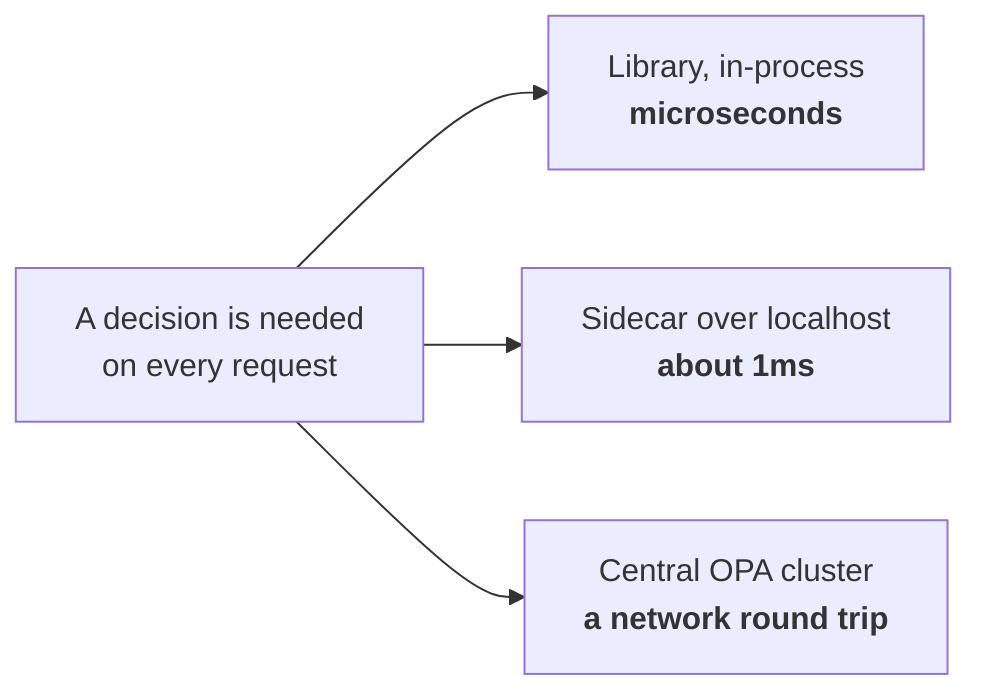

# OPA and Rego

Policy as code, evaluated at request time. This is the engine behind your
13s→200ms story, so expect performance questions as much as language ones.

Docs: [Open Policy Agent](https://www.openpolicyagent.org/docs/latest/)

---

## Foundations

**OPA** is a general-purpose policy engine. You hand it a JSON input and it
returns a decision, evaluated against policies written in **Rego**.

The value is separation: authorization logic stops being `if` statements
scattered across services and becomes versioned, reviewable, testable policy in
one place. Services ask, they don't decide.

**PDP and PEP** — the vocabulary interviewers use:

- **PEP** (Policy Enforcement Point) — in your service, at the request path.
  Asks the question, applies the answer.
- **PDP** (Policy Decision Point) — OPA. Evaluates policy, returns allow/deny.

### Deployment shapes, and why it matters for latency


*The third shape is the latency trap: authorization runs on every request, so a network hop per decision lands straight in your p99.*

| Shape | Latency | Trade |
| --- | --- | --- |
| **Library, in-process** | Microseconds | No network hop; policy shipped with the app |
| **Sidecar** | ~1ms, localhost | Independent policy updates, no cross-network hop |
| **Central service** | Network round trip | One place to manage; a hot dependency and a scaling problem |

**A central OPA service on a hot path is a latency trap.** Sidecar or embedded
keeps evaluation local, which is usually the right answer for authorization
that runs on every request.

---

## Rego, enough to read it

Declarative and query-based rather than imperative. Rules define what's true.

```rego
package authz

import future.keywords.if
import future.keywords.in

default allow := false                    # deny by default — always

allow if {                                # this rule ORs with any other `allow`
    input.action == "read"
    "viewer" in user_roles                # all conditions AND together
}

allow if {
    input.action in {"read", "publish"}
    "editor" in user_roles
    input.resource.tenant == input.user.tenant     # tenant isolation
}

user_roles contains role if {             # a set built by comprehension
    some binding in data.bindings
    binding.user == input.user.id
    binding.tenant == input.user.tenant   # roles are per-tenant
    role := binding.role
}
```

Three things to know for an interview:

- **`default allow := false`** — deny by default. Any policy without it fails
  open when no rule matches, which is the wrong direction for security.
- **Within a rule, conditions AND. Across rules of the same name, they OR.**
  Multiple `allow` blocks are alternative grounds for allowing.
- **`input` vs `data`** — `input` is the request; `data` is loaded state (role
  bindings, org memberships). How `data` gets in and stays fresh is the real
  operational question.

---

## Performance — where your story lives

Naive policy evaluation degrades in predictable ways, and these are the
candidates for what your 13 seconds was doing:

| Cause | Why it's slow | Fix |
| --- | --- | --- |
| **Rules not indexed** | Every rule evaluated per request; cost grows with policy count | Structure rules so OPA can index on `input` fields |
| **Large `data` documents** | Whole document parsed/held per evaluation | Load only what's needed; partial bundles |
| **Fetching data per request** | An N+1 against the policy store inside evaluation | Push data into OPA; don't fetch during evaluation |
| **Deep comprehension over big sets** | Full scans inside the policy | Precompute; restructure the data shape |
| **Central PDP over the network** | A round trip per authorization | Sidecar or embed |

**Caching decisions** is the other half. Cache the *decision*, not the inputs —
don't cache the policy and re-evaluate, cache the boolean outcome keyed on
(principal, tenant, permission, resource).

And then the correctness problem that outranks all of it: **a cached allow for
a revoked permission is a security bug, not a stale read.** Versioned cache
keys — a counter per user or tenant, bumped on any role change — invalidate
everything derived at once without enumerating keys.

> **In your own work.** You redesigned Rego policy evaluation *and* the Redis
> caching model together, taking the tail from ~13s to under 200ms. Both halves
> get asked about, and so does invalidation on role change. See
> [contentstack](../00-experience/contentstack.md) §5.


## Building it

**Libraries**

| Need | Library | Why |
| --- | --- | --- |
| Library / in-process shape | `@open-policy-agent/opa-wasm` | Compiles Rego to WASM, evaluates with no network hop |
| Sidecar / central shape | the `opa` binary itself | No npm package involved — you call it over localhost or the network, not import it |

**Setting it up — deploying a policy bundle**

1. Write the Rego, then `opa build -o bundle.tar.gz` to package it.
2. Serve the bundle from an OCI registry or S3; point OPA's discovery config
   at that URL.
3. OPA polls for bundle updates on its own — a new policy ships without a
   redeploy of the service that calls it.

**Pseudocode — the library shape**

```ts
import { loadPolicy } from '@open-policy-agent/opa-wasm';

const policy = await loadPolicy(fs.readFileSync('bundle/policy.wasm'));
const [result] = policy.evaluate({ user, action, resource, tenant });
// result.allow — no network hop, no OPA process to keep alive
```

---

## Interview Q&A

### Q: What problem does OPA solve?
**Level:** intermediate · **Tags:** opa, policy, architecture

<details><summary>Model answer</summary>

It decouples authorization logic from application code.

Without it, authorization is `if` statements spread across every service —
written per-feature, inconsistent between teams, impossible to audit centrally,
and requiring a deploy to change. Every new endpoint is a chance to forget a
check.

With OPA, policy is data: written in Rego, version-controlled, unit-tested,
reviewed like code, and updatable without redeploying services. The service
sends a JSON input describing the request and gets a decision back. Services
become enforcement points; they no longer *contain* the rules.

The vocabulary is PDP and PEP — OPA is the decision point, your service is the
enforcement point.

The practical benefits I'd name: one place to answer "what is our policy?",
consistent enforcement across services, and the ability to test policy in
isolation with a decision table, including the negative cases that matter most.

</details>

**Follow-ups:**

1. Q: What are the downsides?
   <details><summary>Answer</summary>

   Several worth being honest about.

   **Latency** — you've added an evaluation, and if OPA is a central service,
   a network hop, on a path that runs for every request. This is the big one.

   **A new dependency** on the authorization path, which is tier-0 by
   definition. Fail-closed means an OPA outage is a total outage; fail-open is
   unacceptable for authz. In practice you cache and degrade deliberately.

   **Rego is unfamiliar** — declarative, and it takes people a while. Badly
   written policy is slower and harder to debug than the `if` statements it
   replaced.

   **Data freshness** — OPA needs role bindings and memberships, and keeping
   that in sync is now your problem, with its own staleness window.

   **Debuggability** — "why was I denied?" is harder to answer than reading a
   line of application code, which is why decision logging matters.

   </details>

2. Q: How do you get data into OPA and keep it fresh?
   <details><summary>Answer</summary>

   Three options with different trade-offs.

   **Bundles** — OPA periodically pulls a bundle of policy and data from a
   server. Simple and robust, and the staleness window is the poll interval.
   Good for data that changes slowly, like policy itself.

   **Push via the API** — write data into OPA as it changes. Fresher, but now
   you own the delivery and its failure modes, and every OPA instance needs the
   update.

   **Fetch during evaluation** (`http.send`) — I'd avoid it on a hot path. It
   turns every authorization into a synchronous external call inside policy
   evaluation, which is exactly the N+1 shape that produces multi-second tails.

   The pattern I'd use: bundles for policy and slow-moving data, push for
   things that must be fresh like revocations, and never fetch during
   evaluation.

   </details>

### Q: Your policy evaluation is taking seconds. How do you diagnose it?
**Level:** senior · **Tags:** opa, performance, profiling

<details><summary>Model answer</summary>

Measure before changing anything. OPA has a profiler that reports time per
rule, and decision logs carry evaluation duration — so first establish whether
the time is inside evaluation or around it.

That split matters: if it's around evaluation, it's the network hop to a
central PDP, or data loading, and the fix is deployment shape, not policy. If
it's inside, it's the policy.

Inside evaluation, the usual causes: rules that can't be indexed, so every rule
is evaluated for every request and cost grows with policy count; comprehensions
scanning large data sets; a large `data` document being processed per
evaluation; or `http.send` inside the policy, which is a network call per
authorization.

A tail at seconds while the median is fine usually means **fan-out** — a user
with many roles, or a resource with deep hierarchy, multiplying the work. The
p99 is a different code path, not just a slower one, which changes where you
look.

Fixes in order of impact: move evaluation local (sidecar or embedded);
restructure rules so they index; shrink and reshape `data`; precompute what
you're deriving per request; then cache decisions.

</details>

**Follow-ups:**

1. Q: You cache decisions. How do you invalidate when a role changes?
   <details><summary>Answer</summary>

   The hardest correctness problem here, and worth flagging as such: a stale
   allow is a security bug, not a stale read.

   **Short TTL alone** is the simplest — bounded staleness, no invalidation
   logic, and at 30 seconds it's often acceptable. But you've decided a revoked
   admin keeps admin for up to 30 seconds, so decide it deliberately.

   **Explicit invalidation** on role change is precise but requires knowing
   every affected key. With permission inheritance that fan-out is easy to get
   wrong, and a missed key is a silent hole.

   **Versioned keys** are what I'd reach for: include a per-user or per-tenant
   version counter in the cache key. A role change bumps the counter, so every
   key derived from the old version becomes unreachable at once. No
   enumeration, nothing to miss, and old entries expire naturally.

   Plus a **cache bypass** on the most sensitive operations, where the latency
   is worth paying.

   In practice: versioned keys, a short TTL as a backstop, and bypass on
   high-risk actions.

   </details>

2. Q: Would you embed OPA or run it centrally?
   <details><summary>Answer</summary>

   For authorization on a per-request hot path, **not centrally**. A central
   PDP adds a network round trip to every request and makes one service a
   tier-0 dependency for the entire platform.

   **Sidecar** is the usual answer: OPA runs alongside each service, so
   evaluation is a localhost call — sub-millisecond — while policy is still
   distributed and updated centrally via bundles. You keep central management
   without the shared runtime dependency.

   **Embedded as a library** is fastest, with no IPC at all, but policy updates
   now ride your deploy cycle, which loses much of the point.

   I'd choose sidecar by default, embedded where latency is truly critical, and
   central only for low-volume decisions where a round trip doesn't matter —
   admin operations, batch checks.

   </details>

3. Q: How do you test policy?
   <details><summary>Answer</summary>

   Rego has a built-in test framework — rules prefixed `test_` run with `opa
   test` — and policy being testable in isolation is one of the main
   arguments for it.

   What I'd test: a **decision table** of (role, permission, resource, tenant)
   to expected outcome, weighted toward the **negative** cases, because
   authorization bugs are overwhelmingly wrongly-permitted rather than
   wrongly-denied. Explicit **cross-tenant** tests — a user in org A attempting
   every action in org B, expecting denial across the board. And coverage on
   the policy itself, since `opa test --coverage` shows rules never exercised,
   which usually means either dead policy or an untested path.

   Beyond unit tests, the highest-value technique is **shadow evaluation in
   production**: run the new policy alongside the old without enforcing it and
   compare decisions on real traffic. It catches the cases nobody thought to
   write a test for, which is most of the interesting ones.

   </details>

---

## What a weak answer sounds like

- **"OPA is a library for authorization."** It's a general policy engine; you
  can use it for admission control, data filtering and config validation too.
- **Not knowing `default allow := false`.** Failing open is the wrong direction
  and this is the line that prevents it.
- **Running a central PDP on a hot path** without acknowledging the latency and
  dependency cost.
- **Caching decisions without an invalidation story.** That's a security bug
  waiting for a role change.
- **"Rego is just like writing if statements."** It's declarative; treating it
  imperatively produces slow, unindexable policy.

---

## Glossary

- **OPA** — Open Policy Agent, the engine.
- **Rego** — its declarative policy language.
- **PDP / PEP** — decision point / enforcement point.
- **`input`** — the request being decided on.
- **`data`** — loaded state: role bindings, memberships.
- **Bundle** — a packaged set of policy and data OPA pulls periodically.
- **Partial evaluation** — pre-computing what's knowable to speed up decisions.
- **Decision log** — the record of what was decided and why; what auditors want.
- **Sidecar** — OPA alongside each service, so evaluation is a localhost call.
- **`default allow := false`** — deny by default.
