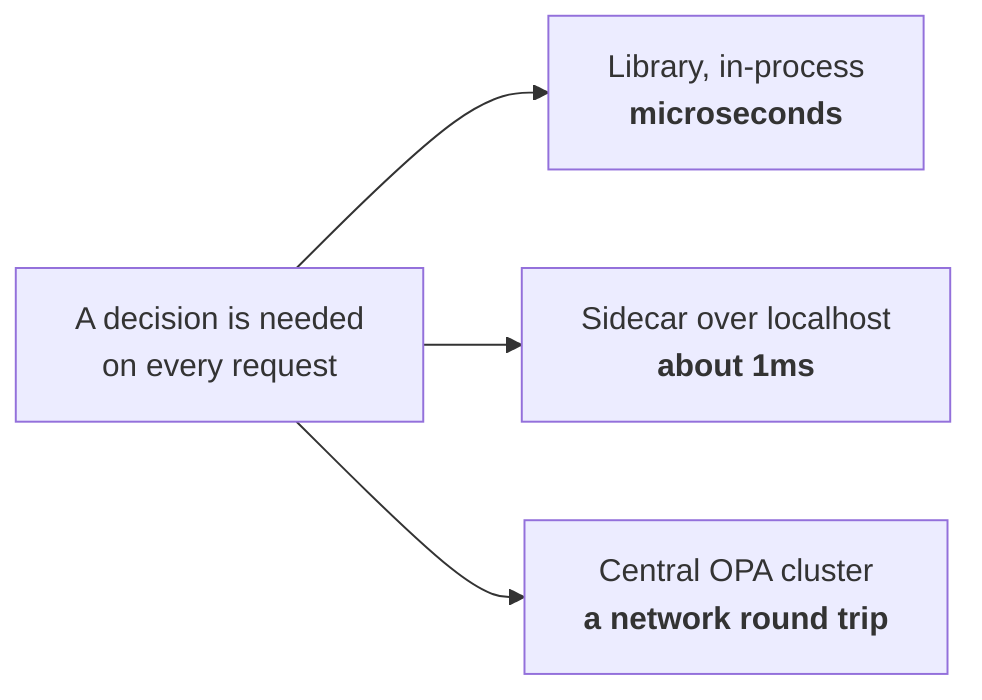
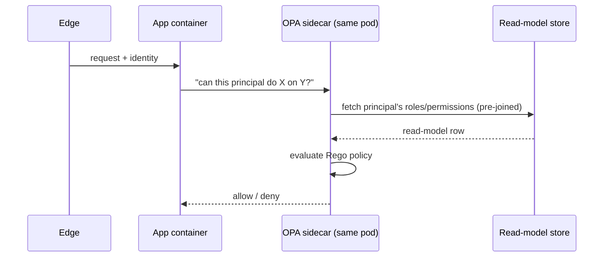

# OPA and Rego

Policy as code, evaluated at request time. This is the engine behind your
13s→200ms story, so expect performance questions as much as language ones.

Docs: [Open Policy Agent](https://www.openpolicyagent.org/docs/latest/)

---

## In brief

- OPA decouples authorization logic from application code: policy lives as
  versioned, testable Rego instead of `if` statements scattered across
  services. **PEP** (your service) asks; **PDP** (OPA) decides.
- **Deployment shape drives latency.** Library/in-process is microseconds,
  sidecar over localhost is ~1ms, a central OPA cluster is a network round
  trip on every request — the latency trap, since authorization runs on
  every request.
- **`default allow := false`** — deny by default, always. Skipping it fails
  open on any unmatched input, the wrong direction for security. Conditions
  inside a rule AND together; multiple rules of the same name OR.
- **Never fetch data during evaluation** (`http.send` inside policy) — that's
  an N+1 against the policy store on every authorization decision, and it's
  the classic cause of multi-second tails. Push data into OPA via bundles or
  a push API instead.
- **Cache the decision, not the inputs** — keyed on (principal, tenant,
  permission, resource). A cached allow for a now-revoked permission is a
  **security bug, not a stale read**, so invalidation needs versioned cache
  keys (bump a counter on any role change), not just a TTL.
- Diagnosing a slow policy starts by splitting "inside evaluation" (rules
  that can't be indexed, deep comprehensions, a huge `data` document) from
  "around evaluation" (a network hop to a central PDP) — the fix is
  different depending on which one it is.
- Test policy with a decision table weighted toward **negative** cases
  (authorization bugs are overwhelmingly wrongly-*permitted*), explicit
  cross-tenant denial tests, and shadow-mode evaluation on real traffic
  before a new policy enforces anything.

---

## Foundations

**OPA** is a general-purpose policy engine. You hand it a JSON input and it
returns a decision, evaluated against policies written in **Rego**.

The value is separation: authorization logic stops being `if` statements
scattered across services and becomes versioned, reviewable, testable policy in
one place. Services ask, they don't decide.

**PDP and PEP** — the vocabulary interviewers use:

- **PEP** (Policy Enforcement Point) — in your service, at the request path.
  Asks the question, applies the answer.
- **PDP** (Policy Decision Point) — OPA. Evaluates policy, returns allow/deny.

### Deployment shapes, and why it matters for latency


```mermaid
flowchart LR
  R["A decision is needed<br/>on every request"] --> L["Library, in-process<br/><b>microseconds</b>"]
  R --> S["Sidecar over localhost<br/><b>about 1ms</b>"]
  R --> C["Central OPA cluster<br/><b>a network round trip</b>"]
```
*The third shape is the latency trap: authorization runs on every request, so a network hop per decision lands straight in your p99.*

| Shape | Latency | Trade |
| --- | --- | --- |
| **Library, in-process** | Microseconds | No network hop; policy shipped with the app |
| **Sidecar** | ~1ms, localhost | Independent policy updates, no cross-network hop |
| **Central service** | Network round trip | One place to manage; a hot dependency and a scaling problem |

**A central OPA service on a hot path is a latency trap.** Sidecar or embedded
keeps evaluation local, which is usually the right answer for authorization
that runs on every request.

---

## Rego, enough to read it

Declarative and query-based rather than imperative. Rules define what's true.

```rego
package authz

import future.keywords.if
import future.keywords.in

default allow := false                    # deny by default — always

allow if {                                # this rule ORs with any other `allow`
    input.action == "read"
    "viewer" in user_roles                # all conditions AND together
}

allow if {
    input.action in {"read", "publish"}
    "editor" in user_roles
    input.resource.tenant == input.user.tenant     # tenant isolation
}

user_roles contains role if {             # a set built by comprehension
    some binding in data.bindings
    binding.user == input.user.id
    binding.tenant == input.user.tenant   # roles are per-tenant
    role := binding.role
}
```

Three things to know for an interview:

- **`default allow := false`** — deny by default. Any policy without it fails
  open when no rule matches, which is the wrong direction for security.
- **Within a rule, conditions AND. Across rules of the same name, they OR.**
  Multiple `allow` blocks are alternative grounds for allowing.
- **`input` vs `data`** — `input` is the request; `data` is loaded state (role
  bindings, org memberships). How `data` gets in and stays fresh is the real
  operational question.

---

## Performance — where your story lives

Naive policy evaluation degrades in predictable ways, and these are the
candidates for what your 13 seconds was doing:

| Cause | Why it's slow | Fix |
| --- | --- | --- |
| **Rules not indexed** | Every rule evaluated per request; cost grows with policy count | Structure rules so OPA can index on `input` fields |
| **Large `data` documents** | Whole document parsed/held per evaluation | Load only what's needed; partial bundles |
| **Fetching data per request** | An N+1 against the policy store inside evaluation | Push data into OPA; don't fetch during evaluation |
| **Deep comprehension over big sets** | Full scans inside the policy | Precompute; restructure the data shape |
| **Central PDP over the network** | A round trip per authorization | Sidecar or embed |

**Caching decisions** is the other half. Cache the *decision*, not the inputs —
don't cache the policy and re-evaluate, cache the boolean outcome keyed on
(principal, tenant, permission, resource).

And then the correctness problem that outranks all of it: **a cached allow for
a revoked permission is a security bug, not a stale read.** Versioned cache
keys — a counter per user or tenant, bumped on any role change — invalidate
everything derived at once without enumerating keys.

> **In your own work.** You redesigned Rego policy evaluation *and* the Redis
> caching model together, taking the tail from ~13s to under 200ms. Both halves
> get asked about, and so does invalidation on role change. See
> [contentstack](../00-experience/contentstack.md) §5.


## Building it

**Libraries**

| Need | Library | Why |
| --- | --- | --- |
| Library / in-process shape | `@open-policy-agent/opa-wasm` | Compiles Rego to WASM, evaluates with no network hop |
| Sidecar / central shape | the `opa` binary itself | No npm package involved — you call it over localhost or the network, not import it |

**Setting it up — deploying a policy bundle**

1. Write the Rego, then `opa build -o bundle.tar.gz` to package it.
2. Serve the bundle from an OCI registry or S3; point OPA's discovery config
   at that URL.
3. OPA polls for bundle updates on its own — a new policy ships without a
   redeploy of the service that calls it.

**Pseudocode — the library shape**

```ts
import { loadPolicy } from '@open-policy-agent/opa-wasm';

const policy = await loadPolicy(fs.readFileSync('bundle/policy.wasm'));
const [result] = policy.evaluate({ user, action, resource, tenant });
// result.allow — no network hop, no OPA process to keep alive
```

---

## Interview Q&A

### Q: What problem does OPA solve?
**Level:** intermediate · **Tags:** opa, policy, architecture

<details><summary>Model answer</summary>

It decouples authorization logic from application code.

Without it, authorization is `if` statements spread across every service —
written per-feature, inconsistent between teams, impossible to audit centrally,
and requiring a deploy to change. Every new endpoint is a chance to forget a
check.

With OPA, policy is data: written in Rego, version-controlled, unit-tested,
reviewed like code, and updatable without redeploying services. The service
sends a JSON input describing the request and gets a decision back. Services
become enforcement points; they no longer *contain* the rules.

The vocabulary is PDP and PEP — OPA is the decision point, your service is the
enforcement point.

The practical benefits I'd name: one place to answer "what is our policy?",
consistent enforcement across services, and the ability to test policy in
isolation with a decision table, including the negative cases that matter most.

</details>

**Follow-ups:**

1. Q: What are the downsides?
   <details><summary>Answer</summary>

   Several worth being honest about.

   **Latency** — you've added an evaluation, and if OPA is a central service,
   a network hop, on a path that runs for every request. This is the big one.

   **A new dependency** on the authorization path, which is tier-0 by
   definition. Fail-closed means an OPA outage is a total outage; fail-open is
   unacceptable for authz. In practice you cache and degrade deliberately.

   **Rego is unfamiliar** — declarative, and it takes people a while. Badly
   written policy is slower and harder to debug than the `if` statements it
   replaced.

   **Data freshness** — OPA needs role bindings and memberships, and keeping
   that in sync is now your problem, with its own staleness window.

   **Debuggability** — "why was I denied?" is harder to answer than reading a
   line of application code, which is why decision logging matters.

   </details>

2. Q: How do you get data into OPA and keep it fresh?
   <details><summary>Answer</summary>

   Three options with different trade-offs.

   **Bundles** — OPA periodically pulls a bundle of policy and data from a
   server. Simple and robust, and the staleness window is the poll interval.
   Good for data that changes slowly, like policy itself.

   **Push via the API** — write data into OPA as it changes. Fresher, but now
   you own the delivery and its failure modes, and every OPA instance needs the
   update.

   **Fetch during evaluation** (`http.send`) — I'd avoid it on a hot path. It
   turns every authorization into a synchronous external call inside policy
   evaluation, which is exactly the N+1 shape that produces multi-second tails.

   The pattern I'd use: bundles for policy and slow-moving data, push for
   things that must be fresh like revocations, and never fetch during
   evaluation.

   </details>

### Q: Your policy evaluation is taking seconds. How do you diagnose it?
**Level:** senior · **Tags:** opa, performance, profiling

<details><summary>Model answer</summary>

Measure before changing anything. OPA has a profiler that reports time per
rule, and decision logs carry evaluation duration — so first establish whether
the time is inside evaluation or around it.

That split matters: if it's around evaluation, it's the network hop to a
central PDP, or data loading, and the fix is deployment shape, not policy. If
it's inside, it's the policy.

Inside evaluation, the usual causes: rules that can't be indexed, so every rule
is evaluated for every request and cost grows with policy count; comprehensions
scanning large data sets; a large `data` document being processed per
evaluation; or `http.send` inside the policy, which is a network call per
authorization.

A tail at seconds while the median is fine usually means **fan-out** — a user
with many roles, or a resource with deep hierarchy, multiplying the work. The
p99 is a different code path, not just a slower one, which changes where you
look.

Fixes in order of impact: move evaluation local (sidecar or embedded);
restructure rules so they index; shrink and reshape `data`; precompute what
you're deriving per request; then cache decisions.

</details>

**Follow-ups:**

1. Q: You cache decisions. How do you invalidate when a role changes?
   <details><summary>Answer</summary>

   The hardest correctness problem here, and worth flagging as such: a stale
   allow is a security bug, not a stale read.

   **Short TTL alone** is the simplest — bounded staleness, no invalidation
   logic, and at 30 seconds it's often acceptable. But you've decided a revoked
   admin keeps admin for up to 30 seconds, so decide it deliberately.

   **Explicit invalidation** on role change is precise but requires knowing
   every affected key. With permission inheritance that fan-out is easy to get
   wrong, and a missed key is a silent hole.

   **Versioned keys** are what I'd reach for: include a per-user or per-tenant
   version counter in the cache key. A role change bumps the counter, so every
   key derived from the old version becomes unreachable at once. No
   enumeration, nothing to miss, and old entries expire naturally.

   Plus a **cache bypass** on the most sensitive operations, where the latency
   is worth paying.

   In practice: versioned keys, a short TTL as a backstop, and bypass on
   high-risk actions.

   </details>

2. Q: Would you embed OPA or run it centrally?
   <details><summary>Answer</summary>

   For authorization on a per-request hot path, **not centrally**. A central
   PDP adds a network round trip to every request and makes one service a
   tier-0 dependency for the entire platform.

   **Sidecar** is the usual answer: OPA runs alongside each service, so
   evaluation is a localhost call — sub-millisecond — while policy is still
   distributed and updated centrally via bundles. You keep central management
   without the shared runtime dependency.

   **Embedded as a library** is fastest, with no IPC at all, but policy updates
   now ride your deploy cycle, which loses much of the point.

   I'd choose sidecar by default, embedded where latency is truly critical, and
   central only for low-volume decisions where a round trip doesn't matter —
   admin operations, batch checks.

   </details>

3. Q: How do you test policy?
   <details><summary>Answer</summary>

   Rego has a built-in test framework — rules prefixed `test_` run with `opa
   test` — and policy being testable in isolation is one of the main
   arguments for it.

   What I'd test: a **decision table** of (role, permission, resource, tenant)
   to expected outcome, weighted toward the **negative** cases, because
   authorization bugs are overwhelmingly wrongly-permitted rather than
   wrongly-denied. Explicit **cross-tenant** tests — a user in org A attempting
   every action in org B, expecting denial across the board. And coverage on
   the policy itself, since `opa test --coverage` shows rules never exercised,
   which usually means either dead policy or an untested path.

   Beyond unit tests, the highest-value technique is **shadow evaluation in
   production**: run the new policy alongside the old without enforcing it and
   compare decisions on real traffic. It catches the cases nobody thought to
   write a test for, which is most of the interesting ones.

   </details>

---

## Worked example: a policy sidecar on the request hot path

A common architecture for authorization-as-a-service, once RBAC/OPA is on
the request path for every service: a lightweight sidecar next to each
workload, embedding OPA as a library rather than calling a shared cluster
service over the network.


```mermaid
sequenceDiagram
  participant Edge
  participant App as App container
  participant Sidecar as OPA sidecar (same pod)
  participant Store as Read-model store
  Edge->>App: request + identity
  App->>Sidecar: "can this principal do X on Y?"
  Sidecar->>Store: fetch principal's roles/permissions (pre-joined)
  Store-->>Sidecar: read-model row
  Sidecar->>Sidecar: evaluate Rego policy
  Sidecar-->>App: allow / deny
```
*The sidecar evaluates fresh on every request instead of caching decisions — the read model, not a decision cache, is what makes that fast enough.*

**Why same-pod, not a shared service:** authorization is the one place a
network hop and a stale cache both turn into either added latency on every
request or a security bug, so the sidecar avoids caching decisions at all —
it evaluates fresh, and it's fast because the store it reads is a pre-joined
read model (roles → permissions already expanded), not a chain of joins done
at read time.

**The dual-body pattern for zero-downtime policy migration:** when a policy
needs to change behaviour for some tenants but not others, write the rule
with two bodies — one for the old behaviour, one for the new — gated by a
piece of data (a tenant flag), not by which version of the policy bundle is
deployed:

```rego
allow {
  tenant_flag[input.tenant] == "new_model"
  new_permission_check
}
allow {
  tenant_flag[input.tenant] != "new_model"
  legacy_owner_or_admin_check
}
```

That makes the migration reversible per tenant in seconds — flip the flag —
instead of requiring a redeploy, which is exactly the property you want
during a gradual RBAC rollout.

---

## What a weak answer sounds like

- **"OPA is a library for authorization."** It's a general policy engine; you
  can use it for admission control, data filtering and config validation too.
- **Not knowing `default allow := false`.** Failing open is the wrong direction
  and this is the line that prevents it.
- **Running a central PDP on a hot path** without acknowledging the latency and
  dependency cost.
- **Caching decisions without an invalidation story.** That's a security bug
  waiting for a role change.
- **"Rego is just like writing if statements."** It's declarative; treating it
  imperatively produces slow, unindexable policy.

---

## Quiz

### MCQ: In the PDP/PEP vocabulary, what is OPA?
- [ ] The Policy Enforcement Point
- [x] The Policy Decision Point — it evaluates policy and returns a decision
- [ ] A caching layer in front of the database
- [ ] The API gateway itself
**Why:** Your service is the PEP — it asks the question and applies the answer. OPA is the PDP — it evaluates policy against input and returns allow/deny.

### MCQ: Why is running OPA as a central service on the authorization hot path considered a latency trap?
- [ ] Central OPA instances can't be load-balanced
- [x] Authorization runs on every single request, so a network round trip per decision lands directly in your p99
- [ ] Central OPA doesn't support Rego's full feature set
- [ ] It requires a separate database
**Why:** Library or sidecar deployment keeps evaluation local (microseconds to ~1ms); a central cluster adds a network hop that's paid on every request, not occasionally.

### MCQ: What does omitting `default allow := false` from a Rego policy risk?
- [ ] A syntax error at build time
- [x] An input that no rule matches has no guaranteed decision, instead of a safe, explicit deny
- [ ] Slower policy evaluation
- [ ] The policy simply won't compile
**Why:** Without an explicit default, "no rule matched" isn't the same as "denied" — deny-by-default has to be stated, not assumed, and the wrong assumption fails in the dangerous direction.

### MCQ: Within a single Rego rule body, how do multiple conditions combine?
- [x] AND — every condition in the body must hold
- [ ] OR — any one condition holding is enough
- [ ] They're evaluated in the order written, first match wins
- [ ] XOR — exactly one may hold
**Why:** Conditions inside one rule body AND together; it's separate rules sharing the same name (e.g. multiple `allow` blocks) that OR — each is an alternative ground for allowing.

### MCQ: Why is calling `http.send` (an external fetch) inside a Rego policy dangerous on a hot path?
- [ ] Rego doesn't support HTTP calls at all
- [x] It turns every authorization decision into a synchronous external call during evaluation — the classic N+1 shape behind multi-second tails
- [ ] It bypasses the `default allow := false` rule
- [ ] It only works with the sidecar deployment shape
**Why:** Data should be pushed into OPA (bundles, push API) ahead of time; fetching during evaluation means every single decision pays a network round trip.

### MCQ: What should be cached to speed up repeated authorization checks — and what's the danger if it's done wrong?
- [ ] Cache the raw Rego policy text; re-evaluate it each time
- [x] Cache the decision itself, keyed on (principal, tenant, permission, resource) — a stale cached "allow" for a revoked permission is a security bug, not just a stale read
- [ ] Cache the `input` document only
- [ ] Caching authorization decisions is never safe
**Why:** The output (allow/deny) is what's expensive to recompute and safe to reuse — as long as invalidation is correct, since an incorrect cached allow is an active vulnerability, not a UX annoyance.

### MCQ: Why are versioned cache keys (a per-user/tenant counter bumped on role change) preferred over a short TTL alone for authorization decisions?
- [ ] They're simpler to implement
- [x] A TTL alone means a revoked permission stays cached-allowed for up to the TTL window; versioned keys invalidate everything derived from a role change at once, with nothing to enumerate
- [ ] TTLs aren't supported by most cache stores
- [ ] Versioned keys use less memory
**Why:** A short TTL is a deliberate, bounded staleness trade; a version bump is immediate and exact — no missed keys, no waiting out a window.

### MCQ: Policy evaluation is fast at the median but has a multi-second p99. What does that pattern usually indicate?
- [ ] A network misconfiguration unrelated to policy
- [x] Fan-out — a specific request shape (many roles, deep resource hierarchy) is taking a different, more expensive code path through the policy
- [ ] The policy is missing `default allow := false`
- [ ] OPA's WASM compiler has a bug
- [ ] The database connection pool is exhausted
**Why:** A slow median points at a systemic issue; a slow tail with a fast median points at specific inputs multiplying the work — a different code path, not a uniformly slower one.

### MCQ: When testing Rego policy, why should negative test cases (denial) get more weight than positive ones?
- [ ] Rego's test framework only supports asserting denial
- [x] Authorization bugs are overwhelmingly cases of wrongly *permitting* access, so proving the policy correctly denies is the higher-value test
- [ ] Positive cases can't be expressed in `opa test`
- [ ] Negative cases run faster
**Why:** The failure mode that actually causes incidents is unintended access, not unintended denial — a decision table weighted toward "this must be denied" catches the costlier class of bug.

### MCQ: What does shadow-mode (dark-launch) policy evaluation in production actually test?
- [ ] Whether the new policy compiles correctly
- [x] Whether the new policy's decisions match the old policy's decisions on real traffic, before the new one enforces anything
- [ ] The raw latency of policy evaluation under load
- [ ] Whether `opa test` coverage is complete
**Why:** Running old and new policy side-by-side without enforcing the new one surfaces divergences on real-world inputs nobody thought to write as a unit test — the highest-value technique beyond unit tests.

---

## Glossary

- **OPA** — Open Policy Agent, the engine.
- **Rego** — its declarative policy language.
- **PDP / PEP** — decision point / enforcement point.
- **`input`** — the request being decided on.
- **`data`** — loaded state: role bindings, memberships.
- **Bundle** — a packaged set of policy and data OPA pulls periodically.
- **Partial evaluation** — pre-computing what's knowable to speed up decisions.
- **Decision log** — the record of what was decided and why; what auditors want.
- **Sidecar** — OPA alongside each service, so evaluation is a localhost call.
- **`default allow := false`** — deny by default.
