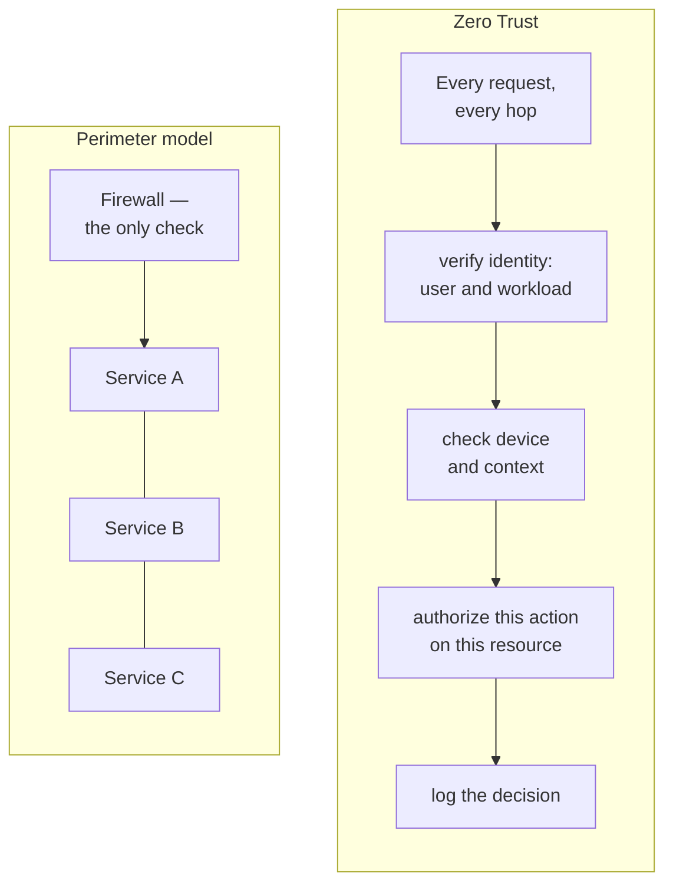

# Zero Trust and the identity providers

Two things in one chapter: the architectural idea your resume claims, and the
three IdPs it names. Both are places where a vague answer costs you.

**This chapter maps directly to [WEAK-SPOTS](../WEAK-SPOTS.md) #8** — "Zero Trust
Architecture" is on your skills line with no bullet evidencing it, and it is
the single most over-claimed phrase in IAM. Some interviewers ask about it
*specifically* to find out whether a candidate is pattern-matching on
vocabulary.

Reference: [NIST SP 800-207, Zero Trust Architecture](https://csrc.nist.gov/pubs/sp/800/207/final)

---

## Foundations

**The old model** was a wall around the network. Inside the firewall was
trusted, outside wasn't. The problem is what happens once someone gets in — via
VPN, a stolen laptop, a compromised dependency. Once inside, they can move
around freely, because everything inside trusts everything else inside.

**Zero Trust** discards network location as a basis for trust. NIST SP 800-207
frames it as: no implicit trust granted based on physical or network location
or asset ownership. Every request is authenticated and authorised on its own
merits.

*One check at the door versus a check at every hop. The difference is what a single phished laptop gets you.*

Contrast the two models. Under a **perimeter** model a firewall is the only
check: once past it every service trusts every other, so an attacker who
phishes one laptop reaches everything. Under **Zero Trust** every service call
carries a workload identity and token and is checked by policy on every hop —
so the attacker on that same network has no identity, no token, and the policy
check returns 403.

Network position stops being evidence of anything.

The slogan is "never trust, always verify". Slogans don't pass interviews. What
does is naming **the controls**:

| Principle | What it means in code |
| --- | --- |
| **Per-request authorization** | Every request authorised, not just the session's first |
| **Least privilege** | Minimum access needed, granted by default |
| **Assume breach** | Design as though the attacker is already inside |
| **Continuous verification** | Re-evaluate as signals change, not once at login |
| **Explicit trust decisions** | Based on identity, device, and behaviour — never network position |
| **Micro-segmentation** | Services authenticate to each other; no implicit internal trust |

### How to answer this without sounding like marketing

Skip the definition. Name what you actually built:

- **Per-request authorization** rather than perimeter trust — every call
  through a policy check, including service-to-service.
- **Short-lived tokens** so a stolen credential has a bounded life.
- **Session governance** — idle and absolute timeouts, active termination.
- **Least privilege by default** in the RBAC model — 2–3 minimal default roles
  rather than broad ones.
- **MFA hardening** — moving off SMS to authenticator apps.
- **Services authenticating to each other** through the auth package, rather
  than trusting the internal network.

You have real work behind every one of those. Say those; don't say the slogan.

> **In your own work.** The gRPC auth package is a micro-segmentation story —
> nine services each authenticating and authorising rather than trusting the
> network. Session governance is continuous verification. Frame them that way
> and the skills-line claim becomes evidenced.

---

## The identity providers

Your resume names three. Be able to scope your exposure to each honestly —
claiming depth in all three and then being unable to describe Ping is worse
than saying "Okta and Entra in depth, Ping by evaluation".

### Okta

The independent identity leader; strong in workforce identity, and Auth0 (which
Okta acquired) covers customer identity. Concepts an integrator meets:

- **Universal Directory** — the user store; profile mappings transform IdP
  attributes to your app's shape.
- **SSO apps** — SAML or OIDC, published in the **Okta Integration Network**
  after review. That's what you shipped.
- **SCIM provisioning** — Okta as SCIM client against your server, deprovision
  via `PATCH active:false`.
- **Groups → app roles** through group push or attribute mapping.

### Microsoft Entra ID (formerly Azure AD)

Ubiquitous because it's bundled with Microsoft 365 — often not chosen so much
as already present.

- **Conditional Access** — the signature feature and the most Zero-Trust thing
  in mainstream use: policies combining user, device compliance, location, risk
  level and application to decide whether to allow, block, or require MFA.
- **App registrations** and the Microsoft identity platform for OIDC/OAuth.
- **Enterprise applications** for SAML SSO and provisioning.
- **Tenants** — every Entra org is a tenant, and multi-tenant apps must
  validate the `tid` claim rather than trusting any Microsoft-issued token.

### Ping Identity

Strong in large regulated enterprises — banking, insurance, government — often
in hybrid or on-premises deployments where Okta and Entra are less common.
PingFederate is the federation server, PingOne the cloud offering. If your
exposure is evaluation rather than integration, say so plainly.

## Building it

Zero Trust isn't one library — it's several existing controls composed
together, most of which already have their own chapter here:

| Control | Where it's built | See |
| --- | --- | --- |
| Short-lived tokens, no implicit trust from location | `jose`, as in JWT | [jwt](06-jwt.md) |
| Per-request authorization | `casbin` / OPA, as in RBAC/ABAC | [rbac-abac](08-rbac-abac.md), [opa-rego](09-opa-rego.md) |
| Workload-to-workload identity (mTLS) | usually a service mesh sidecar (Istio, Linkerd), not app code | [microservices](../04-backend/05-microservices.md) |
| Continuous device/context checks | the IdP's own engine (Okta Verify, Entra Conditional Access) — not something you build | this chapter, above |

The interview signal here is naming the composition correctly, not shipping a
new dependency — see "How to answer this without sounding like marketing".

---

## Interview Q&A

### Q: What is Zero Trust, in practice?
**Level:** intermediate · **Tags:** zero-trust, architecture

Model answer

It's the abandonment of network location as a basis for trust. The old model
had a trusted internal network behind a perimeter; once inside, you could move
laterally. Zero Trust says being inside the network grants nothing — every
request is authenticated and authorised on its own merits, per request.

In practice, in a system I've worked on, that means: authorization evaluated on
every call rather than established once at login; services authenticating to
each other rather than trusting internal traffic; short-lived tokens so a
stolen credential has a bounded life; least privilege as the default in the
role model; session governance with idle and absolute timeouts and active
termination; and MFA that can be stepped up when signals warrant it.

The phrase is over-used, so I'd rather describe the controls than the slogan.
The test I'd apply to any system claiming it: if an attacker gets a foothold on
an internal host, what can they reach without a credential? Under Zero Trust,
nothing.

**Follow-ups:**

1. Q: Does Zero Trust mean you don't need a firewall?
   

Answer

   No — it means you don't *rely* on it as the security boundary. Network
   controls remain useful defence in depth; they stop being the thing that
   decides who may do what.

   The distinction I'd draw: a firewall reduces attack surface and blocks
   obvious noise. It doesn't authorise, because it can't see identity, intent
   or resource. Under Zero Trust the authorization decision lives with the
   service that owns the resource, informed by identity and context; the
   network control is one more layer, not the layer.

   Treating them as mutually exclusive is a misreading — NIST's own framing has
   Zero Trust as complementary to, not replacing, network segmentation.

   

2. Q: What's the hardest part of adopting it in an existing system?
   

Answer

   Service-to-service authentication, because the existing system almost
   certainly has services calling each other with no credentials at all — the
   network *was* the authorization.

   Retrofitting that means every internal call needs an identity and a policy
   check, which touches every service, adds latency to paths that had none, and
   creates a hard dependency on whatever issues those credentials. It's a large
   migration with no visible product benefit, which makes it hard to fund.

   The second hardest is **legacy that can't participate** — an old system that
   can't present a token or evaluate policy. You end up with a gateway in front
   of it translating, which is a compromise that quietly reintroduces implicit
   trust behind that gateway.

   The internal auth package we built was a piece of this: it made per-service
   authorization the easy path, so nine teams could adopt it incrementally
   rather than needing a synchronised platform-wide change.

   

### Q: What's Conditional Access, and what makes it Zero-Trust-shaped?
**Level:** senior · **Tags:** entra, zero-trust, risk

Model answer

It's Entra ID's policy engine sitting at authentication: policies that combine
signals — who the user is, which app they're reaching, whether the device is
managed and compliant, location, and a risk score from Microsoft's detections —
and decide to allow, block, require MFA, or require a compliant device.

What makes it Zero-Trust-shaped is that trust is **computed from current
signals** rather than granted by network position, and it's re-evaluated rather
than decided once. A user on a managed device in a normal location gets through
quietly; the same user on an unknown device from an unusual location gets
challenged or blocked.

The typical policies: require MFA for administrative roles; require a compliant
device for sensitive applications; block legacy authentication protocols that
can't do MFA; and step up on elevated sign-in risk.

For an application integrating with it, the practical consequence is that
**you don't implement any of this** — the enterprise enforces it in their IdP
before the assertion reaches you. Your job is to federate properly and not
undermine it, for example by not offering a local password login that bypasses
the customer's SSO policy.

**Follow-ups:**

1. Q: A customer enforces MFA in their IdP. Do you still need MFA in your app?
   

Answer

   For users arriving via that IdP, no — duplicating it is friction with no
   security gain, and enterprises specifically don't want you re-challenging.
   You can read the `amr` claim (authentication methods reference) to confirm
   MFA was actually performed rather than assuming.

   But you need it for the paths that *bypass* the IdP, and those are the real
   risk: local admin accounts, break-glass accounts, service accounts and API
   tokens. A tenant with SSO-enforced MFA and an unprotected local admin login
   has a front door and an unlocked side door.

   So: enforce MFA for anything not federated, and give tenants a setting to
   require SSO for all human logins, with a documented and tightly-controlled
   break-glass exception. That combination is what security reviews look for.

   

2. Q: How would you support step-up authentication for a sensitive action?
   

Answer

   The user has a valid session, but a specific action — changing MFA settings,
   exporting data, a privileged role change — warrants fresh proof.

   The mechanism: record when the user last authenticated, and how strongly.
   When a sensitive action is attempted, check that against a policy for that
   action — say, re-authentication within the last five minutes, with a
   phishing-resistant factor. If it fails, challenge, then proceed.

   With OIDC there are standard tools for exactly this: the `max_age` parameter
   forces re-authentication older than a threshold, `acr_values` requests a
   specific authentication strength, and the returned `auth_time` and `acr`
   claims let you verify what actually happened rather than trusting the flow.

   The design points I'd raise: policy should attach to the *action*, not
   scatter through handlers; the elevated state should be short-lived and
   scoped rather than upgrading the whole session; and it must be enforced
   server-side, since a client-side prompt is trivially skipped.

   This is continuous verification in practice — trust isn't a property
   established at login and held forever.

   

### Q: You've integrated with Okta and Entra. What actually differs in practice?
**Level:** senior · **Tags:** okta, entra, integration

Model answer

Protocol-wise they're both standards-compliant, so SAML and OIDC behave much
the same. The differences are operational.

**Entra is usually already present** — it comes with Microsoft 365, so
customers have it whether or not they chose it, and their identity team may be
generalist IT rather than identity specialists. Tenancy is explicit and you
must validate the `tid` claim: accepting any Microsoft-issued token because it
came from Microsoft is a real cross-tenant vulnerability.

**Okta is usually a deliberate purchase**, so the customer typically has a
dedicated identity team who know the domain well and ask sharper questions.
Group and profile mapping is more flexible.

Both run a marketplace review before you can list — the Okta Integration
Network and the Entra gallery — and both reviews focus on the same things:
correct assertion and token validation, SCIM behaviour including
deprovisioning, and setup documentation being clear enough that a customer
admin can configure it without contacting you.

The universal practical lesson is that **certificate rotation is the number one
support issue**, regardless of IdP. Certs expire, SSO breaks for an entire
company at once, and nobody read the renewal email.

> **FILL IN:** what actually differed for you between the two integrations, and
> what their reviewers pushed back on. A specific detail here is far more
> convincing than the general comparison above.

---

## What a weak answer sounds like

- **Defining Zero Trust as "never trust, always verify" and stopping.** That's
  the marketing line. Interviewers ask this to see if you can go past it.
- **"We're Zero Trust because we use MFA."** MFA is one control, not the
  architecture.
- **Claiming deep expertise in all three IdPs.** Scope it honestly; the
  follow-up will find the gap.
- **Not knowing Conditional Access** when Entra is on your resume — it's its
  most distinctive feature.
- **Forgetting that SSO-enforced MFA can be bypassed** by local and service
  accounts.

---

## Glossary

- **Zero Trust** — no implicit trust from network location; verify every
  request (NIST SP 800-207).
- **Micro-segmentation** — services authenticate to each other; no implicit
  internal trust.
- **Assume breach** — design as though the attacker is already inside.
- **Conditional Access** — Entra's signal-based policy engine at authentication.
- **Step-up authentication** — extra proof for a sensitive action.
- **`amr` / `acr` / `auth_time`** — how authentication happened, how strong,
  and when.
- **`max_age`** — OIDC parameter forcing re-authentication after a threshold.
- **`tid`** — Entra tenant id; validate it in multi-tenant apps.
- **OIN** — Okta Integration Network, the marketplace.
- **Break-glass account** — emergency local admin, exempt from SSO.
