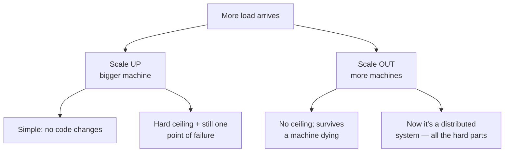
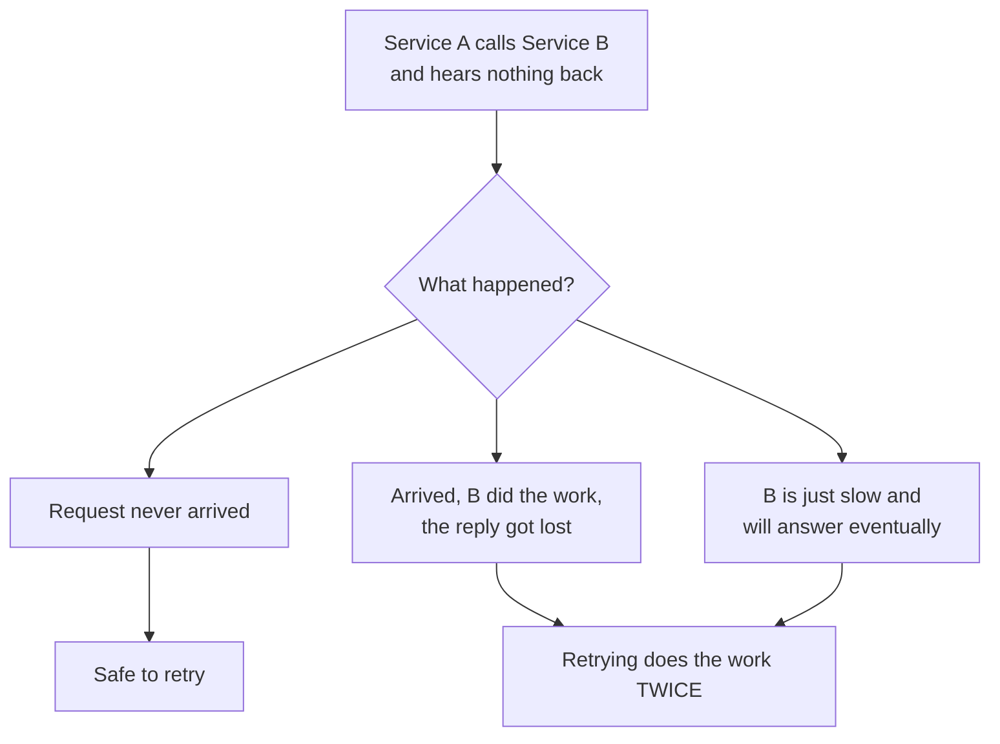
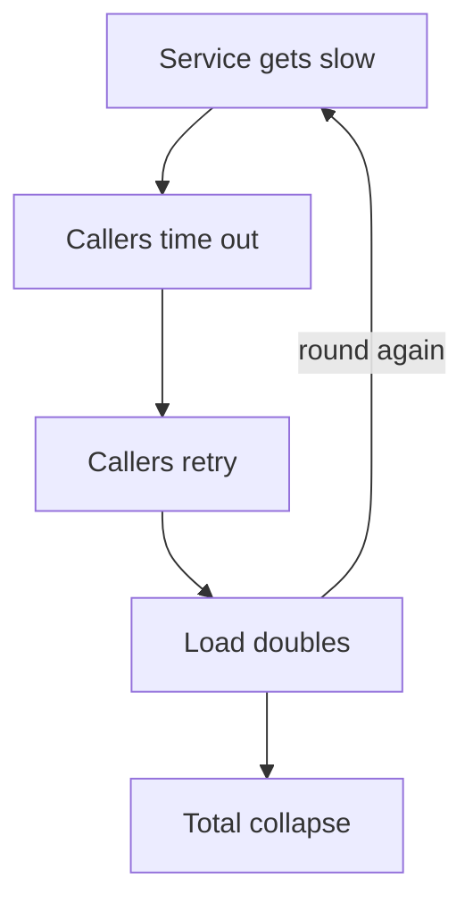
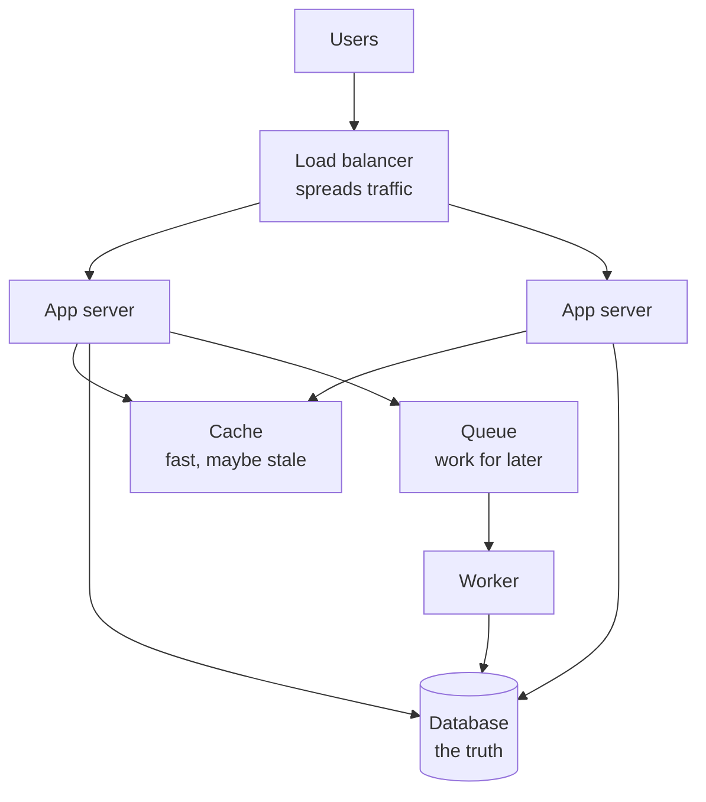

# Start here — what a distributed system is, and why anyone bothers

This chapter assumes you know nothing about the topic. No jargon is used before
it is explained, and every term introduced here is used unexplained in the
chapters that follow — so read this one first even if you plan to skim.

The rest of Part 02 is written at the depth you would *speak* in a senior
interview. This chapter is written at the depth you need to *understand* it the
first time. Same ideas, slower.

---

## The one-sentence version

A **distributed system** is a program that runs on more than one computer, where
those computers have to talk to each other over a network to get one job done.

That's it. Everything hard about the field comes from one consequence of that
sentence: **the computers can fail independently, and the network between them
is unreliable.**

---

## Why not just use one computer?

One computer is genuinely better, when it works. There's no network, no
coordination, no partial failure. If you can fit on one machine, do.

You leave when one of four things forces you out.

| The force | What it looks like | Why one machine can't fix it |
| --- | --- | --- |
| **Too much traffic** | 50,000 requests/second arriving | One machine has a fixed number of CPU cores |
| **Too much data** | 200 TB of user files | One machine has a fixed number of disks |
| **Too far away** | Users in Sydney, server in Virginia | Physics — light takes ~150ms to cross the planet and back |
| **Can't afford downtime** | One machine reboots, everything is offline | One machine is one thing that can die |

The fourth is usually the real reason. A single server is a **single point of
failure** — one component whose death takes the whole system with it. You can
buy a bigger server, but you cannot buy a server that never fails.

### Scaling up vs scaling out

Two ways to handle more load. You will be asked to compare them.


*Scaling up is easy and runs out; scaling out has no ceiling and buys you every problem in this part of the book.*

- **Scale up (vertical)** — replace the machine with a bigger one. 8 cores → 64
  cores. No code changes. Cheap in engineering time, expensive in hardware, and
  it stops: there is a biggest machine you can rent, and you are still one
  reboot from an outage.
- **Scale out (horizontal)** — add more machines and spread the work. No
  ceiling, and one machine dying is survivable. The cost is that your program is
  now distributed, and the next 8 chapters exist because of it.

**The senior instinct:** scale up first, because it's free engineering-wise, and
scale out when you hit the ceiling *or* when you need to survive a machine
failing. Most teams scale out too early and pay the complexity for load they
never see.

---

## The vocabulary, once

You cannot read anything in this field without these ten words. Learn them here
and the rest of the book stops being noisy.

| Word | What it actually means | Everyday analogy |
| --- | --- | --- |
| **Node** | One running computer (or container) in the system | One employee |
| **Cluster** | A group of nodes working as one system | The department |
| **Service** | One program with one job (e.g. "the auth service") | One team's remit |
| **Client / server** | Whoever asks / whoever answers. A service is both, depending on the call | Caller / callee |
| **Request / response** | One question over the network, and its answer | An email and its reply |
| **Latency** | How long one request takes | How long one email takes to get a reply |
| **Throughput** | How many requests you handle per second | How many emails you answer per hour |
| **Availability** | The fraction of time the system is usable | How often the office is open |
| **Stateless** | The node remembers nothing between requests | A clerk who reads your whole file each time |
| **Stateful** | The node remembers something you'll need next time | A clerk who remembers your case |

### Latency and throughput are not the same thing

This trips up almost everyone at first. A wider motorway does not make your car
faster; it lets more cars through.

- Adding machines usually improves **throughput** — more requests handled.
- Adding machines usually does **not** improve **latency** — a single request
  still takes as long as it takes, and if it now crosses a network to another
  machine, it takes *longer*.

So "we scaled out and it's still slow for the user" is a completely normal
outcome, and knowing why is a senior-level distinction.

### Stateless is the property that makes scaling out easy

If a node remembers nothing between requests, any node can serve any request.
You can add ten more, delete three, restart one — nothing is lost. That is why
"make your services stateless" is repeated everywhere.

State has to live *somewhere*, though; you don't delete it, you move it. It
moves into a database, or a cache like Redis, or a message log like Kafka —
systems built specifically to hold state safely across machines. Your
application servers become stateless because the state moved to a system that
specialises in it.

> This is exactly the shape of a session-token design: put the session in Redis
> rather than in one server's memory, and any of the fifty API servers can
> handle the user's next request. See [caching at scale](07-caching-at-scale.md).

---

## What actually goes wrong

Here is the part that makes this a *field* rather than a configuration exercise.

### Failure stops being binary

On one machine, a function call has two outcomes: it returns, or the whole
process dies. Both are unambiguous — you always know which happened.

Across a network there is a third outcome, and it is the one that matters:
**nothing comes back, and you don't know why.**


*A silent call has at least three explanations that need opposite responses, and A cannot tell them apart — this is the single fact the whole field is built around.*

Look at what that means concretely. You call "charge this customer £50" and hear
nothing. Did the charge happen? **You cannot know.** If you retry and it did
happen, you charged them twice. If you don't retry and it didn't happen, you
lost the payment.

This is called **partial failure**: part of the system failed while the rest
kept going, and the surviving part can't tell what the failed part managed to
do. It is the reason for:

- **Idempotency** — designing operations so that doing them twice is the same as
  doing them once, which makes retrying safe.
- **Consensus algorithms** — machinery for getting nodes to agree on what
  happened when they can't trust the network.
- The fact that **"exactly once" delivery does not exist**, no matter what a
  vendor's marketing page says.

Chapter [01](01-foundations-failure-modes.md) takes this apart properly.

### Retrying can be the thing that kills you

The obvious response to a failed call is to try again. Now picture a service
that got slow because it's overloaded. Every client times out. Every client
retries. The service now receives double the traffic, at the exact moment it
was already drowning.


*Retries are a feedback loop, which is how a two-second blip becomes a two-hour outage.*

This is a **retry storm**. It is one of the most common causes of real outages,
and the fixes — backoff, jitter, circuit breakers — are in
[resilience and rate limiting](08-resilience-rate-limiting.md).

### A network call is astronomically expensive

Some numbers, because interviewers use them to check you can reason about cost:

```
Read from CPU cache            ~1 nanosecond
Read from main memory        ~100 nanoseconds
Read from SSD                ~150 microseconds     (1,500× memory)
Call another service in the
  same datacentre            ~500 microseconds     (5,000× memory)
Call across the Atlantic     ~150 milliseconds     (1,500,000× memory)
```

The one to remember: **a call to another service costs about 5,000 memory
reads.** A loop that makes 100 service calls inside it isn't untidy — it's a
different order of magnitude of slow. This is also why caching pays off so
dramatically: turning a service call into a memory read is a ~5,000× saving on
that step.

---

## The three things you're always trading

Every design decision in this field is one of these three, and being able to
name the trade is most of what "thinking like a senior engineer" means.

| You want | You give up | Example |
| --- | --- | --- |
| **Consistency** — everyone sees the same data | Availability or speed | A bank balance must be exact, so the write waits for every copy |
| **Availability** — always answers, even when parts are broken | Freshness | A social feed shows you a slightly stale post rather than an error |
| **Latency** — answers fast | Freshness or cost | A cache answers in 1ms with data that's 30 seconds old |

You never get all three at full strength. The formal statement of this is the
**CAP theorem**, and the more useful version is **PACELC** — both in
[chapter 02](02-cap-pacelc-consistency.md).

The beginner mistake is thinking one of these is "correct". None is. A payments
ledger and a "like" counter should make opposite choices, and saying so out loud
is what an interviewer is listening for.

---

## How the pieces fit together

Almost every distributed system you'll meet is the same handful of parts
arranged differently. You'll draw this shape constantly.


*The standard shape: stateless app servers behind a load balancer, a cache in front of the database, and a queue for anything that doesn't have to finish before the user gets a reply.*

Walking it:

1. **Load balancer** — one address the world talks to, spreading requests across
   app servers. When one server dies it stops sending traffic there. This is
   what makes "add more machines" actually work.
2. **App servers** — your code. Stateless, so they're interchangeable and you
   can add or remove them freely.
3. **Cache** — a small, extremely fast copy of the data you read most. Answers in
   under a millisecond instead of tens of milliseconds, at the cost of sometimes
   being out of date.
4. **Database** — the source of truth. Slower, durable, and the thing you're
   protecting with everything else in the diagram.
5. **Queue** — a to-do list. Anything the user doesn't need to wait for (send the
   email, resize the image, update the search index) goes here and a **worker**
   picks it up later. This is how a slow task stops being a slow response.

Each box is a chapter. [Building blocks](../03-system-design/03-building-blocks.md)
in Part 03 covers when to reach for each; the specific technologies that fill
each box are in [the technology landscape](00b-the-technology-landscape.md).

---

## What to read next, in order

The chapters build on each other. This is the order that works:

| Read | Chapter | Why here |
| --- | --- | --- |
| 1 | [Foundations and failure modes](01-foundations-failure-modes.md) | Partial failure, properly. Everything else depends on it |
| 2 | [CAP, PACELC and consistency](02-cap-pacelc-consistency.md) | The trade you just met, formalised |
| 3 | [Replication and partitioning](03-replication-partitioning.md) | How data survives a machine dying, and how it outgrows one machine |
| 4 | [Caching at scale](07-caching-at-scale.md) | The highest-leverage lever, and its failure modes |
| 5 | [Messaging and streams](06-messaging-streams.md) | Queues and logs — how services stop calling each other directly |
| 6 | [Idempotency and transactions](05-idempotency-transactions.md) | Making retries safe; work spanning services |
| 7 | [Resilience and rate limiting](08-resilience-rate-limiting.md) | Stopping one failure becoming all of them |
| 8 | [Consensus and coordination](04-consensus-coordination.md) | The hardest, and the least often asked. Last on purpose |

---

## Building it

**Libraries**

You don't build a distributed system by picking libraries — you build it by
picking *systems* (see [the technology landscape](00b-the-technology-landscape.md)).
But three tools are worth naming this early, because they're how you *see* the
behaviour described above rather than take it on faith.

| Need | Tool | Why |
| --- | --- | --- |
| Run several services on your laptop | `docker compose` | A Postgres, a Redis and two app containers in one file — the minimum setup where partial failure is even possible |
| Break the network on purpose | `toxiproxy` | Injects latency, timeouts and resets between real services, so "what happens when the database is slow" is something you observe, not imagine |
| Retry without causing a storm | `p-retry` | Exponential backoff and jitter by default, which is the correct shape rather than a naive loop |

**Pseudocode — the two lines that separate a safe retry from an outage**

```ts
import pRetry from 'p-retry';

// The dangerous version: a tight loop with no delay. Three clients doing this
// against a struggling service is how the retry storm above starts.
//   for (let i = 0; i < 3; i++) { try { return await charge(); } catch {} }

await pRetry(() => chargeCard(idempotencyKey, amount), {
  retries: 3,
  minTimeout: 200,
  factor: 2,        // backoff: 200ms, 400ms, 800ms — gives the service room
  randomize: true,  // jitter: without it every client retries at the same
                    // instant and you've built a synchronised stampede
});
```

`idempotencyKey` is doing the real work here, not the retry options. Backoff and
jitter stop you *worsening* an outage; only the key stops a retry charging the
customer twice, because — per the diagram above — the caller genuinely cannot
tell "never arrived" from "worked, reply lost".

---

## Interview Q&A

### Q: What is a distributed system, and why would you build one?
**Level:** foundation · **Tags:** distributed, basics, scaling

<details><summary>Model answer</summary>

A distributed system is one program running across multiple machines that
coordinate over a network to do a single job.

You build one because a single machine hits a limit. There are four:
throughput — a fixed number of cores; storage — a fixed number of disks;
geography — you can't beat the speed of light to users on another continent;
and availability — one machine is one thing that can die, and that's an
unacceptable single point of failure for anything with an SLA.

The honest framing is that it's a cost, not a goal. A single machine has no
network, no coordination, and no partial failure. So the rule is: scale
vertically first because it costs no engineering, and go distributed when you
hit a real ceiling or need to survive a node failing — not because it's the
sophisticated choice.

What you buy with that cost is throughput and fault tolerance. What you pay is
partial failure: a call that neither succeeds nor fails but goes silent, and
the caller can't tell whether the work happened. Idempotency, consensus and
the whole resilience toolkit exist to manage that one ambiguity.

</details>

**Follow-ups:**

1. Q: What's the difference between scaling up and scaling out, and which would you do first?
   <details><summary>Answer</summary>

   Scaling up is replacing the machine with a bigger one; scaling out is adding
   more machines and spreading the work.

   Up first, essentially always. It needs no code changes and no new failure
   modes, and modern instances are enormous — a lot of systems that "need
   distributing" actually need one more memory tier and a fixed query plan.

   You scale out when you hit a real ceiling, or when availability requires
   surviving a machine dying, which scaling up can never give you no matter how
   big the machine is. That second reason is often the one that actually
   decides it: a single instance means a single reboot is an outage.

   The trap is scaling out early. You take on partial failure, coordination and
   distributed debugging for load you don't have, and those costs are permanent
   while the load is hypothetical.

   </details>

2. Q: Does adding servers make the system faster?
   <details><summary>Answer</summary>

   It improves throughput, not latency — and conflating them is the most common
   beginner error here.

   Throughput is requests per second and it goes up with machines, because
   there's more capacity. Latency is how long a single request takes, and that's
   set by the work in the critical path: the database query, the serialisation,
   the network hops. Adding a machine doesn't shorten any of those.

   In fact it often makes latency *worse*, because splitting a monolith turns
   in-process function calls into network calls, and a datacentre round trip is
   roughly 5,000 times a main-memory read.

   Latency comes down by removing work from the path — caching, better indexes,
   fewer sequential calls, moving work to a queue so the user doesn't wait for
   it. Adding machines does nothing until you're actually saturating the ones
   you have, and if you're not, "add servers" is answering a question nobody
   asked.

   </details>

### Q: Explain stateless vs stateful, and why it matters for scaling.
**Level:** foundation · **Tags:** stateless, scaling, sessions

<details><summary>Model answer</summary>

A stateless service keeps nothing between requests — everything it needs comes
in the request or is fetched from somewhere shared. A stateful one remembers
something in its own memory or disk that a later request depends on.

It matters because stateless services are interchangeable. Any instance can
serve any request, so you can add instances, kill instances, deploy by
replacing them, and the load balancer needs no knowledge of who talked to whom.
Scaling out becomes an infrastructure operation instead of a design problem.

Stateful services can't do that. If instance 3 holds your session in memory,
every one of your requests has to reach instance 3 — that's sticky sessions —
and now a deploy logs users out, an instance dying loses their data, and the
load balancer can't balance freely because it's pinned.

The important nuance is that you don't eliminate state, you relocate it. The
session moves to Redis, files move to object storage, and the app servers
become stateless because something purpose-built is holding the state instead.
That's a good trade because those systems are designed for replication and
durability in a way your app tier isn't.

Where it genuinely doesn't work is when the state is huge or extremely hot —
a real-time game or a collaborative editor — and the round trip to fetch it
costs more than the pinning does. Then you keep it in memory and accept sticky
routing, but that's a deliberate exception with a stated reason.

</details>

**Follow-ups:**

1. Q: Where does the state actually go when you make a service stateless?
   <details><summary>Answer</summary>

   Into a system whose entire job is holding state safely across machines,
   picked by what the state is.

   Session and short-lived data goes to Redis — fast, shared, with a TTL so it
   expires on its own. Durable business data goes to the database. Uploaded
   files go to object storage like S3 rather than the server's disk, which is
   the same bug in a different costume — a file on one instance's disk is state
   pinned to that instance. Work in progress goes to a queue, so if the worker
   dies another one picks the job up.

   The pattern is the same in all four: the state is now in something
   replicated and durable, so losing an app server loses nothing.

   </details>

---

## What a weak answer sounds like

- **"Distributed systems are more scalable."** True and empty. The interviewer
  wants the cost: partial failure, coordination, and debugging across machines.
- **"We added servers to make it faster."** Confuses throughput with latency.
  More servers do nothing for a single slow request.
- **"We use microservices so it's distributed."** Microservices are one reason a
  system is distributed, not the definition. A single service with a replicated
  database is also a distributed system.
- **Never mentioning failure.** If your answer about a multi-machine system
  never says what happens when one machine dies, you haven't described a
  distributed system — you've described a diagram.
- **Treating consistency as obviously correct.** A "like" counter and a bank
  ledger want opposite trades; not knowing that is the gap.

---

## Glossary

- **Node** — one machine or container running part of the system.
- **Cluster** — a group of nodes acting as one system.
- **Single point of failure** — one component whose death takes everything down.
- **Vertical scaling (scale up)** — a bigger machine.
- **Horizontal scaling (scale out)** — more machines.
- **Latency** — time for one request.
- **Throughput** — requests handled per second.
- **Availability** — the share of time the system is usable.
- **Stateless** — keeps nothing between requests; any instance can serve any request.
- **Stateful** — holds data a later request depends on.
- **Sticky session** — routing a user always to the same instance because it holds their state.
- **Partial failure** — some components fail while others keep running, and the survivors can't tell what the failed ones did.
- **Retry storm** — retries multiplying load on an already-struggling service.
- **Idempotent** — doing it twice has the same effect as doing it once.
