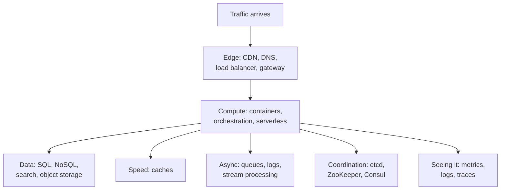
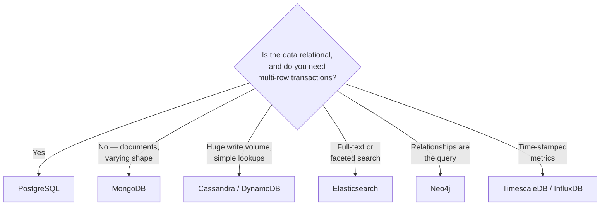

# The technology landscape — what to actually learn, and why

The previous chapter described *problems*. This one names the *tools* the
industry uses to solve them, so that when someone says "we put it behind Envoy
and fanned out through Kafka" you know what shape that sentence is.

Two rules for reading it:

- **A technology is an answer to a question.** Learn the question first. "What
  is Kafka" is a much worse thing to know than "what problem makes you reach for
  Kafka rather than a database table".
- **You do not need to learn all of these.** There are about forty tools below
  and maybe nine you should actually be able to discuss. The
  [learning order](#what-to-learn-in-what-order) at the end says which.

---

## The map

Every box in a system diagram is a category, and every category has two or three
technologies that dominate it. Learn the category, then one tool inside it
properly, then know the names of its rivals and one sentence on how they differ.


*Seven categories cover almost every box you will ever draw; picking a technology is really picking a category first.*

---

## 1. The edge — getting traffic to your servers

The layer between the user and your code. Its job is to spread load, terminate
TLS, and keep traffic that shouldn't reach you from reaching you.

| Tool | What it is | When you'd reach for it |
| --- | --- | --- |
| **Nginx** | Web server + reverse proxy + load balancer | The default. Static files, TLS termination, simple round-robin balancing. If you need one thing at the edge, it's this |
| **HAProxy** | Load balancer, purely | Higher-end balancing — health checks, connection draining — when you don't need Nginx's web-server half |
| **Envoy** | Modern proxy built for service-to-service traffic | Microservices. Per-service retries, circuit breaking, mTLS, and rich metrics without touching app code. The data plane under Istio |
| **AWS ALB / ELB** | Managed load balancer | You're on AWS and would rather not run proxies. Almost always the right call |
| **Cloudflare / CloudFront** | CDN — caches your content in ~300 cities | Static assets, images, video. Also DDoS absorption and TLS at the edge |
| **Route 53 / any DNS** | Turns a name into an address | Failover between regions, and geo-routing users to their nearest one |

**The mental model:** a load balancer is a receptionist. One public address, many
identical people behind it, and it stops sending work to anyone who stopped
answering. A CDN is a warehouse chain — the same goods stored near every city so
nobody waits for a delivery from head office.

**What "load balancing" actually decides.** Which server gets this request:
round-robin (take turns), least-connections (whoever is least busy — better when
requests vary in cost), or hash-based (the same user always lands on the same
server, which you need only if the server is stateful).

**Layer 4 vs Layer 7**, because it gets asked: L4 balances TCP connections and
can't see inside them — fast, protocol-agnostic. L7 reads the HTTP request, so
it can route `/api/*` to one pool and `/images/*` to another, retry a failed
request, and inject headers. You almost always want L7 at the edge; L4 where raw
throughput matters more than routing.

**Service mesh** — Istio and Linkerd — is the idea of putting an Envoy next to
*every* service, so retries, timeouts, mTLS and tracing are configuration rather
than code in every language you use. Powerful, and genuinely heavy: don't
propose one for six services. See [microservices](../04-backend/05-microservices.md).

---

## 2. Compute — running your code on many machines

| Tool | What it is | When you'd reach for it |
| --- | --- | --- |
| **Docker** | Packages your app + its dependencies into an image that runs identically anywhere | Everywhere. This is table stakes, not a choice |
| **Kubernetes (K8s)** | Runs containers across a fleet: restarts them, scales them, replaces them on deploy | Many services, several teams, real scaling needs |
| **ECS / Fargate** | AWS's simpler container runner | You want containers orchestrated without operating Kubernetes. Usually the right answer under ~20 services |
| **AWS Lambda** | Runs a function on demand; no server to manage | Spiky, event-driven, short work. Image thumbnails, webhook handlers |
| **Terraform** | Infrastructure written as code and version-controlled | Any infrastructure you'd be sad to rebuild by hand from memory |

**The mental model:** Docker is a shipping container — standard outside,
anything inside, and every port can handle it. Kubernetes is the port authority
— it decides which ship goes where, replaces the ones that sink, and adds more
when the queue grows.

**What Kubernetes gives you** is worth naming precisely, because "we use K8s" is
not an answer: it restarts crashed containers, scales replicas on CPU or a
custom metric, does rolling deploys with health gates and rollback, gives
services stable internal names, and manages config and secrets. Those are the
features. The cost is a genuinely large operational surface — it is a
distributed system you now also have to run.

**Serverless in one line:** you stop paying for idle and stop managing machines;
you accept cold starts, execution time limits, and a harder local development
story. Great for glue and spiky work, poor for a latency-critical hot path.

---

## 3. Databases — where the truth lives

The largest category and the one interviews probe hardest. The first question is
never "which database" — it's "what shape is this data, and what do I need to be
true about it".


*The decision is driven by the shape of the data and the guarantees you need, not by which database is fashionable.*

### Relational (SQL)

| Tool | Character |
| --- | --- |
| **PostgreSQL** | The default answer. Genuine ACID transactions, rich types, JSONB when you want document flexibility inside a relational database, and an extension for nearly everything |
| **MySQL** | Comparable and very widely deployed; historically simpler, slightly weaker on advanced SQL |
| **Amazon Aurora** | Postgres/MySQL-compatible, managed, with storage that replicates itself. What you actually run in production on AWS |

**ACID**, the four letters worth being able to expand: **A**tomic (all of the
transaction or none), **C**onsistent (constraints hold before and after),
**I**solated (concurrent transactions don't see each other's half-done work),
**D**urable (once committed, it survives a crash). If you need money to balance,
you need this, and you should say so in exactly those terms.

### Document / wide-column (NoSQL)

| Tool | Character |
| --- | --- |
| **MongoDB** | Documents with flexible shape. Good when records vary or nest deeply. Has transactions now, but the model rewards designing so you don't need them |
| **Cassandra** | Extreme write throughput and no single leader, so no single point of failure. You design the table per query, and you give up joins and ad-hoc querying entirely |
| **DynamoDB** | AWS's managed key-value/document store. Predictable single-digit-millisecond reads, priced per request, and it punishes a bad partition key hard |

**The real distinction is not "SQL vs NoSQL"** — that framing is a decade out of
date and interviewers notice. It's: what does this store give you, and what does
it take? Postgres gives joins, constraints and transactions; scaling writes past
one leader is work. Cassandra gives linear write scaling and multi-region
writes; you lose joins, and you must know your queries before you design the
schema.

### Specialised

| Tool | The one job |
| --- | --- |
| **Elasticsearch / OpenSearch** | Full-text search, fuzzy matching, faceted filtering. Not a system of record — you feed it from one |
| **Neo4j** | Graphs, where "who is connected to whom, three hops out" is the query and SQL would need six self-joins |
| **InfluxDB / TimescaleDB** | Time-series: metrics, IoT readings. Optimised for append-heavy writes and time-window queries |
| **S3 / object storage** | Files. Images, video, backups, data-lake dumps. Effectively unlimited, cheap, and never the place for a file your app needs in 5ms |

**The rule that keeps you out of trouble:** one system of record, and
everything else is a derived copy you can rebuild. Search indexes and caches are
derived. If losing Elasticsearch means losing data, the design is wrong.

---

## 4. Caches — buying speed with staleness

| Tool | What it is | When |
| --- | --- | --- |
| **Redis** | In-memory data structure store: strings, hashes, lists, sets, sorted sets, streams. Optional persistence | The default. Sessions, cached query results, rate-limiter counters, leaderboards, locks, light queues |
| **Memcached** | Pure in-memory key-value cache | You want *only* a cache and nothing else. Simpler, slightly faster, far less capable |
| **CDN** | Cache at the network edge | Anything static, or public and cacheable, that shouldn't reach your servers at all |

**Why Redis is disproportionately important:** it's the single highest-leverage
component in most systems. A database query costing 20ms becomes a Redis lookup
costing 0.5ms — and because it holds real data structures rather than opaque
blobs, one system covers caching, sessions, rate limiting, distributed locks and
pub/sub.

> Redis is also where the biggest single win on this resume came from: a
> permission-check path that fell from 13s to 200ms by caching decisions rather
> than recomputing them per request. See
> [contentstack §5](../00-experience/contentstack.md) and
> [caching at scale](07-caching-at-scale.md).

**What you must learn alongside it:** a cache is a *second copy of the truth*,
so it can disagree with the first. Invalidation, TTLs, and the stampede that
happens when a hot key expires and a thousand requests hit the database at once
are the actual content — the `GET`/`SET` API takes ten minutes to learn.

---

## 5. Queues and streams — work that happens later

The single most useful architectural move available to you: stop making the user
wait for work that doesn't have to finish before the response.

| Tool | What it is | When |
| --- | --- | --- |
| **RabbitMQ** | A classic message broker. A message goes to a consumer, gets acknowledged, and is deleted | Task queues with per-message routing. "Send this email", "process this upload" |
| **Kafka** | A distributed, durable, replayable **log**. Consumers track their own position; nothing is deleted on read | Event streams many consumers read independently, and anything you may need to replay |
| **AWS SQS** | Managed queue, effectively zero operations | You're on AWS and want a queue without running one. Usually correct |
| **Redis Streams / BullMQ** | Queues on Redis you already run | Modest volume, and one fewer system to operate |
| **Flink / Kafka Streams** | Continuous computation over a stream | Real-time aggregations — fraud scoring, live counters — rather than a nightly batch |

**Queue vs log, which is the distinction that actually gets asked:**

- A **queue** (RabbitMQ, SQS) is a to-do list. One consumer takes a job, does it,
  and the job is gone. Adding consumers divides the work.
- A **log** (Kafka) is a diary. Events are appended and stay for days regardless
  of who read them; each consumer group holds its own bookmark. Five teams can
  read the same events for five different purposes, and a new team can start
  from the beginning.

Choose a log when several unrelated things must react to one event, or when
you'd want to reprocess history. Choose a queue when one worker does one job.

**The vocabulary you need with it:** *producer* and *consumer*; *at-least-once
delivery* (you will see duplicates — handle them, and this is why idempotency
matters); *dead-letter queue* (where a message goes after failing repeatedly, so
one poison message doesn't block the line); *backpressure* (what you do when
producers outpace consumers); *consumer lag* (how far behind real time your
consumers are — the metric you alert on).

---

## 6. Coordination — agreeing on one answer

Sometimes machines must agree: who is the leader, what is the current config,
which node owns this shard. That is a genuinely hard problem, and the answer is
always "use one of these three, do not build it".

| Tool | What it is | When |
| --- | --- | --- |
| **etcd** | Distributed key-value store using the Raft consensus algorithm | Kubernetes' own brain. Leader election, config that must be consistent |
| **ZooKeeper** | The older equivalent, still under Kafka and much of the Hadoop world | You're in that ecosystem |
| **Consul** | Service discovery plus health checking plus KV | Service discovery outside Kubernetes |

**The mental model:** a notary. Several parties need one agreed record of a
fact, and can't trust each other's copies, so they use one service whose entire
job is to make a decision stick even when some participants vanish.

**Redis is not this.** A Redis lock is convenient and it is not a consensus
system — a failover can hand the same lock to two holders. Whether that matters
depends on what the lock protects, and having a real opinion on it is a senior
signal. [Consensus and coordination](04-consensus-coordination.md) has the
argument in full.

---

## 7. Observability — knowing what your system is doing

Once the system spans machines, you cannot debug it by reading a log file. This
category stops being optional the moment you have more than one server.

| Tool | Pillar | What it answers |
| --- | --- | --- |
| **Prometheus + Grafana** | Metrics | "What is the p99 latency, and is the error rate rising?" |
| **OpenTelemetry** | The standard | Vendor-neutral instrumentation, so you can switch backends without re-instrumenting |
| **Jaeger / Tempo** | Traces | "This one request took 3 seconds — which of the eight services spent it?" |
| **ELK / Loki** | Logs | "What exactly happened to request `abc-123`?" |
| **Datadog / New Relic** | All three, managed | You'd rather pay than run it |
| **PagerDuty** | Alerting | Waking the right person up |

**The three pillars, and which one to reach for.** *Metrics* are cheap numbers
over time — they tell you something is wrong. *Traces* follow one request across
services — they tell you where. *Logs* are detailed events — they tell you why.
Investigations run metric → trace → log, and a system missing the middle one is
where "it's slow somewhere" becomes an afternoon.

**Percentiles, not averages.** An average latency of 100ms is compatible with
one user in twenty waiting four seconds. You alert on p95 and p99 because the
average is exactly the statistic that hides the users you're losing.

**Correlation IDs** are the cheapest thing on this page and the highest value:
generate an ID at the edge, pass it through every service call and log line, and
one request becomes traceable across the whole system.

---

## Building it

**Libraries — connecting a Node/TypeScript service to the systems above**

| Need | Library | Why |
| --- | --- | --- |
| Redis | `ioredis` | Cluster support, pipelining and Lua scripting done properly; the community default over `redis` |
| PostgreSQL | `pg`, or `prisma` for a typed ORM | `pg` when you want the SQL you wrote; Prisma when schema-as-code and types matter more |
| MongoDB | `mongoose` | Schema validation on a schemaless store, which is the thing you actually miss |
| Kafka | `kafkajs` | Pure JS, no native build step, current consumer-group support |
| Queues on Redis | `bullmq` | Retries, backoff, delayed jobs and a dead-letter path without a broker to operate |
| Tracing and metrics | `@opentelemetry/sdk-node` | One instrumentation that emits to Jaeger, Prometheus or Datadog — you don't get locked in |
| Talking between services | `@grpc/grpc-js` | Typed contracts and binary framing for internal calls; see [api styles](../04-backend/04-api-styles.md) |

**Setting it up — the smallest realistic local stack**

The point of this file is that you can run one. `docker compose up` with the
following is a genuine distributed system on a laptop: a database, a cache, a
broker, and your service talking to all three.

```yaml
services:
  postgres:
    image: postgres:16
    environment: { POSTGRES_PASSWORD: dev }
    ports: ["5432:5432"]
  redis:
    image: redis:7
    ports: ["6379:6379"]
  kafka:
    image: bitnami/kafka:3.7
    environment:
      KAFKA_CFG_NODE_ID: "0"
      KAFKA_CFG_PROCESS_ROLES: "controller,broker"   # KRaft: no ZooKeeper
    ports: ["9092:9092"]
```

Then break it deliberately: `docker compose pause redis` and watch what your
service does. Whether it degrades to hitting the database or falls over
entirely is the difference between the two designs in
[resilience and rate limiting](08-resilience-rate-limiting.md), and you learn
it in thirty seconds rather than from a chapter.

**Pseudocode — one request touching four of the categories at once**

```ts
async function getUserProfile(userId: string, traceId: string) {
  // 1. Cache — the fast path. ~0.5ms instead of ~20ms, and the reason
  //    the database survives peak traffic at all.
  const cached = await redis.get(`profile:${userId}`);
  if (cached) return JSON.parse(cached);

  // 2. Database — the source of truth. Only reached on a cache miss.
  const profile = await db.query('SELECT * FROM profiles WHERE id = $1', [userId]);

  // 3. Cache fill with a TTL. The TTL is the expiry policy AND the
  //    safety net: even if invalidation is missed somewhere, staleness
  //    is bounded by 300 seconds rather than forever.
  await redis.set(`profile:${userId}`, JSON.stringify(profile), 'EX', 300);

  // 4. Queue — the analytics write happens after the user has their
  //    response. Putting it inline would add its latency, and its
  //    failures, to a request that doesn't need either.
  await queue.add('profile-viewed', { userId, traceId });

  return profile;
}
```

Four systems, one function, and the shape is the same everywhere: read the
cache, fall back to the truth, refill with a bound on staleness, and push
anything the caller doesn't need onto a queue. `traceId` rides along so the
async work is still attributable to the request that caused it.

---

## What to learn, in what order

Depth beats breadth, badly. Someone who can genuinely reason about Postgres,
Redis and Kafka interviews better than someone who has skimmed thirty tools.

| Stage | Learn | Why here |
| --- | --- | --- |
| **1** | **PostgreSQL** — indexes, `EXPLAIN`, transactions, isolation levels | Every system has a database, and most performance problems are a missing index or an N+1 |
| **2** | **Redis** — data types, TTLs, and what goes wrong when a hot key expires | Highest leverage per hour spent, and it appears in every design answer |
| **3** | **Docker + docker compose** | You cannot practise any of this without running several things at once |
| **4** | **A queue** — SQS or BullMQ | The "move it off the request path" instinct, which changes how you design |
| **5** | **Nginx** — reverse proxy, TLS, load balancing | Demystifies the edge; an afternoon's work |
| **6** | **Kafka** — topics, partitions, consumer groups, replay | The moment "queue" and "log" stop sounding like synonyms |
| **7** | **Observability** — Prometheus metrics + OpenTelemetry traces in a real service | Turns "it's slow" into a number you can point at |
| **8** | **Kubernetes** — only after the above | Powerful, huge, and it makes far more sense once you know what it's orchestrating |

**Learn it by breaking it, not by reading it.** Run the compose file above, put
load on it (`autocannon`, `k6`), then kill the cache mid-load and watch the
latency graph. Ten minutes of that teaches more about stampedes than this
chapter can.

Skip, until something forces you: Cassandra, Neo4j, Flink, service meshes, and
the multi-region parts of everything. Real problems, all of them, and none of
them yours yet.

---

## Interview Q&A

### Q: How do you choose between a SQL and a NoSQL database?
**Level:** intermediate · **Tags:** databases, trade-offs, technology-choice

<details><summary>Model answer</summary>

I'd push back gently on the framing first, because "NoSQL" covers stores as
different from each other as they are from Postgres — a document store, a
wide-column store and a graph database share only the name.

The real question is what the data looks like and what has to be true about it.
I start relational, with Postgres, because it's the option that assumes the
least: I get transactions, constraints, joins and ad-hoc queries, which is
exactly what I want when I don't yet know every access pattern. Being able to
answer a question I didn't design for is worth a lot early on.

I move off that for specific reasons. Documents with genuinely varying shape,
where I'd otherwise have twelve nullable columns or an EAV table, suit MongoDB.
Write volume beyond what one leader can take, or writes that must be accepted
in several regions, is Cassandra or DynamoDB territory — and the price is real:
no joins, and you design the table per query, so you must already know the
queries. Full-text search goes to Elasticsearch, but as a derived index fed
from the system of record, never as the record itself.

What I'd actually say in the room is that the guarantee decides it. If money or
permissions are involved I want ACID transactions and I'll take the scaling
work. If it's a feed or an event stream, eventual consistency is fine and I'd
rather have the write throughput.

And Postgres's JSONB is worth naming, because it collapses the question a lot
of the time — you get document flexibility inside a database that still does
transactions and joins, which is often what someone reaching for Mongo actually
wanted.

</details>

**Follow-ups:**

1. Q: What does ACID actually mean, and when do you genuinely need it?
   <details><summary>Answer</summary>

   Atomicity — the whole transaction applies or none of it does. Consistency —
   constraints and invariants hold before and after. Isolation — concurrent
   transactions don't observe each other's partial work. Durability — once
   committed, a crash can't lose it.

   You genuinely need it when an invariant spans more than one row and a
   partial state would be *wrong* rather than merely stale. Moving money between
   accounts is the canonical one: debit without credit isn't out of date, it's
   money destroyed. Granting a role while writing the audit record, or
   decrementing stock while creating an order, are the same shape.

   You don't need it when writes are independent and eventual convergence is
   acceptable — a view counter, a feed entry, an activity log. There, insisting
   on ACID costs throughput and availability for a guarantee nobody can perceive.

   The distinction I'd draw is between stale and wrong. Eventual consistency
   gives you stale. It never gives you a half-applied transaction, and that's
   what atomicity is protecting.

   </details>

2. Q: Why isn't Elasticsearch your primary database?
   <details><summary>Answer</summary>

   Because it's an index, and an index is a derived artefact you should be able
   to throw away and rebuild.

   Concretely: its consistency model is near-real-time, not immediate — a write
   isn't necessarily visible to the next read. It has no multi-document
   transactions. Its recovery story assumes the data exists elsewhere. And
   mapping changes often mean a reindex, which is fine for a derived copy and
   catastrophic for a system of record.

   The pattern is Postgres as the truth, Elasticsearch fed from it — via change
   data capture, or the outbox pattern so the index update can't be lost when
   the transaction commits but the indexing call fails. Then a total
   Elasticsearch loss is a rebuild and a degraded search box, not data loss.

   </details>

### Q: When would you introduce Kafka rather than a database table or a simple queue?
**Level:** intermediate · **Tags:** kafka, messaging, technology-choice

<details><summary>Model answer</summary>

Three conditions, and I'd want at least two before taking on Kafka's
operational weight.

First, multiple independent consumers of the same event. If a "user signed up"
event has to reach email, analytics, the CRM and the search indexer, a queue
makes that awkward — a message is consumed once — while a log lets four
consumer groups each read the whole stream at their own pace with their own
offsets. Adding a fifth consumer later is a new consumer group, with no change
to the producer.

Second, replay. Kafka retains events for a configured period regardless of who
has read them, so a consumer with a bug can be fixed and rewound to reprocess
last Tuesday. A queue deletes on acknowledgement, so the data is simply gone.
That property is also what makes event sourcing and rebuilding a derived store
practical.

Third, throughput and ordering together. Partitions give you parallelism while
preserving order within a partition, so keying by tenant or user gets you
ordered-per-entity processing that still scales horizontally. A queue gives you
one or the other.

Below that bar, I wouldn't. One producer, one consumer, moderate volume — SQS
or BullMQ on the Redis I'm already running does the job with a fraction of the
operations. And a database table with a status column is genuinely fine at low
volume, though it stops being fine once polling and lock contention show up.

The cost to be honest about is that Kafka is a cluster to run, with partition
counts, retention, rebalancing and consumer lag to understand. That's a real
price and it should buy something specific.

</details>

**Follow-ups:**

1. Q: What's the difference between a queue and a log?
   <details><summary>Answer</summary>

   Who owns the read position, and what happens after a read.

   In a queue, the broker owns it. A consumer takes a message, acknowledges it,
   and the broker deletes it. Work is divided among consumers, and once it's
   done the message is gone.

   In a log, the consumer owns it. Events are appended to an ordered,
   immutable sequence and stay for a retention period no matter who has read
   them. Each consumer group tracks its own offset, so ten groups read the same
   events independently, and any of them can rewind.

   The practical consequences: a log supports fan-out to unrelated consumers and
   replay; a queue supports competing consumers and per-message routing. And a
   log's ordering guarantee is per partition, not global — which is why the
   partition key is the design decision that matters most.

   </details>

---

## What a weak answer sounds like

- **Naming tools instead of reasons.** "We'd use Kafka and Kubernetes" with no
  statement of the problem is the most common failure in a design round.
- **"NoSQL is faster than SQL."** It isn't a speed distinction. It's a
  distinction about guarantees, query flexibility and how writes scale.
- **Treating Redis as a database.** It's a cache and a coordination tool. If
  losing it loses data, you have a durability problem you haven't noticed.
- **Proposing Kubernetes and a service mesh for six services.** Cost with no
  matching benefit, and it reads as never having operated either.
- **Making a search index the source of truth.** Elasticsearch is derived; it
  should be rebuildable from the real store.
- **No observability in the design.** A multi-service architecture with no
  metrics, traces or correlation IDs is one you've never had to debug at 3am.

---

## Glossary

- **Reverse proxy** — a server that receives requests and forwards them to backends.
- **Layer 4 / Layer 7** — balancing at the TCP level (blind to content) vs the HTTP level (can route on path, header, method).
- **CDN** — caches content in many locations near users.
- **Container** — an app packaged with its dependencies to run identically anywhere.
- **Orchestrator** — schedules containers across machines, restarts and scales them (Kubernetes, ECS).
- **ACID** — atomicity, consistency, isolation, durability.
- **System of record** — the authoritative copy of data; everything else is derived.
- **Consumer group** — a set of consumers sharing a log's partitions, with its own offset.
- **Offset** — a consumer's bookmark into a log.
- **Consumer lag** — how far behind the newest event a consumer is.
- **Dead-letter queue (DLQ)** — where repeatedly failing messages go so they don't block the line.
- **Service mesh** — per-service proxies handling retries, mTLS and telemetry outside app code.
- **Service discovery** — how a service finds a healthy address for another.
- **The three pillars** — metrics (something is wrong), traces (where), logs (why).
- **Correlation ID** — an ID attached at the edge and carried through every call and log line.
