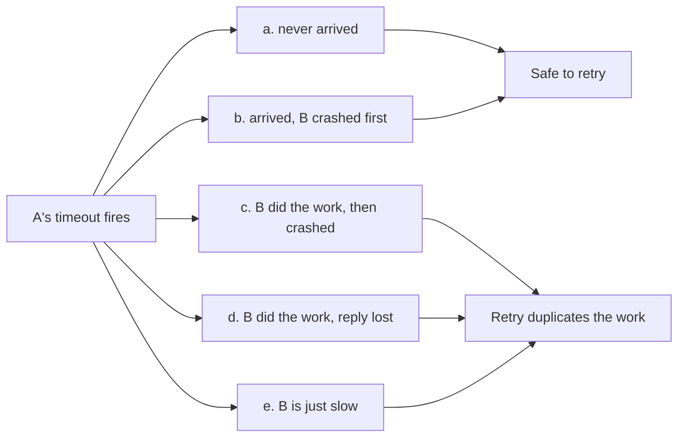
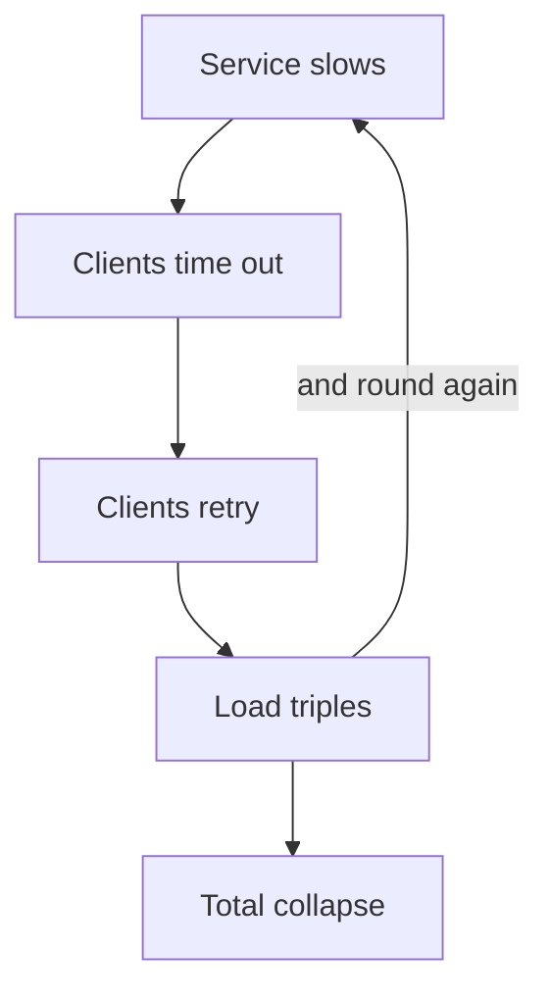

# Foundations and failure modes

Your resume claims ~2–3B daily requests, a monolith split, cross-service gRPC
and a Redis caching redesign — all distributed systems territory, with no
distributed systems vocabulary anywhere on the page. This part closes that gap.
See [WEAK-SPOTS](../WEAK-SPOTS.md) #1.

> **New to this?** Read [start here](00-start-here-what-and-why.md) first — it
> explains what a distributed system is and defines every term used below.
> This chapter assumes that vocabulary and moves at speaking pace.

---

## Foundations

A system is distributed when it runs on more than one machine, and those
machines talk over a network.

Two things follow from that, and almost every hard problem in this part comes
from them:

- **Machines fail on their own.** One can die while the others keep going.
- **The network is unreliable.** Messages get lost, delayed, duplicated, or
  arrive out of order.

### The fallacies of distributed computing

Eight things people assume about networks that aren't true. Every outage
rediscovers at least one:

| Fallacy | What actually bites you |
| --- | --- |
| The network is reliable | Packets drop; calls fail halfway through |
| Latency is zero | A remote call is ~10⁵× a local one |
| Bandwidth is infinite | Chatty APIs saturate links |
| The network is secure | Internal traffic needs authentication too |
| Topology doesn't change | Instances come and go constantly |
| There is one administrator | Config drifts between teams |
| Transport cost is zero | Serialisation and TLS are real CPU |
| The network is homogeneous | Cross-region and cross-cloud differ wildly |

The fourth is the one your own work touches: the auth npm package exists
precisely because internal calls needed authenticating rather than trusting the
network.

### Latency numbers worth memorising

Interviewers use these to check you can reason about cost:

```
L1 cache                       ~1 ns
Main memory                  ~100 ns
SSD random read              ~150 μs
Datacentre round trip        ~500 μs      ← a service call
Disk seek (spinning)          ~10 ms
Cross-continent round trip   ~150 ms
```

The takeaway: **a network call is ~5,000× main memory.** That's why an N+1
across services is catastrophic where an N+1 in memory is merely untidy, and
it's why caching moves the needle so much.

---

## The failure that defines everything: partial failure

In a single process, a function call either returns or the whole process dies.
In a distributed system there is a third outcome: **you don't know**.


*From A's side all five look identical — that is what partial failure means, and why "just retry" is a decision rather than a default.*

When A sends B a request and gets no response before its timeout, at least five
things could have happened: (a) the request never arrived; (b) it arrived but B
crashed before acting; (c) it arrived, B *did the work*, then crashed before
replying; (d) B did the work and replied, but the reply was lost; (e) B is just
slow. Cases a and b are safe to retry. Cases c and d mean a retry **duplicates**
the effect. Case e means a retry piles more load onto a struggling service.

**A timeout tells you nothing about which of these happened** — and a, b need
the opposite response from c, d.

**A timeout tells you nothing about whether the work happened.** This is the
root of why idempotency matters, why "exactly once" is a myth, and why retries
are dangerous without care.

### Why "just retry" makes things worse

A slow service is usually an overloaded one. Retrying multiplies its load at
exactly the wrong moment, and the classic outage shape follows:


*The edge from load back to slowness is the whole problem: retries are a feedback loop, so a blip amplifies itself.*

This is a **retry storm**, and it's how a small blip becomes an outage. The
defences — exponential backoff with jitter, circuit breakers, retry budgets —
are in [resilience patterns](08-resilience-rate-limiting.md).

### Failure kinds, from easiest to worst

1. **Crash-stop** — the node dies and stays dead. Easiest: absence is
   detectable.
2. **Crash-recovery** — it comes back, possibly with stale state.
3. **Omission** — messages are dropped, some of the time.
4. **Timing** — everything works but too slowly to be useful.
5. **Byzantine** — a node behaves arbitrarily or maliciously. Rare outside
   adversarial settings, and enormously expensive to tolerate.

**Grey failure is the one that hurts most in practice**: a node that is up,
passing health checks, and serving 30% errors or 10× latency. Binary
up/down health checks miss it entirely, which is why you alert on error rates
and latency percentiles rather than liveness.


## Building it

**Libraries**

| Need | Library | Why |
| --- | --- | --- |
| Simulate partial failure in tests | `toxiproxy` | Injects latency, timeouts and connection resets between real services, so "what happens when B is slow" is a test, not a guess |
| Retry with backoff | `p-retry` | Exponential backoff and jitter out of the box — the shape "Why 'just retry' makes things worse" argues for |

**Pseudocode — a caller that treats a timeout as "unknown", not "failed"**

```ts
import pRetry from 'p-retry';

await pRetry(() => chargeCard(idempotencyKey, amount), {
  retries: 3,
  minTimeout: 200,
  factor: 2,          // backoff, not a fixed interval
  randomize: true,    // jitter — stops synchronized retry storms
});
```

The idempotency key, not the retry logic, is what makes this safe against
cases (c) and (d) from "The failure that defines everything" — a retry
without one duplicates the charge.

---

## Interview Q&A

### Q: What makes distributed systems basically harder than single-machine systems?
**Level:** foundation · **Tags:** distributed, failure, basics

<details><summary>Model answer</summary>

Partial failure, and everything that follows from it.

On one machine a call either returns or the process dies — both are
unambiguous. Across a network there's a third outcome: no response, and you
cannot tell which of five things happened. The request may never have arrived,
or arrived and the work was done but the reply was lost, or the remote side is
simply slow. Those need opposite responses — retry versus definitely-don't-retry
— and the caller has no way to distinguish them.

That single ambiguity generates most of the field. Idempotency exists because
retries may duplicate work. "Exactly once" is a myth because you can't
distinguish lost-request from lost-reply. Consensus protocols exist because
nodes can't agree on what happened. Timeouts are guesses, and a wrong guess
either gives up on healthy work or hammers a struggling service.

The second-order problem is that failures aren't independent in practice: a
slow service causes client retries, which increase its load, which makes it
slower. Local failures become global through feedback.

</details>

**Follow-ups:**

1. Q: A request times out. What should the caller do?
   <details><summary>Answer</summary>

   It depends entirely on whether the operation is idempotent, and that's the
   design decision the timeout forces you to have already made.

   If it is — a read, or a write with an idempotency key — retry with
   exponential backoff and jitter. The duplicate is harmless.

   If it isn't — "charge this card", "send this email" — retrying may perform
   the action twice. Either make it idempotent (assign a client-generated key
   the server deduplicates on), or don't retry and surface the uncertainty,
   which usually means a reconciliation process rather than pretending you know.

   The engineering answer is that you shouldn't have non-idempotent operations
   on a path that can time out, because you've built something where the safe
   action after a failure is undefined.

   </details>

2. Q: What's a retry storm, and how do you prevent it?
   <details><summary>Answer</summary>

   A feedback loop that turns a slowdown into an outage. A service gets slow,
   clients time out, clients retry, effective load multiplies, the service gets
   slower, more clients time out. It collapses, and it stays collapsed because
   the retry load prevents recovery even after the original cause is gone.

   Prevention comes in layers. **Exponential backoff with jitter** — backoff
   spaces retries out, and jitter is the part people forget: without random
   variation, every client retries at the same instant and you get synchronised
   thundering herds. **Circuit breakers** stop calling a failing dependency
   entirely, so it gets room to recover. **Retry budgets** cap retries as a
   percentage of total traffic, so retries can never dominate. **Deadline
   propagation** — pass the remaining time budget down the call chain so nobody
   retries work whose deadline has already passed.

   The one that matters most and is most often missed is the jitter.

   </details>

### Q: What's grey failure, and why does it matter more than a crash?
**Level:** senior · **Tags:** failure, observability, operations

<details><summary>Model answer</summary>

Grey failure is a component that is up, passing health checks, and
malfunctioning — serving a fraction of requests as errors, or responding at 10×
normal latency, or working for one shard and not others.

It's worse than a crash for two reasons. A crashed node is *detected*: load
balancers remove it, failover triggers, and the system heals automatically.
A grey-failing node keeps receiving traffic and keeps damaging it, indefinitely.

And it's worse because binary health checks miss it by design. A
`/health` endpoint returning 200 while the service fails 30% of real requests is
the normal case, not an edge case — health checks usually test the process, not
the dependency that's actually broken.

The defences are observability rather than architecture: alert on error rate
and latency percentiles rather than liveness; use p99 not averages, because an
average hides a broken tenth; make health checks meaningful by exercising real
dependencies; and give operators a way to remove a suspect instance manually,
because automation won't.

This connects directly to incident response — a grey failure is the incident
that gets reported by a customer rather than by an alarm, which is the worst
way to find out.

</details>

**Follow-ups:**

1. Q: How do you detect that a node is failing when it says it's healthy?
   <details><summary>Answer</summary>

   Stop trusting self-reports and look at outcomes.

   Compare instances against each other: if one instance in a pool has a
   markedly higher error rate or latency than its peers handling equivalent
   traffic, that's a strong signal regardless of what it says about itself.

   Measure from the client side, since the caller experiences the real
   behaviour — client-observed error rates and latency per upstream instance
   catch things no server-side check will.

   Make health checks *deep* rather than shallow: actually query the database,
   actually check the cache. That trades a risk — a deep check can cascade,
   marking every instance unhealthy when a shared dependency wobbles — so the
   usual compromise is shallow checks for liveness and deep checks for
   readiness, with hysteresis so a blip doesn't drain the pool.

   And outlier detection in the load balancer or mesh, which ejects an instance
   whose error rate diverges from its peers.

   </details>

---

## What a weak answer sounds like

- **"Distributed systems are harder because of network latency."** Latency is
  a performance problem. Partial failure is the *correctness* problem.
- **"We retry on failure."** Without idempotency, backoff, jitter and a
  breaker, that's a description of how you cause an outage.
- **Treating a timeout as a failure.** It's an unknown, and that distinction is
  the whole point.
- **Believing "exactly once" delivery exists.** See
  [time ordering idempotency](05-idempotency-transactions.md).
- **Only considering crash failures**, and having no answer for a node that's
  half-working.

---

## Glossary

- **Partial failure** — some components fail while others continue.
- **Fallacies of distributed computing** — eight false assumptions, chiefly
  that the network is reliable.
- **Grey failure** — up and passing health checks, but malfunctioning.
- **Retry storm** — retries multiplying load on a struggling service.
- **Jitter** — randomness added to backoff so clients don't synchronise.
- **Retry budget** — a cap on retries as a share of total traffic.
- **Deadline propagation** — passing the remaining time budget down the chain.
- **Byzantine failure** — arbitrary or malicious behaviour.
- **Crash-stop / crash-recovery** — dies and stays dead / returns with stale
  state.
