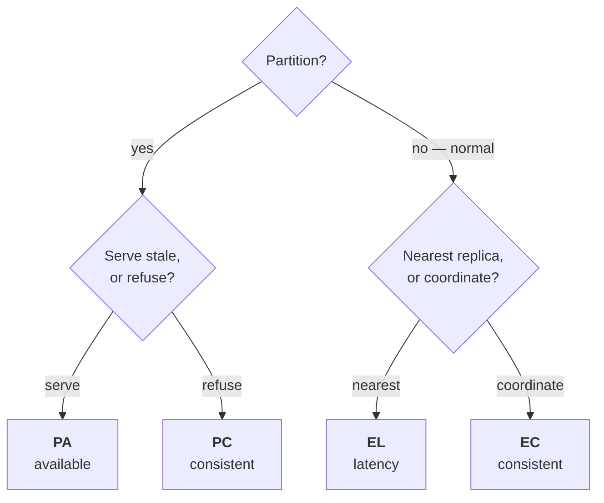
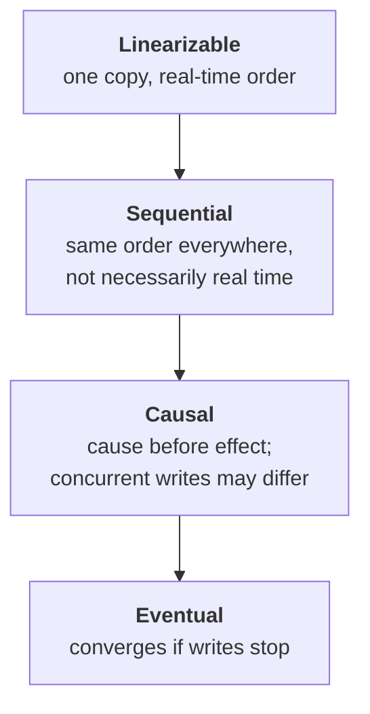

# CAP, PACELC and consistency models

CAP gets misquoted constantly. Getting it right is an easy way to show you've
read more than a blog post about it.

---

## Foundations

### What CAP actually says

**During a network partition, a distributed system must choose between
consistency and availability.**

That's it. The common phrasing — "pick two of three" — is wrong and interviewers
notice:

- **Partition tolerance is not optional.** Networks partition. A system that
  doesn't tolerate partitions isn't "CA", it's broken when the network fails.
- **The choice only applies during a partition.** When the network is healthy
  you can have both. CAP says nothing about normal operation, which is where
  systems spend ~100% of their time.
- **Consistency here means linearizability specifically** — the strongest model
  — not "consistency" in the loose sense or the C in ACID.

So the real statement: *when a partition happens, do you refuse requests (CP)
or serve possibly-stale data (AP)?*

### PACELC — the more useful version

CAP ignores the normal case. PACELC covers both:

> **If Partition: Availability or Consistency. Else: Latency or Consistency.**

The second half is where systems actually live. Even with a healthy network,
stronger consistency costs latency, because agreement requires round trips.

*CAP only describes the top branch. Your system spends virtually all its life on the bottom one, which is why PACELC is the more useful frame.*

| System | Partition | Normal |
| --- | --- | --- |
| DynamoDB (default) | PA — stay available | EL — favour latency |
| Spanner | PC — refuse rather than diverge | EC — pay latency for consistency |
| MongoDB (majority) | PC | EC |
| Cassandra (tunable) | PA | EL |

**PACELC is the better interview answer** because it describes the trade you
make every day, not the one you make during a rare failure.

---

## Consistency models, strongest to weakest

*Reading down the ladder is giving up coordination — and buying latency and availability with what you give up.*

**Linearizable** — the system behaves as if there were a single copy and every
operation happened instantaneously at some point between its start and end. A
read always returns the most recent write. Expensive: needs coordination.

**Sequential** — all nodes see operations in the same order, but that order
need not match real time. Your write might not be visible to you immediately.

**Causal** — operations that are causally related appear in order everywhere;
concurrent operations may be seen in different orders. Enough for most
applications, and much cheaper than linearizable.

**Eventual** — replicas converge *if writes stop*. Says nothing about what you
read in the meantime. The weakest useful guarantee.

### The session guarantees that actually matter to users

Eventual consistency is fine until a user sees their own action disappear.
These are the practical middle ground:

| Guarantee | Prevents |
| --- | --- |
| **Read-your-writes** | Posting a comment and not seeing it |
| **Monotonic reads** | Seeing data, refreshing, seeing it vanish |
| **Monotonic writes** | Your writes applying out of order |
| **Writes-follow-reads** | Replying to a comment that isn't visible yet |

**Read-your-writes is the one to name** — it's the anomaly users report as a
bug. The standard fixes: route a user's reads to the replica that took their
write (sticky sessions) for a short window; or read from the primary for N
seconds after a write; or track a version token per session and require the
replica to have caught up to it.

> **In your own work.** This is directly relevant to auth: a user's role changes
> and the write goes to a primary, but the authorization check reads a replica.
> Eventual consistency there means a revoked permission still works — a
> *security* consequence rather than a UX one. That framing is exactly the kind
> of thing an interviewer probing your 2–3B claim will reward. See
> [contentstack](../00-experience/contentstack.md) §5.

## Building it

There's no library that "implements CAP" — it's a property of the database
and driver configuration you choose, not code you write on top. What you
actually configure:

| System | Where the choice lives |
| --- | --- |
| MongoDB | `writeConcern` / `readConcern` per query — see [databases](../05-data-cache/01-databases.md) |
| DynamoDB | `ConsistentRead: true` per request — opts into linearizable reads at higher latency and cost |
| PostgreSQL replicas | `synchronous_commit` and how many standbys must ack |

The interview signal is naming *which knob* you'd turn for a given
requirement, not reciting the theorem.

---

## Interview Q&A

### Q: Explain CAP theorem.
**Level:** intermediate · **Tags:** cap, consistency, theory

Model answer

CAP says that during a network partition, a distributed system must choose
between consistency and availability.

The popular "pick two of three" framing is wrong in a way worth correcting.
Partition tolerance isn't a choice — networks partition, and a system that
can't tolerate that isn't CA, it's simply broken when the network fails. And
the trade only applies *during* a partition; when the network is healthy you
can have both, which is the situation ~100% of the time.

There's also a precision point: the C in CAP means linearizability
specifically, the strongest consistency model. It isn't the C in ACID, and it
isn't consistency in the everyday sense.

So the real question is: when the network splits, does the minority side refuse
requests to avoid divergence — CP — or serve possibly-stale data to stay up —
AP?

I find PACELC more useful in practice, because it adds the normal case: even
without a partition, you trade latency against consistency, since agreement
costs round trips. That's the trade you actually make every day.

**Follow-ups:**

1. Q: Is a single-node database CA?
   

Answer

   The question is a trap and it's a fair one. A single node isn't a
   distributed system, so CAP doesn't apply — there's nothing to partition.

   It's trivially consistent and available while it's up, and completely
   unavailable when it isn't. CAP has nothing to say about that; it's a
   statement about systems with replicas.

   The useful version of the question: as soon as you add a read replica for
   scale, you're in CAP territory, and you now have to decide what a read from
   a lagging replica means.

   

2. Q: Where would you choose AP over CP?
   

Answer

   Depends on the cost of stale versus the cost of unavailable, and it varies
   *within* one product rather than across products.

   AP where stale is survivable and downtime isn't: a product catalogue, a
   social feed, view counts, cached content. Serving data a few seconds old is
   invisible; a blank page isn't.

   CP where divergence is unacceptable: account balances, inventory when
   overselling costs money, unique-constraint allocations like usernames, and —
   the one I'd raise from my own domain — **authorization decisions**. Serving
   a stale "allow" for a revoked permission isn't a UX degradation, it's a
   security failure. I'd rather fail closed than serve stale authz.

   The good answer is that this is chosen per operation, not per system: the
   same platform can serve cached content AP and evaluate permissions CP.

   

### Q: What is eventual consistency, and what breaks under it?
**Level:** intermediate · **Tags:** consistency, replication

Model answer

It means replicas converge to the same state *if writes stop* — and importantly
it makes no promise about what you read in the meantime. It's the weakest
useful guarantee.

What breaks is mostly user-visible anomaly rather than data loss. The classic
is **read-your-writes**: a user posts a comment, the write lands on the
primary, their next read hits a replica that hasn't caught up, and their
comment isn't there. They post again. Now there are two.

**Monotonic reads** is the other one people hit: refresh the page and data goes
*backwards*, because consecutive reads hit replicas with different lag.

The fixes are session guarantees rather than global consistency, which is what
makes them affordable: pin a user's reads to the replica that took their write
for a short window, or read from the primary for a few seconds after writing,
or carry a version token the replica must have reached before it may serve.

The important framing is that eventual consistency is a *default*, not a
verdict — you strengthen it selectively where anomalies matter, rather than
paying for linearizability everywhere.

**Follow-ups:**

1. Q: A user's permissions are revoked but they can still act. Is that an eventual consistency problem?
   

Answer

   Usually yes, and it's the case where eventual consistency stops being a UX
   issue and becomes a security one — which is the framing I'd lead with.

   The staleness can enter at several layers, and they stack: permissions
   embedded in a token that's valid until it expires; a decision cache with its
   own TTL; a read replica behind the primary that took the revocation; and
   per-instance in-memory caches, which are worst because they're invisible and
   don't clear on deploy boundaries.

   Because it's a security boundary I'd treat revocation as a **CP operation**
   even in a system that's otherwise AP: push invalidation rather than waiting
   for expiry, use versioned cache keys so a role change invalidates everything
   derived at once, and bypass caches entirely on the most sensitive
   operations.

   And then measure end-to-end revocation latency rather than reasoning from
   configured TTLs — because the real number is the sum of all of them, and
   it's usually larger than anyone assumes.

   

2. Q: How do you actually implement read-your-writes?
   

Answer

   Three approaches, increasing in precision.

   **Read from the primary for a window** after a user writes — simple, and it
   works, but it concentrates load on the primary and the window is a guess.

   **Sticky routing** — pin that user's reads to the replica that accepted
   their write. Cheap, but it breaks when that replica goes away, and it
   undermines load balancing.

   **Version tokens** — the write returns a logical timestamp or log position;
   the client sends it with subsequent reads; a replica that hasn't reached
   that position either waits briefly or forwards to one that has. Most
   precise, since it gives exactly the guarantee needed with no blanket
   penalty, and it's what systems with real consistency requirements do.

   The version-token approach is the one I'd argue for at scale, because the
   other two either overload the primary or fight the load balancer.

   

---

## What a weak answer sounds like

- **"CAP means pick two of three."** Partition tolerance isn't optional. This
  is the single most common tell.
- **"We're a CA system."** Means you haven't thought about partitions.
- **Confusing CAP's C with ACID's C.** Different concepts entirely —
  linearizability versus constraint preservation.
- **"We use eventual consistency"** with no account of which anomalies that
  admits and how the app handles them.
- **Not knowing PACELC.** It's the more useful framing and knowing it signals
  reading beyond the standard blog post.

---

## Glossary

- **CAP** — under partition, choose consistency or availability.
- **PACELC** — under Partition: A or C; Else: Latency or Consistency.
- **Linearizable** — behaves as one copy; reads see the latest write.
- **Sequential** — same order everywhere, not necessarily real time.
- **Causal** — cause precedes effect; concurrent ops may be ordered differently.
- **Eventual** — replicas converge if writes stop.
- **Read-your-writes** — you always see your own writes.
- **Monotonic reads** — you never see data go backwards.
- **Replication lag** — how far behind a replica is.
- **Quorum** — the number of nodes that must agree; see
  [replication](03-replication-partitioning.md).
