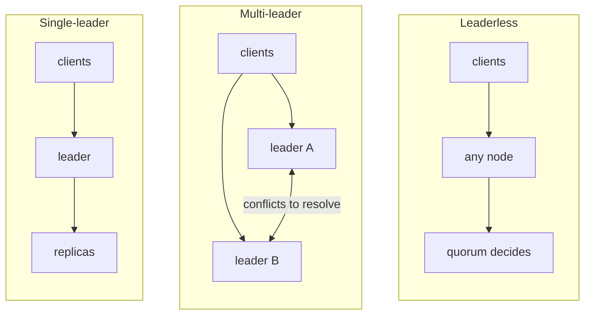
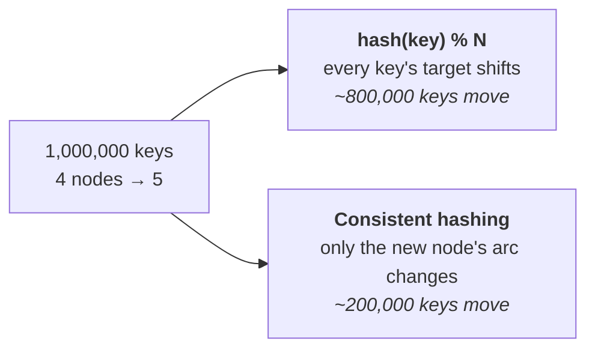

# Replication and partitioning

These two get mixed up a lot, so start with the difference:

- **Replication** — keep *copies of the same data* on several machines. Buys
  you availability and more read capacity.
- **Partitioning** (sharding) — put *different data* on different machines.
  Buys you write capacity and storage.

Most real systems do both: split the data up, then keep copies of each piece.

---

## Replication

### The three topologies


*The double-headed arrow in the middle is the entire cost of multi-leader: two nodes accepted writes and something now has to reconcile them.*

| Topology | Writes | Good for | Cost |
| --- | --- | --- | --- |
| **Single-leader** | One node accepts writes | Almost everything | Leader is a write bottleneck and a failover event |
| **Multi-leader** | Several nodes accept writes | Multi-region, offline clients | **Write conflicts you must resolve** |
| **Leaderless** | Any node, quorum decides | Dynamo, Cassandra | Tunable but complex; read repair needed |

Single-leader is the default and the right one for most systems. Multi-leader
is chosen when geography or offline operation forces it, and its whole
difficulty is conflict resolution. Leaderless trades a leader for quorum maths.

### Sync vs async, and the trade nobody escapes

**Async replication means acknowledged writes can be lost.** If the leader
confirms a write and dies before the follower receives it, that write is gone
— and the client was told it succeeded. Semi-synchronous (wait for one
follower) is the usual compromise.

### Quorums

With `N` replicas, `W` write acks and `R` read replicas consulted:

```
W + R > N   ⟹   any read set overlaps any write set
                 ⟹ reads see the latest write
```

Common choice: `N=3, W=2, R=2`. Tolerates one node down for both reads and
writes. `W=N` gives durable writes but no write availability under any failure;
`R=1, W=1` is fast and gives no consistency guarantee at all.

### Failover, and the two ways it goes wrong

**Split brain** — the old leader didn't actually die, it was unreachable. Now
two nodes accept writes and diverge. Defence: fencing tokens (a monotonically
increasing epoch that storage checks, so the old leader's writes are rejected),
and requiring a majority to elect.

**Lost writes on failover** — with async replication, promoting a follower that
hadn't caught up silently discards the writes it was missing.

The deeper point: **failover is where most data loss actually happens**, not
during steady-state operation.

---

## Partitioning (sharding)

### Choosing a partition key

The key decides everything. Get it wrong and you rewrite.

| Strategy | How | Problem |
| --- | --- | --- |
| **Range** | Shard by key ranges (A–F, G–M…) | Efficient range scans; **hot spots** if the key is sequential, like a timestamp |
| **Hash** | `hash(key) mod N` | Even distribution; **range queries need every shard** |
| **Consistent hashing** | Keys and nodes on a ring | Adding a node moves ~1/N keys, not everything |
| **Directory** | An explicit lookup table | Total flexibility; the directory is now a dependency and a bottleneck |

**`hash(key) mod N` is the trap.** Adding one node changes `N`, so nearly every
key remaps and effectively the whole dataset moves. **Consistent hashing** —
placing both keys and nodes on a hash ring, with each key owned by the next
node clockwise — moves only the keys belonging to the new node's arc. Virtual
nodes (each physical node appearing at many ring positions) smooth the
distribution.

### Hot partitions — the failure that matters for you

Even distribution assumes even *access*. In a multi-tenant platform it isn't:
one enormous customer generates far more traffic than the rest combined, and if
tenant is the partition key, that shard saturates while the others idle.

```
   even data, uneven load
   ┌─────────┬─────────┬─────────┐
   │ shard 1 │ shard 2 │ shard 3 │
   │  ▓▓▓▓▓  │    ▓    │    ▓    │   ← one huge tenant on shard 1
   │  ▓▓▓▓▓  │         │         │
   └─────────┴─────────┴─────────┘
      100%       12%       12%
```

Mitigations: composite keys (`tenant + entity_id`) so one tenant spreads across
shards; dedicated shards for the largest tenants; a cache or read replicas in
front of the hot key; or key salting for extreme cases, at the cost of scatter
reads.

> **In your own work.** Multi-tenant auth is the textbook hot-tenant case, and
> "how would you shard the auth data at 2–3B requests/day?" is a natural
> follow-up to your headline number. Being able to reach for composite keys and
> per-tenant isolation without being asked is what makes the claim credible. See
> [WEAK-SPOTS](../WEAK-SPOTS.md) #3.


*The same rebalance, four times the data movement — and every moved key is a cache miss, which is how growing a cluster takes it down.*

### Why `mod N` is the trap, in numbers

```js
// Naive: adding one node remaps almost everything.
const nodeFor = (key, n) => hash(key) % n;

// 4 -> 5 nodes over 1,000,000 keys:
//   keys that must move: ~800,000   (80%)
// With consistent hashing:  ~200,000   (1/N — only the new node's share)
```

Consistent hashing, with virtual nodes so the ring is evenly covered:

```js
class Ring {
  constructor(nodes, vnodes = 150) {
    this.ring = [];                                  // sorted [hash, node]
    for (const n of nodes)
      for (let i = 0; i < vnodes; i++)
        this.ring.push([hash(`${n}#${i}`), n]);
    this.ring.sort((a, b) => a[0] - b[0]);
  }
  get(key) {                                         // first node clockwise
    const h = hash(key);
    const hit = this.ring.find(([p]) => p >= h);
    return (hit ?? this.ring[0])[1];                 // wrap around
  }
}
```

Without virtual nodes a three-node ring splits very unevenly — one node can own
half the keyspace purely by where its hash landed.

### The hot-tenant fix, concretely

```js
// ✗ tenant alone: one huge customer saturates one shard
const key = `sessions:${tenantId}`;

// ✓ composite: that tenant spreads across shards…
const key = `sessions:${tenantId}:${userId}`;

// …but keys you need together must land together. Redis Cluster hashes
// only what is inside {braces}:
const key = `{${tenantId}}:sessions:${userId}`;   // same slot, multi-key ops work
```

The `{...}` hash tag is the detail people miss: without it, a multi-key
operation across a tenant's keys fails in cluster mode with `CROSSSLOT`.

### Rebalancing

Never `mod N`. Use **fixed partitions** — create far more logical partitions
than nodes (say 1024), and move whole partitions between nodes as the cluster
grows. The partition count stays constant; only assignment changes.

Rebalancing should be **throttled and preferably manual to trigger**:
automatic rebalancing during an incident can turn a slow node into a dead
cluster by adding migration load to something already struggling.


## Building it

**Libraries**

| Need | Library | Why |
| --- | --- | --- |
| Consistent hashing | `hashring` (or the hand-rolled `Ring` class above) | The npm package saves reimplementing virtual nodes; hand-roll it only if you need to explain the mechanism, as in an interview |
| Per-shard connections | `ioredis` Cluster mode, or a pool keyed by shard for Postgres | Multi-key operations and transactions only work within one shard/connection — route explicitly rather than discover it in production |

**Pseudocode — routing with the ring**

```ts
import HashRing from 'hashring';
const ring = new HashRing(['shard-1', 'shard-2', 'shard-3']);

const shard = ring.get(`tenant:${tenantId}`);  // stable per key, not per request
const conn = shardConnections[shard];
```

Route by the same key you'd use for a hash tag (`{tenant123}:...` in Redis
Cluster) — the ring and the hash tag are solving the same problem at two
different layers.

---

## Interview Q&A

### Q: What's the difference between replication and partitioning?
**Level:** foundation · **Tags:** replication, sharding, basics

<details><summary>Model answer</summary>

Replication keeps **copies of the same data** on multiple nodes. It buys
availability — a node dies and another serves — and read throughput, since
reads spread across replicas. It does not help write throughput, because every
write goes everywhere, and it doesn't help storage, since every node holds
everything.

Partitioning splits **different data** across nodes. It buys write throughput
and storage capacity, because each node owns a subset. It doesn't by itself buy
availability — lose a partition and that data is gone.

They solve different problems and most systems need both: partition for scale,
then replicate each partition for availability. Typically each partition has a
leader and a couple of followers.

The way I'd remember it: replication is about *how many copies*, partitioning is
about *which data lives where*.

</details>

**Follow-ups:**

1. Q: You add read replicas and reads are still slow. Why might that be?
   <details><summary>Answer</summary>

   Several possibilities and it's worth ruling them out in order.

   The workload may be **write-heavy**, in which case replicas don't help —
   every replica applies every write, so you've added replication load without
   reducing the work.

   **Replication lag** may be forcing reads to the primary anyway: if the
   application needs read-your-writes and handles it by reading from the
   primary, adding replicas achieves nothing for those reads.

   The bottleneck may not be the database at all — connection pool exhaustion,
   the application layer, or N+1 query patterns where the fix is fewer queries,
   not more replicas.

   Or single-row hot spots: replicas distribute *load* but every replica still
   contends on the same hot key.

   The diagnostic instinct is to check whether reads are actually reaching the
   replicas before adding more.

   </details>

2. Q: Asynchronous replication can lose acknowledged writes. Is that ever acceptable?
   <details><summary>Answer</summary>

   Often, yes — and being able to say so without flinching is the point.

   Synchronous replication means a write isn't acknowledged until a follower
   confirms, so a stalled or slow follower blocks writes, and you've coupled
   write availability to every replica's health. That's a real cost for a rare
   benefit.

   Async is acceptable where losing a few seconds of recent writes during a
   leader crash is survivable — analytics events, activity feeds, view counts,
   most content. Not acceptable for payments, or for anything where a user was
   told "saved" and would notice its absence.

   The common middle ground is **semi-synchronous**: wait for one follower, not
   all. You lose data only if the leader and that specific follower fail
   together, which is much less likely, and one slow follower out of several
   doesn't block you.

   What matters is that it's a deliberate choice with a stated RPO, rather than
   a default nobody examined.

   </details>

### Q: How would you choose a partition key?
**Level:** senior · **Tags:** sharding, design, multi-tenancy

<details><summary>Model answer</summary>

Three questions, in order.

**What's the dominant access pattern?** The key should let the common query hit
one shard. If most queries are "everything for this tenant", tenant is the
natural key. If queries are cross-cutting, any key forces scatter-gather.

**Does it distribute evenly — by load, not just by data?** This is the one
people get wrong. Even data distribution with uneven access still saturates a
shard, and in a multi-tenant system access is *always* uneven: one customer is
far larger than the rest.

**Does it avoid sequential hot spots?** A timestamp or auto-increment key sends
every new write to the same shard, so you've partitioned storage without
partitioning write load.

For multi-tenant auth data, tenant alone is tempting but creates the hot-tenant
problem. I'd use a **composite key** — tenant plus entity id — so a single
tenant spreads across shards while queries scoped to a tenant can still be
targeted. And I'd plan for the largest tenants to get dedicated shards, because
they will eventually justify it.

Then consistent hashing with virtual nodes for placement, so adding capacity
moves ~1/N of the keys rather than remapping everything.

</details>

**Follow-ups:**

1. Q: One tenant is 60% of your traffic. What now?
   <details><summary>Answer</summary>

   Accept that generic sharding won't save you and isolate them deliberately.

   The options, roughly in order of how far I'd go. **Composite key** so their
   data spreads across shards instead of concentrating — works if their access
   pattern permits it. **A dedicated shard or cluster** for that tenant, which
   is what most mature multi-tenant platforms end up doing for their largest
   customers; it also isolates the blast radius, so their traffic spike can't
   hurt everyone else. **Caching or read replicas** in front of their hot keys.
   **Rate limiting per tenant**, so one customer can't consume the whole
   system's capacity — the noisy neighbour problem.

   The organisational point worth making: at 60% of traffic they're not really
   a tenant in a shared system any more, they're a single-tenant deployment
   that happens to share code. Recognising when to stop pretending otherwise is
   the senior judgement.

   </details>

2. Q: You need to add shards to a live system. How?
   <details><summary>Answer</summary>

   The key decision is made long before this moment: don't use `hash mod N`,
   because adding a node changes N and remaps almost everything.

   With **fixed logical partitions** — say 1024 partitions across 4 nodes —
   adding a node means reassigning some partitions, not rehashing keys. The
   partition count never changes; only the mapping does.

   With **consistent hashing**, the new node takes over an arc of the ring, so
   only its share moves.

   Operationally: copy the partition to its new home while the old one still
   serves, catch up the delta, then flip the routing atomically and only then
   delete the source. Throttle the copy, because migration traffic competes with
   real traffic — the classic failure is rebalancing during a load spike and
   turning a slow cluster into a dead one.

   And do it *before* you need to. Rebalancing a cluster that's already at
   capacity is much harder than rebalancing one at 60%.

   </details>

---

## What a weak answer sounds like

- **"We shard by user id using hash mod N."** Adding a node remaps everything.
- **Conflating replication and sharding**, or thinking replicas help write
  throughput.
- **Assuming even data distribution means even load.** Multi-tenant systems are
  the counterexample and they're your background.
- **No answer for the hot tenant.**
- **Not knowing that async replication can lose acknowledged writes.**

---

## Glossary

- **Leader / follower** — the node accepting writes / replicating them.
- **Replication lag** — how far behind a follower is.
- **Semi-synchronous** — acknowledge after one follower confirms.
- **Quorum** — `W + R > N` guarantees read/write set overlap.
- **Split brain** — two nodes both believing they're leader.
- **Fencing token** — a monotonic epoch that stops a stale leader writing.
- **Consistent hashing** — ring placement; adding a node moves ~1/N of keys.
- **Virtual nodes** — one physical node at many ring positions, for evenness.
- **Hot partition** — a shard receiving disproportionate load.
- **Scatter-gather** — a query that must consult every shard.
- **RPO** — recovery point objective: how much data you can afford to lose.
