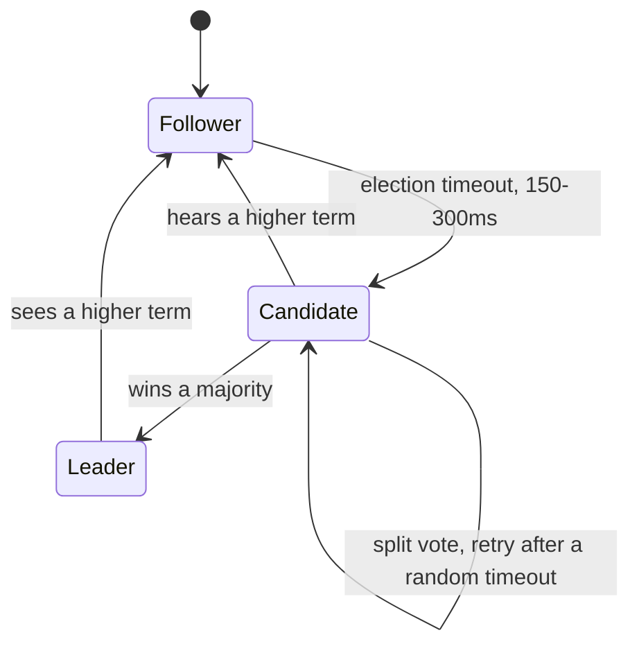
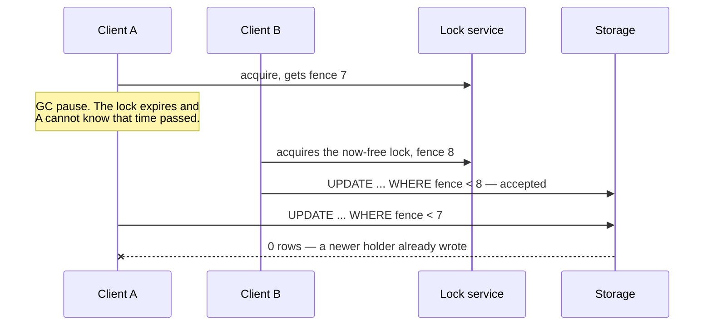

# Consensus, coordination and distributed locks

How independent nodes agree on anything. You used Redis heavily, so the
distributed-lock section — and the Redlock argument — is fair game.

---

## Foundations

**Consensus** is getting nodes to agree on a value despite failures. It
underpins leader election, cluster membership, distributed locks, and any
sequence everyone must see identically.

**FLP impossibility** is the theoretical bound worth knowing by name: in a
fully asynchronous system with even one faulty process, no deterministic
algorithm guarantees consensus. Real systems sidestep it with timeouts and
randomised leader election — they're not *guaranteed* to terminate, but in
practice they do promptly.

The consequence: **you cannot distinguish a crashed node from a slow one.**
Every failure detector is a guess, and that guess is the source of most
distributed-systems subtlety.

---

## Raft, enough to explain it

Paxos is correct and famously hard to follow. Raft was designed for
understandability and won in practice — etcd, Consul, CockroachDB, TiKV.


*The self-loop is the trick. Without a randomised timeout there, equal waits mean split votes repeat forever.*

Three roles, and a term counter that acts as a logical clock. A node starts as
a **follower**. On an election timeout (no heartbeat for 150–300ms) it bumps
the term and becomes a **candidate**; win a majority and it becomes **leader**,
hear from a higher-term leader and it drops back to follower, split the vote and
it retries after a fresh randomised timeout. A leader that sees a higher term
steps down.

**The randomised timeout on the split-vote transition is the trick.** If every
node waited exactly the same time, split votes would repeat forever.

**Leader election.** Every follower has a randomised election timeout. Missing
a heartbeat, it increments the term, becomes a candidate and requests votes.
Winning a **majority** makes it leader. Randomised timeouts are what break
split votes — without them candidates would repeatedly collide.

**Log replication.** All writes go through the leader. It appends to its log,
replicates to followers, and once a **majority** has persisted the entry it is
*committed* and applied.

**Why a majority?** Two majorities of the same cluster must overlap in at least
one node, which makes two conflicting leaders impossible in the same term. It's
also why clusters are odd-sized: 5 nodes tolerate 2 failures, 6 nodes still
only tolerate 2 — the extra node adds cost and no fault tolerance.

---

## Distributed locks — and where they go wrong

The tempting pattern: `SET lock:resource <token> NX PX 30000` in Redis, do the
work, delete the key.

**The `NX` and `PX` both matter.** `NX` makes acquisition atomic. `PX` sets an
expiry so a crashed holder doesn't deadlock the resource forever.

**Release must be conditional.** Deleting the key unconditionally can delete
*someone else's* lock:

```
client A acquires, lock expires while A is in GC pause
client B acquires the now-free lock
client A finishes, runs DEL lock:resource   ← deletes B's lock
client C acquires — now B and C both hold it
```

So release compares a unique token first, atomically, via a Lua script.

### The Redlock argument

Redlock is the algorithm for locking across N independent Redis masters,
requiring a majority. Martin Kleppmann's critique and Salvatore Sanfilippo's
response are the canonical exchange, and knowing the shape of it is a strong
signal.

**The core objection:** a lock with a timeout provides *no safety guarantee*
without fencing, because the holder can be paused — GC, VM suspension, network
delay — past the expiry and not know it. It resumes believing it holds the lock
while someone else genuinely does.

**No lock TTL fixes this**, because A cannot detect its own pause. Concretely:
A takes the lock with a 30s TTL, then stalls 40s; the TTL expires and B
legitimately takes the lock and writes; A wakes still believing it holds the
lock and also writes. Only the storage layer, rejecting any write whose fencing
token is lower than the highest it has already accepted, can stop the two
writers from corrupting the data.

**Fencing tokens are the fix.** The lock service returns a monotonically
increasing number with each grant. Every write carries it, and **storage
rejects any token lower than the highest it has seen**. A's stale write is
rejected because its token is older than B's.

Note where the burden falls: the *storage layer* must enforce it. If your
storage can't check a fencing token, the lock cannot give you safety — only
efficiency.

**The distinction to draw, and it's the whole answer:** a Redis lock buys you
*efficiency* (usually only one worker does the work); only a fencing token
checked by storage — or a consensus-backed lock — buys you *safety* (never two
writers).

### The lock, written correctly

**Acquire** — one atomic command. `NX` means "only if it doesn't exist", `PX`
sets the expiry so a crashed holder can't deadlock the resource forever:

```bash
redis> SET lock:invoice:42 "e8f1c2a9-uuid-of-this-holder" NX PX 30000
OK                      # acquired
redis> SET lock:invoice:42 "another-uuid" NX PX 30000
(nil)                   # someone else holds it
```

The value is a **token unique to this holder**. That matters for release.

**Release** — never a plain `DEL`. Compare the token first, atomically, in Lua:

```lua
-- release.lua — delete the key ONLY if it still holds MY token
if redis.call("get", KEYS[1]) == ARGV[1] then
  return redis.call("del", KEYS[1])
else
  return 0
end
```

```js
await redis.eval(releaseLua, 1, 'lock:invoice:42', myToken);
```

Without the comparison, this happens:

```
t=0     A acquires, TTL 30s
t=30    A is still in a GC pause; the lock EXPIRES
t=31    B acquires — legitimately
t=35    A wakes, finishes, runs DEL lock:invoice:42   ← deletes B's lock
t=36    C acquires. B and C now both believe they hold it.
```

**Extend** — if the work may outlive the TTL, renew it while you hold it, again
only if the token still matches:

```lua
if redis.call("get", KEYS[1]) == ARGV[1] then
  return redis.call("pexpire", KEYS[1], ARGV[2])
else
  return 0
end
```

### Fencing tokens — what the lock alone cannot give you


*Nothing the lock does can stop A. Only storage knows a newer holder exists, which is why the check has to live there.*

Even correct release doesn't make the lock *safe*, because a paused holder
can't know time passed. The fix moves the check to storage:

```js
// The lock service hands out a monotonically increasing number.
const fence = await redis.incr('fence:invoice:42');   // 1, 2, 3, ...

// Every write carries it, and storage refuses anything older.
await db.query(
  `UPDATE invoices SET status = $1, fence = $2
     WHERE id = $3 AND fence < $2`,           // ← the whole safety property
  ['paid', fence, 42]
);
// rowCount === 0  =>  a newer holder already wrote; you are stale, stop.
```

```
A holds fence=12, pauses.   B acquires, gets fence=13, writes.  invoices.fence = 13
A wakes, writes with fence=12  ->  WHERE fence < 12 fails  ->  0 rows.  Rejected.
```

**The burden is on the storage layer.** If your datastore can't check a fencing
token, the lock gives you efficiency, not safety — which is the entire point of
the table below.

| Purpose | Requirement | Redis lock enough? |
| --- | --- | --- |
| **Efficiency** — avoid duplicate work | Occasional double-execution is fine | Yes |
| **Correctness** — must never double-execute | Safety under all failures | **No** — needs fencing, or a consensus system |

If double-execution merely wastes CPU, a Redis lock is fine. If it corrupts
data or double-charges a customer, you need fencing tokens, or a consensus-backed
lock (etcd, ZooKeeper), or — best — to remove the need for a lock by making the
operation idempotent.

> **In your own work.** Redis in an auth platform invites: "did you use
> distributed locks, and for what?" The strongest answer names the
> efficiency/correctness split and says which side your use sat on. See
> [caching at scale](07-caching-at-scale.md) for the related stampede-lock case.


## Building it

**Libraries**

| Need | Library | Why |
| --- | --- | --- |
| Distributed lock (single Redis) | `ioredis` + the Lua script above | `SET ... NX PX` plus a Lua-scripted conditional release — no extra dependency needed for the common case |
| Distributed lock (Redlock, multiple masters) | `redlock` (npm) | Implements the majority-quorum algorithm from "The Redlock argument" instead of you reimplementing it — still carries the same debated guarantees |
| Consensus itself | you don't build Raft | Reach for etcd, Consul, or a database that already runs it (CockroachDB) rather than implementing the algorithm — see "Raft, enough to explain it" |

**Why the release has to be Lua, not two round trips**

`GET` then compare then `DEL` is three separate network round trips. Between
any two of them, another client's command can run — that's the whole race
this chapter opens with. Redis executes a Lua script as **one atomic unit**;
nothing else runs on that Redis instance while it executes. That's the actual
property being bought, not "Lua is fast" — it's "Lua can't be interleaved".

**Pseudocode — fencing token check, expressed as the storage guard**

```ts
const fence = await redis.incr(`fence:invoice:${id}`);
const { rowCount } = await db.query(
  `UPDATE invoices SET status = $1, fence = $2 WHERE id = $3 AND fence < $2`,
  ['paid', fence, id]
);
if (rowCount === 0) throw new Error('stale holder — a newer fence already wrote');
```

---

## Interview Q&A

### Q: How does leader election work?
**Level:** intermediate · **Tags:** raft, consensus, election

<details><summary>Model answer</summary>

Taking Raft as the model, since it's what most systems actually use.

Nodes are followers by default and expect regular heartbeats from a leader.
Each has a **randomised** election timeout. If a follower's timeout elapses
without a heartbeat, it increments the term number, becomes a candidate, votes
for itself and requests votes from the others.

A node grants its vote if it hasn't voted in that term and the candidate's log
is at least as up to date as its own. A candidate winning a **majority**
becomes leader and starts sending heartbeats, which suppresses further
elections.

Two details carry the weight. The **majority** requirement means two nodes
can't both win in the same term, because any two majorities overlap. And the
**randomised** timeout is what resolves split votes — with fixed timeouts,
candidates would keep colliding and re-splitting indefinitely.

The term number acts as a logical clock: any node seeing a higher term
immediately reverts to follower, which is how a partitioned old leader stands
down when it rejoins.

</details>

**Follow-ups:**

1. Q: Why are consensus clusters usually 3 or 5 nodes rather than 4 or 6?
   <details><summary>Answer</summary>

   Because fault tolerance is `floor((N-1)/2)`, and an even node count buys
   none.

   3 nodes need 2 for a majority, tolerating 1 failure. 4 nodes need 3,
   tolerating 1 — the same, for 33% more cost. 5 tolerate 2; 6 also tolerate 2.

   So even sizes pay for hardware and add coordination latency without adding
   resilience. Larger clusters also make every write slower, since a majority
   must acknowledge — which is why you rarely see more than 5 or 7 even in
   large deployments. Consensus clusters are for coordination metadata, not
   bulk data.

   </details>

2. Q: The network partitions a 5-node cluster into 3 and 2. What happens?
   <details><summary>Answer</summary>

   The 3-node side has a majority, so it can elect a leader and continue
   serving reads and writes.

   The 2-node side cannot reach a majority. Any candidate there fails to win
   the vote, so no leader emerges and that side stops accepting writes. If the
   old leader was on the minority side, it stands down once it can't reach a
   majority — or it may keep believing it's leader until it discovers a higher
   term on rejoining, which is exactly why fencing matters for anything it was
   coordinating.

   This is CP behaviour: the minority chooses unavailability over divergence.
   That's the right trade for coordination metadata, where two conflicting
   answers would be worse than no answer.

   </details>

### Q: Is a Redis distributed lock safe?
**Level:** senior · **Tags:** redis, locks, redlock

<details><summary>Model answer</summary>

It depends on whether you need it for efficiency or for correctness, and that's
the distinction I'd lead with.

The basic pattern — `SET key token NX PX ttl`, work, conditional delete via Lua
comparing the token — is sound for **efficiency**: preventing duplicate work
where an occasional double-execution merely wastes resources.

It does not provide **safety**. The problem is that a lock with a timeout can't
guarantee the holder still holds it. A client can be paused past the expiry —
GC, VM suspension, a network stall — and resume believing it's still the owner
while someone else has legitimately acquired it. Now there are two writers, and
no amount of care in the lock code prevents that, because the client can't know
time passed.

That's the real content of Kleppmann's Redlock critique, and it applies to any
TTL-based lock, not just Redis.

The fix is **fencing tokens**: the lock grants a monotonically increasing
number, every write carries it, and the storage layer rejects tokens lower than
the highest it has seen. The stale writer's request is rejected. Note the
burden is on *storage* — if your datastore can't check a token, the lock can't
give you safety.

So: Redis lock for efficiency, fencing tokens or a consensus-backed lock like
etcd for correctness, and best of all, design the operation to be idempotent so
the lock isn't load-bearing.

</details>

**Follow-ups:**

1. Q: Why not always use etcd or ZooKeeper then?
   <details><summary>Answer</summary>

   Because consensus is expensive and operationally heavier. Every acquisition
   is a majority-acknowledged write, which is far slower than a single Redis
   round trip, and you're now running and monitoring a consensus cluster.

   The honest framing: consensus systems give a *better* failure detector and
   session semantics — ZooKeeper's ephemeral nodes tie a lock to a live session
   rather than a wall-clock TTL, which removes the "did my TTL expire while I
   was paused?" ambiguity — but they still can't stop a paused client from
   acting on stale beliefs. Even ZooKeeper's own documentation recommends
   fencing.

   So the ordering I'd use: make it idempotent if you can, which removes the
   problem. If you need coordination, use whatever lock is convenient, and add
   fencing tokens if correctness depends on it. Reach for etcd or ZooKeeper
   when you need consensus anyway — leader election, cluster membership,
   configuration — rather than for locks alone.

   </details>

2. Q: How would you avoid needing a distributed lock at all?
   <details><summary>Answer</summary>

   Usually the better engineering, and I'd offer it before the lock design.

   **Make the operation idempotent** — a client-supplied idempotency key the
   server deduplicates on. Then concurrent or duplicated execution converges to
   the same result, and there is nothing to protect.

   **Push the atomicity into the datastore** — a conditional update
   (`UPDATE ... WHERE status = 'open'`), optimistic concurrency with a version
   column, or a unique constraint. The database already has the concurrency
   control; a distributed lock is often reimplementing it worse.

   **Partition ownership** so only one worker ever handles a given key — a
   partitioned queue keyed by entity means no two workers touch the same entity
   concurrently by design.

   **Single-writer designs** — route all mutations for an entity through one
   owner.

   The pattern is: eliminate contention structurally rather than mediating it.
   Locks are coordination, and coordination is the thing that doesn't scale.

   </details>

---

## What a weak answer sounds like

- **"We use a Redis lock so it's safe."** Safe for efficiency, not correctness.
  Without fencing there's no safety guarantee.
- **Not knowing why clusters are odd-numbered.**
- **"Paxos and Raft are basically the same."** Same guarantees, but Raft's
  design goal was understandability, and it won adoption for that reason.
- **Releasing a lock with an unconditional `DEL`.** Deletes whoever's lock is
  there now.
- **Reaching for a lock** where an idempotency key or a conditional update
  would remove the need.

---

## Glossary

- **Consensus** — agreeing on a value despite failures.
- **FLP** — no deterministic consensus in a fully async system with one fault.
- **Raft** — leader-based consensus designed for understandability.
- **Term** — Raft's logical clock; higher term wins.
- **Quorum / majority** — `⌊N/2⌋+1`; any two majorities overlap.
- **Split brain** — two nodes both acting as leader.
- **Fencing token** — monotonic number storage uses to reject stale writers.
- **Redlock** — multi-master Redis locking; contested for safety claims.
- **Ephemeral node** — ZooKeeper node tied to a session, not a TTL.
- **Lease** — a lock with an expiry.
