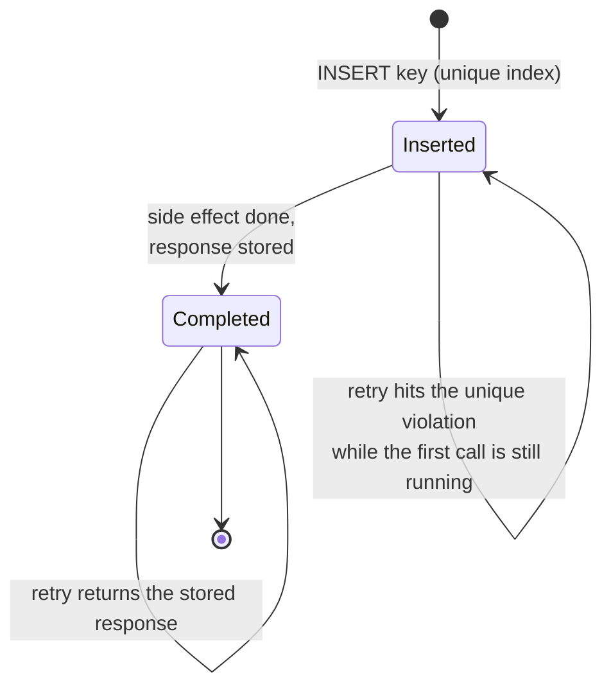
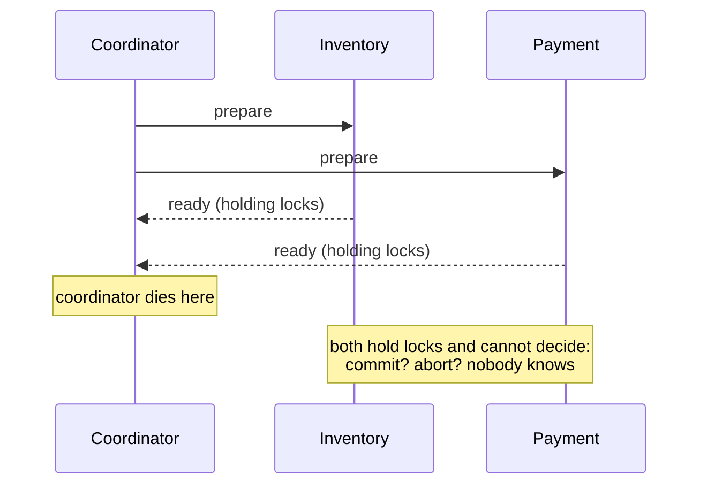
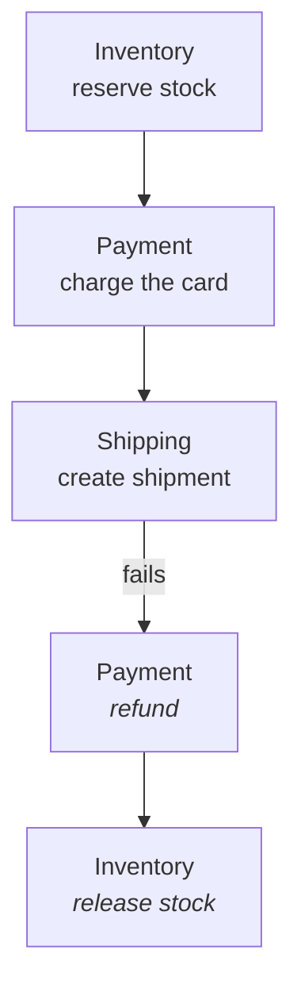
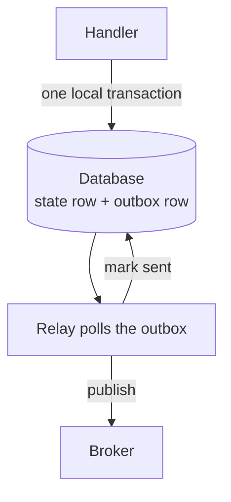

# Idempotency, ordering and distributed transactions

Three practical things that follow from partial failure: how to make retries
safe, why "exactly once" delivery doesn't exist, and what you use instead of
database transactions when data lives in several services.

---

## Foundations

### Time is not what you think

**Wall-clock time is not ordering.** Machine clocks drift, NTP corrections can
step time *backwards*, and two events microseconds apart on different machines
can carry timestamps in the wrong order. Any algorithm that decides correctness
by comparing timestamps from different machines is broken.

Use monotonic clocks for measuring elapsed time. For ordering *events*, use
logical clocks:

- **Lamport clocks** — a counter per node, incremented on each event and
  carried on messages. Gives a total order consistent with causality, but you
  can't tell from two Lamport timestamps whether the events were causally
  related or concurrent.
- **Vector clocks** — a counter per node, per node. Larger, but they *can*
  distinguish "happened before" from "concurrent", which is what conflict
  detection needs.

**Last-write-wins by timestamp silently loses data** — two concurrent writes,
one is discarded, and nobody is told. It's the default in several systems and
it's a deliberate trade, not a correctness guarantee.

### Exactly-once is a myth

You get to choose between two delivery semantics:

| Semantics | Meaning | Cost |
| --- | --- | --- |
| **At-most-once** | Send, never retry | Messages lost on failure |
| **At-least-once** | Retry until acknowledged | **Duplicates** |
| ~~Exactly-once~~ | Impossible in delivery | — |

Because a sender can't distinguish "request lost" from "reply lost", it must
either retry (risking duplicates) or not (risking loss). There is no third
option at the transport layer.

**"Exactly-once processing" is achievable** — and this is the precise
formulation to use in an interview: at-least-once delivery plus **idempotent
processing** yields effectively-once semantics. The duplicates still arrive;
they just stop mattering.

---

## Idempotency

An operation is idempotent when performing it multiple times has the same
effect as once.

Naturally idempotent: `GET`, `PUT` with a full replacement, `DELETE`, setting a
value. Not idempotent: `POST /orders`, incrementing a counter, appending to a
list, sending an email.

### The idempotency key pattern


*Insert and side effect are one transaction. Split them and a crash leaves a key with no stored response — the retry returns nothing while the money already moved.*

The client sends a unique `Idempotency-Key` with the request. The server, in
**one transaction**, inserts that key (a unique index makes a duplicate fail),
does the side effect (charge the card), and stores the response body against
the key. If the client never sees the response and retries with the same key,
the insert hits a unique violation and the server returns the *stored* response
— no second charge.

**The insert and the side effect must be one transaction.** If you insert the
key, then charge, then crash — the key exists with no stored response, and the
retry returns nothing while the money moved.

### The table and the transaction

```sql
CREATE TABLE idempotency_keys (
  key            TEXT PRIMARY KEY,          -- client-supplied, unique
  request_hash   TEXT NOT NULL,             -- guards against key reuse on a different body
  response_code  INT,
  response_body  JSONB,
  created_at     TIMESTAMPTZ DEFAULT now()
);
```

The whole thing hinges on one transaction:

```sql
BEGIN;
  -- Claim the key. If it already exists this raises, and we return the stored reply.
  INSERT INTO idempotency_keys (key, request_hash) VALUES ($1, $2);

  -- The actual effect, in the SAME transaction.
  INSERT INTO charges (id, amount, customer) VALUES ($3, $4, $5);

  UPDATE idempotency_keys
     SET response_code = 201, response_body = $6
   WHERE key = $1;
COMMIT;
```

```js
try {
  await tx(async (c) => { /* the block above */ });
  return res.status(201).json(charge);
} catch (e) {
  if (e.code === '23505') {                       // unique_violation
    const prior = await db.one('SELECT * FROM idempotency_keys WHERE key = $1', key);
    if (prior.request_hash !== hashOf(req.body))  // same key, different body
      return res.status(422).json({ error: 'idempotency_key_reuse' });
    if (!prior.response_body)                     // first attempt still in flight
      return res.status(409).json({ error: 'request_in_progress' });
    return res.status(prior.response_code).json(prior.response_body);
  }
  throw e;
}
```

The client's side:

```bash
curl -X POST https://api.example.com/charges \
  -H "Idempotency-Key: 8f14e45f-ea0d-4a1b-9c2e-3b6d7a1f0c22" \
  -H "Content-Type: application/json" \
  -d '{"amount": 2500, "currency": "usd", "customer": "cus_123"}'
```

Retry it verbatim and you get the same `201` and the same charge id — no second
charge.

Details that make it actually work:

- The **client** generates the key, per logical operation — not per HTTP
  attempt, or retries get new keys and defeat the point.
- Store the key *and the response*, so a retry returns the same answer rather
  than a confusing conflict.
- Insert the key **in the same transaction** as the effect. Otherwise you can
  perform the work and crash before recording the key, and the retry does it
  again.
- Expire keys after a sensible window (24h is typical); they can't be kept
  forever.
- Handle the concurrent case: two simultaneous requests with the same key. The
  unique constraint makes one lose; it should wait and return the winner's
  result, not error.

---

## Distributed transactions

ACID across services isn't available. Three approaches replace it.

### Two-phase commit (2PC)


*The blocked state is why 2PC is rarely the answer: participants hold locks across the network waiting on a single point of failure.*

A coordinator asks all participants to prepare, then tells them all to commit.

**Why it's rarely the answer:** it's blocking. If the coordinator dies after
prepare, participants hold locks indefinitely — they can't commit (they don't
know the decision) and can't abort (someone else may have committed). The
coordinator is a single point of failure that can freeze the system, and it
scales badly because locks are held across the network.

### Sagas


*The unwind is forward motion, not rollback: the charge really happened and is then refunded, so both appear on the customer's statement.*

Break the transaction into local transactions, each with a **compensating
action**. Inventory reserves stock, Payment charges the card, Shipping tries to
create the shipment — and if that last step fails, the saga unwinds in reverse:
Payment refunds the charge, Inventory releases the stock. The system is
consistent again, *eventually*.

**Compensation is not rollback.** The charge genuinely happened and is then
refunded — both appear on the customer's statement, and the intermediate state
was visible to everyone in between.

**Compensation is not rollback.** The payment genuinely happened and is then
refunded — both appear on the statement, and intermediate states are visible to
users and to other services. That has to be acceptable to the business, and
sometimes it isn't: you cannot un-send an email.

Orchestrated (a coordinator drives the steps — easier to reason about and
monitor) versus choreographed (services react to each other's events — looser
coupling, much harder to debug). Prefer orchestration for anything you'll need
to support.

### The outbox pattern

The piece people miss. You need to update your database **and** publish an
event, atomically — but they're different systems, so you can't.

Naively: write to the DB, then publish. Crash in between and the state changed
with no event, so downstream never learns. Publish first, then write? Now the
event describes something that didn't happen.


*Both writes land in one database, so there is no window where the state changed and the event did not. The relay can publish twice, never zero times.*

**The outbox:** write the event to an `outbox` table *in the same local
transaction* as the state change. A separate relay reads the outbox and
publishes. Atomicity is preserved because both writes hit one database.

### The outbox, concretely

```sql
CREATE TABLE outbox (
  id           BIGSERIAL PRIMARY KEY,
  aggregate_id TEXT NOT NULL,
  event_type   TEXT NOT NULL,
  payload      JSONB NOT NULL,
  published_at TIMESTAMPTZ                    -- NULL until the relay sends it
);
```

Write the state change and the event **in one local transaction** — one
database, so it is genuinely atomic:

```sql
BEGIN;
  UPDATE orders SET status = 'paid' WHERE id = 'ord_42';
  INSERT INTO outbox (aggregate_id, event_type, payload)
  VALUES ('ord_42', 'OrderPaid', '{"orderId":"ord_42","amount":2500}');
COMMIT;
```

A separate relay drains it. `FOR UPDATE SKIP LOCKED` lets several relay
instances run without processing the same row twice:

```sql
SELECT * FROM outbox
 WHERE published_at IS NULL
 ORDER BY id
 LIMIT 100
   FOR UPDATE SKIP LOCKED;
```

```js
for (const ev of rows) {
  await broker.publish(ev.event_type, ev.payload);          // may succeed…
  await db.query('UPDATE outbox SET published_at = now() WHERE id = $1', [ev.id]);
}                                                            // …and crash here
```

That crash is why this is **at-least-once**: the event was published but not
marked sent, so the next run publishes it again. Consumers must be idempotent —
which brings the chapter full circle.

> **In your own work.** The Bestpeers monolith split into 3 services is where
> this lives: "how did you keep data consistent across them?" Sagas and the
> outbox pattern are the expected vocabulary. See
> [bestpeers](../00-experience/bestpeers.md) Story 2.


## Building it

**Libraries**

| Need | Library | Why |
| --- | --- | --- |
| Idempotency key table | plain SQL, as above | The pattern is a unique index plus one transaction — a library adds nothing here |
| Outbox relay | `pg-boss` or a small polling worker | Reads the outbox table and publishes; doesn't need to be Kafka-specific tooling if the volume doesn't demand it |
| Sagas | `bullmq` for each local step, hand-rolled orchestration | There's no dominant Node saga-orchestration framework — most teams write the state machine themselves and use a queue library for the steps |

**Pseudocode — the outbox relay**

```ts
async function relay() {
  const rows = await db.query(
    `SELECT * FROM outbox WHERE published_at IS NULL ORDER BY id LIMIT 100`
  );
  for (const row of rows) {
    await broker.publish(row.topic, row.payload);          // may publish twice
    await db.query(`UPDATE outbox SET published_at = now() WHERE id = $1`, [row.id]);
  }
}
```

At-least-once on the publish side is fine *because* the event carries an id a
consumer can dedupe on — the outbox buys atomicity with the DB write, not
exactly-once delivery.

---

## Interview Q&A

### Q: What does idempotency mean and how do you implement it for a payment API?
**Level:** intermediate · **Tags:** idempotency, api-design

<details><summary>Model answer</summary>

Idempotent means performing the operation more than once has the same effect as
performing it once. It matters because a network timeout doesn't tell you
whether the work happened — so without idempotency, the caller has no safe
action after a timeout.

For payments, the standard is an idempotency key. The client generates a UUID
per logical charge — not per retry — and sends it as a header. The server
inserts that key with a unique constraint; if the insert succeeds it's the first
attempt, so it performs the charge and stores the response against the key. If
the insert conflicts, the operation already ran, and the server returns the
stored response rather than charging again.

The details that make it correct: insert the key in the **same transaction** as
the charge, or you can charge and crash before recording the key, and the retry
charges again. Store the response, not just the key, so a retry gets the same
answer. Expire keys after something like 24 hours. And handle two concurrent
requests with the same key — the loser of the unique constraint should wait for
and return the winner's result, not return an error.

</details>

**Follow-ups:**

1. Q: The client crashes and loses the key before retrying. Now what?
   <details><summary>Answer</summary>

   Then you can't deduplicate, because the retry is indistinguishable from a
   new request — which shows that idempotency is a property of the *whole
   system*, not just the server.

   The mitigations: derive the key deterministically from the operation's
   content rather than randomly, so a reconstructed request produces the same
   key. Or persist the key client-side before sending — write intent first,
   then act, which is the outbox pattern on the client. Or provide a query
   endpoint so a recovering client can ask "did my charge for this order go
   through?" before retrying.

   For payments specifically, a reconciliation process is the backstop: compare
   your records against the provider's periodically and catch anything that
   diverged. At sufficient scale you assume some duplicates will slip through
   and you detect them after the fact.

   </details>

2. Q: Is `POST` ever idempotent? Should you just use `PUT`?
   <details><summary>Answer</summary>

   `POST` isn't idempotent by HTTP semantics — that's the definitional
   difference — but you can *make a specific endpoint* idempotent with a key,
   which is what payment APIs do.

   `PUT` is idempotent because it replaces a resource at a client-chosen URI:
   sending it twice leaves the same state. So if the client can generate the
   resource id, `PUT /orders/{client-uuid}` is naturally idempotent and neatly
   sidesteps the problem.

   That's often a good design, but it isn't always available: the id may need to
   be server-generated for security or sequencing, or creation may have side
   effects beyond the resource itself. The idempotency key generalises better —
   it works regardless of verb and of who assigns identity.

   </details>

### Q: How do you maintain consistency across three microservices without distributed transactions?
**Level:** senior · **Tags:** sagas, outbox, microservices

<details><summary>Model answer</summary>

You give up atomicity across services and design for eventual consistency,
because 2PC's costs usually outweigh its guarantee.

**Sagas** are the pattern: the business transaction becomes a sequence of local
transactions, each with a compensating action if a later step fails. Reserve
inventory, charge payment, create shipment; if shipment fails, refund the
payment and release the inventory.

The important honesty is that compensation is not rollback. The payment
actually happened and is then refunded — it appears twice on the customer's
statement, and intermediate states are visible to users and other services. The
business has to accept that, and some actions can't be compensated at all: you
can't un-send an email.

**The outbox pattern** solves the piece people miss. Updating your database and
publishing an event are two systems, so they can't be atomic. Write the event
to an outbox table in the *same* local transaction as the state change, and let
a relay publish from there. Now the state change and the intent to publish
commit together.

The relay can publish twice — crash after publishing, before marking sent — so
this is at-least-once, and every consumer must be idempotent. That's the
recurring theme: at-least-once delivery plus idempotent processing gives
effectively-once, and there's no way to get exactly-once at the transport
layer.

I'd choose orchestrated sagas over choreographed ones for anything I have to
operate, because a central coordinator is far easier to monitor and debug than
services reacting to each other's events.

</details>

**Follow-ups:**

1. Q: When would 2PC actually be the right choice?
   <details><summary>Answer</summary>

   When the participants are few, co-located, and under one operator's control,
   and when intermediate inconsistency is genuinely unacceptable.

   Concretely: transactions across two databases within one datacentre, or
   within a single database engine that supports it, where the coordinator can
   be made highly available and the locks are held briefly. Some message
   brokers and databases offer XA transactions for exactly this.

   What makes it wrong for microservices is the combination of blocking and
   coupling: a coordinator failure after prepare leaves participants holding
   locks with no way to resolve, availability becomes the product of every
   participant's availability, and cross-network locks kill throughput.

   The one-line version: 2PC trades availability for consistency in a way most
   internet-facing systems can't afford.

   </details>

2. Q: A saga's compensating action itself fails. What then?
   <details><summary>Answer</summary>

   The case people don't plan for, and the honest answer is that it needs human
   escalation eventually.

   First, compensations must be **retryable and idempotent** — a failed refund
   should retry safely without double-refunding. Most transient failures
   resolve here.

   If it keeps failing, the saga goes to a **dead-letter state** with an alert:
   something is stuck in an inconsistent state and needs attention. That's a
   real operational queue somebody owns, not a log line.

   Design-wise you reduce the exposure by ordering steps so the hardest to
   compensate happens **last** — take the payment after reserving inventory,
   not before, so the common failure compensates something easy. And where
   possible, prefer a *reservation* model: hold inventory with a TTL rather
   than committing it, so expiry compensates automatically without an explicit
   action.

   The framing I'd end on: sagas don't guarantee consistency, they guarantee
   eventual convergence *given working compensations*. When those fail you need
   detection and a human, and pretending otherwise is how systems silently
   drift.

   </details>

---

## What a weak answer sounds like

- **"We use exactly-once delivery."** It doesn't exist. At-least-once plus
  idempotency gives effectively-once.
- **"We just retry on failure."** Without idempotency, retries duplicate.
- **Calling compensation "rollback."** The action happened and is visible.
- **Publishing an event after a DB write and calling it atomic.** That's the
  gap the outbox closes.
- **Ordering events by wall-clock timestamps across machines.** Clocks drift
  and can step backwards.

---

## Glossary

- **Idempotent** — repeating it changes nothing further.
- **Idempotency key** — client-generated id the server deduplicates on.
- **At-least-once / at-most-once** — retry and risk duplicates / don't and risk
  loss.
- **Effectively-once** — at-least-once delivery plus idempotent processing.
- **2PC** — two-phase commit; blocking, coordinator is a SPOF.
- **Saga** — local transactions with compensating actions.
- **Compensation** — an action undoing a previous one; not a rollback.
- **Outbox** — event written in the same transaction as the state change.
- **Lamport / vector clock** — logical ordering; vector clocks detect
  concurrency.
- **Last-write-wins** — resolve conflicts by timestamp; silently drops data.
