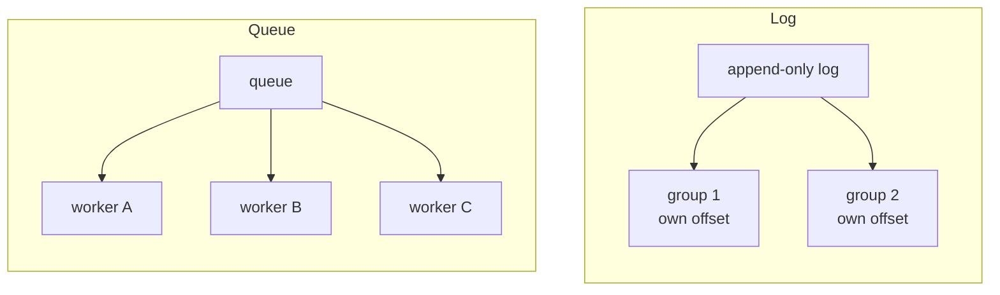
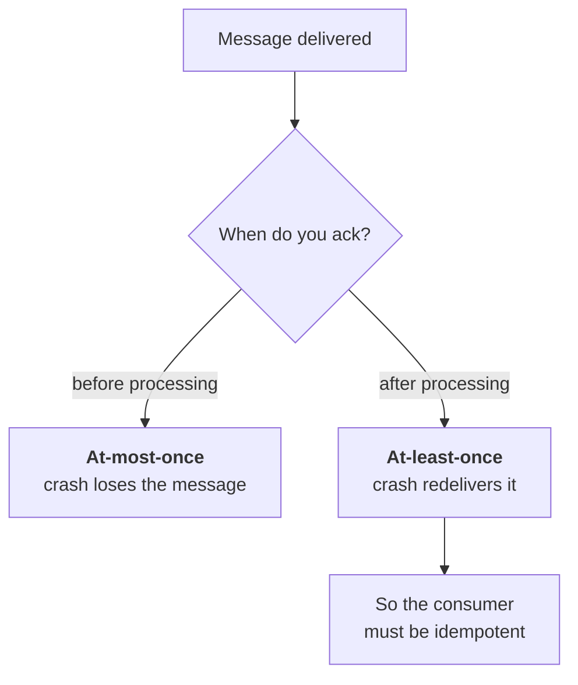

# Messaging, queues and streams

How services communicate without calling each other synchronously — and the
failure modes that come with it. Socket.io is on your resume, so real-time
delivery belongs here too.

---

## Foundations

### Queue vs log — the distinction that matters


*Workers compete for one message; consumer groups each read everything at their own offset. That offset is why a log can be replayed and a queue cannot.*

| | **Queue** (RabbitMQ, SQS) | **Log** (Kafka, Kinesis) |
| --- | --- | --- |
| Model | Message consumed and removed | Append-only; messages persist |
| Consumers | Compete — each message to one | Independent — each reads all |
| Replay | Gone once acknowledged | Rewind to any offset |
| Ordering | Per queue, weak under concurrency | Strict **per partition** |
| Scaling reads | Add consumers to the same queue | Add consumer groups |

**A log is not a queue with persistence.** The consumer tracks its own
**offset**, so multiple independent consumers read the same stream at their own
pace, and a new consumer can replay history from the beginning. That's what
makes event sourcing and rebuilding derived state possible — and it's usually
the reason to choose Kafka.

Choose a queue for work distribution — jobs to be done once. Choose a log for
events others may want to consume in several ways, now and later.

### Ordering

Kafka guarantees order **within a partition only**. Since partition is chosen
by key, events for the same key stay ordered. Across partitions there's no
ordering at all.

The practical implication: **partition by the entity whose order matters.**
Key by `user_id` and that user's events stay in sequence, while different users
process in parallel. Key randomly and you get parallelism with no ordering
guarantee anywhere.

The trade is direct: ordering requires serialisation, so anything ordered
cannot be parallelised. A single hot key becomes a throughput ceiling.

---

## Delivery, failure and backpressure

### Consumer failure

When the broker delivers a message, the consumer processes it and only then
commits the offset. On a transient failure it retries with backoff and jitter,
committing once it succeeds; after N failed attempts — or immediately for a
message it can tell will never succeed — it moves the message to a
**dead-letter queue** and commits the offset anyway, so the stream keeps
moving. The DLQ then has to alert a human.

**The poison message problem:** a malformed message that always fails. Retried
forever, it blocks the partition behind it and stalls everything. That's what a
**dead-letter queue** is for — after N attempts, move it aside so the stream
keeps flowing.

The operational point interviewers listen for: **a DLQ nobody monitors is just
a slower way to lose data.** It needs an alert and an owner.

### Acknowledgement timing decides your semantics


*There is no third option on this switch, which is why at-least-once plus idempotency is the normal choice rather than a compromise.*

- **Ack before processing** — at-most-once. Crash and the message is lost.
- **Ack after processing** — at-least-once. Crash after doing the work but
  before acking, and it's redelivered. **This is the normal choice**, and it's
  why consumers must be idempotent.

### A consumer that behaves

Ack **after** processing, retry with a bound, then dead-letter:

```js
const MAX_ATTEMPTS = 5;

consumer.on('message', async (msg) => {
  const attempt = Number(msg.headers['x-attempt'] ?? 0);
  try {
    await handle(msg.value);              // must be idempotent — see below
    await consumer.commitOffsets([{ topic: msg.topic,
      partition: msg.partition, offset: String(Number(msg.offset) + 1) }]);
  } catch (err) {
    if (attempt + 1 >= MAX_ATTEMPTS) {
      await producer.send({ topic: `${msg.topic}.dlq`, messages: [{
        key: msg.key, value: msg.value,
        headers: { ...msg.headers, 'x-error': String(err.message),
                   'x-failed-at': new Date().toISOString() },
      }]});
      await consumer.commitOffsets([{ /* skip it — the stream must keep moving */ }]);
    } else {
      await producer.send({ topic: `${msg.topic}.retry`, messages: [{
        key: msg.key, value: msg.value,
        headers: { ...msg.headers, 'x-attempt': String(attempt + 1) },
      }]});
    }
  }
});
```

**Committing the offset after dead-lettering is the important bit.** A poison
message that is retried forever blocks its whole partition — every other
message for those keys stalls behind it, which is an outage, not a failed
message.

Consumers get duplicates (at-least-once), so `handle` must dedupe:

```js
async function handle(evt) {
  const fresh = await redis.set(`seen:${evt.id}`, '1', 'NX', 'EX', 86400);
  if (!fresh) return;                    // already processed — drop it
  await doTheWork(evt);
}
```

### Ordering, and how to lose it by accident

```js
// Same key -> same partition -> ordered. Different keys run in parallel.
await producer.send({ topic: 'user-events', messages: [
  { key: userId, value: JSON.stringify(evt) },   // ← the key IS the ordering
]});
```

Two ways people throw that away:

```js
// 1. No key: round-robins across partitions, so ordering is gone.
await producer.send({ topic: 'user-events', messages: [{ value: json }] });

// 2. Concurrency in the consumer: the broker delivered them in order,
//    and the thread pool reordered them anyway.
await Promise.all(batch.map(handle));      // ✗
for (const m of batch) await handle(m);    // ✓ per partition
```

### Backpressure

Producers outpacing consumers is the fundamental capacity problem, and where it
shows up depends on the model. **Push** systems overwhelm consumers unless the
consumer signals; **pull** systems (Kafka) have natural backpressure because
consumers fetch at their own rate — the queue simply grows.

Responses, in escalating order: buffer (bounded — an unbounded buffer is an
out-of-memory error waiting), scale consumers out (only works if partitions
allow parallelism), **shed load** by rejecting or sampling, or degrade by
dropping low-priority work.

**Consumer lag is the metric to watch** — how far behind the head a consumer
is. Growing lag means you're losing the race, and it's the leading indicator
before anything user-visible breaks.

---

## Real-time push to clients (Socket.io)

Different problem: pushing to browsers, not between services.

| Transport | Direction | Use |
| --- | --- | --- |
| **Polling** | Client asks repeatedly | Simple, wasteful, high latency |
| **Long polling** | Request held open | Works everywhere, connection churn |
| **SSE** | Server → client only | Simple, auto-reconnects, HTTP |
| **WebSocket** | Bidirectional | Chat, collaboration, live editing |

Socket.io wraps WebSocket with automatic fallback and reconnection.

**The scaling problem** is that WebSockets are stateful: a connection lives on
one server, so a message for that user must reach *that* server. Solutions: a
pub/sub adapter (Socket.io's Redis adapter) so any instance can publish to any
connection, or sticky sessions with a shared registry of which server holds
which connection.

**Authentication** is worth knowing: authenticate at the handshake, don't just
trust the connection thereafter. Long-lived connections outlive token expiry
and session revocation, so a terminated user can keep receiving data over an
established socket. That connects straight back to session termination — a
revocation that closes HTTP access but leaves sockets open isn't a revocation.


## Building it

**Libraries**

| Need | Library | Why |
| --- | --- | --- |
| Log (Kafka-shaped) | `kafkajs` | Consumer groups, manual offset commits — matches the "ack after processing" semantics this chapter argues for |
| Queue (work distribution) | `amqplib` (RabbitMQ) or `bullmq` (Redis-backed) | `bullmq` is the lower-ceremony choice when you don't already run RabbitMQ/Kafka |
| Real-time push | `socket.io` + `@socket.io/redis-adapter` | The adapter is what makes the pub/sub backplane from "Real-time push to clients" actually work across instances |

**Pseudocode — a consumer that behaves, in kafkajs**

```ts
await consumer.run({
  eachMessage: async ({ message }) => {
    try {
      await handle(message);           // idempotent — see idempotency-transactions
      await consumer.commitOffsets([...]);   // ack AFTER processing
    } catch (err) {
      if (isPoison(err)) await sendToDlq(message);   // and still commit — keep the stream moving
      else throw err;                                 // let it retry with backoff
    }
  },
});
```

---

## Interview Q&A

### Q: When would you use a message queue instead of a direct API call?
**Level:** intermediate · **Tags:** messaging, architecture

<details><summary>Model answer</summary>

When the caller doesn't need the result to continue, and when decoupling in
time is worth the complexity.

The concrete reasons. **Temporal decoupling** — the consumer can be down and
work still gets accepted; the queue absorbs it. **Load levelling** — a spike is
buffered and drained at a sustainable rate instead of overwhelming a
downstream. **Fan-out** — one event, several independent consumers, without the
producer knowing about any of them. **Long-running work** — accept, return 202,
process asynchronously rather than holding an HTTP connection.

The costs are real and I'd name them: you lose the immediate result, so the
caller must handle "accepted but not yet done"; debugging spans systems and
needs correlation ids; message ordering and duplicates become your problem; and
you've added a broker to operate and monitor.

The rule of thumb I'd apply: synchronous when the caller genuinely needs the
answer to proceed, asynchronous when it's a side effect. Sending a welcome
email shouldn't fail user registration.

</details>

**Follow-ups:**

1. Q: Kafka or RabbitMQ?
   <details><summary>Answer</summary>

   They're different shapes rather than competitors.

   **RabbitMQ** is a message broker: flexible routing, per-message
   acknowledgement, priorities, and messages disappear once consumed. It suits
   task distribution — jobs to be done once by one of several workers.

   **Kafka** is a distributed log: an append-only, partitioned, retained
   sequence where consumers track their own offsets. Several independent
   consumer groups read the same events, and you can replay from any point.
   That's what makes it right for event streaming and for rebuilding derived
   state.

   Choose RabbitMQ for work queues, Kafka for event streams — especially when
   more than one system cares about the same events, or when replay matters.

   Kafka also has much higher throughput because of sequential disk writes and
   batching, so it's the default at large event volumes even where routing is
   simple.

   </details>

2. Q: A consumer keeps failing on one message and the queue is backing up. What do you do?
   <details><summary>Answer</summary>

   That's a poison message, and the immediate priority is unblocking the
   stream, not fixing the message.

   Short term: get it out of the way. In a partitioned log it's blocking
   everything behind it in that partition, so every other message for those
   keys is stalled — that's a growing outage, not a single failed message.

   Structurally, the fix is a retry policy with a bound: retry with exponential
   backoff a few times to absorb transient failures, then move it to a
   **dead-letter queue** and continue. The DLQ needs an alert and an owner,
   because a DLQ nobody reads is data loss with extra steps.

   Then diagnose from the DLQ at leisure: malformed payload, a schema change
   the consumer doesn't handle, or a genuine bug. Fix and replay from the DLQ.

   The prevention is schema validation at the producer and schema evolution
   rules, so a producer change can't emit messages consumers can't parse.

   </details>

### Q: How do you guarantee ordering in a distributed message system?
**Level:** senior · **Tags:** kafka, ordering, partitioning

<details><summary>Answer</summary>

You don't get global ordering at scale — it would require serialising
everything through one point, which defeats the purpose. What you get is
ordering within a partition, and the design work is choosing partitions so the
order you actually need is preserved.

In Kafka, messages with the same key go to the same partition and are strictly
ordered there. So you partition by the entity whose sequence matters: key by
`user_id` and that user's events stay ordered, while different users process
concurrently.

The trade is explicit — ordering is serialisation, so anything ordered can't be
parallelised. A single very active key becomes a throughput ceiling for that
key, and increasing partitions doesn't help it.

Two subtleties worth raising. **Changing the partition count breaks the key-to-
partition mapping**, so existing keys move and ordering is violated across the
change — partition counts are much harder to change than people expect. And
**consumer-side concurrency can reorder** even correctly-ordered messages: if a
consumer processes a partition with a thread pool, it has undone the guarantee
the broker gave it.

Where strict ordering is genuinely needed, the alternative is to design it away
— make handlers commutative, or include a sequence number and let consumers
detect and reorder or reject out-of-sequence work.

</details>

**Follow-ups:**

1. Q: How do you scale WebSocket connections across multiple servers?
   <details><summary>Answer</summary>

   The problem is that a WebSocket is stateful — the connection lives on one
   specific instance — so a message for that user has to reach that instance.

   The usual solution is a **pub/sub backplane**: every instance subscribes to
   a shared channel (Socket.io's Redis adapter does exactly this), so any
   instance can publish and the instance holding the connection delivers it. It
   decouples "who is emitting" from "who holds the socket".

   Alternatives: sticky sessions plus a registry of user-to-instance, which
   avoids the broadcast but makes rebalancing painful; or a dedicated
   connection tier that only holds sockets, with application servers publishing
   to it.

   The operational realities: connections are long-lived, so a deploy drops
   everyone at once unless you drain gracefully; reconnect storms after a drop
   can overwhelm you, so clients need jittered reconnect backoff; and memory
   per connection sets the ceiling on connections per instance.

   The one I'd flag from an auth perspective: authenticate at the handshake and
   then **re-check periodically**, because a long-lived socket outlives token
   expiry and session revocation. A revoked user with an open socket is still
   receiving data unless you close it.

   </details>

---

## What a weak answer sounds like

- **"Kafka is a message queue."** It's a log; consumers track offsets and can
  replay. That difference is usually the reason to pick it.
- **No dead-letter strategy.** Poison messages block partitions.
- **"We ack before processing so we don't lose messages."** Backwards — that's
  at-most-once, and loses on crash.
- **Expecting global ordering.** It's per-partition, and that's a design
  constraint.
- **Unbounded buffering** as the answer to backpressure. That's an OOM.

---

## Glossary

- **Queue vs log** — consume-and-remove vs append-and-retain.
- **Offset** — a consumer's position in a log.
- **Consumer group** — consumers sharing partitions of a topic.
- **Partition** — the unit of ordering and parallelism.
- **DLQ** — dead-letter queue for messages that won't process.
- **Poison message** — one that always fails, blocking the stream.
- **Consumer lag** — how far behind the head a consumer is.
- **Backpressure** — signalling that a consumer can't keep up.
- **Load shedding** — deliberately dropping work to stay alive.
- **Backplane** — shared pub/sub letting any instance reach any socket.
