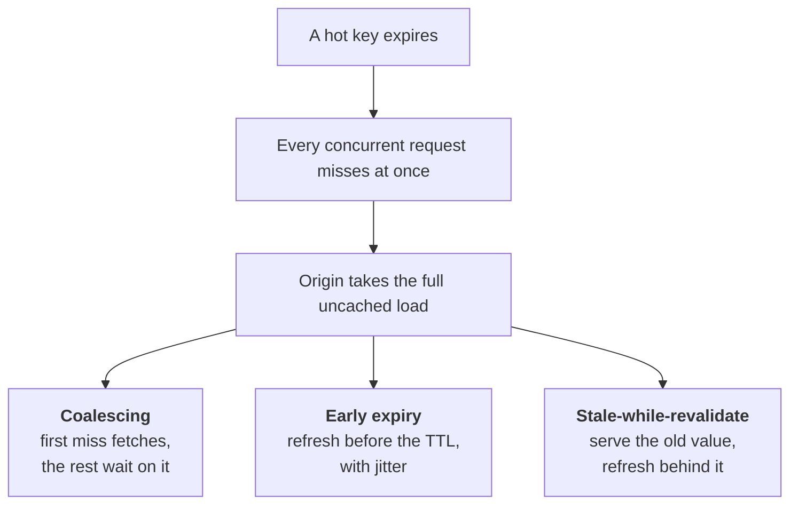

# Caching at scale

The theory under your 13s→200ms story. This is the chapter most likely to be
probed hard, because your resume claims a Redis caching redesign and every
follow-up lives here.

---

## Foundations

Caching is a trade: you get speed, and you give up freshness. Every problem in
this chapter comes from that one trade.

### Where caches live

```
browser → CDN → API gateway → application (in-process) → Redis → database
   │        │                        │                      │
 private  shared,                local, fastest,       shared, survives
          edge                  N copies to invalidate  restarts, one hop
```

**In-process caches are the invisible ones.** They're the fastest — no network
— but every instance has its own copy, so invalidation must reach all of them,
and they don't clear on deploy boundaries in the way people assume. When
someone says "revocation takes 30 seconds", per-instance caches are usually the
reason it's actually longer.

### Cache strategies

| Pattern | Reads | Writes | Note |
| --- | --- | --- | --- |
| **Cache-aside** | App checks cache, misses → DB → populate | App writes DB, invalidates cache | Most common; app owns the logic |
| **Read-through** | Cache fetches on miss | — | Cache library owns it |
| **Write-through** | — | Write cache and DB together | Consistent, slower writes |
| **Write-behind** | — | Write cache, flush to DB async | Fast, **can lose data** |

**Cache-aside is the default.** Note the write path: **invalidate, don't
update**. Updating the cache on write creates a race — two concurrent writers
can leave the cache holding the older value permanently. Deleting is safe; the
next read repopulates.

---

## The failure modes

### Cache stampede (thundering herd)


*Knowing all three is the senior answer — and knowing that the third one must be bounded for authorization data, because stale there means a revoked permission still works.*

A hot key expires. Every concurrent request misses simultaneously and hits the
origin at once — which was never sized for uncached load.

Three mitigations, and knowing all three is the senior answer:

1. **Request coalescing / single-flight** — the first miss fetches; concurrent
   misses for the same key wait on that one result. Directly caps origin load
   at one request per key.
2. **Probabilistic early expiry** — refresh slightly *before* the TTL, with
   jitter, so the refresh happens while the old value is still servable and
   keys don't expire in lockstep.
3. **Stale-while-revalidate** — serve the expired value and refresh in the
   background. Excellent for availability; **must be bounded for authorization
   data**, because serving stale means serving a possibly-revoked permission.

**TTL jitter matters generally.** If a thousand keys are populated in the same
second with the same TTL, they expire in the same second. Randomise TTLs by
±10% and the load spreads.

### Hot keys

One key taking disproportionate traffic saturates a single Redis shard while
the rest idle. No TTL strategy helps — the problem is distribution, not expiry.

Fixes: replicate the hot key across shards with a suffix and read a random one;
put a small in-process cache in front of just that key; or, if it's a hot
*tenant*, treat it as the sharding problem it is (see
[replication partitioning](03-replication-partitioning.md)).

### Cache penetration and avalanche

**Penetration** — requests for keys that don't exist bypass the cache every
time and always hit the DB. If attacker-controlled, it's a denial of service.
Fix: cache the negative result with a short TTL, or use a Bloom filter to
reject known-absent keys cheaply.

**Avalanche** — many keys expire at once, or the cache tier restarts empty and
the origin takes full production load cold. Fix: TTL jitter, and warm the cache
before taking traffic.

---

## Invalidation — the hard part

> There are only two hard things in computer science: cache invalidation and
> naming things.

For authorization data this stops being a correctness nicety and becomes a
security requirement: **a cached "allow" for a revoked permission is a
vulnerability, not a stale read.**

| Strategy | Speed | Risk |
| --- | --- | --- |
| **TTL only** | Bounded by TTL | You've *decided* revocation takes up to N seconds |
| **Explicit invalidation** | Immediate | Must know every affected key — inheritance makes fan-out easy to get wrong; a missed key is a silent hole |
| **Versioned keys** | Immediate | Include a per-user/tenant version in the key; bump it and every derived entry becomes unreachable at once |
| **Cache bypass** | Always fresh | Costs latency; reserve for the most sensitive operations |

**Versioned keys are usually the right answer** and the one worth reaching for
without being asked. There's nothing to enumerate and nothing to miss — old entries
simply become unreachable and expire naturally.

### The three mitigations, written out

**Single-flight** — one fetch serves every concurrent miss:

```js
const inflight = new Map();

async function getOrLoad(key, load) {
  const hit = await redis.get(key);
  if (hit) return JSON.parse(hit);

  if (inflight.has(key)) return inflight.get(key);   // wait on the one in progress

  const p = load()
    .then(async (val) => {
      await redis.set(key, JSON.stringify(val), 'EX', 60 + Math.floor(Math.random() * 12));
      return val;                                    // ↑ jittered TTL
    })
    .finally(() => inflight.delete(key));

  inflight.set(key, p);
  return p;
}
```

Note the **jittered TTL**. A thousand keys written in the same second with an
identical TTL expire in the same second.

**Probabilistic early refresh** — refresh *before* expiry, so it happens while
the old value is still servable:

```js
// XFetch: the closer to expiry and the slower the recompute, the likelier
const shouldRefreshEarly = (ttlLeftMs, computeCostMs, beta = 1.0) =>
  ttlLeftMs - computeCostMs * beta * -Math.log(Math.random()) <= 0;
```

**Versioned keys** — the invalidation strategy that can't miss anything:

```js
const cacheKey = async (tenant, user, perm, resource) => {
  const v = await redis.get(`ver:user:${user}`) ?? '0';
  return `authz:v${v}:${tenant}:${user}:${perm}:${resource}`;
};

// A role change makes every previously-derived key unreachable, atomically.
await redis.incr(`ver:user:${user}`);
```

Nothing to enumerate, nothing to forget. Old entries become unreachable at once
and expire on their own — which is why this is the right answer when a stale
`allow` is a security bug rather than a stale read.

### What to cache

Cache the **decision**, not the inputs. Don't cache the policy document and
re-evaluate per request — cache the boolean outcome keyed on
`(principal, tenant, permission, resource, version)`. Re-evaluating from cached
inputs pays the evaluation cost every time, which for policy engines is most of
the cost.

> **In your own work.** This is [contentstack](../00-experience/contentstack.md)
> §5 in full. The likely questions: what was the original key design, what's
> your hit rate, what happens on a miss storm, and how does a role change
> invalidate. Have the invalidation answer ready — it's the one that separates
> "I added a cache" from "I own a cache".


## Building it

**Libraries**

| Need | Library | Why |
| --- | --- | --- |
| Redis client | `ioredis` | Cluster support, pipelining, and `defineCommand` for the Lua scripts this chapter's mitigations need |
| Request coalescing | `p-memoize` (in-process) or a Redis `SET NX` as a "fetching" lock (cross-instance) | In-process only coalesces within one server; cross-instance coalescing needs the lock in the shared cache |

**Pseudocode — single-flight, cross-instance**

```ts
async function getWithCoalescing(key: string, fetcher: () => Promise<unknown>) {
  const cached = await redis.get(key);
  if (cached) return JSON.parse(cached);

  const gotLock = await redis.set(`lock:${key}`, '1', 'NX', 'PX', 2000);
  if (!gotLock) {                              // someone else is already fetching
    await sleep(50);
    return getWithCoalescing(key, fetcher);    // wait, then re-check the cache
  }
  const value = await fetcher();
  await redis.set(key, JSON.stringify(value), 'PX', ttlWithJitter());
  return value;
}
```

The `NX` lock is what caps origin load to one request per key during a
stampede — everyone else waits on the cache, not on the origin.

---

## Interview Q&A

### Q: Walk me through cache-aside, and where it goes wrong.
**Level:** intermediate · **Tags:** caching, patterns

<details><summary>Model answer</summary>

On read: check the cache; on a hit, return it; on a miss, read the database,
populate the cache, return. On write: write the database, then **invalidate**
the cache entry.

The important detail is that the write path deletes rather than updates.
Updating creates a race: two concurrent writers can interleave such that the
cache ends up holding the older value permanently, and nothing corrects it
until the TTL. Deleting is safe, because the next read repopulates from the
source of truth.

Where it goes wrong beyond that: a **stampede** when a hot key expires and
every concurrent request misses at once; **hot keys** saturating one shard;
**penetration**, where requests for non-existent keys always miss and always
hit the database; and the general problem that the cache and the database can
disagree for a window you've implicitly chosen.

The failure that matters most depends on the data — for content, staleness is
cosmetic; for authorization decisions, a stale allow is a security bug.

</details>

**Follow-ups:**

1. Q: Why invalidate rather than update the cache on write?
   <details><summary>Answer</summary>

   Because updating races and the race has no natural repair.

   Consider two writers. A writes value 1 to the database, B writes value 2,
   then B updates the cache to 2, then A updates the cache to 1. The database
   says 2, the cache says 1, and the cache is wrong until it expires — possibly
   for hours, and nothing detects it.

   Deleting doesn't have that failure: whoever deletes last leaves the cache
   empty, and the next read repopulates from the database, which is
   authoritative. The worst case is an extra miss, not a wrong value.

   There's still a narrower race — a read that misses can be populating with an
   old value at the same moment a writer invalidates — which is what versioned
   keys or a short TTL cover. But delete-on-write removes the common, durable
   inconsistency.

   </details>

2. Q: What's your cache hit rate, and what does a bad one tell you?
   <details><summary>Answer</summary>

   The number matters less than what it implies. Below about 80% on a
   read-heavy path usually means something structural rather than a tuning
   issue.

   The usual causes: **key granularity too fine**, so keys are effectively
   unique per request and nothing is shared — caching per-user-per-resource
   when you could cache per-role gives a huge key space and almost no reuse.
   **TTL too short** relative to how often the data changes. **Eviction
   pressure** — the working set doesn't fit, so entries are evicted before
   reuse, which you'd see as rising evictions rather than expiries. Or the
   access pattern genuinely has no locality, in which case caching is the wrong
   tool.

   The diagnostic I'd reach for is comparing evictions to expirations: high
   evictions means undersized memory, high expirations with low hits means the
   TTL is wrong or there's no reuse.

   And the design insight from your own domain: caching per-role rather than
   per-user is a small key space with high reuse, because many users share a
   role. Getting the granularity right is usually worth more than any amount of
   TTL tuning.

   </details>

### Q: A hot key expires and your database falls over. What happened, and how do you prevent it?
**Level:** senior · **Tags:** stampede, resilience

<details><summary>Model answer</summary>

That's a cache stampede, or thundering herd. A single popular key expires, and
every concurrent request for it misses at the same instant. They all hit the
origin simultaneously, so the database briefly receives its full uncached load —
which it was never provisioned for, since the cache normally absorbs it.

It's particularly nasty because it doesn't self-recover: the database is
saturated, so nothing repopulates the cache, so every subsequent request also
misses, and the retry load keeps it down even after the original spike passes.

Three defences, and I'd use more than one. **Request coalescing** — the first
miss fetches while concurrent misses for the same key wait on that single
result, which caps origin load at one request per key regardless of concurrency.
**Probabilistic early refresh** — refresh shortly before expiry with jitter, so
the refresh happens while the old value is still servable and keys don't expire
in lockstep. **Stale-while-revalidate** — serve the expired value and refresh in
the background.

The caveat I'd add: for authorization data, stale-while-revalidate must be
tightly bounded, because serving stale there means serving a permission that
may have been revoked.

And more generally, TTL jitter — a thousand keys written in the same second
with identical TTLs will expire in the same second.

</details>

**Follow-ups:**

1. Q: How do you invalidate a cached authorization decision when a role changes?
   <details><summary>Answer</summary>

   The hardest correctness problem in caching, and worth naming as a security
   issue rather than a freshness one: a cached allow for a revoked user is a
   vulnerability.

   **TTL only** is simplest — bounded staleness, no invalidation code. But
   you've decided a revoked admin keeps admin for up to the TTL, so that has to
   be a deliberate choice with a number attached.

   **Explicit invalidation** on role change is precise but requires knowing
   every affected key. With permission inheritance the fan-out is large and
   easy to get wrong, and a missed key is silent.

   **Versioned keys** are what I'd choose: include a per-user or per-tenant
   version counter in the cache key. A role change bumps the counter, so
   everything derived from the old version becomes unreachable at once. Nothing
   to enumerate, nothing to miss, and old entries expire on their own.

   Plus **cache bypass** on the highest-sensitivity operations, where the
   latency cost is worth paying.

   In practice: versioned keys, a short TTL as a backstop, bypass on the
   sensitive paths — and then measure end-to-end revocation latency, because
   the real figure is the sum of every layer and it's usually larger than the
   configured TTL suggests.

   </details>

2. Q: How do you handle a hot key that saturates one Redis shard?
   <details><summary>Answer</summary>

   Recognise first that this is a distribution problem, not an expiry problem —
   no TTL strategy helps, because the traffic is concentrated on one key and
   therefore one shard.

   The options: **replicate the key** across shards with a suffix (`key:1`
   through `key:N`) and have readers pick one at random, spreading read load at
   the cost of N invalidations per write. **A small in-process cache in front of
   that key specifically**, which removes the network hop entirely for the
   hottest data — very effective, at the cost of per-instance invalidation.
   **Read replicas** in Redis for that shard.

   And if the hot key is a *tenant*, it's really the hot-partition problem, and
   the answer is isolation: a dedicated cache or shard for that customer, which
   also contains the blast radius when they spike.

   The detection point worth mentioning: hot keys are invisible in aggregate
   metrics — the cluster looks fine while one shard is at 100%. You need
   per-key or per-shard visibility to see it at all.

   </details>

---

## What a weak answer sounds like

- **"We update the cache when we write."** Races, and the wrong value persists.
- **No stampede answer.** It's the canonical caching outage.
- **Treating a stale authorization decision as a performance issue.** It's a
  security issue.
- **"We just set a TTL"** with no view on what staleness that admits.
- **Ignoring in-process caches** when reasoning about invalidation. They're the
  invisible layer that makes "immediate" not immediate.

---

## Glossary

- **Cache-aside** — app checks cache, populates on miss, invalidates on write.
- **Write-through / write-behind** — write both synchronously / flush async.
- **Stampede / thundering herd** — many simultaneous misses on one expired key.
- **Single-flight / coalescing** — one fetch serves all concurrent misses.
- **Stale-while-revalidate** — serve expired data, refresh in background.
- **TTL jitter** — randomised expiry so keys don't expire together.
- **Hot key** — one key taking disproportionate traffic.
- **Penetration** — repeated misses for keys that don't exist.
- **Avalanche** — mass expiry or a cold cache tier taking full load.
- **Versioned key** — a counter in the key; bump to invalidate a whole set.
- **Negative caching** — caching "not found" to stop penetration.
