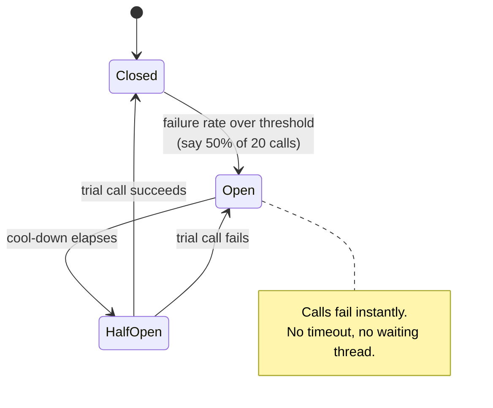
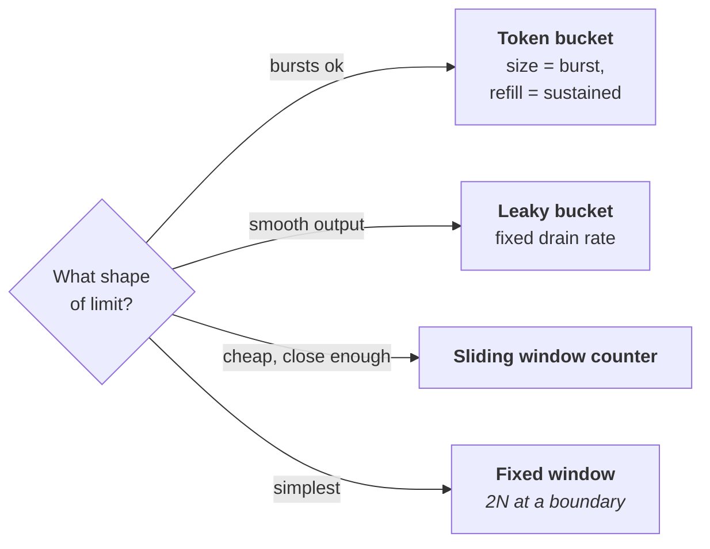

# Resilience, rate limiting and multi-tenancy

How systems survive their dependencies failing, and how a multi-tenant platform
stops one customer consuming everything. Both are core to running an auth
platform.

---

## Resilience patterns

### Timeouts — the foundation

**Every remote call needs a timeout.** A call without one can hang forever,
holding a thread, a connection and memory. Enough of those and the service dies
of resource exhaustion while the dependency is merely slow.

Setting it: base it on the p99 of the downstream call, not the average. Too
short and you fail healthy requests; too long and you hold resources through an
outage.

**Deadline propagation** is the senior refinement: pass the remaining budget
down the chain. If the client's budget is 1s and 800ms is already spent, the
downstream should be told it has 200ms — not given a fresh 1s for work whose
result will be discarded anyway.

### Retries — dangerous without care

Three requirements, all of them:

1. **Only retry idempotent operations**, or ones with an idempotency key.
2. **Exponential backoff with jitter.** Backoff spaces attempts; **jitter is
   the part people omit**, and without it every client retries at the same
   instant, producing a synchronised thundering herd.
3. **A retry budget** — cap retries as a percentage of total traffic (say 10%),
   so retries can never dominate and turn a slowdown into a collapse.

Never retry a 4xx: the request is wrong and will stay wrong.

### Circuit breakers


*The Open state is the whole value: without it every request sits in a 30-second timeout and your service dies of someone else's outage.*

Three states. **Closed** — calls pass through to the dependency, failures
counted. When the failure rate crosses a threshold (say 50% over 20 calls) the
breaker trips to **Open** — every call fails instantly, no timeout, no waiting
thread — which gives the dependency room to recover. After a cool-down it goes
**Half-Open** and lets one trial call through: success closes it, failure sends
it back to Open.

**The Open state is the whole value.** Without a breaker, every request sits in
a 30-second timeout, threads pile up, and your service dies of someone else's
outage.

The purpose is twofold and both matter: it stops you hammering a struggling
dependency, *and* it stops your own threads piling up waiting on it. A breaker
protects the caller as much as the callee.

### Bulkheads

Isolate resources so one failing dependency can't consume everything. Separate
connection pools or thread pools per downstream, so a slow payment provider
can't exhaust the pool that user lookups also need. Named after ship
compartments: one floods, the vessel stays up.

### Load shedding and graceful degradation

When overloaded, **shed load deliberately** rather than degrading for everyone.
Rejecting 10% of requests quickly is better than serving 100% at ten times the
latency — and far better than falling over.

Degrade by priority: serve cached data instead of fresh, disable expensive
features, drop analytics before core function. For auth specifically: read-only
mode is often survivable, but **never degrade to fail-open on authorization**.

---

## Rate limiting

### The algorithms


*Token bucket is the usual default because real traffic is bursty. The fixed-window branch is the classic follow-up: 100 at 11:59:59 and 100 at 12:00:00 is 200 in a second, within limits.*

| Algorithm | Behaviour | Trade |
| --- | --- | --- |
| **Fixed window** | N per clock minute | Simple; **2N possible across a boundary** |
| **Sliding window log** | Timestamps of every request | Exact; memory grows with traffic |
| **Sliding window counter** | Weighted blend of two windows | Good approximation, cheap — usually the right choice |
| **Token bucket** | Tokens refill at a rate; each request takes one | **Allows bursts**, which is usually desirable |
| **Leaky bucket** | Requests drain at a fixed rate | Smooths output, no bursts |

**Token bucket is the common default** because real traffic is bursty and
users expect a short burst to succeed. Bucket size sets burst tolerance, refill
rate sets sustained throughput.

The **fixed-window boundary problem** is the classic interview follow-up: with
a limit of 100/minute, a client can send 100 at 11:59:59 and 100 at 12:00:00 —
200 requests in one second, technically within limits.

### Token bucket, atomically

The read-modify-write must be atomic or concurrent requests leak past the
limit. In Redis that means Lua:

```lua
-- KEYS[1] bucket   ARGV: 1 capacity  2 refill/sec  3 now(ms)  4 cost
local b    = redis.call("HMGET", KEYS[1], "tokens", "ts")
local cap  = tonumber(ARGV[1])
local rate = tonumber(ARGV[2])
local now  = tonumber(ARGV[3])
local cost = tonumber(ARGV[4])

local tokens = tonumber(b[1]) or cap
local ts     = tonumber(b[2]) or now

tokens = math.min(cap, tokens + (now - ts) / 1000 * rate)   -- refill by elapsed time
if tokens < cost then
  redis.call("HMSET", KEYS[1], "tokens", tokens, "ts", now)
  return {0, math.ceil((cost - tokens) / rate)}             -- denied + Retry-After
end
redis.call("HMSET", KEYS[1], "tokens", tokens - cost, "ts", now)
redis.call("PEXPIRE", KEYS[1], 60000)
return {1, 0}
```

```js
const [ok, retryAfter] = await redis.eval(bucketLua, 1,
  `rl:tenant:${tenantId}`, 100, 10, Date.now(), 1);

if (!ok) return res.status(429)
  .set('Retry-After', retryAfter)
  .set('X-RateLimit-Limit', 100)
  .set('X-RateLimit-Remaining', 0)
  .json({ error: 'rate_limited' });
```

**Always send `Retry-After`.** A limiter that doesn't say when to come back
guarantees the client retries immediately.

### Circuit breaker, in a few lines

```js
function breaker(call, { threshold = 0.5, cooldownMs = 30000, min = 20 } = {}) {
  let state = 'closed', fails = 0, total = 0, openedAt = 0;

  return async (...args) => {
    if (state === 'open') {
      if (Date.now() - openedAt < cooldownMs) throw new Error('circuit_open');
      state = 'half-open';                       // let ONE trial through
    }
    try {
      const r = await call(...args);
      if (state === 'half-open') { state = 'closed'; fails = total = 0; }
      total++;
      return r;
    } catch (e) {
      fails++; total++;
      if (state === 'half-open' || (total >= min && fails / total > threshold)) {
        state = 'open'; openedAt = Date.now();
      }
      throw e;
    }
  };
}
```

The `min` sample size matters: without it, the first failed request opens the
circuit at a 100% failure rate.

### Retry with jitter

```js
// Full jitter — the random range is what desynchronises clients
const delay = Math.random() * Math.min(cap, base * 2 ** attempt);
```

Without the randomness every client retries at the same instant, and backoff
produces a synchronised pulse rather than a smooth flow.

### Distributed rate limiting

Counters must be shared across instances, which means a round trip to Redis per
request — real latency on every call.

The options: **centralised** (exact, adds latency and a dependency);
**local with a share of the budget** (fast, imprecise, wastes capacity when
traffic is uneven); or **local with async reconciliation** — enforce locally,
sync counters periodically, accept brief over-admission. Most large systems use
the third, because exactness rarely justifies a synchronous hop.

Always return `429` with `Retry-After` and the standard `X-RateLimit-*`
headers. A rate limiter that doesn't tell clients when to come back guarantees
they'll retry immediately.

---

## Multi-tenancy: the noisy neighbour

One tenant consuming shared capacity degrades everyone. This is the failure
mode of every multi-tenant platform.

Defences, layered:

- **Per-tenant quotas**, not just global ones. A global limit doesn't stop one
  tenant using all of it.
- **Fair queuing** — round-robin across tenants rather than FIFO, so a tenant
  submitting 10,000 jobs doesn't starve everyone behind them.
- **Isolation for the largest tenants** — dedicated shards, caches, or workers.
  At some size a customer stops being a tenant and becomes a deployment.
- **Per-tenant observability** — you cannot diagnose "the platform is slow" in
  a multi-tenant system without slicing by tenant, and this is also what makes
  partial-failure incidents tractable.

> **In your own work.** Auth is the shared dependency for everything, so it's
> exactly where one tenant's spike hurts all of them. Per-tenant rate limiting
> and tenant-scoped telemetry are natural answers when someone probes the 2–3B
> claim. See [contentstack](../00-experience/contentstack.md) §7 for the
> partial-failure debugging story.


## Building it

**Libraries**

| Need | Library | Why |
| --- | --- | --- |
| Circuit breaker | `opossum` | Implements closed/open/half-open with configurable thresholds — matches the state diagram above exactly |
| Retry with jitter | `p-retry` | Same library as the foundations chapter — one dependency covers both |
| Token bucket | the Lua script below, or `rate-limiter-flexible` | Five lines of Lua beats a dependency for the algorithm alone; reach for the library when you also want distributed multi-window limits out of the box |

**Why the token bucket has to be Lua**

Refill-then-check-then-decrement is three operations. Two concurrent
requests can both read "9 tokens left" before either writes back "8" —
each thinks it won. Wrapping refill + check + decrement in one Lua script
makes Redis run all three as a single atomic step, so the second request
sees the first one's decrement before it reads.

**Pseudocode — the breaker**

```ts
import CircuitBreaker from 'opossum';

const breaker = new CircuitBreaker(callPaymentProvider, {
  errorThresholdPercentage: 50,   // matches "50% over 20 calls" above
  resetTimeout: 30_000,           // the cool-down before half-open
});
breaker.fallback(() => queueForLater());
```

---

## Interview Q&A

### Q: A downstream dependency is slow. What breaks first in your service?
**Level:** intermediate · **Tags:** resilience, timeouts

<details><summary>Model answer</summary>

Resources, before anything visible fails.

Each in-flight request holds a thread or connection while waiting. If the
downstream slows from 50ms to 5s, each request occupies its resources 100×
longer, so at the same request rate you need 100× the concurrency. You run out
— thread pool exhausted, connection pool exhausted, memory climbing with queued
requests.

The failure then spreads: *your* service becomes slow to *its* callers, even
for endpoints that don't touch that dependency at all, because they're
competing for the same exhausted pool. A slow dependency you use for 5% of
traffic takes down 100% of it.

The defences map onto that chain. **Timeouts** bound how long a resource is
held. **Bulkheads** — separate pools per dependency — stop one slow dependency
starving unrelated work. **Circuit breakers** stop calling it entirely so
threads aren't piling up there. **Load shedding** rejects work you can't
service rather than queueing it.

The main point: a timeout isn't primarily about the user's experience,
it's about bounding resource consumption.

</details>

**Follow-ups:**

1. Q: How do you choose a timeout value?
   <details><summary>Answer</summary>

   From the downstream's observed latency distribution, not from a round
   number. The p99 plus headroom is a reasonable starting point — that fails
   the genuinely stuck requests without failing the merely slow ones.

   Then two refinements. **Deadline propagation**: rather than each hop having
   an independent timeout, pass the remaining budget down the chain. Otherwise
   a three-hop call with 1s timeouts each can take 3s, and the client gave up
   after 1s — so two of those hops did work nobody will read.

   And **the timeout budget must decrease as you go deeper**. If your caller
   gives you 1s, you can't give a downstream 1s and still have time to do
   anything with the result.

   The failure mode of too-long timeouts is resource exhaustion; of too-short,
   failing healthy requests and amplifying load through retries. Both are bad,
   which is why it's measured rather than guessed.

   </details>

2. Q: Why does jitter matter in retry backoff?
   <details><summary>Answer</summary>

   Because without it, backoff synchronises clients instead of spreading them.

   Picture a service that fails briefly. A thousand clients all fail at
   roughly the same moment, all wait exactly 1s, and all retry at the same
   instant — a thousand simultaneous requests hitting a service that's still
   recovering. It fails again, they all wait 2s, and retry together again. The
   backoff has produced a synchronised pulse rather than a smooth flow, and the
   service never gets a quiet moment to recover.

   Jitter randomises each client's delay, so the retries spread across the
   window and arrive as a manageable trickle. Full jitter — a random value
   between zero and the computed backoff — is the usual recommendation.

   It's a small detail that's the difference between a service recovering in
   seconds and staying down. Knowing it signals operational experience rather
   than book knowledge.

   </details>

### Q: Design rate limiting for a multi-tenant API.
**Level:** senior · **Tags:** rate-limiting, multi-tenancy, design

<details><summary>Answer</summary>

I'd start with what we're protecting against, because it shapes the design:
protecting the platform from overload, enforcing plan quotas commercially, and
stopping one tenant degrading others. Those want different limits at different
layers.

**Algorithm: token bucket.** Real traffic is bursty and users expect a short
burst to succeed, so bucket size gives burst tolerance and refill rate gives
sustained throughput. A sliding-window counter is the alternative where strict
per-interval fairness matters more than burst friendliness.

**Dimensions**, layered: per tenant (the commercial quota), per user or API key
within a tenant so one script doesn't consume their whole allowance, per
endpoint since an expensive report shouldn't share a budget with a cheap read,
and a global limit as the last-resort protection for the platform.

**Distribution** is the interesting part. Counters shared in Redis are exact but
add a round trip to every request. Purely local limits are fast but let N
instances collectively admit N× the limit. I'd use local enforcement with
periodic reconciliation — each instance holds a share of the budget and syncs
asynchronously — accepting slight over-admission for a large latency win. If a
limit is contractual and must be exact, that specific one goes to Redis.

**Behaviour matters as much as the algorithm.** Return `429` with `Retry-After`
and `X-RateLimit-*` headers, so clients back off properly instead of retrying
immediately. And prefer *throttling* to hard rejection where the workload
allows — queueing a request briefly is friendlier than failing it.

The multi-tenancy point I'd close on: per-tenant limits are what stop the noisy
neighbour problem, and a global limit alone doesn't, because one tenant can
consume all of it.

</details>

**Follow-ups:**

1. Q: What's the fixed window boundary problem?
   <details><summary>Answer</summary>

   With a fixed window — 100 requests per clock minute — a client can send 100
   at 11:59:59 and another 100 at 12:00:00. That's 200 requests in a one-second
   span, while never exceeding the stated limit in either window.

   So the effective burst is twice the intended limit, and if you sized
   downstream capacity for the limit, you're under-provisioned by 2× at exactly
   the wrong moment.

   The fixes: a **sliding window log** keeps a timestamp per request and is
   exact, but memory grows with traffic. A **sliding window counter** weights
   the previous window's count by how much of it remains in view — an
   approximation that's cheap and close enough, and it's the usual production
   choice. Or **token bucket**, which doesn't have windows at all: tokens refill
   continuously, so there's no boundary to exploit.

   </details>

2. Q: One tenant is generating 10× normal traffic and everyone is slow. What do you do?
   <details><summary>Answer</summary>

   Immediate mitigation first: apply or tighten a per-tenant limit on that
   tenant specifically. That requires the ability to change a limit for one
   tenant at runtime, as configuration rather than a deploy — worth having
   built before you need it.

   Then work out which it is, because the response differs. A legitimate spike
   — they launched something — means the answer is capacity and a conversation,
   not a block. A runaway integration, a retry loop on their side, or abuse all
   warrant throttling and contact.

   Structurally, the lesson is that a shared pool without per-tenant limits
   always has this failure mode. The fixes are per-tenant quotas as a default
   rather than a reaction; fair queuing so one tenant's backlog doesn't starve
   others; and isolating the largest tenants onto dedicated capacity, which
   also contains the blast radius.

   The prerequisite for all of it is **per-tenant observability**. Without
   telemetry sliced by tenant, "the platform is slow" is undiagnosable, and
   you'll spend the first hour of the incident working out who's responsible.

   </details>

---

## What a weak answer sounds like

- **"We retry failed requests."** Without idempotency, backoff, jitter and a
  budget, that's a recipe for a retry storm.
- **A remote call with no timeout.** Guaranteed resource exhaustion eventually.
- **Not knowing what a circuit breaker protects.** It protects the caller too,
  not just the failing dependency.
- **Global rate limits only** in a multi-tenant system. One tenant can consume
  all of it.
- **Degrading to fail-open on authorization.** Availability doesn't outrank
  access control.

---

## Glossary

- **Timeout** — bounds how long a resource is held, not just user latency.
- **Deadline propagation** — passing remaining budget down the call chain.
- **Backoff with jitter** — spacing retries and desynchronising clients.
- **Retry budget** — retries capped as a share of total traffic.
- **Circuit breaker** — closed / open / half-open; fail fast while a dependency
  recovers.
- **Bulkhead** — isolated resource pools per dependency.
- **Load shedding** — deliberately rejecting work to stay alive.
- **Token bucket** — tokens refill at a rate; permits bursts.
- **Fixed window boundary** — 2× the limit across a window edge.
- **Noisy neighbour** — one tenant degrading others in shared capacity.
- **Fair queuing** — round-robin across tenants instead of FIFO.
