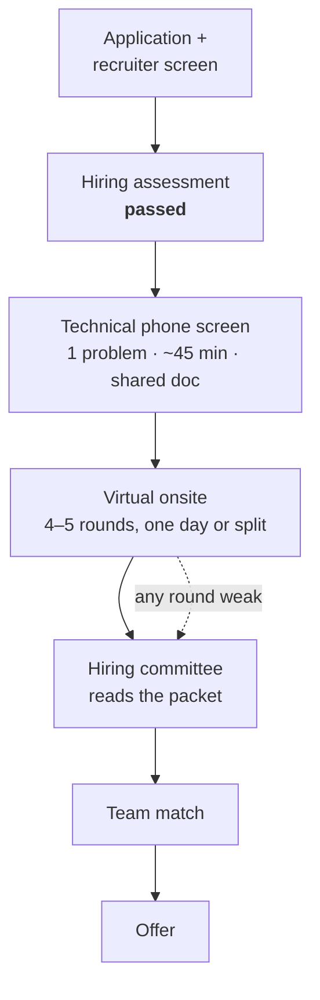

# The loop, stage by stage

You have passed Google's hiring assessment. What follows is a structured,
team-independent sequence that Google runs the same way for every Senior
Software Engineer candidate, and knowing its shape removes most of the
uncertainty that makes people under-perform in it.

Everything here comes from Google's public careers pages ("How we hire" and
"Interview prep" under google.com/about/careers) and from widely reported
candidate accounts. Where a detail is only reported by third-party guides
rather than by Google, it says so. **Confirm the specifics for your loop with
your recruiter** — they will tell you the round count and format when the
onsite is scheduled, and they are the only authoritative source for it.

---

## The stages

*Every round produces written feedback that the committee reads independently — no single interviewer decides, and no interviewer knows how the others went.*

| Stage | What happens | Who decides | Typical wait |
| --- | --- | --- | --- |
| **Recruiter screen** | Resume, role fit, location, right to work, level expectation | Recruiter | — |
| **Hiring assessment** | Work-style / behavioural questionnaire | Automated + recruiter | Done |
| **Technical phone screen** | One medium–hard coding problem in a shared Google Doc, ~45 min, with an engineer. Sometimes two screens for senior roles | The interviewer's written feedback, reviewed by the recruiter | 1–2 weeks to schedule, ~1 week for the result |
| **Virtual onsite** | 4–5 back-to-back or split rounds: coding ×2, system design ×1, Googleyness & Leadership ×1, and for a security team a role-related conversation is likely (see below) | Each interviewer writes feedback and a score independently | 1–3 weeks to schedule |
| **Hiring committee** | A panel that did not interview you reads all feedback, your resume and the recruiter's notes, and decides hire / no-hire and level | The committee | 1–2 weeks, longer if they ask for more data |
| **Team match** | Conversations with hiring managers whose teams have headcount. For a posting tied to a named team this may be short or already settled | You and the manager | Days to weeks |
| **Offer** | Comp, level, start date | Compensation committee + recruiter | ~1 week |

End to end, third-party guides commonly report 8–12 weeks from first contact
to offer. Yours is already partly done.

### The technical phone screen

- **Format:** a video call with an engineer, a shared Google Doc, one problem.
  No IDE, no autocomplete, no running the code. You are expected to narrate,
  write working code, walk through it with your own test cases, and give time
  and space complexity without being asked.
- **What it screens for:** can you get to a correct, efficient solution in 45
  minutes while communicating. It is a pass/fail gate to the onsite, not a
  level decision.
- **Difficulty:** medium to hard by the usual scale. Expect one follow-up
  variant if you finish early.

The whole shape of the round, minute by minute, is in
[the coding round, the way Google runs it](03-coding-round-how-google-runs-it.md).

### The virtual onsite

Google's public guidance describes the onsite as several interviews in one
day, each with a different Googler, covering coding, design and behavioural
questions. For a Senior SWE the commonly reported composition is:

| Round | Count | Grades mostly | Chapters |
| --- | --- | --- | --- |
| Coding | 2 | General Cognitive Ability, Role-Related Knowledge | [03](03-coding-round-how-google-runs-it.md) – [19](19-the-drill-plan.md) |
| System design | 1 | Role-Related Knowledge, General Cognitive Ability | [31](31-design-round-start-here.md) – [40](40-design-security-systems.md) |
| Googleyness & Leadership | 1 | Googleyness, Leadership | [42](42-googleyness-and-leadership.md) |
| Role-related (security) | 0–1 | Role-Related Knowledge | [41](41-security-domain-knowledge.md) |

System design is expected from the "Mid"/L5 level upward — the posting you
applied to is marked *Mid*, and both roles ask for design and architecture
experience, so plan on a design round.

Whether a security-team loop includes a dedicated role-related conversation is
**reported by third-party guides, not documented by Google; confirm with your
recruiter.** In practice, security knowledge also surfaces inside the design
round ("how would you secure this?") and inside coding follow-ups, so the
material in chapter 41 pays off either way.

**The AI-assisted pilot.** In May 2026 Google publicly announced a pilot, for
some junior and mid-level SWE roles on select US teams, that replaces one
traditional coding round with an open-ended "code comprehension" round in
which the candidate uses Gemini to read, debug and optimise an existing
codebase, and is assessed on how well they direct and validate the tool. It
**may not apply** to a Singapore senior loop. Ask the recruiter directly; if
it does apply, the preparation is different (reading unfamiliar code fast,
verifying model output, explaining what you would not trust) and
[AI across the SDLC](../07-ai-tooling/02-ai-across-the-sdlc.md) is where your
own experience with that lives.

### The hiring committee

Google's public pages describe an independent committee that reviews every
candidate's full packet — interview feedback, resume, recruiter notes — so that
no one interviewer's opinion decides. Third-party accounts add that the
committee is looking for a consistently strong packet rather than one
brilliant round, that a single clearly weak round often results in "no hire"
or a request for an additional interview, and that the committee also
confirms the level.

What this means for you: **there is no round you can afford to write off.**
A candidate who is excellent in design and mediocre in one coding round is in
a worse position than one who is solid in all five.

### Team match

For a posting attached to a specific team, the hiring manager may already be
involved and team match is short. Where it is open, you talk to one or more
managers about their team's work and they decide whether to extend. This is
where the two postings' specifics matter — see
[the two roles, decoded](02-the-two-roles.md) for the talking points.

---

## The four attributes

Google's public interview guidance says interviewers assess four things. Every
round is written up against them, and the committee reads them, so they are
the vocabulary to prepare in.

| Attribute | What it means | What it looks like at L4 | What it looks like at L5 |
| --- | --- | --- | --- |
| **General Cognitive Ability** | How you think: breaking down unfamiliar problems, reasoning about trade-offs, learning on the fly | Reaches a correct solution with hints; can explain it | Reaches it without hints, names the trade-offs unprompted, handles the twist, and recognises when the problem changed shape |
| **Role-Related Knowledge** | The experience and depth this specific role needs | Knows the technologies on the resume | Knows why they were chosen, what broke, and what they would do differently; can go two levels deeper than the resume on anything it claims |
| **Leadership** | "Emergent" leadership: stepping up when your skills are needed, without a title | Contributes; takes tasks to completion | Drives outcomes across people they don't manage, mentors, sets direction under ambiguity, and steps back when someone else should lead |
| **Googleyness** | Comfort with ambiguity, humility, collaboration, valuing user and colleague feedback, doing the right thing | Works well with the team | Makes the team better; disagrees productively; owns mistakes; puts the user and the mission ahead of being right |

The L5 column is the bar for the roles you applied to. Notice that it is
mostly about **unprompted** behaviour: naming the complexity before being
asked, raising the failure mode before the interviewer does, saying what you
would do differently before the follow-up. Practise that, not just the
answers.

---

## Mechanics that catch people out

- **A shared doc, not an editor.** Indentation drifts, there is no syntax
  highlighting, and typos are yours to find. Practise in a plain document
  before the screen, not just in an IDE.
- **The interviewer drives the follow-ups.** They have a rubric and a list of
  extensions. Finishing the base problem is expected; the follow-ups are where
  the level is decided.
- **Feedback is written per round, immediately.** The interviewer records
  what you did and did not do. Anything you did in your head but did not say
  is not in the packet.
- **No round knows the others.** Do not reference "as I said in the last
  interview". Start each one clean; retell the story if it is the right story.
- **Hints are part of the format.** Taking a hint well and running with it is
  fine. Ignoring it, or needing three, is not.
- **Time is yours to manage.** Interviewers will let you spend fifteen minutes
  on clarifying questions. That is a choice you made, and it goes in the
  write-up.

---

## What to ask the recruiter now

Before the onsite is scheduled, get these answered in writing. They are all
normal questions and recruiters expect them.

- [ ] How many rounds, on how many days, and in what order?
- [ ] Which rounds are coding, design, behavioural — and is there a
      role-related / domain round for this team?
- [ ] Does the AI-assisted code-comprehension pilot apply to this loop?
- [ ] Coding environment: shared Google Doc, or a coding pad? Any language
      restriction? (The postings prefer Go or Python; confirm that JavaScript
      is acceptable — it normally is.)
- [ ] Which team and which of the two roles is this loop for, or is it a
      shared loop feeding both?
- [ ] Level being targeted, and whether the loop could result in a different
      level.
- [ ] Timeline to hiring committee and team match after the onsite.
- [ ] Anything they can share about the interviewers' areas, so you can pitch
      examples appropriately.
- [ ] Confirmation of the right-to-work position for Singapore (both postings
      say Google is prioritising candidates who do not need sponsorship).

---

## Interview Q&A

### Q: What is the hiring committee actually looking for in your packet?
**Level:** intermediate · **Tags:** google-loop, process, hiring-committee

Model answer

A consistent, evidence-backed case across all four attributes, at the level
being hired for — not one spectacular round.

The committee didn't meet me. They read each interviewer's written feedback,
which records what I did and said against a rubric: did I reach a correct and
efficient solution, how much hinting it took, whether I tested my own code,
what trade-offs I named, how I handled ambiguity, and — in the behavioural
round — concrete examples of leadership and collaboration. They are checking
that the evidence in each round supports "hire", and that the evidence
supports the level.

That changes how I should behave in the rounds. Everything has to be said out
loud, because only what's said reaches the packet. Every round matters
equally, because a single clearly weak round is what most often produces a
no-hire or a request for another interview. And the level is decided on
unprompted depth: naming the complexity, the failure mode, and the alternative
before being asked is what distinguishes senior feedback from mid-level
feedback on the same problem.

**Follow-ups:**

1. Q: If one round goes badly, is the loop over?
   

Answer

   Not necessarily, but I shouldn't rely on that. Third-party accounts say a
   mixed packet can lead the committee to ask for an additional round rather
   than reject outright, especially when the other rounds are strong and the
   weak one has a specific cause. What I can control is not letting one bad
   round leak into the next — each interviewer starts fresh, so I should too.

   

2. Q: What can you do between the onsite and the committee decision?
   

Answer

   Very little that changes the outcome, and I should be careful not to
   over-engineer it. Sending the recruiter a short, factual note if I realised
   I gave a wrong answer to a specific question is reasonable — it shows
   self-correction, which is Googleyness. Anything longer reads as anxiety.
   Then I wait, and prepare for team-match conversations.

   

### Q: How is the loop different for L5 than for L4?
**Level:** senior · **Tags:** google-loop, process, levelling

Model answer

Same rounds, different bar, and the bar is mostly about what I do without
being prompted.

The format is the same: coding, design, Googleyness & Leadership. Two things
change. First, system design becomes a real round rather than a light one,
and it is judged on whether I can drive an ambiguous problem to a defensible
architecture, name the failure modes, and say what I'd change at ten times
the scale. Second, in every round the interviewers are calibrating against
senior behaviour: I should be naming complexity, edge cases and trade-offs
before I'm asked, taking a hint and running with it rather than needing
several, and — in the behavioural round — giving examples where I set
direction, influenced people I didn't manage, and mentored, rather than
examples where I executed well on a task someone else defined.

The postings themselves describe the bar: own the design and delivery of
systems, work with a high degree of autonomy, mentor junior engineers, drive
technical alignment. Those phrases are what the committee is checking the
feedback for.

**Follow-ups:**

1. Q: Can the committee down-level you?
   

Answer

   Yes — third-party accounts consistently report that the committee confirms
   the level as part of the decision, and a packet that shows "hire" but not
   senior-level evidence can result in an offer at a lower level. The defence
   is the same as for everything else: unprompted senior behaviour in every
   round, and behavioural examples that are unambiguously about leading, not
   only contributing.

   

### Q: What is a technical phone screen at Google, and what gets you through it?
**Level:** foundation · **Tags:** google-loop, phone-screen, coding

Model answer

A 45-minute video call with a Google engineer, solving one coding problem in
a shared document, and it's a gate rather than a level decision.

What gets me through it is a correct, efficient solution with clear
narration. Concretely: restate the problem and confirm the constraints; say
the brute force and its complexity; say the better approach and why; write
clean code that would run; walk through it on my own test case including an
edge case; state time and space complexity. Then handle the follow-up if
there's time.

The failure modes are silence, jumping to code without a plan, and code that
doesn't handle the edge cases I never mentioned. Because there's no IDE and
no running the code, the walk-through is where correctness gets established —
so I treat it as part of the solution, not an optional extra.

**Follow-ups:**

1. Q: Does the phone screen decide anything about level?
   

Answer

   Normally not. It decides whether I go to the onsite. The level is decided
   by the committee from the onsite packet. That said, the screen feedback is
   in the packet too, so it's not nothing.

   

### Q: How should you prepare differently if the loop includes the AI-assisted code-comprehension round?
**Level:** intermediate · **Tags:** google-loop, ai-assisted, process

Model answer

First I'd confirm with the recruiter whether it applies — as publicly
announced it's a pilot for some junior and mid-level US roles, so a Singapore
senior loop may not include it.

If it does, the round is not testing whether I can write an algorithm from
scratch; it's testing whether I can direct an AI tool to understand, debug
and improve an unfamiliar codebase, and whether I can tell when its output is
wrong. So the preparation is different: practise reading a mid-sized
unfamiliar repository quickly and building a mental model; practise asking a
model targeted questions and verifying the answers against the code rather
than trusting them; and practise saying out loud what I would not accept from
the tool — a change without a test, a claim about behaviour I haven't
confirmed, a "fix" that widens a security boundary.

That last point is the one I'd lean on, because it's where my own experience
is: I've built the agent documentation and prompt libraries that make AI
output reviewable, and I've held the line on what an AI security review can
and cannot do. The [AI across the SDLC](../07-ai-tooling/02-ai-across-the-sdlc.md)
chapter is the material.

**Follow-ups:**

1. Q: What does "validating AI output" look like in 45 minutes?
   

Answer

   Run it in my head or against a test, not accept it because it looks
   plausible. Concretely: ask the tool for a claim, then find the line in the
   code that proves or disproves it; ask it for a fix, then ask myself what
   test would fail before and pass after; and be explicit when I'm choosing
   not to trust an answer and why. Narrating that is the whole point of the
   round.

   

---

## Glossary

- **Hiring assessment** — the behavioural/work-style questionnaire that precedes technical interviews; you have passed it.
- **Phone screen** — a single-problem coding interview over video with a shared doc; the gate to the onsite.
- **Onsite** — the main loop of 4–5 rounds, run virtually.
- **Hiring committee (HC)** — an independent panel that reads all feedback and decides hire/no-hire and level.
- **Team match** — post-committee conversations with hiring managers to place you on a team.
- **GCA / RRK** — General Cognitive Ability / Role-Related Knowledge, two of the four attributes.
- **Googleyness** — the attribute covering ambiguity, humility, collaboration and doing the right thing.
- **Emergent leadership** — Google's term for leading when your skills are needed, without a title.
