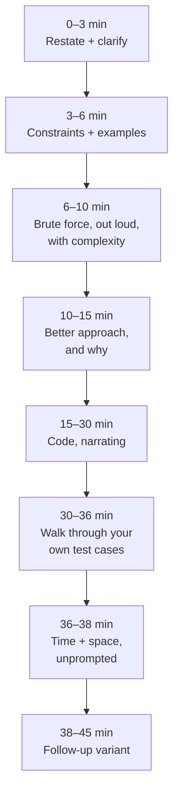

# The coding round, the way Google runs it

Forty-five minutes, one engineer, a shared Google Doc, one problem and its
follow-ups. The chapters after this one teach the patterns; this one teaches
the round — because a candidate who knows every pattern and runs the 45
minutes badly gets the same feedback as one who knows none of them.

Everything the interviewer writes down comes from what you said and typed.
The round is graded on General Cognitive Ability and Role-Related Knowledge
(see [the loop](01-the-loop.md#the-four-attributes)), and at the senior level
the difference between a "hire" and a "strong hire" write-up is almost
entirely what you did *unprompted*.

---

## The 45 minutes


*The interviewer's rubric follows this order. Skipping a step doesn't save time; it removes a line from the write-up.*

| Minute | Step | What you say — the script |
| --- | --- | --- |
| 0–3 | **Restate** | "So I'm given *X* and I need to return *Y*. Let me make sure I have it: for input *[small example]* the answer would be *[answer]* — is that right?" |
| 3–6 | **Constraints** | "A few questions before I plan. How big can *n* be? Can values be negative / duplicated / empty? Is the input sorted? Do I need to handle invalid input, or can I assume it's well-formed? Should I optimise for time or memory?" |
| 6–10 | **Brute force** | "The obvious approach is *[nested loop / try everything]*, which is O(*n*²) time and O(1) space. That's correct but slow for *n* = 10⁵. I'll note it and look for better." |
| 10–15 | **The approach** | "The thing that makes this expensive is *[the inner search / recomputation]*. If I *[hash map / sort / sliding window / prefix sums]*, that becomes O(1), so the whole thing is O(*n*). The trade-off is O(*n*) extra space. I'll go with that unless you'd prefer the in-place version." |
| 15–30 | **Code** | Narrate *intent*, not syntax: "I'll keep a map from value to index. For each element I check whether the complement is already there…" Name variables meaningfully. Leave a `// TODO edge case` and come back rather than stalling. |
| 30–36 | **Test** | "Let me trace it. Input *[example]*: *i* = 0, map is empty, add… *i* = 1, complement is 3, found at index 0, return [0, 1]. Now an edge case: empty input → the loop doesn't run, return null. Duplicates: *[trace]*." Fix bugs you find, out loud, without apology. |
| 36–38 | **Complexity** | "Time is O(*n*) — one pass, O(1) per step. Space is O(*n*) for the map, worst case when nothing matches." Say it before being asked. |
| 38–45 | **Follow-up** | "If the input didn't fit in memory, I'd…" / "If there were *k* of these instead of two…" See the twists below. |

Two things to notice. **The code is only a third of the round.** And the
steps are cumulative: the constraints you gathered at minute 4 are the edge
cases you test at minute 32.

---

## What the interviewer writes down

Interviewers at Google write structured feedback shortly after the round.
Third-party accounts of the rubric agree on the shape. It is roughly:

- **Problem-solving** — did they reach a correct, efficient approach; how
  much hinting was needed; did they consider alternatives.
- **Coding** — is the code correct, idiomatic, readable; did it handle the
  edge cases; how many bugs, and did they find them themselves.
- **Verification** — did they test their own code without being told to.
- **Communication** — could I follow their reasoning; did they ask good
  clarifying questions; did they take hints well.
- **Complexity** — did they state time and space correctly, unprompted.
- **Follow-up** — how they handled the extension.

Every one of those is a thing you can do on purpose. The mechanical habit
that helps most: **say the name of the step as you enter it.** "Let me
clarify a few things." "Brute force first." "Now let me test this." The
interviewer is listening for those checkpoints and will tick them.

---

## The L5 downgrades

The write-up phrases that turn a senior candidate's round into a mid-level
one. All avoidable.

| What happened | How it reads | The fix |
| --- | --- | --- |
| **Silent coding** for five minutes | "Hard to follow reasoning" | Narrate intent every 20–30 seconds. Silence while thinking is fine if you announce it: "give me thirty seconds to think about the loop invariant." |
| **No tests** until prompted | "Needed prompting to verify" | Testing is step 6 of the script. Do it before they ask, every time. |
| **Wrong Big-O**, or none | "Unclear on complexity" | Say it for the brute force *and* the final. Count nested loops and hidden costs (`includes`, `shift`, string concatenation, sorting inside a loop). |
| **Ignored the hint** | "Did not take direction" | A hint is the interviewer telling you the rubric. Repeat it back, then use it. |
| **Over-asking** — ten clarifying questions | "Struggled to start" | Three or four sharp constraint questions, then state your assumptions and go. "I'll assume ASCII; tell me if that's wrong." |
| **Jumped to code** before an approach | "Trial and error" | The brute-force-then-optimise step is where problem-solving credit is earned. Never skip it, even when you know the answer. |
| **Argued with the follow-up** | "Inflexible" | "Now do it in O(1) space" is not a criticism of your solution. Say "sure — that changes the trade-off, so…" |
| **Gave up on a bug** | "Could not debug own code" | Trace with a concrete input. Bugs are found by tracing, not by staring. |
| **Clever one-liners** | "Hard to verify" | Plain loops that a reviewer can trace beat a `reduce` chain that hides the complexity. |

---

## The twists, and how to answer them

Follow-ups are where the level is decided. The common ones, with the shape
of a senior answer.

**"What if the input doesn't fit in memory?"**
Name the pattern: *external* processing. Stream the input; keep only what
you need — a fixed-size summary (counts, a top-*k* heap, a Bloom filter for
"seen before"), or process in chunks and merge (external sort, map-reduce).
Say what you lose: exact answers become approximate for some problems
(distinct count → HyperLogLog), and anything needing random access needs an
index. Then pick one for *this* problem and say its complexity in terms of
memory, not just time. See [heaps and top-k](11-heaps-and-top-k.md) for the
streaming versions.

**"Now make it concurrent / handle many of these at once."**
Ask what's shared. If nothing — embarrassingly parallel, partition the
input, merge the results. If something is shared — a counter, a cache — name
the race, then the fix at the right granularity: an atomic, a lock per
shard rather than one global lock, or a lock-free structure if you can
justify it. Mention that in Node.js the answer is often "one process per
partition" rather than threads, and say why. See
[Node.js internals](../03-backend/01-nodejs-internals.md).

**"Do it in O(1) extra space."**
The tools: in-place read/write pointers, cyclic sort (index as hash),
reversing in place, using the sign bit of the input as a marker (say that it
mutates the input and ask if that's allowed). See
[arrays](06-arrays-and-two-pointers.md).

**"What if *k* is much smaller / larger than *n*?"**
Complexity as a function of both. A heap of size *k* is O(*n* log *k*);
quickselect is O(*n*) average; sorting is O(*n* log *n*). Say which wins at
each regime.

**"How would you test this properly?"**
Categories, not a list: happy path, empty, single element, all the same,
already sorted / reverse sorted, maximum size, values at the boundaries,
duplicates, and the invalid input you decided not to handle. Then property
tests if it's a pure function: "for any input, output is sorted and is a
permutation of the input."

**"What would you change to ship this?"**
Input validation at the boundary, observability (what would I log or count),
the failure mode (what does the caller see on bad input), and the
performance envelope (where does it fall over). Two sentences, not a
lecture.

---

## JavaScript in a plain document

You are writing in a Google Doc. No autocomplete, no linter, no runtime. The
conventions that keep you correct and fast:

| Do | Don't | Why |
| --- | --- | --- |
| Queue as an array with a head index: `let head = 0; while (head < q.length) { const x = q[head++]; }` | `q.shift()` | `shift` is O(*n*); a BFS with it is O(*n*²) and the interviewer will ask |
| `new Map()` / `new Set()` | Plain object as a map; `array.includes()` for membership | Object keys coerce to strings; `includes` is O(*n*) and turns loops quadratic |
| `Array.from({ length: n }, () => [])` | `new Array(n).fill([])` | `fill([])` shares one array across every slot |
| Hand-rolled `MinHeap` class (25 lines, in [the drill plan](19-the-drill-plan.md#data-structures)) | "I'd import a heap library" | There is no built-in; being unable to write one is a mark against |
| Build strings with an array and `join('')` | `s += c` in a loop | Repeated concatenation copies; fine for small *n*, but say you know |
| Explicit `for` loops with named indices | `reduce` chains, nested ternaries | The reviewer has to trace it in their head |
| `Number.MAX_SAFE_INTEGER`, `-Infinity` | Magic sentinels like `99999` | Sentinels break on real inputs; the interviewer will construct one |
| Integer division with `Math.floor` or `>> 1` for midpoints | `(lo + hi) / 2` | Floating midpoint gives fractional indices |
| Comment the invariant, once: `// a[0..write) holds kept elements` | Comment every line | One invariant comment is what a senior engineer writes |

Formatting in a doc: set a monospace font before you start, indent with two
spaces, and don't fight the auto-capitalisation — turn it off in the doc's
preferences if you can, or say "the doc capitalised that" and move on.

---

## A strong 45 minutes, transcribed

The problem: **merge intervals.** Given a list of `[start, end]` pairs,
return the list with all overlapping intervals merged. The full solution and
its variants are in
[tries, intervals and design structures](17-tries-intervals-and-design-structures.md);
this is what the *round* sounds like.

**0:00 — Restate.**
"So I'm given intervals as pairs, and if any overlap I merge them into one.
For `[[1,3],[2,6],[8,10],[15,18]]` I'd return `[[1,6],[8,10],[15,18]]` —
`[1,3]` and `[2,6]` overlap because 2 ≤ 3. Right?"

**0:45 — Constraints.**
"A few things. Is the input sorted? — *No.* — Are the pairs always
`start ≤ end`? — *Yes.* — Do touching intervals like `[1,3]` and `[3,5]`
count as overlapping? — *Yes, merge them.* — How many intervals, roughly? —
*Up to 10⁵.* — Okay, so an O(*n*²) approach won't do. Can I mutate the
input? — *Prefer not.* — Fine, I'll copy."

**2:30 — Brute force.**
"The naive approach is: for each interval, scan all the others looking for
one that overlaps, merge, and repeat until nothing changes. That's at least
O(*n*²) and messy to get right. I'll skip to the better idea."

**3:30 — Approach.**
"The insight is that if I sort by start, then any interval that overlaps the
current merged one must come next in the sorted order — it can't be
somewhere later without the ones between also overlapping. So: sort by
start, O(*n* log *n*); then one sweep keeping a 'current' interval. For each
next interval, if its start is ≤ current's end, extend current's end to the
max of the two ends; otherwise push current to the result and start a new
one. That's O(*n* log *n*) time for the sort and O(*n*) space for the output.
Sound good?"

**5:00 — Code.** (Narrating: "sort a copy… I'll keep `cur` as the interval
being built… push when there's a gap… don't forget to push the last one.")

```js
function merge(intervals) {
  if (intervals.length === 0) return [];
  const sorted = [...intervals].sort((a, b) => a[0] - b[0]);
  const out = [];
  let [curStart, curEnd] = sorted[0];
  for (let i = 1; i < sorted.length; i++) {
    const [s, e] = sorted[i];
    if (s <= curEnd) {
      curEnd = Math.max(curEnd, e);   // overlap or touch: extend
    } else {
      out.push([curStart, curEnd]);   // gap: emit and start fresh
      curStart = s; curEnd = e;
    }
  }
  out.push([curStart, curEnd]);       // the last one is never pushed in the loop
  return out;
}
```

**16:00 — Test.**
"Let me trace the example. Sorted is the same. `cur` = [1,3]. Next [2,6]:
2 ≤ 3, extend to 6. Next [8,10]: 8 > 6, push [1,6], cur = [8,10]. Next
[15,18]: push [8,10], cur = [15,18]. Loop ends, push [15,18]. Output matches.

Edge cases: empty → return early. One interval → loop doesn't run, push it.
Fully contained `[[1,10],[2,3]]` → 2 ≤ 10, `Math.max(10, 3)` keeps 10 —
that's why it's `max` and not just `e`. Touching `[[1,3],[3,5]]` → 3 ≤ 3,
merges, as you said you wanted. Unsorted input `[[8,10],[1,3]]` — the sort
handles it."

**22:00 — Complexity.**
"O(*n* log *n*) time, dominated by the sort; the sweep is O(*n*). O(*n*)
space for the sorted copy and the output — O(1) extra if I were allowed to
sort in place and the output didn't count."

**23:00 — Follow-up 1.** *"Now the intervals arrive one at a time and I want
to insert each into an already-merged list."*
"That's the insert-interval variant. The list is sorted and
non-overlapping, so: walk past everything that ends before the new one
starts, merge everything that overlaps into the new one, then append the
rest. O(*n*) per insert. If inserts were frequent I'd want a balanced tree
keyed by start to make it O(log *n*) — in JS I'd have to write one, so I'd
mention it and ask if that's the direction you want."

**30:00 — Follow-up 2.** *"How many meeting rooms do I need for these
intervals?"*
"Different question — that's the maximum number of overlapping intervals at
any instant. Sweep line: sort starts and ends separately, walk them,
+1 on a start, −1 on an end, track the max. Or a min-heap of end times. Both
O(*n* log *n*). The heap version generalises to 'which room'." (Codes the
sweep, tests on `[[0,30],[5,10],[15,20]]` → 2.)

**42:00 — Close.**
"Anything you'd like me to change or harden? … Then I have a couple of
questions about the team, if there's time."

What made that strong: constraints established the touching-intervals rule
that was then tested; the `Math.max` line got its own justification; the
follow-ups were named as known variants before being solved; complexity was
stated three times without being asked.

---

## Interview Q&A

### Q: How do you structure a 45-minute coding interview so the interviewer can grade it well?
**Level:** foundation · **Tags:** google-loop, coding-round, process

<details><summary>Model answer</summary>

I run the same eight steps every time and I announce each one, because the
interviewer has a rubric and each step is a line on it.

Restate the problem with a tiny example to confirm I've understood it.
Three or four constraint questions — size, ranges, sorted or not, what I can
assume — then state my assumptions and move on. Brute force out loud with
its complexity, then the better approach and why the bottleneck goes away.
Code while narrating intent. Trace my own test cases, including the edge
cases the constraints surfaced. State time and space before being asked.
Then handle the follow-up.

Roughly a third of the time is code. The rest is what turns "wrote a
correct function" into "reasoned clearly, verified independently, knew the
trade-offs" — which is what the feedback form asks for.

</details>

**Follow-ups:**

1. Q: What if you recognise the problem immediately?
   <details><summary>Answer</summary>

   Still say the brute force and its cost — briefly — before the good
   answer, because problem-solving credit is for the reasoning, not the
   recall. And be slightly suspicious of myself: the version I remember may
   not have the constraint the interviewer just added.

   </details>

2. Q: How much silence is acceptable?
   <details><summary>Answer</summary>

   Thirty seconds, if I've announced it. "Let me think about the loop
   invariant for a moment" is fine. Two minutes of typing with no
   commentary is not, because the interviewer can't tell whether I'm
   confident or lost.

   </details>

### Q: The interviewer gives you a hint you don't think you need. What do you do?
**Level:** intermediate · **Tags:** google-loop, coding-round, communication

<details><summary>Model answer</summary>

Take it, visibly. A hint is the interviewer telling me what the rubric wants
next, and how I respond to it is itself graded.

I'd repeat it back — "so you're suggesting I look at the sorted order" — and
either use it directly or say how it connects to what I was about to do:
"right, that's where I was heading; sorting lets me sweep in one pass."
What I would never do is argue with it or ignore it, because "did not take
direction" is one of the most common negative comments in feedback and it
sinks senior candidates in particular, since leadership is about listening
too.

If I genuinely think the hint leads somewhere worse, I'd say so as a
trade-off, not a rejection: "that works and it's O(*n* log *n*); I think a
hash map gets O(*n*) — shall I show that first?"

</details>

**Follow-ups:**

1. Q: How many hints is too many?
   <details><summary>Answer</summary>

   One is normal. Two and the write-up says "needed some guidance." Three
   is usually a no-hire on that round. The defence is the constraints
   step: most hints are constraints I could have asked for.

   </details>

### Q: You find a bug while tracing your test case. How do you handle it?
**Level:** intermediate · **Tags:** google-loop, coding-round, debugging

<details><summary>Model answer</summary>

Say it, fix it, say why it happened. Finding my own bug is a *positive* line
in the feedback — "verified and corrected independently" — as long as I
don't apologise my way through it.

Concretely: "This returns the wrong thing on the contained-interval case —
I'm overwriting the end instead of taking the max. Fixing." Make the one-line
change, then re-trace that case to prove it, and check whether the same
mistake could exist elsewhere. Then move on.

The thing to avoid is the panicked rewrite. Bugs found by tracing are
almost always one line. Rewriting the function to fix one line loses the
time and the interviewer's confidence.

</details>

**Follow-ups:**

1. Q: What if you can't find the bug?
   <details><summary>Answer</summary>

   Narrow it with a smaller input. Trace a two-element case by hand and
   write the variable values at each step in the doc. If it's still not
   visible, say what I've eliminated and ask the interviewer whether they
   see it — that's a hint I'm choosing to take, and it's better than three
   minutes of silence.

   </details>

### Q: How do you answer "what if this doesn't fit in memory?"
**Level:** senior · **Tags:** google-loop, coding-round, scale

<details><summary>Model answer</summary>

By naming what I'm allowed to keep and what I'm giving up.

The general moves are: stream the input and keep only a bounded summary;
partition and merge; or trade exactness for a sketch. Which one applies
depends on the problem. Top-*k* from a stream is a size-*k* heap — bounded
memory, exact. Distinct count is HyperLogLog — bounded memory, approximate,
and I'd say the error bound. "Seen before" over a huge set is a Bloom filter
— no false negatives, some false positives, and I'd say which side is safe
for this problem. Sorting is external merge sort — chunk, sort each in
memory, *k*-way merge with a heap. Anything that needs random access needs
an index on disk, and I'd say the access pattern that forces that.

Then I'd give the answer for *this* problem and its memory complexity, and
mention the operational side in one sentence: once it's streaming, a crash
mid-way means I need checkpoints or idempotent reprocessing. That last
sentence is the senior signal.

</details>

**Follow-ups:**

1. Q: The interviewer says "assume you have a cluster." What changes?
   <details><summary>Answer</summary>

   Then it's partition-and-merge: shard the input by a key so each worker
   has bounded data, compute locally, merge the partial results. The
   interesting part is the merge — top-*k* merges by taking the union and
   re-selecting; counts merge by addition; medians don't merge cleanly and
   need a different approach. I'd name the skew problem: one hot key makes
   one worker do all the work, and that's [replication and partitioning](24-replication-partitioning.md)
   territory.

   </details>

---

## What a weak answer sounds like

- **"I'd use a library for that."** In a DSA round, that reads as "cannot
  build it."
- **Starting to type at minute one.** No restatement, no constraints — and
  the edge cases are discovered as bugs at minute thirty.
- **"It's probably O(*n*)."** Complexity is counted, not guessed. Say where
  the *n* comes from.
- **"I think that works."** Tracing a concrete input is what makes it work.
- **Silence, then a finished function.** The interviewer has nothing to
  write for the fifteen minutes in between.
- **Arguing with a follow-up.** "But my solution already handles that" —
  when it doesn't.

---

## Glossary

- **Shared doc** — Google's default coding surface for remote rounds: a plain document, no execution.
- **Restate** — repeating the problem in your own words with a small example to confirm understanding.
- **Brute force** — the obvious correct approach, stated for its complexity before optimising.
- **Trace** — walking a concrete input through the code line by line to verify it.
- **Twist / follow-up** — the extension the interviewer adds after the base problem; where the level is decided.
- **Sketch** — a bounded-memory approximate data structure (Bloom filter, HyperLogLog).
- **External processing** — algorithms that work on data larger than memory by streaming or chunking.
