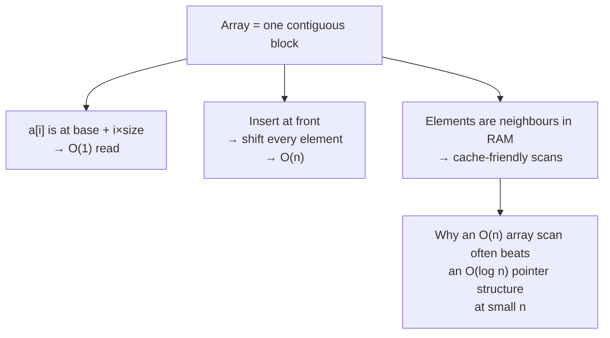

# Arrays — the structure everything else is built on

Most interview problems are array problems, including many that look like
something else. A string is an array of characters, a heap is an array with
index arithmetic, a matrix is an array of arrays, and a graph is usually an
array of adjacency lists. Get arrays genuinely solid and half the field comes
with it.

*In the Google round: array problems arrive as the warm-up that is not a warm-up — two pointers or a prefix sum gets you to O(n), and the follow-up is almost always "now do it in O(1) space" or "now the values can be negative".*

[Chapter 02](05-choosing-the-approach.md) tells you *which* technique applies.
This chapter is the structure itself — what it costs, the moves that work on it,
and the bugs that cost people the round.

---

## The costs

Everything you decide about an array follows from this table. Know it cold.

| Operation | Cost | Why |
| --- | --- | --- |
| Read or write `a[i]` | **O(1)** | The address is `base + i × size`. One multiplication |
| Append (`push`) | **O(1)** amortised | Occasionally doubles capacity and copies, but averaged out it's constant |
| Remove from the end (`pop`) | **O(1)** | Nothing moves |
| Insert or delete at the **front** or middle | **O(n)** | Everything after it shifts |
| Search an unsorted array | **O(n)** | You must look at everything |
| Search a **sorted** array | **O(log n)** | Binary search |
| Sort | **O(n log n)** | Comparison sorting's lower bound |

**The one that catches people out is `shift()`/`unshift()` — they are O(n).**
Using `array.shift()` as a queue in a BFS makes it O(n²) rather than O(n). In a
timed round that's usually accepted, but you should *say* you know, and know
that the right answer is an index pointer or a ring-buffer deque.

**The core trade-off,** and the sentence to have ready: an array gives you O(1)
random access and pays for it with O(n) insertion in the middle. A linked list
inverts exactly that. Everything else about choosing between them is detail.

---

## How it actually works


*Contiguity buys constant-time indexing and fast scanning, and charges for it on every insertion that isn't at the end.*

### Who's who

| Term | What it means here |
| --- | --- |
| **Index** | Position, zero-based. `a[0]` is the first element, `a[n-1]` the last |
| **Length** | `n`. The number of elements, always one more than the last index |
| **Contiguous** | Stored as one unbroken block of memory |
| **Subarray** | A **contiguous** slice. `[2,3]` is a subarray of `[1,2,3,4]` |
| **Subsequence** | Elements in order but **not necessarily adjacent**. `[1,3]` is a subsequence, not a subarray |
| **Subset** | Any selection, order irrelevant |
| **In place** | Modifying the input rather than allocating a new array — O(1) extra space |

**Subarray vs subsequence is a real trap.** Contiguity changes the entire
approach: subarray problems are sliding windows and prefix sums, subsequence
problems are almost always DP. Misreading one for the other sends you down a
technique that cannot work. If the problem doesn't say, ask.

### Why contiguity matters beyond the complexity

Elements sit next to each other in memory, so scanning one pulls its neighbours
into cache. This is why a linear scan of 1,000 array elements often beats a
"better" pointer-chasing structure — the constant factor is enormous. You won't
be graded on it, but it's a good thing to know when someone asks why arrays are
the default.

---

## The techniques, in the order you should learn them

### 1. One pass with a running value

The simplest and most underrated. Track a running max, min, sum or count while
scanning once. Many problems that look like they need sorting or nested loops
are a single pass and one variable.

```js
// Best time to buy and sell stock: one pass, two variables
let minSoFar = Infinity, best = 0;
for (const price of prices) {
  best = Math.max(best, price - minSoFar);  // sell today, having bought at the min
  minSoFar = Math.min(minSoFar, price);     // update AFTER — can't sell before you buy
}
```

The comment on that last line is the entire bug people ship: update the running
minimum *after* computing the profit, or you allow buying and selling on the
same day.

### 2. Hash map to kill the inner loop

If you're writing `for i { for j { ... } }` to find something, a `Map` almost
certainly removes the inner loop. O(n²) → O(n), paying O(n) space.

### 3. Prefix sums

Range questions in O(1) after an O(n) build, and — combined with a map — the
count of subarrays hitting a target. Full treatment in
[chapter 05](05-choosing-the-approach.md#2-prefix-sum--answer-range-questions-in-o1).

### 4. Two pointers

Sorted input, or in-place work with O(1) space. Opposite ends for pairs;
same-direction read/write pointers for filtering in place.

```js
// Move all zeroes to the end, in place, preserving order
let write = 0;
for (let read = 0; read < a.length; read++) {
  if (a[read] !== 0) [a[write++], a[read]] = [a[read], a[write]];
}
```

The read/write pointer pair is the workhorse of in-place array work — removing
duplicates, filtering, partitioning around a pivot all use it.

### 5. Sliding window

Contiguous runs, when the values are non-negative so the metric moves
monotonically as the window grows and shrinks.

### 6. Sort first

O(n log n) that you'll often get back many times over. Sorting makes duplicates
adjacent, makes two pointers legal, and makes intervals sweepable.

### 7. Cyclic sort / index-as-hash

Values in a known range `1..n` and an O(1)-space requirement. The array becomes
its own hash map.

---

## The bugs that actually cost you the round

| Bug | The fix |
| --- | --- |
| **Off-by-one on the last index** | The last element is `a[n-1]`. Loops that must reach it are `i < n`, not `i <= n` |
| **Mutating while iterating** | Deleting from an array you're looping over skips elements. Build a new array, or iterate backwards |
| **`sort()` sorts as strings** | `[10, 9, 1].sort()` gives `[1, 10, 9]`. **Always** pass a comparator: `.sort((a, b) => a - b)` |
| **Empty input** | `a[0]` on `[]` is `undefined`, and `Math.max(...[])` is `-Infinity`. Handle `n === 0` explicitly |
| **Single element** | Two-pointer loops with `l < r` do nothing when `n === 1`. Check whether that's correct for your problem |
| **All duplicates / all negatives** | Kadane's initialised to `0` returns `0` on an all-negative array. Initialise to `a[0]` |
| **Integer overflow** | Rare in JS (doubles to 2⁵³), but say so if asked — in Java or C++ `(l + r) / 2` overflows and `l + (r - l) / 2` doesn't |
| **`shift()` in a hot loop** | O(n) each. Use an index pointer instead of removing from the front |

**The JS `sort()` default is the single most common silent bug in these rounds.**
It stringifies. Say the comparator out loud as you write it.

---

## Practice ladder

In order. Each rung teaches something the next assumes.

| # | Problem | What it teaches |
| --- | --- | --- |
| 1 | Two sum | Hash map removes the inner loop |
| 2 | Best time to buy and sell stock | One pass with a running value |
| 3 | Move zeroes / remove duplicates in place | Read/write two pointers |
| 4 | Pairs with a given sum, sorted input | Opposite-end two pointers |
| 5 | Max sum contiguous subarray (Kadane's) | One-variable DP; the all-negative edge case |
| 6 | Equilibrium index | Prefix sums |
| 7 | Longest subarray with zero sum | Prefix sum **+ hash map** |
| 8 | Subarray sum equals k *(count)* | The same, for counting — seed the map with `{0: 1}` |
| 9 | Product of array except self | Forward + backward passes |
| 10 | Rain water trapped | Forward + backward passes, harder combine |
| 11 | First missing positive | Cyclic sort, O(1) space |
| 12 | Merge intervals | Sort first, then sweep |

**Exit test:** given an unseen array problem, you can say within a minute
whether it wants a hash map, a prefix sum, a sliding window, or two pointers —
*and* say why. Problems 6 through 10 are the ones that make that instinct real;
if they're shaky, redo them rather than pressing on.

---

## Data structures

A DSA round is testing that you reach for the right built-in. For arrays in
JS/TS:

| Need | Use | Note |
| --- | --- | --- |
| The array itself | `Array` / `[]` | `new Array(n).fill(0)` to preallocate. `Array.from({length: n}, (_, i) => i)` when you need indices |
| Seen-before checks | `Set` | O(1) `has`. Prefer over `includes()`, which is O(n) and turns your loop quadratic |
| Counting occurrences | `Map` | `m.set(k, (m.get(k) ?? 0) + 1)`. Use `Map` over a plain object — no prototype keys, and numeric keys stay numeric |
| Prefix sums | `Array` of length `n+1` | The leading `0` is what makes ranges starting at index 0 work without a special case |
| A queue (for BFS) | `Array` + an index pointer | Never `shift()`. `let head = 0; while (head < q.length) { const x = q[head++]; }` |
| A stack | `Array` + `push`/`pop`/`at(-1)` | Both ends are O(1) — this is the one place arrays are perfect |
| Fixed-size numeric work | `Int32Array` etc. | Rarely needed in an interview; mention it only if asked about memory |

**Pseudocode — the in-place read/write filter, since it underlies so much**

```js
// Remove all instances of `val`, in place, returning the new length.
// The pattern: `write` marks where the next kept element goes; `read` scans.
// Everything before `write` is the answer; everything after is garbage.
function removeElement(a, val) {
  let write = 0;
  for (let read = 0; read < a.length; read++) {
    if (a[read] !== val) {
      a[write] = a[read];   // keep it, compacting toward the front
      write++;
    }
  }
  return write;             // a[0..write) is the result; the tail is untouched junk
}
```

This is O(n) time and O(1) space, and the same skeleton solves remove-duplicates
(compare against `a[write-1]` instead), move-zeroes (swap rather than overwrite,
to preserve the zeroes), and partition-around-a-pivot. Learn the skeleton, not
the three problems.

---

## Worked problems

Four from the ladder, solved the way you'd solve them in the round: say the
brute force, name the insight, write it, test it, state the cost.

### Q: Subarray sum equals k — count the contiguous subarrays whose sum is exactly k
**Level:** intermediate · **Tags:** google-coding, prefix-sum, hash-map, arrays

<details><summary>Model answer</summary>

**Problem.** Given an integer array `nums` and an integer `k`, return the number
of contiguous subarrays whose elements sum to `k`. `nums = [1, 2, 1, 2, 1], k = 3`
→ `4` (`[1,2]`, `[2,1]`, `[1,2]`, `[2,1]`).

**Clarify first.** Can values be negative or zero? (Yes — that rules out a
sliding window.) How large is `n`? (Up to 10⁵ — so O(n²) will not pass.) Do we
return the count or the subarrays themselves? (The count.) Proceed assuming
negatives are allowed and only the count is needed.

**Brute force.** For every start index, extend an end index and accumulate the
sum, counting each time it hits `k`. O(n²) time, O(1) space. Correct, and worth
saying so you can move past it.

**The insight.** Let `P[i]` be the sum of the first `i` elements. A subarray
`(j, i]` sums to `P[i] − P[j]`. So while scanning, the number of valid subarrays
ending at `i` is the number of earlier prefix sums equal to `P[i] − k`. A hash
map from prefix-sum value to how many times it has occurred answers that in
O(1), and seeding it with `{0: 1}` handles subarrays that start at index 0.

**Algorithm.**
1. `seen = Map{0 → 1}`, `prefix = 0`, `count = 0`.
2. For each `x` in `nums`: `prefix += x`; `count += seen.get(prefix − k) ?? 0`;
   increment `seen[prefix]`.
3. Return `count`.

```js
function subarraySum(nums, k) {
  const seen = new Map([[0, 1]]);       // prefix 0 occurs once, before any element
  let prefix = 0, count = 0;
  for (const x of nums) {
    prefix += x;
    count += seen.get(prefix - k) ?? 0; // look up BEFORE recording this prefix
    seen.set(prefix, (seen.get(prefix) ?? 0) + 1);
  }
  return count;
}
```

The lookup happens before the insert on purpose: when `k === 0`, inserting
first would let a subarray of length zero count itself.

**Complexity.** O(n) time — one pass with O(1) map operations. O(n) space for
the map in the worst case (all prefix sums distinct).

**Test it.**
- `[1,2,1,2,1], k=3` → 4.
- `[1,-1,0], k=0` → 3 (`[1,-1]`, `[0]`, `[1,-1,0]`). Negatives and the
  lookup-before-insert order both matter here.
- `[3], k=3` → 1 — the seed `{0:1}` is what makes this work.
- `[], k=5` → 0.

**What the interviewer is checking.** That you say "negatives break the sliding
window" unprompted, and that you can explain why the map is seeded with `0 → 1`
rather than reciting it.

</details>

**Follow-ups:**

1. Q: What changes if all numbers are positive?
   <details><summary>Answer</summary>

   Then the running sum is monotonic in the window size, so a two-pointer
   sliding window works in O(1) space: grow the right edge while the sum is
   below `k`, shrink from the left while it is above. The map solution still
   works; the window is just cheaper. Saying which constraint made each
   approach legal is the point of the follow-up.

   </details>

2. Q: Return the *longest* subarray with sum k instead of the count.
   <details><summary>Answer</summary>

   Same prefix-sum idea, but the map now stores the **first** index at which
   each prefix sum occurred, and you never overwrite it. At index `i`, if
   `prefix − k` is in the map, the candidate length is `i − map.get(prefix − k)`.
   Keeping the earliest index maximises that difference.

   ```js
   const first = new Map([[0, -1]]);
   let prefix = 0, best = 0;
   for (let i = 0; i < nums.length; i++) {
     prefix += nums[i];
     if (first.has(prefix - k)) best = Math.max(best, i - first.get(prefix - k));
     if (!first.has(prefix)) first.set(prefix, i);
   }
   ```

   </details>

3. Q: The array does not fit in memory — it arrives as a stream. What survives?
   <details><summary>Answer</summary>

   The algorithm is already one pass and never looks back at the array, so it
   is naturally streaming. The map is the only state, and it grows with the
   number of distinct prefix sums; if that is a concern you would need to bound
   it, which changes the problem (approximate counting, or a bounded window).
   The honest answer is that the count is exact only if the map fits.

   </details>

### Q: Trapping rain water — how much water sits between the bars after it rains
**Level:** senior · **Tags:** google-coding, two-pointers, prefix-max, arrays

<details><summary>Model answer</summary>

**Problem.** `height[i]` is the height of bar `i`, width 1. Return the total
water trapped. `[0,1,0,2,1,0,1,3,2,1,2,1]` → `6`.

**Clarify first.** Are heights non-negative integers? (Yes.) Can `n` be 0 or 1?
(Yes — answer 0.) Is O(n) extra space acceptable, or is O(1) wanted? (Start
with O(n), offer O(1).)

**Brute force.** For each bar, scan left for the tallest bar and right for the
tallest bar; water above bar `i` is `min(maxLeft, maxRight) − height[i]`,
clamped at 0. O(n²) time. The formula is right; the scanning is the waste.

**The insight.** The water level over bar `i` depends only on the tallest bar
to its left and the tallest to its right. Precompute both in two passes and the
per-bar answer is O(1). Then notice you only need whichever side is *smaller*
— so two pointers walking inward, each carrying its own running max, can
decide the water at the shorter side without knowing the far side exactly.

**Algorithm.** (Two-pointer version.)
1. `l = 0`, `r = n − 1`, `maxL = maxR = 0`, `water = 0`.
2. While `l < r`: if `height[l] < height[r]`, the left side is the bottleneck:
   `maxL = max(maxL, height[l])`, `water += maxL − height[l]`, `l++`.
   Otherwise do the mirror on the right.
3. Return `water`.

```js
function trap(height) {
  let l = 0, r = height.length - 1;
  let maxL = 0, maxR = 0, water = 0;
  while (l < r) {
    if (height[l] < height[r]) {
      maxL = Math.max(maxL, height[l]);
      water += maxL - height[l];   // safe: some bar >= maxL exists on the right
      l++;
    } else {
      maxR = Math.max(maxR, height[r]);
      water += maxR - height[r];
      r--;
    }
  }
  return water;
}
```

Why the shorter side is safe to settle: if `height[l] < height[r]`, then the
right side already has a bar at least as tall as `height[r] > height[l]`, so
the water at `l` is bounded by `maxL`, not by anything on the right.

**Complexity.** O(n) time, O(1) space. The two-array version is O(n) space.

**Test it.**
- `[0,1,0,2,1,0,1,3,2,1,2,1]` → 6.
- `[4,2,0,3,2,5]` → 9.
- `[3,2,1]` (monotonic) → 0 — nothing can be trapped.
- `[]` and `[5]` → 0.

**What the interviewer is checking.** That you give the O(n)-space two-pass
version confidently first, and can then *argue* why the two-pointer version is
correct rather than just produce it.

</details>

**Follow-ups:**

1. Q: Extend to a 2-D height map.
   <details><summary>Answer</summary>

   Two pointers do not generalise, but the "water is bounded by the lowest
   boundary" idea does. Push every border cell into a min-heap keyed by
   height. Repeatedly pop the lowest boundary, look at its unvisited
   neighbours: any neighbour lower than the current boundary level traps
   `level − height` water, then push the neighbour with height
   `max(level, height)`. This is a BFS driven by a heap — O(mn log(mn)).

   </details>

2. Q: Why can't a single pass with one running max work?
   <details><summary>Answer</summary>

   Because the water over a bar depends on the future — the tallest bar to its
   right. One left-to-right pass knows `maxL` but not `maxR`, so it cannot
   commit an answer. The two-pointer version gets away with it only because
   at each step it commits the side whose bound is already known to be the
   tighter one.

   </details>

### Q: First missing positive — smallest positive integer absent from the array, in O(n) time and O(1) space
**Level:** senior · **Tags:** google-coding, cyclic-sort, index-as-hash, arrays

<details><summary>Model answer</summary>

**Problem.** `nums = [3, 4, -1, 1]` → `2`. `[1, 2, 0]` → `3`. `[7, 8, 9]` → `1`.

**Clarify first.** May we modify the input? (Yes — O(1) space is only
achievable if so.) Range of values? (Any 32-bit integer.) Duplicates? (Allowed.)

**Brute force.** Put everything in a `Set`, then check 1, 2, 3, … until one is
missing. O(n) time, O(n) space. Or sort and scan — O(n log n), O(1). Both are
fine first answers; the interviewer wants O(n)/O(1).

**The insight.** The answer is always in `1..n+1`: if all of `1..n` are present
the answer is `n+1`, otherwise it is the first gap. So values outside `1..n`
are irrelevant, and the array has exactly enough slots to use index `v − 1` as
the home of value `v`. Swap each value into its home; then the first index `i`
whose occupant is not `i + 1` names the answer.

**Algorithm.**
1. For each `i`, while `nums[i]` is in `1..n` and not already at its home
   `nums[nums[i] − 1]`, swap it there.
2. Scan: the first `i` with `nums[i] !== i + 1` gives `i + 1`.
3. If none, return `n + 1`.

```js
function firstMissingPositive(nums) {
  const n = nums.length;
  for (let i = 0; i < n; i++) {
    while (nums[i] >= 1 && nums[i] <= n && nums[nums[i] - 1] !== nums[i]) {
      const home = nums[i] - 1;
      [nums[i], nums[home]] = [nums[home], nums[i]];   // put nums[i] where it belongs
    }
  }
  for (let i = 0; i < n; i++) if (nums[i] !== i + 1) return i + 1;
  return n + 1;
}
```

The `nums[nums[i] − 1] !== nums[i]` guard is what makes duplicates terminate:
without it two equal values swap with each other forever.

**Complexity.** O(n) time — each swap moves one value to its final home, so
there are at most `n` swaps in total across all iterations. O(1) extra space.

**Test it.**
- `[3,4,-1,1]` → after placing: `[1,-1,3,4]` → index 1 holds −1 → `2`.
- `[1,2,0]` → `3`.
- `[7,8,9]` → nothing placed → `1`.
- `[1,1]` → the duplicate guard stops the loop → `2`.

**What the interviewer is checking.** The amortised argument — why a nested
`while` inside a `for` is still O(n). Say it before being asked.

</details>

**Follow-ups:**

1. Q: What if you may not modify the input?
   <details><summary>Answer</summary>

   Then O(1) extra space is not achievable in general; use the `Set` version
   (O(n) space) or, if the values are bounded and you are allowed a bitset,
   an `n`-bit presence array — still O(n) bits, but a much smaller constant.

   </details>

2. Q: Find *all* missing numbers in `1..n` instead.
   <details><summary>Answer</summary>

   Identical placement pass, then collect every `i + 1` where
   `nums[i] !== i + 1`. Or, if the input must stay readable, mark presence by
   negating `nums[|v| − 1]` for each value `v` in range — the sign is the bit.

   </details>

### Q: Merge intervals — collapse overlapping ranges into disjoint ones
**Level:** intermediate · **Tags:** google-coding, sort-first, sweep, intervals

<details><summary>Model answer</summary>

**Problem.** Given `intervals = [[1,3],[2,6],[8,10],[15,18]]`, return
`[[1,6],[8,10],[15,18]]`.

**Clarify first.** Are the intervals closed — does `[1,4]` overlap `[4,5]`?
(Yes, touching counts as overlap.) Is the input sorted? (No.) Can `start > end`
appear? (No.) Output order? (By start.)

**Brute force.** Repeatedly find any two overlapping intervals and merge them
until none overlap. O(n²) or worse and fiddly. Mention it only to dismiss it.

**The insight.** Sort by start. Once sorted, an interval can only overlap the
*last* merged interval, because everything before that ended earlier. So one
sweep with a single "current" interval does it.

**Algorithm.**
1. Sort by start.
2. `out = [first]`. For each next interval: if its start ≤ end of `out`'s last,
   extend that last's end to `max(end, its end)`; otherwise push it.
3. Return `out`.

```js
function merge(intervals) {
  if (intervals.length === 0) return [];
  intervals.sort((a, b) => a[0] - b[0]);       // comparator, or it sorts as strings
  const out = [intervals[0].slice()];          // copy so we don't mutate the input
  for (let i = 1; i < intervals.length; i++) {
    const [s, e] = intervals[i];
    const last = out[out.length - 1];
    if (s <= last[1]) last[1] = Math.max(last[1], e);  // overlap or touch → extend
    else out.push([s, e]);
  }
  return out;
}
```

`Math.max` on the end is the line people drop: `[1,10],[2,3]` must stay
`[1,10]`, not shrink to `[1,3]`.

**Complexity.** O(n log n) for the sort, then O(n) sweep. O(n) for the output
(O(log n) sort stack aside).

**Test it.**
- `[[1,3],[2,6],[8,10],[15,18]]` → `[[1,6],[8,10],[15,18]]`.
- `[[1,4],[4,5]]` → `[[1,5]]` — touching.
- `[[1,10],[2,3]]` → `[[1,10]]` — the contained case.
- `[]` → `[]`; `[[1,2]]` → `[[1,2]]`.

**What the interviewer is checking.** The comparator on `sort`, the containment
case, and whether you handle "touching" the way you said you would when you
clarified.

</details>

**Follow-ups:**

1. Q: Insert a new interval into an already-merged sorted list.
   <details><summary>Answer</summary>

   Three phases, no sort needed: copy intervals that end before the new one
   starts; merge everything that overlaps the new one into it (`start = min`,
   `end = max`); copy the rest. O(n).

   </details>

2. Q: Given meeting intervals, what is the minimum number of rooms?
   <details><summary>Answer</summary>

   Not a merge — a sweep. Sort starts and ends separately; walk the starts,
   and each time a start comes before the earliest unfinished end, you need a
   new room; when an end passes, release one. The peak concurrency is the
   answer. Equivalent: a min-heap of end times. O(n log n).

   </details>

3. Q: Intervals arrive as a stream and you must answer "total covered length" at any time.
   <details><summary>Answer</summary>

   Keep the merged list in a balanced ordered structure keyed by start (in JS,
   a sorted array with binary search is the pragmatic version). Each insert is
   the "insert interval" follow-up applied to the neighbours, and you maintain
   a running covered length as you merge. Worst case an insert can swallow
   many intervals, but amortised each interval is removed at most once.

   </details>

---


## Interview Q&A

### Q: When would you use an array over a linked list, and why?
**Level:** foundation · **Tags:** dsa, arrays, data-structures

<details><summary>Model answer</summary>

Almost always an array, and the reason is random access plus cache behaviour.

An array is one contiguous block, so `a[i]` is a single address calculation —
O(1). A linked list has to walk from the head, so the same access is O(n). If
the algorithm ever indexes, sorts, or binary searches, an array is the only
sensible choice.

What you pay for that is insertion. Inserting or deleting anywhere but the end
shifts everything after it, so it's O(n), where a linked list does it in O(1)
*once you already hold the node*. That caveat matters — finding the node is
still O(n), so the linked list only wins when you're already there, which in
practice means you're building something like an LRU cache where a hash map
hands you the node directly.

The part people miss is the constant factor. Array elements are neighbours in
memory, so scanning one pulls the next few into cache. A linked list chases
pointers all over the heap. In practice a linear array scan beats a linked list
for most workloads at small and medium n even when the complexity says
otherwise.

So my default is an array, and I'd switch to a linked list for a specific
structural reason: frequent insertion in the middle where I already have the
node, or when I need to splice nodes between structures without copying — which
is exactly the LRU case.

</details>

**Follow-ups:**

1. Q: What's the difference between a subarray, a subsequence and a subset — and why does it matter?
   <details><summary>Answer</summary>

   A subarray is contiguous — a slice. A subsequence keeps the original order
   but can skip elements. A subset is any selection with order irrelevant.

   It matters because it decides the technique entirely. Contiguity is what
   makes a sliding window legal: you can grow the right edge and shrink the
   left, and every candidate is a window. A subsequence has no such structure —
   you're choosing include-or-skip at each element, which is a decision tree,
   which is DP or backtracking.

   So "longest subarray with sum k" is prefix sums, and "longest common
   subsequence" is 2-D DP. Reading one as the other sends you down a technique
   that cannot work no matter how well you implement it.

   If the problem statement is ambiguous I'd ask, because it's the single
   highest-value clarifying question on an array problem.

   </details>

2. Q: Why is `push` O(1) if the array sometimes has to grow?
   <details><summary>Answer</summary>

   It's O(1) *amortised*, which means averaged over a sequence of operations
   rather than guaranteed for each one.

   When the backing store fills, the runtime allocates a bigger one — typically
   double — and copies everything across, which is O(n) for that single push.
   But because capacity doubles, that copy happens increasingly rarely: after n
   pushes you've copied roughly n elements in total across all resizes, so the
   average per push is constant.

   The distinction worth drawing is that amortised O(1) is not the same as
   worst-case O(1). Any individual push can be O(n), which matters for real-time
   systems where you care about the tail rather than the average — there you'd
   preallocate.

   Same reasoning applies to hash map resizing, which is why hash operations are
   quoted as amortised O(1) too.

   </details>

### Q: How do you find a duplicate in an array, and how does the answer change with constraints?
**Level:** intermediate · **Tags:** dsa, arrays, trade-offs

<details><summary>Model answer</summary>

There are four answers and the constraints pick between them — which is really
what the question is testing.

The default is a `Set`: scan once, and the first value already present is the
duplicate. O(n) time, O(n) space. That's what I'd give first.

If I'm told O(1) extra space is required, the Set is out. If I'm allowed to
mutate the input, sorting makes duplicates adjacent, so a single pass finds
them — O(n log n) time, O(1) space, at the cost of destroying the order.

If the values are constrained to the range 1 to n, that's the real signal: the
array can be its own hash map. Value v belongs at index v-1, so I either swap
each value home — cyclic sort — or mark presence by negating the value at its
home index, using the sign bit as free storage. O(n) time, O(1) space, but it
mutates the input, which I'd flag.

And if I can't mutate *and* need O(1) space *and* values are 1 to n with exactly
one duplicate, it's Floyd's cycle detection. Treat each value as a pointer to an
index; a repeated value means two indices point to the same place, so the
sequence forms a cycle and the entry to the cycle is the duplicate. O(n) time,
O(1) space, input untouched.

The point I'd make explicitly is that "find the duplicate" isn't one problem —
the constraints on space, mutability and value range select the algorithm, so
those are the first things I'd ask about.

</details>

**Follow-ups:**

1. Q: Your interviewer says the array can't be modified and you have O(1) space. Now what?
   <details><summary>Answer</summary>

   That combination is the tell for Floyd's cycle detection, assuming the values
   are in the range 1 to n.

   The reframing is the clever part: read `a[i]` not as a number but as a
   pointer to index `a[i]`. Following those pointers gives you a sequence, and
   because every value is a valid index, the sequence can never terminate — so
   it must eventually repeat, forming a cycle. A duplicated value means two
   different indices point at the same place, which is exactly the entry point
   of that cycle.

   So it's the linked-list algorithm: a slow pointer moving one step and a fast
   one moving two until they meet, then reset one to the start and advance both
   one step at a time. Where they meet again is the cycle entrance, which is the
   duplicate. O(n) time, O(1) space, nothing mutated.

   I'd be honest that this is a "know it or don't" problem rather than something
   you derive under time pressure — but recognising that the constraints are
   pointing at cycle detection is the derivable part, and that's what I'd talk
   through.

   </details>

---

## What a weak answer sounds like

- **Nested loops on a large input** without noticing a hash map removes one.
- **`arr.sort()` with no comparator** on numbers. It sorts as strings, and it's
  the most common silent bug in these rounds.
- **`includes()` inside a loop.** That's O(n) inside O(n). Use a `Set`.
- **Confusing subarray with subsequence**, then reaching for a sliding window on
  a problem that needs DP.
- **`shift()` as a queue** with no acknowledgement that it's O(n).
- **No edge cases stated.** Empty, single element, all duplicates, all negative.
  Naming them before you're asked is a strong signal.
- **Kadane's initialised to zero**, which silently returns 0 for an all-negative
  array instead of the largest element.

---

## Glossary

- **Contiguous** — stored as one unbroken block of memory.
- **Subarray** — a contiguous slice.
- **Subsequence** — elements in original order, gaps allowed.
- **Subset** — any selection, order irrelevant.
- **In place** — modifying the input, O(1) extra space.
- **Amortised O(1)** — constant on average over a sequence, though a single operation may be O(n).
- **Prefix sum** — precomputed running totals; range sums become one subtraction.
- **Two pointers** — indices converging from both ends, or a read/write pair.
- **Read/write pointers** — the in-place filtering skeleton: `write` marks where the next kept element goes.
- **Kadane's algorithm** — one-variable DP for maximum contiguous sum.
- **Cyclic sort** — placing values `1..n` at their own indices for O(1) extra space.
- **Cache locality** — neighbouring elements loading together, which is why array scans are fast beyond what complexity suggests.
