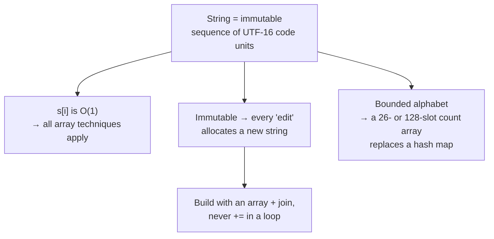

# Strings — arrays with sharp edges

A string is an array of characters, so nearly every array technique transfers.
What makes strings their own chapter is that they are **immutable** in
JavaScript, they have a **bounded alphabet** you can exploit, and they carry a
set of encoding traps that will bite you on exactly the input an interviewer
picks to test you.

*In the Google round: strings are where sliding windows get asked — longest substring with some property, then minimum window with multiplicity — and the follow-up twist is Unicode, streaming input, or "return all of them".*

---

## The costs

| Operation | Cost | Note |
| --- | --- | --- |
| `s[i]` / `s.charCodeAt(i)` | **O(1)** | Index access is cheap |
| `s.length` | **O(1)** | Stored, not counted |
| **Concatenation** `s += c` | **O(n)** | Strings are immutable — this builds a whole new string |
| Building a string in a loop | **O(n²)** if you `+=` | Push into an array and `join('')` at the end: O(n) |
| `s.slice(i, j)` / `substring` | **O(j - i)** | It copies. A "free" slice inside a loop is a hidden O(n²) |
| `s.includes` / `indexOf` | **O(n × m)** worst case | Naive search. KMP is O(n + m) if you're asked |
| Sorting the characters | **O(n log n)** | Or O(n) with counting sort over a fixed alphabet |
| Comparing two strings | **O(n)** | Not O(1) — they compare character by character |

**The two that decide your complexity:** building with `+=` in a loop is O(n²),
and slicing inside a loop is O(n²). Both look innocent. Both are the reason an
otherwise correct solution times out.

```js
// O(n²) — every += allocates a new string and copies everything so far
let out = '';
for (const c of s) out += transform(c);

// O(n) — the standard fix
const parts = [];
for (const c of s) parts.push(transform(c));
const out = parts.join('');
```

---

## How it actually works


*Three properties drive every string technique: indexable like an array, immutable so edits are expensive, and drawn from a small alphabet so counting is cheap.*

### Who's who

| Term | Meaning |
| --- | --- |
| **Substring** | **Contiguous.** `"ell"` in `"hello"` |
| **Subsequence** | In order, gaps allowed. `"hlo"` in `"hello"` |
| **Anagram** | Same characters, any order — so equal character *counts* |
| **Palindrome** | Reads the same both ways |
| **Prefix / suffix** | A run from the start / from the end |
| **Alphabet** | The set of possible characters. Usually 26 lowercase, or 128 ASCII |
| **Code unit** | What JS indexes. **Not** always a whole character — see below |

**Substring vs subsequence is the same trap as subarray vs subsequence**, and it
picks your technique the same way: substrings are sliding windows, subsequences
are DP.

### The bounded alphabet is a free optimisation

If the input is "lowercase English letters", you have 26 possible characters. A
fixed 26-slot array replaces a hash map: no hashing, better cache behaviour, and
comparing two frequency arrays is a fixed 26-step loop rather than a map
traversal.

```js
// Frequency of 'a'..'z' with no Map at all
const count = new Array(26).fill(0);
for (const c of s) count[c.charCodeAt(0) - 97]++;   // 97 is 'a'
```

Say "the problem says lowercase letters, so I'll use a 26-element count array
rather than a map" out loud. It's a small thing that reads as fluency.

---

## The techniques

### 1. Frequency counting

The workhorse. Anagrams, permutations, "can we rearrange into a palindrome",
character-replacement windows — all frequency-count problems.

**Anagram check:** count characters in the first, decrement for the second, and
everything must land at zero. O(n), and better than the sort-both-and-compare
answer at O(n log n) — say both, then pick.

**Palindrome-rearrangeable check:** at most one character may have an odd count.
That one sentence is the whole problem.

### 2. Sliding window with counts

Substring problems with a constraint. Grow the right edge, shrink the left when
invalid, maintain a count map as you go.

```js
// Longest substring with at most k distinct characters
const count = new Map();
let left = 0, best = 0;
for (let right = 0; right < s.length; right++) {
  count.set(s[right], (count.get(s[right]) ?? 0) + 1);
  while (count.size > k) {                      // invalid — shrink from the left
    const c = s[left++];
    const n = count.get(c) - 1;
    if (n === 0) count.delete(c); else count.set(c, n);  // delete, or size lies
  }
  best = Math.max(best, right - left + 1);
}
```

**The `count.delete(c)` is the bug people ship.** Leaving a zero-count entry in
the map means `count.size` keeps counting a character that's no longer in the
window, and the window never shrinks correctly.

### 3. Two pointers from the ends

Palindromes, reversal, comparing from both sides.

```js
// Valid palindrome, ignoring non-alphanumerics and case
let l = 0, r = s.length - 1;
while (l < r) {
  while (l < r && !isAlnum(s[l])) l++;      // skip junk from the left
  while (l < r && !isAlnum(s[r])) r--;      // and the right
  if (s[l].toLowerCase() !== s[r].toLowerCase()) return false;
  l++; r--;
}
return true;
```

The inner `l < r` guards matter: without them a string of pure punctuation walks
the pointers past each other and off the end.

### 4. Expand around centre

For palindromic substrings. Every palindrome has a centre, so try all 2n-1 of
them — n single characters and n-1 gaps between characters — and expand outward
while the ends match.

**The gaps are the part people forget**, and forgetting them silently loses
every even-length palindrome. O(n²) time, O(1) space, and it beats the DP
solution on space while being easier to write.

### 5. Build with an array, join at the end

Any time you're constructing output. Covered above, and it's the difference
between passing and timing out.

### 6. Encode state as a canonical key

Group anagrams by sorted characters, or by a frequency signature. The move is
turning "are these equivalent?" into "do these produce the same key?", which
makes a hash map applicable.

```js
// Group anagrams. The key IS the technique.
const groups = new Map();
for (const word of words) {
  const key = [...word].sort().join('');   // or a 26-slot count, joined
  if (!groups.has(key)) groups.set(key, []);
  groups.get(key).push(word);
}
```

### 7. Trie, for prefix work

Autocomplete, "does any word start with", dictionary matching. Covered under
[data structures](#data-structures) below.

---

## The encoding traps

Interviewers who know JavaScript reach for these deliberately.

| Trap | What happens | The fix |
| --- | --- | --- |
| **`s.length` isn't character count** | JS indexes UTF-16 code units. An emoji or a rare CJK character is a surrogate pair — two "characters" | `[...s]` or `Array.from(s)` iterates real code points |
| **`s.reverse()` doesn't exist** | Strings have no `reverse` | `[...s].reverse().join('')` |
| **Case comparison** | `'A' !== 'a'` | Normalise both sides once, up front |
| **`charCodeAt` vs `codePointAt`** | `charCodeAt` returns half a surrogate pair | `codePointAt` for non-ASCII |
| **Accents** | `"é"` can be one code point or `e` + a combining accent, and they aren't `===` | `s.normalize('NFC')` |
| **Locale sorting** | `'a' < 'B'` is false by code point, true by dictionary order | `localeCompare` if human ordering matters |

You will not usually be asked to *handle* Unicode. You will sometimes be asked
whether you *know*. "This assumes ASCII — with full Unicode I'd iterate code
points with `[...s]`, since `length` counts UTF-16 units" is the answer that
lands.

---

## The bugs

| Bug | Fix |
| --- | --- |
| `+=` in a loop | Array + `join('')` |
| `slice()` inside a loop | Track indices; slice once at the end |
| Zero-count entries left in a window map | `delete` when the count hits zero, or `size` lies |
| Forgetting even-length palindromes | Expand around gaps as well as characters |
| Off-by-one on `right - left + 1` | Window length is inclusive of both ends. Check it on a two-character example |
| Comparing case-sensitively by accident | Normalise once at the top |
| Assuming lowercase-only | Ask about the alphabet. It decides whether a 26-slot array is legal |

---

## Practice ladder

| # | Problem | What it teaches |
| --- | --- | --- |
| 1 | Reverse a string | Two pointers; the array/join idiom |
| 2 | Valid palindrome, ignoring punctuation | Two pointers with skip guards |
| 3 | Valid anagram | Frequency counting; the 26-slot array |
| 4 | First non-repeating character | Two passes with a count map |
| 5 | Group anagrams | Canonical key as a hash key |
| 6 | Longest substring without repeating characters | Sliding window with last-seen indices |
| 7 | Longest substring with at most k distinct | Sliding window with a count map, and the delete-on-zero bug |
| 8 | Longest repeating character replacement | Window validity as "length − most frequent ≤ k" |
| 9 | Longest palindromic substring | Expand around centre, including the gaps |
| 10 | Minimum window substring | The hardest common window: two maps and a satisfied-count |
| 11 | String compression, in place | Read/write pointers on a character array |
| 12 | Implement `strStr` / `indexOf` | Naive O(n×m); mention KMP exists |

**Exit test:** minimum window substring, working, in under 35 minutes. It
combines a count map, a window, and a "how many requirements are currently
satisfied" counter — if that one is solid, the pattern genuinely is.

---

## Data structures

| Need | Use | Note |
| --- | --- | --- |
| Character frequency, known alphabet | `new Array(26).fill(0)` | Index with `c.charCodeAt(0) - 97`. Faster than a `Map` and trivially comparable |
| Character frequency, unknown alphabet | `Map` | Handles any code point; `delete` on zero |
| Seen-before set of characters | `Set` | Or a bitmask integer for 26 letters, if asked to golf space |
| Building output | `Array` + `join('')` | Never `+=` in a loop |
| Working "in place" on a string | `[...s]` to a char array | JS strings are immutable; the array is the mutable stand-in |
| Prefix / dictionary lookup | **Trie** | Nested objects, one level per character |
| Substring search, optimal | KMP failure table | Know it exists; implement only if asked |

**Pseudocode — a trie, since it's the one string structure you must build yourself**

```js
class Trie {
  constructor() { this.root = {}; }

  insert(word) {
    let node = this.root;
    for (const c of word) node = (node[c] ??= {});   // create the level if absent
    node.$ = true;   // sentinel marking end-of-word. '$' can't collide with a
                     // character key, which is why it's a symbol-ish choice
  }

  // The two lookups differ by ONE line, which is the whole point of a trie:
  // walking the prefix is the shared work.
  startsWith(prefix) { return this.#walk(prefix) !== null; }
  has(word) { const n = this.#walk(word); return n !== null && n.$ === true; }

  #walk(s) {
    let node = this.root;
    for (const c of s) {
      if (!node[c]) return null;
      node = node[c];
    }
    return node;
  }
}
```

Insert and lookup are both **O(length of the word)** — independent of how many
words the trie holds, which is the property that makes it worth building.
A hash map matches whole words in O(1) but cannot answer "does anything start
with this" without scanning everything.

---

## Worked problems

### Q: Longest substring without repeating characters — length of the longest run with all-distinct characters
**Level:** intermediate · **Tags:** google-coding, sliding-window, hash-map, strings

<details><summary>Model answer</summary>

**Problem.** `"abcabcbb"` → `3` (`"abc"`). `"bbbbb"` → `1`. `"pwwkew"` → `3`
(`"wke"`, not `"pwke"` — that is a subsequence).

**Clarify first.** Character set — ASCII or full Unicode? (Assume any UTF-16
code unit; a `Map` handles it, a 128-slot array would not.) Return the length
or the substring? (Length.) Empty string? (0.)

**Brute force.** Check every substring for distinctness with a `Set`: O(n³), or
O(n²) if you extend one end and stop at the first repeat. Say it, move on.

**The insight.** A window `[l, r]` with all-distinct characters can be extended
one character at a time. When `s[r]` repeats a character already inside the
window, the window cannot be valid until `l` moves past the *previous
occurrence* of `s[r]`. A map from character to its last index lets `l` jump
there in one step instead of creeping.

**Algorithm.**
1. `last = Map`, `l = 0`, `best = 0`.
2. For `r` over the string: if `last.get(s[r]) >= l`, set `l = last.get(s[r]) + 1`.
   Record `last.set(s[r], r)`. `best = max(best, r − l + 1)`.
3. Return `best`.

```js
function lengthOfLongestSubstring(s) {
  const last = new Map();       // char → most recent index
  let l = 0, best = 0;
  for (let r = 0; r < s.length; r++) {
    const c = s[r];
    if (last.has(c) && last.get(c) >= l) l = last.get(c) + 1;  // jump past the repeat
    last.set(c, r);
    best = Math.max(best, r - l + 1);
  }
  return best;
}
```

The `>= l` check is the subtle line: a character seen *before* the window
started is not a repeat inside it. Without that guard, `l` can move backwards.

**Complexity.** O(n) time — `r` advances once per character, `l` only moves
forward. O(min(n, alphabet)) space.

**Test it.**
- `"abcabcbb"` → 3. `"pwwkew"` → 3.
- `"abba"` → 2 — at the final `a`, `last.get('a') = 0`, which is `< l = 2`, so
  `l` must not jump backwards. This is the case that breaks the naive version.
- `""` → 0; `"a"` → 1.

**What the interviewer is checking.** That the window never shrinks the wrong
way, and that you call out `"abba"` yourself.

</details>

**Follow-ups:**

1. Q: Longest substring with at most k distinct characters.
   <details><summary>Answer</summary>

   Same window, different invariant. Keep a `Map` of counts inside the
   window; while `map.size > k`, decrement `s[l]` and delete it at zero, then
   `l++`. Track the max width. O(n).

   </details>

2. Q: Return the substring itself, and handle the case where several have the same length.
   <details><summary>Answer</summary>

   Record `bestStart` whenever `best` strictly improves, and return
   `s.slice(bestStart, bestStart + best)`. Strict improvement gives the
   leftmost; `>=` would give the rightmost — ask which they want.

   </details>

### Q: Minimum window substring — shortest substring of s containing every character of t, with multiplicity
**Level:** senior · **Tags:** google-coding, sliding-window, frequency-count, strings

<details><summary>Model answer</summary>

**Problem.** `s = "ADOBECODEBANC"`, `t = "ABC"` → `"BANC"`. If no window
exists, return `""`.

**Clarify first.** Does `t` have repeated characters, and must the window
contain them with multiplicity? (Yes — `t = "AA"` needs two `A`s.) Case
sensitive? (Yes.) If several windows tie, which? (Any, or leftmost — say which
you'll return.)

**Brute force.** For each start, extend until the window satisfies `t`, check
with a frequency comparison. O(n² · alphabet). Say it.

**The insight.** Maintain a window and a count of how many *required*
characters are currently satisfied. Expanding the right edge can only help;
once the window is valid, shrink from the left as far as it stays valid,
recording the best. The `need` map plus a single `missing` counter makes the
validity check O(1) instead of comparing two maps.

**Algorithm.**
1. `need = counts(t)`, `missing = t.length`.
2. Expand `r`: if `need.get(s[r]) > 0` then `missing--`; always
   `need.set(s[r], need.get(s[r]) − 1)`.
3. While `missing === 0`: record the window if shorter; then give back `s[l]`:
   `need[s[l]]++`, and if it becomes `> 0`, `missing++`; `l++`.
4. Return the best window, or `""`.

```js
function minWindow(s, t) {
  const need = new Map();
  for (const c of t) need.set(c, (need.get(c) ?? 0) + 1);
  let missing = t.length;
  let l = 0, bestStart = 0, bestLen = Infinity;

  for (let r = 0; r < s.length; r++) {
    const c = s[r];
    if ((need.get(c) ?? 0) > 0) missing--;   // this char was still required
    need.set(c, (need.get(c) ?? 0) - 1);     // may go negative: surplus copies

    while (missing === 0) {                  // window valid → try to shrink
      if (r - l + 1 < bestLen) { bestStart = l; bestLen = r - l + 1; }
      const out = s[l];
      need.set(out, need.get(out) + 1);
      if (need.get(out) > 0) missing++;      // we just removed a required copy
      l++;
    }
  }
  return bestLen === Infinity ? "" : s.slice(bestStart, bestStart + bestLen);
}
```

Letting counts go negative is the trick: a character not in `t` sits at −1,
−2, …, and surplus copies of a needed character also sit below zero. Only a
count crossing zero changes `missing`.

**Complexity.** O(|s| + |t|) time — each index enters and leaves the window
once. O(alphabet) space.

**Test it.**
- `"ADOBECODEBANC", "ABC"` → `"BANC"`.
- `"a", "aa"` → `""` — multiplicity.
- `"aa", "aa"` → `"aa"`.
- `"ab", "b"` → `"b"` — window of length 1 at the end.

**What the interviewer is checking.** Whether you can explain the `missing`
counter without re-deriving it mid-sentence, and whether you handle
multiplicity rather than treating `t` as a set.

</details>

**Follow-ups:**

1. Q: Find all start indices where an anagram of t occurs in s.
   <details><summary>Answer</summary>

   Fixed-size window of `|t|`. Same `need`/`missing` bookkeeping, but the
   window never shrinks below `|t|`: on each step add `s[r]`, and once
   `r − l + 1 > |t|` remove `s[l]`. Whenever `missing === 0` and the window is
   exactly `|t|` wide, record `l`. O(|s|).

   </details>

2. Q: s is a stream you cannot store. Can you still find the shortest window?
   <details><summary>Answer</summary>

   You need at least the current window, which can be as long as the whole
   stream between the first and last required characters. So you can bound
   memory by the answer's length but not by a constant. If an upper bound on
   the window length `W` is given, keep a ring buffer of the last `W`
   characters and the same counters.

   </details>

### Q: Group anagrams — bucket words that are rearrangements of each other
**Level:** intermediate · **Tags:** google-coding, hashing, canonical-key, strings

<details><summary>Model answer</summary>

**Problem.** `["eat","tea","tan","ate","nat","bat"]` →
`[["eat","tea","ate"],["tan","nat"],["bat"]]` (group order irrelevant).

**Clarify first.** Lowercase ASCII only? (Assume yes — it decides the key
strategy.) Empty strings? (Group together.) Output order? (Any.)

**Brute force.** Compare every pair by sorting both: O(n² · k log k) for `n`
words of length `k`. Say it.

**The insight.** Two words are anagrams iff they map to the same *canonical
key*. Sorting the characters is one key (O(k log k) per word); a 26-slot
frequency count joined into a string is another (O(k) per word). Either way a
`Map` from key to bucket does the grouping in one pass.

**Algorithm.**
1. For each word, compute its key.
2. `groups.get(key).push(word)`, creating the bucket on first sight.
3. Return `[...groups.values()]`.

```js
function groupAnagrams(words) {
  const groups = new Map();
  for (const w of words) {
    const counts = new Array(26).fill(0);
    for (const ch of w) counts[ch.charCodeAt(0) - 97]++;
    const key = counts.join('#');           // '#' so "1,11" and "11,1" can't collide
    if (!groups.has(key)) groups.set(key, []);
    groups.get(key).push(w);
  }
  return [...groups.values()];
}
```

The separator matters: `counts.join('')` would make `[1, 11]` and `[11, 1]`
both `"111"`.

**Complexity.** O(n · k) time with the count key (O(n · k log k) with the
sorted key). O(n · k) space for the output.

**Test it.**
- The example → three groups.
- `[""]` → `[[""]]`.
- `["a"]` → `[["a"]]`.
- `["ab","ba","abc"]` → two groups — length differs, keys differ.

**What the interviewer is checking.** That you know two keys, can say which is
cheaper and why, and notice the join-separator collision.

</details>

**Follow-ups:**

1. Q: Unicode input — the 26-slot array no longer works. What now?
   <details><summary>Answer</summary>

   Fall back to the sorted key: `[...w].sort().join('')` — spreading the string
   iterates by code point rather than UTF-16 unit, so surrogate pairs stay
   intact. Or build a `Map` of counts and serialise its entries sorted by
   key. Both are O(k log k) per word.

   </details>

2. Q: Ten billion words, distributed. How do you group?
   <details><summary>Answer</summary>

   The key is the shard key. Map phase: emit `(key, word)`. Shuffle by key so
   all anagrams land on one reducer. Reduce: collect. Skew is the risk — a
   very common key (e.g. every empty string) lands on one node; salt the key
   and merge in a second pass if that happens.

   </details>

### Q: Longest palindromic substring — the longest contiguous palindrome in s
**Level:** intermediate · **Tags:** google-coding, expand-around-centre, strings

<details><summary>Model answer</summary>

**Problem.** `"babad"` → `"bab"` (or `"aba"`). `"cbbd"` → `"bb"`.

**Clarify first.** Case sensitive? (Yes.) Return any longest, or the leftmost?
(Any.) Length 0 or 1 input? (Return it as-is.)

**Brute force.** Every substring, check if palindrome: O(n³). Say it.

**The insight.** A palindrome mirrors around its centre. There are `2n − 1`
centres — `n` single characters and `n − 1` gaps between characters. Expand
outward from each centre while the ends match; the longest expansion wins.
That is O(n) per centre, O(n²) total, no extra memory, and far simpler than
Manacher's, which is O(n) but nobody expects you to write it.

**Algorithm.**
1. For each `i` in `0..n−1`: expand from `(i, i)` and from `(i, i+1)`.
2. `expand(l, r)`: while in bounds and `s[l] === s[r]`, `l--, r++`. The
   palindrome is `s[l+1 .. r−1]`.
3. Track the best `(start, length)`.

```js
function longestPalindrome(s) {
  if (s.length < 2) return s;
  let bestStart = 0, bestLen = 1;

  const expand = (l, r) => {
    while (l >= 0 && r < s.length && s[l] === s[r]) { l--; r++; }
    const len = r - l - 1;                 // ends overshoot by one on each side
    if (len > bestLen) { bestLen = len; bestStart = l + 1; }
  };

  for (let i = 0; i < s.length; i++) {
    expand(i, i);        // odd length
    expand(i, i + 1);    // even length
  }
  return s.slice(bestStart, bestStart + bestLen);
}
```

**Complexity.** O(n²) time worst case (`"aaaa…"` expands fully from every
centre), O(1) extra space.

**Test it.**
- `"babad"` → `"bab"`. `"cbbd"` → `"bb"` — the even centre.
- `"a"` → `"a"`; `""` → `""`.
- `"aaaa"` → `"aaaa"` — worst case; check `r − l − 1` after overshoot.

**What the interviewer is checking.** That you count both centre types, and
that you can state the O(n) alternative exists without attempting it.

</details>

**Follow-ups:**

1. Q: Count all palindromic substrings instead.
   <details><summary>Answer</summary>

   Same expansion; every successful step of the `while` loop is one more
   palindrome, so increment a counter inside it instead of tracking the best.
   Still O(n²).

   </details>

2. Q: Longest palindromic *subsequence*.
   <details><summary>Answer</summary>

   Not contiguous, so expansion fails — it becomes 2-D DP:
   `dp[i][j] = s[i] === s[j] ? 2 + dp[i+1][j−1] : max(dp[i+1][j], dp[i][j−1])`,
   which is the LCS of `s` with its reverse. O(n²) time and space. See
   [dynamic programming](15-dynamic-programming.md).

   </details>

---


## Interview Q&A

### Q: Why is building a string in a loop with `+=` a problem, and what do you do instead?
**Level:** foundation · **Tags:** dsa, strings, complexity

<details><summary>Model answer</summary>

Because strings are immutable, so `+=` doesn't append — it allocates a brand new
string and copies everything accumulated so far into it.

That makes each concatenation O(current length), and doing it n times gives
1 + 2 + 3 + … + n, which is O(n²). It's invisible in the code — the loop looks
linear — which is exactly why it catches people out on large inputs.

The fix is to push the pieces into an array and `join('')` at the end. Array
push is amortised O(1), and the join is a single O(n) pass, so the whole thing
is O(n). Same idea as a StringBuilder in Java or `''.join()` in Python.

The related trap is slicing inside a loop. `s.slice(i, j)` copies, so it costs
O(j − i), and a slice inside a scan is another hidden O(n²). The fix is to work
with indices and only materialise the substring once you know which one you
want.

Both matter because a string problem with n up to 10⁵ will time out on the
quadratic version while looking completely correct.

</details>

**Follow-ups:**

1. Q: What's the difference between a substring and a subsequence, and how does it change your approach?
   <details><summary>Answer</summary>

   A substring is contiguous; a subsequence keeps order but allows gaps.
   "ell" is a substring of "hello", "hlo" is a subsequence.

   It decides the technique. Contiguity is what makes a sliding window legal —
   every candidate is a window with two edges, so I can grow right and shrink
   left and cover the whole space in O(n). A subsequence has no such structure:
   at every character I choose include or skip, which is a binary decision tree,
   so it's DP or backtracking.

   Concretely: "longest substring without repeating characters" is a sliding
   window, O(n). "Longest common subsequence" is 2-D DP, O(n×m). Reading one as
   the other means the technique cannot work however well I code it.

   So it's a clarifying question I'd ask if the wording is at all ambiguous — it
   has the biggest single effect on the approach of anything I could ask about a
   string problem.

   </details>

2. Q: How would you check whether two strings are anagrams?
   <details><summary>Answer</summary>

   Two answers, and I'd give both then pick.

   Sort both and compare: three lines, O(n log n), and it's what I'd write if
   clarity mattered more than speed.

   Better: count characters. One pass incrementing counts for the first string,
   one pass decrementing for the second, then check everything is zero. O(n)
   time. If the alphabet is known to be lowercase English, I'd use a 26-element
   array rather than a map — no hashing, and the final check is a fixed 26-step
   loop.

   The early exit is worth mentioning: if the lengths differ they can't be
   anagrams, so that's the first line.

   Two clarifications I'd actually ask about. Is it case-sensitive, and do
   spaces and punctuation count — because "anagram" in a puzzle sense usually
   ignores both, and in a string-processing sense usually doesn't. And if
   Unicode is in play I'd flag that `length` counts UTF-16 units rather than
   characters, so I'd iterate with the spread operator instead of by index.

   </details>

### Q: Design a data structure for autocomplete.
**Level:** intermediate · **Tags:** dsa, strings, trie, design

<details><summary>Model answer</summary>

A trie — a prefix tree, where each node is a character and each path from the
root spells a prefix.

The reason it beats the obvious alternatives is the shape of the query. A hash
map of whole words answers "is this a word" in O(1) but can't answer "what
starts with 'appl'" without scanning every key. A sorted array with binary
search can find the prefix range in O(log n × length), which is genuinely
workable — but insertion is O(n) because of the shifting.

A trie gives lookup and insertion in O(length of the word), completely
independent of how many words it holds, and prefix search is the natural
operation rather than a workaround: walk the prefix, then collect everything in
the subtree below it.

For actual autocomplete I'd extend it in two ways. Store a popularity score at
each end-of-word node, and cache the top k completions at each node so a query
is a walk plus a read rather than a walk plus a subtree traversal. That trades
memory and update cost for query latency, which is the right trade when reads
massively outnumber writes — which for autocomplete they do.

The cost to be honest about is memory: a node per character per branch is
heavy. If that mattered I'd mention a radix tree, which compresses chains of
single-child nodes into one edge, or a DAWG if the word set is static.

</details>

**Follow-ups:**

1. Q: What's the complexity of trie insert and lookup, and why is that better than a hash map here?
   <details><summary>Answer</summary>

   Both are O(L) where L is the length of the word — critically, independent of
   n, the number of words stored. Space is O(total characters) in the worst
   case, less in practice because common prefixes are shared, which is the other
   thing you're buying.

   Against a hash map: for exact lookup a hash map is O(L) too — people say O(1)
   but you still have to hash the string, which reads all L characters — so
   they're comparable, and the hash map has a better constant.

   The difference is prefix queries. A hash map has no notion of prefixes; keys
   are opaque after hashing, so "everything starting with 'appl'" means scanning
   every key, O(n × L). A trie answers it by walking four nodes and then
   traversing the subtree — proportional to the number of matches, not the size
   of the dictionary.

   So the honest summary is that a trie isn't faster for exact lookup; it's that
   it supports a query a hash map structurally cannot.

   </details>

---

## What a weak answer sounds like

- **`+=` in a loop** with no acknowledgement it's O(n²).
- **`s.reverse()`**, which doesn't exist on strings.
- **`arr.sort()` on characters with no comparator** — same string-sort trap as
  arrays, and it silently works for lowercase ASCII, which makes it worse.
- **Leaving zero-count entries in a sliding-window map**, so `size` is wrong and
  the window never shrinks properly.
- **Missing even-length palindromes** by only expanding around single characters.
- **Assuming ASCII without saying so.** Assuming it is fine; not knowing you
  assumed it isn't.
- **Reaching for a hash map when the alphabet is 26 letters.** A fixed count
  array is simpler, faster, and shows you read the constraints.

---

## Glossary

- **Immutable** — cannot be changed in place; every edit allocates a new string.
- **Substring** — contiguous run of characters.
- **Subsequence** — in order, gaps allowed.
- **Anagram** — same character counts, different order.
- **Palindrome** — reads identically forwards and backwards.
- **Alphabet** — the set of possible characters; a bounded one permits a fixed count array.
- **Code unit** — what JS indexes; UTF-16, so a non-BMP character occupies two.
- **Surrogate pair** — two code units encoding one character, which breaks naive indexing.
- **Expand around centre** — palindrome technique testing all 2n−1 centres.
- **Canonical key** — a normalised form (sorted characters, count signature) making equivalent items hash alike.
- **Trie** — prefix tree; O(length) insert and lookup, independent of dictionary size.
- **Radix tree** — a trie with single-child chains compressed into one edge.
- **KMP** — Knuth–Morris–Pratt; O(n + m) substring search using a failure table.
