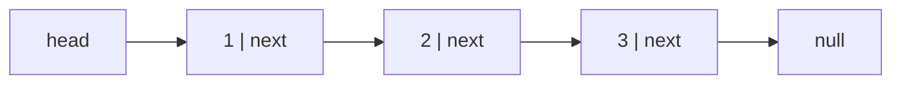

# Linked lists — pointer surgery under time pressure

Linked lists are rare in production JavaScript and common in interviews, for a
specific reason: they test whether you can hold a mutable pointer structure in
your head and not corrupt it. There is very little cleverness. There is a lot of
careful order-of-operations.

*In the Google round: a linked-list problem is a pointer-discipline check — reverse in groups, merge k, copy with random pointer — and the follow-up is almost always "now in O(1) space" or "now without modifying the input".*

The good news is that the whole topic is about **four idioms**. Learn those and
almost every linked-list problem is an assembly of them.

---

## The costs

| Operation | Singly linked | Array | Why the difference |
| --- | --- | --- | --- |
| Access the i-th element | **O(n)** | O(1) | You must walk from the head |
| Insert/delete at the head | **O(1)** | O(n) | No shifting |
| Insert/delete **given the node** | **O(1)** | O(n) | Just rewire two pointers |
| Insert/delete by value | **O(n)** | O(n) | Finding it dominates |
| Search | **O(n)** | O(n) | Same, but arrays win on cache |
| Memory per element | Higher | Lower | Every node stores a pointer too |

**The distinction that matters:** deletion is O(1) *given the node*, and O(n) if
you have to find it first. That caveat is why linked lists are almost never the
right production choice on their own — and why they're perfect in an **LRU
cache**, where a hash map hands you the node directly and the list only ever
does O(1) rewiring.

---

## How it actually works


*A chain of nodes, each holding a value and a reference to the next. `null` marks the end, and losing your only reference to a node loses the rest of the list with it.*

### Who's who

| Term | Meaning |
| --- | --- |
| **Node** | `{ val, next }` — a value plus a reference |
| **Head** | The first node. Lose it and you've lost the list |
| **Tail** | The last node; its `next` is `null` |
| **Singly linked** | Each node points forward only |
| **Doubly linked** | Each node has `prev` and `next` — needed for O(1) removal without the predecessor |
| **Circular** | The tail points back into the list rather than to `null` |
| **Dummy / sentinel node** | A fake node before the head, so the head needs no special case |

### The one thing that makes them hard

There is no going back and no random access. If you overwrite `node.next`
before you've saved it, the rest of the list is unreachable and gone. Every
linked-list bug is some version of that.

**So: draw it.** Three or four boxes with arrows, on paper or the whiteboard,
and physically move the arrows as you write each line. Everyone who is good at
these draws them. Trying to hold it purely in your head is how you produce code
that looks right and loses half the list.

---

## The four idioms

Almost every problem is these, combined.

### 1. The dummy head — kill the special case

Any problem where the head itself might be removed or replaced. Instead of
`if (head === null)` and `if (removing the head)` branches scattered through
your code, put a fake node in front and return `dummy.next` at the end.

```js
// Remove all nodes with a given value — no head special case anywhere
function removeElements(head, val) {
  const dummy = { val: 0, next: head };   // the whole trick
  let prev = dummy;
  while (prev.next) {
    if (prev.next.val === val) prev.next = prev.next.next;   // skip it
    else prev = prev.next;                                   // only advance if we kept it
  }
  return dummy.next;    // works even if the original head was removed
}
```

The `else` matters: if you advance `prev` after a deletion you skip the node you
just linked in, and consecutive matches survive.

**Use a dummy whenever the head can change.** Merging two lists, removing nodes,
partitioning, inserting in sorted order. It removes roughly half the bugs in the
topic.

### 2. Fast and slow pointers

One pointer moves one step, the other two. Three problems fall out of it.

**Find the middle** — when fast reaches the end, slow is at the middle.

```js
let slow = head, fast = head;
while (fast && fast.next) { slow = slow.next; fast = fast.next.next; }
// slow is now the middle (the second middle if the length is even)
```

The `fast && fast.next` guard is the whole correctness argument: it handles both
odd and even lengths without a null dereference. Getting that condition wrong is
the most common crash in the topic.

**Detect a cycle (Floyd's)** — if there is a loop, fast laps slow and they meet.
If there isn't, fast hits `null`.

**Find the cycle's start** — this is the part worth memorising, because it isn't
derivable in the moment. Once they meet, reset one pointer to the head and
advance both one step at a time; where they meet again is the entry to the loop.

```js
function detectCycleStart(head) {
  let slow = head, fast = head;
  while (fast && fast.next) {
    slow = slow.next; fast = fast.next.next;
    if (slow === fast) {                      // a cycle exists
      let p = head;
      while (p !== slow) { p = p.next; slow = slow.next; }
      return p;                               // the entry node
    }
  }
  return null;
}
```

**Find the k-th from the end** — the same idea with a fixed gap: advance one
pointer k steps, then move both together until the leader hits the end.

### 3. Reversal — the three-pointer dance

The single most important linked-list skill. Half the harder problems contain a
reversal.

```js
function reverse(head) {
  let prev = null, curr = head;
  while (curr) {
    const next = curr.next;   // 1. SAVE first — everything after depends on this
    curr.next = prev;         // 2. flip the arrow backwards
    prev = curr;              // 3. advance prev
    curr = next;              // 4. advance curr
  }
  return prev;                // curr is null; prev is the new head
}
```

Those four lines in that order, every time. **Line 1 is the one people drop**,
and dropping it severs the list at `curr` — you lose everything downstream on
the very first iteration.

Say the loop out loud as "save, flip, advance, advance". Practise it until you
can write it without thinking, because in a harder problem it'll be a subroutine
and you won't have attention to spare for it.

### 4. Merging two sorted lists

The building block for merge-sorting a list, and a dummy-head problem.

```js
function merge(a, b) {
  const dummy = { next: null };
  let tail = dummy;
  while (a && b) {
    if (a.val <= b.val) { tail.next = a; a = a.next; }
    else                { tail.next = b; b = b.next; }
    tail = tail.next;
  }
  tail.next = a ?? b;    // one list is exhausted; attach the rest wholesale
  return dummy.next;
}
```

The last line is the neat part: you don't loop over the remainder, you attach
it. Missing it and looping instead is correct but reads as less fluent.

---

## Putting the idioms together

The harder problems are compositions, and recognising that is the skill.

| Problem | = |
| --- | --- |
| Palindrome linked list, O(1) space | find middle + **reverse** second half + compare |
| Reorder list (`L0→Ln→L1→Ln-1…`) | find middle + **reverse** second half + **merge** alternately |
| Sort a linked list, O(n log n) | find middle + recurse + **merge** |
| Remove the n-th node from the end | **dummy** + fast/slow with a gap of n |
| Reverse in groups of k | **reverse** as a subroutine, k nodes at a time |
| Rotate right by k | find length, connect into a circle, walk to the new tail, break |

**Say the decomposition out loud** before you write anything: "this is find the
middle, reverse the second half, then compare — three pieces I know". That is a
much stronger opening than starting to type.

---

## The bugs

| Bug | Fix |
| --- | --- |
| **Losing the rest of the list** | Save `next` before you overwrite it. Always |
| **Null dereference on `fast.next.next`** | Guard with `while (fast && fast.next)` |
| **Head special cases everywhere** | Use a dummy node |
| **Advancing after a deletion** | Only advance `prev` when you *didn't* delete |
| **Off-by-one on "k-th from the end"** | Test on a two-node list; that's where it breaks |
| **Not restoring a mutated list** | If you reverse half a list to check a palindrome, some interviewers want it restored. Ask |
| **Infinite loop on a cycle** | Any traversal on possibly-cyclic input needs Floyd's or a visited `Set` |
| **Returning `head` after a dummy** | Return `dummy.next` — `head` may no longer be the head |

---

## Practice ladder

| # | Problem | What it teaches |
| --- | --- | --- |
| 1 | Reverse a linked list, iteratively | The three-pointer dance. Everything else needs it |
| 2 | Middle of a linked list | Fast/slow, and the `fast && fast.next` guard |
| 3 | Merge two sorted lists | Dummy head; attach-the-remainder |
| 4 | Remove n-th node from the end | Dummy + a fixed-gap two-pointer |
| 5 | Linked list has a cycle | Floyd's detection |
| 6 | Find where the cycle starts / remove the loop | The reset-to-head step |
| 7 | Palindrome linked list, O(1) space | Composition: middle + reverse + compare |
| 8 | Reorder list | Composition: middle + reverse + alternate merge |
| 9 | LRU cache | Doubly linked list + hash map. The one that's genuinely used in production |
| 10 | Reverse nodes in k-groups | Reversal as a subroutine with bookkeeping |
| 11 | Merge k sorted lists | Merge + a heap. Bridges to [heaps](11-heaps-and-top-k.md) |

**Exit test:** write `reverse` from memory in under two minutes, correct first
time, and then solve palindrome-linked-list by decomposing it out loud. If
reversal isn't automatic, nothing above rung 6 will be.

---

## Data structures

| Need | Use | Note |
| --- | --- | --- |
| A node | A plain object `{ val, next }` | No class needed. Interviewers usually supply the definition |
| A doubly linked node | `{ val, prev, next }` | Required for O(1) removal when you don't have the predecessor |
| Avoiding head special cases | A dummy node | `{ next: head }`, return `dummy.next` |
| Cycle detection | Two pointers | O(1) space. A `Set` of visited nodes also works but costs O(n) |
| LRU cache | `Map` + doubly linked list | The map gives O(1) find, the list gives O(1) reorder |

**Pseudocode — the LRU cache, since it's the one that shows up most**

```js
// O(1) get and put. The hash map finds the node; the list keeps the order.
// Sentinel head and tail remove every edge case at the boundaries.
class LRUCache {
  constructor(capacity) {
    this.cap = capacity;
    this.map = new Map();                       // key -> node
    this.head = { };                            // sentinel: most-recent side
    this.tail = { };                            // sentinel: least-recent side
    this.head.next = this.tail;
    this.tail.prev = this.head;
  }

  #remove(node) {                               // O(1) — needs prev, hence doubly linked
    node.prev.next = node.next;
    node.next.prev = node.prev;
  }

  #addFront(node) {                             // insert just after head
    node.next = this.head.next;
    node.prev = this.head;
    this.head.next.prev = node;
    this.head.next = node;
  }

  get(key) {
    const node = this.map.get(key);
    if (!node) return -1;
    this.#remove(node);                         // touching it makes it most-recent
    this.#addFront(node);
    return node.val;
  }

  put(key, val) {
    if (this.map.has(key)) this.#remove(this.map.get(key));
    const node = { key, val };
    this.#addFront(node);
    this.map.set(key, node);

    if (this.map.size > this.cap) {
      const lru = this.tail.prev;               // the node just before the tail sentinel
      this.#remove(lru);
      this.map.delete(lru.key);                 // node stores `key` SO we can do this
    }
  }
}
```

Two details are the whole design. The node stores its own `key` — without it you
couldn't delete the evicted entry from the map, because you'd have the node but
not its key. And the list must be **doubly** linked: eviction removes the node
before the tail, and removing a node in O(1) requires knowing its predecessor.

---

## Worked problems

Node shape used throughout: `{ val, next }`, with `random` where stated.

### Q: Reverse nodes in k-groups — reverse every consecutive block of k nodes, leaving a short tail alone
**Level:** senior · **Tags:** google-coding, linked-list, reversal, dummy-head

<details><summary>Model answer</summary>

**Problem.** `1→2→3→4→5, k=2` → `2→1→4→3→5`. `k=3` → `3→2→1→4→5`.

**Clarify first.** In place, O(1) extra space? (Yes.) What happens to a
trailing group shorter than `k`? (Left as-is.) `k = 1` or `k > length`?
(Return the list unchanged.)

**Brute force.** Copy to an array, reverse slices, rebuild. O(n) time but O(n)
space and it dodges the pointer work the question exists to test.

**The insight.** Reversing a group is the standard three-pointer reversal; the
difficulty is stitching. Keep a `prevTail` pointing at the node *before* the
group. Before reversing, walk `k` ahead to confirm the group is full. After
reversing `k` nodes, the old group head is the new tail, so link
`prevTail.next` to the new head and the new tail to whatever comes next.

**Algorithm.**
1. `dummy → head`; `prevTail = dummy`.
2. Loop: check there are `k` nodes after `prevTail`; if not, stop.
3. Reverse exactly `k` nodes starting at `prevTail.next`, remembering
   `groupHead` (becomes the tail).
4. `prevTail.next = newHead`; `groupHead.next = nodeAfterGroup`;
   `prevTail = groupHead`.

```js
function reverseKGroup(head, k) {
  const dummy = { val: 0, next: head };
  let prevTail = dummy;

  while (true) {
    // 1. Is there a full group ahead?
    let probe = prevTail;
    for (let i = 0; i < k && probe; i++) probe = probe.next;
    if (!probe) break;                        // fewer than k nodes remain

    // 2. Reverse k nodes starting at prevTail.next
    const groupHead = prevTail.next;          // will become the group's tail
    let prev = probe.next;                    // node after the group — reversal ends here
    let cur = groupHead;
    for (let i = 0; i < k; i++) {
      const nxt = cur.next;
      cur.next = prev;
      prev = cur;
      cur = nxt;
    }
    // 3. Stitch: prev is the new head, groupHead the new tail
    prevTail.next = prev;
    prevTail = groupHead;
  }
  return dummy.next;
}
```

Starting `prev` at `probe.next` instead of `null` is what makes the stitch
one line: the reversed tail already points at the rest of the list.

**Complexity.** O(n) time — each node is visited by the probe once and
reversed once. O(1) space.

**Test it.**
- `1→2→3→4→5, k=2` → `2→1→4→3→5`.
- `k=3` → `3→2→1→4→5`; the tail `4→5` is untouched.
- `k=1` → unchanged; `k=5` on 5 nodes → fully reversed.
- Single node, `k=2` → unchanged.

**What the interviewer is checking.** That you check the group is full
*before* touching pointers, and that you never lose the reference to the rest
of the list.

</details>

**Follow-ups:**

1. Q: Reverse the trailing short group too.
   <details><summary>Answer</summary>

   Drop the probe check's early `break`: on the last iteration set `k` to the
   remaining count and reverse that. Equivalent: when `probe` is null,
   compute how many nodes remain and reverse them with the same loop.

   </details>

2. Q: Do it recursively — what's the trade-off?
   <details><summary>Answer</summary>

   Reverse the first `k`, then set the group's tail `next` to
   `reverseKGroup(rest, k)`. Cleaner to read, but O(n/k) stack depth, which
   for `k = 1` on a million-node list overflows. In an interview say that
   trade-off out loud and stay iterative.

   </details>

### Q: Merge k sorted lists — combine k sorted linked lists into one sorted list
**Level:** intermediate · **Tags:** google-coding, linked-list, heap, divide-and-conquer

<details><summary>Model answer</summary>

**Problem.** `[[1,4,5],[1,3,4],[2,6]]` → `1→1→2→3→4→4→5→6`.

**Clarify first.** Total nodes `N`, list count `k`? (Both large.) Can lists be
empty or `k = 0`? (Yes.) Stable — for ties, does order across lists matter?
(No.)

**Brute force.** Collect every value, sort, rebuild: O(N log N), O(N) space.
Or merge lists one at a time into an accumulator: O(N · k), because early
nodes are re-walked in every merge.

**The insight.** Only the current head of each list can be the next output
node, so a min-heap of `k` heads gives the next node in O(log k). Alternative
with the same bound: merge pairs of lists, halving `k` each round —
`log k` rounds of O(N) work. The divide-and-conquer version needs no heap
class, which matters in JavaScript, where there isn't one built in.

**Algorithm.** (Divide and conquer.)
1. While more than one list remains, merge lists `i` and `i + 1` pairwise into
   a new array.
2. `mergeTwo` is the standard dummy-head merge.
3. Return the single remaining list.

```js
function mergeTwo(a, b) {
  const dummy = { val: 0, next: null };
  let tail = dummy;
  while (a && b) {
    if (a.val <= b.val) { tail.next = a; a = a.next; }
    else                { tail.next = b; b = b.next; }
    tail = tail.next;
  }
  tail.next = a ?? b;              // whichever list still has nodes
  return dummy.next;
}

function mergeKLists(lists) {
  if (lists.length === 0) return null;
  while (lists.length > 1) {
    const next = [];
    for (let i = 0; i < lists.length; i += 2) {
      next.push(i + 1 < lists.length ? mergeTwo(lists[i], lists[i + 1]) : lists[i]);
    }
    lists = next;
  }
  return lists[0];
}
```

**Complexity.** O(N log k) time — each node participates in `log k` merges.
O(1) extra beyond the output (O(k) for the round array).

**Test it.**
- The example → `1→1→2→3→4→4→5→6`.
- `[]` → `null`; `[null]` → `null`; `[null, 1→2]` → `1→2`.
- Odd `k` — the last list carries over unmerged for a round.

**What the interviewer is checking.** That you reject the O(N·k) sequential
merge with a reason, and that you know the heap bound even if you write the
pairwise version.

</details>

**Follow-ups:**

1. Q: Write the heap version. What does it cost, and when would you prefer it?
   <details><summary>Answer</summary>

   Push each non-null head into a min-heap keyed on `val`; pop the min, append
   it, push its `next` if any. O(N log k) time, O(k) heap. Prefer it when the
   lists are *streams* — you cannot pairwise-merge inputs you have not fully
   received, but a heap of current heads works incrementally. In JS you write
   a small binary heap (see [heaps](11-heaps-and-top-k.md)).

   </details>

2. Q: Merge k sorted arrays instead — does anything change?
   <details><summary>Answer</summary>

   Heap entries become `(value, arrayIndex, position)` and you advance the
   position instead of following `next`. Same O(N log k). External-sort merge
   phases are exactly this with disk-backed runs.

   </details>

### Q: Copy list with random pointer — deep-copy a list where each node also points to an arbitrary node
**Level:** senior · **Tags:** google-coding, linked-list, hash-map, interleaving

<details><summary>Model answer</summary>

**Problem.** Each node has `next` and `random` (any node or `null`). Return a
deep copy: new nodes, with `next` and `random` wired to the *copies*.

**Clarify first.** Can `random` point to the node itself? (Yes.) O(n) extra
space acceptable, or O(1) required? (Start with the map; offer O(1).) Must the
original be left intact? (Yes — so the O(1) trick must restore it.)

**Brute force.** For each node, find the index of its `random` target by
walking from the head, then set the copy's `random` by index: O(n²).

**The insight.** Two passes with a `Map` from original → copy: first create
all copies (so every target exists), then wire `next` and `random` through the
map. The O(1)-space version replaces the map with the list itself: interleave
each copy directly after its original (`A → A' → B → B'`), so `A'.random` is
simply `A.random.next`. Then unweave.

**Algorithm.** (Interleaving.)
1. Insert a copy after every node.
2. For each original `n`: `n.next.random = n.random ? n.random.next : null`.
3. Separate the two lists, restoring the original's `next` pointers.

```js
function copyRandomList(head) {
  if (!head) return null;

  // 1. Interleave copies: A → A' → B → B' ...
  for (let n = head; n; n = n.next.next) {
    n.next = { val: n.val, next: n.next, random: null };
  }
  // 2. Wire random on the copies via the original's random.next
  for (let n = head; n; n = n.next.next) {
    if (n.random) n.next.random = n.random.next;
  }
  // 3. Unweave, restoring the original
  const copyHead = head.next;
  for (let n = head; n; n = n.next) {
    const copy = n.next;
    n.next = copy.next;                 // restore original's next
    copy.next = copy.next ? copy.next.next : null;
  }
  return copyHead;
}
```

Step 3 must read `copy.next.next` *before* the original list is fully
restored — the loop above does that correctly because it restores `n.next`
first, then uses the original's (now-correct) `next` to find the next copy.

**Complexity.** O(n) time, O(1) extra space (the copies themselves are the
required output).

**Test it.**
- `1(random→3) → 2(random→1) → 3(random→null)`: copies' randoms point to
  the copies of 3, 1 and null respectively; original unchanged afterward.
- Single node whose `random` is itself → copy's `random` is the copy.
- `null` → `null`.

**What the interviewer is checking.** That the map version comes out cleanly
first, and that the interleave version leaves the original intact — walk the
original afterward and show it.

</details>

**Follow-ups:**

1. Q: Write the map version and compare.
   <details><summary>Answer</summary>

   ```js
   const m = new Map();
   for (let n = head; n; n = n.next) m.set(n, { val: n.val, next: null, random: null });
   for (let n = head; n; n = n.next) {
     m.get(n).next = m.get(n.next) ?? null;
     m.get(n).random = m.get(n.random) ?? null;
   }
   return m.get(head) ?? null;
   ```
   O(n) time, O(n) space, and the original is never touched — safer if the
   list is shared with other readers while you copy.

   </details>

2. Q: Generalise: deep-copy an arbitrary graph.
   <details><summary>Answer</summary>

   The map version *is* graph cloning: BFS/DFS from a start node, `Map`
   original → clone, and for each edge wire the clone's neighbour to the
   clone of the neighbour, creating it on first sight. The interleave trick
   is list-specific — a graph has no spare `next` slot to hide a copy in.

   </details>

### Q: Linked list cycle II — return the node where the cycle begins, or null
**Level:** intermediate · **Tags:** google-coding, linked-list, fast-slow-pointers, floyd

<details><summary>Model answer</summary>

**Problem.** Given the head, return the first node of the cycle if one exists;
otherwise `null`. O(1) space.

**Clarify first.** May we mark nodes (mutate)? (No.) Is a `Set` of visited
nodes acceptable as a first answer? (Yes, but O(n) space — the ask is O(1).)

**Brute force.** Walk with a `Set`; the first repeated node is the answer.
O(n) time, O(n) space.

**The insight.** Floyd's: a slow pointer moving 1 and a fast pointer moving 2
meet inside the cycle if one exists. Let the tail before the cycle be length
`a`, the cycle length `c`, and the meeting point `b` steps into the cycle.
Slow has walked `a + b`; fast `2(a + b)`. Fast's extra `a + b` is a whole
number of laps, so `a + b ≡ 0 (mod c)`, i.e. `a ≡ c − b (mod c)`. So from the
meeting point, `a` more steps lands at the cycle start — the same distance the
head is from it. Reset one pointer to the head and advance both by 1.

**Algorithm.**
1. `slow = fast = head`. Advance until they meet or `fast` hits null.
2. If null → no cycle.
3. `p = head`; advance `p` and `slow` by one each until equal. That node is the
   start.

```js
function detectCycle(head) {
  let slow = head, fast = head;
  while (fast && fast.next) {
    slow = slow.next;
    fast = fast.next.next;
    if (slow === fast) {                    // met inside the cycle
      let p = head;
      while (p !== slow) { p = p.next; slow = slow.next; }
      return p;
    }
  }
  return null;
}
```

**Complexity.** O(n) time, O(1) space.

**Test it.**
- `3→2→0→−4→(back to 2)` → node `2`.
- `1→2→(back to 1)` → node `1`.
- `1` alone, no cycle → `null`; empty → `null`.
- Cycle from the head itself: the meeting point may equal the head; the
  second loop exits immediately.

**What the interviewer is checking.** The modular argument. Most candidates
know the trick; senior candidates can prove it in three sentences.

</details>

**Follow-ups:**

1. Q: Return the cycle length.
   <details><summary>Answer</summary>

   From the meeting point, advance one pointer until it returns to that
   node, counting steps. O(c).

   </details>

2. Q: Same idea, different disguise: find the duplicate in an array of n+1 integers in 1..n without modifying it.
   <details><summary>Answer</summary>

   Treat `i → nums[i]` as a linked list; a duplicate value means two indices
   point to the same node, i.e. a cycle, and the cycle entry is the
   duplicate. Run exactly this algorithm on `nums` with `next = nums[i]`.
   O(n) time, O(1) space, input untouched.

   </details>

---


## Problem bank — linked-list fundamentals

The worked problems above assume the basics are automatic. This bank covers the
basics from the Scaler track, so they are: building a list, traversing it,
searching it, inserting and deleting at every position, and printing it
backwards. Every harder list problem is made of these moves.

| Group | Problems |
| --- | --- |
| Build and walk | node class, build from an array, print, length, search |
| Insert | at the head, at the tail, at position k |
| Delete | the head, the tail, at position k, the first node with a value |
| Recursion on lists | print in reverse without modifying the list |

All code uses this node:

```ts
class ListNode {
  constructor(public val: number, public next: ListNode | null = null) {}
}
```

**The rule behind every bug here:** before you write `x.next`, know that `x`
isn't `null`. The head is `null` for an empty list, and the tail's `next` is
`null` — so the empty list, a single node, and "position k is past the end"
are the three tests for every function below.

---

### Build and walk

### Q: Build a linked list from an array, print it, find its length, and search it for k
**Level:** foundation · **Tags:** google-coding, linked-list, traversal, scaler

<details><summary>Model answer</summary>

**Problem.** `[10, 20, 30, 40, 50]` → `10 → 20 → 30 → 40 → 50 → null`.
`search(head, 40)` → true; `search(head, 60)` → false.

**The insight.** Every traversal is the same loop: a `temp` pointer starts at
`head` and follows `next` until `null`. **Never move `head` itself** — you
lose the list.

**Algorithm (build).** A dummy node removes the "is this the first node?"
special case: append after `tail`, then return `dummy.next`.

```ts
function fromArray(a: number[]): ListNode | null {
  const dummy = new ListNode(0);
  let tail = dummy;
  for (const x of a) {
    tail.next = new ListNode(x);
    tail = tail.next;
  }
  return dummy.next;
}

function print(head: ListNode | null): string {
  const parts: number[] = [];
  for (let t = head; t !== null; t = t.next) parts.push(t.val);
  return parts.join(' -> ');
}

function length(head: ListNode | null): number {
  let n = 0;
  for (let t = head; t !== null; t = t.next) n++;
  return n;
}

function search(head: ListNode | null, k: number): boolean {
  for (let t = head; t !== null; t = t.next) if (t.val === k) return true;
  return false;
}
```

**Complexity.** Each is O(n) time, O(1) extra space (the build allocates n
nodes, which is the output).

**Test it.** Empty array → `null`; `print(null)` → `""`; `length(null)` → 0.

</details>

**Follow-ups:**
1. Q: Why is `head.next.next.val` risky?
   <details><summary>Answer</summary>

   Each `.next` may be `null`. With fewer than three nodes it throws
   `TypeError: Cannot read properties of null`. Guard every dereference or
   loop with `t !== null` as the condition.

   </details>
2. Q: Array vs linked list — why does a list lose on search even though both are O(n)?
   <details><summary>Answer</summary>

   Nodes are scattered in memory, so every hop is a likely cache miss; an
   array scan is sequential and prefetched. Same big-O, several times slower in
   practice. Lists win only on O(1) insert/delete at a node you already hold.

   </details>

---

### Insert

### Q: Insert a value at the head, at the tail, and at position k
**Level:** foundation · **Tags:** google-coding, linked-list, insertion, scaler

<details><summary>Model answer</summary>

**Problem.** Positions are 0-based: inserting at `k = 0` makes the new node
the head; `k = length` appends. `10 → 20 → 30`, insert 60 at k = 2 →
`10 → 20 → 60 → 30`.

**The insight.** To insert at position `k`, walk to the node at `k − 1` (the
predecessor). Then **wire the new node first, and cut the old link second** —
`node.next = prev.next` before `prev.next = node`. Reversed, you lose the rest
of the list.

```ts
function insertAtHead(head: ListNode | null, val: number): ListNode {
  return new ListNode(val, head);            // O(1): new node points at old head
}

function insertAtTail(head: ListNode | null, val: number): ListNode {
  const node = new ListNode(val);
  if (head === null) return node;            // empty list: the node IS the list
  let t = head;
  while (t.next !== null) t = t.next;        // stop ON the last node
  t.next = node;
  return head;
}

function insertAt(head: ListNode | null, val: number, k: number): ListNode | null {
  if (k === 0) return insertAtHead(head, val);   // new head: nothing precedes it
  let prev = head;
  for (let i = 0; i < k - 1 && prev !== null; i++) prev = prev.next;
  if (prev === null) return head;                // k > length: ignore (or throw)
  const node = new ListNode(val, prev.next);     // 1. new node → rest of list
  prev.next = node;                              // 2. predecessor → new node
  return head;
}
```

Every function **returns the head**, because inserting at position 0 changes it.
Forgetting to return and reassign the head is the most common bug in this whole
topic.

**Complexity.** Head O(1); tail and position k O(n) / O(k). O(1) space.

**Test it.** Insert into `null` at 0; insert at `k = length` (append);
`k = length + 1` (out of range).

</details>

**Follow-ups:**
1. Q: Make tail insertion O(1).
   <details><summary>Answer</summary>

   Keep a `tail` pointer alongside `head` (a list object with both fields),
   updated on every append. That's how a queue is built on a list.

   </details>
2. Q: How does a dummy head simplify `insertAt`?
   <details><summary>Answer</summary>

   With `dummy.next = head`, position 0's predecessor is `dummy`, so the `k === 0`
   branch disappears: walk k steps from `dummy`, splice, return `dummy.next`.

   </details>

---

### Delete

### Q: Delete the head, the tail, the node at position k, and the first node with value x
**Level:** foundation · **Tags:** google-coding, linked-list, deletion, dummy-head, scaler

<details><summary>Model answer</summary>

**Problem.** `10 → 20 → 30 → 40`: delete head → `20 → 30 → 40`; delete tail →
`10 → 20 → 30`; delete k = 1 → `10 → 30 → 40`; delete value 30 →
`10 → 20 → 40`.

**The insight.** To delete a node you need its **predecessor**, because you
skip it with `prev.next = prev.next.next`. For the tail, that means stopping at
the **second-to-last** node: loop while `t.next.next !== null`. A dummy head
gives the real head a predecessor, removing every special case.

```ts
function deleteHead(head: ListNode | null): ListNode | null {
  return head === null ? null : head.next;
}

function deleteTail(head: ListNode | null): ListNode | null {
  if (head === null || head.next === null) return null;   // 0 or 1 node
  let t = head;
  while (t.next!.next !== null) t = t.next!;              // stop at second-to-last
  t.next = null;
  return head;
}

function deleteAt(head: ListNode | null, k: number): ListNode | null {
  const dummy = new ListNode(0, head);
  let prev: ListNode | null = dummy;
  for (let i = 0; i < k && prev !== null; i++) prev = prev.next;  // predecessor of k
  if (prev !== null && prev.next !== null) prev.next = prev.next.next;
  return dummy.next;                                       // head may have changed
}

function deleteValue(head: ListNode | null, x: number): ListNode | null {
  const dummy = new ListNode(0, head);
  for (let prev = dummy; prev.next !== null; prev = prev.next) {
    if (prev.next.val === x) { prev.next = prev.next.next; break; }
  }
  return dummy.next;
}
```

**Complexity.** Head O(1); the rest O(n). O(1) space. In JS the skipped node
is garbage-collected; in C/C++ you must `free`/`delete` it — say so if the
interviewer's language is C++.

**Test it.** Empty list, single node (deleting it returns `null`), `k = 0`,
`k ≥ length`, value not present.

</details>

**Follow-ups:**
1. Q: Delete **every** node with value x.
   <details><summary>Answer</summary>

   Same dummy-head loop, but don't `break`, and only advance `prev` when you
   *didn't* delete — otherwise two adjacent matches leave the second one in:
   `if (prev.next.val === x) prev.next = prev.next.next; else prev = prev.next;`

   </details>
2. Q: You're given only a pointer to the node to delete (not the tail), no head. How?
   <details><summary>Answer</summary>

   Copy the next node's value into this node, then skip the next node:
   `node.val = node.next.val; node.next = node.next.next;`. It can't work for
   the tail — there's no next node to copy.

   </details>

---

### Recursion on lists

### Q: Print a linked list in reverse without modifying it
**Level:** foundation · **Tags:** google-coding, linked-list, recursion, stack, scaler

<details><summary>Model answer</summary>

**Problem.** `10 → 20 → 30 → 40 → 50` prints `50 40 30 20 10`; the list is
unchanged afterwards.

**The insight.** Recursion defers work until the call returns. "Print the rest
of the list in reverse, **then** print me" — the base case is `null`. The call
stack is doing the reversing for you.

```ts
function printReverse(head: ListNode | null, out: number[] = []): number[] {
  if (head === null) return out;       // base case: nothing left
  printReverse(head.next, out);        // 1. everything after me first
  out.push(head.val);                  // 2. then me
  return out;
}
```

Swap lines 1 and 2 and it prints in normal order — that single swap is the
difference between pre-order and post-order work, and the reason recursion
order matters.

**Complexity.** O(n) time, O(n) space — one stack frame per node.

</details>

**Follow-ups:**
1. Q: The list has 10⁶ nodes. What breaks, and what do you do?
   <details><summary>Answer</summary>

   The recursion is 10⁶ frames deep, past V8's default stack (~10⁴–10⁵ frames):
   `RangeError: Maximum call stack size exceeded`. Use an explicit array as a
   stack (push while walking, then pop), which is the same O(n) space on the
   heap. Or, if modification is allowed, reverse the list in place (O(1)
   space), print, and reverse it back.

   </details>
2. Q: Reverse the list itself instead of just printing it.
   <details><summary>Answer</summary>

   The three-pointer reversal (`prev`, `cur`, `next`) — covered in
   [the four idioms](#3-reversal-the-three-pointer-dance) and the interview
   question at the end of this chapter.

   </details>

---

## Interview Q&A

### Q: Reverse a linked list. Then explain why the order of operations matters.
**Level:** foundation · **Tags:** dsa, linked-lists, pointers

<details><summary>Model answer</summary>

Three pointers: `prev` starting at null, `curr` at the head, and a temporary
`next` inside the loop. Each iteration: save `curr.next` into `next`, point
`curr.next` at `prev`, move `prev` to `curr`, move `curr` to `next`. When `curr`
is null, `prev` is the new head.

The order matters because the moment I write `curr.next = prev` I have destroyed
my only reference to the rest of the list. Nothing else points to it — that's
what a singly linked list means. So saving `next` first isn't tidiness, it's the
difference between reversing the list and truncating it to one node.

That's really the general lesson for the whole topic: in a singly linked list
every node is reachable through exactly one pointer, so overwriting a pointer
before saving it loses everything downstream permanently.

It's O(n) time and O(1) space. There's a recursive version that's arguably
prettier, but it's O(n) stack space and will overflow on a long list, so I'd
write the iterative one and mention the recursive one exists.

</details>

**Follow-ups:**

1. Q: How would you check whether a linked list is a palindrome in O(1) space?
   <details><summary>Answer</summary>

   Three steps, all of which are idioms I already have.

   Find the middle with fast and slow pointers. Reverse the second half in
   place. Then walk one pointer from the head and one from the new head of the
   reversed half, comparing values until one runs out. If every pair matched,
   it's a palindrome.

   O(n) time, O(1) space. The naive alternative — copy the values into an array
   and use two pointers — is much easier to write but O(n) space, so I'd offer
   it as the baseline and then do this if O(1) is required.

   The thing I'd raise unprompted is that this mutates the input. Some
   interviewers care, and it's a legitimate objection if other code holds a
   reference to that list. If it matters, I reverse the second half back before
   returning, which is another O(n/2) pass and keeps the same complexity.

   </details>

2. Q: When would you use a linked list over an array in real code?
   <details><summary>Answer</summary>

   Rarely on its own, and I'd say that directly, because arrays win on random
   access and cache locality and those dominate most workloads.

   The genuine case is when you have O(1) access to the node already and need
   O(1) structural change. LRU cache is the canonical one: a hash map maps key
   to node, so finding is O(1), and then moving that node to the front is
   pointer rewiring rather than shifting an array. That combination is why every
   real LRU implementation is a hash map plus a doubly linked list.

   The other case is splicing — moving a run of elements between structures
   without copying, which is why intrusive lists show up in kernels and
   allocators.

   What people usually cite — "insertion is O(1)" — is misleading, because
   finding the position is still O(n), so insert-by-value is O(n) either way.
   The array often wins in practice even then, because shifting contiguous
   memory is extremely fast compared to chasing pointers across the heap.

   </details>

### Q: How do you detect a cycle in a linked list, and find where it starts?
**Level:** intermediate · **Tags:** dsa, linked-lists, two-pointers

<details><summary>Model answer</summary>

Floyd's cycle detection — two pointers, one moving a step at a time and one
moving two.

For detection: if there's no cycle, the fast pointer reaches null and I'm done.
If there is one, the fast pointer enters the loop and gains on the slow one by
one node per iteration, so it must eventually land on it. They meet, and that
proves a cycle exists. O(n) time, O(1) space.

Finding the entry point is the part I'd say up front I know rather than derive:
once they meet, reset one pointer to the head and advance both one step at a
time. Where they meet the second time is the start of the cycle.

The reason it works is a distance argument. If the distance from head to the
cycle entry is `a`, and from the entry to the meeting point is `b`, and the
cycle length is `c`, then when they meet the slow pointer has travelled `a + b`
and the fast one has travelled twice that. The difference is a whole number of
loops, and the algebra reduces to `a` being congruent to the remaining distance
from the meeting point back round to the entry. So a pointer from the head and a
pointer from the meeting point, both moving one step, arrive at the entry
together.

The alternative is a `Set` of visited nodes, which is O(n) space but takes ten
seconds to write and is honestly fine if nobody has asked for O(1). I'd mention
both and let the constraint decide.

</details>

**Follow-ups:**

1. Q: How do you actually remove the loop once you've found it?
   <details><summary>Answer</summary>

   Find the entry node as above, then find the node whose `next` points at it
   and set that to null.

   Concretely: once I have the cycle entry, walk round the loop from the entry
   until I find the node whose `next` is the entry again — that's the last node
   of the loop. Setting its `next` to null breaks the cycle and leaves a proper
   null-terminated list.

   The edge case worth naming is a loop back to the head itself, where the entry
   is the head. The walk still works — I go all the way round and find the tail
   — but a naive implementation that starts from `head.next` and assumes the
   entry is somewhere in the middle will miss it.

   </details>

---

## What a weak answer sounds like

- **Overwriting `next` before saving it.** The defining bug of the topic.
- **`while (fast.next && fast)`** — wrong order, and it crashes. Null-check the
  thing before you dereference it.
- **Head special cases scattered through the code** instead of a dummy node.
- **Recursive reversal with no mention of stack depth.** It's O(n) space and
  overflows on a long list.
- **"Linked lists are better for insertion"** with no caveat that finding the
  position is still O(n).
- **Not drawing it.** Everyone who is reliably good at these draws three boxes
  and moves the arrows. Trying to hold it in your head is how the bugs get in.
- **Traversing possibly-cyclic input with a plain `while (node)`** — that's an
  infinite loop.

---

## Glossary

- **Node** — `{ val, next }`; a value and a reference.
- **Head / tail** — first and last nodes.
- **Singly / doubly linked** — forward pointers only, versus `prev` and `next`.
- **Circular list** — the tail points back into the list.
- **Dummy (sentinel) node** — a fake node before the head, removing head special cases.
- **Fast/slow pointers** — one step versus two; finds middles, cycles and k-from-end.
- **Floyd's cycle detection** — the fast/slow meeting argument, plus the reset-to-head step for the entry.
- **Three-pointer reversal** — save, flip, advance, advance.
- **Splice** — moving nodes between structures by rewiring rather than copying.
- **Intrusive list** — the list pointers live inside the payload object, avoiding a wrapper allocation.

---

## Exercises

`ListNode` is predefined in the editor (`val`, `next`). Tests write lists as
arrays — `[1, 2, 3]` is `1 → 2 → 3` and `[]` is `null` — and a list you return
is read back the same way. Problems marked **core** are the must-solve set.

### Exercise: Length of a list
**Level:** foundation · **Topic:** traversal · **Hint:** Walk a pointer until null; never move head.
**Function:** `listLength(head: ListNode | null): number`
**Source:** scaler · **Adapter:** linked-list

Return the number of nodes. `[10, 20, 30]` → `3`.

```tests
[{"args": [[10, 20, 30]], "expected": 3},
 {"args": [[]], "expected": 0},
 {"args": [[1]], "expected": 1}]
```

<details><summary>Solution</summary>

```ts
function listLength(head: ListNode | null): number {
  let n = 0;
  for (let t = head; t !== null; t = t.next) n++;
  return n;
}
```
</details>

### Exercise: Search a list
**Level:** foundation · **Topic:** traversal · **Hint:** Stop as soon as you find it.
**Function:** `searchList(head: ListNode | null, k: number): boolean`
**Source:** scaler · **Adapter:** linked-list

Return `true` if some node holds `k`. `[10, 20, 30, 40], 40` → `true`.

```tests
[{"args": [[10, 20, 30, 40], 40], "expected": true},
 {"args": [[10, 20, 30, 40], 60], "expected": false},
 {"args": [[], 1], "expected": false},
 {"args": [[5], 5], "expected": true}]
```

<details><summary>Solution</summary>

```ts
function searchList(head: ListNode | null, k: number): boolean {
  for (let t = head; t !== null; t = t.next) if (t.val === k) return true;
  return false;
}
```
</details>

### Exercise: Insert at the head
**Level:** foundation · **Topic:** insertion · **Hint:** The new node points at the old head.
**Function:** `insertAtHead(head: ListNode | null, val: number): ListNode`
**Source:** scaler · **Adapter:** linked-list

Insert `val` at the front and return the new head. `[20, 30], 10` → `[10, 20, 30]`.

```tests
[{"args": [[20, 30], 10], "expected": [10, 20, 30]},
 {"args": [[], 1], "expected": [1]}]
```

<details><summary>Solution</summary>

```ts
function insertAtHead(head: ListNode | null, val: number): ListNode {
  return new ListNode(val, head);
}
```
</details>

### Exercise: Insert at the tail
**Level:** foundation · **Topic:** insertion · **Hint:** Stop on the last node, not past it.
**Function:** `insertAtTail(head: ListNode | null, val: number): ListNode`
**Source:** scaler · **Adapter:** linked-list

Append `val` and return the head. `[10, 20], 30` → `[10, 20, 30]`; an empty list becomes `[val]`.

```tests
[{"args": [[10, 20], 30], "expected": [10, 20, 30]},
 {"args": [[], 5], "expected": [5]},
 {"args": [[1], 2], "expected": [1, 2]}]
```

<details><summary>Solution</summary>

```ts
function insertAtTail(head: ListNode | null, val: number): ListNode {
  const node = new ListNode(val);
  if (head === null) return node;
  let t = head;
  while (t.next !== null) t = t.next;
  t.next = node;
  return head;
}
```
</details>

### Exercise: Insert at position k
**Level:** foundation · **Topic:** insertion via the predecessor · **Hint:** Wire the new node to the rest first, then link the predecessor to it.
**Function:** `insertAt(head: ListNode | null, val: number, k: number): ListNode | null`
**Core:** true · **Source:** scaler · **Adapter:** linked-list

Insert `val` so it ends up at 0-based position `k` (k = length appends). If `k` is past the end, return the list unchanged.
`[10, 20, 30], 60, 2` → `[10, 20, 60, 30]`.

```tests
[{"args": [[10, 20, 30], 60, 2], "expected": [10, 20, 60, 30]},
 {"args": [[], 1, 0], "expected": [1]},
 {"args": [[1, 2], 3, 2], "expected": [1, 2, 3]},
 {"args": [[1, 2], 3, 5], "expected": [1, 2]},
 {"args": [[1, 2], 0, 0], "expected": [0, 1, 2]}]
```

<details><summary>Solution</summary>

```ts
function insertAt(head: ListNode | null, val: number, k: number): ListNode | null {
  const dummy = new ListNode(0, head);
  let prev: ListNode | null = dummy;
  for (let i = 0; i < k && prev !== null; i++) prev = prev.next;
  if (prev === null) return head;
  prev.next = new ListNode(val, prev.next);
  return dummy.next;
}
```
</details>

### Exercise: Delete the head
**Level:** foundation · **Topic:** deletion · **Hint:** The second node becomes the head.
**Function:** `deleteHead(head: ListNode | null): ListNode | null`
**Source:** scaler · **Adapter:** linked-list

Remove the first node. `[10, 20, 30]` → `[20, 30]`; `[]` → `[]`.

```tests
[{"args": [[10, 20, 30]], "expected": [20, 30]},
 {"args": [[1]], "expected": []},
 {"args": [[]], "expected": []}]
```

<details><summary>Solution</summary>

```ts
function deleteHead(head: ListNode | null): ListNode | null {
  return head === null ? null : head.next;
}
```
</details>

### Exercise: Delete the tail
**Level:** foundation · **Topic:** stop at the second-to-last node · **Hint:** You need the node before the tail.
**Function:** `deleteTail(head: ListNode | null): ListNode | null`
**Source:** scaler · **Adapter:** linked-list

Remove the last node. `[10, 20, 30]` → `[10, 20]`.

```tests
[{"args": [[10, 20, 30]], "expected": [10, 20]},
 {"args": [[1]], "expected": []},
 {"args": [[]], "expected": []},
 {"args": [[1, 2]], "expected": [1]}]
```

<details><summary>Solution</summary>

```ts
function deleteTail(head: ListNode | null): ListNode | null {
  if (head === null || head.next === null) return null;
  let t = head;
  while (t.next!.next !== null) t = t.next!;
  t.next = null;
  return head;
}
```
</details>

### Exercise: Delete at position k
**Level:** foundation · **Topic:** dummy head + predecessor · **Hint:** A dummy node gives the real head a predecessor too.
**Function:** `deleteAt(head: ListNode | null, k: number): ListNode | null`
**Core:** true · **Source:** scaler · **Adapter:** linked-list

Remove the node at 0-based position `k`; if there is none, return the list unchanged.
`[10, 20, 30, 40], 1` → `[10, 30, 40]`.

```tests
[{"args": [[10, 20, 30, 40], 1], "expected": [10, 30, 40]},
 {"args": [[10, 20], 0], "expected": [20]},
 {"args": [[10, 20], 5], "expected": [10, 20]},
 {"args": [[1], 0], "expected": []}]
```

<details><summary>Solution</summary>

```ts
function deleteAt(head: ListNode | null, k: number): ListNode | null {
  const dummy = new ListNode(0, head);
  let prev: ListNode | null = dummy;
  for (let i = 0; i < k && prev !== null; i++) prev = prev.next;
  if (prev !== null && prev.next !== null) prev.next = prev.next.next;
  return dummy.next;
}
```
</details>

### Exercise: Delete every node with value x
**Level:** foundation · **Topic:** dummy head; advance only when you keep · **Hint:** Two adjacent matches are the trap.
**Function:** `removeAll(head: ListNode | null, x: number): ListNode | null`
**Core:** true · **Source:** scaler · **Adapter:** linked-list

Remove every node whose value is `x`. `[1, 2, 2, 3, 2], 2` → `[1, 3]`.

```tests
[{"args": [[1, 2, 2, 3, 2], 2], "expected": [1, 3]},
 {"args": [[2, 2], 2], "expected": []},
 {"args": [[1, 3], 2], "expected": [1, 3]},
 {"args": [[], 1], "expected": []}]
```

<details><summary>Solution</summary>

```ts
function removeAll(head: ListNode | null, x: number): ListNode | null {
  const dummy = new ListNode(0, head);
  let prev = dummy;
  while (prev.next !== null) {
    if (prev.next.val === x) prev.next = prev.next.next;
    else prev = prev.next;
  }
  return dummy.next;
}
```
</details>

### Exercise: Values in reverse order
**Level:** foundation · **Topic:** recursion (post-order) or a stack · **Hint:** Handle the rest of the list first, then this node.
**Function:** `printReverse(head: ListNode | null): number[]`
**Source:** scaler · **Adapter:** linked-list

Return the values from last to first, without modifying the list. `[10, 20, 30]` → `[30, 20, 10]`.

```tests
[{"args": [[10, 20, 30]], "expected": [30, 20, 10]},
 {"args": [[]], "expected": []},
 {"args": [[1]], "expected": [1]}]
```

<details><summary>Solution</summary>

```ts
function printReverse(head: ListNode | null): number[] {
  const out: number[] = [];
  const go = (n: ListNode | null) => { if (n === null) return; go(n.next); out.push(n.val); };
  go(head);
  return out;
}
```
</details>

### Exercise: Reverse a linked list
**Level:** intermediate · **Topic:** three pointers: prev, cur, next · **Hint:** Save next before you redirect cur.next.
**Function:** `reverseList(head: ListNode | null): ListNode | null`
**Core:** true · **Adapter:** linked-list

Reverse the list in place and return the new head. `[1, 2, 3, 4]` → `[4, 3, 2, 1]`.

```tests
[{"args": [[1, 2, 3, 4]], "expected": [4, 3, 2, 1]},
 {"args": [[]], "expected": []},
 {"args": [[1]], "expected": [1]},
 {"args": [[1, 2]], "expected": [2, 1]},
 {"gen": "[Array.from({length: 100000}, (_, i) => i)]", "perf": true, "label": "n = 100,000"}]
```

<details><summary>Solution</summary>

```ts
function reverseList(head: ListNode | null): ListNode | null {
  let prev: ListNode | null = null, cur = head;
  while (cur !== null) {
    const next = cur.next;
    cur.next = prev;
    prev = cur;
    cur = next;
  }
  return prev;
}
```
</details>

### Exercise: Middle of the list
**Level:** foundation · **Topic:** fast and slow pointers · **Hint:** When the fast pointer reaches the end, the slow one is halfway.
**Function:** `middleNode(head: ListNode | null): ListNode | null`
**Core:** true · **Adapter:** linked-list

Return the middle node (the second middle for even lengths) — the returned list is read from that node.
`[1, 2, 3, 4, 5]` → `[3, 4, 5]`; `[1, 2, 3, 4]` → `[3, 4]`.

```tests
[{"args": [[1, 2, 3, 4, 5]], "expected": [3, 4, 5]},
 {"args": [[1, 2, 3, 4]], "expected": [3, 4]},
 {"args": [[1]], "expected": [1]}]
```

<details><summary>Solution</summary>

```ts
function middleNode(head: ListNode | null): ListNode | null {
  let slow = head, fast = head;
  while (fast !== null && fast.next !== null) { slow = slow!.next; fast = fast.next.next; }
  return slow;
}
```
</details>

### Exercise: Merge two sorted lists
**Level:** foundation · **Topic:** dummy head + splice the smaller · **Hint:** Always attach the smaller head, then advance that list.
**Function:** `mergeTwoLists(a: ListNode | null, b: ListNode | null): ListNode | null`
**Core:** true · **Adapter:** linked-list

Merge two sorted lists into one sorted list. `[1, 2, 4], [1, 3, 4]` → `[1, 1, 2, 3, 4, 4]`.

```tests
[{"args": [[1, 2, 4], [1, 3, 4]], "expected": [1, 1, 2, 3, 4, 4]},
 {"args": [[], []], "expected": []},
 {"args": [[], [0]], "expected": [0]},
 {"args": [[5], [1, 2]], "expected": [1, 2, 5]}]
```

<details><summary>Solution</summary>

```ts
function mergeTwoLists(a: ListNode | null, b: ListNode | null): ListNode | null {
  const dummy = new ListNode(0);
  let t = dummy;
  while (a !== null && b !== null) {
    if (a.val <= b.val) { t.next = a; a = a.next; } else { t.next = b; b = b.next; }
    t = t.next;
  }
  t.next = a ?? b;
  return dummy.next;
}
```
</details>

### Exercise: Reverse nodes in k-groups
**Level:** senior · **Topic:** reverse a block, reconnect, repeat · **Hint:** Check that k nodes remain before reversing a block.
**Function:** `reverseKGroup(head: ListNode | null, k: number): ListNode | null`
**Adapter:** linked-list

Reverse every consecutive block of `k` nodes; a short tail stays as it is.
`[1, 2, 3, 4, 5], 2` → `[2, 1, 4, 3, 5]`; with `k = 3` → `[3, 2, 1, 4, 5]`.

```tests
[{"args": [[1, 2, 3, 4, 5], 2], "expected": [2, 1, 4, 3, 5]},
 {"args": [[1, 2, 3, 4, 5], 3], "expected": [3, 2, 1, 4, 5]},
 {"args": [[1, 2], 3], "expected": [1, 2]},
 {"args": [[1, 2, 3], 1], "expected": [1, 2, 3]},
 {"args": [[], 2], "expected": []}]
```

<details><summary>Solution</summary>

```ts
function reverseKGroup(head: ListNode | null, k: number): ListNode | null {
  const dummy = new ListNode(0, head);
  let groupPrev = dummy;
  while (true) {
    let kth: ListNode | null = groupPrev;
    for (let i = 0; i < k && kth !== null; i++) kth = kth.next;
    if (kth === null) break;
    const groupNext = kth.next;
    let prev: ListNode | null = groupNext, cur = groupPrev.next;
    while (cur !== groupNext) {
      const next: ListNode | null = cur!.next;
      cur!.next = prev;
      prev = cur;
      cur = next;
    }
    const first = groupPrev.next!;
    groupPrev.next = kth;
    groupPrev = first;
  }
  return dummy.next;
}
```
</details>

### Exercise: Merge k sorted lists
**Level:** senior · **Topic:** divide and conquer (or a min-heap) · **Hint:** Merge pairs of lists, halving the count each round.
**Function:** `mergeKLists(lists: (ListNode | null)[]): ListNode | null`
**Adapter:** linked-lists

Merge `k` sorted lists into one sorted list. `[[1,4,5],[1,3,4],[2,6]]` → `[1,1,2,3,4,4,5,6]`.

```tests
[{"args": [[[1, 4, 5], [1, 3, 4], [2, 6]]], "expected": [1, 1, 2, 3, 4, 4, 5, 6]},
 {"args": [[]], "expected": []},
 {"args": [[[]]], "expected": []},
 {"args": [[[2], [], [1]]], "expected": [1, 2]}]
```

<details><summary>Solution</summary>

```ts
function mergeKLists(lists: (ListNode | null)[]): ListNode | null {
  const merge2 = (a: ListNode | null, b: ListNode | null): ListNode | null => {
    const dummy = new ListNode(0);
    let t = dummy;
    while (a !== null && b !== null) {
      if (a.val <= b.val) { t.next = a; a = a.next; } else { t.next = b; b = b.next; }
      t = t.next;
    }
    t.next = a ?? b;
    return dummy.next;
  };
  if (lists.length === 0) return null;
  let cur = lists;
  while (cur.length > 1) {
    const next: (ListNode | null)[] = [];
    for (let i = 0; i < cur.length; i += 2) next.push(i + 1 < cur.length ? merge2(cur[i], cur[i + 1]) : cur[i]);
    cur = next;
  }
  return cur[0];
}
```
</details>

---

## In brief

- **Nodes scattered in memory:** O(1) insert/delete at a node you hold, O(n) to find anything.
- **Never move `head` while traversing** — walk a separate pointer until it's null.
- **To insert or delete you need the predecessor**; a dummy head gives the real head one and removes the special case.
- **Wire first, cut second:** `node.next = prev.next` before `prev.next = node`.
- **Fast/slow pointers** find the middle and detect cycles.
- **Reversal is three pointers** — save next before redirecting.
- **Every function that can change the head must return it.**

## Quiz

### MCQ: Why does a dummy head node simplify insert and delete?
- [ ] It makes the list faster
- [x] It gives the real head a predecessor, removing the head special case
- [ ] It stores the length
- [ ] It prevents cycles
**Why:** Operations work through the predecessor; the dummy provides one for position 0.

### MCQ: Inserting `node` after `prev` — which order is correct?
- [ ] prev.next = node; node.next = prev.next
- [x] node.next = prev.next; prev.next = node
- [ ] Either order
- [ ] node.next = prev; prev.next = node
**Why:** Cut first and you lose the rest of the list.

### MCQ: To delete the tail you must stop at…
- [ ] The tail
- [x] The second-to-last node
- [ ] The head
- [ ] null
**Why:** You need the node whose next is the tail, so you can set its next to null.

### MCQ: Printing a list in reverse recursively costs how much extra space?
- [ ] O(1)
- [ ] O(log n)
- [x] O(n) for the call stack
- [ ] O(n²)
**Why:** One frame per node; for 10⁶ nodes use an explicit stack or reverse in place.

### MCQ: Fast/slow pointers: when fast reaches the end, slow is…
- [ ] At the head
- [x] At the middle
- [ ] At the tail
- [ ] One behind fast
**Why:** Fast moves two steps per slow step.

### MCQ: Deleting every node equal to x, the pointer should advance…
- [ ] Every iteration
- [x] Only when the next node is kept
- [ ] Only after a deletion
- [ ] Twice per iteration
**Why:** Advancing after a deletion skips the new next node — two adjacent matches survive.

### MCQ: Given only a pointer to a node (not the tail) and no head, how do you delete it?
- [ ] Impossible
- [x] Copy the next node's value in, then skip the next node
- [ ] Set it to null
- [ ] Walk back to the head
**Why:** You can't reach the predecessor, so make this node become its successor.

### MCQ: Array vs linked list: why does list traversal run slower despite the same O(n)?
- [ ] Lists have more nodes
- [x] Each hop is a likely cache miss; arrays scan sequentially
- [ ] Lists use more CPU instructions per element by design
- [ ] It doesn't
**Why:** Contiguous memory is prefetched; scattered nodes aren't.
