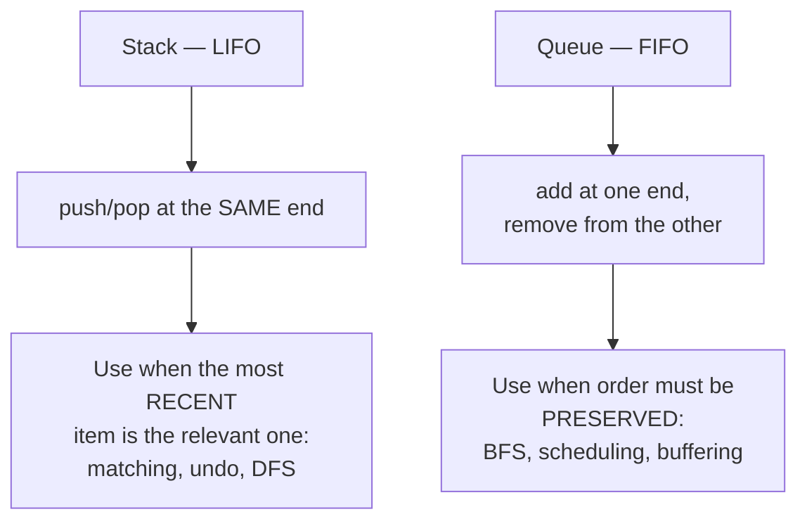

# Stacks and queues — order of processing

Both are just arrays with a restriction on where you may add and remove. That
restriction is the entire point: by giving up random access you get an
extremely clear model of *what to process next*, and a surprising number of
problems are really asking that question.

*In the Google round: stacks show up as monotonic-stack problems (histogram, next greater) and expression parsing; queues as the monotonic deque behind sliding-window maximum — and the twist is "the window is time-based" or "the input is a stream".*

**Stack = last in, first out.** The most recent thing is the most relevant.
**Queue = first in, first out.** Fairness, and level-by-level exploration.

---

## The costs

| Operation | Stack | Queue |
| --- | --- | --- |
| Add | `push` — **O(1)** | `enqueue` — **O(1)** |
| Remove | `pop` — **O(1)** | `dequeue` — **O(1)** *if done right* |
| Peek | `at(-1)` — **O(1)** | front — **O(1)** |
| Search | **O(n)** | **O(n)** |
| Space | O(n) | O(n) |

**The trap is the queue in JavaScript.** `array.shift()` is O(n) — it reindexes
everything — so a BFS built on `shift()` is O(n²) rather than O(n). The fix is
one line:

```js
// O(1) dequeue: never remove from the front, just advance a pointer
const q = [start];
let head = 0;
while (head < q.length) {
  const node = q[head++];
  // ... push neighbours onto q
}
```

You trade memory (the consumed prefix is never reclaimed) for time. For an
interview that's the right trade, and saying "`shift` is O(n) so I'll use an
index pointer" is a small fluency signal that costs you nothing.

---

## How it actually works


*One end or two. That single difference is why a stack explores depth-first and a queue explores breadth-first.*

### Who's who

| Term | Meaning |
| --- | --- |
| **LIFO** | Last in, first out — a stack |
| **FIFO** | First in, first out — a queue |
| **Push / pop** | Add to / remove from the top of a stack |
| **Enqueue / dequeue** | Add to the back / remove from the front of a queue |
| **Peek / top / front** | Look without removing |
| **Deque** | Double-ended queue; add and remove at both ends |
| **Monotonic stack** | A stack kept sorted, used for nearest-greater/smaller queries |
| **Circular buffer** | A fixed-size queue reusing its slots via modular arithmetic |

### The connection worth internalising

DFS and BFS are the *same algorithm* with different containers. Take from the
end and you go deep; take from the front and you go wide.

```js
// Identical code. `pop()` → DFS. Swap for a queue → BFS.
const frontier = [start];
while (frontier.length) {
  const node = frontier.pop();      // ← the only line that differs
  for (const next of neighbours(node)) frontier.push(next);
}
```

Saying that out loud when a graph question comes up is a genuinely strong
signal, because most candidates learn them as two separate things.

---

## When to reach for a stack

### 1. Matching and nesting

Parentheses, HTML tags, nested structures. Push an opener, and on a closer check
the top matches. Valid at the end only if the stack is empty.

```js
function isBalanced(s) {
  const pairs = { ')': '(', ']': '[', '}': '{' };
  const stack = [];
  for (const c of s) {
    if (c === '(' || c === '[' || c === '{') stack.push(c);
    else if (pairs[c]) {
      if (stack.pop() !== pairs[c]) return false;   // wrong type, or empty → undefined
    }
  }
  return stack.length === 0;    // leftovers mean unclosed openers
}
```

The final emptiness check is the half people forget: `"((("` never fails a
comparison, it just leaves three items behind.

### 2. Undo, backtracking, and "the most recent"

Browser history, editor undo, the call stack itself. Anything where you need to
return to the previous state.

### 3. Converting recursion to iteration

Recursion *is* a stack — the call stack. Any recursive algorithm can be
rewritten with an explicit stack, which is what you do when depth risks an
overflow. Worth naming when a grid or tree is large.

### 4. Monotonic stack — the one that wins rounds

Keep the stack sorted. When an incoming element breaks the order, everything you
pop has just found its answer.

```js
// Next greater element to the right, for every index. O(n).
function nextGreater(nums) {
  const res = new Array(nums.length).fill(-1);
  const stack = [];                 // holds INDICES, decreasing by value
  for (let i = 0; i < nums.length; i++) {
    // Everything smaller than nums[i] has just found its next-greater.
    while (stack.length && nums[stack.at(-1)] < nums[i]) {
      res[stack.pop()] = nums[i];
    }
    stack.push(i);
  }
  return res;                       // anything left never found one: stays -1
}
```

**Why it's O(n) despite the nested loops:** each index is pushed exactly once
and popped at most once, so the total work across all iterations is 2n. Say that
unprompted — it looks quadratic and interviewers check whether you know it
isn't.

**Store indices, not values**, whenever widths matter — and in histogram
problems they always do.

**Largest rectangle in a histogram** is the flagship. For each bar, its rectangle
extends left and right until a shorter bar, which is exactly what a monotonic
increasing stack gives you. It's brutal without the pattern and mechanical with
it.

### 5. Two stacks for a min/max in O(1)

A "min stack" — supporting `push`, `pop` and `getMin` all in O(1) — is a common
follow-up. Keep a second stack of the minimum-so-far, pushed in parallel.

```js
class MinStack {
  constructor() { this.main = []; this.mins = []; }
  push(x) {
    this.main.push(x);
    // Push the running minimum alongside, so mins.at(-1) is always the min
    // of everything currently in main.
    this.mins.push(this.mins.length ? Math.min(x, this.mins.at(-1)) : x);
  }
  pop() { this.mins.pop(); return this.main.pop(); }   // pop BOTH, always
  top() { return this.main.at(-1); }
  getMin() { return this.mins.at(-1); }
}
```

---

## When to reach for a queue

### 1. BFS — the big one

Level-order traversal, shortest path in an unweighted graph, "minimum number of
steps". See [matrices](13-matrices-and-grids.md) and [graphs](12-graphs.md).

**Level batching** is the technique that makes BFS answer distance questions:
process the whole current level before incrementing your counter.

```js
let level = 0;
while (queue.length) {
  const size = queue.length;              // freeze it — the loop pushes more
  for (let i = 0; i < size; i++) {        // exactly one level
    const node = queue[head++];
    // ... push children
  }
  level++;                                // one increment per level = a distance
}
```

Capturing `size` before the inner loop is essential: the loop appends the next
level to the same array, so reading `queue.length` inside would never terminate
the level.

### 2. Scheduling and buffering

Task queues, rate limiters, producer/consumer. The distributed-systems version
of exactly this idea is in
[messaging and streams](27-messaging-streams.md) —
worth connecting if a design question drifts there.

### 3. Sliding window maximum — the deque

A **monotonic deque** gives the max of every window in O(n): keep indices in
decreasing order of value, evict from the front when they fall out of the
window, evict from the back when a bigger value arrives.

```js
// Max of every window of size k, in O(n) total
const dq = [];               // indices, values decreasing
const out = [];
for (let i = 0; i < nums.length; i++) {
  if (dq.length && dq[0] <= i - k) dq.shift();               // front left the window
  while (dq.length && nums[dq.at(-1)] <= nums[i]) dq.pop();  // smaller → can never be max
  dq.push(i);
  if (i >= k - 1) out.push(nums[dq[0]]);                     // front is the window max
}
```

The insight is that a smaller value arriving *after* a larger one can never be
the maximum while the larger one is still in the window — so it's safe to
discard it permanently.

---

## The classic implementation questions

**Queue using two stacks.** Push onto an `in` stack. To dequeue, if `out` is
empty, pour everything from `in` into `out` — which reverses the order — then
pop from `out`.

```js
class MyQueue {
  constructor() { this.in = []; this.out = []; }
  push(x) { this.in.push(x); }
  pop() {
    // Only transfer when `out` is empty. Transferring every time would be O(n)
    // per operation; this way each element moves at most once, ever.
    if (!this.out.length) while (this.in.length) this.out.push(this.in.pop());
    return this.out.pop();
  }
}
```

**It's amortised O(1)**, and that's the whole question. Any individual `pop` may
be O(n), but each element is moved from `in` to `out` exactly once in its
lifetime, so n operations cost O(n) total. Being able to say that cleanly is
what's being tested — the code is five lines.

**Stack using two queues** is the mirror and comes up less. Make either `push`
or `pop` O(n) and the other O(1); say which you chose and why.

**Circular buffer / ring buffer** — a fixed-capacity queue using modular
arithmetic on head and tail indices, so nothing shifts and nothing grows.
This is the *correct* answer when someone asks how to make a real O(1) queue
without leaking the consumed prefix.

---

## The bugs

| Bug | Fix |
| --- | --- |
| **`shift()` for a BFS queue** | Index pointer, or a ring buffer. `shift()` is O(n) |
| **Popping an empty stack** | `[].pop()` is `undefined`, which silently compares unequal. Check `stack.length` first |
| **Forgetting the final emptiness check** | Unmatched openers leave items behind and pass every comparison |
| **Reading `queue.length` inside a level loop** | Freeze `size` before the loop, or the level never ends |
| **Storing values instead of indices in a monotonic stack** | You lose the positions, and widths become uncomputable |
| **Wrong strictness in a monotonic stack** | `<` versus `<=` decides how equal values are handled. Test it on `[2, 2]` |
| **Transferring on every `pop`** in the two-stack queue | Only transfer when `out` is empty; that's what makes it amortised O(1) |

---

## Practice ladder

| # | Problem | What it teaches |
| --- | --- | --- |
| 1 | Valid parentheses | The matching idiom, and the emptiness check |
| 2 | Min stack | A parallel stack of running minima |
| 3 | Queue using two stacks | Amortised analysis — the actual point |
| 4 | Evaluate reverse Polish notation | Stack as an evaluator |
| 5 | Next greater element | **Monotonic stack**, first contact |
| 6 | Daily temperatures | The same, storing indices for distances |
| 7 | Nearest smaller element | The mirror, with the opposite comparison |
| 8 | Largest rectangle in a histogram | The flagship. Sentinel bars simplify the flush |
| 9 | Trapping rain water, stack version | A third solution to a familiar problem |
| 10 | Sliding window maximum | **Monotonic deque** |
| 11 | Design a circular queue | Ring buffer with modular arithmetic |
| 12 | Basic calculator | Stacks for numbers and operators together |

**Exit test:** largest rectangle in a histogram, from scratch, and you can
explain why it's O(n). If the amortised argument — each index pushed once,
popped once — isn't natural, redo rungs 5 through 7 first.

---

## Data structures

| Need | Use | Note |
| --- | --- | --- |
| Stack | `Array` + `push` / `pop` / `at(-1)` | Both O(1). This is the one case where a JS array is exactly right |
| Queue | `Array` + an index pointer | `let head = 0; q[head++]`. Never `shift()` |
| Queue, memory-bounded | Ring buffer over a fixed `Array` | Modular arithmetic on head/tail. The "proper" answer if pressed |
| Deque | `Array` with `push`/`pop`/`shift`/`unshift` | `shift` is O(n) — acceptable when the deque stays small, as in sliding-window maximum |
| Monotonic stack | `Array` of **indices** | Values lose positions, and widths need positions |
| Min/max in O(1) | Two parallel stacks | Or a monotonic deque, for a window rather than a whole stack |

**Pseudocode — largest rectangle in a histogram, the flagship**

```js
function largestRectangle(heights) {
  const stack = [];          // indices, heights strictly increasing
  let best = 0;

  // Append a sentinel 0 so the loop flushes the stack at the end, instead of
  // needing a separate drain phase after it. Cheap trick, removes a whole block.
  const h = [...heights, 0];

  for (let i = 0; i < h.length; i++) {
    // h[i] ends every taller bar's rectangle: they can't extend past i.
    while (stack.length && h[stack.at(-1)] >= h[i]) {
      const height = h[stack.pop()];
      // The left edge is the bar now on top — everything between it and i is
      // taller than `height`, which is exactly why the width is that gap.
      // An empty stack means nothing shorter to the left, so the width is i.
      const width = stack.length ? i - stack.at(-1) - 1 : i;
      best = Math.max(best, height * width);
    }
    stack.push(i);
  }
  return best;
}
```

The `width` line is the whole problem, and it's why the stack holds indices. The
sentinel is the second trick — without it you'd write the same pop-and-measure
loop twice, once inside the scan and once after.

---

## Worked problems

### Q: Largest rectangle in a histogram — the biggest rectangle that fits under the bars
**Level:** senior · **Tags:** google-coding, monotonic-stack, stacks

<details><summary>Model answer</summary>

**Problem.** `heights = [2,1,5,6,2,3]` → `10` (bars 5 and 6, width 2).

**Clarify first.** Bar width is 1, heights are non-negative? (Yes.) Return
the area only? (Yes.) Empty input? (0.)

**Brute force.** For each bar, extend left and right while neighbours are at
least as tall; area = height × width. O(n²). Say it.

**The insight.** A bar's rectangle is bounded by the first shorter bar on
each side. A stack of indices with *increasing* heights finds both bounds in
one pass: when a bar shorter than the stack top arrives, the top's right
bound is the current index and its left bound is the new stack top. Pop,
compute, repeat. Appending a sentinel `0` flushes the stack at the end.

**Algorithm.**
1. Stack of indices, heights strictly increasing.
2. For each `i` (including a sentinel height 0 at `i = n`): while the top is
   taller than `heights[i]`, pop it; its width is
   `i − (new top index) − 1`, or `i` if the stack is empty.
3. Push `i`. Track the max area.

```js
function largestRectangleArea(heights) {
  const stack = [];                       // indices, heights increasing
  let best = 0;
  for (let i = 0; i <= heights.length; i++) {
    const h = i === heights.length ? 0 : heights[i];   // sentinel flushes everything
    while (stack.length && heights[stack[stack.length - 1]] > h) {
      const top = stack.pop();
      const left = stack.length ? stack[stack.length - 1] : -1;
      best = Math.max(best, heights[top] * (i - left - 1));
    }
    stack.push(i);
  }
  return best;
}
```

Equal heights are safe either way: with `>`, `[2,2,2]` keeps all three on the
stack until the sentinel, and the *first* one popped last measures the full
width of 3 because its left bound is −1. With `>=` the earlier equal bars pop
early with a narrower width, but the last one still measures the full run.
Pick one and say why it is still correct.

**Complexity.** O(n) time — each index is pushed and popped once. O(n) stack.

**Test it.**
- `[2,1,5,6,2,3]` → 10.
- `[2,2,2]` → 6 — the equal-height case.
- `[5]` → 5; `[]` → 0.
- `[1,2,3,4,5]` (increasing) → 9 — nothing pops until the sentinel.

**What the interviewer is checking.** That you can say *what invariant the
stack holds* and why the width formula is `i − left − 1`.

</details>

**Follow-ups:**

1. Q: Maximal rectangle of 1s in a binary matrix.
   <details><summary>Answer</summary>

   Treat each row as the floor of a histogram: `h[j]` is the number of
   consecutive 1s ending at this row in column `j` (reset to 0 on a 0). Run
   the histogram algorithm per row. O(rows × cols).

   </details>

2. Q: Why does a monotonic stack give O(n) when it contains a nested while loop?
   <details><summary>Answer</summary>

   Amortised: every index enters the stack exactly once and leaves at most
   once, so the total number of pops across the whole run is at most `n`.
   The inner loop's work is charged to the elements it removes, not to the
   iteration it runs in.

   </details>

### Q: Sliding window maximum — the max of every window of size k
**Level:** senior · **Tags:** google-coding, monotonic-deque, queues

<details><summary>Model answer</summary>

**Problem.** `nums = [1,3,-1,-3,5,3,6,7], k = 3` → `[3,3,5,5,6,7]`.

**Clarify first.** `k ≤ n`? (Yes; if `k > n` return empty or the single max —
ask.) Values can be negative? (Yes — irrelevant here, but say you noticed.)
Output length is `n − k + 1`.

**Brute force.** Max of each window by scanning: O(n · k). A max-heap of the
window gives O(n log k) but needs lazy deletion. Say both.

**The insight.** A value that is smaller than a *newer* value can never be the
max of any future window, because the newer value outlives it. So keep a
deque of indices whose values are *decreasing*: pop smaller values from the
back when a new one arrives; drop the front when it falls out of the window.
The front is always the current max.

**Algorithm.**
1. Deque of indices (array + head pointer; never `shift()`).
2. For each `i`: pop from the back while `nums[back] <= nums[i]`; push `i`.
   If `front <= i − k`, advance the head. Once `i >= k − 1`, emit `nums[front]`.

```js
function maxSlidingWindow(nums, k) {
  const dq = [];            // indices, values decreasing from front to back
  let head = 0;             // dq[head] is the front; never shift()
  const out = [];
  for (let i = 0; i < nums.length; i++) {
    while (dq.length > head && nums[dq[dq.length - 1]] <= nums[i]) dq.pop();
    dq.push(i);
    if (dq[head] <= i - k) head++;                 // front left the window
    if (i >= k - 1) out.push(nums[dq[head]]);
  }
  return out;
}
```

`<=` on the pop keeps only the *latest* copy of equal values, which is the
one that stays in the window longest.

**Complexity.** O(n) time — each index pushed and popped at most once. O(k)
deque.

**Test it.**
- The example → `[3,3,5,5,6,7]`.
- `k = 1` → the input unchanged.
- `k = n` → a single element, the global max.
- `[4,3,2,1], k=2` → `[4,3,2]` — decreasing input, the front expires each
  step.

**What the interviewer is checking.** That you explain *why* smaller-older
elements can be discarded, and that your queue is not `shift()`-based.

</details>

**Follow-ups:**

1. Q: Sliding window minimum, or both at once.
   <details><summary>Answer</summary>

   Flip the comparison for a minimum. For both, run two deques in the same
   loop — still O(n).

   </details>

2. Q: The window is defined by time, not count: max over the last 5 minutes of a stream.
   <details><summary>Answer</summary>

   Same deque storing `(timestamp, value)`. On each arrival, pop smaller
   values from the back, then drop the front while
   `front.timestamp < now − 5min`. The front is the answer at any query time.
   This is exactly how a "peak latency in the last N minutes" gauge is built.

   </details>

### Q: Min stack — a stack that returns its minimum in O(1)
**Level:** intermediate · **Tags:** google-coding, stack-design, auxiliary-stack

<details><summary>Model answer</summary>

**Problem.** Implement `push`, `pop`, `top`, `getMin`, all O(1).

**Clarify first.** Can values repeat? (Yes — matters for the min stack's pop.)
Is `pop`/`top`/`getMin` ever called on an empty stack? (Assume not, or return
`undefined`.) Is O(n) auxiliary space acceptable? (Yes.)

**Brute force.** Scan for the minimum on every `getMin`: O(n). Or keep a
sorted structure: O(log n) per op. Neither meets the bar.

**The insight.** The minimum only changes when a *new* minimum is pushed, and
only reverts when that element is popped. So a second stack that records the
minimum *as of each push* — or, more compactly, only pushes when a new
`<=` minimum appears — answers `getMin` from its top.

**Algorithm.**
1. `main` stack of values; `mins` stack of running minima.
2. `push(x)`: push to `main`; if `mins` is empty or `x <= mins.top`, push to
   `mins`.
3. `pop()`: pop from `main`; if it equals `mins.top`, pop `mins` too.
4. `getMin()`: `mins.top`.

```js
class MinStack {
  #main = []; #mins = [];
  push(x) {
    this.#main.push(x);
    if (this.#mins.length === 0 || x <= this.#mins[this.#mins.length - 1]) {
      this.#mins.push(x);                    // <= so duplicates of the min are tracked
    }
  }
  pop() {
    const x = this.#main.pop();
    if (x === this.#mins[this.#mins.length - 1]) this.#mins.pop();
    return x;
  }
  top()    { return this.#main[this.#main.length - 1]; }
  getMin() { return this.#mins[this.#mins.length - 1]; }
}
```

`<=` rather than `<` is the correctness line: push `2, 2`, pop one — the min
is still `2`, and only the second `2` should leave `mins`.

**Complexity.** O(1) per operation. O(n) space worst case (strictly
decreasing pushes).

**Test it.**
- push 3, 5, 2, 2 → min 2; pop → min 2; pop → min 3.
- push 1 → min 1; pop → empty.
- push 5, 4, 3 (decreasing) → `mins` mirrors `main`.

**What the interviewer is checking.** The duplicate case. Everyone knows the
two-stack idea; the `<=` is what separates a working one.

</details>

**Follow-ups:**

1. Q: Do it in O(1) extra space.
   <details><summary>Answer</summary>

   Store *differences* from the current min: push `x − min`; a negative
   stored value means `x` became the new min, and the old min is recovered
   as `min − stored` on pop. Works for a single tracked min, at the cost of
   readability and overflow risk in fixed-width integers.

   </details>

2. Q: Max-queue: a FIFO queue with O(1) max.
   <details><summary>Answer</summary>

   The sliding-window-maximum deque without a fixed `k`: pop smaller values
   from the back on enqueue; on dequeue, if the departing value equals the
   deque front, drop the front. Amortised O(1).

   </details>

### Q: Basic calculator — evaluate an expression string with +, −, ×, ÷ and parentheses
**Level:** senior · **Tags:** google-coding, stack, parsing, expression-evaluation

<details><summary>Model answer</summary>

**Problem.** `"3+2*2"` → `7`. `" 3/2 "` → `1` (truncate toward zero).
`"(1+(4+5+2)-3)+(6+8)"` → `23`. `"2*(3+4)"` → `14`.

**Clarify first.** Integer division truncates toward zero? (Yes.) Unary minus
allowed — `"-3"`, `"(-3)"`? (Say you'll support a leading sign inside a
group.) Spaces? (Ignore.) Input is valid? (Yes.)

**Brute force.** Convert to postfix (shunting-yard) then evaluate — correct
but two passes and more code than the round needs.

**The insight.** Precedence can be handled with one operand stack and a
"pending operator" per level: when a number completes, apply the pending
operator — `+`/`−` push the signed number, `×`/`÷` combine with the stack
top immediately. Parentheses are recursion: on `(`, evaluate the inner
expression to a number and treat it as the number just read.

**Algorithm.** Recursive descent with an index shared across calls.
1. `parse()`: `stack = []`, `num = 0`, `op = '+'`.
2. Loop over characters: digits accumulate `num`; `(` sets `num = parse()`.
3. On an operator, `)`, or end: apply `op` to `num` against the stack; reset
   `num`; set `op`. On `)` return the sum of the stack.

```js
function calculate(s) {
  let i = 0;

  function parse() {
    const stack = [];
    let num = 0, op = '+';
    while (i < s.length) {
      const c = s[i++];
      if (c >= '0' && c <= '9') { num = num * 10 + (c - '0'); }
      if (c === '(') num = parse();               // inner expression becomes the number
      const last = i === s.length;                // spaces fall through so a trailing space still triggers this
      if ('+-*/'.includes(c) || c === ')' || last) {
        if (op === '+') stack.push(num);
        else if (op === '-') stack.push(-num);
        else if (op === '*') stack.push(stack.pop() * num);
        else if (op === '/') stack.push(Math.trunc(stack.pop() / num));
        num = 0;
        op = c;
        if (c === ')') break;
      }
    }
    return stack.reduce((a, b) => a + b, 0);
  }
  return parse();
}
```

Three details carry it: `Math.trunc` (not `Math.floor`) for negative division;
the end-of-input check being part of the "apply" condition so the last number
is not dropped; and *not* `continue`-ing on a space, because a trailing space
would otherwise skip that final apply — `" 3/2 "` returned 3 in the first
draft of this solution for exactly that reason.

**Complexity.** O(n) time — each character is read once. O(n) space for the
stack and recursion in the worst case (deep nesting).

**Test it.**
- `"3+2*2"` → 7. `"3/2"` → 1. `"-7/2"` handled as `0 − 7`, then `/2` → −3.
- `"(1+(4+5+2)-3)+(6+8)"` → 23.
- `"2*(3+4)"` → 14 — the `(` case sets `num` before the operator applies.
- `"14-3/2"` → 13.

**What the interviewer is checking.** That precedence is handled *without*
a second pass, that parentheses recurse cleanly, and that you test division
of a negative.

</details>

**Follow-ups:**

1. Q: Add exponentiation `^` (right-associative). What breaks?
   <details><summary>Answer</summary>

   The one-level "pending op" trick assumes at most two precedence tiers and
   left-associativity. For `^` you need either a full precedence-climbing
   parser (a `parseExpr(minPrec)` that recurses on higher precedence) or
   shunting-yard to postfix. Say the technique's limit rather than patching
   it.

   </details>

2. Q: The expression is 100 MB and arrives as a stream.
   <details><summary>Answer</summary>

   The algorithm reads left to right and only holds the stack, so it streams
   naturally; nesting depth bounds memory, not input length. Switch recursion
   to an explicit stack of `(stack, op)` frames so a pathological depth does
   not blow the call stack.

   </details>

---


## Interview Q&A

### Q: Implement a queue using two stacks, and tell me the complexity.
**Level:** intermediate · **Tags:** dsa, stacks, queues, amortised

<details><summary>Model answer</summary>

Two stacks, `in` and `out`. Push always goes onto `in`. For pop, if `out` is
empty I pour everything from `in` into `out` — which reverses the order, so the
oldest element ends up on top — and then pop from `out`. If `out` isn't empty I
just pop from it directly.

The complexity is the actual question. Push is O(1). Pop is O(n) in the worst
case, when a transfer happens — but **amortised O(1)**, because each element is
moved from `in` to `out` exactly once in its entire lifetime. Across n
operations the total transfer work is O(n), so the average per operation is
constant.

The condition that makes that true is only transferring when `out` is empty. If
I poured everything across on every pop, elements would move repeatedly and it
really would be O(n) per operation. That's the detail the question is testing,
and it's easy to get wrong in a way that still produces correct output.

Worth distinguishing amortised from average-case: this isn't probabilistic.
It's a guaranteed bound over any sequence of operations, which is a stronger
statement than an expected cost.

I'd also say that in real code I'd use a ring buffer or a linked list rather
than two stacks — this is a puzzle about amortised analysis, not a design I'd
ship.

</details>

**Follow-ups:**

1. Q: Why is `array.shift()` a problem for BFS, and what do you use instead?
   <details><summary>Answer</summary>

   `shift()` removes from the front, which means every remaining element moves
   down one index — that's O(n). Doing it once per node in a BFS makes the whole
   traversal O(n²) instead of O(n), and on a large graph that's the difference
   between passing and timing out.

   The fix is to never remove from the front. Keep the array and advance an
   index pointer: `let head = 0; while (head < q.length) { const x = q[head++];
   ... }`. Dequeue becomes O(1).

   The trade is memory — the consumed prefix stays allocated until the traversal
   finishes. For an interview that's fine and I'd say so. If memory mattered,
   the correct structure is a ring buffer: a fixed-size array with head and tail
   indices moving modulo the capacity, so slots get reused and nothing shifts.

   It's a small thing but it's a genuine correctness-of-complexity issue rather
   than style, which is why I'd mention it rather than silently doing it.

   </details>

2. Q: What's a monotonic stack and when does it apply?
   <details><summary>Answer</summary>

   A stack whose contents are kept in sorted order — always increasing or always
   decreasing. When an incoming element would break that order, I pop until it
   doesn't, and everything I popped has just found its answer.

   It applies whenever every element needs its nearest greater or smaller
   neighbour: next greater element, previous smaller element, daily
   temperatures, stock span, largest rectangle in a histogram.

   The reason it works is that once an element is popped it can never be the
   answer for anything later — the element that displaced it is both closer and
   better, so it dominates. That's what lets you discard permanently rather than
   rescanning.

   It's O(n), and I'd point that out unprompted because it looks quadratic:
   there's a while loop inside a for loop. But each index is pushed exactly once
   and popped at most once, so the total work is bounded by 2n.

   The implementation detail I'd mention is storing indices rather than values.
   Histogram-style problems need the *width* of a rectangle, and width needs
   positions, so values alone aren't enough.

   </details>

---

## What a weak answer sounds like

- **`shift()` in a BFS** with no acknowledgement that it's O(n).
- **"The two-stack queue is O(n) for pop."** It's amortised O(1), and the
  amortised argument is the whole question.
- **Popping without checking emptiness.** `undefined` compares unequal and hides
  the bug.
- **Forgetting the final `stack.length === 0`** in a matching problem.
- **Storing values in a monotonic stack** when the problem needs widths.
- **Claiming the monotonic stack is O(n²)** because of the nested loop, or being
  unable to justify why it isn't.
- **Not seeing that DFS and BFS are the same code** with a different removal end.

---

## Glossary

- **LIFO / FIFO** — last in first out (stack) / first in first out (queue).
- **Push / pop** — add to / remove from the top of a stack.
- **Enqueue / dequeue** — add to the back / remove from the front of a queue.
- **Deque** — double-ended queue; both ends support add and remove.
- **Monotonic stack** — a stack kept sorted, for nearest greater/smaller queries.
- **Monotonic deque** — the same idea over a sliding window, giving window min/max in O(n).
- **Amortised O(1)** — constant on average over any sequence, though one operation may cost O(n).
- **Ring buffer** — a fixed-capacity queue reusing slots via modular arithmetic.
- **Level batching** — expanding a whole BFS level per iteration so a counter measures distance.
- **Sentinel** — an artificial element (a trailing `0` bar, a dummy node) that removes an edge case.
