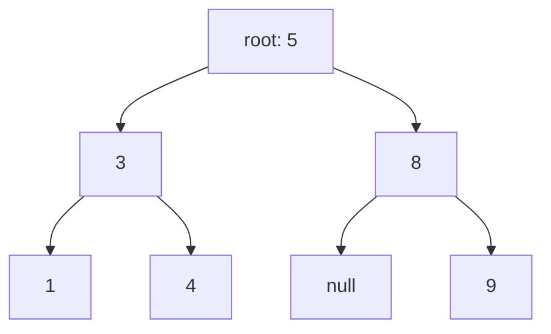

# Trees — recursion with a shape

Trees are where recursion stops being a trick and becomes the natural way to
express a problem. A tree is defined recursively — a node with subtrees that are
themselves trees — so a recursive solution usually falls out in five lines once
you ask the right question.

*In the Google round: trees show up as a clean recursion with a twist — LCA, serialize, validate, max path sum — and the follow-up is almost always "now the tree is huge / skewed / the nodes may be missing", which tests whether your return-to-parent contract survives contact with a hostile input.*

That question is almost always: **what do I need from my children, and what do I
return to my parent?** Get that right and the code writes itself. Get it vague
and you'll flail regardless of how well you know traversals.

---

## The costs

For a tree with n nodes and height h:

| Operation | Balanced | Worst case (a "stick") |
| --- | --- | --- |
| Search a **BST** | **O(log n)** | O(n) |
| Insert / delete in a BST | **O(log n)** | O(n) |
| Full traversal | **O(n)** | O(n) |
| Recursion stack space | **O(log n)** | **O(n)** |

**Height matters more than anything else here.** A balanced tree has
h ≈ log n; a degenerate one — inserting sorted data into an unbalanced BST — has
h = n, and every operation degrades to a linked list. That degeneration is the
entire reason self-balancing trees exist.

**Recursion depth is real space.** A recursive traversal is O(h) stack, so a
skewed tree of 10⁵ nodes overflows. Say it when it's relevant.

---

## How it actually works


*Every node is the root of its own subtree, which is why recursion fits: the solution for a node is expressed in terms of the same solution on smaller trees.*

### Who's who

| Term | Meaning |
| --- | --- |
| **Node** | `{ val, left, right }` |
| **Root** | The top node; the whole tree's handle |
| **Leaf** | A node with no children |
| **Height** | Longest path from a node down to a leaf. A leaf has height 0 |
| **Depth** | Distance from the root down to a node. The root has depth 0 |
| **Balanced** | Left and right heights differ by at most 1 at every node |
| **Binary tree** | Each node has at most two children |
| **BST** | A binary tree with the ordering invariant below |
| **Complete** | Every level full except possibly the last, filled left to right |

**Height and depth are measured in opposite directions** and are routinely
confused. Height goes down, depth goes down *to* you. If a problem says one,
check which it means.

### The BST invariant, stated correctly

For every node: **everything in the left subtree is less, everything in the
right subtree is greater** — not just the immediate children.

That "everything" is the whole point, and the reason naive BST validation is
wrong:

```js
// WRONG — only checks immediate children. Passes on a tree where a deep left
// descendant is larger than an ancestor.
function isBSTWrong(node) {
  if (!node) return true;
  if (node.left && node.left.val >= node.val) return false;
  if (node.right && node.right.val <= node.val) return false;
  return isBSTWrong(node.left) && isBSTWrong(node.right);
}

// RIGHT — carry the allowed range down. Each node narrows it for its children.
function isBST(node, min = -Infinity, max = Infinity) {
  if (!node) return true;
  if (node.val <= min || node.val >= max) return false;
  return isBST(node.left, min, node.val) && isBST(node.right, node.val, max);
}
```

Passing bounds down is a pattern in its own right, and it's the answer to a
whole family of tree problems.

---

## The four traversals, and what each is *for*

Learning the orders is easy. Knowing which to reach for is the part that gets
graded.

| Traversal | Order | Reach for it when |
| --- | --- | --- |
| **Inorder** | left, **node**, right | **A BST's inorder is sorted.** Validation, k-th smallest, sorted output |
| **Preorder** | **node**, left, right | Serialising, copying — you need the node before its subtrees exist |
| **Postorder** | left, right, **node** | You need the children's answers first: height, deletion, most tree DP |
| **Level order** | breadth-first | Per-level output, tree width, minimum depth |

The name tells you where the *node* goes relative to its children. That's the
entire mnemonic.

```js
function inorder(node, out = []) {
  if (!node) return out;
  inorder(node.left, out);
  out.push(node.val);        // move this line to change the traversal
  inorder(node.right, out);
  return out;
}
```

**Postorder is the one to internalise**, because most interesting tree problems
are postorder: you cannot compute a node's answer until both children have
reported theirs.

### Level order, and the batching trick

```js
function levelOrder(root) {
  if (!root) return [];
  const out = [], q = [root];
  let head = 0;                          // index pointer, not shift()
  while (head < q.length) {
    const size = q.length - head;        // freeze the level's size FIRST
    const level = [];
    for (let i = 0; i < size; i++) {     // exactly one level
      const node = q[head++];
      level.push(node.val);
      if (node.left) q.push(node.left);
      if (node.right) q.push(node.right);
    }
    out.push(level);
  }
  return out;
}
```

Freezing `size` before the inner loop is what separates the levels — the loop
appends the next level to the same array, so reading the length inside would run
away. **Zigzag level order** is this with `level.reverse()` on alternate rows.

---

## The recursive template

Nearly every tree problem fits this shape. Fill in three blanks.

```js
function solve(node) {
  if (!node) return BASE_CASE;              // 1. what does an empty tree return?
  const left = solve(node.left);            // 2. ask both children
  const right = solve(node.right);
  return COMBINE(left, right, node.val);    // 3. how do I combine?
}
```

Ask those three questions out loud and the code appears:

| Problem | Base case | Combine |
| --- | --- | --- |
| Height | `-1` (or 0 for node count) | `1 + max(left, right)` |
| Node count | `0` | `1 + left + right` |
| Sum | `0` | `node.val + left + right` |
| Is balanced | height `-1`, plus a flag | heights differ by ≤ 1 *and* both subtrees balanced |
| Max path sum | `0` | the return/record split, below |

### The return-versus-record split

The idea that makes "hard" tree problems easy. Sometimes **what you return to
your parent is not the answer you're computing.**

**Diameter of a binary tree** is the model. The diameter through a node is
`leftHeight + rightHeight`. But your parent can't use that — it needs your
*height* to compute its own path. So you return one thing and record another.

```js
function diameter(root) {
  let best = 0;                    // recorded: the answer, updated everywhere

  function height(node) {          // returned: what the PARENT needs
    if (!node) return 0;
    const l = height(node.left);
    const r = height(node.right);
    best = Math.max(best, l + r);  // record: the path THROUGH this node
    return 1 + Math.max(l, r);     // return: this node's height, for the parent
  }

  height(root);
  return best;
}
```

Two different values, one traversal. **Maximum path sum**, **longest univalue
path** and **house robber on a tree** are all this shape. When a tree problem
feels impossible, ask whether the thing you'd naturally return is different from
the thing you're measuring — it usually is, and separating them dissolves it.

---

## The problem families

### 1. Simple aggregation

Height, node count, sum, minimum depth, invert the tree. Straight recursive
template. Warm-ups, but write them until they're automatic.

**Minimum depth has a trap:** for a node with one child, `1 + min(left, right)`
returns 1, because the missing side is 0. A leaf is a node with *no* children,
so a one-child node must take the non-null side.

### 2. BST-specific

Exploit the ordering — if you're not, you're ignoring the premise.

- **Search / insert:** compare and go one way. O(h), not O(n).
- **Validate:** pass min/max bounds down, as above.
- **K-th smallest:** inorder traversal, stop at k. Don't collect everything.
- **Lowest common ancestor in a BST:** the first node whose value lies between
  the two targets. O(h) with no recursion into both sides.
- **Inorder successor:** if there's a right subtree, its leftmost node;
  otherwise the last ancestor you turned left from.

### 3. Structure and comparison

Same tree, symmetric tree, subtree of another, invert. Recurse on *pairs* of
nodes rather than one.

```js
function isSymmetric(root) {
  function mirror(a, b) {
    if (!a && !b) return true;              // both empty — fine
    if (!a || !b) return false;             // one empty — mismatch
    return a.val === b.val
        && mirror(a.left, b.right)          // OUTER pair
        && mirror(a.right, b.left);         // INNER pair — the crossover
  }
  return !root || mirror(root.left, root.right);
}
```

The crossed recursion is the whole idea: symmetry means left's left mirrors
right's right.

### 4. Path problems

Root-to-leaf sums, path sum with any start and end, all paths. Usually DFS
carrying state down, plus backtracking to undo it.

```js
// All root-to-leaf paths
function allPaths(root) {
  const out = [], path = [];
  function dfs(node) {
    if (!node) return;
    path.push(node.val);                                  // choose
    if (!node.left && !node.right) out.push([...path]);   // COPY — path mutates
    else { dfs(node.left); dfs(node.right); }
    path.pop();                                           // undo — backtracking
  }
  dfs(root);
  return out;
}
```

Pushing `path` itself rather than a copy is the bug: every entry ends up
pointing at the same array, which by the end is empty.

### 5. Construction

Build from inorder + preorder, or inorder + postorder. Preorder's first element
is the root; find it in inorder, and everything left of it is the left subtree.

**Use a hash map from value to inorder index.** Scanning inorder for the root
each time is O(n) per node and makes the whole build O(n²); the map makes it
O(n).

**You cannot build a unique tree from preorder + postorder alone** — inorder is
what tells you where the split is. That's a good thing to state unprompted.

### 6. Lowest common ancestor

For a general binary tree: postorder. If a node is either target, return it. If
both sides return non-null, this node is the LCA. If one side does, propagate it.

```js
function lca(node, p, q) {
  if (!node || node === p || node === q) return node;
  const l = lca(node.left, p, q);
  const r = lca(node.right, p, q);
  if (l && r) return node;      // targets are on opposite sides → this is it
  return l ?? r;                // both on one side, or neither
}
```

Five lines, and it's worth understanding rather than memorising: `l && r` means
the two targets diverge here, which is exactly what "lowest common ancestor"
means.

---

## Balanced trees, at interview depth

You will rarely implement one. You should be able to talk about them.

**The problem:** inserting sorted data into a plain BST produces a stick — every
node has one child, height is n, and every operation is O(n). Self-balancing
trees rotate on insert to keep the height O(log n).

| Tree | Character |
| --- | --- |
| **AVL** | Strictly balanced (heights differ by ≤1). Faster lookups, more rotations on write |
| **Red-black** | Loosely balanced. Fewer rotations, so better for write-heavy. What most standard libraries use |
| **B-tree / B+ tree** | High branching factor, so shallow. **This is what database indexes are** — the shallowness minimises disk reads |

**The connection worth making:** a database index is a B+ tree, and its
branching factor is chosen so a node fits one disk page. That's why an indexed
lookup is three or four reads rather than log₂(n) — a genuinely good thing to
say when a systems question meets a data-structures one. See
[databases](../04-data-cache/01-databases.md).

---

## The bugs

| Bug | Fix |
| --- | --- |
| **Missing the null base case** | Every recursive tree function starts `if (!node)` |
| **Validating a BST against immediate children only** | Pass min/max bounds down |
| **Confusing height with depth** | Height goes down to a leaf; depth comes down from the root |
| **Minimum depth with a one-child node** | `1 + min(l, r)` returns 1 wrongly; take the non-null side |
| **Pushing the path array instead of a copy** | `[...path]`, or every result aliases one array |
| **Forgetting to backtrack** | `path.pop()` after recursing |
| **Reading `queue.length` inside a level loop** | Freeze `size` first |
| **O(n²) tree construction** | Hash map from value to inorder index |
| **Stack overflow on a skewed tree** | Recursion is O(h); mention the iterative version |

---

## Practice ladder

| # | Problem | What it teaches |
| --- | --- | --- |
| 1 | Max depth of a binary tree | The recursive template, minimally |
| 2 | All four traversals, recursive | Where the node goes; what each is for |
| 3 | Level order traversal | The queue + level-batching idiom |
| 4 | Zigzag level order | The same, with alternating reversal |
| 5 | Same tree / symmetric tree | Recursing on pairs |
| 6 | Invert a binary tree | Structural mutation |
| 7 | Balanced binary tree | Returning height *and* a validity flag |
| 8 | Diameter of a binary tree | **Return vs record** — the key idea |
| 9 | Validate a BST | Passing bounds down |
| 10 | K-th smallest in a BST | Inorder is sorted; stop early |
| 11 | LCA in a BST, then in a general tree | O(h) via ordering, then the postorder version |
| 12 | Build tree from inorder + preorder | Construction, and the index map |
| 13 | Path sum II (all root-to-leaf paths) | Backtracking on a tree; copy the path |
| 14 | Binary tree maximum path sum | Return vs record, harder combine |
| 15 | Inorder traversal, **iteratively** | Making the implicit stack explicit |

**Exit test:** solve diameter and explain the return-versus-record split in your
own words. That one idea unlocks rungs 14 and most "hard" tree problems; without
it they stay mysterious.

---

## Data structures

| Need | Use | Note |
| --- | --- | --- |
| A node | `{ val, left, right }` | Usually supplied by the interviewer |
| Recursive traversal | The call stack | O(h) space. Fine for balanced trees |
| Iterative traversal | `Array` as an explicit stack | Needed when h could be ~n |
| Level order | `Array` + index pointer | Never `shift()` — it's O(n) |
| Inorder index lookup | `Map` value → index | Turns O(n²) construction into O(n) |
| Recording a global best | A closure variable | Cleaner than threading an accumulator through returns |
| Serialising | Preorder with explicit nulls | `"1,2,#,#,3"` — the nulls are what make it decodable |

**Pseudocode — iterative inorder, since "do it without recursion" is a standard follow-up**

```js
function inorderIterative(root) {
  const out = [], stack = [];
  let curr = root;

  while (curr || stack.length) {
    // Go as far left as possible, stacking the path. These are nodes we've
    // arrived at but NOT yet output — inorder means left subtree first.
    while (curr) { stack.push(curr); curr = curr.left; }

    // Nothing further left: the top of the stack is the next node in order.
    curr = stack.pop();
    out.push(curr.val);

    // Its left is done and itself is emitted, so the right subtree is next.
    curr = curr.right;
  }
  return out;
}
```

This is literally the call stack made explicit — the `stack` holds exactly the
frames recursion would have. Understanding that equivalence is more valuable
than memorising the loop, because it generalises to converting any recursive
traversal when depth is a risk.

---

## Worked problems

Four problems Google actually asks on trees at senior level. Each one is the
recursive template above with a different answer to "what do I return to my
parent" — and each has a follow-up that turns a clean recursion into something
that has to survive scale or a hostile input.

### Q: Lowest common ancestor — given two nodes in a binary tree, return the deepest node that is an ancestor of both
**Level:** intermediate · **Tags:** google-coding, trees, recursion, lca

<details><summary>Model answer</summary>

**Problem.** A binary tree (no parent pointers, not a BST) and two node
references `p` and `q` that are guaranteed to be in it. Return the lowest node
that has both as descendants, where a node counts as its own descendant.
Example: for the tree `3 → (5 → (6, 2 → (7, 4)), 1 → (0, 8))`, LCA(5, 1) = 3
and LCA(5, 4) = 5.

**Clarify first.** Are `p` and `q` guaranteed present? (Yes — otherwise the
answer changes, see follow-up.) Can `p === q`? (Assume yes; the answer is the
node itself.) Values unique? (Assume we compare node identity, not value, so it
doesn't matter.)

**Brute force.** Find the root-to-`p` path and the root-to-`q` path — two
O(n) searches that build lists — then walk both from the root until they
diverge. O(n) time, O(h) extra space for the paths. Works, but it's two passes
and it tells the interviewer you haven't seen the single-pass idea.

**The insight.** Ask each subtree one question: "do you contain `p` or `q` (or
an LCA already)?" A subtree answers by returning the node it found, or `null`.
If the left and right subtrees *both* return something, the current node is
where the two searches meet — it's the LCA. If only one side returns something,
pass that up unchanged. The first node to see non-null from both sides is the
lowest one, because recursion resolves bottom-up.

**Algorithm.**
1. If the node is null, or is `p` or `q`, return the node.
2. Recurse left and right.
3. If both are non-null, return the current node.
4. Otherwise return whichever side was non-null.

```js
function lowestCommonAncestor(root, p, q) {
  if (root === null || root === p || root === q) return root;
  const left = lowestCommonAncestor(root.left, p, q);
  const right = lowestCommonAncestor(root.right, p, q);
  if (left !== null && right !== null) return root;   // p and q split here
  return left !== null ? left : right;                // pass the find upward
}
```

**Complexity.** O(n) time — every node visited once. O(h) space for the
recursion stack, which is O(n) on a degenerate tree.

**Test it.**
- `p` and `q` in different subtrees → the split node.
- `p` is an ancestor of `q` → returns `p` as soon as it's hit; the subtree
  under it is never searched, which is correct because `q` must be inside.
- `p === q` → returns that node.
- A single-node tree where `p = q = root`.

**What the interviewer is checking.** That you can phrase a recursive contract
in one sentence ("return the node you found, or null"), and that you notice
step 1 short-circuits for the ancestor case without a special branch.

</details>

**Follow-ups:**

1. Q: The tree is a BST. Can you do better?
   <details><summary>Answer</summary>

   Yes — use the ordering to walk instead of search. From the root: if both
   values are smaller than the current node, go left; if both larger, go right;
   otherwise the current node is the split point and therefore the LCA. That's
   O(h) time and O(1) space iteratively, versus O(n) for the general tree.

   ```js
   function lcaBST(root, p, q) {
     let node = root;
     while (node) {
       if (p.val < node.val && q.val < node.val) node = node.left;
       else if (p.val > node.val && q.val > node.val) node = node.right;
       else return node;
     }
     return null;
   }
   ```

   </details>

2. Q: `p` or `q` might not be in the tree. What changes?
   <details><summary>Answer</summary>

   The elegant version breaks: if only `p` exists, it returns `p` and claims
   that's the LCA. Fix by making the recursion also count how many of the two
   targets it saw. Return `[node, count]`; only accept the result at the top if
   `count === 2`. Same O(n), one extra integer up the stack.

   ```js
   function lcaMaybeMissing(root, p, q) {
     let answer = null;
     function walk(node) {                 // returns how many of {p, q} are below
       if (!node) return 0;
       let found = walk(node.left) + walk(node.right);
       if (node === p || node === q) found++;
       if (found === 2 && answer === null) answer = node;
       return found;
     }
     return walk(root) === 2 ? answer : null;
   }
   ```

   The first node where `found` reaches 2 is the lowest, because children are
   resolved before parents.

   </details>

3. Q: Nodes have parent pointers and you're given `p` and `q` only, no root.
   <details><summary>Answer</summary>

   It becomes the linked-list intersection problem. Walk up from both; when one
   pointer reaches null, redirect it to the other's start. Both pointers travel
   exactly `depth(p) + depth(q)` steps and meet at the LCA. O(h) time, O(1)
   space, no depth computation needed.

   </details>

### Q: Serialize and deserialize a binary tree — encode to a string and decode back to the identical structure
**Level:** senior · **Tags:** google-coding, trees, recursion, design

<details><summary>Model answer</summary>

**Problem.** Write `serialize(root) → string` and `deserialize(string) →
root` such that `deserialize(serialize(t))` is structurally identical to `t`.
Values are integers, possibly negative. Example: the tree `1 → (2, 3 → (4, 5))`
might become `"1,2,#,#,3,4,#,#,5,#,#"`.

**Clarify first.** Integer values only, or arbitrary strings? (Integers; if
strings, we'd need an escaping scheme or length prefixes.) Is the format ours
to choose? (Yes — the interviewer wants a correct round-trip, not a specific
encoding.) How big — does it need to stream? (Assume it fits in memory; see
follow-up.)

**Brute force.** Record both an inorder and a preorder traversal and rebuild
from the pair. It works only when values are unique, it's two lists, and the
reconstruction is O(n²) without a hash map. It's the answer people give when
they remember a textbook exercise rather than thinking about the problem.

**The insight.** A preorder traversal *with explicit null markers* is enough on
its own. The nulls tell the decoder where each subtree ends, so a single
recursive read that consumes tokens in the same order the encoder produced them
rebuilds the tree exactly. The encoder and decoder are mirror images of each
other.

**Algorithm.**
1. Serialize: preorder DFS; emit the value, or `#` for null; join with commas.
2. Deserialize: split into tokens; keep a cursor; a recursive `build()` reads
   one token, returns null for `#`, otherwise creates the node and calls
   `build()` for left then right.

```js
function serialize(root) {
  const out = [];
  (function walk(node) {
    if (node === null) { out.push('#'); return; }
    out.push(String(node.val));
    walk(node.left);
    walk(node.right);
  })(root);
  return out.join(',');
}

function deserialize(data) {
  const tokens = data.split(',');
  let i = 0;                                   // shared cursor — the whole trick
  function build() {
    const t = tokens[i++];
    if (t === '#') return null;
    const node = { val: Number(t), left: null, right: null };
    node.left = build();                       // consumes exactly the left subtree
    node.right = build();
    return node;
  }
  return build();
}
```

**Complexity.** O(n) time and O(n) output for both directions. O(h) stack.

**Test it.**
- Empty tree → `"#"` → null.
- Single node `7` → `"7,#,#"`.
- Negative values: `-3` must not be confused with a delimiter — it isn't, since
  we split on commas.
- A left-skewed chain of 3: `"1,2,3,#,#,#,#"`; trace that the cursor lands on
  the right token for each right child.

**What the interviewer is checking.** Whether you see that null markers make
preorder self-delimiting, and whether the decoder's cursor is shared state
rather than passed and returned (a common source of bugs).

</details>

**Follow-ups:**

1. Q: Make it more compact — the `#` markers double the length on a full tree.
   <details><summary>Answer</summary>

   For a **BST** you can drop the nulls entirely: serialize preorder values
   only, and on decode use bounds `(lo, hi)` — a value outside the bounds
   belongs to an ancestor's other subtree, so the current subtree is finished.
   O(n) both ways with no markers.

   For a general tree, level-order with nulls only for *missing children of
   present nodes* (the LeetCode format) trims trailing nulls, and a binary
   encoding (fixed-width ints, a bit per null) gets you the rest. Say the BST
   version first — it's the one with an algorithmic idea in it.

   </details>

2. Q: The tree has a million nodes and the string can't be built in memory. Stream it.
   <details><summary>Answer</summary>

   Replace `out.push` with a write to a stream and `tokens[i++]` with a token
   reader that pulls the next token from the input as needed. The recursion is
   unchanged — preorder produces and consumes tokens strictly in order, which is
   what makes it streamable. The remaining risk is recursion depth on a skewed
   tree; convert the decoder to an explicit stack of "nodes waiting for a
   child" if that's a concern.

   </details>

### Q: Validate a binary search tree — return whether every node's value respects the BST ordering
**Level:** intermediate · **Tags:** google-coding, trees, bst, recursion

<details><summary>Model answer</summary>

**Problem.** A binary tree is a valid BST if, for every node, all values in
its left subtree are strictly less than it and all in its right subtree are
strictly greater. Return true/false. Example: `5 → (1, 4 → (3, 6))` is
**invalid** — 4 is in 5's right subtree but 4 < 5.

**Clarify first.** Are duplicates allowed, and if so which side do they go?
(Assume strict — no duplicates.) Value range — can I use `-Infinity`/`Infinity`
as sentinels, or might the values be at the limits? (Assume JS numbers; using
`±Infinity` is safe. If values were 64-bit ints at the extremes, use `null` for
"no bound".)

**Brute force.** For every node, scan its whole left subtree for a max and its
right subtree for a min. O(n²) on a skewed tree. And the *wrong* answer — the
one that fails the example — is checking only `left.val < node.val <
right.val`, which is a local property and not the BST invariant.

**The insight.** Every node lives inside a range `(lo, hi)` inherited from its
ancestors. Going left tightens `hi` to the current value; going right tightens
`lo`. A node is valid if it's inside its range. That's the whole invariant,
carried down the recursion.

**Algorithm.**
1. `valid(node, lo, hi)`: null is valid.
2. If `node.val <= lo` or `node.val >= hi`, invalid.
3. Recurse left with `(lo, node.val)` and right with `(node.val, hi)`.

```js
function isValidBST(root) {
  function valid(node, lo, hi) {
    if (node === null) return true;
    if (node.val <= lo || node.val >= hi) return false;   // strict on both sides
    return valid(node.left, lo, node.val) && valid(node.right, node.val, hi);
  }
  return valid(root, -Infinity, Infinity);
}
```

**Complexity.** O(n) time, O(h) space.

**Test it.**
- The example above → false (4 is checked against `(5, ∞)`).
- `2 → (1, 3)` → true.
- Duplicates `2 → (2, null)` → false under strict rules.
- A single node → true. A node with value `-Infinity`? Not a real input, but
  it's why some interviewers prefer `null` sentinels — say so if asked.

**What the interviewer is checking.** That you distinguish a local check from
a global invariant, and that the bounds are *exclusive* on both sides.

</details>

**Follow-ups:**

1. Q: Do it without passing bounds.
   <details><summary>Answer</summary>

   Inorder traversal of a BST is strictly increasing. Walk inorder keeping the
   previous value; the first time `node.val <= prev`, it's invalid. Iterative
   with an explicit stack keeps it O(h) space and avoids deep recursion:

   ```js
   function isValidBST(root) {
     const stack = [];
     let node = root, prev = -Infinity;
     while (node || stack.length) {
       while (node) { stack.push(node); node = node.left; }
       node = stack.pop();
       if (node.val <= prev) return false;
       prev = node.val;
       node = node.right;
     }
     return true;
   }
   ```

   </details>

2. Q: Now find the two nodes that were swapped in an otherwise valid BST, and fix it in place.
   <details><summary>Answer</summary>

   Same inorder walk. A swap produces one or two "descents" where `prev >
   current`. Record the first bad `prev` as `first`, and the *latest* bad
   `current` as `second` (adjacent swaps produce only one descent, so `second`
   is set on the same step). Swap their values at the end. O(n) time, O(h)
   space; Morris traversal makes it O(1) if pressed.

   </details>

### Q: Binary tree maximum path sum — the largest sum along any path between two nodes
**Level:** senior · **Tags:** google-coding, trees, recursion, dp-on-trees

<details><summary>Model answer</summary>

**Problem.** A path is any sequence of nodes where each pair is connected by
an edge, going through each node at most once. It doesn't need to pass through
the root or end at a leaf. Values can be negative. Return the maximum sum.
Example: `-10 → (9, 20 → (15, 7))` → 42, the path `15 → 20 → 7`.

**Clarify first.** Can the path be a single node? (Yes — and it must be, for
an all-negative tree.) Are values bounded? (Assume normal integers.) Empty tree
— return 0 or throw? (Assume at least one node.)

**Brute force.** For every node as the "top" of the path, compute the best
downward chain on the left and right separately, then combine. Done naively
that's O(n²), because each best-chain computation walks the subtree again.

**The insight.** Two different quantities are needed, and conflating them is
the classic mistake. What a node *returns to its parent* is the best
single-direction chain starting at it (it can only continue up one way). What a
node *records as a candidate answer* is left chain + itself + right chain — a
path that bends at this node and therefore can't extend further up. Negative
chains contribute nothing, so clamp them to 0.

**Algorithm.**
1. `gain(node)`: null → 0.
2. `left = max(0, gain(node.left))`, `right = max(0, gain(node.right))`.
3. Update the global best with `left + node.val + right`.
4. Return `node.val + max(left, right)` to the parent.

```js
function maxPathSum(root) {
  let best = -Infinity;
  function gain(node) {                     // best chain going DOWN from node
    if (node === null) return 0;
    const left = Math.max(0, gain(node.left));    // a negative chain is worth skipping
    const right = Math.max(0, gain(node.right));
    best = Math.max(best, left + node.val + right); // the path bends here
    return node.val + Math.max(left, right);       // only one side can continue up
  }
  gain(root);
  return best;
}
```

**Complexity.** O(n) time, O(h) space.

**Test it.**
- The example → 42.
- Single node `-3` → -3 (the `-Infinity` seed and the clamp make this work;
  seeding `best = 0` is the bug).
- `2 → (-1, null)` → 2, because the -1 chain is clamped.
- A chain `1 → 2 → 3` (all left children) → 6.

**What the interviewer is checking.** The return-versus-record distinction. If
you can say "I return one thing and record another" before writing code, the
round is mostly won.

</details>

**Follow-ups:**

1. Q: Return the path itself, not just the sum.
   <details><summary>Answer</summary>

   Have `gain` return `[sum, chainNodes]` for the best downward chain, and when
   updating `best`, store `leftChain.reverse() + [node] + rightChain`. Space
   becomes O(n) for the stored lists; time stays O(n) if you build lists by
   appending and reverse once at the end rather than concatenating at every
   level (concatenation would be O(n²) on a skewed tree).

   </details>

2. Q: Same idea, different question: diameter of the tree, and "longest path where consecutive values differ by 1".
   <details><summary>Answer</summary>

   Same skeleton. Diameter returns `1 + max(left, right)` as height and records
   `left + right` as a candidate. The "consecutive values" variant returns the
   chain length only if the child's value is `node.val ± 1`, else 0. Once you
   see this as "DP on trees with a return value and a side channel", a whole
   family of problems collapses into one template.

   </details>

---

## Interview Q&A

### Q: Find the diameter of a binary tree.
**Level:** intermediate · **Tags:** dsa, trees, recursion

<details><summary>Model answer</summary>

The diameter is the longest path between any two nodes, and that path doesn't
have to pass through the root — which is the thing that makes it more than a
warm-up.

The observation is that for any node, the longest path *through* that node is
its left subtree's height plus its right subtree's height. So the answer is the
maximum of that quantity over every node.

The implementation detail that makes it clean is that the value I return to my
parent is not the value I'm computing. My parent needs my height, to compute its
own path. But the diameter through me is left plus right. So I return the height
and separately record the diameter into a variable in the enclosing scope,
updating it at every node.

That gives one postorder traversal, O(n) time, O(h) space for the recursion —
O(log n) balanced, O(n) on a skewed tree.

The general lesson, which is why I like this problem, is the return-versus-record
split. When a tree problem feels impossible, it's usually because the thing you
naturally return differs from the thing you're measuring. Maximum path sum is
the same shape: return the best single-branch path so the parent can extend it,
record the best path that turns at this node.

</details>

**Follow-ups:**

1. Q: Now do maximum path sum, where values can be negative.
   <details><summary>Answer</summary>

   Same structure, with one extra decision, and the negatives are what create
   it.

   At each node I compute the best downward path through the left child and
   through the right. If either is negative, I take zero instead — meaning I
   decline to extend into that subtree, because including a negative branch only
   makes the path worse. That `Math.max(0, ...)` is the whole difference from
   diameter.

   Then I record `node.val + left + right` as a candidate answer — the path that
   turns at this node and goes down both sides. And I return
   `node.val + Math.max(left, right)` to my parent, because a path continuing
   upward can only use one branch; it can't come down the left and go back up
   through me and down the right.

   The edge case is a tree of all negative values. The answer should be the
   single largest node, not zero, so I initialise the global best to `-Infinity`
   rather than 0 and always record `node.val + left + right` even when both
   children contribute zero.

   O(n) time, O(h) space.

   </details>

2. Q: Why can't you validate a BST by checking each node against its children?
   <details><summary>Answer</summary>

   Because the BST property is about entire subtrees, not immediate children.
   Every value in the left subtree must be less than the node, not just the left
   child.

   The counterexample is small: root 10, left child 5, and 5's right child is
   12. Every local check passes — 5 is less than 10, 12 is greater than 5 — but
   12 sits in 10's left subtree while being larger than 10, so it's not a valid
   BST. An inorder traversal would produce 5, 12, 10, which isn't sorted.

   The fix is to carry an allowed range down. The root may be anything; going
   left, the upper bound becomes the node's value; going right, the lower bound
   does. Each node checks it's inside its inherited range and narrows it for its
   children.

   The alternative is an inorder traversal checking the sequence is strictly
   increasing, which works because a BST's inorder is sorted by definition. I'd
   mention both — the bounds version doesn't need to materialise anything and
   short-circuits earlier.

   The detail worth stating is strictness: whether duplicates are allowed, and
   if so which side they go. It changes `<` to `<=` and it's a fair thing to
   ask about rather than assume.

   </details>

---

## What a weak answer sounds like

- **Reciting traversal orders** without knowing what each is *for* — especially
  not knowing that a BST's inorder is sorted.
- **Validating a BST against immediate children.**
- **Not knowing recursion costs O(h) stack**, or claiming a tree solution is
  O(1) space.
- **Assuming the tree is balanced.** Say "O(log n) if balanced, O(n) if skewed".
- **Struggling with diameter or max path sum** because return and record haven't
  been separated.
- **O(n²) construction** by scanning inorder for the root at every step.
- **Pushing the mutable path array** into results instead of a copy.
- **Ignoring the BST property** on a BST problem — if you're doing a full
  traversal to search, you've thrown away the premise.

---

## Glossary

- **Root / leaf** — the top node / a node with no children.
- **Height** — longest path down to a leaf.
- **Depth** — distance from the root down to a node.
- **Balanced** — subtree heights differ by at most 1 at every node.
- **BST invariant** — every value in the left subtree is less, every value in the right is greater.
- **Inorder / preorder / postorder** — node visited between / before / after its children.
- **Level order** — breadth-first, one level at a time.
- **Return vs record** — returning what the parent needs while separately recording the answer.
- **Bounds passing** — carrying min/max down the recursion, as in BST validation.
- **Skewed / degenerate tree** — every node has one child; height n, so operations become O(n).
- **AVL / red-black tree** — self-balancing BSTs; strict versus loose balance.
- **B+ tree** — high-branching, shallow tree used for database indexes.
- **Serialisation** — encoding a tree as a sequence, with explicit nulls so it can be decoded.

---

## Exercises

`TreeNode` is predefined (`val`, `left`, `right`). Tests write trees in level
order with `null` for a missing child — `[3, 9, 20, null, null, 15, 7]` — the
LeetCode convention; a tree you return is read back the same way. Problems
marked **core** are the must-solve set.

### Exercise: Maximum depth
**Level:** foundation · **Topic:** recursion: 1 + max(left, right) · **Hint:** An empty tree has depth 0.
**Function:** `maxDepth(root: TreeNode | null): number`
**Core:** true · **Adapter:** tree

Return the number of nodes on the longest root-to-leaf path. `[3,9,20,null,null,15,7]` → `3`.

```tests
[{"args": [[3, 9, 20, null, null, 15, 7]], "expected": 3},
 {"args": [[]], "expected": 0},
 {"args": [[1, null, 2]], "expected": 2},
 {"args": [[1]], "expected": 1},
 {"gen": "[Array.from({length: 100000}, (_, i) => i)]", "perf": true, "label": "n = 100,000, complete tree"}]
```

<details><summary>Solution</summary>

```ts
function maxDepth(root: TreeNode | null): number {
  return root === null ? 0 : 1 + Math.max(maxDepth(root.left), maxDepth(root.right));
}
```
</details>

### Exercise: Preorder, inorder and postorder
**Level:** foundation · **Topic:** where the node goes relative to its children · **Hint:** Same recursion three times — only the position of the visit changes.
**Function:** `traversals(root: TreeNode | null): number[][]`
**Core:** true · **Adapter:** tree

Return `[preorder, inorder, postorder]`. `[1,2,3,4,5]` → `[[1,2,4,5,3],[4,2,5,1,3],[4,5,2,3,1]]`.

```tests
[{"args": [[1, 2, 3, 4, 5]], "expected": [[1, 2, 4, 5, 3], [4, 2, 5, 1, 3], [4, 5, 2, 3, 1]]},
 {"args": [[]], "expected": [[], [], []]},
 {"args": [[1, null, 2, 3]], "expected": [[1, 2, 3], [1, 3, 2], [3, 2, 1]]}]
```

<details><summary>Solution</summary>

```ts
function traversals(root: TreeNode | null): number[][] {
  const pre: number[] = [], ino: number[] = [], post: number[] = [];
  const go = (n: TreeNode | null) => {
    if (!n) return;
    pre.push(n.val); go(n.left); ino.push(n.val); go(n.right); post.push(n.val);
  };
  go(root);
  return [pre, ino, post];
}
```
</details>

### Exercise: Level order traversal
**Level:** foundation · **Topic:** BFS with a queue, one level per batch · **Hint:** Record the queue's length before draining a level.
**Function:** `levelOrder(root: TreeNode | null): number[][]`
**Core:** true · **Adapter:** tree

Return the values level by level. `[3,9,20,null,null,15,7]` → `[[3],[9,20],[15,7]]`.

```tests
[{"args": [[3, 9, 20, null, null, 15, 7]], "expected": [[3], [9, 20], [15, 7]]},
 {"args": [[]], "expected": []},
 {"args": [[1]], "expected": [[1]]},
 {"args": [[1, 2, 3, 4, null, null, 5]], "expected": [[1], [2, 3], [4, 5]]}]
```

<details><summary>Solution</summary>

```ts
function levelOrder(root: TreeNode | null): number[][] {
  const out: number[][] = [];
  let level = root ? [root] : [];
  while (level.length) {
    out.push(level.map((n) => n.val));
    level = level.flatMap((n) => [n.left, n.right]).filter((n): n is TreeNode => n !== null);
  }
  return out;
}
```
</details>

### Exercise: Zigzag level order
**Level:** intermediate · **Topic:** level order with alternating reversal · **Hint:** Reverse every other level before recording it.
**Function:** `zigzagLevelOrder(root: TreeNode | null): number[][]`
**Adapter:** tree

Level order, but alternate left→right and right→left. `[3,9,20,null,null,15,7]` → `[[3],[20,9],[15,7]]`.

```tests
[{"args": [[3, 9, 20, null, null, 15, 7]], "expected": [[3], [20, 9], [15, 7]]},
 {"args": [[]], "expected": []},
 {"args": [[1, 2, 3, 4, 5, 6, 7]], "expected": [[1], [3, 2], [4, 5, 6, 7]]}]
```

<details><summary>Solution</summary>

```ts
function zigzagLevelOrder(root: TreeNode | null): number[][] {
  const out: number[][] = [];
  let level = root ? [root] : [], ltr = true;
  while (level.length) {
    const vals = level.map((n) => n.val);
    out.push(ltr ? vals : vals.reverse());
    ltr = !ltr;
    level = level.flatMap((n) => [n.left, n.right]).filter((n): n is TreeNode => n !== null);
  }
  return out;
}
```
</details>

### Exercise: Symmetric tree
**Level:** foundation · **Topic:** recurse on mirrored pairs · **Hint:** Compare left.left with right.right and left.right with right.left.
**Function:** `isSymmetric(root: TreeNode | null): boolean`
**Adapter:** tree

Is the tree a mirror of itself? `[1,2,2,3,4,4,3]` → `true`; `[1,2,2,null,3,null,3]` → `false`.

```tests
[{"args": [[1, 2, 2, 3, 4, 4, 3]], "expected": true},
 {"args": [[1, 2, 2, null, 3, null, 3]], "expected": false},
 {"args": [[]], "expected": true},
 {"args": [[1]], "expected": true}]
```

<details><summary>Solution</summary>

```ts
function isSymmetric(root: TreeNode | null): boolean {
  const mirror = (a: TreeNode | null, b: TreeNode | null): boolean =>
    a === null || b === null ? a === b : a.val === b.val && mirror(a.left, b.right) && mirror(a.right, b.left);
  return root === null || mirror(root.left, root.right);
}
```
</details>

### Exercise: Invert a binary tree
**Level:** foundation · **Topic:** swap children, recurse · **Hint:** Every node's left and right trade places.
**Function:** `invertTree(root: TreeNode | null): TreeNode | null`
**Adapter:** tree

Mirror the tree and return its root. `[4,2,7,1,3,6,9]` → `[4,7,2,9,6,3,1]`.

```tests
[{"args": [[4, 2, 7, 1, 3, 6, 9]], "expected": [4, 7, 2, 9, 6, 3, 1]},
 {"args": [[]], "expected": []},
 {"args": [[2, 1]], "expected": [2, null, 1]}]
```

<details><summary>Solution</summary>

```ts
function invertTree(root: TreeNode | null): TreeNode | null {
  if (root) [root.left, root.right] = [invertTree(root.right), invertTree(root.left)];
  return root;
}
```
</details>

### Exercise: Balanced binary tree
**Level:** intermediate · **Topic:** return height, or −1 for unbalanced · **Hint:** One pass: each call returns its height, or a sentinel meaning 'already unbalanced'.
**Function:** `isBalanced(root: TreeNode | null): boolean`
**Adapter:** tree

Balanced means every node's subtrees differ in height by at most 1. `[3,9,20,null,null,15,7]` → `true`; `[1,2,2,3,3,null,null,4,4]` → `false`.

```tests
[{"args": [[3, 9, 20, null, null, 15, 7]], "expected": true},
 {"args": [[1, 2, 2, 3, 3, null, null, 4, 4]], "expected": false},
 {"args": [[]], "expected": true},
 {"args": [[1, null, 2, null, 3]], "expected": false}]
```

<details><summary>Solution</summary>

```ts
function isBalanced(root: TreeNode | null): boolean {
  const h = (n: TreeNode | null): number => {
    if (!n) return 0;
    const l = h(n.left); if (l < 0) return -1;
    const r = h(n.right); if (r < 0) return -1;
    return Math.abs(l - r) > 1 ? -1 : 1 + Math.max(l, r);
  };
  return h(root) >= 0;
}
```
</details>

### Exercise: Diameter of a binary tree
**Level:** intermediate · **Topic:** return height, record the best path · **Hint:** The path through a node is left height + right height.
**Function:** `diameterOfBinaryTree(root: TreeNode | null): number`
**Core:** true · **Adapter:** tree

Return the number of **edges** on the longest path between any two nodes. `[1,2,3,4,5]` → `3`.

```tests
[{"args": [[1, 2, 3, 4, 5]], "expected": 3},
 {"args": [[1, 2]], "expected": 1},
 {"args": [[]], "expected": 0},
 {"args": [[1, 2, null, 3, 4, 5, null, null, 6]], "expected": 4}]
```

<details><summary>Solution</summary>

```ts
function diameterOfBinaryTree(root: TreeNode | null): number {
  let best = 0;
  const h = (n: TreeNode | null): number => {
    if (!n) return 0;
    const l = h(n.left), r = h(n.right);
    best = Math.max(best, l + r);
    return 1 + Math.max(l, r);
  };
  h(root);
  return best;
}
```
</details>

### Exercise: Validate a BST
**Level:** intermediate · **Topic:** pass the allowed (low, high) range down · **Hint:** Checking only a node against its children misses violations further down.
**Function:** `isValidBST(root: TreeNode | null): boolean`
**Core:** true · **Adapter:** tree

Every node's left subtree holds smaller values and right subtree larger (strictly). `[2,1,3]` → `true`; `[5,1,4,null,null,3,6]` → `false`.

```tests
[{"args": [[2, 1, 3]], "expected": true},
 {"args": [[5, 1, 4, null, null, 3, 6]], "expected": false},
 {"args": [[5, 4, 6, null, null, 3, 7]], "expected": false, "label": "the 3 is deep in the right subtree"},
 {"args": [[]], "expected": true},
 {"args": [[1, 1]], "expected": false}]
```

<details><summary>Solution</summary>

```ts
function isValidBST(root: TreeNode | null): boolean {
  const ok = (n: TreeNode | null, lo: number, hi: number): boolean =>
    n === null || (n.val > lo && n.val < hi && ok(n.left, lo, n.val) && ok(n.right, n.val, hi));
  return ok(root, -Infinity, Infinity);
}
```
</details>

### Exercise: K-th smallest in a BST
**Level:** intermediate · **Topic:** inorder is sorted; stop early · **Hint:** Walk inorder and count.
**Function:** `kthSmallest(root: TreeNode | null, k: number): number`
**Adapter:** tree

Return the k-th smallest value (1-indexed). `[3,1,4,null,2], 1` → `1`; `[5,3,6,2,4,null,null,1], 3` → `3`.

```tests
[{"args": [[3, 1, 4, null, 2], 1], "expected": 1},
 {"args": [[5, 3, 6, 2, 4, null, null, 1], 3], "expected": 3},
 {"args": [[1], 1], "expected": 1},
 {"args": [[2, 1, 3], 3], "expected": 3}]
```

<details><summary>Solution</summary>

```ts
function kthSmallest(root: TreeNode | null, k: number): number {
  const st: TreeNode[] = [];
  let cur = root;
  while (cur || st.length) {
    while (cur) { st.push(cur); cur = cur.left; }
    cur = st.pop()!;
    if (--k === 0) return cur.val;
    cur = cur.right;
  }
  return -1;
}
```
</details>

### Exercise: Lowest common ancestor
**Level:** intermediate · **Topic:** postorder: return what each subtree found · **Hint:** If p and q come back from different sides, this node is the answer.
**Function:** `lowestCommonAncestor(root: TreeNode | null, p: number, q: number): number`
**Core:** true · **Adapter:** tree

Values are unique and both `p` and `q` exist. Return the **value** of their lowest common ancestor.
`[3,5,1,6,2,0,8,null,null,7,4], 5, 1` → `3`; with `5, 4` → `5`.

```tests
[{"args": [[3, 5, 1, 6, 2, 0, 8, null, null, 7, 4], 5, 1], "expected": 3},
 {"args": [[3, 5, 1, 6, 2, 0, 8, null, null, 7, 4], 5, 4], "expected": 5},
 {"args": [[1, 2], 1, 2], "expected": 1},
 {"args": [[3, 5, 1, 6, 2, 0, 8, null, null, 7, 4], 7, 8], "expected": 3}]
```

<details><summary>Solution</summary>

```ts
function lowestCommonAncestor(root: TreeNode | null, p: number, q: number): number {
  const go = (n: TreeNode | null): TreeNode | null => {
    if (!n || n.val === p || n.val === q) return n;
    const l = go(n.left), r = go(n.right);
    return l && r ? n : l ?? r;
  };
  return go(root)!.val;
}
```
</details>

### Exercise: Build a tree from preorder and inorder
**Level:** senior · **Topic:** index map into inorder; recurse on ranges · **Hint:** Preorder's first value is the root; its position in inorder splits the subtrees.
**Function:** `buildTree(preorder: number[], inorder: number[]): TreeNode | null`
**Adapter:** tree-out

Values are unique. Rebuild the tree. `[3,9,20,15,7], [9,3,15,20,7]` → `[3,9,20,null,null,15,7]`.

```tests
[{"args": [[3, 9, 20, 15, 7], [9, 3, 15, 20, 7]], "expected": [3, 9, 20, null, null, 15, 7]},
 {"args": [[-1], [-1]], "expected": [-1]},
 {"args": [[], []], "expected": []},
 {"args": [[1, 2, 3], [3, 2, 1]], "expected": [1, 2, null, 3]}]
```

<details><summary>Solution</summary>

```ts
function buildTree(preorder: number[], inorder: number[]): TreeNode | null {
  const at = new Map(inorder.map((v, i) => [v, i] as const));
  let p = 0;
  const go = (lo: number, hi: number): TreeNode | null => {
    if (lo > hi) return null;
    const val = preorder[p++];
    const node = new TreeNode(val);
    node.left = go(lo, at.get(val)! - 1);
    node.right = go(at.get(val)! + 1, hi);
    return node;
  };
  return go(0, inorder.length - 1);
}
```
</details>

### Exercise: Path sum II — every root-to-leaf path
**Level:** intermediate · **Topic:** backtracking on a tree; copy the path · **Hint:** Push on the way down, pop on the way up, copy when you reach a matching leaf.
**Function:** `pathSum(root: TreeNode | null, target: number): number[][]`
**Adapter:** tree

Return every root-to-leaf path whose values sum to `target`, left paths first.
`[5,4,8,11,null,13,4,7,2,null,null,5,1], 22` → `[[5,4,11,2],[5,8,4,5]]`.

```tests
[{"args": [[5, 4, 8, 11, null, 13, 4, 7, 2, null, null, 5, 1], 22], "expected": [[5, 4, 11, 2], [5, 8, 4, 5]]},
 {"args": [[1, 2, 3], 5], "expected": []},
 {"args": [[1, 2], 1], "expected": []},
 {"args": [[], 0], "expected": []}]
```

<details><summary>Solution</summary>

```ts
function pathSum(root: TreeNode | null, target: number): number[][] {
  const out: number[][] = [], path: number[] = [];
  const go = (n: TreeNode | null, left: number) => {
    if (!n) return;
    path.push(n.val);
    if (!n.left && !n.right && left === n.val) out.push([...path]);
    go(n.left, left - n.val);
    go(n.right, left - n.val);
    path.pop();
  };
  go(root, target);
  return out;
}
```
</details>

### Exercise: Binary tree maximum path sum
**Level:** senior · **Topic:** return the best one-sided path, record the best bent path · **Hint:** A negative branch contributes 0 — you can always leave it out.
**Function:** `maxPathSum(root: TreeNode | null): number`
**Core:** true · **Adapter:** tree

A path is any sequence of connected nodes (at least one). Return the largest sum. `[-10,9,20,null,null,15,7]` → `42`.

```tests
[{"args": [[-10, 9, 20, null, null, 15, 7]], "expected": 42},
 {"args": [[1, 2, 3]], "expected": 6},
 {"args": [[-3]], "expected": -3},
 {"args": [[2, -1]], "expected": 2},
 {"args": [[-2, -1]], "expected": -1}]
```

<details><summary>Solution</summary>

```ts
function maxPathSum(root: TreeNode | null): number {
  let best = -Infinity;
  const gain = (n: TreeNode | null): number => {
    if (!n) return 0;
    const l = Math.max(0, gain(n.left)), r = Math.max(0, gain(n.right));
    best = Math.max(best, n.val + l + r);
    return n.val + Math.max(l, r);
  };
  gain(root);
  return best;
}
```
</details>

### Exercise: Serialize and deserialize
**Level:** senior · **Topic:** preorder with null markers · **Hint:** Write a marker for every null child; read back in the same order.
**Function:** `roundTrip(root: TreeNode | null): TreeNode | null`
**Adapter:** tree

Write `serialize(root): string` and `deserialize(s): TreeNode | null` so that `deserialize(serialize(root))` rebuilds the identical tree. `roundTrip` calls both; the test checks the rebuilt tree.

```starter
function serialize(root: TreeNode | null): string {
  return '';
}

function deserialize(s: string): TreeNode | null {
  return null;
}

// Test hook — leave as is.
function roundTrip(root: TreeNode | null): TreeNode | null {
  return deserialize(serialize(root));
}
```

```tests
[{"args": [[1, 2, 3, null, null, 4, 5]], "expected": [1, 2, 3, null, null, 4, 5]},
 {"args": [[]], "expected": []},
 {"args": [[1, null, 2, null, 3]], "expected": [1, null, 2, null, 3]},
 {"args": [[-7, 0, 100]], "expected": [-7, 0, 100]}]
```

<details><summary>Solution</summary>

```ts
function serialize(root: TreeNode | null): string {
  const out: string[] = [];
  const go = (n: TreeNode | null) => { if (!n) { out.push('#'); return; } out.push(String(n.val)); go(n.left); go(n.right); };
  go(root);
  return out.join(',');
}

function deserialize(s: string): TreeNode | null {
  const parts = s.split(',');
  let i = 0;
  const go = (): TreeNode | null => {
    const v = parts[i++];
    if (v === '#') return null;
    const n = new TreeNode(Number(v));
    n.left = go();
    n.right = go();
    return n;
  };
  return go();
}

function roundTrip(root: TreeNode | null): TreeNode | null {
  return deserialize(serialize(root));
}
```
</details>

---

## In brief

- **Almost every tree problem is one recursion:** solve left, solve right, combine at the node.
- **Pre / in / post-order** is only where you visit the node; **level order** is BFS with a per-level batch.
- **Return vs record:** return what the parent needs (a height), record the global answer (a diameter) on the side.
- **BST:** inorder is sorted; validate by passing a (low, high) range down, not by comparing with children.
- **Recursion depth = tree height:** O(log n) balanced, O(n) for a skewed tree — mention the stack risk.
- **LCA:** post-order; if p and q come back from different sides, you're at the answer.
- **Serialize with null markers** so the structure is unambiguous.

---

## Quiz

### MCQ: Which traversal of a BST yields the values in sorted order?
- [ ] Preorder
- [x] Inorder
- [ ] Postorder
- [ ] Level order
**Why:** Left subtree (smaller), node, right subtree (larger).

### MCQ: Validating a BST by checking only `left.val < node.val < right.val` fails because…
- [ ] It's too slow
- [x] A deeper node can violate an ancestor's bound
- [ ] It can't handle null
- [ ] It only works for balanced trees
**Why:** e.g. a 3 deep in the right subtree of 5; pass the allowed range down instead.

### MCQ: Diameter of a binary tree: what does the recursive helper return?
- [ ] The diameter so far
- [x] The height of the subtree
- [ ] The number of leaves
- [ ] A boolean
**Why:** Return height to the parent; record left + right height as a candidate diameter.

### MCQ: Space complexity of recursive DFS on a skewed tree with n nodes?
- [ ] O(1)
- [ ] O(log n)
- [x] O(n)
- [ ] O(n²)
**Why:** Recursion depth equals height, which is n for a chain.

### MCQ: Level-order traversal naturally uses…
- [ ] A stack
- [x] A queue
- [ ] A heap
- [ ] Recursion only
**Why:** BFS by levels: record the queue's size before draining each level.

### MCQ: In LCA, a subtree returns non-null from both left and right. The current node is…
- [ ] Not an ancestor
- [x] The lowest common ancestor
- [ ] One of p or q
- [ ] The root
**Why:** p is in one subtree and q in the other, so this is the deepest node containing both.

### MCQ: Why does serialization need null markers?
- [ ] To compress the output
- [x] Without them, different trees can give the same string
- [ ] JSON requires them
- [ ] They're optional
**Why:** Preorder values alone can't tell a left child from a right child.

### MCQ: Max path sum: why take `max(0, childGain)`?
- [ ] To avoid overflow
- [x] A negative branch is better left out of the path
- [ ] Children are always positive
- [ ] To handle null
**Why:** A path can stop at any node, so a negative contribution is dropped.
