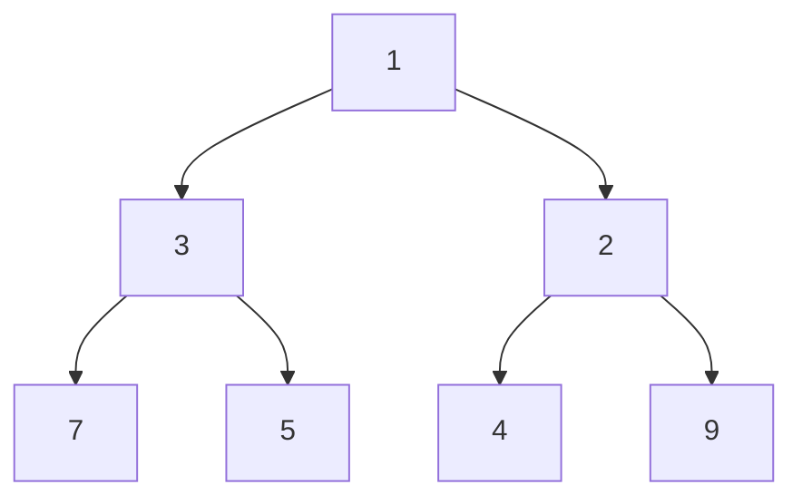

# Heaps and priority queues — the k best, cheaply

A heap answers one question extremely well: **what is the smallest (or largest)
thing right now?** — while things are constantly being added and removed. That's
it. Every heap problem is a rephrasing of it.

*In the Google round: heaps arrive as "kth largest", "top-k frequent", "median of a stream" or a scheduling problem, and the follow-up is "now it's a stream of 10⁹ elements" or "now elements expire" — testing whether you know a size-k heap is O(k) memory and what breaks when you need deletion.*

It matters in a JavaScript interview more than in most languages, because
**there is no built-in heap**. You cannot `import` your way out, so you either
write ~25 lines from memory or you don't solve the problem. That makes it the
single highest-value structure to have memorised.

---

## The costs

| Operation | Cost |
| --- | --- |
| Peek at the min/max | **O(1)** |
| Insert (`push`) | **O(log n)** |
| Remove the min/max (`pop`) | **O(log n)** |
| Build a heap from n items | **O(n)** — not O(n log n), see below |
| Search for an arbitrary value | **O(n)** — a heap is *not* a search structure |
| Space | O(n) |

**What a heap deliberately does not give you:** sorted order. It only guarantees
the root. The rest is partially ordered, and popping everything to get a sorted
list is just heapsort at O(n log n). If you need full ordering, sort.

**Why it beats sorting for top-k:** sorting is O(n log n) and produces far more
than you asked for. A heap capped at size k is **O(n log k)**, and when k is
small that's effectively O(n).

---

## How it actually works


*A min-heap: every parent is ≤ its children, so the minimum is always at the root. Siblings are unordered — that weaker promise is exactly why insertion is O(log n) rather than O(n).*

### The heap property, and the array trick

Two rules define a heap:

1. **Heap property** — every parent is ≤ (min-heap) or ≥ (max-heap) both
   children. Nothing is said about siblings.
2. **Complete tree** — every level is full except possibly the last, which fills
   left to right.

Completeness is what lets a heap live in a flat array with no pointers at all:

```
index:   0    1    2    3    4    5    6
value: [ 1,   3,   2,   7,   5,   4,   9 ]

parent of i      → (i - 1) >> 1
left child of i  → 2i + 1
right child of i → 2i + 2
```

**That index arithmetic is the whole implementation.** No nodes, no `left`/
`right`, no allocation per element — just an array and three formulas. It's also
why heaps are cache-friendly and fast in practice beyond what the complexity
suggests.

### Sift up and sift down

Both operations restore the heap property by moving one element along a single
root-to-leaf path — length log n, which is where the complexity comes from.

- **Insert:** append at the end, then **sift up** — swap with the parent while
  it's larger.
- **Remove the root:** move the last element to the root, shrink, then **sift
  down** — swap with the *smaller* child while it's smaller.

**Swapping with the smaller child is the detail people get wrong.** Swap with
the larger one and you break the heap property on the other branch immediately.

### Build-heap is O(n), not O(n log n)

A common follow-up. Heapifying an existing array by sifting down from the last
internal node backwards is O(n), not O(n log n) — because most nodes are near
the bottom and have almost no distance to sift. Half the nodes are leaves and
move zero, a quarter move at most one, and the series converges to a constant
times n. Inserting one at a time genuinely is O(n log n).

---

## The min-heap you must be able to write

Memorise this. Twenty-five lines, and it unlocks a whole problem family.

```js
class MinHeap {
  constructor(cmp = (a, b) => a - b) { this.a = []; this.cmp = cmp; }
  get size() { return this.a.length; }
  peek() { return this.a[0]; }

  push(v) {
    this.a.push(v);
    let i = this.a.length - 1;
    while (i > 0) {
      const p = (i - 1) >> 1;                          // parent
      if (this.cmp(this.a[i], this.a[p]) >= 0) break;  // in order — done
      [this.a[i], this.a[p]] = [this.a[p], this.a[i]];
      i = p;
    }
  }

  pop() {
    const top = this.a[0];
    const last = this.a.pop();
    if (this.a.length) {
      this.a[0] = last;                                // fill the hole, sift down
      let i = 0;
      for (;;) {
        const l = 2 * i + 1, r = l + 1;
        let m = i;
        // Compare against BOTH children and take the smaller — swapping with
        // the larger one breaks the heap property on the other branch.
        if (l < this.a.length && this.cmp(this.a[l], this.a[m]) < 0) m = l;
        if (r < this.a.length && this.cmp(this.a[r], this.a[m]) < 0) m = r;
        if (m === i) break;
        [this.a[i], this.a[m]] = [this.a[m], this.a[i]];
        i = m;
      }
    }
    return top;
  }
}
```

**A max-heap is the same class with a flipped comparator** — `(a, b) => b - a`.
Never write two classes. For objects, compare the field you care about:
`new MinHeap((a, b) => a.dist - b.dist)`.

---

## The patterns

### 1. Top-k — and the inversion that catches everyone

**For the k largest elements, use a MIN-heap of size k.**

That feels backwards, so here's why: the heap holds your current best k. When a
new element arrives you need to know whether it beats the *weakest* of them —
and the weakest of the k largest is the smallest. A min-heap puts exactly that
on top, ready to evict.

```js
// K largest elements. O(n log k) time, O(k) space.
const heap = new MinHeap();
for (const x of nums) {
  heap.push(x);
  if (heap.size > k) heap.pop();   // evict the weakest of the current best k
}
// heap now holds the k largest; heap.peek() is the k-th largest
```

Symmetrically: **k smallest → max-heap of size k.** State the inversion out
loud; it's a small thing interviewers listen for.

**Why not just sort?** Sorting is O(n log n) and gives you a full ordering you
didn't ask for. The heap is O(n log k). When k is 10 and n is a million, that's
a real difference — and the heap also works on a *stream*, where sorting can't,
because you never hold all n at once.

### 2. Merging k sorted sequences

Push the head of each sequence into a heap of size k. Pop the smallest, output
it, push its successor. Repeat.

O(N log k) for N total elements, where the naive merge-them-pairwise approach is
O(N k). This is the shape behind **merge k sorted lists**, external sorting, and
merging shards in a distributed query.

### 3. Running median — two heaps

The classic two-heap trick. A max-heap for the lower half, a min-heap for the
upper half, kept balanced within one element. The median is the top of the
larger heap, or the average of both tops when sizes are equal.

Insert is O(log n), median is O(1). The rebalance after every insert is the
fiddly part — write it carefully and test on a two-element input.

### 4. Scheduling and "next event"

Meeting rooms, task scheduling, CPU scheduling. The heap holds pending items
keyed by finish time or priority, and the top is always what happens next.

**Meeting rooms II** — the minimum number of rooms needed — is the canonical
one: sort meetings by start, keep a min-heap of end times, and pop any meeting
that's finished before the current one starts. The heap size is the answer.

### 5. Dijkstra

A priority queue keyed by distance is what turns BFS into Dijkstra. See
[graphs](12-graphs.md).

### 6. Nearly-sorted arrays

If every element is at most k positions from its sorted place, a heap of size
k+1 sorts it in **O(n log k)** rather than O(n log n). Push the first k+1
elements, then repeatedly pop the minimum and push the next.

This is the cleanest "why a heap rather than a sort" problem there is — the
bound on displacement is exactly what caps the heap size.

---

## Heap or something else?

| Situation | Reach for |
| --- | --- |
| Top-k, k much smaller than n | **Heap of size k** — O(n log k) |
| Top-k, k close to n | Just sort — the heap's advantage disappears |
| The k-th element only, one query, mutation allowed | **Quickselect** — O(n) average |
| A stream, where n isn't known or held | **Heap** — the only option here |
| Full sorted order needed | **Sort** — a heap doesn't give ordering |
| Repeated "what's next" with insertions | **Heap** — this is precisely its job |
| Search for an arbitrary value | **Not a heap** — that's O(n). Use a map or a BST |

**Quickselect** is worth having as an answer: it finds the k-th element in O(n)
average by partitioning like quicksort but recursing into one side only. The
cost is O(n²) worst case and it mutates the input. In an interview a heap is the
safer answer, and knowing both — and why you'd pick the heap — is the stronger
one.

---

## The bugs

| Bug | Fix |
| --- | --- |
| **Max-heap for k largest** | It's a **min**-heap of size k. The top is what you evict |
| **Sifting down toward the larger child** | Always the smaller (in a min-heap), or the property breaks |
| **`pop()` on a one-element heap** | `this.a.pop()` empties it; guard `if (this.a.length)` before sifting |
| **Forgetting the comparator for objects** | Default `a - b` on objects yields `NaN`, and every comparison silently fails |
| **Expecting sorted output** | Only the root is guaranteed. Iterating the backing array is not sorted order |
| **Building by n pushes when you have all the data** | Heapify is O(n); n pushes is O(n log n) |
| **Integer parent index** | `(i - 1) >> 1`, not `(i - 1) / 2` — the latter is fractional |
| **Comparing size before vs after the push** | Push then evict if `size > k`; evicting first can drop the wrong element |

---

## Practice ladder

| # | Problem | What it teaches |
| --- | --- | --- |
| 1 | Implement a min-heap from scratch | Everything below depends on it |
| 2 | K-th largest element in an array | The min-heap-for-largest inversion |
| 3 | Top-k frequent elements | Hash map for counts, then a heap |
| 4 | K closest points to origin | A custom comparator on a computed key |
| 5 | Sort a nearly-sorted (k places apart) array | Why the heap size is bounded by k |
| 6 | Merge k sorted lists | Heap of k heads; O(N log k) |
| 7 | Last stone weight | Max-heap via a flipped comparator |
| 8 | Task scheduler | Greedy plus a heap by frequency |
| 9 | Meeting rooms II | Heap of end times; the size is the answer |
| 10 | Find median from a data stream | **Two heaps** and the rebalance |
| 11 | Dijkstra on a small graph | The priority queue in its natural habitat |

**Exit test:** write the min-heap from memory in under five minutes, then solve
k-th largest and explain why it's a min-heap. If the class isn't automatic,
nothing else on this list is available to you in a real round.

---

## Data structures

| Need | Use | Note |
| --- | --- | --- |
| Priority queue | **Hand-rolled `MinHeap`** | JS has no built-in. Name that gap unprompted — it reads as fluency |
| Max-heap | The same class, `(a, b) => b - a` | Never write a second class |
| Heap of objects | A comparator on the field | `(a, b) => a.dist - b.dist` |
| Top-k | Heap capped at k | Push, then pop while `size > k` |
| Two-heap median | A max-heap and a min-heap | Rebalance to within one element after every insert |
| Outside interview conditions | `heap-js`, or `@datastructures-js/priority-queue` | Say you'd use one in production, then write it anyway |
| k-th element, one-off | Quickselect | O(n) average, O(n²) worst, mutates the input |

**Pseudocode — heapify in O(n), the follow-up to the follow-up**

```js
// Build a heap from an existing array in O(n), not O(n log n).
// Start at the last node that HAS children — everything after it is a leaf
// and is already a valid heap of size one.
function heapify(a, cmp = (x, y) => x - y) {
  for (let i = (a.length >> 1) - 1; i >= 0; i--) siftDown(a, i, cmp);
  return a;
}
```

The O(n) argument is worth being able to give: half the nodes are leaves and
sift zero levels, a quarter sift at most one, an eighth at most two. The sum
`n/2·0 + n/4·1 + n/8·2 + …` converges to n, not n log n. The intuition is that
the expensive nodes — the ones near the root with a long way to fall — are also
the rarest.

---

## Worked problems

Four heap problems at the level Google asks. Every one of them is "what's the
smallest thing right now" with different bookkeeping around it, and every one
uses the `MinHeap` class above — never rewrite it, just pass a comparator.

### Q: Kth largest element in a stream — support `add(x)` and return the kth largest after each add
**Level:** intermediate · **Tags:** google-coding, heaps, streaming, top-k

<details><summary>Model answer</summary>

**Problem.** Design a class initialised with `k` and an initial array; `add(x)`
inserts and returns the kth largest element currently seen. Example: `k = 3`,
initial `[4, 5, 8, 2]`; `add(3) → 4`, `add(5) → 5`, `add(10) → 5`, `add(9) →
8`.

**Clarify first.** Duplicates count separately? (Yes — kth largest by
position, not distinct values.) Is `k` guaranteed ≤ number of elements at
query time? (Assume yes after the first `k` adds.) Memory — can I keep all
elements? (I only need `k`.)

**Brute force.** Keep every element in a sorted array; insert in O(n), read
index `n - k`. Or sort on every query: O(n log n) per add. Both keep O(n)
memory for something that only ever needs `k` numbers.

**The insight.** A **min-heap of size k** holds the k largest seen so far, and
its root is the smallest of them — exactly the kth largest. When a new value
arrives, push it; if the heap exceeds `k`, pop the minimum. The root is always
the answer. Counter-intuitive on first sight — a *min*-heap to find the kth
*largest* — and that inversion is what the interviewer wants to hear you
explain.

**Algorithm.**
1. Build a min-heap from the initial array, popping down to size `k`.
2. `add(x)`: push `x`; if size > k, pop.
3. Return `peek()`.

```js
class KthLargest {
  constructor(k, nums) {
    this.k = k;
    this.heap = new MinHeap();               // from "The min-heap you must be able to write"
    for (const x of nums) this.add(x);
  }
  add(x) {
    this.heap.push(x);
    if (this.heap.size > this.k) this.heap.pop();   // evict the smallest of the k+1
    return this.heap.peek();
  }
}
```

**Complexity.** O(log k) per add, O(k) space. Initialisation is O(n log k).

**Test it.**
- The example sequence: after init the heap holds `{4, 5, 8}`, root 4.
  `add(3)`: heap `{3,4,5,8}` → pop 3 → root 4. `add(10)`: `{4,5,8,10}` → pop 4
  → root 5. Matches.
- `k = 1`: the heap holds only the max — root is the max. Correct.
- Initial array shorter than `k`: `add` works once the size reaches `k`;
  `peek()` before that returns the smallest seen, which is what most
  specifications ask for.

**What the interviewer is checking.** The size-k min-heap inversion, and that
you say O(log k), not O(log n).

</details>

**Follow-ups:**

1. Q: Now it's the kth *smallest*, and also the median.
   <details><summary>Answer</summary>

   Kth smallest is the mirror: a max-heap of size k (`new MinHeap((a, b) => b
   - a)`), root is the answer. The median needs both: a max-heap for the lower
   half and a min-heap for the upper half, balanced so their sizes differ by at
   most one — see the next problem.

   </details>

2. Q: k is 10⁶ and the stream is 10⁹ elements. Does the approach hold?
   <details><summary>Answer</summary>

   Yes — memory is O(k), not O(n), so the heap is a few megabytes and the
   stream never needs to be stored. Each add is ~20 comparisons. If even O(k)
   memory is too much, or the query is *approximate*, the alternative is a
   quantile sketch (t-digest / KLL), which is what production metrics systems
   do — worth naming because it's the "what would you do in production" tail
   of the question.

   </details>

### Q: Find median from a data stream — support `addNum(x)` and `findMedian()` in better than O(n) per call
**Level:** senior · **Tags:** google-coding, heaps, two-heaps, streaming

<details><summary>Model answer</summary>

**Problem.** Numbers arrive one at a time. After any number of adds, return
the median: the middle value for an odd count, the mean of the two middle
values for an even count. Example: add 1, add 2 → 1.5; add 3 → 2.

**Clarify first.** Integers or floats? (Either; the mean may be fractional.)
How many calls, roughly — is `findMedian` called after every add, or rarely?
(Assume interleaved and frequent; if `findMedian` were rare, sort-on-demand
might be acceptable.) Range bounded? (See follow-up — a bounded range enables
a counting approach.)

**Brute force.** Keep a sorted array. Binary-search the insertion point in
O(log n) but the insertion shifts elements — O(n). Median read is O(1). Fine
for small n; the interviewer wants better than O(n) insert.

**The insight.** Split the numbers into a lower half and an upper half. If the
lower half is a **max-heap** and the upper half a **min-heap**, the two roots
are the two middle values. Keep the halves balanced — sizes equal, or the lower
half one larger — and the median is either the lower root or the average of
the roots.

**Algorithm.**
1. Push `x` onto the lower max-heap.
2. Move the lower's max to the upper min-heap (this guarantees every lower
   element ≤ every upper element).
3. If the upper is now bigger than the lower, move the upper's min back down.
4. Median: if sizes equal, average the roots; else the lower root.

```js
class MedianFinder {
  constructor() {
    this.lower = new MinHeap((a, b) => b - a);   // max-heap: the smaller half
    this.upper = new MinHeap();                  // min-heap: the larger half
  }
  addNum(x) {
    this.lower.push(x);
    this.upper.push(this.lower.pop());           // enforce lower.max <= upper.min
    if (this.upper.size > this.lower.size) this.lower.push(this.upper.pop());
  }
  findMedian() {
    if (this.lower.size === this.upper.size) return (this.lower.peek() + this.upper.peek()) / 2;
    return this.lower.peek();                    // lower holds the extra element
  }
}
```

**Complexity.** O(log n) per add (three heap operations), O(1) per median,
O(n) space.

**Test it.**
- Add 1: lower `{1}`, upper `{}` → median 1.
- Add 2: lower gets 2, pops 2 to upper → lower `{1}`, upper `{2}` → 1.5.
- Add 3: lower `{1,3}` → pops 3 to upper `{2,3}` → upper bigger → move 2 down →
  lower `{1,2}`, upper `{3}` → median 2. Matches.
- Add the same value repeatedly (all 5s) → always 5. The invariant holds with
  duplicates because we push-then-pop rather than compare against the root.

**What the interviewer is checking.** That you keep the invariant with
push-then-pop rather than a tangle of if-statements comparing to roots, and
that the rebalance is a single move.

</details>

**Follow-ups:**

1. Q: Values are integers in 0..100. Can you beat O(log n)?
   <details><summary>Answer</summary>

   Yes — a counting array of 101 buckets. Add is O(1); median is a walk over
   at most 101 buckets, so O(1) in the size of the input. This is the answer
   whenever the value domain is small, and it's worth volunteering because it
   shows you check constraints before reaching for a data structure.

   </details>

2. Q: Median of the last W elements only (a sliding window).
   <details><summary>Answer</summary>

   Heaps don't support removing an arbitrary element. The practical answer is
   **lazy deletion**: keep a map of "values to ignore" with counts, and when a
   root is one of them, discard it and decrement. Track the *effective* sizes
   of each heap separately from their physical sizes to keep the balance
   right. Complexity stays O(log W) amortised per step. The clean alternative
   is an order-statistics tree or two `TreeMap`s in a language that has them —
   JavaScript doesn't, so say lazy deletion and mention the alternative.

   </details>

### Q: Top k frequent elements — return the k values that occur most often
**Level:** intermediate · **Tags:** google-coding, heaps, hashing, top-k

<details><summary>Model answer</summary>

**Problem.** Given an array and `k`, return the `k` most frequent elements in
any order. Example: `[1,1,1,2,2,3], k = 2 → [1, 2]`.

**Clarify first.** Ties — is any valid answer acceptable? (Assume yes.) Is `k`
≤ number of distinct values? (Assume yes.) Is the input an array in memory or
a stream? (Array; the streaming version is a follow-up.)

**Brute force.** Count with a map, then sort the distinct entries by count:
O(n + d log d) where `d` is the number of distinct values. Honest and often
acceptable — say it, then improve, because the improvement is the point of
the question.

**The insight.** You don't need the counts fully sorted, only the top `k`. A
min-heap of size `k` keyed on count keeps the `k` most frequent seen so far,
evicting the least frequent whenever it grows past `k`. That's O(d log k)
instead of O(d log d). And if `k` is close to `d`, bucket sort by count is
O(n) with no heap at all.

**Algorithm.**
1. Count occurrences into a `Map`.
2. Push `[count, value]` pairs onto a min-heap by count; pop when size > k.
3. Drain the heap.

```js
function topKFrequent(nums, k) {
  const count = new Map();
  for (const x of nums) count.set(x, (count.get(x) ?? 0) + 1);

  const heap = new MinHeap((a, b) => a[0] - b[0]);   // [count, value], smallest count on top
  for (const [value, c] of count) {
    heap.push([c, value]);
    if (heap.size > k) heap.pop();                    // drop the least frequent of k+1
  }
  const out = [];
  while (heap.size) out.push(heap.pop()[1]);
  return out;
}
```

**Complexity.** O(n) to count, O(d log k) for the heap, O(d + k) space.

**Test it.**
- The example → `{1: 3, 2: 2, 3: 1}`; heap keeps `[2,2]` and `[3,1]` → `[2, 1]`
  in some order.
- `k = d` (everything) → all values returned.
- All elements identical, `k = 1` → that value.
- Negative numbers and zero as values — fine, they're just map keys.

**What the interviewer is checking.** Min-heap of size k (again), and whether
you mention the bucket-sort alternative and when it's better.

</details>

**Follow-ups:**

1. Q: Do it in O(n) time.
   <details><summary>Answer</summary>

   Bucket sort by frequency. A count can't exceed `n`, so make `n + 1` buckets
   where `bucket[c]` holds the values with count `c`. Walk from the highest
   bucket down, collecting until you have `k`. O(n) time and space.

   ```js
   function topKFrequentLinear(nums, k) {
     const count = new Map();
     for (const x of nums) count.set(x, (count.get(x) ?? 0) + 1);
     const buckets = Array.from({ length: nums.length + 1 }, () => []);
     for (const [v, c] of count) buckets[c].push(v);
     const out = [];
     for (let c = buckets.length - 1; c >= 0 && out.length < k; c--) {
       for (const v of buckets[c]) { if (out.length < k) out.push(v); }
     }
     return out;
   }
   ```

   </details>

2. Q: The input is a stream of 10¹⁰ events and you can't hold the counts.
   <details><summary>Answer</summary>

   Exact top-k needs the counts, and the counts don't fit. The production
   answer is an approximate structure: a **Count-Min Sketch** for frequencies
   (bounded memory, over-estimates only) paired with a small heap of candidate
   heavy hitters, or the **Space-Saving / Misra-Gries** algorithm, which
   tracks at most `m` counters and guarantees every element with frequency
   above `n/m` is present. Say which guarantee you're giving up (exactness)
   and what you keep (bounded memory, one pass).

   </details>

### Q: Meeting rooms II — given intervals, return the minimum number of rooms needed so no two overlapping meetings share one
**Level:** intermediate · **Tags:** google-coding, heaps, intervals, greedy

<details><summary>Model answer</summary>

**Problem.** `intervals = [[start, end], ...]`; return the minimum number of
rooms. Example: `[[0,30],[5,10],[15,20]] → 2`; `[[7,10],[2,4]] → 1`.

**Clarify first.** Is a meeting ending at `t` and another starting at `t` an
overlap? (Assume no — `[5,10]` and `[10,15]` can share a room.) Sorted input?
(No.) Empty input → 0.

**Brute force.** For every meeting, count how many other meetings overlap it;
the answer is the maximum overlap at any point. O(n²). Correct, and worth
saying so the improvement is framed as "the same count, computed in one
sweep".

**The insight.** Sort by start time. Walk meetings in order, keeping a
**min-heap of end times of meetings currently in rooms**. Before placing the
next meeting, free every room whose meeting ended at or before this start —
that's the heap root check. The heap's size after each placement is the rooms
in use; the maximum over the walk is the answer. Because the heap always
surfaces the *earliest* ending, you're always reusing a room if any room can
be reused.

**Algorithm.**
1. Sort by start.
2. For each `[s, e]`: while heap root ≤ `s`, pop. Push `e`. Track max size.

```js
function minMeetingRooms(intervals) {
  intervals.sort((a, b) => a[0] - b[0]);
  const ends = new MinHeap();                  // end times of occupied rooms
  let rooms = 0;
  for (const [s, e] of intervals) {
    while (ends.size && ends.peek() <= s) ends.pop();   // that room is free now
    ends.push(e);
    rooms = Math.max(rooms, ends.size);
  }
  return rooms;
}
```

**Complexity.** O(n log n) for the sort and the heap operations, O(n) space.

**Test it.**
- `[[0,30],[5,10],[15,20]]`: place 0–30 (1 room); 5–10 — root 30 > 5, push → 2
  rooms; 15–20 — root 10 ≤ 15, pop; root 30 > 15, push → 2 rooms. Answer 2.
- `[[7,10],[2,4]]`: sorted `[[2,4],[7,10]]`; 4 ≤ 7 pops → 1 room.
- Back-to-back `[[1,5],[5,9]]` → 1 under the "end == start is not overlap"
  rule; with the opposite rule change `<=` to `<`.
- Empty → 0.

**What the interviewer is checking.** Whether you free rooms *before* placing
(a `while`, not an `if` — several rooms can free at once), and whether you can
say why the earliest-ending room is the right one to reuse.

</details>

**Follow-ups:**

1. Q: Do it without a heap.
   <details><summary>Answer</summary>

   The sweep-line version: sort starts and ends into two separate arrays. Walk
   starts; for each start, if the next end is ≤ it, advance the end pointer
   (a room freed), otherwise a new room is needed. The answer is the maximum
   concurrent count. Same O(n log n) from the sort, but O(1) extra logic and
   no data structure to write — often the cleaner answer in a doc.

   ```js
   function minMeetingRoomsSweep(intervals) {
     const starts = intervals.map(i => i[0]).sort((a, b) => a - b);
     const ends = intervals.map(i => i[1]).sort((a, b) => a - b);
     let rooms = 0, e = 0;
     for (const s of starts) {
       if (ends[e] <= s) e++; else rooms++;
     }
     return rooms;
   }
   ```

   </details>

2. Q: Return which room each meeting goes in, with the fewest rooms.
   <details><summary>Answer</summary>

   Keep the heap keyed on end time but store `[end, roomId]`. When a meeting
   is placed after a pop, it reuses the popped room's id; otherwise it takes
   a fresh id. Record `meeting → roomId`. Same complexity; the greedy
   assignment is optimal because reusing the earliest-freed room never blocks
   a later meeting that a different choice would have allowed.

   </details>

---

## Interview Q&A

### Q: Find the k largest elements in an array. Which structure, and why?
**Level:** intermediate · **Tags:** dsa, heaps, top-k

<details><summary>Model answer</summary>

A min-heap of size k, which sounds backwards until you see why.

The heap holds my current best k candidates. Each new element only needs
comparing against the *weakest* of those — and the weakest of the k largest is
the smallest, which is exactly what sits on top of a min-heap. So I push, and if
the size exceeds k I pop, which evicts the weakest. At the end the heap holds
the k largest, and its root is the k-th largest.

That's O(n log k) time and O(k) space. Sorting is the obvious alternative at
O(n log n), and it also produces a complete ordering I never asked for. When k
is small and n is large — say k of 10 against a million elements — the
difference is substantial.

The other advantage is that the heap works on a stream. If elements arrive over
time and I can't hold all n in memory, sorting isn't available at all, but a
bounded heap is. That's the situation where it stops being an optimisation and
becomes the only option.

If I only needed the k-th element rather than all k, and I could mutate the
input, quickselect is O(n) on average — partition like quicksort but recurse
into one side only. I'd mention it, but I'd still write the heap in an
interview, because quickselect is O(n²) in the worst case and destroys the
input.

And in JavaScript I'd note there's no built-in heap, so I'd write the class —
about 25 lines — rather than pretend one exists.

</details>

**Follow-ups:**

1. Q: Why a min-heap for the largest elements, and not a max-heap?
   <details><summary>Answer</summary>

   Because the operation I perform repeatedly is *eviction*, not inspection.

   With a min-heap of size k, the root is the smallest of my current best k —
   the one most likely to be beaten. A new element compares against it in O(1),
   and if it wins I pop the root and push the newcomer. The thing I need
   constant access to is the weakest member, and a min-heap puts precisely that
   on top.

   A max-heap of size k would put the *largest* on top, which is the element I
   never need to touch. To find the weakest for eviction I'd have to search the
   whole heap, which is O(k), defeating the point.

   A max-heap of all n elements does work — push everything, pop k times, giving
   O(n + k log n). That's competitive when k is close to n, and slightly better
   if you heapify in O(n) first. But it's O(n) space rather than O(k), so it
   can't run on a stream.

   The rule I'd state is: bounded heap, inverted type. K largest is a min-heap
   of size k; k smallest is a max-heap of size k.

   </details>

2. Q: How would you find the median of a stream of numbers?
   <details><summary>Answer</summary>

   Two heaps. A max-heap holding the smaller half, and a min-heap holding the
   larger half.

   The invariant is that everything in the max-heap is at most everything in the
   min-heap, and their sizes differ by at most one. Then the median is the top
   of the larger heap, or the average of the two tops if they're equal in size —
   both O(1).

   Insertion is: put the number in one heap based on how it compares to the
   tops, then rebalance by moving one element across if the sizes differ by more
   than one. That's O(log n) per insert.

   The fiddly part is the rebalance, and I'd write it carefully rather than
   quickly — off-by-one errors there produce a median that's subtly wrong on
   even-length inputs only, which is a horrible bug to find. I'd test on two
   elements specifically.

   The alternative is keeping a sorted array with binary-search insertion, which
   gives O(1) median but O(n) insert because of the shifting. For a stream that
   loses badly, which is what makes the two-heap version the right answer here.

   </details>

---

## What a weak answer sounds like

- **"Sort it and take the first k."** Correct but O(n log n), and it doesn't
  work on a stream. Say it as the baseline, then improve it.
- **A max-heap for the k largest.** The most common heap error there is.
- **Assuming a built-in priority queue.** JS has none, and knowing that is part
  of the question.
- **Expecting a heap to give sorted order.** Only the root is guaranteed.
- **Searching a heap for an arbitrary value.** That's O(n) — a heap isn't a
  search structure.
- **Not knowing heapify is O(n).** A standard follow-up.
- **Forgetting the comparator on objects.** `a - b` on objects gives `NaN` and
  every comparison quietly returns false.

---

## Glossary

- **Heap property** — every parent is ≤ (min-heap) or ≥ (max-heap) its children; siblings are unordered.
- **Complete tree** — all levels full except the last, filled left to right; what allows the array representation.
- **Sift up / sift down** — restoring the heap property after an insert / a removal.
- **Heapify** — building a heap from an existing array in O(n).
- **Priority queue** — the abstract type; a heap is the usual implementation.
- **Top-k** — the k best elements; a bounded heap of the *inverted* type.
- **Two-heap median** — a max-heap for the lower half and a min-heap for the upper.
- **Quickselect** — O(n) average k-th element via one-sided quicksort partitioning.
- **Heapsort** — popping a whole heap; O(n log n), in place, not stable.
- **Comparator** — the function defining order; flipping it turns a min-heap into a max-heap.
