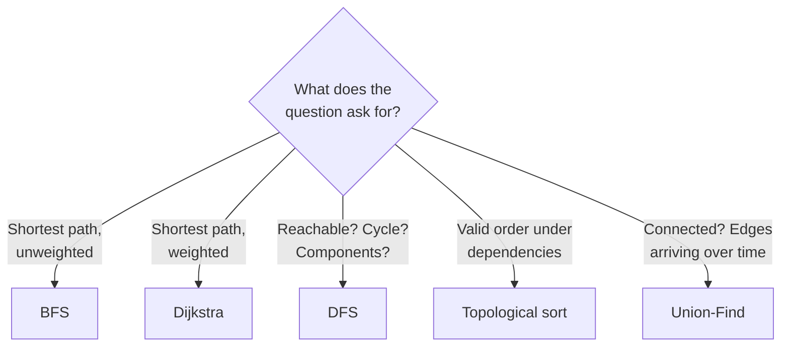

# Graphs — everything else, generalised

A tree is a graph with no cycles and one path between any two nodes. A grid is a
graph where the neighbours are implied by coordinates. A linked list is a graph
where every node has one neighbour. Once you see that, graph problems stop being
a separate topic and become the general case of things you already know.

*In the Google round: graphs are usually disguised — package dependencies, build order, a word ladder, a network — and the follow-up is "now report the cycle", "now do it in parallel waves", or "now the graph doesn't fit in memory"; recognising the graph is most of the problem.*

The intimidating part is the vocabulary and the setup. The algorithms themselves
are a short list, and **BFS and DFS cover most of what gets asked**.

---

## The costs

For V vertices and E edges:

| Algorithm | Time | Space | Answers |
| --- | --- | --- | --- |
| BFS | **O(V + E)** | O(V) | Shortest path, **unweighted** |
| DFS | **O(V + E)** | O(V) | Reachability, cycles, components, ordering |
| Topological sort | **O(V + E)** | O(V) | A valid order under dependencies |
| Union-Find | **~O(1)** per op | O(V) | Connectivity, as edges arrive |
| Dijkstra | **O((V + E) log V)** | O(V) | Shortest path, **non-negative weights** |
| Bellman-Ford | O(V × E) | O(V) | Shortest path with **negative** weights |
| Floyd–Warshall | O(V³) | O(V²) | **All-pairs** shortest paths |

**O(V + E) is the anchor.** BFS and DFS both touch every vertex once and every
edge once, and most graph problems are one of them with bookkeeping. If your
solution is worse than O(V + E) and isn't Dijkstra or all-pairs, look again.

---

## How it actually works


*Five questions, five algorithms. Nearly every graph problem in an interview is one of these, and the question type — not the graph — picks it.*

### Who's who

| Term | Meaning |
| --- | --- |
| **Vertex / node** | A thing |
| **Edge** | A connection between two things |
| **Directed** | Edges have a direction — a one-way street. `u → v` |
| **Undirected** | Edges go both ways — a friendship |
| **Weighted** | Edges carry a cost: distance, latency, price |
| **Degree** | How many edges touch a vertex. In-degree / out-degree when directed |
| **Path** | A sequence of vertices connected by edges |
| **Cycle** | A path that returns to its start |
| **DAG** | Directed acyclic graph — directed, no cycles. What makes topological sort possible |
| **Connected component** | A maximal set of mutually reachable vertices |
| **Dense / sparse** | E close to V² / E close to V. Decides the representation |

### Representing a graph

Almost always an **adjacency list**, and building it from an edge list is the
first thing you write.

```js
// Edges [[0,1],[1,2],...] → adjacency list. Undirected: push both directions.
function buildGraph(n, edges, directed = false) {
  const adj = Array.from({ length: n }, () => []);   // NOT new Array(n).fill([])
  for (const [u, v] of edges) {
    adj[u].push(v);
    if (!directed) adj[v].push(u);                   // the line people forget
  }
  return adj;
}
```

| Representation | Space | "Is u adjacent to v?" | Iterate u's neighbours | Use when |
| --- | --- | --- | --- | --- |
| **Adjacency list** | O(V + E) | O(degree) | **O(degree)** | Almost always — real graphs are sparse |
| **Adjacency matrix** | O(V²) | **O(1)** | O(V) | Dense graphs, or constant-time edge lookup |
| **Edge list** | O(E) | O(E) | O(E) | Input format; Kruskal's, which sorts edges |

`new Array(n).fill([])` gives every vertex the **same array**, so pushing one
neighbour appears on all of them. It's a silent, baffling bug. Use
`Array.from({length: n}, () => [])`.

---

## BFS — shortest path, unweighted

BFS expands in rings, so the first time it reaches a vertex it has done so in
the fewest edges. That guarantee only holds when every edge costs the same.

```js
function bfs(adj, start) {
  const dist = new Array(adj.length).fill(-1);
  dist[start] = 0;
  const q = [start];
  let head = 0;                        // index pointer — never shift(), it's O(n)

  while (head < q.length) {
    const u = q[head++];
    for (const v of adj[u]) {
      if (dist[v] !== -1) continue;    // already reached, and by a SHORTER path
      dist[v] = dist[u] + 1;
      q.push(v);                       // mark on PUSH, not on pop
    }
  }
  return dist;
}
```

Two details carry the correctness. **Mark on push**, not on pop — marking on pop
lets the same vertex be queued several times by different neighbours before it's
processed. And `dist[v] !== -1` doubles as the visited check, because in BFS the
first arrival is always the best one.

**Multi-source BFS:** seed the queue with every start vertex at distance 0. Each
vertex then gets its distance from the *nearest* source in one pass. Rotten
oranges, "nearest exit", "walls and gates" are all this.

---

## DFS — structure, not distance

```js
function dfs(adj, u, visited = new Set()) {
  visited.add(u);                                   // mark on entry
  for (const v of adj[u]) if (!visited.has(v)) dfs(adj, v, visited);
  return visited;
}
```

Use it for reachability, connected components, cycle detection and topological
ordering. **Do not use it for shortest paths** — it can reach a vertex by a long
route before the short one.

**Recursion depth is real.** A path graph of 10⁵ vertices overflows the stack.
Say so, and know the iterative version is the same code with an explicit stack.

### Cycle detection differs by graph type

This distinction gets asked directly, and answering it wrong is costly.

**Undirected:** a cycle exists if you reach an already-visited vertex that isn't
the one you came from.

```js
function hasCycleUndirected(adj, u, parent, visited) {
  visited.add(u);
  for (const v of adj[u]) {
    if (!visited.has(v)) {
      if (hasCycleUndirected(adj, v, u, visited)) return true;
    } else if (v !== parent) {
      return true;        // visited, and not where we came from → a real cycle
    }
  }
  return false;
}
```

Without the `v !== parent` check every single edge reports a cycle, because you
can always look back the way you came.

**Directed:** the parent check is meaningless. You need three colours —
**white** unvisited, **grey** on the current recursion path, **black** finished.
An edge to a **grey** vertex is a back edge and therefore a cycle. An edge to a
black vertex is merely a revisit, which is fine.

```js
const WHITE = 0, GREY = 1, BLACK = 2;
function hasCycleDirected(adj, u, colour) {
  colour[u] = GREY;                                  // on the current path
  for (const v of adj[u]) {
    if (colour[v] === GREY) return true;             // back edge → cycle
    if (colour[v] === WHITE && hasCycleDirected(adj, v, colour)) return true;
  }
  colour[u] = BLACK;                                 // finished; safe to revisit
  return false;                                      // no cycle from here
}
```

**Using a plain visited set on a directed graph reports false cycles**, because
a diamond — two paths reaching the same vertex — is not a cycle. Grey versus
black is exactly that distinction.

---

## Topological sort — ordering under dependencies

Course prerequisites, build order, task scheduling. Only possible on a **DAG**;
a cycle means no valid order exists, and detecting that is half the value.

**Kahn's algorithm** (BFS-based) is the one to write, because it detects the
cycle for free:

```js
function topoSort(n, adj) {
  const indeg = new Array(n).fill(0);
  for (let u = 0; u < n; u++) for (const v of adj[u]) indeg[v]++;

  const q = [];
  for (let u = 0; u < n; u++) if (indeg[u] === 0) q.push(u);   // no prerequisites

  const order = [];
  let head = 0;
  while (head < q.length) {
    const u = q[head++];
    order.push(u);
    for (const v of adj[u]) {
      if (--indeg[v] === 0) q.push(v);    // its last prerequisite just cleared
    }
  }
  // Fewer than n vertices emitted → the rest are stuck in a cycle.
  return order.length === n ? order : null;
}
```

That final check is the cycle detection: anything still holding a non-zero
in-degree is waiting on something inside a cycle, so it never enters the queue.

---

## Union-Find — connectivity as edges arrive

The structure most candidates don't have, and it's ~15 lines. Use it for
connectivity queries, undirected cycle detection, and Kruskal's MST.

**Why not just DFS?** DFS answers "are these connected" in O(V + E) *per query*
and has to re-run when an edge is added. Union-Find answers in near-O(1) and
handles edges arriving incrementally, which DFS structurally cannot.

```js
class DSU {
  constructor(n) {
    this.parent = Array.from({ length: n }, (_, i) => i);
    this.rank = new Array(n).fill(0);
    this.count = n;                    // number of components
  }

  find(x) {
    // Path compression: point every node on the way up straight at the root,
    // so the next find on this branch is effectively O(1).
    if (this.parent[x] !== x) this.parent[x] = this.find(this.parent[x]);
    return this.parent[x];
  }

  union(a, b) {
    const ra = this.find(a), rb = this.find(b);
    if (ra === rb) return false;       // already together — in a cycle check,
                                       // THIS is the cycle
    // Union by rank: hang the shorter tree under the taller so depth barely grows.
    if (this.rank[ra] < this.rank[rb]) this.parent[ra] = rb;
    else if (this.rank[rb] < this.rank[ra]) this.parent[rb] = ra;
    else { this.parent[rb] = ra; this.rank[ra]++; }
    this.count--;
    return true;
  }
}
```

`union` returning `false` does double duty: for Kruskal's it means "skip this
edge, it would form a cycle", and for cycle detection it *is* the detection.
`count` gives you the number of connected components for free.

---

## Dijkstra — shortest path with weights

BFS with a priority queue instead of a plain queue: always expand the
cheapest-so-far vertex.

```js
function dijkstra(adj, start, n) {           // adj[u] = [[v, weight], ...]
  const dist = new Array(n).fill(Infinity);
  dist[start] = 0;
  const pq = new MinHeap((a, b) => a[0] - b[0]);   // [distance, vertex]
  pq.push([0, start]);

  while (pq.size) {
    const [d, u] = pq.pop();
    if (d > dist[u]) continue;    // a stale entry — we already found better.
                                  // Cheaper than supporting decrease-key.
    for (const [v, w] of adj[u]) {
      if (d + w < dist[v]) {
        dist[v] = d + w;
        pq.push([d + w, v]);      // push a new entry rather than updating
      }
    }
  }
  return dist;
}
```

**The `d > dist[u]` skip is the idiomatic trick.** A textbook Dijkstra needs a
decrease-key operation that a binary heap doesn't offer; instead you push
duplicates and discard the stale ones on the way out. Same complexity, far less
code.

**Non-negative weights only.** A negative edge breaks the assumption that once
you've popped a vertex its distance is final. Negative weights need
**Bellman-Ford** at O(V × E), which also detects negative cycles. Saying that
unprompted is a good signal.

**Weights all equal? Use BFS.** Dijkstra on an unweighted graph is a heap you
didn't need.

---

## The bugs

| Bug | Fix |
| --- | --- |
| **`new Array(n).fill([])`** | Every vertex shares one array. Use `Array.from({length: n}, () => [])` |
| **Forgetting the reverse edge** | Undirected graphs need `adj[v].push(u)` too |
| **Marking visited on pop** | Mark on push, or the same vertex queues many times |
| **`shift()` for the BFS queue** | O(n) each; use an index pointer |
| **Parent check on a directed graph** | Directed cycles need three colours, not a parent |
| **No parent check on an undirected graph** | Every edge reports a false cycle |
| **DFS for a shortest path** | BFS. DFS gives no distance guarantee |
| **Dijkstra with negative weights** | Bellman-Ford |
| **Disconnected graphs** | Loop over all vertices as start points, not just vertex 0 |
| **Self-loops and duplicate edges** | Ask whether they occur; they break naive cycle checks |
| **Stack overflow on deep DFS** | Iterative with an explicit stack |

**Disconnected graphs are the most-missed edge case.** "Count the components"
and "detect a cycle anywhere" both require starting a traversal from every
unvisited vertex, not just one.

---

## Practice ladder

| # | Problem | What it teaches |
| --- | --- | --- |
| 1 | Build an adjacency list from an edge list | The setup you'll write every time |
| 2 | Number of islands | Grid as a graph; flood fill |
| 3 | Number of connected components | Looping starts over all vertices |
| 4 | Clone a graph | DFS carrying a map from old node to new |
| 5 | Rotten oranges | **Multi-source BFS**, level counting |
| 6 | Word ladder | BFS on an implicit graph — neighbours are computed, not stored |
| 7 | Cycle in an undirected graph | The parent check |
| 8 | Cycle in a directed graph | Three colours |
| 9 | Course schedule I and II | Topological sort, then the order itself |
| 10 | Number of provinces / redundant connection | **Union-Find** |
| 11 | Network delay time | **Dijkstra** |
| 12 | Cheapest flights within k stops | Bellman-Ford, or BFS with a stop budget |
| 13 | Minimum spanning tree (Kruskal's) | Union-Find plus sorted edges |

**Exit test:** you can state, without pausing, why rotten oranges must be BFS
and course schedule must be a topological sort — and write the undirected and
directed cycle checks, explaining why they differ. Those two distinctions are
what separate having read about graphs from knowing them.

---

## Data structures

| Need | Use | Note |
| --- | --- | --- |
| The graph | `Array` of `Array`s | `Array.from({length: n}, () => [])`. Never `fill([])` |
| Non-integer vertices | `Map` node → neighbours | For strings or objects as vertex labels |
| Visited | `Array` of booleans, or a `Set` | Array when vertices are `0..n-1`; `Set` otherwise |
| BFS queue | `Array` + index pointer | Never `shift()` |
| DFS | Recursion, or an explicit `Array` stack | Explicit when depth could approach V |
| Distances | `Array` filled with `Infinity` or `-1` | `-1` doubles as "unvisited" in unweighted BFS |
| Directed cycle detection | Colour array `0/1/2` | Grey means "on the current path" |
| Priority queue | **Hand-rolled `MinHeap`** | See [heaps](11-heaps-and-top-k.md); JS has no built-in |
| Connectivity | `DSU` class | ~15 lines, path compression plus union by rank |
| In-degrees | `Array` of counts | For Kahn's topological sort |

**Pseudocode — BFS on an *implicit* graph, which is what word ladder really is**

```js
// The graph is never materialised. Neighbours are COMPUTED on demand, which is
// the trick: building all edges up front would be O(n²) comparisons.
function ladderLength(begin, end, wordList) {
  const words = new Set(wordList);
  if (!words.has(end)) return 0;

  let q = [begin], steps = 1;
  const seen = new Set([begin]);

  while (q.length) {
    const next = [];
    for (const word of q) {                       // one whole level per iteration
      if (word === end) return steps;
      for (let i = 0; i < word.length; i++) {
        for (let c = 97; c < 123; c++) {          // 'a'..'z'
          const cand = word.slice(0, i) + String.fromCharCode(c) + word.slice(i + 1);
          if (!words.has(cand) || seen.has(cand)) continue;
          seen.add(cand);                          // mark on push
          next.push(cand);
        }
      }
    }
    q = next;
    steps++;                                       // one per level = the distance
  }
  return 0;
}
```

Recognising that a problem is a graph problem *without a graph in the input* is
the actual skill being tested. Word ladder, sliding puzzles, "minimum steps to
reach a number", and most state-space searches are BFS over vertices you
generate on the fly.

---

## Worked problems

Four graph problems, one per algorithm in the decision tree above. The first
is framed the way a security or infrastructure interviewer would frame it —
as package dependencies — because the disguise is the only hard part.

### Q: Package install order — given packages and "A depends on B" edges, return an install order or report that none exists
**Level:** intermediate · **Tags:** google-coding, graphs, topological-sort, dependencies

<details><summary>Model answer</summary>

**Problem.** `n` packages `0..n-1` and a list of pairs `[a, b]` meaning "a
depends on b" (b must be installed first). Return an order that installs every
package after its dependencies, or an empty array if there's a cycle. Example:
`n = 4, deps = [[1,0],[2,0],[3,1],[3,2]] → [0,1,2,3]` or `[0,2,1,3]`. This is
"Course Schedule II" — the same problem a package manager or a build system
solves.

**Clarify first.** Can a package depend on itself? (Treat as a cycle.)
Duplicate edges? (Harmless for Kahn's; in-degree just counts them twice and
decrements twice — but say you'd dedupe with a `Set` if the interviewer
cares.) Any valid order, or a specific one? (Any.) Should I report *which*
packages are in the cycle? (Follow-up.)

**Brute force.** Repeatedly scan for a package whose dependencies are all
installed, install it, repeat. O(n²) scans plus O(E) per scan. It's Kahn's
algorithm done without the queue that makes it linear.

**The insight.** A package is installable the moment its in-degree (unmet
dependencies) hits zero. Track in-degrees, seed a queue with the zeros, and
each time you install something, decrement its dependents — anything that
reaches zero joins the queue. If you finish with fewer than `n` installed, the
rest are waiting on each other: a cycle.

**Algorithm.**
1. Build adjacency `dep → dependents` and an in-degree array.
2. Queue every package with in-degree 0.
3. Pop, append to the order, decrement each dependent; push those that hit 0.
4. Return the order if its length is `n`, else `[]`.

```js
function installOrder(n, deps) {
  const adj = Array.from({ length: n }, () => []);
  const indeg = new Array(n).fill(0);
  for (const [pkg, dep] of deps) {
    adj[dep].push(pkg);            // installing dep unblocks pkg
    indeg[pkg]++;
  }
  const q = [];
  for (let i = 0; i < n; i++) if (indeg[i] === 0) q.push(i);

  const order = [];
  let head = 0;
  while (head < q.length) {
    const u = q[head++];
    order.push(u);
    for (const v of adj[u]) if (--indeg[v] === 0) q.push(v);
  }
  return order.length === n ? order : [];   // short → something is stuck in a cycle
}
```

**Complexity.** O(V + E) time and space.

**Test it.**
- The example → `[0, 1, 2, 3]` (queue order).
- `deps = [[0,1],[1,0]]` → `[]`.
- No edges, `n = 3` → `[0, 1, 2]`.
- A self-dependency `[2,2]` → in-degree of 2 never clears → `[]`.

**What the interviewer is checking.** Direction of the edge (people build
`pkg → dep` and then topologically sort the wrong way), and that you know the
length check *is* the cycle detection rather than a separate pass.

</details>

**Follow-ups:**

1. Q: Report the packages involved in the cycle, not just that one exists.
   <details><summary>Answer</summary>

   After Kahn's finishes, every package with non-zero in-degree is either in a
   cycle or downstream of one. To name the cycle members exactly, run a
   three-colour DFS on the remaining packages and, when you hit a grey vertex,
   walk back up the recursion stack to it — that path is the cycle. O(V + E).
   In a real dependency resolver you'd report the first cycle found and stop;
   the interviewer wants to hear that you know grey-vs-black is what makes
   the report correct on a diamond.

   </details>

2. Q: Packages can be installed in parallel. What's the minimum number of "waves"?
   <details><summary>Answer</summary>

   Process the queue one level at a time, exactly like BFS distance: everything
   currently in the queue is wave 1, everything it unblocks is wave 2, and so
   on. The number of waves is the length of the longest dependency chain. Same
   O(V + E); the only change is snapshotting the queue length at the start of
   each wave.

   </details>

3. Q: Millions of packages, and the graph doesn't fit in one process.
   <details><summary>Answer</summary>

   Topological sort is inherently sequential across a chain but parallel
   across independent packages, so shard by connected component first
   (union-find over the undirected edges), then run Kahn's per component.
   Cross-shard edges are the hard part; the honest answer is "partition by
   component so there are none, and if a single component is too big,
   iterate in rounds with in-degree updates exchanged between workers" — a
   Pregel-style bulk-synchronous approach.

   </details>

### Q: Number of provinces — given an n×n adjacency matrix of friendships, count the groups of mutually connected people
**Level:** intermediate · **Tags:** google-coding, graphs, union-find, components

<details><summary>Model answer</summary>

**Problem.** `isConnected[i][j] === 1` means `i` and `j` are directly
connected (symmetric). A province is a maximal set of people connected
directly or indirectly. Return how many. Example: `[[1,1,0],[1,1,0],[0,0,1]] →
2`.

**Clarify first.** Symmetric matrix guaranteed? (Yes.) Diagonal is 1?
(Irrelevant — a self-edge doesn't merge anything.) Edges given all at once, or
do they arrive over time? (Decides DFS vs union-find — see below.)

**Brute force.** For every person, DFS through the matrix and mark everyone
reachable; count how many times you start a fresh DFS. That's already O(n²)
because the matrix is n², and it's a perfectly good answer. The interviewer
usually then asks for union-find, to see whether you own the structure.

**The insight.** Connected components are exactly what a disjoint-set union
tracks: start with `n` components, and every edge that joins two different
sets reduces the count by one. Union-find's advantage over DFS isn't
asymptotic here — it's that it handles edges *arriving over time* in near-O(1)
each, where DFS would have to re-run.

**Algorithm.**
1. `DSU(n)` with `count = n`.
2. For every `i < j` with `isConnected[i][j]`, `union(i, j)`.
3. Return `count`.

```js
function findCircleNum(isConnected) {
  const n = isConnected.length;
  const dsu = new DSU(n);                   // the class from "Union-Find" above
  for (let i = 0; i < n; i++) {
    for (let j = i + 1; j < n; j++) {       // upper triangle — the matrix is symmetric
      if (isConnected[i][j] === 1) dsu.union(i, j);
    }
  }
  return dsu.count;
}
```

**Complexity.** O(n² · α(n)) — the matrix scan dominates; each union is
effectively O(1). O(n) space.

**Test it.**
- The example → union(0,1) drops count to 2; nothing else → 2.
- Identity matrix → n provinces.
- All ones → 1.
- `n = 1` → 1.

**What the interviewer is checking.** That you can write `find` with path
compression and `union` by rank from memory, and that you can say *when*
union-find beats DFS (incremental edges) rather than treating it as magic.

</details>

**Follow-ups:**

1. Q: Friendships are added one at a time and after each you must report the count.
   <details><summary>Answer</summary>

   This is where union-find is the only sensible answer. Each `union` is
   amortised near-O(1) and updates `count` in place, so the whole stream is
   O(E · α(n)). DFS would be O(n²) per query.

   </details>

2. Q: Now friendships can also be *removed*.
   <details><summary>Answer</summary>

   Union-find doesn't support deletion. Two honest options: process the
   queries offline in reverse (start from the final graph and "add back"
   removed edges — a classic trick when all queries are known up front), or
   accept O(V + E) per deletion with a fresh DFS. Fully dynamic connectivity
   with polylog updates exists (Holm–de Lichtenberg–Thorup) but is not an
   interview implementation; naming the offline-reverse trick is the
   expected answer.

   </details>

### Q: Word ladder — fewest single-letter transformations from one word to another using a dictionary
**Level:** senior · **Tags:** google-coding, graphs, bfs, implicit-graph

<details><summary>Model answer</summary>

**Problem.** `begin`, `end`, and a word list, all the same length. Each step
changes one letter and must land on a word in the list. Return the length of
the shortest sequence (counting both ends), or 0. Example: `hit → cog` with
`[hot, dot, dog, lot, log, cog]` → 5 (`hit, hot, dot, dog, cog`).

**Clarify first.** Is `end` guaranteed in the list? (If not, return 0 early.)
Word length `L` and list size `N` — rough sizes? (Assume `L ≤ 10`, `N ≤
5000`.) Lowercase only? (Yes.)

**Brute force.** Build an explicit graph by comparing every pair of words —
O(N² · L) — then BFS. For `N = 5000` that's 25 million comparisons before the
search even starts.

**The insight.** The graph is *implicit*: a word's neighbours are the `26 · L`
one-letter variants, filtered by dictionary membership in O(1) via a `Set`.
Generating neighbours on demand costs O(26 · L) per word instead of O(N · L),
and BFS gives the shortest path because every edge costs one step.

**Algorithm.**
1. If `end` isn't in the set, return 0.
2. BFS level by level from `begin`; for each word, try every position and
   letter; enqueue unseen dictionary words.
3. Return the level at which `end` is dequeued.

```js
function ladderLength(begin, end, wordList) {
  const dict = new Set(wordList);
  if (!dict.has(end)) return 0;
  const seen = new Set([begin]);
  let frontier = [begin], steps = 1;

  while (frontier.length) {
    const next = [];
    for (const word of frontier) {
      if (word === end) return steps;
      const chars = word.split('');
      for (let i = 0; i < chars.length; i++) {
        const original = chars[i];
        for (let c = 97; c <= 122; c++) {
          chars[i] = String.fromCharCode(c);
          const cand = chars.join('');
          if (dict.has(cand) && !seen.has(cand)) {
            seen.add(cand);                       // mark on push
            next.push(cand);
          }
        }
        chars[i] = original;                      // restore before the next position
      }
    }
    frontier = next;
    steps++;
  }
  return 0;
}
```

**Complexity.** O(N · 26 · L · L) — each dictionary word is expanded at most
once, each expansion tries `26L` candidates costing O(L) to build. O(N · L)
space.

**Test it.**
- The example → 5.
- `end` not in the list → 0.
- `begin === end` → 1 (returned on the first dequeue). Ask whether the
  interviewer wants 0 or 1 here; the specification usually says 1.
- No path (`hit → cog` with `[hot, dot, lot]`) → exhausts the frontier → 0.

**What the interviewer is checking.** That you *don't* build the graph, and
that you mark visited on push. A candidate who compares all pairs has missed
the point of the problem.

</details>

**Follow-ups:**

1. Q: Speed it up further.
   <details><summary>Answer</summary>

   **Bidirectional BFS**: search from both ends, always expanding the smaller
   frontier, and stop when they meet. The search space drops from roughly
   `b^d` to `2 · b^(d/2)` — for a depth-10 ladder that's the difference
   between 26¹⁰ and 2 · 26⁵ candidate expansions. Same code with two
   frontiers and a check against the other side's visited set instead of
   `word === end`.

   </details>

2. Q: Return *all* shortest ladders, not just the length.
   <details><summary>Answer</summary>

   BFS to compute each word's distance from `begin`, recording parents (every
   predecessor at distance `d - 1`, not just the first). Then DFS backwards
   from `end` along parent links to enumerate paths. Two passes; the second
   is exponential in the worst case because the number of shortest paths can
   be, so say that rather than pretending it's linear.

   </details>

### Q: Network delay time — signal sent from node k; how long until every node has received it, or -1 if some never do
**Level:** senior · **Tags:** google-coding, graphs, dijkstra, shortest-path

<details><summary>Model answer</summary>

**Problem.** `n` nodes `1..n`, directed weighted edges `[u, v, w]` meaning a
signal takes `w` time from `u` to `v`. Starting at `k`, return the time until
all nodes have it — the maximum shortest-path distance — or -1 if some node is
unreachable. Example: `times = [[2,1,1],[2,3,1],[3,4,1]], n = 4, k = 2 → 2`.

**Clarify first.** Weights non-negative? (Yes — otherwise Dijkstra is wrong
and it's Bellman-Ford.) Are there parallel edges? (Fine; Dijkstra picks the
cheaper.) Nodes 1-indexed? (Yes; I'll offset.)

**Brute force.** Bellman-Ford: relax every edge `n - 1` times, O(V · E).
Correct for any weights. Say it, then explain that with non-negative weights
Dijkstra is O((V + E) log V) and that's the one the question expects.

**The insight.** Dijkstra with lazy deletion: push `[dist, node]` on every
improvement, skip stale entries on pop. Once every reachable node has a final
distance, the answer is the max of those distances; any `Infinity` remaining
means -1.

**Algorithm.**
1. Build `adj[u] = [[v, w], ...]`.
2. `dist` filled with `Infinity`, `dist[k] = 0`, push `[0, k]`.
3. Pop the cheapest; skip if stale; relax neighbours.
4. Answer is `max(dist)` or -1.

```js
function networkDelayTime(times, n, k) {
  const adj = Array.from({ length: n + 1 }, () => []);
  for (const [u, v, w] of times) adj[u].push([v, w]);

  const dist = new Array(n + 1).fill(Infinity);
  dist[k] = 0;
  const pq = new MinHeap((a, b) => a[0] - b[0]);   // [distance, node]
  pq.push([0, k]);

  while (pq.size) {
    const [d, u] = pq.pop();
    if (d > dist[u]) continue;                   // stale entry — lazy deletion
    for (const [v, w] of adj[u]) {
      if (d + w < dist[v]) {
        dist[v] = d + w;
        pq.push([d + w, v]);
      }
    }
  }
  let answer = 0;
  for (let i = 1; i <= n; i++) {
    if (dist[i] === Infinity) return -1;
    answer = Math.max(answer, dist[i]);
  }
  return answer;
}
```

**Complexity.** O((V + E) log V) time, O(V + E) space.

**Test it.**
- The example → dist `[_, 1, 0, 1, 2]` → 2.
- `n = 2, times = [[1,2,1]], k = 2` → node 1 unreachable → -1.
- `n = 1, k = 1` → 0.
- Parallel edges `[1,2,5],[1,2,1]` → 1 wins.

**What the interviewer is checking.** The `d > dist[u]` skip (or an
equivalent visited set), the non-negative-weights caveat, and that you don't
forget the unreachable check at the end.

</details>

**Follow-ups:**

1. Q: One edge weight can be negative.
   <details><summary>Answer</summary>

   Dijkstra's "popped means final" assumption breaks. Switch to Bellman-Ford
   — `n - 1` rounds of relaxing all edges, O(V · E) — and run one extra round:
   if anything still improves, there's a negative cycle and the answer is
   undefined. For a single negative edge with no cycle, Bellman-Ford is exact
   and Dijkstra may be wrong; there's no cheap patch.

   </details>

2. Q: Instead of "time to reach everyone", find the cheapest path with at most K hops.
   <details><summary>Answer</summary>

   Now state is `(node, hopsUsed)`, not `node`, so plain Dijkstra's
   finalisation is wrong — a node reached cheaply with many hops may block a
   pricier route that leaves hops to spare. Use Bellman-Ford limited to `K +
   1` rounds over a *copy* of the previous round's distances (so a round
   can't chain relaxations), O(K · E). That's "Cheapest Flights Within K
   Stops", and the copy is the detail people miss.

   </details>

---

## Interview Q&A

### Q: When do you use BFS and when DFS?
**Level:** foundation · **Tags:** dsa, graphs, bfs, dfs

<details><summary>Model answer</summary>

BFS when the question is about distance; DFS when it's about structure.

BFS explores level by level, so the first time it reaches a vertex it has done
so in the fewest edges. That's a guarantee, and it's why anything phrased as
"minimum number of steps", "shortest path", or "how many moves" is BFS. The
guarantee depends on every edge costing the same — the moment weights differ,
it breaks and I need Dijkstra.

DFS goes deep and unwinds, which makes it right for questions about shape rather
than length: is this reachable, are there cycles, how many connected components,
what's a valid topological order. It's also usually shorter to write, since
recursion does the bookkeeping.

Both are O(V + E) — each vertex once, each edge once — so it's not a performance
choice, it's a correctness one. Using DFS for a shortest path gives an answer
that's simply wrong, not slow.

Two practical notes. DFS recursion is O(V) stack in the worst case, so on a long
path graph it overflows, and I'd write it iteratively if V is large. And they're
the same algorithm with a different container — take from the end of the
frontier and you get DFS, take from the front and you get BFS. That's worth
knowing because it means one implementation covers both.

</details>

**Follow-ups:**

1. Q: How does cycle detection differ between directed and undirected graphs?
   <details><summary>Answer</summary>

   They need genuinely different algorithms, and using one on the other gives
   wrong answers rather than slow ones.

   Undirected: I DFS and track the vertex I came from. If I reach an
   already-visited vertex that isn't my parent, that's a cycle. The parent check
   is essential, because every edge is traversable both ways — without it, the
   edge I just walked immediately looks like a cycle back to where I started.

   Directed: the parent check is meaningless, because reaching a visited vertex
   is often perfectly fine. A diamond — two paths from A converging on D — has
   no cycle at all, but a naive visited check flags it. So I use three states:
   white for unvisited, grey for on the current recursion path, black for fully
   finished. An edge to a grey vertex is a back edge and therefore a cycle; an
   edge to a black vertex is just a revisit.

   The alternative for directed graphs is Kahn's algorithm — repeatedly remove
   vertices with in-degree zero, and if you can't emit all V, the remainder is
   in a cycle. I often prefer that because it gives me the topological order at
   the same time, and it's iterative so there's no recursion depth risk.

   Both are O(V + E).

   </details>

2. Q: You have a weighted graph. What changes?
   <details><summary>Answer</summary>

   BFS stops being correct, because its guarantee comes from every edge costing
   the same. With weights, a path of three cheap edges can beat one expensive
   edge, and BFS would return the one-edge path.

   So it's Dijkstra: the same traversal but with a priority queue keyed by
   distance-so-far, always expanding the cheapest known vertex. Because I always
   expand the cheapest, the first time I finalise a vertex its distance is
   optimal. That's O((V + E) log V) with a binary heap.

   In JavaScript I'd note there's no built-in priority queue, so I'd write a
   min-heap. And I'd use the lazy-deletion trick rather than decrease-key: push
   a new entry when I improve a distance, and skip entries on pop whose distance
   is worse than the best I've recorded. Same complexity, much less code.

   The important caveat is non-negative weights. A negative edge breaks the
   assumption that a popped vertex is final, because a cheaper route could still
   arrive later. That needs Bellman-Ford at O(V × E), which also detects
   negative cycles — where "shortest path" stops being well-defined, since you
   could loop forever getting cheaper.

   And if all weights happen to be equal, I'd go back to BFS. Dijkstra there is
   a heap I didn't need.

   </details>

### Q: Design a course scheduler given prerequisites.
**Level:** intermediate · **Tags:** dsa, graphs, topological-sort

<details><summary>Model answer</summary>

That's a topological sort. Courses are vertices, and a prerequisite is a
directed edge from the prerequisite to the course that depends on it.

I'd use Kahn's algorithm. Compute every course's in-degree — how many
prerequisites it has. Seed a queue with everything at in-degree zero, since
those can be taken immediately. Pop a course, append it to the order, and
decrement the in-degree of everything that depended on it; when one hits zero,
its last prerequisite has cleared, so it joins the queue.

The cycle detection is free and that's why I'd pick this over DFS. If I finish
and have emitted fewer courses than exist, the remainder are all waiting on
something inside a cycle — a circular dependency — so no valid schedule exists.
That's the case the question is really about, because it's the one that has no
answer.

O(V + E) time and space.

Two extensions I'd mention if it went further. If the question asks for the
minimum number of *semesters* rather than an order, it's the same algorithm
processing one whole level per iteration — the number of levels is the answer,
which is the same level-batching idea as BFS distance. And if courses have
capacity limits or a maximum per semester, it becomes a scheduling problem where
I'd pick greedily among available courses, ordered by something like how many
things they unblock.

</details>

**Follow-ups:**

1. Q: Would Union-Find work here instead?
   <details><summary>Answer</summary>

   No, and the reason is a useful distinction: Union-Find models *undirected
   connectivity*, and prerequisites are directional.

   Union-Find can tell me two courses are in the same connected group. It can't
   tell me that A must come before B, because union is symmetric — merging A and
   B loses the direction entirely. So it can't produce an order, and it can't
   detect a *directed* cycle: A→B→C→A and a triangle of undirected edges look
   identical to it.

   Where it does belong is undirected connectivity questions — number of
   provinces, redundant connection, Kruskal's minimum spanning tree — and
   especially when edges arrive over time, since it handles incremental unions
   in near-constant time where a DFS would have to re-run.

   For anything with dependencies and direction, it's topological sort.

   </details>

---

## What a weak answer sounds like

- **DFS for a shortest path.** Wrong, not merely slow.
- **A parent check on a directed graph**, or none on an undirected one.
- **Dijkstra with negative weights** and no mention of Bellman-Ford.
- **`new Array(n).fill([])`** — one array shared by every vertex.
- **Forgetting the reverse edge** on an undirected graph.
- **Only starting from vertex 0**, so disconnected components are missed.
- **`shift()` as the BFS queue**, making an O(V + E) traversal quadratic.
- **Not recognising an implicit graph.** Word ladder and state-space searches
  don't look like graph problems until you notice the vertices are states.
- **No mention of recursion depth** on a large DFS.

---

## Glossary

- **Vertex / edge** — a node / a connection between two.
- **Directed / undirected** — one-way edges / two-way.
- **Weighted** — edges carry a cost.
- **DAG** — directed acyclic graph; a prerequisite for topological sort.
- **In-degree** — how many edges point *at* a vertex.
- **Connected component** — a maximal mutually reachable set.
- **Adjacency list / matrix** — O(V + E) neighbour lists / an O(V²) lookup table.
- **Implicit graph** — vertices generated on demand rather than stored.
- **Multi-source BFS** — seeding every start vertex, giving distance from the nearest.
- **Back edge** — an edge to a vertex on the current DFS path; the definition of a directed cycle.
- **Three-colour DFS** — white/grey/black marking for directed cycle detection.
- **Kahn's algorithm** — topological sort by repeatedly taking in-degree-zero vertices.
- **Union-Find (DSU)** — near-O(1) undirected connectivity with path compression and union by rank.
- **Path compression** — repointing nodes straight at the root during `find`.
- **Dijkstra** — shortest path with non-negative weights, using a priority queue.
- **Lazy deletion** — pushing duplicate heap entries and skipping stale ones, instead of decrease-key.
- **Bellman-Ford** — shortest path tolerating negative weights; detects negative cycles.
- **MST** — minimum spanning tree; connects all vertices at least total cost.
