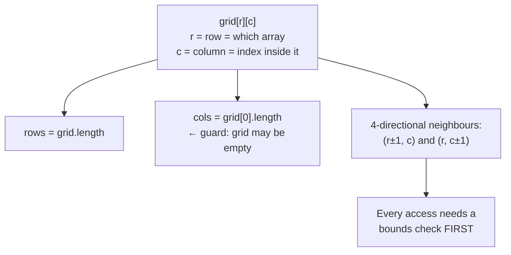

# 2-D arrays and matrices — grids, traversals and flood fill

A matrix is an array of arrays, so nothing here is conceptually new. What makes
it its own chapter is that the *bookkeeping* is where people lose the round:
row-versus-column confusion, boundary checks written five times slightly
differently, and forgetting to mark a cell visited so a BFS never terminates.

*In the Google round: a grid problem is a BFS, a DP or an in-place traversal wearing a costume, and the follow-up is "now the grid is sparse and enormous" or "now moves have different costs" — testing whether you can switch from BFS to Dijkstra, or from a 2-D array to a map, without rewriting everything.*

Almost every grid problem is one of four things: **traverse it in some order**,
**flood fill a region**, **shortest path across it**, or **DP over it**. Knowing
which of those four you're in is most of the work.

---

## The costs

For an `m × n` grid:

| Operation | Cost |
| --- | --- |
| Access `grid[r][c]` | **O(1)** |
| Full traversal | **O(m × n)** — and this is the floor for most grid problems |
| BFS or DFS over the whole grid | **O(m × n)**, since each cell is visited once |
| Space for a `visited` array | **O(m × n)** |
| Space for a BFS queue | **O(min(m, n))** for a grid, up to O(m × n) worst case |

**The useful mental anchor:** touching every cell is O(m × n), so any grid
solution that isn't roughly that is either doing extra work or exploiting
special structure (like a sorted matrix, where binary search gets you to
O(m + n) or O(log(m × n))).

---

## How it actually works


*Row indexes the outer array, column the inner. Almost every grid bug is either swapping those two or reading a neighbour before checking it's in bounds.*

### Who's who

| Term | Meaning |
| --- | --- |
| **Row `r`** | Which inner array. `grid.length` of them |
| **Column `c`** | Index within that array. `grid[0].length` of them |
| **`grid[r][c]`** | Row first, then column. Not `[x][y]` — that's the reverse of what you'd expect from coordinates |
| **4-directional** | Up, down, left, right |
| **8-directional** | Plus the four diagonals |
| **In-bounds** | `r >= 0 && r < rows && c >= 0 && c < cols` |
| **Flood fill** | Spreading from a start cell to all connected cells matching a condition |

**The `[row][col]` versus `(x, y)` clash is a genuine source of bugs.** In maths
`(x, y)` is horizontal then vertical; in a grid `grid[r][c]` is vertical then
horizontal. Pick `r`/`c` as your variable names — never `x`/`y` — and the
confusion mostly disappears.

### The directions array — write it once

Rather than four near-identical blocks, encode the moves as data. This is the
single biggest readability and bug-count win in grid problems.

```js
const DIRS = [[-1, 0], [1, 0], [0, -1], [0, 1]];   // up, down, left, right

for (const [dr, dc] of DIRS) {
  const nr = r + dr, nc = c + dc;
  if (nr < 0 || nr >= rows || nc < 0 || nc >= cols) continue;   // bounds FIRST
  // ... now it's safe to read grid[nr][nc]
}
```

Add the four diagonals to `DIRS` and every algorithm becomes 8-directional with
no other change. Write the bounds check once, in that exact shape, every time.

---

## The four problem types

### 1. Traversal in a specific order

Spiral, diagonal, zigzag, boundary. No algorithm — just careful bookkeeping.

**Spiral order** is the classic, and the clean way is four boundaries that
shrink inward:

```js
function spiralOrder(grid) {
  const out = [];
  let top = 0, bottom = grid.length - 1;
  let left = 0, right = grid[0].length - 1;

  while (top <= bottom && left <= right) {
    for (let c = left; c <= right; c++) out.push(grid[top][c]);
    top++;
    for (let r = top; r <= bottom; r++) out.push(grid[r][right]);
    right--;

    // These two guards are the bug everyone ships: after the first two passes
    // the remaining region may be a single row or column, and without the
    // re-check you walk it a second time backwards.
    if (top <= bottom) {
      for (let c = right; c >= left; c--) out.push(grid[bottom][c]);
      bottom--;
    }
    if (left <= right) {
      for (let r = bottom; r >= top; r--) out.push(grid[r][left]);
      left++;
    }
  }
  return out;
}
```

**Rotate 90° in place** is the other one worth knowing, and it's two steps:
**transpose** (swap `grid[r][c]` with `grid[c][r]` for `c > r`), then **reverse
each row**. That decomposition is the answer — deriving the index arithmetic
directly under pressure is unnecessarily hard.

### 2. Flood fill — connected regions

"Number of islands", "surrounded regions", "max area of island", "count
provinces". You visit every cell; when you find an unvisited one that starts a
region, you flood outward from it and count that as one region.

```js
function numIslands(grid) {
  const rows = grid.length, cols = grid[0].length;
  let count = 0;

  function flood(r, c) {
    if (r < 0 || r >= rows || c < 0 || c >= cols) return;   // bounds
    if (grid[r][c] !== '1') return;                          // water, or already sunk
    grid[r][c] = '0';        // MARK IMMEDIATELY — before recursing, or you
                             // re-enter this cell from its own neighbour and
                             // recurse forever
    for (const [dr, dc] of DIRS) flood(r + dr, c + dc);
  }

  for (let r = 0; r < rows; r++)
    for (let c = 0; c < cols; c++)
      if (grid[r][c] === '1') { count++; flood(r, c); }

  return count;
}
```

**Mark before you recurse.** Marking after the recursive calls is the infinite
loop, and it's the most common grid bug there is.

**Mutating the grid as your `visited` marker** saves O(m × n) space and is
usually accepted — but say you're doing it, and offer a separate `visited` array
if the input mustn't be modified.

**DFS or BFS?** For "is it connected" and "how big is the region", either works
— DFS is shorter to write. Use BFS when the grid is large enough that recursion
depth is a risk: a 1000×1000 grid of all-land is a 10⁶-deep recursion and will
overflow the stack.

### 3. Shortest path — always BFS

The moment a grid problem says "minimum steps", "fewest moves", or "how many
minutes", it's BFS, because BFS explores in order of distance so the first
arrival is the shortest.

**Multi-source BFS** is the variant people don't know and it's genuinely useful:
seed the queue with *every* starting cell at once, and the first time you reach a
cell you have its distance from the nearest source. **Rotten oranges** is
exactly this — every rotten orange starts in the queue at time zero, and the
answer is the number of levels.

```js
// Rotten oranges: multi-source BFS, counting levels
let queue = [], fresh = 0;
for (let r = 0; r < rows; r++)
  for (let c = 0; c < cols; c++) {
    if (grid[r][c] === 2) queue.push([r, c]);   // ALL sources seeded at once
    else if (grid[r][c] === 1) fresh++;
  }

let minutes = 0;
while (queue.length && fresh > 0) {
  const next = [];
  for (const [r, c] of queue) {                 // one whole level per iteration
    for (const [dr, dc] of DIRS) {
      const nr = r + dr, nc = c + dc;
      if (nr < 0 || nr >= rows || nc < 0 || nc >= cols) continue;
      if (grid[nr][nc] !== 1) continue;
      grid[nr][nc] = 2;
      fresh--;
      next.push([nr, nc]);
    }
  }
  queue = next;
  minutes++;              // incremented once per level, which IS the answer
}
return fresh === 0 ? minutes : -1;   // leftover fresh oranges are unreachable
```

Processing a whole level per outer iteration — rather than one cell at a time —
is what makes `minutes` the level count. That level-batching trick is worth
having automatic, because it's the same one that produces level-order traversal
in [trees](10-trees-and-bst.md).

**If moves have different costs**, BFS's guarantee breaks and you need Dijkstra
— a priority queue instead of a plain queue. "0-1 BFS" with a deque is the
special case when costs are only 0 or 1.

### 4. DP over the grid

"Number of unique paths", "minimum path sum", "maximal square", "longest
increasing path". The state is usually `(r, c)` and the transition looks at the
cells you could have arrived from.

```js
// Minimum path sum, moving only right or down. In place, O(1) extra space.
for (let r = 0; r < rows; r++)
  for (let c = 0; c < cols; c++) {
    if (r === 0 && c === 0) continue;                    // start
    const fromTop  = r > 0 ? grid[r-1][c] : Infinity;    // Infinity, not 0 —
    const fromLeft = c > 0 ? grid[r][c-1] : Infinity;    // 0 would look optimal
    grid[r][c] += Math.min(fromTop, fromLeft);
  }
return grid[rows-1][cols-1];
```

Using `Infinity` rather than `0` for an unreachable predecessor is the detail:
zero looks like a free path and silently produces wrong answers on the first row
and column.

**Which of the four am I in?** Ask what's being returned. A list in an order →
traversal. A count of regions or a region size → flood fill. A minimum number of
steps → BFS. A minimum cost, or a count of ways → DP.

---

## The bugs

| Bug | Fix |
| --- | --- |
| **Swapping row and column** | Name them `r` and `c`, never `x` and `y`. `rows = grid.length`, `cols = grid[0].length` |
| **Empty grid** | `grid[0].length` throws on `[]`. Guard `if (!grid.length \|\| !grid[0].length) return ...` |
| **Bounds check after the read** | Check bounds *before* touching `grid[nr][nc]`, in that order, every time |
| **Marking visited after recursing** | Mark on entry. Otherwise infinite recursion |
| **Ragged rows** | Rows of differing length. Rare, but ask if it's guaranteed rectangular |
| **`new Array(n).fill([])`** | Every row is the **same** array reference. Use `Array.from({length: n}, () => [])` |
| **Stack overflow on big grids** | A 10⁶-cell all-land grid blows recursive DFS. Use iterative BFS |
| **Counting cells instead of levels in BFS** | Process a full level per iteration if you need a distance |
| **`0` for unreachable in DP** | Use `Infinity` for min problems, `-Infinity` for max |

The `fill([])` one deserves emphasis: `new Array(3).fill([])` creates three
references to a single array, so pushing to one pushes to all three. It is a
silent, baffling bug. `Array.from({length: 3}, () => [])` is the fix.

---

## Practice ladder

| # | Problem | What it teaches |
| --- | --- | --- |
| 1 | Transpose a matrix | Index mechanics; swapping only for `c > r` |
| 2 | Rotate image 90° in place | Transpose + reverse rows |
| 3 | Spiral matrix | Four shrinking boundaries; the two re-check guards |
| 4 | Set matrix zeroes, O(1) space | Using the first row and column as your own marker storage |
| 5 | Number of islands | Flood fill; mark-before-recurse |
| 6 | Max area of island | Flood fill returning a size |
| 7 | Surrounded regions | Flood fill **from the borders inward** — the inversion trick |
| 8 | Rotten oranges | **Multi-source BFS**, level counting |
| 9 | Shortest path in a binary matrix | BFS with 8 directions |
| 10 | Unique paths / minimum path sum | Grid DP |
| 11 | Maximal square | Grid DP where the transition uses three neighbours |
| 12 | Word search | Backtracking on a grid — mark, recurse, **unmark** |
| 13 | Search a 2-D sorted matrix | Treat it as a sorted 1-D array, or staircase from a corner |

**Exit test:** number of islands and rotten oranges, both from scratch, and you
can say why one is DFS-or-BFS-either-way and the other must be BFS. The answer
— rotten oranges asks for a number of minutes, which is a level count — is the
distinction the whole chapter turns on.

---

## Data structures

| Need | Use | Note |
| --- | --- | --- |
| The grid | `Array` of `Array`s | `Array.from({length: m}, () => new Array(n).fill(0))`. **Never** `fill([])` |
| Directions | A `DIRS` constant | `[[-1,0],[1,0],[0,-1],[0,1]]`, plus diagonals when needed |
| Visited marker | Mutate the grid, or a parallel `Array` of booleans | Mutating is O(1) space; say you're doing it |
| Visited, when you can't mutate | `Set` of `` `${r},${c}` `` | String keys are fine; `r * cols + c` as a number is faster if asked |
| BFS queue | `Array` + index pointer, or level batching | Never `shift()` — it's O(n) and makes BFS quadratic |
| DFS on a large grid | Explicit stack, not recursion | Avoids stack overflow past ~10⁴ depth |
| Grid DP table | Mutate the grid in place if allowed | Otherwise a parallel 2-D array |

**Pseudocode — iterative flood fill, the version that survives a large grid**

```js
// Same result as the recursive version, but with an explicit stack, so a
// 1000x1000 all-land grid can't blow the call stack.
function floodIterative(grid, sr, sc) {
  const rows = grid.length, cols = grid[0].length;
  if (grid[sr][sc] !== 1) return 0;

  const stack = [[sr, sc]];
  grid[sr][sc] = 0;          // mark on PUSH, not on pop — marking on pop lets
                             // the same cell get pushed several times by
                             // different neighbours before it's processed
  let area = 0;

  while (stack.length) {
    const [r, c] = stack.pop();
    area++;
    for (const [dr, dc] of DIRS) {
      const nr = r + dr, nc = c + dc;
      if (nr < 0 || nr >= rows || nc < 0 || nc >= cols) continue;
      if (grid[nr][nc] !== 1) continue;
      grid[nr][nc] = 0;      // mark immediately on push
      stack.push([nr, nc]);
    }
  }
  return area;
}
```

Swap `stack.pop()` for a queue with an index pointer and this becomes BFS —
identical code, different removal end. That equivalence is worth saying out
loud: **DFS and BFS differ only in whether you take from the end or the front.**

---

## Worked problems

Four grid problems covering the four problem types: multi-source BFS, an
in-place traversal, a search that exploits structure, and DP over the grid
with memoisation. In each, the bookkeeping is the part to get right.

### Q: Rotting oranges — each minute every rotten orange rots its fresh 4-neighbours; return the minutes until none are fresh, or -1
**Level:** intermediate · **Tags:** google-coding, matrices, bfs, multi-source

<details><summary>Model answer</summary>

**Problem.** Grid of `0` (empty), `1` (fresh), `2` (rotten). Every minute,
fresh oranges adjacent (up/down/left/right) to a rotten one become rotten.
Return the minutes until no fresh remain, or -1 if some fresh orange can never
be reached. Example: `[[2,1,1],[1,1,0],[0,1,1]] → 4`.

**Clarify first.** Diagonals? (No — 4-neighbourhood.) Multiple rotten
oranges at start? (Yes, and that's the point.) No fresh oranges at all → 0.
Grid size? (Up to a few hundred per side; fits in memory.)

**Brute force.** Simulate minute by minute: scan the whole grid, rot the
neighbours of every rotten cell, repeat until nothing changes. O(minutes · R ·
C), which can be O((R·C)²) on a snake-shaped grid. Correct, but it rescans
cells that finished rotting long ago.

**The insight.** Every rotten orange is a BFS source. Seed the queue with *all*
of them at distance 0 and run one BFS; each fresh orange gets rotted at the
minute equal to its distance from the nearest source. The answer is the
largest distance reached. Any fresh orange left unvisited is unreachable.

**Algorithm.**
1. Scan the grid: enqueue every rotten cell; count fresh ones.
2. BFS level by level; each level is one minute. Rot fresh neighbours,
   decrement the fresh count, enqueue them.
3. If fresh count is 0, return the minutes elapsed; else -1.

```js
function orangesRotting(grid) {
  const R = grid.length, C = grid[0].length;
  const q = [];
  let fresh = 0;
  for (let r = 0; r < R; r++) {
    for (let c = 0; c < C; c++) {
      if (grid[r][c] === 2) q.push([r, c]);
      else if (grid[r][c] === 1) fresh++;
    }
  }
  const dirs = [[1,0],[-1,0],[0,1],[0,-1]];
  let minutes = 0, head = 0;

  while (head < q.length && fresh > 0) {
    const levelEnd = q.length;                     // snapshot: this minute's frontier
    while (head < levelEnd) {
      const [r, c] = q[head++];
      for (const [dr, dc] of dirs) {
        const nr = r + dr, nc = c + dc;
        if (nr < 0 || nr >= R || nc < 0 || nc >= C || grid[nr][nc] !== 1) continue;
        grid[nr][nc] = 2;                          // mark on push, in the grid itself
        fresh--;
        q.push([nr, nc]);
      }
    }
    minutes++;
  }
  return fresh === 0 ? minutes : -1;
}
```

**Complexity.** O(R · C) time — every cell enters the queue at most once.
O(R · C) space for the queue in the worst case.

**Test it.**
- The example → 4.
- `[[2,1,1],[0,1,1],[1,0,1]]` → the bottom-left fresh orange is walled off →
  -1.
- `[[0,2]]` → no fresh → 0 (the `fresh > 0` guard means the loop never runs).
- All fresh, no rotten → queue empty, fresh > 0 → -1.

**What the interviewer is checking.** Seeding all sources at once rather than
running BFS per source, the level snapshot for counting minutes, and using the
grid as the visited set.

</details>

**Follow-ups:**

1. Q: Now some cells are "walls" a rot can pass over but that takes 2 minutes instead of 1.
   <details><summary>Answer</summary>

   Edges no longer cost the same, so BFS levels stop meaning minutes. Two
   options: **0-1/1-2 BFS** with a deque isn't enough for weights {1,2} in
   general — use Dijkstra over cells with a min-heap keyed on time, or,
   since weights are small integers, a **bucketed BFS** (one queue per
   possible time value) which stays linear. Say Dijkstra first; mention
   bucket queues if the interviewer wants linear.

   </details>

2. Q: The grid is 10⁵ × 10⁵ and mostly empty. What changes?
   <details><summary>Answer</summary>

   Don't allocate the grid. Store the non-empty cells in a `Map` keyed by
   `"r,c"` (or `r * C + c` when it fits in a safe integer), BFS over that map,
   and treat absent keys as empty. Time becomes O(number of oranges), not
   O(R · C). The visited marker moves from the grid to the map value.

   </details>

### Q: Rotate image — rotate an n×n matrix 90° clockwise, in place
**Level:** intermediate · **Tags:** google-coding, matrices, in-place, traversal

<details><summary>Model answer</summary>

**Problem.** Rotate the matrix so that row `r` becomes column `n-1-r`. In
place, O(1) extra space. Example: `[[1,2,3],[4,5,6],[7,8,9]] →
[[7,4,1],[8,5,2],[9,6,3]]`.

**Clarify first.** Square guaranteed? (Yes — a non-square rotation can't be in
place since the shape changes.) Clockwise? (Yes.) Values arbitrary — no
assumptions.

**Brute force.** Allocate a new matrix and set `out[c][n-1-r] = in[r][c]`.
O(n²) time, O(n²) space. It's correct and it's what you'd do in production
unless memory is the constraint — say so, then do it in place because that's
the question.

**The insight.** A clockwise rotation equals **transpose, then reverse each
row**. Transpose swaps `a[r][c]` with `a[c][r]` across the diagonal; reversing
each row then flips it into the rotated position. Two simple in-place passes
instead of tracking four-way cycles by index arithmetic (which also works but
is error-prone under pressure).

**Algorithm.**
1. For `r < c`, swap `a[r][c]` and `a[c][r]`.
2. Reverse every row.

```js
function rotate(a) {
  const n = a.length;
  for (let r = 0; r < n; r++) {
    for (let c = r + 1; c < n; c++) {            // strictly above the diagonal — once per pair
      [a[r][c], a[c][r]] = [a[c][r], a[r][c]];
    }
  }
  for (const row of a) row.reverse();
}
```

**Complexity.** O(n²) time, O(1) extra space.

**Test it.**
- The 3×3 example: transpose → `[[1,4,7],[2,5,8],[3,6,9]]`; reverse rows →
  `[[7,4,1],[8,5,2],[9,6,3]]`. Matches.
- `n = 1` → unchanged.
- `n = 2, [[1,2],[3,4]]` → transpose `[[1,3],[2,4]]` → reverse `[[3,1],[4,2]]`.
  Check: clockwise puts 3 top-left. Correct.
- Starting `c` at `r` instead of `r + 1` is harmless (swaps a cell with
  itself); starting at 0 transposes twice and does nothing — the bug to trace.

**What the interviewer is checking.** Whether you know the decomposition and
can say why the inner loop starts at `r + 1`. If you go for the four-way cycle
approach, they'll watch the indices carefully.

</details>

**Follow-ups:**

1. Q: Counter-clockwise? 180°?
   <details><summary>Answer</summary>

   Counter-clockwise: transpose, then reverse each *column* (or reverse rows
   first, then transpose). 180°: reverse every row, then reverse the row
   order. All O(n²) in place; the point is that every rotation is a
   composition of transpose and reversals.

   </details>

2. Q: The matrix is 10⁵ × 10⁵ and lives on disk. Rotate it.
   <details><summary>Answer</summary>

   Don't rotate the data — rotate the *accessor*. Store the matrix as-is and
   expose `get(r, c)` that maps to `a[n-1-c][r]`. That's O(1) per read and no
   rewrite. If it genuinely must be materialised, process it in cache-sized
   tiles (rotate each tile in memory, write it to its rotated position) so
   every byte is read and written once — a blocked transpose.

   </details>

### Q: Search a 2-D matrix — rows sorted left to right, columns sorted top to bottom; is the target present?
**Level:** intermediate · **Tags:** google-coding, matrices, search, two-pointers

<details><summary>Model answer</summary>

**Problem.** Each row is ascending and each column is ascending, but the last
element of a row is *not* necessarily less than the first of the next.
Return whether `target` exists. Example: in `[[1,4,7],[2,5,8],[3,6,9]]`,
`target = 5 → true`, `target = 20 → false`.

**Clarify first.** Which sortedness — the fully sorted "flattened" kind, or
row-and-column sorted only? (This one is row-and-column only; the flattened
kind is one binary search, see follow-up.) Duplicates? (Fine.) Empty matrix →
false.

**Brute force.** Scan every cell, O(R · C). Or binary search each row, O(R
log C). Both ignore the column ordering.

**The insight.** Start at the **top-right** corner. Everything to its left is
smaller, everything below is larger. So: if the corner equals the target,
done; if it's larger, the whole column is too large — move left; if it's
smaller, the whole row is too small — move down. Each step eliminates a full
row or column, so at most `R + C` steps.

**Algorithm.**
1. `r = 0, c = C - 1`.
2. While in bounds: compare `a[r][c]` to target; move left or down.

```js
function searchMatrix(a, target) {
  if (a.length === 0 || a[0].length === 0) return false;
  let r = 0, c = a[0].length - 1;                 // top-right: the only corner that works
  while (r < a.length && c >= 0) {
    const v = a[r][c];
    if (v === target) return true;
    if (v > target) c--;                          // whole column is too big
    else r++;                                     // whole row is too small
  }
  return false;
}
```

**Complexity.** O(R + C) time, O(1) space.

**Test it.**
- `target = 5` in the example: 7 > 5 → c=1; 4 < 5 → r=1; 5 → true.
- `target = 20` → walks off the bottom → false.
- `target = 0` → walks off the left → false.
- A 1×1 matrix.

**What the interviewer is checking.** Why top-right (or bottom-left) and not
top-left — from top-left both directions increase, so nothing is eliminated.
Say that unprompted.

</details>

**Follow-ups:**

1. Q: The matrix is fully sorted — each row's first element exceeds the previous row's last.
   <details><summary>Answer</summary>

   Then it's a sorted array in disguise. Binary search over `0 .. R·C - 1`,
   mapping index `i` to `a[Math.floor(i / C)][i % C]`. O(log(R · C)). The
   staircase walk still works but is asymptotically worse; use the structure
   you're given.

   </details>

2. Q: Count how many cells are ≤ target.
   <details><summary>Answer</summary>

   Same staircase from the bottom-left: if `a[r][c] <= target`, everything
   above in this column also qualifies — add `r + 1` to the count and move
   right; otherwise move up. O(R + C). This is the counting primitive behind
   "kth smallest in a sorted matrix" done by binary search on the value.

   </details>

### Q: Longest increasing path — the length of the longest strictly increasing path moving in four directions
**Level:** senior · **Tags:** google-coding, matrices, dfs, memoisation, dp

<details><summary>Model answer</summary>

**Problem.** From any cell you may move to an adjacent cell with a strictly
larger value. Return the longest such path (counted in cells). Example:
`[[9,9,4],[6,6,8],[2,1,1]] → 4` (`1 → 2 → 6 → 9`).

**Clarify first.** Strictly increasing? (Yes — so no cycles are possible,
which is what makes memoisation valid.) Diagonals? (No.) Can I modify the
grid? (I'll use a separate memo; ask if space matters.)

**Brute force.** DFS from every cell exploring all increasing paths. Each
DFS is exponential in the worst case, because the same sub-path from a cell is
re-explored from every predecessor. It's the answer that times out.

**The insight.** The longest path *starting at* a cell depends only on that
cell — not on how you got there — because strict increase means you can never
revisit. So memoise it: `best[r][c] = 1 + max(best of larger neighbours)`. Each
cell is computed once. The grid is a DAG (edges to strictly larger neighbours)
and this is longest-path-in-a-DAG via memoised DFS.

**Algorithm.**
1. `memo[r][c] = 0` means uncomputed.
2. `dfs(r, c)`: if memoised, return it; otherwise 1 + max over larger
   neighbours' `dfs`, store, return.
3. Answer is the max over all cells.

```js
function longestIncreasingPath(grid) {
  const R = grid.length, C = grid[0].length;
  const memo = Array.from({ length: R }, () => new Array(C).fill(0));
  const dirs = [[1,0],[-1,0],[0,1],[0,-1]];

  function dfs(r, c) {
    if (memo[r][c]) return memo[r][c];
    let best = 1;                                   // the cell itself
    for (const [dr, dc] of dirs) {
      const nr = r + dr, nc = c + dc;
      if (nr < 0 || nr >= R || nc < 0 || nc >= C) continue;
      if (grid[nr][nc] > grid[r][c]) best = Math.max(best, 1 + dfs(nr, nc));
    }
    memo[r][c] = best;
    return best;
  }

  let answer = 0;
  for (let r = 0; r < R; r++)
    for (let c = 0; c < C; c++) answer = Math.max(answer, dfs(r, c));
  return answer;
}
```

**Complexity.** O(R · C) time — each cell's DFS body runs once, and each
does constant work per neighbour. O(R · C) space for the memo plus recursion
depth up to R · C on a monotone spiral.

**Test it.**
- The example → 4.
- All equal values → 1 (no cell has a larger neighbour).
- A single row `[1,2,3,4]` → 4.
- A 1×1 grid → 1.

**What the interviewer is checking.** That you explain *why* memoisation is
sound (strictness ⇒ DAG ⇒ no revisits), and that no visited set is needed —
adding one is a common sign the candidate hasn't seen why it's unnecessary.

</details>

**Follow-ups:**

1. Q: Recursion depth is a problem on a large grid. Make it iterative.
   <details><summary>Answer</summary>

   It's longest path in a DAG, so do it as a **topological order**: compute
   each cell's out-degree (number of strictly larger neighbours), start a BFS
   from all cells with out-degree 0 (local maxima), and propagate "levels"
   backwards to smaller neighbours, decrementing their out-degree. The number
   of levels is the answer. O(R · C), no recursion, and it's a nice
   demonstration that the memoised DFS and Kahn's algorithm are the same idea.

   </details>

2. Q: "Non-decreasing" instead of "strictly increasing".
   <details><summary>Answer</summary>

   Equal neighbours create cycles, so the graph is no longer a DAG and the
   memo is unsound — a path could revisit. Collapse each connected region of
   equal values into one node first (flood fill / union-find), then run the
   same algorithm on the condensed DAG with the region's cell count as the
   node weight. The interviewer wants to hear you notice the invariant broke.

   </details>

---

## Interview Q&A

### Q: Count the number of islands in a grid. Walk me through it.
**Level:** intermediate · **Tags:** dsa, matrix, dfs, bfs

<details><summary>Model answer</summary>

Scan every cell. When I hit land I haven't seen before, that's a new island, so
I increment the count and then flood fill outward from it to mark the entire
connected region as visited. Continue scanning; every subsequent cell of that
island is already marked, so it doesn't count again.

The flood fill is DFS or BFS — either works, since I only care about
connectivity, not distance. DFS is shorter, so that's what I'd write.

Two details matter. First, mark the cell as visited *before* recursing into its
neighbours, not after — otherwise a neighbour recurses straight back into it and
you loop forever. That's the classic bug here. Second, bounds-check before
reading, not after, or you index off the edge.

I'd use the grid itself as the visited marker, overwriting land with water,
which gives O(1) extra space. I'd say that out loud though, because it destroys
the input — if that's not acceptable I'd use a separate boolean grid at O(m × n)
space.

Complexity is O(m × n) time, since every cell is visited at most once across all
the fills. Space is O(m × n) worst case for the recursion stack, when the whole
grid is one snaking island.

That last point is the one I'd flag as a real risk: on a large grid — say a
million cells, all land — recursive DFS overflows the stack. So for anything
production-sized I'd write it iteratively with an explicit stack, or BFS with a
queue.

</details>

**Follow-ups:**

1. Q: Rotten oranges asks how many minutes until every orange rots. Why can't you use DFS?
   <details><summary>Answer</summary>

   Because the question asks for a *distance* — a number of minutes — and DFS
   doesn't visit in distance order.

   DFS goes deep down one branch first, so it can reach a cell by a long
   roundabout path before the short one, and record a wrong time. BFS expands in
   rings, so the first time it reaches a cell it has done so in the fewest
   steps. That's the shortest-path guarantee, and it only holds because every
   move costs the same one minute.

   Two specifics for this problem. It's *multi-source*: every rotten orange goes
   into the queue before the loop starts, at time zero, so each fresh orange
   gets its distance from the nearest rotten one rather than from an arbitrary
   one.

   And I process one whole level per iteration rather than one cell — take the
   current queue, expand all of it, collect the next level, then increment the
   counter. That's what makes the counter equal the number of minutes rather
   than the number of cells.

   The last thing is the terminating check: if fresh oranges remain when the
   queue empties, they're unreachable, so the answer is −1 rather than the
   elapsed count. That edge case is what the problem is really testing.

   </details>

2. Q: How would you rotate an n×n matrix 90° clockwise in place?
   <details><summary>Answer</summary>

   Two passes: transpose, then reverse each row.

   Transposing swaps `grid[r][c]` with `grid[c][r]`, and the important detail is
   only doing it for `c > r` — iterating the full grid swaps every pair twice
   and lands you back where you started.

   After transposing, the matrix is rotated but mirrored, so reversing each row
   fixes the orientation. For anticlockwise it's transpose then reverse each
   *column* instead, or equivalently reverse the rows first and then transpose.

   O(n²) time, which is unavoidable since every element moves, and O(1) extra
   space.

   I'd offer the decomposition rather than the direct index arithmetic
   deliberately. You can compute the four-way cyclic swap of each element in one
   pass, and it's the same complexity, but the index expressions are easy to get
   wrong under pressure and hard to debug on a whiteboard. Transpose-then-reverse
   is two operations I can each verify on a 3×3 example in a few seconds.

   </details>

---

## What a weak answer sounds like

- **Swapping rows and columns**, usually from naming them `x` and `y`.
- **Four copy-pasted neighbour blocks** instead of a directions array. It works
  and it reads as inexperience.
- **Reading `grid[nr][nc]` before the bounds check.**
- **Marking visited after the recursive call**, which is an infinite loop.
- **DFS for a shortest-path question.** BFS is required, and knowing why is the
  point.
- **No mention of stack depth** on a large-grid DFS.
- **`new Array(n).fill([])`** — one array shared by every row.
- **Not asking whether the grid can be mutated** before using it as your visited
  marker.

---

## Glossary

- **Row / column** — outer array index / inner array index; `grid[r][c]`.
- **Directions array** — the neighbour offsets written once as data.
- **In-bounds check** — `r >= 0 && r < rows && c >= 0 && c < cols`, always before the read.
- **Flood fill** — spreading from a cell to all connected cells matching a condition.
- **Connected component** — one maximal region of connected cells; an "island".
- **4- / 8-directional** — orthogonal neighbours only, or including diagonals.
- **Multi-source BFS** — seeding the queue with every start cell, giving distance from the nearest.
- **Level batching** — expanding a whole BFS level per iteration, so the counter is a distance.
- **Transpose** — swapping `grid[r][c]` with `grid[c][r]`.
- **Grid DP** — dynamic programming with `(r, c)` as the state.
- **Ragged array** — rows of differing lengths; ask whether the grid is guaranteed rectangular.
