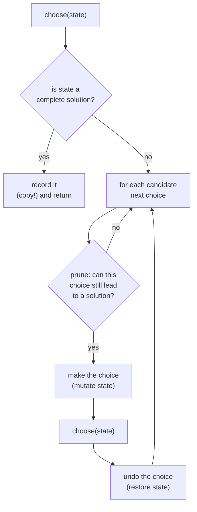

# Recursion and backtracking — enumerate, prune, undo

Backtracking is the technique for problems that ask for *all* solutions, or
*any* solution, when there is no shortcut: subsets, permutations, placements,
paths through a grid. You build a candidate one decision at a time, and the
moment a partial candidate cannot lead to a valid answer you abandon it and
step back. The skill is not the recursion — it is knowing what a "decision"
is, when to prune, and remembering to undo.

*In the Google round: backtracking shows up as "generate all X" or "does any
X exist" — subsets, combinations, N-Queens, word search — and the follow-up
twist is "now there are duplicates in the input", "now count instead of
enumerate" (which is where DP takes over), or "how big before this stops
being feasible".*

[Dynamic programming](15-dynamic-programming.md) is the next chapter for a
reason: it is what you reach for when backtracking's tree has overlapping
subproblems and you only need a count or an optimum, not the list.

---

## The costs

Backtracking is exponential by nature. Your job is to *state* the bound and
then explain what pruning buys.

| Problem shape | Solutions | Time to enumerate |
| --- | --- | --- |
| Subsets of n items | 2ⁿ | **O(n · 2ⁿ)** — each subset copied |
| Permutations of n items | n! | **O(n · n!)** |
| Combinations of k from n | C(n, k) | O(k · C(n, k)) |
| N-Queens | ~small | O(n!) worst, far less with pruning |
| Word search in an m×n grid, word length L | — | O(m · n · 3ᴸ) — three directions after the first step |
| Generate parentheses, n pairs | Catalan(n) ≈ 4ⁿ / n^1.5 | O(4ⁿ / √n) |

**The sentence to have ready:** "this is exponential because the output is
exponential — there are 2ⁿ subsets, so any algorithm that lists them is at
least O(2ⁿ). Pruning reduces the constant, not the class." When the question
only wants a count or a best value, say "then I don't need to enumerate, and
this becomes DP".

---

## How it actually works


*Every backtracking solution is this loop: check, choose, recurse, undo. The bugs live in the copy on record and the undo after recurse.*

### Who's who

| Term | Meaning |
| --- | --- |
| **State / path** | The partial candidate being built — usually an array you push to and pop from |
| **Choice** | One decision: include this element, place a queen in this column, take this character |
| **Decision tree** | Every choice is a branch; leaves are complete candidates |
| **Prune** | Skip a branch without exploring it because it cannot succeed |
| **Undo** | Reverse the mutation after the recursive call returns, so siblings see clean state |
| **Start index** | For combinations/subsets: only consider elements after the last chosen, so `{1,2}` and `{2,1}` are not both produced |
| **Used set** | For permutations: which elements are already in the path |
| **Feasibility check** | The predicate behind the prune — column/diagonal free, sum not exceeded, characters remaining |

---

## The techniques, in the order you should learn them

### 1. Include / exclude (subsets)

Two branches per element: take it or skip it. Depth `n`, 2ⁿ leaves. The
cleanest form iterates a start index so each subset is generated once.

### 2. Start index (combinations, combination sum)

Pass `start` into the recursion and only loop `i` from `start`. This is
what stops `[1,2]` and `[2,1]` both appearing. For combination sum with
reuse allowed, recurse with `i` (not `i + 1`); without reuse, `i + 1`.

### 3. Used set (permutations)

Order matters, so every element is a candidate at every depth *unless
already used*. A boolean array beats a `Set` for speed and reads cleanly.

### 4. Prune by feasibility

Sort the input first, then `break` (not `continue`) as soon as a candidate
would exceed the target — everything after it is larger too. This turns
combination sum from hopeless to fast.

### 5. Skip duplicates

Sort, then at each depth skip a value equal to the previous sibling:
`if (i > start && nums[i] === nums[i - 1]) continue;`. For permutations with
duplicates, the condition is `nums[i] === nums[i−1] && !used[i−1]`.

### 6. Constraint-tracking (N-Queens)

Instead of checking the board, keep sets of occupied columns and diagonals
(`r − c` and `r + c` are constant along each diagonal). The feasibility check
becomes three `has` calls.

### 7. Grid DFS with in-place marking (word search)

Mark a cell visited by overwriting it (`'#'`), recurse in four directions,
restore it. No visited set to copy.

---

## The bugs that actually cost you the round

| Bug | The fix |
| --- | --- |
| **Recording the path by reference** | `result.push(path)` stores the same array every time and it ends up empty. `result.push([...path])` or `path.slice()` |
| **Forgetting the undo** | The `pop()` after the recursive call. Without it, siblings inherit the wrong state |
| **`continue` where `break` is right** | Once a sorted candidate exceeds the target, every later one does too. `break` prunes the whole tail |
| **Duplicate outputs** | Missing start index (combinations) or missing the sorted-skip (inputs with repeats) |
| **Off-by-one on the start index** | `i` for "reuse allowed", `i + 1` for "each element once" — say which the problem is |
| **Not restoring the grid** | Word search that never un-marks `'#'` finds the first word and nothing else |
| **Stack depth** | Depth equals path length, so usually fine — but say it if `n` could be 10⁵ |

---

## Practice ladder

| # | Problem | What it teaches |
| --- | --- | --- |
| 1 | Subsets | Include/exclude, copy on record |
| 2 | Subsets II (duplicates) | Sort + skip equal siblings |
| 3 | Permutations | Used array; order matters |
| 4 | Combination sum | Start index with reuse; sort + break |
| 5 | Letter combinations of a phone number | Choice = one of several characters per position |
| 6 | Generate parentheses | Prune by a counting invariant, not a feasibility scan |
| 7 | Palindrome partitioning | Choice = where to cut; check before recursing |
| 8 | Word search | Grid DFS, mark and restore |
| 9 | N-Queens | Diagonal sets; count vs enumerate |
| 10 | Sudoku solver | The same as N-Queens with three constraint sets and early exit on first solution |

**Exit test:** for any "list all…" problem you can name the choice at each
level, the pruning condition, and the undo, before writing a line.

---

## Data structures

| Need | Use | Note |
| --- | --- | --- |
| The current path | `Array` + `push`/`pop` | Both O(1). Copy on record with `slice()` |
| Used elements (permutations) | `Array(n).fill(false)` | Faster than `Set`, and you can read it in a debugger |
| Occupied columns/diagonals | `Set` of numbers | `r − c` and `r + c` identify the two diagonals |
| Visited grid cells | Overwrite in place | `'#'` marker, restore after recursion |
| Results | `Array` of arrays | Or a counter, if the question only wants a count |

**Pseudocode — the skeleton every problem in this chapter is a variant of**

```js
function backtrack(nums) {
  const results = [];
  const path = [];

  function choose(start) {
    results.push([...path]);                 // record a COPY — path is reused
    for (let i = start; i < nums.length; i++) {
      // if (!feasible(nums[i])) break;      // prune here, on sorted input
      path.push(nums[i]);                    // make the choice
      choose(i + 1);                         // i+1: each element at most once
      path.pop();                            // undo, so the next sibling starts clean
    }
  }
  choose(0);
  return results;
}
```

This exact function generates all subsets. Change `i + 1` to `i` and add a
target and you have combination sum; replace the start index with a used
array and you have permutations. Learn the skeleton, then learn what each
problem changes.

---

## Worked problems

### Q: Subsets — every subset of a set of distinct integers
**Level:** intermediate · **Tags:** google-coding, backtracking, subsets

<details><summary>Model answer</summary>

**Problem.** `[1,2,3]` → `[[],[1],[1,2],[1,2,3],[1,3],[2],[2,3],[3]]` (any
order).

**Clarify first.** Distinct elements? (Yes — duplicates change the approach.)
Output order? (Any.) Size of `n`? (Small — up to ~20; the output is 2ⁿ.)

**Brute force.** Iterate the integers `0..2ⁿ−1` and use each bit as an
include flag. That is actually a fine answer — O(n · 2ⁿ) and iterative. Say
it, then show the recursive one because it generalises.

**The insight.** A subset is a sequence of include/exclude decisions. With a
start index, each recursion level picks the *next* element to include from
those after the last one, so every subset is produced exactly once and the
current path is always a valid subset — record it on entry.

**Algorithm.**
1. `choose(start)`: record a copy of `path`.
2. For `i` from `start`: push `nums[i]`, `choose(i + 1)`, pop.

```js
function subsets(nums) {
  const results = [];
  const path = [];
  function choose(start) {
    results.push([...path]);
    for (let i = start; i < nums.length; i++) {
      path.push(nums[i]);
      choose(i + 1);
      path.pop();
    }
  }
  choose(0);
  return results;
}
```

**Complexity.** O(n · 2ⁿ) time — 2ⁿ subsets, each copied in up to O(n).
O(n) recursion depth plus the output.

**Test it.**
- `[1,2,3]` → 8 subsets.
- `[]` → `[[]]`.
- `[5]` → `[[],[5]]`.
- Trace `[1,2]`: record `[]`; push 1, record `[1]`; push 2, record `[1,2]`;
  pop, pop; push 2, record `[2]`.

**What the interviewer is checking.** The copy on record, and that you can
state the bit-mask alternative.

</details>

**Follow-ups:**

1. Q: The input has duplicates — return unique subsets only.
   <details><summary>Answer</summary>

   Sort first, then skip a candidate equal to its previous sibling at the
   same depth:
   ```js
   for (let i = start; i < nums.length; i++) {
     if (i > start && nums[i] === nums[i - 1]) continue;
     ...
   }
   ```
   `i > start` (not `i > 0`) is the detail: the first occurrence at each
   depth is always allowed; only later equal siblings are skipped.

   </details>

2. Q: Only subsets of size k.
   <details><summary>Answer</summary>

   Record only when `path.length === k`, and prune: if
   `path.length + (nums.length − i) < k` there are not enough elements left,
   so `break`. That is the "combinations" problem.

   </details>

### Q: Permutations — every ordering of distinct integers
**Level:** intermediate · **Tags:** google-coding, backtracking, permutations, used-array

<details><summary>Model answer</summary>

**Problem.** `[1,2,3]` → six arrays: `[1,2,3],[1,3,2],[2,1,3],[2,3,1],[3,1,2],[3,2,1]`.

**Clarify first.** Distinct? (Yes.) `n` small? (Yes — n! output.) Any order?
(Yes.)

**Brute force.** Generate all nⁿ sequences and filter those with no repeats.
Correct, wasteful. Say it briefly.

**The insight.** Unlike subsets, order matters, so every unused element is a
candidate at every position. A `used` array tracks membership in O(1). A
permutation is complete when the path has `n` elements.

**Algorithm.**
1. If `path.length === n`, record a copy.
2. For each `i` not used: mark, push, recurse, pop, unmark.

```js
function permute(nums) {
  const results = [];
  const path = [];
  const used = new Array(nums.length).fill(false);
  function choose() {
    if (path.length === nums.length) { results.push([...path]); return; }
    for (let i = 0; i < nums.length; i++) {
      if (used[i]) continue;
      used[i] = true; path.push(nums[i]);
      choose();
      path.pop(); used[i] = false;         // undo both mutations
    }
  }
  choose();
  return results;
}
```

**Complexity.** O(n · n!) time, O(n) space beyond the output.

**Test it.**
- `[1,2,3]` → 6 results, all distinct.
- `[1]` → `[[1]]`; `[]` → `[[]]`.
- Check that `used` is fully `false` after the call — it is, if every mark
  has a matching unmark.

**What the interviewer is checking.** That you undo *both* the path and the
used flag, and that you can explain why there is no start index here.

</details>

**Follow-ups:**

1. Q: With duplicates in the input — unique permutations only.
   <details><summary>Answer</summary>

   Sort, then skip `nums[i]` when `nums[i] === nums[i−1] && !used[i−1]`.
   The `!used[i−1]` half means: among equal values, always take them in
   index order, so you never produce the same arrangement by picking the
   second copy before the first.

   </details>

2. Q: Do it in place with swaps, no used array.
   <details><summary>Answer</summary>

   Fix position `p`: for each `i ≥ p`, swap `nums[p]` and `nums[i]`, recurse
   on `p + 1`, swap back. O(1) extra space, same time. Output order differs
   and the duplicate-skipping rule becomes a per-level `Set` of values
   already placed at `p`.

   </details>

### Q: Combination sum — all combinations of candidates (reuse allowed) that sum to a target
**Level:** intermediate · **Tags:** google-coding, backtracking, start-index, pruning

<details><summary>Model answer</summary>

**Problem.** `candidates = [2,3,6,7], target = 7` → `[[2,2,3],[7]]`.
Candidates are distinct positive integers; each may be used any number of
times.

**Clarify first.** Positive only? (Yes — that is what makes pruning valid.)
Unlimited reuse? (Yes.) Are `[2,2,3]` and `[3,2,2]` the same? (Yes — one
combination.)

**Brute force.** Enumerate all multisets up to size `target / min` — same
tree without pruning. Say it and go straight to the pruned version.

**The insight.** Start index prevents reorderings of the same combination.
Recursing with `i` rather than `i + 1` allows reuse. Sorting the candidates
lets you `break` as soon as a candidate exceeds the remaining target — every
later candidate is larger.

**Algorithm.**
1. Sort.
2. `choose(start, remaining)`: if `remaining === 0`, record. For `i` from
   `start`: if `candidates[i] > remaining`, break; push, recurse with
   `(i, remaining − candidates[i])`, pop.

```js
function combinationSum(candidates, target) {
  candidates.sort((a, b) => a - b);
  const results = [];
  const path = [];
  function choose(start, remaining) {
    if (remaining === 0) { results.push([...path]); return; }
    for (let i = start; i < candidates.length; i++) {
      if (candidates[i] > remaining) break;    // sorted → all later ones too big
      path.push(candidates[i]);
      choose(i, remaining - candidates[i]);    // i, not i+1: reuse allowed
      path.pop();
    }
  }
  choose(0, target);
  return results;
}
```

**Complexity.** Exponential in the worst case — bounded by
O(N^(T/M)) where `T` is the target and `M` the smallest candidate, since
that is the maximum depth. Pruning makes it fast in practice.

**Test it.**
- `[2,3,6,7], 7` → `[[2,2,3],[7]]`.
- `[2], 1` → `[]`.
- `[1], 2` → `[[1,1]]`.
- `[2,3,5], 8` → `[[2,2,2,2],[2,3,3],[3,5]]`.

**What the interviewer is checking.** `i` vs `i + 1`, and `break` vs
`continue`. Both are one-character decisions with a reason each.

</details>

**Follow-ups:**

1. Q: Each candidate may be used at most once, and the input has duplicates.
   <details><summary>Answer</summary>

   Recurse with `i + 1`, and add the sorted-skip
   `if (i > start && candidates[i] === candidates[i−1]) continue;`. That is
   Combination Sum II.

   </details>

2. Q: Only the *number* of combinations, target up to 10⁴.
   <details><summary>Answer</summary>

   Enumeration is out. `ways[t] = Σ ways[t − c]` over candidates `c`, with
   the outer loop over candidates and the inner over `t` so each combination
   is counted once regardless of order. O(N · T). This is the coin-change
   counting DP in the [next chapter](15-dynamic-programming.md).

   </details>

### Q: Generate parentheses — all well-formed strings of n pairs
**Level:** intermediate · **Tags:** google-coding, backtracking, invariant-pruning

<details><summary>Model answer</summary>

**Problem.** `n = 3` → `["((()))","(()())","(())()","()(())","()()()"]`.

**Clarify first.** Only round brackets? (Yes.) Order? (Any.) `n = 0`?
(`[""]`.)

**Brute force.** Generate all 2^(2n) strings of `(` and `)` and keep the
balanced ones — validate each with a counter. O(2n · 4ⁿ).

**The insight.** A prefix can be extended to a valid string iff it never has
more `)` than `(` and uses at most `n` of each. So the decision at each
position is: add `(` if fewer than `n` used; add `)` if fewer than `(` so
far. Pruning by these two counters means every leaf is valid — no
validation pass.

**Algorithm.**
1. `choose(str, open, close)`: if `str.length === 2n`, record.
2. If `open < n`, recurse with `(`.
3. If `close < open`, recurse with `)`.

```js
function generateParenthesis(n) {
  const results = [];
  function choose(str, open, close) {
    if (str.length === 2 * n) { results.push(str); return; }
    if (open < n)      choose(str + '(', open + 1, close);
    if (close < open)  choose(str + ')', open, close + 1);
  }
  choose('', 0, 0);
  return results;
}
```

Strings are immutable in JS, so `str + '('` is the "make choice" and there
is no explicit undo — each call has its own string.

**Complexity.** Output is the n-th Catalan number, ≈ 4ⁿ / n^1.5; total work
is O(that × n) for the string building. O(n) depth.

**Test it.**
- `n = 1` → `["()"]`.
- `n = 2` → `["(())","()()"]`.
- `n = 3` → 5 strings.
- `n = 0` → `[""]`.

**What the interviewer is checking.** Whether you prune with an invariant
(two counters) or generate-then-filter. The former shows you understood the
structure.

</details>

**Follow-ups:**

1. Q: Count them without generating.
   <details><summary>Answer</summary>

   Catalan: `C(0) = 1`, `C(n) = Σ C(i) · C(n−1−i)` for `i` in `0..n−1`
   (choose where the matching `)` of the first `(` goes). O(n²) DP, or the
   closed form `C(2n, n) / (n + 1)`.

   </details>

2. Q: Three bracket types, and the string must be well-formed across all of them.
   <details><summary>Answer</summary>

   Counters no longer suffice — `([)]` has balanced counts but is invalid.
   Track a stack of open brackets in the path; you may close only with the
   matching type of the stack top. Same skeleton, richer state.

   </details>

### Q: Word search — does a word exist as a path of adjacent cells in a grid
**Level:** senior · **Tags:** google-coding, backtracking, grid-dfs, mark-and-restore

<details><summary>Model answer</summary>

**Problem.** `board = [["A","B","C","E"],["S","F","C","S"],["A","D","E","E"]]`,
`word = "ABCCED"` → `true`; `"ABCB"` → `false` (a cell may not be reused).

**Clarify first.** Adjacent means 4-directional? (Yes.) Cells may not be
reused within one path? (Correct.) May I mutate the board temporarily?
(Yes — otherwise use a visited set.) Grid and word sizes? (Up to ~200 cells,
word ≤ 15.)

**Brute force.** From every cell, try every path of length `L` — same DFS
without the character check at each step, which is 4ᴸ per start. The
character check *is* the pruning.

**The insight.** DFS from every cell whose letter matches `word[0]`. At each
step, match the current letter, mark the cell (overwrite with `'#'`), try
four neighbours for the next letter, restore. The early letter mismatch
prunes almost everything.

**Algorithm.**
1. For each cell `(r, c)`: if `dfs(r, c, 0)` return true.
2. `dfs(r, c, k)`: out of bounds or `board[r][c] !== word[k]` → false. If
   `k === word.length − 1` → true. Mark; recurse 4 ways with `k + 1`;
   restore; return the OR.

```js
function exist(board, word) {
  const R = board.length, C = board[0].length;
  function dfs(r, c, k) {
    if (r < 0 || c < 0 || r >= R || c >= C || board[r][c] !== word[k]) return false;
    if (k === word.length - 1) return true;
    const saved = board[r][c];
    board[r][c] = '#';                          // mark visited in place
    const found = dfs(r + 1, c, k + 1) || dfs(r - 1, c, k + 1) ||
                  dfs(r, c + 1, k + 1) || dfs(r, c - 1, k + 1);
    board[r][c] = saved;                        // restore before returning
    return found;
  }
  for (let r = 0; r < R; r++)
    for (let c = 0; c < C; c++)
      if (dfs(r, c, 0)) return true;
  return false;
}
```

The `||` short-circuit is deliberate — the first success stops the search —
but restoration must still happen, which is why `found` is computed before
the restore rather than returned directly from inside the chain.

**Complexity.** O(R · C · 3ᴸ) — after the first step each cell has at most
three unvisited neighbours. O(L) recursion depth.

**Test it.**
- `"ABCCED"` → true; `"SEE"` → true; `"ABCB"` → false.
- Single-cell board `[["A"]]`, word `"A"` → true; `"AA"` → false.
- After the call, the board is unchanged — assert it.

**What the interviewer is checking.** Mark *and* restore, and that the
mismatch check happens before the base case so the last letter is actually
compared.

</details>

**Follow-ups:**

1. Q: Search for many words at once (Word Search II).
   <details><summary>Answer</summary>

   Build a trie of the words and DFS the grid *along the trie*: at each
   cell, descend to the child for that letter or stop. Each grid path is
   explored once for all words instead of once per word. Remove a word from
   the trie once found to prune further. O(R · C · 4 · 3^(L−1)) worst case
   but vastly faster in practice.

   </details>

2. Q: A cell can be reused — what changes?
   <details><summary>Answer</summary>

   Remove the mark/restore. But now "path exists" for a word like `"AAAA"`
   on a board with two adjacent `A`s is trivially true, and the search can
   loop — bound the depth by the word length (it already is, via `k`).

   </details>

### Q: N-Queens — place n queens on an n×n board so none attack another
**Level:** senior · **Tags:** google-coding, backtracking, constraint-sets, n-queens

<details><summary>Model answer</summary>

**Problem.** Return all distinct boards. `n = 4` → 2 solutions:
`[".Q..","...Q","Q...","..Q."]` and `["..Q.","Q...","...Q",".Q.."]`.

**Clarify first.** Return boards as strings, or just the count? (Boards —
count is the follow-up.) `n = 1` → one solution; `n = 2, 3` → none.

**Brute force.** Try every placement of `n` queens on `n²` cells and check:
C(n², n). Say it to dismiss it.

**The insight.** One queen per row is forced, so the decision at row `r` is
only *which column*. A placement is legal iff the column, the `r − c`
diagonal and the `r + c` anti-diagonal are all unoccupied. Three `Set`s
make that an O(1) check, and the row-by-row structure means the recursion
depth is `n`.

**Algorithm.**
1. `place(r)`: if `r === n`, record the board.
2. For each column `c`: if `c`, `r − c`, `r + c` are all free, occupy them,
   set `cols[r] = c`, recurse `r + 1`, then release.

```js
function solveNQueens(n) {
  const results = [];
  const queenCol = new Array(n).fill(-1);     // queenCol[r] = column of the queen in row r
  const cols = new Set(), diag = new Set(), anti = new Set();

  function place(r) {
    if (r === n) {
      results.push(queenCol.map(c => '.'.repeat(c) + 'Q' + '.'.repeat(n - c - 1)));
      return;
    }
    for (let c = 0; c < n; c++) {
      if (cols.has(c) || diag.has(r - c) || anti.has(r + c)) continue;
      cols.add(c); diag.add(r - c); anti.add(r + c); queenCol[r] = c;
      place(r + 1);
      cols.delete(c); diag.delete(r - c); anti.delete(r + c);   // undo all three
    }
  }
  place(0);
  return results;
}
```

**Complexity.** O(n!) upper bound on the tree (row 0 has n choices, row 1 at
most n − 2 legal, …); each solution costs O(n²) to render. O(n) space for
the sets and depth.

**Test it.**
- `n = 4` → 2 boards, matching the ones above.
- `n = 1` → `[["Q"]]`.
- `n = 2` and `n = 3` → `[]`.
- `n = 8` → 92 solutions (the classical number — a good sanity check).

**What the interviewer is checking.** The diagonal identities `r − c` and
`r + c`, and undoing all three sets. Also whether you know to fix one queen
per row rather than searching cells.

</details>

**Follow-ups:**

1. Q: Only count the solutions for n up to 14.
   <details><summary>Answer</summary>

   Drop the board rendering and increment a counter at `r === n`. For speed,
   replace the three `Set`s with three bitmasks (`cols`, `diag << 1`,
   `anti >> 1` shifted per row) — the same algorithm in O(1) per check with
   tiny constants. n = 14 is ~365k solutions and runs in well under a second.

   </details>

2. Q: Why is Sudoku the same problem?
   <details><summary>Answer</summary>

   Cell by cell, choose a digit not in the row, column or 3×3 box (three
   constraint sets, indexed by row, column and box id), recurse, undo. The
   difference is you stop at the first full board rather than enumerating
   all. Pick the empty cell with the fewest legal digits first — that
   heuristic is what makes hard puzzles fast.

   </details>

---

## Interview Q&A

### Q: How do you decide between backtracking and dynamic programming for a problem?
**Level:** intermediate · **Tags:** google-coding, backtracking, dp, technique-choice

<details><summary>Model answer</summary>

I ask what the output is. If it's *the list* of solutions — every subset,
every valid board, every path — I have to enumerate them, the output is
exponential, and backtracking is the tool. Pruning trims the tree but the
class stays exponential because the answer itself is that big.

If the output is a *number* — a count, a maximum, a boolean "does one
exist" — then I don't need to see every solution, and I check whether the
recursion has overlapping subproblems: does `solve(i, remaining)` get called
with the same arguments from different branches? If yes, memoise it and it
becomes DP with a polynomial bound.

The tell in a Google round is the follow-up. Combination sum asks for the
list — backtracking. "How many ways to make the target" is the same tree,
counted — that's the coin-change DP. Being able to say "same recursion,
different question, so I'd switch from enumerating to memoising" is the
answer they're listening for.

</details>

**Follow-ups:**

1. Q: Can backtracking ever be the right choice for a count?
   <details><summary>Answer</summary>

   When the subproblems don't overlap, memoisation buys nothing. N-Queens
   counting is the example — the state is the full set of occupied columns
   and diagonals, so no two branches share a subproblem, and the
   backtracking with bitmasks *is* the best known practical method.

   </details>

### Q: What is the general skeleton of a backtracking solution, and where do the bugs hide?
**Level:** foundation · **Tags:** google-coding, backtracking, skeleton

<details><summary>Model answer</summary>

Four lines, always: check whether the state is complete and record it if so;
loop over the candidate choices; for each, make the choice, recurse, undo
the choice. Everything else is problem-specific pruning.

The bugs live in two places. The record step — pushing `path` itself rather
than a copy, so every entry in the result is the same array, which ends up
empty. And the undo — forgetting the `pop()`, or undoing only one of two
mutations when there's also a `used` flag or a constraint set, so siblings
see a polluted state.

The third, subtler one is `continue` versus `break` in the pruning check.
If the candidates are sorted and one is already too large, every later one
is too — `break`. Using `continue` there is still correct, just
exponentially slower, which is the kind of thing that is right on the small
example and wrong on the follow-up.

</details>

**Follow-ups:**

1. Q: How do you avoid duplicate results when the input has repeated values?
   <details><summary>Answer</summary>

   Sort, then at each depth skip a candidate equal to the *previous sibling*
   — `i > start && nums[i] === nums[i − 1]`. The first copy at each level is
   always allowed; later copies are redundant because they'd generate the
   same subtree. For permutations the condition is
   `nums[i] === nums[i − 1] && !used[i − 1]`.

   </details>

---

## What a weak answer sounds like

- "I'll generate everything and then filter." Fine as the stated brute force;
  a problem if it is the final answer.
- Writing `results.push(path)` and being surprised that the output is a list
  of empty arrays.
- Not being able to say why the algorithm is exponential — "because
  recursion" is not a reason; "because there are 2ⁿ subsets" is.
- Reaching for backtracking on a counting problem with a target of 10⁴ and
  not noticing it will never finish.

---

## Glossary

| Term | Meaning |
| --- | --- |
| **Backtracking** | Depth-first construction of candidates with pruning and undo |
| **Prune** | Abandon a partial candidate that cannot become a solution |
| **Start index** | Parameter ensuring combinations are generated in one canonical order |
| **Used array** | Per-element flag for permutations, where order matters |
| **Catalan number** | Count of well-formed bracket strings with n pairs; ≈ 4ⁿ / n^1.5 |
| **Mark and restore** | Visiting a grid cell by overwriting it, then putting the value back |
| **Memoisation** | Caching recursive results — the bridge from backtracking to DP |
