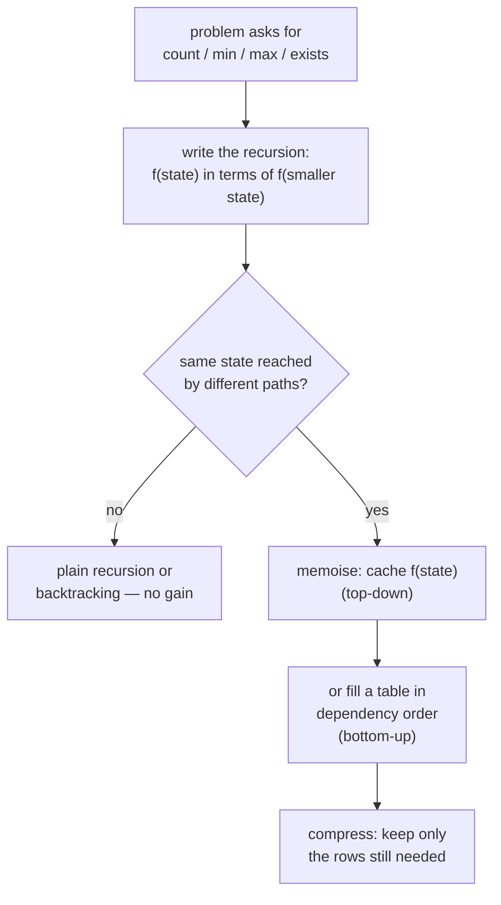

# Dynamic programming — recursion with a memory

Dynamic programming is what backtracking becomes when the recursion tree has
repeated subproblems and the question wants a count or an optimum rather
than the list. You write the recursion, notice the same call happening many
times, and cache it. That is the whole idea; the reputation for difficulty
comes from the *state* being hard to name, not from the technique.

*In the Google round: DP appears as "minimum cost / number of ways / longest
X" — coin change, edit distance, LIS, word break — usually after a
backtracking warm-up, and the follow-up twist is "reconstruct the actual
answer, not just its value", "reduce the space to O(n)", or "the input is
now 10⁶ long".*

Read [backtracking](14-recursion-and-backtracking.md) first. Every DP here
starts as a recursion you could have written there.

---

## The costs

DP time is (number of states) × (work per state). Say both parts.

| Problem | States | Per state | Time | Space (naive → optimised) |
| --- | --- | --- | --- | --- |
| Climbing stairs / house robber | n | O(1) | **O(n)** | O(n) → O(1) |
| Coin change (min coins) | amount | O(coins) | **O(amount · coins)** | O(amount) |
| Longest increasing subsequence | n | O(n) | O(n²) — **O(n log n)** with patience sort | O(n) |
| LCS / edit distance | m × n | O(1) | **O(m · n)** | O(m·n) → O(min(m, n)) |
| 0/1 knapsack | n × W | O(1) | **O(n · W)** — pseudo-polynomial | O(n·W) → O(W) |
| Word break | n | O(n · dict lookup) | O(n²) | O(n) |
| Unique paths with obstacles | m × n | O(1) | O(m · n) | O(n) |

**Pseudo-polynomial** is a phrase to have ready for knapsack and coin change:
the bound is polynomial in the *value* of `W`, not the number of bits to
write it, so a target of 10⁹ is not feasible even though "O(n · W)" looks
tame.

---

## How it actually works


*Recursion first, then cache, then table, then compress. Skipping to the table is where people get lost — the recursion is what tells you the state.*

### Who's who

| Term | Meaning |
| --- | --- |
| **State** | The arguments to the recursive function — what uniquely identifies a subproblem. `(i)`, `(i, j)`, `(i, remaining)` |
| **Transition** | How `f(state)` is computed from smaller states — the recurrence |
| **Base case** | The states with a direct answer: empty prefix, zero remaining |
| **Overlapping subproblems** | The same state recomputed from different branches — the reason to cache |
| **Optimal substructure** | The optimum of the whole contains optima of parts — the reason the recurrence is valid |
| **Top-down / memoisation** | Recursion plus a cache. Easy to write; recursion depth is the cost |
| **Bottom-up / tabulation** | Fill the table from base cases in dependency order. No recursion; needs you to know the order |
| **Rolling array** | Keep only the last row(s) of the table when the transition only looks back a fixed distance |
| **Reconstruction** | Recovering the actual answer (the subsequence, the coins) from the table by walking back |

---

## The techniques, in the order you should learn them

### 1. 1-D over a prefix — `f(i)` from `f(i−1)`, `f(i−2)`

Climbing stairs, house robber, min-cost stairs. State is the index; the
transition looks back a constant number of steps, so space compresses to
O(1).

### 2. 1-D over a target — `f(t)` from `f(t − c)` for each choice `c`

Coin change (min and count), combination sum count. State is the remaining
amount; the transition tries every coin.

**Loop-order trap:** for *counting combinations* the outer loop is over
coins and the inner over amounts, so each combination is counted once. For
*counting permutations* (order matters), swap them. For *min coins*, order
does not matter.

### 3. 1-D with an O(n) transition — LIS

`f(i)` = longest increasing subsequence *ending at* `i` = 1 + max over
`j < i` with `a[j] < a[i]`. O(n²). The O(n log n) version replaces the scan
with binary search over a "tails" array.

### 4. 2-D over two prefixes — LCS, edit distance

`f(i, j)` compares `a[0..i)` with `b[0..j)`. If the last characters match,
use the diagonal; otherwise take the best of dropping one side. The table is
`(m+1) × (n+1)` with the zero row and column as base cases.

### 5. 2-D over item × capacity — knapsack

`f(i, w)` = best value using the first `i` items with capacity `w`: skip
item `i`, or take it if it fits. Compress to 1-D by iterating `w`
**downwards** so each item is used at most once.

### 6. Boolean DP — word break

`f(i)` = can `s[0..i)` be segmented. `f(i)` is true if any `j < i` has
`f(j)` true and `s[j..i)` in the dictionary.

### 7. Grid DP — unique paths

`f(r, c) = f(r−1, c) + f(r, c−1)`, zero on an obstacle. Compress to one row.

---

## The bugs that actually cost you the round

| Bug | The fix |
| --- | --- |
| **Wrong state** | If two calls with the same arguments could have different answers, the state is missing something. Name every variable the answer depends on |
| **Memo key collision** | `memo[i + '-' + j]` not `memo[i + j]` — `(1, 12)` and `(11, 2)` must differ |
| **Base case off by one** | `dp[0]` is the *empty* prefix. Size the table `n + 1`, and index the string with `s[i − 1]` |
| **Knapsack inner loop upward** | Iterating `w` from 0 up in the 1-D version lets an item be taken twice. Go **down** for 0/1, up for unbounded |
| **Coin-change loop order** | Amount-outer counts permutations, coin-outer counts combinations. Say which the problem wants |
| **`Infinity` arithmetic** | `Infinity + 1` is fine in JS, but `Math.min(...)` over an empty set is `Infinity` — check the "unreachable" sentinel survives to the end |
| **Recursion depth** | Top-down on `n = 10⁵` overflows. Switch to bottom-up, and say why |
| **Reconstruction from a compressed table** | Once you've rolled the array you can't walk back. Keep the full table, or store parent pointers, if the answer itself is required |

---

## Practice ladder

| # | Problem | What it teaches |
| --- | --- | --- |
| 1 | Climbing stairs | The recurrence; O(1) space |
| 2 | House robber | Take/skip decision; O(1) space |
| 3 | Coin change (min) | Target-indexed; `Infinity` sentinel |
| 4 | Coin change II (count) | Loop order decides combinations vs permutations |
| 5 | Longest increasing subsequence | O(n²) then O(n log n) with tails |
| 6 | Longest common subsequence | 2-D over two prefixes |
| 7 | Edit distance | LCS with three moves; reconstruction |
| 8 | 0/1 knapsack | Item × capacity; downward loop for 1-D |
| 9 | Word break | Boolean DP over cut points |
| 10 | Unique paths with obstacles | Grid DP, one-row compression |
| 11 | Best time to buy/sell with cooldown | State machine DP — several arrays, one per state |
| 12 | Longest palindromic subsequence | 2-D on one string, interval DP |

**Exit test:** for an unseen "count / min / max" problem you can write
`f(state)` and its recurrence in under three minutes, then say the table
size and per-cell work as the complexity.

---

## Data structures

| Need | Use | Note |
| --- | --- | --- |
| 1-D table | `new Array(n + 1).fill(0)` | Size `n + 1` so `dp[0]` is the empty prefix |
| 2-D table | `Array.from({length: m + 1}, () => new Array(n + 1).fill(0))` | **Not** `new Array(m).fill(new Array(n))` — every row would be the same array |
| Top-down cache | `Map` keyed by a string, or a nested array | `Map` for sparse states; array when the state space is dense and small |
| Unreachable sentinel | `Infinity` for min problems, `-Infinity` for max | Survives `Math.min`/`Math.max` correctly |
| Rolling rows | Two arrays swapped, or one array iterated in the right direction | Direction matters — see knapsack |

**Pseudocode — the shape of every top-down solution**

```js
function solve(input) {
  const memo = new Map();
  function f(i, j) {                       // the state — every variable the answer depends on
    if (/* base case */) return /* direct answer */;
    const key = i + ',' + j;               // a key that cannot collide
    if (memo.has(key)) return memo.get(key);
    let best = /* Infinity | -Infinity | 0 */;
    // for each choice: best = combine(best, f(smaller state))
    memo.set(key, best);
    return best;
  }
  return f(/* initial state */);
}
```

Convert to bottom-up by replacing `f` with a table and looping the states in
an order where every dependency is already filled — usually increasing `i`,
increasing `j`.

---

## Worked problems

### Q: House robber — max sum of non-adjacent elements
**Level:** intermediate · **Tags:** google-coding, dp, 1d, take-or-skip

<details><summary>Model answer</summary>

**Problem.** `nums = [2,7,9,3,1]` → `12` (2 + 9 + 1). You may not take two
adjacent elements.

**Clarify first.** Non-negative values? (Yes — with negatives you'd never
take them anyway, but say you checked.) Empty? (0.) Return the sum, not the
indices? (The sum.)

**Brute force.** Try every subset with no two adjacent — 2ⁿ. Or recurse
"take `i` and skip to `i + 2`, or skip to `i + 1`" without caching: still
exponential, but that recursion *is* the answer once memoised.

**The insight.** The best you can do with the first `i` houses depends only
on the best with the first `i − 1` and `i − 2`: either you skip house `i`
(`f(i−1)`) or you take it and add it to `f(i−2)`. Two numbers of state, so
O(1) space.

**Algorithm.**
1. `prev2 = 0`, `prev1 = 0`.
2. For each `x`: `cur = max(prev1, prev2 + x)`; shift.
3. Return `prev1`.

```js
function rob(nums) {
  let prev2 = 0, prev1 = 0;          // best up to i-2, best up to i-1
  for (const x of nums) {
    const cur = Math.max(prev1, prev2 + x);   // skip house i, or take it
    prev2 = prev1;
    prev1 = cur;
  }
  return prev1;
}
```

**Complexity.** O(n) time, O(1) space.

**Test it.**
- `[2,7,9,3,1]` → 12.
- `[1,2,3,1]` → 4.
- `[]` → 0; `[5]` → 5; `[2,1]` → 2.

**What the interviewer is checking.** That you state the recurrence in one
sentence and compress to O(1) without being asked — this is the warm-up, so
the bar is speed and clarity.

</details>

**Follow-ups:**

1. Q: The houses are in a circle — first and last are adjacent.
   <details><summary>Answer</summary>

   Run the linear version twice: on `nums[0..n−2]` and on `nums[1..n−1]`,
   and take the max. The two runs cover "first house possibly taken" and
   "last house possibly taken"; they cannot both be taken. Handle `n = 1`
   separately.

   </details>

2. Q: Return which houses to rob.
   <details><summary>Answer</summary>

   Keep the full `dp` array, then walk back from `n − 1`: if
   `dp[i] === dp[i−1]` house `i` was skipped, move to `i − 1`; otherwise it
   was taken, record it, move to `i − 2`. O(n) space — the price of
   reconstruction.

   </details>

### Q: Coin change — fewest coins to make an amount, or −1
**Level:** intermediate · **Tags:** google-coding, dp, target-indexed, unbounded

<details><summary>Model answer</summary>

**Problem.** `coins = [1,2,5], amount = 11` → `3` (5 + 5 + 1).
`coins = [2], amount = 3` → `−1`.

**Clarify first.** Unlimited supply of each coin? (Yes.) Positive
denominations? (Yes.) `amount = 0` → 0. Size of amount? (Up to 10⁴ — the
table is fine.)

**Brute force.** Try every multiset of coins — exponential. Greedy (largest
coin first) is wrong in general: `coins = [1,3,4], amount = 6` → greedy gives
4+1+1 = 3, optimal is 3+3 = 2. Say that counter-example; it shows you know
why DP is needed.

**The insight.** The minimum for amount `t` is 1 + the minimum for
`t − c` over every coin `c ≤ t`. Amount `0` needs 0 coins. Fill upward; an
amount that stays at the `Infinity` sentinel is unreachable.

**Algorithm.**
1. `dp = [0, ∞, ∞, …]` of length `amount + 1`.
2. For `t` from 1 to `amount`: for each coin `c ≤ t`,
   `dp[t] = min(dp[t], dp[t − c] + 1)`.
3. Return `dp[amount]` or −1.

```js
function coinChange(coins, amount) {
  const dp = new Array(amount + 1).fill(Infinity);
  dp[0] = 0;
  for (let t = 1; t <= amount; t++) {
    for (const c of coins) {
      if (c <= t) dp[t] = Math.min(dp[t], dp[t - c] + 1);   // Infinity + 1 stays Infinity
    }
  }
  return dp[amount] === Infinity ? -1 : dp[amount];
}
```

**Complexity.** O(amount · coins) time, O(amount) space. Pseudo-polynomial
— say it.

**Test it.**
- `[1,2,5], 11` → 3.
- `[2], 3` → −1.
- `[1], 0` → 0.
- `[1,3,4], 6` → 2 — the greedy counter-example.

**What the interviewer is checking.** The greedy counter-example, the
sentinel, and that you can state the loop order doesn't matter *for this
variant* (it does for counting).

</details>

**Follow-ups:**

1. Q: Count the number of *combinations* that make the amount.
   <details><summary>Answer</summary>

   `ways[0] = 1`; outer loop over coins, inner over amounts:
   ```js
   for (const c of coins)
     for (let t = c; t <= amount; t++) ways[t] += ways[t - c];
   ```
   Coin-outer means each combination is built in one canonical coin order.
   Swapping the loops counts ordered sequences instead — a different
   question.

   </details>

2. Q: Return the coins used.
   <details><summary>Answer</summary>

   Store `from[t] = c` whenever `dp[t]` improves via coin `c`, then walk
   `t → t − from[t]` down to 0, collecting coins. O(amount) extra space.

   </details>

### Q: Longest increasing subsequence — length of the longest strictly increasing subsequence
**Level:** senior · **Tags:** google-coding, dp, lis, binary-search

<details><summary>Model answer</summary>

**Problem.** `[10,9,2,5,3,7,101,18]` → `4` (`2,3,7,101` or `2,3,7,18`).

**Clarify first.** Strictly increasing? (Yes — equal values don't extend.)
Subsequence, not subarray? (Yes — elements need not be adjacent.) `n` up to?
(10⁴ — O(n²) passes; 10⁵ needs O(n log n).)

**Brute force.** Every subsequence: 2ⁿ. Then the O(n²) DP, which is the
expected first real answer.

**The insight (O(n²)).** Let `f(i)` = LIS *ending at* index `i`. Then
`f(i) = 1 + max f(j)` over `j < i` with `a[j] < a[i]`. The answer is the max
over all `i`, not `f(n−1)`.

**The insight (O(n log n)).** Keep `tails[k]` = the smallest possible tail
of an increasing subsequence of length `k + 1`. `tails` is sorted, so each
new value either extends it (if larger than everything) or replaces the
first tail `≥` it via binary search. The *length* of `tails` is the answer;
its contents are not the subsequence.

**Algorithm.** (O(n log n).)
1. `tails = []`.
2. For each `x`: binary-search the first index `i` with `tails[i] >= x`;
   if none, push `x`; else `tails[i] = x`.
3. Return `tails.length`.

```js
function lengthOfLIS(nums) {
  const tails = [];
  for (const x of nums) {
    let lo = 0, hi = tails.length;           // find first tails[i] >= x
    while (lo < hi) {
      const mid = (lo + hi) >> 1;
      if (tails[mid] < x) lo = mid + 1; else hi = mid;
    }
    if (lo === tails.length) tails.push(x);  // x extends the longest so far
    else tails[lo] = x;                      // x gives a smaller tail for length lo+1
  }
  return tails.length;
}
```

**Complexity.** O(n log n) time, O(n) space. The O(n²) version is O(n)
space too.

**Test it.**
- `[10,9,2,5,3,7,101,18]` → 4.
- `[0,1,0,3,2,3]` → 4.
- `[7,7,7]` → 1 — strictness; `tails` stays `[7]`.
- `[]` → 0.

**What the interviewer is checking.** That you present O(n²) cleanly and
know the O(n log n) trick *and its limitation* — `tails` is not the
subsequence.

</details>

**Follow-ups:**

1. Q: Return the actual subsequence.
   <details><summary>Answer</summary>

   With the O(n²) DP, store `parent[i] = j` and walk back from the argmax.
   With the O(n log n) version, store for each `x` the index it was placed
   at and the index of the previous element in `tails` at that time, then
   walk back through those pointers. Both O(n) extra.

   </details>

2. Q: Non-decreasing instead of strictly increasing.
   <details><summary>Answer</summary>

   Binary-search for the first tail *strictly greater* than `x`
   (`tails[mid] <= x` → `lo = mid + 1`). One comparison flips.

   </details>

### Q: Edit distance — minimum single-character inserts, deletes and replaces to turn one string into another
**Level:** senior · **Tags:** google-coding, dp, 2d, edit-distance, lcs

<details><summary>Model answer</summary>

**Problem.** `"horse"` → `"ros"` = `3` (replace h→r, delete r, delete e).
`"intention"` → `"execution"` = `5`.

**Clarify first.** All three operations cost 1? (Yes.) Case sensitive?
(Yes.) Empty strings? (Distance is the other's length.) Lengths up to?
(A few thousand — O(m·n) table is fine.)

**Brute force.** Try every operation at every position recursively —
exponential — but that recursion, memoised on `(i, j)`, is the solution.

**The insight.** `f(i, j)` = distance between `a[0..i)` and `b[0..j)`. If
`a[i−1] === b[j−1]`, the last characters cost nothing: `f(i−1, j−1)`.
Otherwise take the cheapest of replace (`f(i−1, j−1)`), delete from `a`
(`f(i−1, j)`), insert into `a` (`f(i, j−1)`), plus 1. Base cases: `f(i, 0) = i`,
`f(0, j) = j`.

**Algorithm.**
1. Table `(m+1) × (n+1)`; fill row 0 and column 0 with their indices.
2. For `i` in 1..m, `j` in 1..n: apply the recurrence.
3. Return `dp[m][n]`.

```js
function minDistance(a, b) {
  const m = a.length, n = b.length;
  const dp = Array.from({ length: m + 1 }, () => new Array(n + 1).fill(0));
  for (let i = 0; i <= m; i++) dp[i][0] = i;   // delete everything
  for (let j = 0; j <= n; j++) dp[0][j] = j;   // insert everything
  for (let i = 1; i <= m; i++) {
    for (let j = 1; j <= n; j++) {
      if (a[i - 1] === b[j - 1]) dp[i][j] = dp[i - 1][j - 1];
      else dp[i][j] = 1 + Math.min(
        dp[i - 1][j - 1],   // replace
        dp[i - 1][j],       // delete a[i-1]
        dp[i][j - 1],       // insert b[j-1]
      );
    }
  }
  return dp[m][n];
}
```

`a[i − 1]` with a table of size `m + 1` is the indexing to get right: row
`i` describes the prefix of length `i`, whose last character is at `i − 1`.

**Complexity.** O(m · n) time and space; O(min(m, n)) space with two
rolling rows, since each cell only needs the previous row and the cell to
its left.

**Test it.**
- `"horse","ros"` → 3. `"intention","execution"` → 5.
- `"","abc"` → 3; `"abc",""` → 3.
- `"abc","abc"` → 0 — the diagonal all the way.

**What the interviewer is checking.** The three moves mapped to the three
neighbours, the base cases, and whether you can reduce space and say what
you lose (reconstruction).

</details>

**Follow-ups:**

1. Q: Longest common subsequence — how is it related?
   <details><summary>Answer</summary>

   Same table shape. `lcs(i, j) = 1 + lcs(i−1, j−1)` on a match, else
   `max(lcs(i−1, j), lcs(i, j−1))`. With only insert and delete allowed,
   edit distance is `m + n − 2 · LCS`.

   </details>

2. Q: Reconstruct the sequence of edits.
   <details><summary>Answer</summary>

   Keep the full table and walk from `(m, n)`: if characters match and
   `dp[i][j] === dp[i−1][j−1]`, move diagonally with no edit; otherwise
   move to whichever neighbour equals `dp[i][j] − 1` and record the
   corresponding operation. Reverse the list at the end.

   </details>

3. Q: Strings of length 10⁵ each.
   <details><summary>Answer</summary>

   10¹⁰ cells is out. Options: if the distance is known to be small (`k`),
   only compute the band of width `2k + 1` around the diagonal — O(n · k).
   Or use bit-parallel algorithms (Myers) for the LCS-style variants. Say
   the constraint changes the algorithm, not just the constants.

   </details>

### Q: 0/1 knapsack — max value with a weight limit, each item at most once
**Level:** senior · **Tags:** google-coding, dp, knapsack, space-compression

<details><summary>Model answer</summary>

**Problem.** `weights = [1,3,4,5]`, `values = [1,4,5,7]`, `W = 7` → `9`
(items with weights 3 and 4).

**Clarify first.** Integer weights? (Yes — the table is indexed by weight.)
Each item once? (Yes — that is the "0/1".) `W` up to? (A few thousand.)
Return the value only? (Yes.)

**Brute force.** Every subset: 2ⁿ. Greedy by value/weight ratio is wrong
for 0/1 (right for the fractional variant) — say so.

**The insight.** `f(i, w)` = best value using the first `i` items with
capacity `w`: either skip item `i` (`f(i−1, w)`) or, if it fits, take it
(`values[i] + f(i−1, w − weights[i])`). Because row `i` depends only on row
`i − 1`, one array suffices — provided you iterate `w` *downwards*, so the
value you read at `w − weight` is still from the previous item.

**Algorithm.**
1. `dp = Array(W + 1).fill(0)`.
2. For each item: for `w` from `W` down to `weight`:
   `dp[w] = max(dp[w], dp[w − weight] + value)`.
3. Return `dp[W]`.

```js
function knapsack(weights, values, W) {
  const dp = new Array(W + 1).fill(0);      // dp[w] = best value with capacity w
  for (let i = 0; i < weights.length; i++) {
    for (let w = W; w >= weights[i]; w--) { // DOWN: dp[w - weight] must be from the previous item
      dp[w] = Math.max(dp[w], dp[w - weights[i]] + values[i]);
    }
  }
  return dp[W];
}
```

**Complexity.** O(n · W) time, O(W) space. Pseudo-polynomial in `W`.

**Test it.**
- The example → 9.
- `W = 0` → 0.
- Single item heavier than `W` → 0.
- `weights = [2,2], values = [3,3], W = 3` → 3 — the downward loop is what
  stops the same item being counted twice; upward would give 6.

**What the interviewer is checking.** The loop direction and *why*. Ask
yourself: what does `dp[w − weight]` hold at the moment you read it?

</details>

**Follow-ups:**

1. Q: Unbounded knapsack — each item any number of times.
   <details><summary>Answer</summary>

   Iterate `w` *upwards*. Now `dp[w − weight]` already includes the current
   item, which is exactly what reuse means. That single direction change is
   the whole difference — and it is coin change.

   </details>

2. Q: Which items were taken?
   <details><summary>Answer</summary>

   Keep the 2-D table. From `(n, W)`: if `dp[i][w] !== dp[i−1][w]` item `i`
   was taken; subtract its weight and continue at `i − 1`. O(n · W) space.

   </details>

3. Q: Partition an array into two subsets of equal sum.
   <details><summary>Answer</summary>

   A knapsack with capacity `total / 2` and boolean reachability:
   `can[w] |= can[w − x]`, downward loop. Answer `can[total / 2]`; odd
   total → false immediately.

   </details>

### Q: Word break — can a string be segmented into dictionary words
**Level:** intermediate · **Tags:** google-coding, dp, boolean, word-break

<details><summary>Model answer</summary>

**Problem.** `s = "leetcode"`, `dict = ["leet","code"]` → `true`.
`s = "catsandog"`, `dict = ["cats","dog","sand","and","cat"]` → `false`.

**Clarify first.** May a dictionary word be reused? (Yes.) Case sensitive?
(Yes.) `s` length and dictionary size? (Up to a few hundred and a few
thousand.) Return boolean, not the segmentation? (Boolean.)

**Brute force.** Try every split point recursively — exponential in the
number of valid prefixes. Memoise on the start index and it becomes the
DP.

**The insight.** `f(i)` = whether `s[0..i)` can be segmented. `f(0)` is
true (empty). `f(i)` is true if there is a `j < i` with `f(j)` true and
`s[j..i)` in the dictionary. Put the dictionary in a `Set` for O(1)
membership, and cap `i − j` at the longest word to prune.

**Algorithm.**
1. `can = [true, false, …]` of length `n + 1`.
2. For `i` in 1..n: for `j` from `i − 1` down to `max(0, i − maxLen)`: if
   `can[j] && dict.has(s.slice(j, i))`, set `can[i] = true` and break.
3. Return `can[n]`.

```js
function wordBreak(s, wordDict) {
  const dict = new Set(wordDict);
  const maxLen = Math.max(0, ...wordDict.map(w => w.length));
  const can = new Array(s.length + 1).fill(false);
  can[0] = true;                                       // empty prefix
  for (let i = 1; i <= s.length; i++) {
    for (let j = i - 1; j >= Math.max(0, i - maxLen); j--) {
      if (can[j] && dict.has(s.slice(j, i))) { can[i] = true; break; }
    }
  }
  return can[s.length];
}
```

**Complexity.** O(n · L · L) where `L` is the longest word — `n` positions,
up to `L` split points, `slice` costs up to `L`. O(n) space plus the set.

**Test it.**
- `"leetcode"` → true. `"applepenapple", ["apple","pen"]` → true (reuse).
- `"catsandog"` → false.
- `""` → true (vacuously); empty dictionary with non-empty `s` → false.

**What the interviewer is checking.** That `can[0] = true` is explained, and
that you bound the inner loop by the longest word rather than scanning to 0.

</details>

**Follow-ups:**

1. Q: Return all possible segmentations.
   <details><summary>Answer</summary>

   Now the output can be exponential, so it's backtracking with
   memoisation: `sentences(i)` returns the list of segmentations of
   `s[i..)`, cached. Run the boolean DP first and only recurse into
   positions that can reach the end — otherwise you enumerate dead ends.

   </details>

2. Q: The dictionary is huge — 10⁶ words — and s is long.
   <details><summary>Answer</summary>

   Replace `slice` + `Set` with a trie walk from each `j`: at position `j`,
   walk the trie forward through `s` and mark every `i` where a word ends.
   No substring allocation, and the walk stops at the first missing edge.
   O(n · L) with tiny constants.

   </details>

### Q: Unique paths with obstacles — count paths from top-left to bottom-right moving only right or down
**Level:** intermediate · **Tags:** google-coding, dp, grid, rolling-row

<details><summary>Model answer</summary>

**Problem.** `grid = [[0,0,0],[0,1,0],[0,0,0]]` (1 = obstacle) → `2`.

**Clarify first.** Only right and down moves? (Yes.) Start or end may be an
obstacle? (Then 0.) Grid up to? (100 × 100 — counts may exceed 2⁵³; ask if
a modulus is wanted.)

**Brute force.** DFS every path — exponential (C(m+n−2, m−1) paths).

**The insight.** Paths to a cell = paths to the cell above + paths to the
cell on the left, unless the cell is an obstacle (then 0). The first row and
column are 1 until the first obstacle, then 0 after it. Row `r` depends only
on row `r − 1` and the cell to the left, so one row of state suffices.

**Algorithm.**
1. `row = Array(n).fill(0)`; `row[0] = grid[0][0] === 0 ? 1 : 0`.
2. For each `r`, for each `c`: if obstacle, `row[c] = 0`; else if `c > 0`,
   `row[c] += row[c − 1]`.
3. Return `row[n − 1]`.

```js
function uniquePathsWithObstacles(grid) {
  const m = grid.length, n = grid[0].length;
  const row = new Array(n).fill(0);
  row[0] = grid[0][0] === 0 ? 1 : 0;
  for (let r = 0; r < m; r++) {
    for (let c = 0; c < n; c++) {
      if (grid[r][c] === 1) row[c] = 0;            // obstacle: no paths through here
      else if (c > 0) row[c] += row[c - 1];        // row[c] still holds "from above"
    }
  }
  return row[n - 1];
}
```

The in-place update works because when you reach `row[c]` it still holds
the value from the previous row (paths from above), and `row[c − 1]` has
already been updated for this row (paths from the left).

**Complexity.** O(m · n) time, O(n) space.

**Test it.**
- The example → 2.
- `[[0,1],[0,0]]` → 1.
- `[[1]]` → 0; `[[0]]` → 1.
- Obstacle in the first row: `[[0,1,0],[0,0,0]]` → 1 — the cell right of the
  obstacle in row 0 must be 0, which the `row[c] = 0` reset guarantees.

**What the interviewer is checking.** The single-row compression and the
argument for why it is correct in place.

</details>

**Follow-ups:**

1. Q: Minimum path sum instead of a count.
   <details><summary>Answer</summary>

   Same shape with `min` instead of `+`:
   `row[c] = grid[r][c] + min(row[c], row[c − 1])`, with the first row and
   column as running sums. O(m · n), O(n).

   </details>

2. Q: Moves in all four directions.
   <details><summary>Answer</summary>

   Then it isn't a DAG — paths can revisit — and DP over cells no longer
   works. Counting simple paths is #P-hard in general; for shortest path
   use BFS. Recognising when DP stops applying is the follow-up's point.

   </details>

---

## Interview Q&A

### Q: How do you recognise a DP problem, and how do you find the state?
**Level:** intermediate · **Tags:** google-coding, dp, technique-choice

<details><summary>Model answer</summary>

Two signals. The question asks for a count, a minimum, a maximum, or a
yes/no — never the list of solutions. And the naive recursion revisits the
same subproblem: when I sketch "solve this by making one decision and
recursing on what's left", the same `(i, remaining)` shows up from different
branches.

For the state I ask: what is the smallest set of variables such that, given
them, the rest of the answer doesn't depend on how I got here? For a string
it's usually a prefix index; for two strings, two indices; for a
capacity-style problem, an index plus what's left; for a "state machine"
problem like buy/sell with cooldown, the index plus which state I'm in.
If two calls with the same arguments could give different answers, I'm
missing a variable.

Then I write the recurrence, the base cases, and read the complexity
straight off it: number of states times work per state. I'd write it
top-down first because it's the recursion with a cache, and go bottom-up
only if the depth is a problem or the space needs compressing.

</details>

**Follow-ups:**

1. Q: When is memoisation enough and when do you need tabulation?
   <details><summary>Answer</summary>

   Memoisation is enough when the recursion depth fits the stack and you
   don't need to compress space — it only computes states that are actually
   reachable, which can be far fewer than the table. Tabulation when `n` is
   10⁵ (depth), when you want the rolling-array space reduction, or when
   the constant factor matters — array access beats `Map` lookups.

   </details>

### Q: What does "pseudo-polynomial" mean and why does it matter for knapsack?
**Level:** senior · **Tags:** google-coding, dp, complexity

<details><summary>Model answer</summary>

Knapsack's DP is O(n · W). That looks polynomial, but `W` is a *number*,
and the input size is the number of bits needed to write it — log W. So the
running time is exponential in the input length. That's pseudo-polynomial:
polynomial in the magnitude, exponential in the encoding.

It matters practically: a capacity of 10⁴ is trivial, 10⁹ is not, even
though it's "the same algorithm". If an interviewer bumps the capacity to
10⁹ with a handful of items, the answer changes to meet-in-the-middle or
branch-and-bound over the 2ⁿ subsets, not a bigger table. And it's the
reason knapsack is NP-hard yet solved every day: the hard instances are the
ones with huge weights.

</details>

**Follow-ups:**

1. Q: Is coin change pseudo-polynomial too?
   <details><summary>Answer</summary>

   Yes — O(amount · coins) for the same reason. With small denominations
   and an amount of 10¹², you'd look for structure instead: canonical coin
   systems where greedy is provably optimal, or number-theoretic bounds on
   how many of the smallest coins can ever be needed.

   </details>

---

## What a weak answer sounds like

- Jumping to "I'll make a 2-D table" without being able to say what a cell
  means.
- A memo keyed by `i + j`.
- Filling the knapsack array upwards and getting the sample right by luck.
- Saying "O(n · W), so it's polynomial" without the pseudo-polynomial
  caveat.
- Not knowing that the O(n log n) LIS `tails` array isn't the subsequence.

---

## Glossary

| Term | Meaning |
| --- | --- |
| **State** | The tuple of arguments identifying a subproblem |
| **Recurrence / transition** | The formula computing a state from smaller ones |
| **Memoisation** | Top-down recursion with a cache |
| **Tabulation** | Bottom-up table fill in dependency order |
| **Rolling array** | Keeping only the rows the transition still needs |
| **Pseudo-polynomial** | Polynomial in a numeric value, exponential in its bit length |
| **Optimal substructure** | The optimum of a problem contains optima of its subproblems |
| **Reconstruction** | Walking the table back to recover the answer, not just its value |
| **Patience sort / tails** | The O(n log n) LIS technique; the array's length is the answer, not its content |
