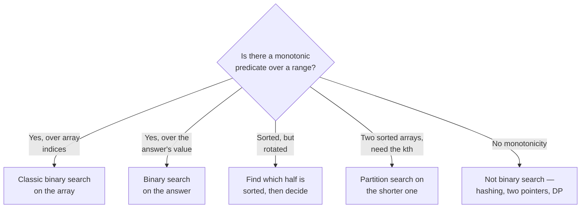

# Binary search and bit tricks — halving the problem, and the tricks below the integers

Binary search is the one algorithm everyone claims to know and most people
get wrong under pressure. The off-by-one on `hi`, the infinite loop on `lo =
mid`, the wrong answer on a rotated array — those cost more rounds than any
hard algorithm does, because the interviewer knows you *should* have it cold.

*In the Google round: binary search appears as "sorted but rotated", "find
the boundary", or — the real test — "binary search on the answer" where
nothing in the input is sorted at all; bit problems are short warm-ups whose
follow-ups probe whether you understand two's complement and masks rather
than having memorised `n & (n - 1)`.*

The bigger idea is that binary search is not about sorted arrays. It's about
any **monotonic predicate**: if `f(x)` is false…false…true…true over some
range, you can find the boundary in O(log range) evaluations. Sorted arrays
are the special case where `f(i) = a[i] >= target`.

---

## The costs

| Technique | Time | Space | Answers |
| --- | --- | --- | --- |
| Binary search, sorted array | **O(log n)** | O(1) | Is it there? Where's the boundary? |
| Binary search on the answer | **O(log(range) · check)** | O(1) | Smallest x that satisfies a monotonic condition |
| Rotated-array search | O(log n) | O(1) | Same, when the sort has a pivot |
| Median of two sorted arrays | **O(log min(m, n))** | O(1) | Partition search |
| Bit tricks (`&`, `|`, `^`, shifts) | **O(1)** per op | O(1) | Parity, powers of two, sets as masks |
| Counting bits for 0..n | O(n) | O(n) | DP over bit structure |

**O(log n) is a small number.** For n = 10⁹ it's 30 steps. If your solution
to a "find x" problem is O(n) and the input is sorted or the predicate is
monotonic, you've missed the point.

---

## How it actually works


*Binary search is a decision about a predicate, not a data structure. Find the monotonic yes/no question first; the array, if any, comes second.*

### Who's who

| Term | Meaning |
| --- | --- |
| **Monotonic predicate** | A yes/no function that flips at most once across the range — `F F F T T T` |
| **Boundary** | The first index where it flips. Almost every binary search is "find the boundary" |
| **`lo`, `hi`** | The search interval. Decide up front whether `hi` is inclusive — and never change your mind mid-function |
| **`mid`** | `lo + ((hi - lo) >> 1)`. The overflow-safe form; say why even in JS |
| **Rotated array** | Sorted, then cut and swapped: `[4,5,6,7,0,1,2]`. One half is always sorted |
| **Binary search on the answer** | The answer is a number; checking a candidate is cheap; larger candidates make the check easier — so search over candidates |
| **Two's complement** | How negative integers are stored: `-x = ~x + 1`. Why `x & -x` isolates the lowest set bit |
| **Mask** | An integer used as a set of booleans. Bit `i` set ⇔ element `i` present |

### The one template to memorise

Learn one shape and derive every variant from it. This one finds the **first
index where a predicate is true** over `[lo, hi)` — a half-open interval. It
cannot infinite-loop and it handles "not found" cleanly (returns `hi`).

```js
// First index i in [lo, hi) such that pred(i) is true; returns hi if none.
// Invariant: pred is false for everything before lo, true for everything at/after hi.
function lowerBound(lo, hi, pred) {
  while (lo < hi) {
    const mid = lo + ((hi - lo) >> 1);
    if (pred(mid)) hi = mid;        // mid might be the answer; keep it in range
    else lo = mid + 1;              // mid is definitely not; exclude it
  }
  return lo;
}
```

Every problem below is this function with a different `pred`. "Find target"
is `pred(i) = a[i] >= target` then check `a[lo] === target`. "Last true" is
"first false minus one". "Smallest speed that works" is `pred(speed) =
canFinish(speed)`.

**Why half-open?** Because `hi = mid` and `lo = mid + 1` are the only two
moves, they're asymmetric by design, and the interval always shrinks. The
closed-interval version needs `hi = mid - 1` and a `<=` loop condition and
that's where the off-by-ones live.

---

## The techniques, in the order you should learn them

### 1. Classic search, then boundaries

Find-the-target is the warm-up. The real skill is boundaries: first
occurrence, last occurrence, first element ≥ x, insertion point. All are
`lowerBound` with the right predicate.

### 2. Rotated sorted array

At any `mid`, at least one of `[lo, mid]` and `[mid, hi]` is sorted. Check
which (compare `a[lo]` with `a[mid]`), see whether the target lies inside the
sorted half, and discard the other half. Still O(log n), one extra comparison
per step.

### 3. Binary search on the answer

The input isn't sorted; the *answer space* is. "Minimum speed to finish in
time", "minimum capacity to ship in d days", "smallest largest-subarray-sum
with k splits". If a feasibility check is O(n) and feasibility is monotonic
in the candidate, search candidates: O(n log range).

### 4. Partition search

Median of two sorted arrays. You're not searching for a value — you're
searching for a *cut position* in the shorter array such that everything
left of both cuts is ≤ everything right. O(log min(m, n)).

### 5. Bits

Ten tricks, all O(1), all built on two's complement:

| Trick | Does | Why |
| --- | --- | --- |
| `n & (n - 1)` | Clears the lowest set bit | Subtracting 1 flips the lowest set bit and everything below it |
| `n & -n` | Isolates the lowest set bit | `-n = ~n + 1`; only the lowest set bit survives the `&` |
| `n & (n - 1) === 0` | Power of two (for n > 0) | Exactly one bit set |
| `x ^ y ^ y === x` | XOR cancels | Finding the single non-duplicated number |
| `n >> k`, `n << k` | Divide / multiply by 2ᵏ | Shifts; beware 32-bit in JS |
| `(n >> i) & 1` | Read bit i | |
| `n \| (1 << i)` | Set bit i | |
| `n & ~(1 << i)` | Clear bit i | |
| `mask` over `2^k` values | Enumerate subsets | `for (let m = 0; m < 1 << k; m++)` |
| `popcount` | Count set bits | Loop with `n &= n - 1`, one iteration per set bit |

**JS caveat, say it out loud:** bitwise operators work on **32-bit signed
integers**. `1 << 31` is negative; `1 << 32` is `1`. For anything beyond 31
bits use `BigInt` or `Math.floor(n / 2)` arithmetic. Interviewers who know JS
will ask.

---

## The bugs that actually cost you the round

| Bug | Fix |
| --- | --- |
| **`lo = mid` in a loop** | Infinite loop when `hi - lo === 1`. Use `lo = mid + 1`, or bias `mid` upward |
| **Mixing inclusive and exclusive `hi`** | Pick half-open `[lo, hi)` and never write `hi = mid - 1` |
| **`(lo + hi) / 2` without floor** | Fractional index. `lo + ((hi - lo) >> 1)` |
| **Checking `a[mid] === target` and returning early** in a boundary search | Returns *an* occurrence, not the first |
| **Rotated array with duplicates** | `a[lo] === a[mid]` tells you nothing about which half is sorted; shrink `lo++` and accept O(n) worst case |
| **Non-monotonic predicate** | Binary search silently returns garbage. Prove monotonicity before searching |
| **Search range too narrow on "answer" problems** | `hi` must be a value that definitely works — often `max(a)` or `sum(a)`, not `n` |
| **32-bit bit ops on large numbers** | `1 << 31` is negative in JS |
| **`n & (n - 1)` on `n = 0`** | Returns 0, which looks like "power of two". Guard `n > 0` |

---

## Practice ladder

| # | Problem | What it teaches |
| --- | --- | --- |
| 1 | Binary search (find target) | The template, half-open |
| 2 | First and last position of target | Boundaries via two predicates |
| 3 | Search insert position | `lowerBound` directly |
| 4 | Find minimum in rotated sorted array | Which half is sorted |
| 5 | Search in rotated sorted array | Same, plus the target check |
| 6 | Koko eating bananas | Binary search on the answer |
| 7 | Capacity to ship packages in D days | Same pattern, different feasibility check |
| 8 | Split array largest sum | Same pattern; the check is a greedy count |
| 9 | Median of two sorted arrays | Partition search |
| 10 | Single number / single number II | XOR; then per-bit counting mod 3 |
| 11 | Counting bits | DP: `bits[i] = bits[i >> 1] + (i & 1)` |
| 12 | Power of two, hamming distance, reverse bits | The trick table |

**Exit test:** you can write `lowerBound` from memory without an off-by-one,
explain in one sentence why a rotated array still admits binary search, and
turn "minimum X such that Y" into a predicate and a range within a minute.

---

## Data structures

Nothing beyond the array — that's the point of the pattern. The structure is
the *invariant*, not a container.

| Need | Use | Note |
| --- | --- | --- |
| The search space | Two integers `lo`, `hi` | Half-open. Nothing else |
| Predicate | A closure | `(i) => a[i] >= target`; `(speed) => canFinish(speed)` |
| Bit sets up to 31 elements | A `number` as a mask | `1 << i` for element i |
| Bit sets beyond 31 | `BigInt`, or an `Array` of 32-bit words | Say which and why |
| Counting set bits | Loop with `n &= n - 1` | One iteration per set bit, not per bit position |

**Pseudocode — binary search on the answer, the skeleton for problems 6–8**

```js
// Smallest candidate in [lo, hi] for which feasible(candidate) is true.
// Requires: feasible is monotonic (false...false true...true) over the range,
// and hi is a candidate that is guaranteed feasible.
function minFeasible(lo, hi, feasible) {
  while (lo < hi) {
    const mid = lo + ((hi - lo) >> 1);
    if (feasible(mid)) hi = mid;      // works: maybe something smaller works too
    else lo = mid + 1;                // doesn't: everything at/below mid is out
  }
  return lo;
}
```

The whole art is choosing `lo`, `hi` and `feasible`. `lo` is the smallest
value that could possibly work (often 1 or `max(a)`), `hi` the value that
trivially works (often `sum(a)` or `max(a)`), and `feasible` is a greedy
O(n) pass.

---

## Worked problems

### Q: Search in rotated sorted array — find a target in a sorted array that was rotated at an unknown pivot
**Level:** intermediate · **Tags:** google-coding, binary-search, rotated-array

<details><summary>Model answer</summary>

**Problem.** `nums` was sorted ascending with distinct values, then rotated:
`[4,5,6,7,0,1,2]`. Return the index of `target` or -1, in O(log n). Example:
`target = 0 → 4`; `target = 3 → -1`.

**Clarify first.** Distinct values? (Yes — duplicates change the complexity;
follow-up.) Could the rotation be zero, i.e. the array is simply sorted?
(Yes; the algorithm must handle it.) Empty array → -1.

**Brute force.** Linear scan, O(n). Or find the pivot with one binary search
then binary search the correct half — two searches, O(log n), perfectly
acceptable; the single-pass version below is what most interviewers want to
see because it shows you understand the invariant.

**The insight.** Split at `mid`. Because the array is one sorted run cut in
two, **at least one of `[lo..mid]` and `[mid..hi]` is sorted** — you can tell
which by comparing `nums[lo]` with `nums[mid]`. If the target lies inside the
sorted half's range, search there; otherwise search the other half. Either
way you discard half the array.

**Algorithm.**
1. `lo = 0, hi = n - 1` (closed, because we compare against `nums[hi]`).
2. If `nums[mid] === target`, return `mid`.
3. If `nums[lo] <= nums[mid]`, the left half is sorted: if `nums[lo] <=
   target < nums[mid]` go left, else go right.
4. Otherwise the right half is sorted: if `nums[mid] < target <= nums[hi]`
   go right, else go left.

```js
function search(nums, target) {
  let lo = 0, hi = nums.length - 1;
  while (lo <= hi) {
    const mid = lo + ((hi - lo) >> 1);
    if (nums[mid] === target) return mid;
    if (nums[lo] <= nums[mid]) {                        // left half sorted
      if (nums[lo] <= target && target < nums[mid]) hi = mid - 1;
      else lo = mid + 1;
    } else {                                            // right half sorted
      if (nums[mid] < target && target <= nums[hi]) lo = mid + 1;
      else hi = mid - 1;
    }
  }
  return -1;
}
```

**Complexity.** O(log n) time, O(1) space.

**Test it.**
- `[4,5,6,7,0,1,2], 0` → mid=3 (7); left sorted; 0 not in [4,7) → right;
  lo=4, mid=5 (1); `nums[4]=0 <= 1` left sorted; 0 in [0,1) → hi=4; mid=4 → 0.
  Returns 4.
- `[4,5,6,7,0,1,2], 3` → -1.
- Not rotated `[1,2,3], 3` → 2.
- Single element `[1], 1` → 0; `[1], 0` → -1.
- Two elements `[3,1], 1` → mid=0 (3); `nums[0] <= nums[0]` left "sorted";
  1 not in [3,3) → lo=1; mid=1 → 1. Returns 1. The `<=` in the sorted check
  is what makes `lo === mid` work.

**What the interviewer is checking.** The "one half is always sorted"
invariant stated clearly, the `<=` versus `<` at each boundary, and that you
notice why closed intervals are used here (you compare against `nums[hi]`).

</details>

**Follow-ups:**

1. Q: The array may contain duplicates.
   <details><summary>Answer</summary>

   When `nums[lo] === nums[mid] === nums[hi]` you can't tell which half is
   sorted — `[1,1,1,2,1]` and `[1,2,1,1,1]` look identical at those three
   points. The fix is to shrink both ends by one (`lo++; hi--`) in that case
   and continue. Worst case degrades to O(n) (all duplicates), which is
   provably unavoidable; average stays O(log n). Say the degradation
   explicitly rather than hoping the interviewer doesn't ask.

   </details>

2. Q: Find the minimum element instead (equivalently, the rotation count).
   <details><summary>Answer</summary>

   Binary search where the predicate is `nums[mid] <= nums[hi]` — "is mid in
   the second sorted run?" That's monotonic (false for the first run, true for
   the second), so `lowerBound` over indices finds the first true, which is
   the minimum. O(log n); the rotation count is that index.

   ```js
   function findMin(nums) {
     let lo = 0, hi = nums.length - 1;
     while (lo < hi) {
       const mid = lo + ((hi - lo) >> 1);
       if (nums[mid] <= nums[hi]) hi = mid;   // min is at mid or left of it
       else lo = mid + 1;
     }
     return nums[lo];
   }
   ```

   </details>

### Q: Find first and last position — the range of indices where a target appears in a sorted array, in O(log n)
**Level:** intermediate · **Tags:** google-coding, binary-search, boundaries

<details><summary>Model answer</summary>

**Problem.** Sorted `nums` with duplicates; return `[first, last]` indices of
`target`, or `[-1, -1]`. Example: `[5,7,7,8,8,10], 8 → [3, 4]`; `6 → [-1,-1]`.

**Clarify first.** Ascending? (Yes.) Can the array be empty? (Return
`[-1,-1]`.) Do they want O(log n) *strictly* — i.e. is a linear expand-from-
mid acceptable? (No: with all-equal elements that's O(n). Two boundary
searches.)

**Brute force.** Binary search to any occurrence, then expand left and right.
O(n) worst case when the array is all `target`. It's the answer that looks
right and fails the "why is this O(log n)?" question.

**The insight.** "First position of target" is the first index where `a[i] >=
target`. "Last position" is one less than the first index where `a[i] >
target`. Both are `lowerBound` with a different predicate — two independent
O(log n) searches, and the same helper.

**Algorithm.**
1. `first = lowerBound(0, n, i => nums[i] >= target)`.
2. If `first === n` or `nums[first] !== target`, return `[-1,-1]`.
3. `last = lowerBound(0, n, i => nums[i] > target) - 1`.

```js
function searchRange(nums, target) {
  const n = nums.length;
  const first = lowerBound(0, n, i => nums[i] >= target);
  if (first === n || nums[first] !== target) return [-1, -1];
  const last = lowerBound(0, n, i => nums[i] > target) - 1;
  return [first, last];
}
```

**Complexity.** O(log n) time, O(1) space.

**Test it.**
- `[5,7,7,8,8,10], 8` → first: 3; last: first index > 8 is 5, minus 1 → 4.
- `6` → first index >= 6 is 1 (`7`), which isn't 6 → `[-1,-1]`.
- All equal `[2,2,2], 2` → `[0, 2]`.
- Target beyond the end `[1,2], 5` → first === n → `[-1,-1]`.

**What the interviewer is checking.** That you reduce both bounds to the same
primitive rather than writing two subtly different loops, and that you handle
`first === n` before indexing.

</details>

**Follow-ups:**

1. Q: Count occurrences of every distinct value in the array, in better than O(n) per query.
   <details><summary>Answer</summary>

   Each count is `upperBound - lowerBound`, O(log n) per query, so `q` queries
   cost O(q log n) with no preprocessing. If you'll query many times, a single
   O(n) pass into a `Map` of counts makes queries O(1) — say which you'd
   choose depends on the query-to-size ratio.

   </details>

2. Q: The array is sorted but you can only access it through a `get(i)` that's expensive and you don't know `n`.
   <details><summary>Answer</summary>

   Exponential (galloping) search first: probe `get(1), get(2), get(4), …`
   until the value exceeds the target or the accessor signals out-of-range;
   that finds a bound in O(log position) probes. Then binary search inside
   `[2ᵏ⁻¹, 2ᵏ]`. Total O(log p) where `p` is the answer's position — the
   "unbounded binary search" pattern.

   </details>

### Q: Koko eating bananas — the minimum eating speed to finish all piles within h hours
**Level:** intermediate · **Tags:** google-coding, binary-search, search-on-answer

<details><summary>Model answer</summary>

**Problem.** `piles[i]` bananas in pile `i`; Koko eats `k` bananas per hour
from one pile at a time (if a pile has fewer than `k`, the hour is spent
anyway). Find the minimum integer `k` such that all piles are finished in `h`
hours. Example: `[3,6,7,11], h = 8 → 4`.

**Clarify first.** `h >= piles.length`? (Must be, or it's impossible — each
pile takes at least an hour.) Integer speeds only? (Yes.) Pile sizes up to
10⁹? (Assume yes — rules out per-banana simulation.)

**Brute force.** Try `k = 1, 2, 3, …` until one works. Each check is O(n),
and `k` can be up to `max(piles)`, so O(n · max) — 10⁹ × n. Out.

**The insight.** Feasibility is monotonic in `k`: if speed `k` finishes in
time, any faster speed does too. So the answer space `[1, max(piles)]` is
`F…F T…T` and binary search over *speeds* finds the first `T` in O(log max)
checks, each an O(n) sum of `ceil(pile / k)`.

**Algorithm.**
1. `lo = 1`, `hi = max(piles)` (which always works).
2. `feasible(k) = sum(ceil(p / k)) <= h`.
3. `minFeasible(lo, hi, feasible)`.

```js
function minEatingSpeed(piles, h) {
  const feasible = k => {
    let hours = 0;
    for (const p of piles) hours += Math.ceil(p / k);
    return hours <= h;
  };
  let lo = 1, hi = Math.max(...piles);
  while (lo < hi) {
    const mid = lo + ((hi - lo) >> 1);
    if (feasible(mid)) hi = mid;
    else lo = mid + 1;
  }
  return lo;
}
```

**Complexity.** O(n log M) where M = max pile. O(1) space.

**Test it.**
- `[3,6,7,11], h=8`: k=4 → 1+2+2+3 = 8 ✓; k=3 → 1+2+3+4 = 10 ✗. Answer 4.
- `[30,11,23,4,20], h=5` → must be `max` = 30 (one pile per hour).
- Single pile `[1000000000], h=2` → 500000000.
- `h` equal to number of piles → `max(piles)`; the search converges there.

**What the interviewer is checking.** That you articulate *why* the predicate
is monotonic, choose `hi = max` (not `sum`, which also works but wastes
iterations), and use `Math.ceil` rather than integer division plus a fix-up.

</details>

**Follow-ups:**

1. Q: Same pattern, different story: ship packages within D days with minimum capacity; split an array into k parts minimising the largest sum.
   <details><summary>Answer</summary>

   Identical skeleton. Ship-within-D: `lo = max(weights)`, `hi = sum(weights)`,
   feasible = greedy pass counting how many days a capacity needs. Split
   array: same `lo`/`hi`, feasible = greedy count of subarrays whose sum stays
   under the candidate, compare to `k`. Recognising that all three are one
   pattern is the senior signal; writing the greedy check correctly (reset the
   running sum *after* counting a new bucket) is the intermediate one.

   ```js
   function splitArray(nums, k) {
     const feasible = cap => {
       let parts = 1, run = 0;
       for (const x of nums) {
         if (run + x > cap) { parts++; run = x; } else run += x;
       }
       return parts <= k;
     };
     let lo = Math.max(...nums), hi = nums.reduce((s, x) => s + x, 0);
     while (lo < hi) {
       const mid = lo + ((hi - lo) >> 1);
       if (feasible(mid)) hi = mid; else lo = mid + 1;
     }
     return lo;
   }
   ```

   </details>

2. Q: Speeds can be real numbers and you need the answer to 6 decimal places.
   <details><summary>Answer</summary>

   Binary search on a real interval: loop a fixed number of iterations
   (~100, or until `hi - lo < 1e-7`) with `mid = (lo + hi) / 2` and `hi = mid`
   / `lo = mid` — no `+1`, since there's no integer step. Precision, not
   termination on equality, is the stopping rule.

   </details>

### Q: Median of two sorted arrays — in O(log(min(m, n)))
**Level:** senior · **Tags:** google-coding, binary-search, partition

<details><summary>Model answer</summary>

**Problem.** Two sorted arrays `A` (length m) and `B` (length n). Return the
median of the combined sorted sequence without merging. Example: `[1,3],
[2] → 2.0`; `[1,2], [3,4] → 2.5`.

**Clarify first.** Both non-empty, or can one be empty? (Either may be empty;
the combined length is ≥ 1.) Is O(m + n) acceptable? (The interviewer wants
log — say the merge is the baseline and move on.) Integers? (Assume numbers;
the median may be fractional.)

**Brute force.** Merge until you've passed half the elements: O(m + n) time,
O(1) space with two pointers. It's a good answer and you should say it in one
sentence before the real one.

**The insight.** The median splits the combined sequence into a left half and
a right half of known sizes. Choose a cut `i` in `A` (taking `A[0..i)` on the
left); the cut in `B` is then forced: `j = half - i`. The cut is correct when
`A[i-1] <= B[j]` and `B[j-1] <= A[i]` — every left element ≤ every right
element. If `A[i-1] > B[j]`, `i` is too big; if `B[j-1] > A[i]`, `i` is too
small. That's a monotonic condition on `i`, so binary search `i` over the
**shorter** array.

**Algorithm.**
1. Ensure `A` is the shorter array.
2. `half = floor((m + n + 1) / 2)` — the left side gets the extra element
   when the total is odd.
3. Binary search `i` in `[0, m]`; `j = half - i`.
4. Use `±Infinity` for out-of-range neighbours.
5. When the cut is valid: odd total → `max(leftA, leftB)`; even → average of
   `max(lefts)` and `min(rights)`.

```js
function findMedianSortedArrays(A, B) {
  if (A.length > B.length) [A, B] = [B, A];          // search the shorter one
  const m = A.length, n = B.length;
  const half = (m + n + 1) >> 1;
  let lo = 0, hi = m;
  while (lo <= hi) {
    const i = lo + ((hi - lo) >> 1);                 // elements of A on the left
    const j = half - i;                              // elements of B on the left
    const leftA  = i === 0 ? -Infinity : A[i - 1];
    const rightA = i === m ?  Infinity : A[i];
    const leftB  = j === 0 ? -Infinity : B[j - 1];
    const rightB = j === n ?  Infinity : B[j];
    if (leftA <= rightB && leftB <= rightA) {        // correct partition
      if ((m + n) % 2 === 1) return Math.max(leftA, leftB);
      return (Math.max(leftA, leftB) + Math.min(rightA, rightB)) / 2;
    }
    if (leftA > rightB) hi = i - 1;                  // too many from A on the left
    else lo = i + 1;                                 // too few
  }
  throw new Error('inputs not sorted');
}
```

**Complexity.** O(log min(m, n)) time, O(1) space.

**Test it.**
- `[1,3], [2]`: m=2, n=1, half=2. i=1, j=1: leftA=1, rightA=3, leftB=2,
  rightB=∞ → valid; odd → max(1,2) = 2. ✓
- `[1,2], [3,4]`: half=2. i=1, j=1: leftA=1, rightA=2, leftB=3, rightB=4 →
  `leftB(3) > rightA(2)` → lo=2. i=2, j=0: leftA=2, rightA=∞, leftB=-∞,
  rightB=3 → valid; even → (2 + 3)/2 = 2.5. ✓
- `[], [1]` → m=0, i=0, j=1: leftB=1 → odd → 1.
- `[1,1], [1,1]` → 1.

**What the interviewer is checking.** Whether you can explain the partition
invariant before touching code, why you search the shorter array (so `j` is
never negative), and the `±Infinity` sentinels instead of four special cases.

</details>

**Follow-ups:**

1. Q: Generalise to the kth smallest of two sorted arrays.
   <details><summary>Answer</summary>

   Same partition idea with `half = k`: find `i` such that `A[0..i)` and
   `B[0..k-i)` are exactly the k smallest. The answer is `max(A[i-1], B[j-1])`.
   Bounds on `i` become `[max(0, k - n), min(k, m)]` so `j` stays valid.
   O(log min(m, n, k)).

   </details>

2. Q: There are `t` sorted arrays, not two.
   <details><summary>Answer</summary>

   The pairwise partition trick doesn't generalise cleanly. Binary search on
   the *value* instead: pick a candidate median value, count how many
   elements across all arrays are ≤ it (one `upperBound` per array, O(t log
   L)), and adjust. O(t · log L · log range). Or a heap-based k-way merge to
   the middle at O(N log t). The value-search is the elegant answer; say
   both.

   </details>

### Q: Single number — every element appears twice except one; find it in O(n) time, O(1) space
**Level:** intermediate · **Tags:** google-coding, bits, xor

<details><summary>Model answer</summary>

**Problem.** `nums` where every value appears exactly twice except one that
appears once. Return that one. Example: `[4,1,2,1,2] → 4`.

**Clarify first.** Exactly one singleton, and all others exactly twice?
(Yes — the follow-up changes both.) Integers within 32-bit? (Assume yes;
otherwise `BigInt` for the XOR.) O(1) space is a hard requirement? (Yes —
that's what rules out the map.)

**Brute force.** Count with a `Map`, return the key with count 1. O(n) time,
O(n) space. Sort and scan pairs: O(n log n), O(1) extra. Both fine; neither
is the answer being asked for.

**The insight.** XOR is associative, commutative, `x ^ x = 0`, and `x ^ 0 =
x`. XOR everything together: every pair cancels to 0, leaving the singleton.
One pass, one variable.

**Algorithm.** `acc = 0; for x of nums: acc ^= x; return acc`.

```js
function singleNumber(nums) {
  let acc = 0;
  for (const x of nums) acc ^= x;   // pairs cancel; the lone value survives
  return acc;
}
```

**Complexity.** O(n) time, O(1) space.

**Test it.**
- `[4,1,2,1,2]` → 4 ^ 1 ^ 2 ^ 1 ^ 2 = 4.
- `[7]` → 7.
- Negative numbers `[-3, 5, 5]` → -3 (XOR on two's complement is fine).
- A value of 0 as the singleton `[0, 9, 9]` → 0 — note the accumulator starts
  at 0 and that's not a problem.

**What the interviewer is checking.** That you can state the XOR properties
that make it work, not just the trick. Then they'll change the counts.

</details>

**Follow-ups:**

1. Q: Every element appears three times except one.
   <details><summary>Answer</summary>

   XOR alone fails — three copies don't cancel. Count per bit position: for
   each of the 32 bits, count how many numbers have it set, take that count
   mod 3; the surviving bits form the answer. O(32n) = O(n), O(1) space.
   Handle the sign bit by reconstructing with `| 0` so the result is a
   signed 32-bit integer.

   ```js
   function singleNumberIII(nums) {
     let result = 0;
     for (let bit = 0; bit < 32; bit++) {
       let count = 0;
       for (const x of nums) if ((x >> bit) & 1) count++;
       if (count % 3) result |= (1 << bit);
     }
     return result | 0;
   }
   ```

   </details>

2. Q: Two elements appear once, the rest twice. Find both.
   <details><summary>Answer</summary>

   XOR everything: the result is `a ^ b`, which is non-zero, so some bit
   differs between them. Isolate the lowest such bit with `x & -x`. Partition
   the array by that bit and XOR each partition separately — each pair lands
   in the same partition and cancels, leaving `a` in one and `b` in the other.
   Two passes, O(1) space.

   </details>

### Q: Power of two, counting bits and the trick table — show you understand the bits, not just the idioms
**Level:** intermediate · **Tags:** google-coding, bits, twos-complement

<details><summary>Model answer</summary>

**Problem.** Three short parts an interviewer strings together as a warm-up:
(a) is `n` a power of two; (b) for every `i` in `0..n`, how many set bits does
it have, in O(n) total; (c) explain `n & (n - 1)` and `n & -n`. Example: (a)
`16 → true`, `18 → false`; (b) `n = 5 → [0,1,1,2,1,2]`.

**Clarify first.** Is `n` non-negative for (a)? (Zero and negatives aren't
powers of two; guard them.) 32-bit? (Yes.) For (b), is O(n log n) acceptable?
(The follow-up is "do it in O(n)" — go there directly.)

**Brute force.** (a) Divide by 2 while even, O(log n). (b) Count bits of each
number independently, O(n log n). Both fine; the point of the question is the
bit-level reasoning.

**The insight.** Subtracting 1 from `n` flips the lowest set bit to 0 and
every bit below it to 1. So `n & (n - 1)` clears exactly the lowest set bit —
and a power of two has exactly one set bit, so that operation yields 0. For
counting bits, `i` has the same bits as `i >> 1` plus its own lowest bit:
`bits[i] = bits[i >> 1] + (i & 1)`, a one-line DP.

**Algorithm.**
(a) `n > 0 && (n & (n - 1)) === 0`.
(b) `bits[0] = 0; for i in 1..n: bits[i] = bits[i >> 1] + (i & 1)`.

```js
function isPowerOfTwo(n) {
  return n > 0 && (n & (n - 1)) === 0;   // exactly one bit set
}

function countBits(n) {
  const bits = new Array(n + 1).fill(0);
  for (let i = 1; i <= n; i++) bits[i] = bits[i >> 1] + (i & 1);
  return bits;
}

// popcount of a single number: one iteration per SET bit, not per position
function popcount(n) {
  let c = 0;
  while (n) { n &= n - 1; c++; }
  return c;
}
```

**Complexity.** (a) O(1). (b) O(n) time and space. `popcount` is O(number of
set bits).

**Test it.**
- `isPowerOfTwo(1) → true` (2⁰), `(0) → false`, `(-8) → false`, `(1 << 30) →
  true`.
- `countBits(5) → [0,1,1,2,1,2]`: `bits[4] = bits[2] + 0 = 1`, `bits[5] =
  bits[2] + 1 = 2`. ✓
- `popcount(0b1011) → 3`.
- `1 << 31` in JS is `-2147483648`; `isPowerOfTwo` returns false because `n >
  0` fails — correct behaviour for a signed 32-bit int, and worth saying.

**What the interviewer is checking.** Whether you can *derive* `n & (n - 1)`
from what subtraction does to bits, and whether you know JS bit ops are 32-bit
signed. Reciting the trick without the derivation is the weak version.

</details>

**Follow-ups:**

1. Q: What does `n & -n` give, and where would you use it?
   <details><summary>Answer</summary>

   `-n` is `~n + 1` in two's complement, which flips every bit and then
   carries through the trailing ones, leaving only the lowest set bit in
   common with `n`. So `n & -n` isolates that bit. It's the step function in a
   Fenwick tree (`i += i & -i` to walk to the parent range), and the partition
   bit in the two-singletons problem above.

   </details>

2. Q: Enumerate every subset of a set of k ≤ 20 items, and every subset of a given subset.
   <details><summary>Answer</summary>

   Subsets are the integers `0 .. 2ᵏ - 1` as masks, `for (let m = 0; m < 1 <<
   k; m++)`. Submasks of `m` come from the idiom `for (let s = m; s > 0; s =
   (s - 1) & m)` — subtracting 1 and masking walks every submask in
   descending order without repeats. The total over all `m` is 3ᵏ, which is
   the right thing to say when asked the complexity of "for every subset, for
   every sub-subset".

   </details>

---

## Interview Q&A

### Q: What can and can't binary search be applied to?
**Level:** foundation · **Tags:** dsa, binary-search

<details><summary>Model answer</summary>

Binary search applies to any **monotonic predicate over a range** — not to
sorted arrays specifically. If I can define a yes/no question that's false up
to some point and true after (or the reverse), I can find that point in
O(log range) evaluations, regardless of what the underlying data looks like.

A sorted array is the obvious case: the predicate "is `a[i] >= target`" is
monotonic in `i`. But "can Koko finish at speed `k`" is monotonic in `k` and
the input array isn't sorted at all. "Is this version of the build broken" is
monotonic across commits — that's `git bisect`. Same algorithm.

What it can't do is search an unsorted array for a value, or find an optimum
of a function that goes up and down — those aren't monotonic, and binary
search will confidently return a wrong index. So the first thing I do is
prove monotonicity to myself, and if I can't, it's the wrong tool — hashing,
two pointers or DP instead.

The practical detail I always mention: I write one half-open `lowerBound`
helper and express every variant as a predicate, because the off-by-ones live
in the loop shape, not in the problem.

</details>

**Follow-ups:**

1. Q: Why do you insist on the half-open interval?
   <details><summary>Answer</summary>

   Because the two moves — `hi = mid` and `lo = mid + 1` — are asymmetric by
   design, the interval always shrinks, and "not found" falls out as `lo ===
   hi` with no special case. A closed interval needs `hi = mid - 1`, a `<=`
   loop, and a separate check for whether the answer exists. Both work; the
   half-open version is the one I can write correctly at a whiteboard while
   talking.

   </details>

### Q: Why should a JavaScript engineer be careful with bit operations?
**Level:** intermediate · **Tags:** dsa, bits, javascript

<details><summary>Model answer</summary>

Because JavaScript numbers are 64-bit floats, but every bitwise operator
first converts its operands to **32-bit signed integers**. `1 << 31` is
negative. `1 << 32` wraps to `1`. `2 ** 40 | 0` throws away the high bits. Any
bit trick on a value that doesn't fit in 31 bits silently gives the wrong
answer.

So in an interview I state the assumption: "I'll assume 32-bit integers, and
if the values are larger I'd use `BigInt`, which has the same operators
without the truncation, or split into 32-bit words." For bit-counting on
0..n with n up to 10⁵ it's a non-issue; for hashing or masks over large IDs
it's the first thing that breaks.

The other trap is `>>` versus `>>>`. `>>` is arithmetic — it preserves the
sign bit, so `-8 >> 1` is `-4`. `>>>` is logical and treats the number as
unsigned, so `-1 >>> 0` is `4294967295`. When I'm treating an integer as a
bag of bits I want `>>>`; when I'm halving a signed number I want `>>`.

</details>

---

## What a weak answer sounds like

- **`lo = mid`** and an infinite loop on a two-element range.
- **Mixing inclusive and exclusive bounds** halfway through the function.
- **Expanding outwards from a found element** to find the range, then claiming
  O(log n).
- **Not stating the monotonicity** before searching on the answer — or
  searching a non-monotonic predicate and getting a plausible-looking wrong
  number.
- **Searching the longer array** in the median problem, then patching negative
  indices.
- **Reciting `n & (n - 1)`** without being able to say what subtraction does to
  the bits.
- **`1 << 31` treated as positive** in JavaScript.

---

## Glossary

- **Monotonic predicate** — a boolean function that changes value at most once across its domain.
- **Lower bound / upper bound** — first index with `a[i] >= x` / first with `a[i] > x`.
- **Half-open interval** — `[lo, hi)`: includes `lo`, excludes `hi`.
- **Binary search on the answer** — searching candidate answers with a feasibility check, when the input isn't sorted.
- **Rotated sorted array** — a sorted array cut at a pivot and the halves swapped.
- **Partition search** — searching for a cut position rather than a value; the median-of-two-arrays technique.
- **Galloping search** — doubling probes to bound an unbounded sorted sequence, then binary search.
- **Two's complement** — signed-integer encoding where `-x = ~x + 1`.
- **Mask** — an integer whose bits encode set membership.
- **Popcount** — the number of set bits.
- **Submask enumeration** — `s = (s - 1) & m` to walk every subset of mask `m`.
- **`>>` vs `>>>`** — arithmetic (sign-preserving) vs logical (zero-fill) right shift.
