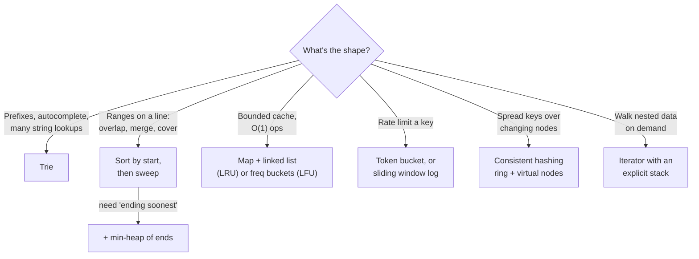

# Tries, intervals and design-a-structure — the problems where you build the thing

Most coding rounds ask you to compute something. This family asks you to
**build** something: a class with an API, a set of operations that must each
hit a complexity target, and the correctness has to hold across a sequence of
calls rather than for a single input. It's closer to real work, and Google
uses it to see whether you can hold an invariant across methods.

*In the Google round: "design an LRU cache" or "implement a rate limiter" is
the classic opener for a senior candidate, and the follow-up is always "now
across N machines" or "now with expiry" — the structure is the warm-up; the
invariant under change is the test.*

Three families live here. **Tries** — the structure for anything prefix-
shaped. **Intervals** — sort-then-sweep, with a heap when you need "what's
ending soonest". **Design structures** — caches, limiters, rings and
iterators, each of which is two familiar structures glued together so every
operation stays O(1) or O(log n).

---

## The costs

| Structure / operation | Time | Space | Notes |
| --- | --- | --- | --- |
| Trie insert / lookup / prefix | **O(L)** | O(total chars · alphabet) | L = word length. Independent of how many words |
| Merge intervals | **O(n log n)** | O(n) | The sort dominates |
| Insert interval into sorted list | O(n) | O(n) | Linear because the output is rebuilt |
| Meeting rooms II | O(n log n) | O(n) | Sort + heap |
| LRU cache get / put | **O(1)** | O(capacity) | Map + doubly linked list |
| LFU cache get / put | **O(1)** | O(capacity) | Map + map of frequency → list |
| Token bucket allow() | **O(1)** | O(1) per key | Lazy refill on read |
| Sliding-window-log allow() | O(log n) amortised | O(limit) per key | Evict expired timestamps |
| Consistent hash lookup | **O(log n)** | O(n · replicas) | Binary search on the ring |
| Add / remove node on the ring | O(log n) per virtual node | | Only 1/n of keys move |
| Iterator `next()` / `hasNext()` | Amortised O(1) | O(depth) | Lazy, with an explicit stack |

**Every design problem has a per-operation target.** State it before you
code — "get and put both O(1)" — because the whole design follows from it.

---

## How it actually works


*Each shape maps to one known composition of primitives. The interviewer wants the composition named and its invariant stated before any code.*

### Who's who

| Term | Meaning |
| --- | --- |
| **Trie (prefix tree)** | A tree where each edge is a character; a path from the root spells a prefix. A flag on a node marks "a word ends here" |
| **Terminal flag** | `isWord` on a trie node. Without it "app" and "apple" are indistinguishable |
| **Interval** | `[start, end]`. Decide up front whether the end is inclusive |
| **Sweep line** | Process events in sorted order, maintaining state as you pass each one |
| **Recency order** | The linked list in an LRU cache: most recently used at one end, least at the other |
| **Frequency bucket** | In LFU, all keys with the same use-count, each bucket itself in recency order |
| **Token bucket** | A counter that refills at a fixed rate up to a cap; a request spends one token |
| **Sliding window log** | The timestamps of recent requests; allow if fewer than the limit fall inside the window |
| **Hash ring** | Nodes and keys hashed onto a circle; a key goes to the first node clockwise |
| **Virtual node** | Multiple ring positions per physical node, so load spreads evenly |
| **Lazy iterator** | Computes the next element only when asked; never materialises the whole sequence |

### Trie — the structure

```js
class TrieNode {
  constructor() { this.children = new Map(); this.isWord = false; }
}

class Trie {
  constructor() { this.root = new TrieNode(); }

  insert(word) {
    let node = this.root;
    for (const ch of word) {
      if (!node.children.has(ch)) node.children.set(ch, new TrieNode());
      node = node.children.get(ch);
    }
    node.isWord = true;                        // the flag is the whole point
  }

  // Walk to the node for a prefix, or null. Shared by search and startsWith.
  find(prefix) {
    let node = this.root;
    for (const ch of prefix) {
      node = node.children.get(ch);
      if (!node) return null;
    }
    return node;
  }

  search(word)      { const n = this.find(word);   return n !== null && n.isWord; }
  startsWith(prefix){ return this.find(prefix) !== null; }
}
```

**When a trie beats a hash set:** when the query is about *prefixes*, not
whole keys — autocomplete, "does any word start with", longest common prefix,
or matching against a set of patterns where you'd otherwise test every
pattern against every input. For "is this exact string present", a `Set` is
simpler and faster.

### Intervals — the two moves

**Sort by start, then sweep.** For merging: keep the last merged interval; if
the next one starts before or at its end, extend the end; otherwise push a
new one. For "how many overlap at once": the heap of ends from [heaps](11-heaps-and-top-k.md),
or the two-sorted-arrays sweep.

### Design structures — the compositions

| Structure | Composition | The invariant you maintain |
| --- | --- | --- |
| **LRU** | `Map<key, node>` + doubly linked list | List order = recency order; map gives O(1) access to any node |
| **LFU** | `Map<key, node>` + `Map<freq, list>` + `minFreq` | Every key is in exactly the list for its frequency; `minFreq` is always correct |
| **Token bucket** | `{tokens, lastRefill}` per key | Tokens never exceed capacity; refill computed lazily from elapsed time |
| **Consistent hash** | Sorted array of `[hash, node]` | Ring is sorted; lookup is the first entry ≥ hash(key), wrapping |
| **Iterator** | Explicit stack of "where I am" | The stack top is always the next thing to yield (or the stack is empty) |

---

## The bugs that actually cost you the round

| Bug | Fix |
| --- | --- |
| **Trie without a terminal flag** | `search("app")` returns true after inserting "apple". Add `isWord` |
| **Trie with an object for children** | Prototype keys (`constructor`) collide. Use `Map` |
| **Merging intervals without sorting** | `[[1,4],[0,2]]` fails. Sort by start first, always |
| **`<` vs `<=` on interval overlap** | `[1,3]` and `[3,5]` — decide whether touching is overlap and be consistent |
| **LRU with a singly linked list** | Removing a node from the middle is O(n). Doubly linked, with sentinels |
| **LRU: moving to front on `put` but not on `get`** | A `get` is a use. Both must refresh recency |
| **LFU forgetting to update `minFreq`** | After evicting from the min bucket, `minFreq` stays stale; on `put` of a new key, `minFreq = 1` |
| **Token bucket refilling in a timer** | Refill lazily on each `allow()` from elapsed time; no background work |
| **Sliding window log growing forever** | Evict timestamps outside the window on each call |
| **Consistent hashing with one point per node** | Uneven load; use 100–200 virtual nodes each |
| **Iterator that flattens everything in the constructor** | Not lazy; O(n) memory up front. Use a stack |

---

## Practice ladder

| # | Problem | What it teaches |
| --- | --- | --- |
| 1 | Implement trie | The structure and the terminal flag |
| 2 | Longest common prefix / word break with a trie | Walking, not just membership |
| 3 | Design add-and-search words (with `.` wildcard) | DFS over a trie |
| 4 | Word search II | Trie + grid DFS with pruning |
| 5 | Merge intervals | Sort then sweep |
| 6 | Insert interval | Three-phase linear scan |
| 7 | Meeting rooms I / II | Overlap check; heap of ends |
| 8 | Non-overlapping intervals (min removals) | Greedy by end time |
| 9 | LRU cache | Map + doubly linked list |
| 10 | LFU cache | Frequency buckets + `minFreq` |
| 11 | Rate limiter (token bucket, sliding log) | Lazy refill; eviction |
| 12 | Consistent hashing ring | Binary search on a sorted ring |
| 13 | Flatten nested list iterator / peeking iterator | Lazy stack-based iteration |
| 14 | Design a hit counter / time-based key-value store | Append-only log + binary search |

**Exit test:** you can write the LRU cache from memory in under ten minutes
with sentinels and no off-by-ones; you can say in one sentence why LFU needs
`minFreq`; and you can turn "design X with O(1) ops" into "which two
structures, and what's the invariant between them" before writing code.

---

## Data structures

| Need | Use | Note |
| --- | --- | --- |
| Trie children | `Map<char, node>` | Not an object; not a fixed 26-array unless the alphabet is guaranteed |
| Recency order | Doubly linked list with head/tail sentinels | Sentinels remove every null check |
| Key → node | `Map` | Insertion order of `Map` is *also* usable as an LRU (see the follow-up) |
| Frequency buckets | `Map<number, DoublyLinkedList>` | Plus a `minFreq` integer |
| Interval set | `Array` sorted by start | Re-sort on insert, or binary search the insertion point |
| Ends-soonest | `MinHeap` from [heaps](11-heaps-and-top-k.md) | |
| Hash ring | Sorted `Array` of `[hash, nodeId]` | Binary search with wrap-around |
| Hash function | Any 32-bit mixer | In an interview, a simple FNV-1a is fine; say you'd use a real one in production |
| Iterator state | `Array` as a stack | Push children in reverse so the first is on top |

**Pseudocode — the doubly linked list with sentinels that LRU and LFU share**

```js
// A list with permanent head/tail sentinels: no node is ever null-adjacent,
// so add/remove need no branches. Nodes are {key, val, prev, next}.
class DList {
  constructor() {
    this.head = { prev: null, next: null };
    this.tail = { prev: this.head, next: null };
    this.head.next = this.tail;
    this.size = 0;
  }
  addFront(node) {                       // most recently used goes right after head
    node.prev = this.head; node.next = this.head.next;
    this.head.next.prev = node; this.head.next = node;
    this.size++;
  }
  remove(node) {                         // O(1) because we hold the node
    node.prev.next = node.next; node.next.prev = node.prev;
    this.size--;
  }
  popBack() {                            // least recently used sits right before tail
    const node = this.tail.prev;
    this.remove(node);
    return node;
  }
}
```

The sentinels are the difference between a five-minute LRU and a
twenty-minute one full of `if (node.prev)` checks.

---

## Worked problems

### Q: Implement a trie with prefix autocomplete — insert, search, and return the k most-inserted words for a prefix
**Level:** intermediate · **Tags:** google-coding, trie, strings, design

<details><summary>Model answer</summary>

**Problem.** Build `insert(word)`, `search(word)`, `startsWith(prefix)`, and
`suggest(prefix, k)` returning up to `k` words with that prefix, most
frequently inserted first. Example: insert `apple` ×3, `app` ×1, `apply` ×2;
`suggest("app", 2) → ["apple", "apply"]`.

**Clarify first.** Alphabet — lowercase ASCII, or any Unicode? (`Map` handles
either; say so.) Ties in frequency — any order, or lexicographic? (Assume
lexicographic as a tiebreak.) How large is the word set, and how often is
`suggest` called relative to `insert`? (Decides whether to precompute
top-k per node — follow-up.)

**Brute force.** Keep a `Map<word, count>`. `suggest` scans every word,
filters by prefix, sorts. O(N log N) per suggestion, independent of how
selective the prefix is. It's fine for a thousand words and hopeless for a
million.

**The insight.** A trie makes the prefix walk O(L), and everything beneath
that node is exactly the candidate set. Store a count on terminal nodes; DFS
the subtree collecting `[word, count]`, then take the top `k` with a
bounded min-heap (or sort, when the subtree is small). The work is
proportional to the *matches*, not the dictionary.

**Algorithm.**
1. Trie nodes carry `children`, `count` (0 if not a word).
2. `insert`: walk/create, `count++` at the end.
3. `suggest`: `find(prefix)`; DFS collecting `[word, count]`; keep the best
   `k` in a min-heap ordered by `(count asc, word desc)` so the root is the
   weakest; drain and reverse.

```js
class AutocompleteTrie {
  constructor() { this.root = { children: new Map(), count: 0 }; }

  insert(word) {
    let node = this.root;
    for (const ch of word) {
      if (!node.children.has(ch)) node.children.set(ch, { children: new Map(), count: 0 });
      node = node.children.get(ch);
    }
    node.count++;
  }

  find(prefix) {
    let node = this.root;
    for (const ch of prefix) {
      node = node.children.get(ch);
      if (!node) return null;
    }
    return node;
  }

  search(word)       { const n = this.find(word); return n !== null && n.count > 0; }
  startsWith(prefix) { return this.find(prefix) !== null; }

  suggest(prefix, k) {
    const start = this.find(prefix);
    if (!start) return [];
    // Weakest candidate on top: lower count first, then lexicographically LATER first.
    const heap = new MinHeap((a, b) => a[1] !== b[1] ? a[1] - b[1] : (a[0] < b[0] ? 1 : -1));
    const dfs = (node, path) => {
      if (node.count > 0) {
        heap.push([path, node.count]);
        if (heap.size > k) heap.pop();
      }
      for (const [ch, child] of node.children) dfs(child, path + ch);
    };
    dfs(start, prefix);
    const out = [];
    while (heap.size) out.push(heap.pop()[0]);
    return out.reverse();                     // strongest first
  }
}
```

**Complexity.** `insert`/`search`: O(L). `suggest`: O(L + S log k) where S is
the size of the subtree under the prefix. Space O(total characters).

**Test it.**
- The example: subtree under `app` has `app(1)`, `apple(3)`, `apply(2)`; top
  2 by count → `["apple", "apply"]`.
- `suggest("b", 5)` → `[]`.
- `suggest("", 1)` → the single most frequent word overall.
- Insert `"app"` then `search("ap")` → false (no terminal); `startsWith("ap")`
  → true.

**What the interviewer is checking.** The terminal count (not just a flag),
that the DFS is bounded by the subtree, and that you use a size-k heap
rather than sorting all matches.

</details>

**Follow-ups:**

1. Q: `suggest` is called 100× more often than `insert`. Optimise for that.
   <details><summary>Answer</summary>

   Cache the top-k list on every node along the inserted word's path — on
   `insert`, walk down and update each node's cached top-k (a small sorted
   list, O(k) per node, O(L · k) per insert). `suggest` becomes O(L): walk to
   the node and return the cached list. This is the read-optimised trade
   that real autocomplete services make; say the write cost explicitly.

   </details>

2. Q: Support a `.` wildcard in `search` that matches any single character.
   <details><summary>Answer</summary>

   `search` becomes a DFS: at a `.` branch into every child; at a literal
   follow one. Worst case O(26^d) for `d` wildcards, but bounded by the trie's
   actual branching. Return true if any branch reaches a terminal at the
   word's end.

   ```js
   searchWild(word) {
     const walk = (node, i) => {
       if (i === word.length) return node.count > 0;
       const ch = word[i];
       if (ch !== '.') {
         const next = node.children.get(ch);
         return next ? walk(next, i + 1) : false;
       }
       for (const child of node.children.values()) if (walk(child, i + 1)) return true;
       return false;
     };
     return walk(this.root, 0);
   }
   ```

   </details>

### Q: Insert interval — insert a new interval into a sorted, non-overlapping list, merging as needed
**Level:** intermediate · **Tags:** google-coding, intervals, sweep

<details><summary>Model answer</summary>

**Problem.** `intervals` sorted by start, pairwise non-overlapping; insert
`newInterval` and return the list, still sorted and non-overlapping. Example:
`[[1,3],[6,9]], [2,5] → [[1,5],[6,9]]`; `[[1,2],[3,5],[6,7],[8,10],[12,16]],
[4,8] → [[1,2],[3,10],[12,16]]`.

**Clarify first.** Inclusive ends — do `[1,3]` and `[3,5]` merge? (Assume yes,
touching merges.) Can the list be empty? (Yes → `[newInterval]`.) Must it be
in place? (No; return a new array.)

**Brute force.** Append the new interval, sort, run merge-intervals. O(n log
n). Correct, and the interviewer will ask you to use the fact the input is
already sorted.

**The insight.** Three phases in one linear pass: everything that ends before
the new one starts is copied unchanged; everything that overlaps is absorbed
into the new interval by widening its bounds; everything that starts after it
ends is copied unchanged. Because the input is sorted, these three groups are
contiguous.

**Algorithm.**
1. Copy intervals with `end < new.start`.
2. While `start <= new.end`: `new = [min(starts), max(ends)]`.
3. Push `new`; copy the rest.

```js
function insertInterval(intervals, newInterval) {
  const out = [];
  let [s, e] = newInterval;
  let i = 0;
  while (i < intervals.length && intervals[i][1] < s) out.push(intervals[i++]);   // before
  while (i < intervals.length && intervals[i][0] <= e) {                           // overlapping
    s = Math.min(s, intervals[i][0]);
    e = Math.max(e, intervals[i][1]);
    i++;
  }
  out.push([s, e]);
  while (i < intervals.length) out.push(intervals[i++]);                            // after
  return out;
}
```

**Complexity.** O(n) time, O(n) output.

**Test it.**
- `[[1,3],[6,9]], [2,5]` → phase 1: none (3 ≥ 2); phase 2: [1,3] → s=1,e=5;
  [6,9] starts after 5 → stop; push [1,5]; copy [6,9]. ✓
- The five-interval example → `[[1,2],[3,10],[12,16]]`.
- Empty list → `[[4,8]]`.
- New interval entirely after everything `[[1,2]], [5,6]` → `[[1,2],[5,6]]`.
- Touching: `[[1,3]], [3,5]` → `[[1,5]]` under inclusive ends.

**What the interviewer is checking.** The three-phase structure with two
`while` loops sharing an index, and consistency on `<` vs `<=`.

</details>

**Follow-ups:**

1. Q: Now there are many inserts. Better than O(n) each?
   <details><summary>Answer</summary>

   Binary search for the first interval whose end ≥ `new.start` (O(log n)),
   then the overlap scan is O(overlaps) and the splice is O(n) in an array
   anyway. To get genuinely sublinear you need a balanced tree keyed by start
   (a `TreeMap` in Java; in JS, a sorted array with binary search is what
   you'd write, and you'd say the tree is the production structure). The
   honest complexity for the array version is O(log n + n) worst case.

   </details>

2. Q: Merge an unsorted list of intervals from scratch.
   <details><summary>Answer</summary>

   Sort by start, then a single sweep keeping the last merged interval:

   ```js
   function merge(intervals) {
     intervals.sort((a, b) => a[0] - b[0]);
     const out = [];
     for (const [s, e] of intervals) {
       const last = out[out.length - 1];
       if (last && s <= last[1]) last[1] = Math.max(last[1], e);   // extend
       else out.push([s, e]);
     }
     return out;
   }
   ```

   O(n log n). The `Math.max` matters: `[1,10]` followed by `[2,3]` must not
   shrink the end.

   </details>

### Q: LRU cache — `get(key)` and `put(key, value)` in O(1), evicting the least recently used at capacity
**Level:** senior · **Tags:** google-coding, design, hashing, linked-list, lru

<details><summary>Model answer</summary>

**Problem.** `LRUCache(capacity)`; `get` returns the value or -1 and counts as
a use; `put` inserts or updates and counts as a use; when inserting past
capacity, evict the least recently used key. Both O(1). Example: capacity 2;
`put(1,1) put(2,2) get(1)→1 put(3,3)` evicts 2; `get(2)→-1`.

**Clarify first.** Does `get` refresh recency? (Yes.) Does updating an
existing key via `put` refresh recency? (Yes.) Capacity ≥ 1? (Assume yes.)
Thread safety? (Single-threaded; say you'd lock or shard otherwise.)

**Brute force.** An array of `[key, value]` in recency order: `get` is a linear
scan and a move, O(n). Or a `Map` alone with a timestamp per key: eviction
needs a scan for the minimum, O(n). Neither hits O(1) for both.

**The insight.** You need two things in O(1): find a key's entry (a hash map)
and move an entry to "most recent" / remove the "least recent" (a doubly
linked list, given you already hold the node). Glue them: the map stores
key → list node; the list stores recency order. Every operation is a map
lookup plus constant pointer surgery. Sentinels at both ends remove all null
checks.

**Algorithm.**
- `get`: look up node; if absent -1; else unlink, add to front, return value.
- `put`: if present, update value and move to front; else create node, add to
  front, map it; if over capacity, pop the back node and delete its key from
  the map.

```js
class LRUCache {
  constructor(capacity) {
    this.cap = capacity;
    this.map = new Map();            // key -> node
    this.list = new DList();         // front = most recent, back = least (see Data structures)
  }

  get(key) {
    const node = this.map.get(key);
    if (!node) return -1;
    this.list.remove(node);
    this.list.addFront(node);        // a read is a use
    return node.val;
  }

  put(key, val) {
    let node = this.map.get(key);
    if (node) {
      node.val = val;
      this.list.remove(node);
      this.list.addFront(node);
      return;
    }
    node = { key, val, prev: null, next: null };
    this.map.set(key, node);
    this.list.addFront(node);
    if (this.map.size > this.cap) {
      const evicted = this.list.popBack();
      this.map.delete(evicted.key);  // the node carries its key precisely for this line
    }
  }
}
```

**Complexity.** O(1) for both operations; O(capacity) space.

**Test it.**
- The example: after `get(1)`, order is `1, 2` (1 most recent); `put(3,3)`
  evicts 2. `get(2) → -1`. ✓
- Capacity 1: `put(1,1) put(2,2) get(1) → -1`.
- Update existing: `put(1,1) put(1,5) get(1) → 5`, size stays 1.
- Eviction after a `get` reorder — the case that catches a cache that only
  refreshes on `put`.

**What the interviewer is checking.** That the node stores its key (for the
map delete on eviction), that `get` refreshes, sentinels, and that you can
say "map for lookup, list for order" in one breath before coding.

</details>

**Follow-ups:**

1. Q: JavaScript's `Map` preserves insertion order. Can you use that instead of a linked list?
   <details><summary>Answer</summary>

   Yes, and it's a legitimate short answer: on `get`, delete and re-set the
   key (moves it to the end); on eviction, delete `map.keys().next().value`
   (the oldest). Both are O(1) in practice. The linked-list version is what
   the interviewer wants to see you *can* write, and it's the one that ports
   to languages without ordered maps — so write that, then mention this.

   ```js
   class LRUMapOnly {
     constructor(cap) { this.cap = cap; this.m = new Map(); }
     get(k) {
       if (!this.m.has(k)) return -1;
       const v = this.m.get(k); this.m.delete(k); this.m.set(k, v); return v;
     }
     put(k, v) {
       if (this.m.has(k)) this.m.delete(k);
       this.m.set(k, v);
       if (this.m.size > this.cap) this.m.delete(this.m.keys().next().value);
     }
   }
   ```

   </details>

2. Q: Add a TTL: entries expire `ttl` ms after their last write.
   <details><summary>Answer</summary>

   Store `expiresAt` on the node. On `get`, if expired, remove it and return
   -1 (lazy expiry — no timers). Eviction still pops the back. If memory from
   expired-but-unread entries matters, also check the back node's expiry on
   each `put` and drop it if stale. Say that a background sweeper is the
   production answer and lazy expiry is the interview answer.

   </details>

3. Q: Make it work across N servers.
   <details><summary>Answer</summary>

   A single LRU is per-process. Across servers you either shard keys with
   consistent hashing (each node runs its own LRU; a client always hits the
   same node for a key — see the ring problem below) or use a shared store
   like Redis with `maxmemory-policy allkeys-lru`. The former keeps O(1) and
   no network hop for hits; the latter is simpler and consistent. Point at
   [caching at scale](28-caching-at-scale.md) for the invalidation story.

   </details>

### Q: LFU cache — evict the least frequently used key, breaking ties by least recently used, all in O(1)
**Level:** senior · **Tags:** google-coding, design, hashing, linked-list, lfu

<details><summary>Model answer</summary>

**Problem.** Same API as LRU, but eviction removes the key with the lowest
use-count; among equals, the least recently used. Example: capacity 2;
`put(1,1) put(2,2) get(1) put(3,3)` evicts 2 (count 1, vs key 1 at count 2);
`get(2)→-1 get(3)→3 put(4,4)` evicts 1 or 3 — both at count 2, key 1 used
less recently → evicts 1.

**Clarify first.** A new key starts at frequency 1? (Yes.) `put` on an
existing key counts as a use? (Yes.) Capacity 0? (Then every `put` is a
no-op; guard it.)

**Brute force.** LRU plus a frequency counter and a scan for the minimum on
eviction: O(n). Or a min-heap keyed on `(freq, lastUsed)`: O(log n) per
operation, and updating a key's frequency needs decrease-key or lazy
deletion. Not O(1).

**The insight.** Keep one recency list *per frequency*: `freqLists: Map<freq,
DList>`. A key's node lives in the list for its current frequency. On use,
unlink it from `freq` and add it to the front of `freq + 1`. Track `minFreq`;
eviction pops the back of `freqLists.get(minFreq)`. `minFreq` only changes
in two places: it becomes 1 on inserting a new key, and it increments when
the `minFreq` list becomes empty after a promotion (the key that just left
was the only one at that frequency, and it went to `minFreq + 1`).

**Algorithm.**
- `touch(node)`: remove from its freq list; if that list is now empty and its
  freq was `minFreq`, `minFreq++`; `node.freq++`; add to front of the new
  list.
- `get`: look up; `touch`; return.
- `put`: if present, update and `touch`. Else if at capacity, evict from
  `freqLists.get(minFreq)` back. Insert new node at freq 1, `minFreq = 1`.

```js
class LFUCache {
  constructor(capacity) {
    this.cap = capacity;
    this.nodes = new Map();          // key -> node {key, val, freq, prev, next}
    this.freqLists = new Map();      // freq -> DList
    this.minFreq = 0;
  }

  listFor(freq) {
    if (!this.freqLists.has(freq)) this.freqLists.set(freq, new DList());
    return this.freqLists.get(freq);
  }

  touch(node) {
    const list = this.freqLists.get(node.freq);
    list.remove(node);
    if (list.size === 0 && this.minFreq === node.freq) this.minFreq++;   // it was the only one
    node.freq++;
    this.listFor(node.freq).addFront(node);
  }

  get(key) {
    const node = this.nodes.get(key);
    if (!node) return -1;
    this.touch(node);
    return node.val;
  }

  put(key, val) {
    if (this.cap === 0) return;
    let node = this.nodes.get(key);
    if (node) { node.val = val; this.touch(node); return; }
    if (this.nodes.size === this.cap) {
      const victim = this.freqLists.get(this.minFreq).popBack();   // least recent among least frequent
      this.nodes.delete(victim.key);
    }
    node = { key, val, freq: 1, prev: null, next: null };
    this.nodes.set(key, node);
    this.listFor(1).addFront(node);
    this.minFreq = 1;                 // a brand-new key is always the minimum
  }
}
```

**Complexity.** O(1) for both; O(capacity) space (empty freq lists can be
pruned but don't affect the bound).

**Test it.**
- The example: after `get(1)`, key 1 is at freq 2, key 2 at freq 1, `minFreq
  = 1`. `put(3,3)` evicts from freq-1 list → key 2. ✓ Then `get(3)` → 3 is at
  freq 2; both at freq 2; `put(4,4)` — `minFreq` is 2 (the freq-1 list emptied
  when 3 was promoted and `minFreq` was 1 → became 2); pops back of freq-2
  list → key 1 (older). ✓
- Capacity 0 → every `get` is -1.
- Repeated `get` on one key climbs frequencies; eviction never touches it
  while a lower-frequency key exists.

**What the interviewer is checking.** The `minFreq` maintenance — exactly the
two rules above — and that you don't scan frequencies on eviction.

</details>

**Follow-ups:**

1. Q: Why not a min-heap keyed on frequency?
   <details><summary>Answer</summary>

   A heap gives O(log n) and, worse, a used key's frequency changes, which
   needs decrease-key or lazy deletion with stale entries — the heap can hold
   more stale entries than live keys. The bucket design is O(1) and never has
   stale state. Say the heap first as the obvious approach, then explain why
   it's inferior; that's the reasoning the round is looking for.

   </details>

2. Q: Frequencies grow unbounded over a long-running process. Does that matter?
   <details><summary>Answer</summary>

   The `Map` of freq lists gains keys but empty lists can be deleted on the
   spot in `touch`, so memory is bounded by live keys. Semantically, though, a
   key that was hot a year ago never gets evicted — production caches (e.g.
   Redis's LFU) use a *decaying* counter, halving periodically, so recency
   still matters. Mention the decay; it shows you know why pure LFU is rarely
   deployed as-is.

   </details>

### Q: Rate limiter — allow at most `limit` requests per `windowMs` for each client key
**Level:** senior · **Tags:** google-coding, design, rate-limiting

<details><summary>Model answer</summary>

**Problem.** `allow(clientId, nowMs) → boolean`. Each client may make at most
`limit` requests in any rolling window of `windowMs`. Example: limit 3 per
1000 ms; calls at t=0, 100, 200 are allowed, t=300 is denied, t=1001 is
allowed again (the t=0 request has left the window).

**Clarify first.** Rolling window or fixed buckets? (Rolling — the fixed
version allows 2× bursts at boundaries.) Should bursts be allowed up to the
limit, or smoothed? (That's the difference between sliding log and token
bucket — implement one, name the other.) Memory per client is fine? (Yes,
O(limit) per active client; say what you'd do about idle clients.)

**Brute force.** Store every request timestamp per client forever; on
`allow`, count how many are within the window. O(n) per call and unbounded
memory.

**The insight.** Only the last `limit` timestamps can matter: if there are
already `limit` requests inside the window, deny; otherwise allow and
record. Keep a queue per client, evict timestamps older than `now -
windowMs` from the front, and compare its length to `limit`. Each timestamp
is pushed once and popped once — amortised O(1). That's the **sliding window
log**: exact, at O(limit) memory per client.

The **token bucket** is the alternative: a counter that refills at
`limit / windowMs` tokens per ms up to `limit`, computed lazily from the
elapsed time on each call; O(1) memory per client, allows bursts up to the
bucket size, and smooths thereafter.

**Algorithm (sliding log).**
1. `q = logs.get(clientId)` (create if absent); `head` index for O(1) pops.
2. While `q[head] <= now - windowMs`, `head++`.
3. If `q.length - head >= limit` → false. Else push `now`, return true.
4. Occasionally compact the array when `head` is large.

```js
class SlidingLogLimiter {
  constructor(limit, windowMs) {
    this.limit = limit; this.windowMs = windowMs;
    this.logs = new Map();                // clientId -> {q: number[], head: number}
  }
  allow(clientId, now) {
    let log = this.logs.get(clientId);
    if (!log) { log = { q: [], head: 0 }; this.logs.set(clientId, log); }
    const cutoff = now - this.windowMs;
    while (log.head < log.q.length && log.q[log.head] <= cutoff) log.head++;   // expire
    if (log.head > 1024 && log.head * 2 > log.q.length) {                     // compact occasionally
      log.q = log.q.slice(log.head); log.head = 0;
    }
    if (log.q.length - log.head >= this.limit) return false;
    log.q.push(now);
    return true;
  }
}

class TokenBucketLimiter {
  constructor(capacity, refillPerMs) {
    this.capacity = capacity; this.rate = refillPerMs;
    this.buckets = new Map();             // clientId -> {tokens, last}
  }
  allow(clientId, now) {
    let b = this.buckets.get(clientId);
    if (!b) { b = { tokens: this.capacity, last: now }; this.buckets.set(clientId, b); }
    b.tokens = Math.min(this.capacity, b.tokens + (now - b.last) * this.rate);  // lazy refill
    b.last = now;
    if (b.tokens < 1) return false;
    b.tokens -= 1;
    return true;
  }
}
```

**Complexity.** Sliding log: amortised O(1) per call, O(limit) per client.
Token bucket: O(1) time and space per client.

**Test it.**
- Limit 3 / 1000 ms: t=0,100,200 allowed; t=300 denied (3 in window); t=1001
  → t=0 expires (0 ≤ 1) → 2 in window → allowed. ✓
- Exactly-at-boundary: with `<=` on the cutoff, a request at `t = windowMs`
  expires the one at 0. State the choice.
- Two clients don't interfere.
- Token bucket: capacity 3, rate 0.003/ms; three calls at t=0 allowed,
  fourth denied; at t=334, ~1 token refilled → allowed.

**What the interviewer is checking.** That you name both algorithms and their
trade-off (exact-but-O(limit) vs approximate-but-O(1); burst behaviour), that
refill is lazy, and that you handle the idle-client memory question when
asked.

</details>

**Follow-ups:**

1. Q: Now there are N API servers. A client's requests hit any of them.
   <details><summary>Answer</summary>

   Per-server state under-counts by N×. Options, in order of what you'd say:
   (1) **Sticky routing** by client key (consistent hashing at the load
   balancer) so one server sees all of a client's traffic — simple, but a
   hot client can't be spread. (2) A **central store** — Redis with an atomic
   Lua script implementing the token bucket, one round trip per request;
   exact, but adds latency and a dependency. (3) **Local buckets with async
   reconciliation** — each server enforces `limit / N` locally and
   periodically syncs; slightly over-admits, no request-path hop. Most large
   systems use (3) for soft limits and (2) for contractual ones. See
   [resilience and rate limiting](29-resilience-rate-limiting.md).

   </details>

2. Q: Ten million clients, most idle. Memory?
   <details><summary>Answer</summary>

   Evict idle client state: store `last` per client and sweep entries older
   than one window (or use an LRU of client entries with a capacity). For the
   token bucket that's exact — an idle client's bucket would be full anyway,
   so dropping it and recreating it full loses nothing. For the sliding log,
   an entry with no timestamps in the window is equivalent to absent. So
   memory is O(active clients), and you say that.

   </details>

### Q: Consistent hashing ring — map keys to nodes so that adding or removing a node moves only ~1/N of the keys
**Level:** senior · **Tags:** google-coding, design, hashing, distributed

<details><summary>Model answer</summary>

**Problem.** `addNode(id)`, `removeNode(id)`, `getNode(key) → id`. With naive
`hash(key) % N`, changing N remaps almost every key; here only the keys that
fell to the changed node should move. Use virtual nodes for balance. Example:
nodes A, B, C; `getNode("user:42")` → whichever node's position is first
clockwise from `hash("user:42")`; remove B → only keys that were on B move,
to their next clockwise node.

**Clarify first.** How many virtual nodes per physical node? (Assume ~150;
say why.) Hash function? (Any well-mixed 32-bit hash; I'll use FNV-1a for the
interview and note that production would use something like MurmurHash or
xxHash.) Do we need replication — the next K nodes as well? (Follow-up.)

**Brute force.** `hash(key) % N`. O(1) and perfectly balanced, but adding a
node remaps ~all keys — every cache goes cold at once. That's the failure the
question exists to fix.

**The insight.** Put nodes *and* keys on the same circle of hash values. A key
belongs to the first node clockwise. Adding a node only claims the arc
between it and its predecessor; removing one only hands its arc to its
successor. With one point per node the arcs are wildly uneven, so each
physical node gets many virtual points — 150 points per node makes the
standard deviation of load small. The ring is a sorted array of `[hash,
nodeId]`; lookup is a binary search for the first hash ≥ `hash(key)`,
wrapping to index 0.

**Algorithm.**
- `addNode`: for `i` in `0..replicas`, insert `[hash(id + "#" + i), id]` into
  the sorted array (binary search for position, splice).
- `removeNode`: remove all entries with that id.
- `getNode`: `lowerBound` over hashes; wrap.

```js
function fnv1a(str) {                        // 32-bit FNV-1a; fine for interviews
  let h = 0x811c9dc5;
  for (let i = 0; i < str.length; i++) {
    h ^= str.charCodeAt(i);
    h = Math.imul(h, 0x01000193);
  }
  return h >>> 0;                            // unsigned
}

class HashRing {
  constructor(replicas = 150) {
    this.replicas = replicas;
    this.ring = [];                          // sorted [hash, nodeId]
  }

  addNode(id) {
    for (let i = 0; i < this.replicas; i++) {
      const h = fnv1a(`${id}#${i}`);
      const pos = this.lowerBound(h);
      this.ring.splice(pos, 0, [h, id]);     // O(n) splice; fine for hundreds of nodes
    }
  }

  removeNode(id) {
    this.ring = this.ring.filter(([, n]) => n !== id);
  }

  getNode(key) {
    if (this.ring.length === 0) return null;
    const h = fnv1a(key);
    const pos = this.lowerBound(h);
    return this.ring[pos === this.ring.length ? 0 : pos][1];   // wrap around the circle
  }

  lowerBound(h) {                            // first index with ring[i][0] >= h
    let lo = 0, hi = this.ring.length;
    while (lo < hi) {
      const mid = lo + ((hi - lo) >> 1);
      if (this.ring[mid][0] >= h) hi = mid; else lo = mid + 1;
    }
    return lo;
  }
}
```

**Complexity.** `getNode`: O(log(N · R)). `addNode`: O(R · N · R) with array
splices — O(R log(NR)) with a balanced tree, which is what you'd name for
production. Space O(N · R).

**Test it.**
- Add A, B, C; `getNode("k")` is deterministic and one of them.
- Record `getNode` for 10 000 keys; remove B; re-check: only keys that were
  on B changed, and they moved to various nodes (not all to one), because
  B's virtual points are scattered.
- Empty ring → null.
- Wrap-around: a key whose hash exceeds every ring position maps to
  `ring[0]`.

**What the interviewer is checking.** Why virtual nodes exist (balance),
why the ring is sorted (binary search), the wrap, and that you can say "only
K/N keys move" and why.

</details>

**Follow-ups:**

1. Q: Replicate each key to the next 3 distinct physical nodes.
   <details><summary>Answer</summary>

   Walk clockwise from the lookup position collecting node ids into a `Set`
   until it has 3 distinct entries (skip repeats — consecutive virtual points
   often belong to the same physical node). O(log(NR) + R) worst case. That
   walk is the "preference list" idea from Dynamo-style stores.

   </details>

2. Q: Nodes have different capacities.
   <details><summary>Answer</summary>

   Give bigger nodes proportionally more virtual points — a node with 2× the
   capacity gets 300 replicas instead of 150. Load is proportional to arc
   length, and arc length is proportional to points. No other change.

   </details>

3. Q: A hot key overwhelms one node regardless of the ring.
   <details><summary>Answer</summary>

   Consistent hashing spreads *keys*, not *load per key*. For a single hot
   key, salt it (`key#0..key#k`) so its reads spread over k nodes, and
   merge on read; or put a local in-process cache in front. Naming the
   limitation is the point — the ring isn't a load balancer.

   </details>

### Q: Flatten nested list iterator — `next()` and `hasNext()` over a list whose elements are integers or nested lists, lazily
**Level:** intermediate · **Tags:** google-coding, design, iterator, stack

<details><summary>Model answer</summary>

**Problem.** Input like `[[1,1],2,[1,[1]]]` where each element is either an
integer or a list of the same shape. Implement an iterator yielding `1, 1, 2,
1, 1` without flattening the whole structure up front. Example: `next() → 1`,
`hasNext() → true`, … , after the fifth `next()`, `hasNext() → false`.

**Clarify first.** Can nested lists be empty (`[[], 1]`)? (Yes — the trap.)
Is `hasNext` guaranteed to be called before `next`? (No; make `next` correct
on its own.) Depth bounded? (Assume reasonable; recursion isn't used anyway.)

**Brute force.** Recursively flatten into an array in the constructor and
index through it. O(n) time and memory up front, and nothing is lazy — for a
huge or infinite structure it's wrong.

**The insight.** Keep an explicit stack of `[list, index]` frames, exactly
what recursion would keep implicitly. `hasNext` does the work: advance the
top frame past exhausted lists, descend into a nested list by pushing a new
frame, and stop when the top of the stack points at an integer. `next` then
returns it and advances. Every element is visited once across all calls, so
the amortised cost is O(1).

**Algorithm.**
1. Stack starts with `[input, 0]`.
2. `hasNext`: loop: if stack empty → false; peek `[list, i]`; if `i ===
   list.length` pop and continue; if `list[i]` is an integer → true; else
   increment `i` and push `[list[i], 0]`.
3. `next`: call `hasNext` (to settle the stack); read `list[i]`, increment,
   return.

```js
class NestedIterator {
  constructor(nestedList) {
    this.stack = [[nestedList, 0]];        // frames of [list, nextIndex]
  }

  hasNext() {
    while (this.stack.length) {
      const frame = this.stack[this.stack.length - 1];
      const [list, i] = frame;
      if (i === list.length) { this.stack.pop(); continue; }        // exhausted frame
      const item = list[i];
      if (Number.isInteger(item)) return true;                        // settled on an integer
      frame[1] = i + 1;                                                // consume the nested list
      this.stack.push([item, 0]);                                      // descend
    }
    return false;
  }

  next() {
    if (!this.hasNext()) return undefined;
    const frame = this.stack[this.stack.length - 1];
    return frame[0][frame[1]++];
  }
}
```

**Complexity.** Amortised O(1) per call; O(depth) space for the stack.

**Test it.**
- `[[1,1],2,[1,[1]]]` → 1, 1, 2, 1, 1 then `hasNext` false.
- `[[], [1], []]` → 1 — the empty-list frames are popped in `hasNext`.
- `[]` → `hasNext` false immediately.
- `next()` without a prior `hasNext()` still returns 1 for `[[1]]`, because
  `next` settles the stack itself.

**What the interviewer is checking.** That `hasNext` is where the settling
happens (so empty lists are handled), that `next` doesn't assume `hasNext`
was called, and that nothing is flattened eagerly.

</details>

**Follow-ups:**

1. Q: Add a `peek()` to any iterator — a PeekingIterator wrapper.
   <details><summary>Answer</summary>

   Buffer one element: `peek` fills the buffer from the underlying `next` if
   empty and returns it without clearing; `next` returns the buffer if
   present (clearing it) else delegates; `hasNext` is `buffer !== undefined
   || inner.hasNext()`. One slot, O(1), and it wraps any iterator including
   the nested one above.

   </details>

2. Q: The nested structure is a tree of directories and files on disk, too big to load.
   <details><summary>Answer</summary>

   Same stack, but a frame holds a *directory handle* and a position, and
   descending means opening the child directory lazily. That's exactly how
   a filesystem walker or a streaming JSON parser works — the iterator
   pattern is the point, and the explicit stack is what keeps memory at
   O(depth) rather than O(files).

   </details>

---

## Interview Q&A

### Q: When do you reach for a trie instead of a hash set?
**Level:** foundation · **Tags:** dsa, trie, strings

<details><summary>Model answer</summary>

When the question is about **prefixes** rather than whole strings. A hash set
answers "is this exact string present" in O(L) and nothing else. A trie
answers that too, but also "does anything start with this", "what are all
the words under this prefix", "what's the longest prefix of this input that's
a known word" — each in O(L) plus output, because the prefix walk lands on a
node whose subtree *is* the answer set.

So autocomplete, IP routing tables (longest prefix match), spell-check
suggestions, and matching an input against many patterns at once are trie
problems. Exact membership, deduplication, or counting are set/map problems,
and using a trie there is extra code for no benefit.

The cost is memory: a node per character with a `Map` of children is much
heavier than a hash entry per word. In an interview I'd say I'd use a `Map`
for children (not an object, to avoid prototype keys; not a fixed 26-slot
array unless the alphabet is guaranteed) and mention compressed tries —
radix trees — as the production answer for memory.

</details>

**Follow-ups:**

1. Q: What's the one bug that makes a trie wrong even when every method looks right?
   <details><summary>Answer</summary>

   Missing the terminal flag. Insert "apple" and a search for "app" walks
   successfully to the `p` node — without `isWord` there's no way to tell that
   "app" was never inserted. Every trie needs a marker on word ends, and
   `search` must check it while `startsWith` must not.

   </details>

### Q: How do you approach a "design a data structure with O(1) operations" question?
**Level:** intermediate · **Tags:** dsa, design, invariants

<details><summary>Model answer</summary>

I start from the operations and their targets, not from a structure. Write
down every method and the complexity each needs. Then ask what each method
has to *find* and what it has to *reorder*. Finding is a hash map. Reordering
in O(1) is a linked list where I already hold the node, or a stack, or a
counter. Almost every O(1)-everything structure is two of those glued
together.

Then I state the invariant between them — "the map points at list nodes, and
the list is in recency order" — because the invariant is what every method
has to preserve, and it's what the interviewer is checking. LRU is map +
list. LFU is map + a map of lists + one integer. A rate limiter is a map of
small counters. `RandomizedSet` with O(1) insert, delete and `getRandom` is a
map of key → index plus an array, with swap-and-pop on delete.

Then I write the smallest helper that makes the invariant easy — a linked
list with sentinels, so no method has a null check — and only then the
methods. And I trace a short sequence of calls aloud before saying I'm done,
because these structures fail on the third call, not the first.

</details>

**Follow-ups:**

1. Q: Why sentinels?
   <details><summary>Answer</summary>

   Because without them every add and remove has to handle "is this the head",
   "is this the tail", "is the list empty" — four branches per method, each a
   place for an off-by-one under pressure. With a permanent head and tail
   node, every real node always has a prev and a next, and the code for
   `remove` is two lines with no conditions. It's the difference between a
   clean ten-minute LRU and a buggy twenty-minute one.

   </details>

---

## What a weak answer sounds like

- **A trie with no terminal flag**, or with a plain object for children.
- **Merging intervals without sorting first**, or inconsistent `<` / `<=`.
- **An LRU that only refreshes on `put`**, or that stores no key on the node
  and can't delete from the map on eviction.
- **LFU with a scan for the minimum frequency**, or a `minFreq` that's never
  reset to 1 on insert.
- **A rate limiter with a background refill timer**, or one that keeps every
  timestamp forever.
- **Consistent hashing with one point per node** and no explanation of why
  that's unbalanced.
- **An iterator that flattens everything in the constructor.**
- **Coding before stating the invariant.** The interviewer can't tell whether
  you'll preserve something you never named.

---

## Glossary

- **Trie / prefix tree** — a tree of characters where root-to-node paths are prefixes.
- **Terminal flag** — the marker on a trie node that a word ends there.
- **Radix tree** — a trie with single-child chains compressed into one edge.
- **Sweep line** — processing sorted events while maintaining running state.
- **Sentinel** — a permanent dummy node at a list's end that removes null checks.
- **Recency order** — most-to-least recently used ordering, the LRU list.
- **Frequency bucket** — in LFU, the list of all keys at one use-count.
- **`minFreq`** — the lowest frequency currently present; where LFU evicts from.
- **Token bucket** — a rate limiter that refills a counter at a fixed rate up to a cap.
- **Sliding window log** — a rate limiter that keeps recent timestamps and counts those in the window.
- **Consistent hashing** — mapping keys and nodes to a ring so node changes move only a fraction of keys.
- **Virtual node** — one of many ring positions for a single physical node, for balance.
- **Preference list** — the next K distinct nodes clockwise; where replicas go.
- **Lazy iterator** — one that computes the next element on demand from an explicit stack.
- **Amortised O(1)** — constant per operation averaged over a sequence, though a single call may cost more.
