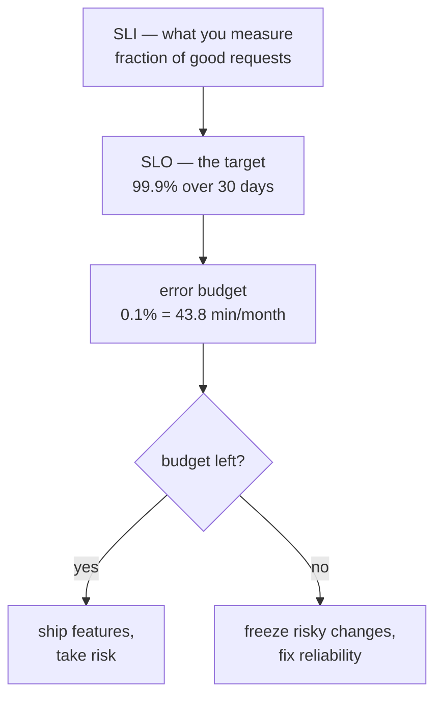
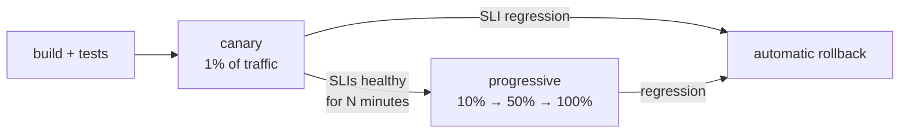

# Observability, SLOs and operations — the half of the round people skip

A design that works on the whiteboard and cannot be run is not a passing
design at senior level. Google's interviewers are steeped in the *Site
Reliability Engineering* book (O'Reilly, 2016) and will ask "how do you know
it's healthy?", "how do you roll it out?" and "what pages someone at 3am?"
This chapter gives you the vocabulary and the answer shapes, so you bring
them in before being asked.

---

## Why L5 is graded on "can you run it"

At mid-level, the design round tests whether you can build the thing. At
senior, it tests whether you can *own* it: define what "working" means in
numbers, notice when it stops, change it without breaking it, and be the
person who understands the incident. Every one of those is a design decision
you can make on the whiteboard, and the interviewer is listening for whether
you make them unprompted.

The pattern to follow: after the high-level design, say "before I go deeper,
let me say how this is operated" and cover four things in two minutes each —
what the SLO is, what you measure, how you roll out, and what happens when
it breaks. Then go deep on whichever the interviewer picks.

---

## SLIs, SLOs and error budgets

*An SLO is a number; the error budget is the same number seen as permission to fail, and it decides whether the next week is features or fixes.*

**SLI** — a service level *indicator*: a measurement, usually a ratio of
good events to total events over a window. Availability SLI: successful
requests ÷ all requests. Latency SLI: requests served under 300 ms ÷ all
requests. Freshness SLI for a pipeline: records processed within 5 minutes ÷
all records.

**SLO** — a service level *objective*: the target for the SLI. "99.9% of
requests succeed, measured over a rolling 30 days." Pick it from what users
need, not from what the system happens to do; an SLO above what users notice
is money spent on nothing.

**Error budget** — 100% minus the SLO, as time or events. For 99.9%
availability over 30 days: 30 × 24 × 60 = 43,200 minutes; 0.1% of that is
**43.2 minutes** (the often-quoted 43.8 uses a 30.44-day average month).
That budget is spent by incidents *and* by deploys that fail *and* by
planned risk. When it is gone, the team stops shipping features and works on
reliability until the window recovers — the book's core policy, and the
answer to "how do you decide between velocity and stability".

**Worked example.** An authorization check service, SLO 99.99% availability
and 99% of checks under 20 ms, over 30 days. Budget: 4.3 minutes of full
outage per month, or the equivalent in partial failure (a 10% error rate for
43 minutes). A single bad deploy that takes 5 minutes to roll back blows the
month. Therefore: canary to 1% first, automatic rollback on SLI regression,
and no more than one risky change per day. That chain — SLO → budget →
rollout policy — is exactly what a senior answer sounds like.

**SLA** is the contract with penalties; the SLO is the internal target and
is always stricter than the SLA, so you find out before the customer does.

---

## The four golden signals

From the SRE book's monitoring chapter: if you can only measure four things
about a user-facing system, measure these.

| Signal | What it is | The trap |
| --- | --- | --- |
| **Latency** | Time to serve a request, as a distribution (p50, p99, p99.9), not an average | Mixing the latency of failed requests in — a fast 500 hides a slow success |
| **Traffic** | Demand on the system: requests/s, sessions, bytes | Measuring only the front door and missing an internal fan-out that is 50x larger |
| **Errors** | Rate of failed requests: explicit (500), implicit (200 with wrong content), or by policy (a success slower than the SLO) | Counting only HTTP status; a 200 that returned an empty permission set is an error |
| **Saturation** | How full the constrained resource is: CPU, memory, disk, queue depth, connection pool | Waiting for 100%. Most systems degrade well before; alert on the approach |

For a pipeline replace traffic with throughput and add **freshness** (age of
the oldest unprocessed item). For a queue, saturation is *age*, not length.

---

## Alerting on symptoms, not causes

Page on what the user experiences — the SLI is breaching or will breach —
not on the thing that might cause it. "Error rate above 1% for 5 minutes"
pages; "CPU above 80%" does not, because CPU at 80% with no user impact is
not an incident, and a 3am page for it teaches people to ignore pages.

The senior refinement is **burn-rate alerting**: alert when the error budget
is being consumed faster than it would be if spread evenly across the window.
A burn rate of 10 means the whole month's budget goes in three days; that
pages. A burn rate of 2 over a long window creates a ticket. Two thresholds,
two windows, and the alerts are quiet until something matters.

Everything else — CPU, queue depth, disk — goes on a dashboard that the
person who was paged looks at *next*.

---

## Rollouts

*Every deploy is an experiment on real users; the canary is the sample, the SLI is the measurement, and rollback is the default response.*

- **Canary.** Deploy to a small slice — one instance, 1% of traffic, or one
  region — and compare its SLIs against the rest. A canary that serves a
  different traffic mix is not a canary; make the slice representative.
- **Progressive rollout.** Widen in stages with a soak time at each; the
  stages and soak are a policy, not a judgement call made at 5pm on Friday.
- **Feature flags.** Separate *deploy* from *release*. Ship the code dark,
  turn the behaviour on per tenant or per percentage, and turn it off in
  seconds without a deploy. A flag is also the answer to "how do you roll out
  a new security control without breaking anyone" — audit mode first, enforce
  mode per tenant, with the flag as the switch.
- **Rollback is the first response, not the last.** When a deploy correlates
  with an SLI regression, roll back, *then* investigate. That requires the
  previous version to still be deployable and the data changes to be
  backward compatible — so schema changes go out in expand/contract steps
  (add the column, deploy code that writes both, backfill, deploy code that
  reads the new one, drop the old), never as one step.
- **Config is a deploy.** Config changes cause as many outages as code
  changes; they get the same canary and rollback.

---

## Incidents

- **On-call** owns the pager for a defined period with a defined escalation
  path. A page has a runbook link; if it does not, the alert is not ready.
- **During**: one incident commander, one channel, one status doc. Mitigate
  first (roll back, shed load, fail over), understand later.
- **After**: a **blameless postmortem** — what happened, the timeline, the
  contributing causes, the action items with owners. Blameless is a
  technical requirement, not a nicety: the moment a postmortem assigns fault,
  people stop reporting near-misses, and the near-misses are where the next
  outage is visible in advance.
- **Say the action item shape**: "we will add a canary stage" beats "be more
  careful". Every action item is a change to the system or the process.

---

## Capacity and load shedding

- **Capacity planning** starts from the SLO and the traffic forecast:
  provision for peak plus the loss of one zone or region (N+1, N+2), and
  know what your headroom number is — a system at 85% average utilisation
  has no room for a retry storm.
- **Load shedding** is what you do when demand exceeds capacity anyway:
  reject early and cheaply, lowest criticality first, with a clear signal
  (`429` or `503` with `Retry-After`) so clients back off. Degrade
  gracefully where possible — serve a cached permission decision, drop the
  personalised feed for the default one.
- **Graceful degradation is a feature you design**, not something that
  happens. Say which parts of your system can run in a degraded mode and how
  you would switch them.

---

## What a good "how do you operate it" answer sounds like

"The SLO is 99.9% of checks succeed within 50 ms over 30 days, which gives
me about 43 minutes of budget a month. I'd measure success rate and latency
at the client-facing edge, plus queue age on the async path. Paging alerts
are burn-rate on those two SLIs; everything else is a dashboard. Deploys go
through a 1% canary with automatic rollback on SLI regression, and the new
enforcement mode ships behind a per-tenant flag in audit mode first. If the
policy store is unavailable the checker fails closed for writes and serves
cached decisions for reads, with a metric on cache age so we know how stale
we are. The on-call has a runbook per alert, and every incident gets a
blameless postmortem with owned action items."

That is ninety seconds and it covers every probe in this chapter.

---

## Interview Q&A

### Q: What is the difference between an SLI, an SLO and an SLA, and how would you set them for a permission-check service?
**Level:** foundation · **Tags:** google-design, slo, operations

Model answer

An SLI is the measurement — for a permission-check service, the fraction of
checks that return a correct answer within a latency bound. An SLO is the
target for that measurement over a window — say 99.99% of checks succeed and
99% complete within 20 ms, over 30 days. An SLA is the external contract
with consequences, and it is always looser than the SLO so that the internal
target trips first.

I would set the SLO from the callers: a permission check sits on every
request path in every product, so its availability bounds everyone else's.
If the products promise 99.9%, the check service needs to be an order of
magnitude better, hence 99.99%. Latency: it is one hop inside a request that
has a 300 ms budget, so 20 ms at p99 leaves room for the rest.

The error budget from 99.99% is about four minutes a month, which tells me
immediately that deploys must be canaried with automatic rollback and that
the service needs a degraded mode — serving cached decisions — rather than
going fully down.

**Follow-ups:**

1. Q: The team wants to ship a large refactor and has 2 minutes of error budget left this month. What do you do?
   

Answer

   Not ship it this month, by the policy we agreed before anyone had a
   refactor to ship. The budget exists precisely so this is not a
   negotiation. What I can do: ship it dark behind a flag so it is deployed
   but inactive, which spends very little budget, and turn it on when the
   window rolls over. If the refactor *is* the reliability fix that would
   restore the budget, that is the exception the policy should name
   explicitly, and I would make the case in those terms.

   

2. Q: Why is availability measured as a request ratio rather than uptime?
   

Answer

   Because uptime measures the server and users experience requests. A
   service that is "up" but failing 30% of requests has 70% availability by
   the ratio and 100% by uptime; the ratio is honest. It also weights by
   traffic — an outage at peak costs more budget than the same outage at
   3am, which matches what users felt. The one thing to add is measuring at
   the edge the users touch, not inside the service, so a broken load
   balancer counts.

   

### Q: What are the four golden signals, and which one would you alert on for a queue-based pipeline?
**Level:** foundation · **Tags:** google-design, monitoring, sre

Model answer

Latency, traffic, errors and saturation, from the SRE book: how slow it is,
how busy it is, how often it fails, how full it is. For a request-serving
system they map directly onto p99 latency, requests per second, error rate,
and utilisation of the bottleneck resource.

For a queue-based pipeline I would translate them: latency becomes
end-to-end processing time; traffic becomes throughput; errors become
failed or dead-lettered items; and saturation becomes the *age* of the
oldest unprocessed item, not the queue length. Age is the one I would page
on, because it is the symptom the user feels — "my finding took an hour to
show up" — and it rises whether the cause is a slow consumer, a stuck
partition, or a burst of input. Queue length pages on bursts that would have
drained fine on their own.

**Follow-ups:**

1. Q: Why not alert on CPU?
   

Answer

   CPU is a cause, not a symptom. High CPU with the SLO intact is not an
   incident, and paging on it trains people to ignore pages. It belongs on
   the dashboard the on-call opens after a symptom page fires. The exception
   is saturation *approaching* a hard limit that will become a symptom —
   disk at 95% — where the page is really "you have an hour".

   

### Q: Walk me through how you would roll out a new security control that will start rejecting some requests.
**Level:** senior · **Tags:** google-design, rollout, security

Model answer

The control ships behind a flag with three modes: off, audit, enforce. I
deploy it off — the code is live but inert, so the deploy itself is
low-risk and can be canaried like any other.

Then audit mode everywhere: the control evaluates every request and logs
what it *would* have rejected, without rejecting. That produces the number
I need — the false-positive rate, and which tenants and call paths would
break — before anyone is affected. I would run that for long enough to see
a full weekly cycle of traffic.

Then enforce per tenant, starting with internal ones, widening as the audit
data says it is safe, with the flag as the instant rollback. The SLI I watch
is the reject rate against the audit-mode prediction: if enforcement rejects
more than audit predicted, something is wrong and I flip back.

Two more things I would say. The control must fail open or closed by
explicit decision — for a security control, usually closed for writes and
open for reads with an alert. And the affected teams get told in advance
with the audit-mode data, because a security rollout that surprises people
is rolled back by an executive, not by a flag.

**Follow-ups:**

1. Q: The audit data shows 2% of one big tenant's traffic would be rejected, and it is all legitimate. Now what?
   

Answer

   That is the control finding a real gap in its own rule, not a reason to
   skip the tenant. I would look at what those requests have in common —
   usually one integration or one legacy path — and either refine the rule
   or give that path a scoped, time-boxed exemption with an owner and an
   expiry. What I would not do is enforce and let them break, or exempt the
   whole tenant permanently. The exemption list with expiries is itself a
   thing I would show on a dashboard, because exemptions that never expire
   are how controls quietly stop existing.

   

2. Q: How do you roll back if the change included a schema migration?
   

Answer

   You can only roll back if the migration was designed to allow it, which
   means expand/contract: add the new column or table first in a separate
   deploy; ship code that writes both old and new; backfill; ship code that
   reads from the new; only then drop the old, and only after the read-new
   code has been stable for a full rollback window. At every step the
   previous code version still works against the current schema. A
   migration done as one step has no rollback, and I would say so rather
   than pretend.

   

### Q: What happens when your service is paged at 3am? Describe the response and what comes after.
**Level:** intermediate · **Tags:** google-design, incidents, on-call

Model answer

The page carries the alert name and a runbook link. The on-call acknowledges
within the agreed time, opens the incident channel and the status doc, and
takes the incident commander role or hands it to whoever is better placed.
The first goal is mitigation, not diagnosis: if the alert correlates with a
recent deploy or config change, roll it back; if it is load, shed or scale;
if a dependency is down, fail over or enter degraded mode. Understanding why
comes after users are no longer affected.

The runbook is what makes 3am survivable: for each alert it says what the
symptom means, the two or three most likely causes, the dashboard to open,
and the mitigation for each. If I am designing the system, writing those
runbooks is part of the design.

Afterwards, a blameless postmortem within a few days: timeline, impact in
SLO terms, contributing causes — plural, because it is never one — and
action items that change the system or the process, each with an owner and
a date. Blameless matters for a practical reason: the people closest to the
failure have the most information, and they only share it if sharing is
safe.

**Follow-ups:**

1. Q: The postmortem finds the on-call engineer ran the wrong command. What is the action item?
   

Answer

   Not "train the engineer". The action item is whatever made the wrong
   command possible and consequential: the command needed a confirmation
   step, or the runbook should have given the exact command, or the
   permission to run it at all should not have existed on the production
   path. If a tired person can take the system down with one line, that is
   a system property, and it will happen again to someone else.

   

### Q: Your system is at capacity and traffic keeps rising. What do you do in the next five minutes, and what do you do next quarter?
**Level:** senior · **Tags:** google-design, capacity, load-shedding

Model answer

In the next five minutes: shed load, deliberately. Reject the lowest
criticality traffic first — background sync before interactive requests,
anonymous before authenticated, reads that can be served stale from cache
before writes — with a `429` or `503` and a `Retry-After` so clients back
off instead of retrying into the overload. Turn on any degraded mode we
designed: cached permission decisions, the non-personalised feed. Scale out
if the bottleneck is stateless and the platform can do it faster than the
traffic rises; if the bottleneck is the database, scaling the front end
makes it worse.

Next quarter: find out why capacity planning missed it. Either the forecast
was wrong, the headroom policy was too thin, or a new caller arrived without
telling us — so add quotas per caller so it cannot happen silently. Then fix
the actual bottleneck, and rehearse the shedding so it is a switch rather
than an improvisation. The senior point is that load shedding is designed
in advance with criticality attached to requests; if I have to decide at
the moment what to drop, I have already lost the five minutes.

**Follow-ups:**

1. Q: How do you know your headroom?
   

Answer

   Load test to the point where the SLI breaks, and call that capacity. Then
   headroom is capacity minus forecast peak minus the loss of one failure
   domain — if a region dies, the others absorb its traffic, so each must
   run with room for that. A system at 85% average utilisation with no zone
   redundancy has no headroom, and a retry storm will find that out for you.

   

---

## Glossary

| Term | Meaning |
| --- | --- |
| **SLI** | Service level indicator — a measured ratio of good events to total |
| **SLO** | Service level objective — the target for an SLI over a window |
| **SLA** | Service level agreement — the external contract, looser than the SLO |
| **Error budget** | 100% minus the SLO, as time or events; the allowed failure |
| **Burn rate** | How fast the error budget is being consumed relative to even spend |
| **Golden signals** | Latency, traffic, errors, saturation |
| **Canary** | A small slice of production that receives a change first |
| **Feature flag** | A runtime switch that separates deploying code from releasing behaviour |
| **Expand/contract** | A schema-change pattern where every step is backward compatible |
| **Load shedding** | Rejecting low-priority work early when demand exceeds capacity |
| **Blameless postmortem** | An incident review that finds system causes rather than assigning fault |
| **Runbook** | Per-alert instructions: meaning, likely causes, mitigation |
