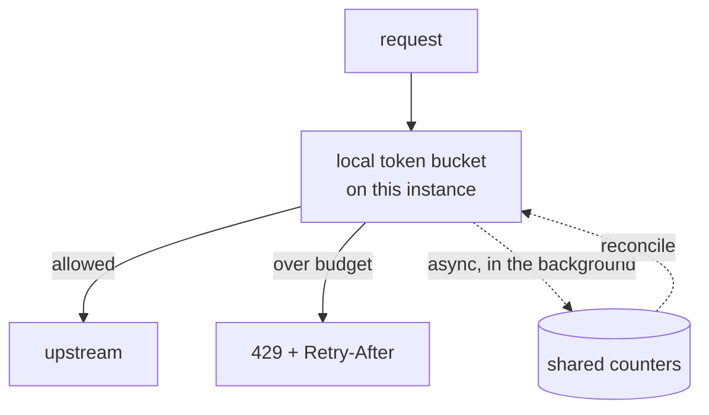
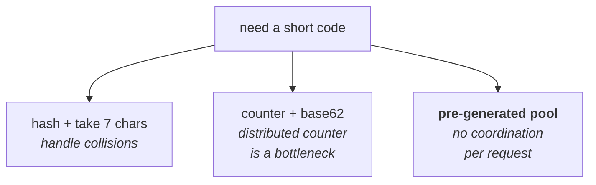
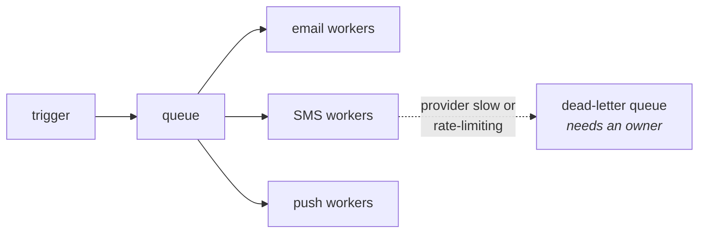
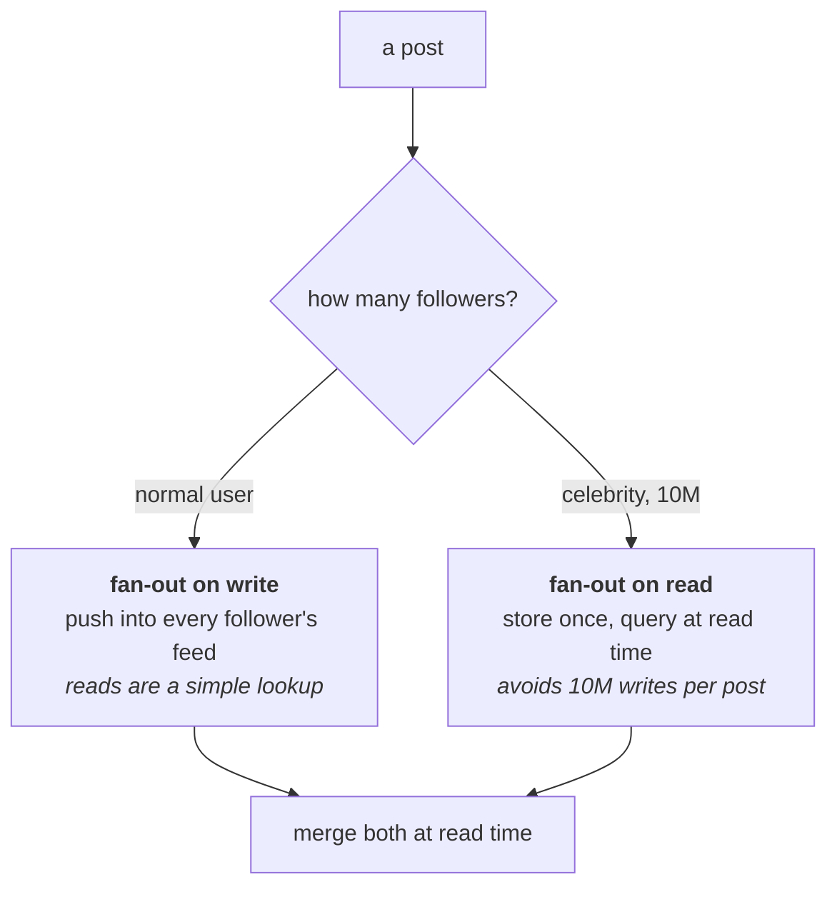
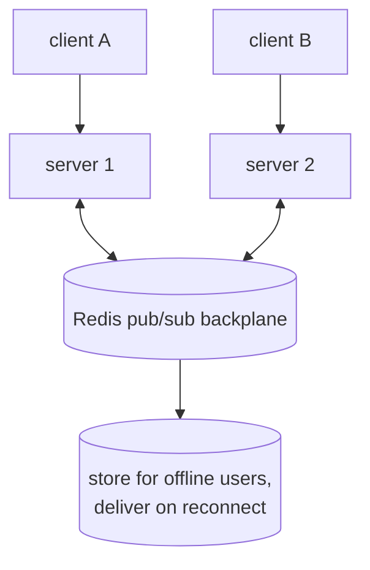
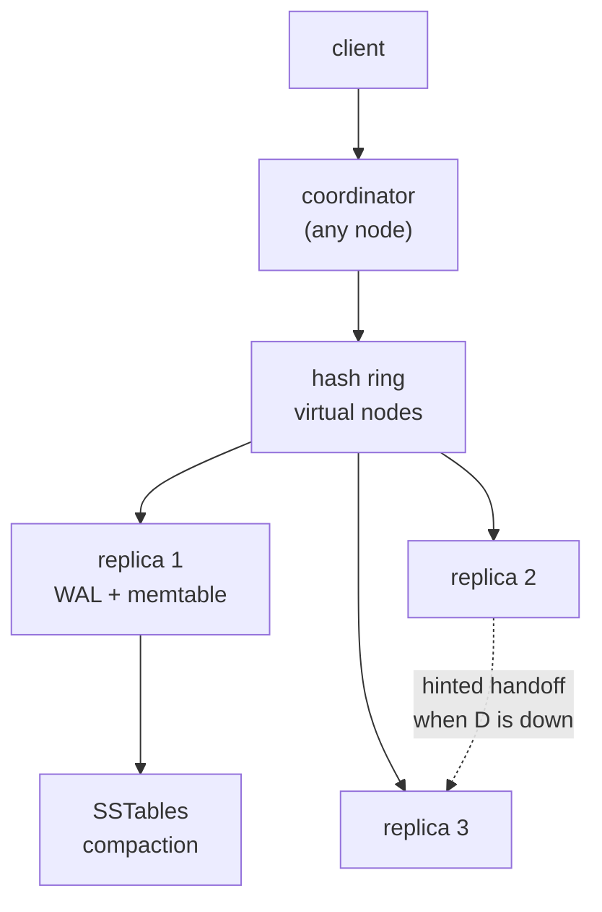
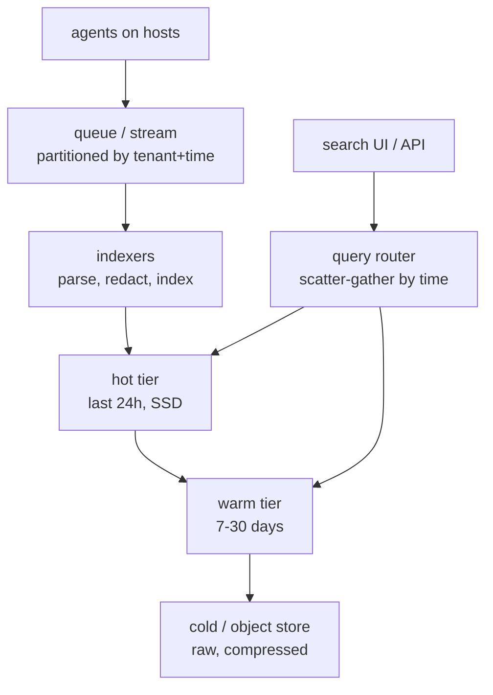
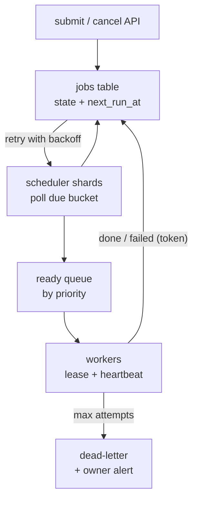

# The classics

Interviewers pick from a standard pool. These aren't your domain, but they come
up, and each one teaches a pattern you can reuse.

---

## Rate limiter / API gateway

Closest to your world, so expect this one.

*Enforce locally, reconcile in the background, accept slightly over-admitting. Reserve an exact central counter for limits that are contractual.*

**Core question:** how do you count requests across many servers without adding
a network hop to every request?

**Algorithm:** token bucket. Tokens refill at a fixed rate, each request takes
one. Bucket size = how big a burst you allow; refill rate = sustained
throughput. Real traffic is bursty and users expect a short burst to work.

**Distribution — the real problem:**

| Approach | Accuracy | Latency |
| --- | --- | --- |
| Central Redis counter | Exact | A round trip per request |
| Local, each instance gets 1/N | Loose | None |
| Local + async reconciliation | Close enough | None |

Most large systems use the third: enforce locally, sync counters in the
background, accept slightly over-admitting. Reserve the exact version for
limits that are contractual.

**Layers:** per tenant (the commercial quota), per user or API key within a
tenant, per endpoint (an expensive report shouldn't share a budget with a cheap
read), and a global one to protect the platform.

**Always return `429` with `Retry-After`.** A limiter that doesn't say when to
come back guarantees an immediate retry.

---

## URL shortener

The classic warm-up. It looks trivial and is really about ID generation and
read scale.

**Numbers:** 100M new URLs/day is only ~1,200 writes/sec. But reads are
100:1 — ~120,000 reads/sec. Read-heavy, like most systems.

*The third is usually the best answer, and saying why — no coordination on the request path — is what the question is actually testing.*

**Generating the short code** — the actual design question:

- **Hash the URL, take 7 chars** — deterministic, but you must handle
  collisions.
- **Counter + base62 encode** — no collisions, but a distributed counter is a
  bottleneck, and sequential IDs are guessable.
- **Pre-generated key pool** — a service hands out unused keys in blocks.
  No collisions, no per-request coordination. Usually the best answer.

7 base62 characters = 62⁷ ≈ 3.5 trillion. Plenty.

**Storage:** key-value, since the only access pattern is "look up by short
code". ~500 bytes per record × 100M/day × 5 years ≈ 90TB.

**Reads:** cache aggressively. URL popularity follows a power law, so a small
cache covers most traffic. Then a CDN in front for the very hottest.

---

## Notification system

Teaches fan-out, queues and delivery guarantees.

**Points worth making:**

*Per-channel workers are a bulkhead: a slow SMS provider must not stop email. And a DLQ nobody watches is data loss with extra steps.*

- **Queue between trigger and delivery.** Sending shouldn't block the action
  that caused it.
- **Per-channel workers**, because providers fail and rate-limit independently.
  A bulkhead — a slow SMS provider shouldn't stop emails.
- **At-least-once delivery**, so use an idempotency key per (user,
  notification) to avoid sending twice.
- **Dead-letter queue** with an owner. A DLQ nobody watches is data loss with
  extra steps.
- **User preferences and quiet hours**, checked at send time not trigger time.
- **Batching/digests** so twenty events don't become twenty emails.

---

## News feed

Teaches the fan-out trade, which generalises widely.

*Naming the celebrity problem and then the hybrid fix is the whole test — either half alone reads as a memorised answer.*

**Fan-out on write (push):** when someone posts, write it into all their
followers' feeds. Reads are then a simple lookup — fast. But a celebrity with
10M followers means 10M writes for one post.

**Fan-out on read (pull):** store posts once; build the feed by querying
everyone you follow at read time. Writes are cheap, reads are expensive.

**The real answer is hybrid:** push for normal users, pull for celebrities.
Merge the two at read time. Being able to name the celebrity problem *and* the
hybrid fix is what's being tested.

---

## Chat / messaging

Relevant because Socket.io is on your resume.

- **WebSockets** for delivery; fall back to long polling.

*A socket lives on exactly one server, so without the backplane server 1 simply cannot reach client B. That is the part candidates skip.*

- **Connection state is the hard part** — a socket lives on one server, so you
  need a pub/sub backplane (Redis) so any instance can reach any connection.
- **Ordering** per conversation: sequence numbers, not timestamps, since
  clocks differ between clients.
- **Delivery receipts** — sent, delivered, read — are three separate states and
  each needs its own acknowledgement.
- **Offline users** need messages stored and delivered on reconnect.

## Three more the pool contains

Each is a full prompt with a rubric, because each teaches something the ones
above do not: a replicated store from the inside, a write-heavy pipeline
with a search index, and exactly-once work scheduling.

### Design: Design a distributed key-value store.
**Level:** senior · **Time:** 45 min  
**What a strong answer covers:**

- Clarifies the API (get/put/delete, value size, consistency required, durability required)
- Partitions by consistent hashing with virtual nodes; explains rebalancing when a node joins or leaves
- Replicates each key to N nodes; chooses leader-based or leaderless and says why
- Tunable consistency via read and write quorums (R + W > N) and what each setting costs
- Durability: write-ahead log before acknowledging; memtable + SSTables and compaction, or B-tree, with a reason
- Failure handling: hinted handoff, read repair or anti-entropy, and what a partition does to each quorum setting
- Hot keys and large values, and what to do about each
- How a client finds the right node (smart client vs gateway vs gossip)

*Consistent hashing places keys; N replicas hold each; the coordinator waits for W acks on write and R replies on read.*

Worked solution

**Requirements.** Say the API is `get(key)`, `put(key, value)`,
`delete(key)`, values up to a few hundred KB, and ask the two questions that
decide everything: does a read after a write have to see the write, and can
we lose an acknowledged write? Assume "usually yes" and "no" — tunable
consistency, durable writes.

**Estimation.** 100 TB of data, 1M ops/s, 3x replication means 300 TB raw
and, at ~2 TB useful per node with headroom, ~150 nodes. That number tells
you a single directory service is fine and that node churn is routine.

**Partitioning.** Consistent hashing, with each physical node owning many
virtual nodes so that a node's departure spreads its load over the whole
ring rather than onto one neighbour. Say the alternative (range partitioning,
which keeps scans cheap and creates hot ranges) and why hashing suits a
key-value API that has no scans.

**Replication.** Each key lives on the N=3 nodes clockwise from its position.
Leaderless (any replica accepts writes, like Dynamo and Cassandra) gives
availability and needs conflict resolution — last-writer-wins with a
timestamp, or vector clocks if you must keep both. Leader-based per partition
(like Bigtable via Chubby, or Raft groups) gives a single order per key and
needs failover. Pick leaderless for an availability-first store, leader-based
if the interviewer said "no lost writes and no conflicts".

**Quorums.** With N=3, W=2 and R=2, every read overlaps every write, so a
read sees the latest acknowledged write. W=1 makes writes fast and lets a
single node failure lose data; R=1 makes reads fast and stale. Say the
setting per use case.

**Storage engine.** Append to a write-ahead log, then to an in-memory
memtable; flush to immutable SSTables; compact in the background. Reads
check memtable then SSTables newest-first, with a bloom filter per SSTable
so most misses cost no disk read. This is the LSM design from Bigtable
(OSDI 2006); the alternative is a B-tree, which is better for read-heavy
workloads with in-place updates.

**Failures.** A replica down during a write: the coordinator writes a hint
to another node, which hands it off when the replica returns. Replicas that
diverge: read repair on the read path and a background anti-entropy process
using Merkle trees. A partition: the majority side keeps serving with W and
R satisfied; the minority side either refuses or serves stale, depending on
the setting you chose.

**Hot keys and large values.** A hot key is one partition's problem, so
cache it at the coordinator or split it (key + suffix) at the application
level. Large values go to a blob store with the key-value store holding the
pointer.

**Evolution.** Add range scans and you are rebuilding Bigtable; add
transactions across keys and you are rebuilding Spanner — say so, and say
what each would cost.

**Reference stack:** Cassandra or ScyllaDB for the leaderless shape, TiKV
or CockroachDB for the Raft-per-range shape, RocksDB as the embedded engine
in both.

**Follow-ups:**

1. Q: A node is added. Walk me through what moves and what the client sees.
   

Answer

   Its virtual nodes are placed on the ring; each takes over the key range
   between itself and its predecessor from the node that previously owned it.
   Data streams from the old owner in the background while the old owner
   keeps serving; the directory (gossip or a coordination service) is updated
   when each range is complete. Clients with a stale ring get redirected once
   and refresh. The senior point: with virtual nodes, a new node takes a
   little from every existing node rather than half of one neighbour, so no
   single node is saturated by the move.

   

2. Q: Two clients write the same key at the same time to different replicas. What happens?
   

Answer

   With leaderless replication both writes are accepted. On read, the
   coordinator sees two versions. Last-writer-wins picks the higher
   timestamp — simple, and silently discards one write, so it is only
   acceptable for data where that is fine (a cache, a counter that is
   idempotent). Vector clocks detect the conflict and return both versions
   for the application to merge, which is correct and pushes complexity to
   every caller. If the interviewer cares about the lost write, the honest
   answer is a per-key leader, which is why leader-based designs exist.

   

3. Q: How do you make deletes work in an LSM store?
   

Answer

   A delete is a write of a tombstone. Reads treat the tombstone as
   "absent"; compaction drops the tombstone and the older values only once
   every SSTable that might contain the key has been merged past it — which
   is why tombstones carry a grace period, and why deleting a lot of data
   temporarily makes the store *bigger*. Mentioning the grace period is what
   shows you have run one of these.

   

### Design: Design a log ingestion and search system — every service emits logs; engineers need to search them within seconds.
**Level:** senior · **Time:** 45 min  
**What a strong answer covers:**

- Estimates volume and shows why it is write-dominated (TBs/day, reads a tiny fraction)
- Agent → buffer (queue) → indexer → storage pipeline, and why the queue is there
- Time-partitioned indexes; hot/warm/cold tiers with different storage and retention
- Inverted index for full-text, plus structured fields for the common filters (service, level, trace id)
- Backpressure and loss policy when ingestion exceeds capacity — what is dropped, and who decides
- Multi-tenancy and access control: logs contain secrets and PII
- Query path: scatter-gather over time shards, limits, and what "within seconds" costs
- Cost as a design input: sampling, retention, and compression

*Writes flow one way through a queue into tiered indexes; reads fan out only to the time shards the query covers.*

Worked solution

**Requirements.** Ask what a "search" is: free text over the message, or
filters on structured fields? Assume both, with structured filters dominant.
Ask the retention (30 days searchable, a year archived) and the freshness
target (searchable within 10 s). Ask whether logs can contain secrets — they
can, always, and that becomes a redaction stage.

**Estimation.** 10,000 hosts × 1 MB/s peak is 10 GB/s, but average is far
lower — say 1 GB/s, ~85 TB/day raw, ~10 TB/day compressed. Reads: a few
thousand queries a day. This is a write-heavy system; the search path can be
comparatively expensive.

**Ingestion.** An agent per host tails files and ships batches. A queue
(Kafka or Pub/Sub) between agents and indexers absorbs bursts and lets
indexers be restarted or scaled without losing data. Partition by tenant and
time so a noisy tenant fills its own partitions.

**Indexing.** Indexers parse structured fields, redact known secret patterns
(this is where a security-team interviewer will lean in — the same scanner as
[40](40-design-security-systems.md) prompt 5), and write time-bounded index
shards: one per tenant per hour, for example. Full text goes into an inverted
index; the common filters (service, level, trace id) into columnar fields so
the typical query never touches the text index.

**Tiers.** The last day on SSD, fully indexed; the last month on cheaper
disk with lighter indexes; everything beyond as compressed raw in object
storage, searchable only by scanning. Retention is a cost decision, and the
senior move is to say what a day of hot storage costs relative to a day of
cold.

**Backpressure.** When indexers fall behind, the queue grows. Alert on lag
in *seconds*, not messages. If the queue itself fills, decide the loss policy
up front: drop debug-level first, sample by tenant, never drop audit logs.
Say who owns that policy.

**Query path.** The router turns a query into the list of time shards it
covers, fans out, merges, and enforces limits (max time range, max results).
"Within seconds" is achieved by the hot tier being fully indexed and the
query being bounded, not by making the whole store fast.

**Security.** Tenant isolation at the index level; per-field access control
for sensitive fields; redaction before indexing so a secret never lands in a
searchable store; audit of who searched what.

**Evolution.** Add metrics derived from logs and you are building a
stream-processing pipeline; add alerting on queries and you need a streaming
evaluator, not the search path.

**Reference stack:** Fluent Bit or Vector agents, Kafka, OpenSearch or
Loki for the index tiers, object storage for cold, a small query router in
front.

**Follow-ups:**

1. Q: A single service starts logging 100x its normal volume by mistake. What protects the system?
   

Answer

   Per-tenant (or per-service) partitions and quotas at the agent and at the
   queue, so its data fills its own partitions and its own indexer capacity.
   Rate limit at the agent first — the cheapest place — with sampling above
   the quota and a metric that fires so the owning team finds out. The rest
   of the tenants never notice, which is the bulkhead argument from
   [29](29-resilience-rate-limiting.md).

   

2. Q: An engineer searches for a trace id across the last 30 days. Why is that slow and what would you do?
   

Answer

   The query fans out to every hourly shard in the range — 720 of them —
   most of which contain nothing. Two fixes: a bloom filter per shard on the
   high-cardinality fields (trace id, request id) so shards that cannot match
   are skipped without opening them; and a secondary index from trace id to
   the shards that contain it, built at ingest. The first is cheap and
   general; the second is exact and costs write-side work.

   

3. Q: How do you guarantee a log line is never lost between the host and the index?
   

Answer

   You mostly do not, and the honest answer says so. The agent acks to the
   file only after the queue acks the batch; the queue replicates before
   acking; the indexer commits its offset only after the shard is durable.
   That gives at-least-once end to end, with duplicates possible on retry —
   deduplicate on a (host, file, offset) key at index time. The residual loss
   window is the agent's own buffer if the host dies; bounding that buffer is
   the trade against back-pressuring the application.

   

### Design: Design a job scheduler — services submit jobs to run at a time or on a schedule, with retries, and a job must never run twice.
**Level:** senior · **Time:** 45 min  
**What a strong answer covers:**

- Separates the API/store, the scheduler that decides what is due, and the workers that run jobs
- Explains why "never runs twice" is impossible in general and what is offered instead (at-least-once execution + idempotent jobs, or a lease with fencing)
- Leases with heartbeats and fencing tokens so a stalled worker cannot complete after its job was reassigned
- Retry policy with exponential backoff and a maximum, a dead-letter state, and what an operator sees
- Finding due jobs efficiently (time-bucketed index, not a full scan) and sharding the scheduler by time bucket or job-id hash
- Cron-style recurrence without drift, and what happens to a missed run
- Priorities, per-tenant fairness, and isolation of a bad job
- Observability: queue age, success rate, per-job history

*Due jobs move from the store to a queue under a lease; every completion carries the lease's fencing token, so a stale worker cannot overwrite a newer attempt.*

Worked solution

**Requirements.** Ask the scale (1M jobs/day is 12/s — small; 1B is
different), the latency tolerance (does "at 09:00" mean within a second or
within a minute?), and what "never twice" means for the caller. Clarify that
the system can offer *at-least-once* execution with a strong guarantee that
two attempts are never *concurrently* running — the job itself must be
idempotent for true exactly-once effects.

**Data model.** A `jobs` row with `id`, `owner`, `payload`, `state`
(scheduled, ready, running, succeeded, failed, dead), `next_run_at`,
`attempts`, `lease_owner`, `lease_expires_at`, `lease_token`. An index on
`(state, next_run_at)` so "what is due" is a range scan, not a table scan.

**Scheduler.** Shard the timeline into buckets (by minute, or by hash of job
id); each scheduler instance owns some buckets, found via a coordination
service or a lease in the database. Every tick it selects due rows in its
buckets, moves them to `ready`, and enqueues them. Leader election per shard
is what stops two schedulers enqueueing the same job.

**Workers and leases.** A worker dequeues, claims the job by a compare-and-set
on `state = ready → running` that also writes a fresh `lease_token` and
`lease_expires_at`. It heartbeats to extend the lease. If it dies, the lease
expires and the scheduler makes the job `ready` again with `attempts + 1`.
When any worker reports completion it must present the `lease_token`; a
report with a stale token is rejected. That fencing token — the same idea as
Chubby's sequencer in [25](25-consensus-coordination.md) — is what makes
"never concurrently twice" true.

**Retries.** Exponential backoff with jitter and a per-job maximum; then
`dead` with an alert to the owner and a UI to inspect and requeue. Say the
difference between a retryable failure (timeout) and a permanent one (bad
payload) and let the job signal which.

**Recurrence.** Store the cron expression and compute `next_run_at` from
the *scheduled* time, not the actual run time, so a slow run does not drift
the schedule. Decide the missed-run policy (run once now, run all missed, or
skip) and make it per job.

**Fairness and isolation.** Per-tenant concurrency limits; priority queues;
a job that fails repeatedly is quarantined rather than allowed to consume
retry capacity.

**Observability.** Age of the oldest ready job is the health signal; success
rate and p99 run time per job type; a full attempt history per job for the
owner.

**Reference stack:** PostgreSQL with `SELECT ... FOR UPDATE SKIP LOCKED` for
the claim, a queue (Redis streams or Pub/Sub) between scheduler and workers,
`bullmq` or Temporal if the interviewer allows a framework and asks what you
would use in practice.

**Follow-ups:**

1. Q: The scheduler shard for minute 09:00 crashes at 08:59:59. What happens to those jobs?
   

Answer

   Nothing is lost: the jobs are still `scheduled` in the store with
   `next_run_at` in the past. When another scheduler instance acquires the
   shard's lease it scans for `next_run_at <= now` and enqueues them late.
   The lateness is the shard-lease timeout plus a tick — say what it is, and
   say that the metric "oldest due-but-not-ready job" is how you would see it.
   The point the interviewer wants: the store is the source of truth; the
   scheduler is stateless and restartable.

   

2. Q: A worker's process is paused by the OS for two minutes, then resumes and finishes the job. Meanwhile the job was retried elsewhere. Now what?
   

Answer

   The lease expired during the pause; the retry took a new lease with a new
   token. When the paused worker reports completion with its old token, the
   store rejects it, so the job's state reflects the retry's outcome. But the
   paused worker may already have performed the side effect — sent the email,
   charged the card — which is why the job must be idempotent on a key the
   scheduler supplies (job id + attempt). The fencing token protects the
   store's state; idempotency protects the world's.

   

3. Q: Ten million jobs are all scheduled for midnight. What breaks?
   

Answer

   The midnight bucket: one scheduler shard must move ten million rows, and
   one queue must absorb them. Fixes, in order of cheapness: spread the
   bucket by hashing job id into sub-buckets served by many shards; enqueue
   in batches; rate-limit dispatch so workers are fed at their capacity
   rather than flooded; and add jitter to recurrence times at submission so a
   "daily at midnight" job actually runs at 00:00 plus a stable per-job
   offset. The last is a product decision, so say you would raise it as one.

   

---

## Reference stack

| Design | Libraries you'd name |
| --- | --- |
| Rate limiter / gateway | `rate-limiter-flexible` or the hand-rolled Lua token bucket in [resilience-rate-limiting](29-resilience-rate-limiting.md) |
| URL shortener | `nanoid` or `hashids` for the code; `ioredis` cache in front of the key-value store |
| Notification system | `bullmq` for per-channel queues; a provider SDK per channel (SES, Twilio, FCM) |
| News feed | `ioredis` sorted sets for the per-user feed cache; a fan-out worker on `bullmq` |
| Chat / messaging | `socket.io` + `@socket.io/redis-adapter` for the pub/sub backplane — see [messaging-streams](27-messaging-streams.md) |

---

## Interview Q&A

### Design: A rate limiter for a multi-tenant API
**Level:** senior · **Time:** 45 min

**What a strong answer covers:**

- Token bucket, and why bursts are usually desirable
- Per-tenant limits, not just global — otherwise one tenant eats everything
- The distributed counting problem, and the latency trade
- `429` with `Retry-After` and rate-limit headers
- What happens when the limiter itself fails

Worked solution

See the rate limiter section above, plus
[resilience rate limiting](29-resilience-rate-limiting.md)
for the algorithms in detail.

One extra thing to raise if it doesn't come up: **what does the limiter do when
Redis is down?** Failing closed means your rate limiter takes down the API.
Failing open means no limits during an outage — usually the right call, since
losing rate limiting briefly is better than losing the API, but say it's a
deliberate choice.

### Q: Design a URL shortener.
**Level:** intermediate · **Tags:** design, classics

Model answer

I'd check scope first: do we need custom aliases, expiry, analytics? Assume
basic shortening plus click counts.

Numbers: say 100M new URLs a day, which is only about 1,200 writes/second.
Reads at 100:1 gives ~120,000 reads/second. So it's read-heavy, and the read
path is the design.

The interesting decision is generating the short code. Hashing the URL and
taking seven characters is deterministic but needs collision handling. A global
counter with base62 encoding avoids collisions but the counter becomes a
bottleneck and the IDs are guessable. What I'd do is pre-generate keys: a
service hands out blocks of unused keys to each app server, so there's no
per-request coordination and no collisions.

Seven base62 characters gives about 3.5 trillion combinations, which is plenty.

Storage is key-value — the only access pattern is lookup by code — so DynamoDB
or similar. About 90TB over five years at that rate.

For reads, cache hard. URL popularity follows a power law, so a relatively
small cache covers most traffic, and a CDN handles the hottest links. Redirects
are `301` if you don't need analytics, `302` if you do, since a permanent
redirect gets cached by the browser and you stop seeing the clicks.

**Follow-ups:**

1. Q: Two users shorten the same URL. One code or two?
   

Answer

   Depends on whether you offer per-user analytics, which is a product question
   worth surfacing.

   One code is storage-efficient and needs a lookup by original URL — so an
   index on it, or a hash-based scheme. But then both users share click counts,
   and neither can delete or expire the link without affecting the other.

   Two codes means duplicate storage but clean ownership: separate analytics,
   separate expiry, separate deletion.

   I'd default to two, because ownership is usually worth more than the storage
   saving, and the coupling in the shared version causes support problems that
   are hard to explain to a customer.

   

---

## What a weak answer sounds like

- **Jumping to an architecture** without asking what's in scope.
- **Ignoring the read/write ratio.** It's the first thing to establish and it's
  usually lopsided.
- **Fan-out on write with no celebrity answer.**
- **A distributed counter** as the ID scheme with no note that it's a
  bottleneck.
- **No failure story.** "What if this component dies?" always comes.
