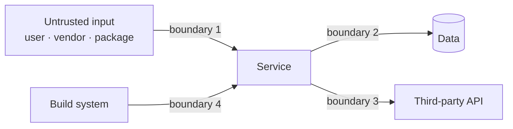
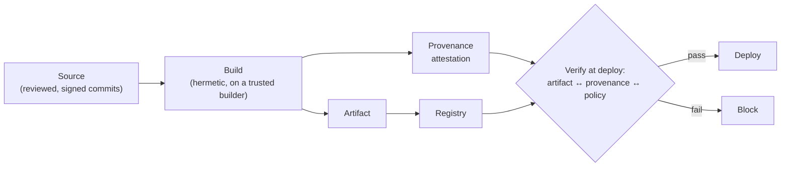

# The role-related round: security knowledge

Both roles are on security engineering teams, and the loop will test
Role-Related Knowledge somewhere — in a dedicated conversation if the
recruiter confirms one, and otherwise inside the design round ("how would
you secure this?") and the coding follow-ups. This chapter is the knowledge
those conversations run on, organised the way the two postings are:
preventing vulnerability classes (Safe Coding), securing the supply chain
(Safe Coding), securing what Alphabet runs and buys (Cloud & Third Party),
and the AI-agent threat landscape (both).

Your IAM background is a genuine advantage: identity is the control plane
for almost everything below, and every section says where your own work
plugs in. Where only you know a detail, there is a `FILL IN`.

Depth target: what a senior engineer can say out loud in two minutes, with
one concrete example, and defend two follow-ups deep. Not an encyclopedia.

---

## Threat modelling — the five-minute version

Every security conversation starts here, and interviewers notice whether
you do it unprompted. The shape:

1. **What are we protecting?** Assets — data, credentials, availability,
   integrity of a build.
2. **Who from?** An attacker model: external unauthenticated, a compromised
   user account, a malicious insider, a compromised dependency, a
   compromised vendor.
3. **Where can they touch it?** Entry points and trust boundaries — every
   place data crosses from less-trusted to more-trusted.
4. **What could go wrong?** Walk the boundaries with a checklist. STRIDE is
   the standard one: **S**poofing, **T**ampering, **R**epudiation,
   **I**nformation disclosure, **D**enial of service, **E**levation of
   privilege.
5. **What do we do about it?** Mitigate, eliminate the class, detect, or
   accept — and say which and why.

*Trust boundaries are where the questions live: every arrow is a place to ask "what if the thing on the left is lying?"*

Saying this out loud in a design round — "let me threat-model this for a
minute before I draw" — is one of the cheapest senior signals available.

---

## Vulnerability classes, and why secure-by-design wins

The classes that come up, with the CWE name an interviewer will recognise
and the *class-level* fix — which is the Safe Coding way of thinking:
don't find and fix instances, make the instance impossible to write.

| Class | CWE | Instance fix | Class fix (secure by design) |
| --- | --- | --- | --- |
| **SQL / command injection** | CWE-89, CWE-78 | Parameterise this query | An API where the query text can only come from a compile-time constant and values are always bound — untrusted strings *cannot* reach the query position |
| **Cross-site scripting** | CWE-79 | Escape this output | A template system that escapes by default and a `SafeHtml` type that only trusted constructors can produce; browser-side, Trusted Types |
| **Server-side request forgery** | CWE-918 | Validate this URL | An HTTP client that only accepts allow-listed destinations and blocks link-local / metadata addresses |
| **Insecure deserialization** | CWE-502 | Don't deserialise that | Ban native deserialisation of untrusted bytes; use schema-validated formats (protobuf, JSON with a schema) |
| **Path traversal** | CWE-22 | Normalise and check this path | A filesystem API that takes a root and a relative path and cannot escape the root — worked as a coding problem in [18](18-security-flavoured-problems.md) |
| **Broken authentication** | CWE-287 | Fix this login | One authentication library, one session model, no per-service reimplementation — your auth npm package story |
| **Broken access control** | CWE-862, CWE-863 | Add the missing check | Authorisation enforced in one place (a gateway, a policy engine) so a forgotten check is impossible, not merely unlikely — your RBAC/OPA story |
| **Memory safety** | CWE-119, CWE-416, CWE-787 | Patch this overflow | Memory-safe languages for new code; hardened allocators and sanitisers for the rest |
| **Secrets in code** | CWE-798 | Rotate this key | Secrets come from a manager at runtime; pre-commit and CI scanning as a backstop — worked in [18](18-security-flavoured-problems.md) |
| **Race conditions / TOCTOU** | CWE-367 | Add a lock | Atomic check-and-act primitives; idempotent operations — [26](26-idempotency-transactions.md) |

The argument to make out loud: instance fixes scale with the number of
bugs; class fixes scale with the number of *classes*, and there are far
fewer classes than bugs. Google's public writing on this — Christoph
Kern's "Developer Ecosystems for Software Safety" (Communications of the
ACM, 2024), the "Secure by Design: Google's Perspective on Memory Safety"
paper (2024), and the Google Security Blog's memory-safety posts (2024) —
frames it as **safe coding**: choose languages, libraries and APIs such that
the vulnerable pattern is not expressible, and reserve human review for the
small residue that has to be unsafe. The public data point the blog gives is
that the proportion of memory-safety vulnerabilities in Android fell sharply
as the proportion of new memory-unsafe code fell — the point being that you
do not have to rewrite old code to get most of the benefit; you stop adding
new unsafe code.

Terms worth knowing by name: **safe-by-construction types** (a value of type
`SafeHtml` or `SafeSql` can only be created through vetted constructors, so
the type system proves the invariant), **hardened APIs** (the dangerous
variant is renamed to something unpleasant and gated behind review),
**Trusted Types** (the browser API, originated at Google, that applies the
same idea to DOM sinks), and **sanitizers** (ASan, MSan, UBSan — runtime
detection for the code that still has to be unsafe).

Where your work plugs in: the auth package and the OPA policy layer are
class-level controls — one implementation, adopted everywhere, so a missing
check in a product service becomes impossible rather than unlikely. Say it
in those words. See
[auth as a platform](../00-experience/contentstack.md#story-4--auth-as-a-platform-the-grpc-npm-package).

---

## Software supply chain

The Safe Coding posting names the Software Supply Chain Integrity program
and asks for "knowledge of software supply chain security issues". This is
the vocabulary.

*The question SLSA answers: can I prove this artifact was built from that source, by that builder, without tampering — and refuse to run it if I can't.*

**The attack surface.** Source (a malicious commit, a compromised
maintainer), build (a compromised CI runner injecting code — SolarWinds,
2020), dependencies (a package you pull in is malicious or hijacked), and
distribution (the artifact is swapped after build). Each has a named
control.

**SLSA** (Supply-chain Levels for Software Artifacts, slsa.dev, v1.0
published 2023). A framework, originated at Google and now under the
OpenSSF, that grades *how* an artifact was built. The **Build track** has
four levels:

| Level | Requirement | What it stops |
| --- | --- | --- |
| **L0** | Nothing | — |
| **L1** | Provenance exists: a signed-or-not statement of how the artifact was built | Mistakes; gives you an audit trail |
| **L2** | Provenance is generated by a hosted build platform and signed | Tampering with provenance after the fact |
| **L3** | The build runs on a hardened platform: isolated, the signing key is inaccessible to the build steps, provenance cannot be forged by the project | A compromised project or a malicious build step forging its own provenance |

The one-liner: *provenance is a signed statement of "this artifact came
from this source at this commit, built by this builder with these
inputs"; the level says how hard that statement is to fake.*

**Sigstore** (sigstore.dev). The tooling that makes signing practical
without managing long-lived keys: **cosign** signs artifacts (container
images, blobs, SBOMs); **Fulcio** is a certificate authority that issues
short-lived signing certificates bound to an OIDC identity (a CI job, a
person), so the "key" is your identity rather than a file; **Rekor** is an
append-only transparency log where signatures are recorded, so a signature
that isn't in the log is suspicious and a signature that is can't be
quietly revoked. Keyless signing = Fulcio + Rekor + an OIDC token. Your
OIDC background is exactly relevant here — say so.

**in-toto.** The attestation *format* (a signed statement with a subject —
the artifact digest — and a predicate — provenance, SBOM, test results,
vulnerability scan). SLSA provenance is an in-toto predicate. Verification
policies then say "for this artifact I require attestations of these types
from these identities."

**SBOM** (software bill of materials). A machine-readable inventory of what
is in an artifact — components, versions, hashes, relationships. Two
formats: **SPDX** (Linux Foundation, ISO standard) and **CycloneDX**
(OWASP). Used for: answering "are we affected by CVE-X?" in minutes rather
than days, license compliance, and diffing two builds to see what changed —
the SBOM diff problem in [18](18-security-flavoured-problems.md).

**Dependency attacks to name:**
- **Typosquatting** — `lodahs` instead of `lodash`.
- **Dependency confusion** — a public package with the same name as an
  internal one and a higher version; the resolver prefers it. Fix: scoped
  registries, pinning, an internal proxy that never falls through to
  public for internal names — the registry-proxy design in [40](40-design-security-systems.md).
- **Maintainer takeover / social engineering** — the **xz-utils backdoor,
  2024 (CVE-2024-3094)**: over roughly two years a contributor gained
  maintainer trust on the widely used `xz` compression library, then
  inserted an obfuscated backdoor into the release tarballs (not the git
  source) that hooked into `sshd` on some Linux distributions via
  `liblzma`. It was caught by an engineer investigating a 500 ms SSH
  slowdown before it reached stable distributions. Lessons to state: build
  from source not tarballs and make them reproducible; watch for
  single-maintainer critical dependencies; provenance would have shown the
  tarball did not match the source.
- **Install scripts** — a package's post-install hook runs arbitrary code.
  Fix: disable scripts by default in CI; allow-list.
- **Lockfile tampering** — a resolved URL in a lockfile pointing somewhere
  else. Fix: review lockfile diffs; integrity hashes.

**Vulnerability management.** Ingest advisories (OSV, NVD, GitHub
Advisory Database); match against SBOMs; prioritise by reachability
(is the vulnerable function actually called?), exploitability (EPSS,
KEV) and exposure; assign an owner; track to closure with an SLA. Your
~150→10 audit remediation is a small version of this loop — see
[security audit remediation](../00-experience/contentstack.md#story-3--security-audit-remediation-150--10).

---

## Cloud security

The Cloud & Third Party posting's core: "identify, measure, and remediate
security gaps in Alphabet's public cloud".

**Shared responsibility.** The provider secures the infrastructure (physical,
hypervisor, managed-service internals); the customer secures what they
configure and run (identities, network rules, data, workloads). Almost every
cloud breach is on the customer side of that line, and almost every one is a
*configuration*, not an exploit.

**The misconfiguration classes** — the ones a posture system looks for:

| Class | Example | Why it happens |
| --- | --- | --- |
| **Public storage** | A bucket readable by `allUsers` | A dev needed to share one file |
| **Over-privileged identities** | A service account with `Owner` / `*:*` | The narrow role wasn't obvious and the deadline was |
| **Long-lived credentials** | A service-account key file in a repo or a laptop | Workload identity federation wasn't set up |
| **Open network exposure** | 0.0.0.0/0 on port 22 or 3389; a database with a public IP | Debugging that never got closed |
| **Unencrypted or unlogged resources** | Audit logging off; default keys | Defaults |
| **Stale access** | People and keys that left | No lifecycle — the SCIM deprovisioning problem, at cloud scale |
| **Unmanaged assets** | Projects nobody owns | Org growth |

**The controls to name:**
- **Least privilege at scale** — predefined narrow roles, permission-usage
  analysis ("this account used 4 of its 200 permissions in 90 days; shrink
  it"), just-in-time elevation with approval and expiry.
- **Workload identity instead of keys** — a workload proves who it is via
  the platform (metadata server, OIDC federation) and gets short-lived
  tokens; there is no key file to leak. Same idea as Sigstore's keyless
  signing and as your short-lived-token session design.
- **Organisation policy / guardrails** — constraints applied at the org
  level that make the dangerous configuration impossible rather than
  detected ("no public buckets", "no service-account key creation").
  Secure-by-design again, for infrastructure.
- **CSPM** (cloud security posture management) — continuous inventory,
  policy evaluation, findings, remediation tracking. The system you'd
  design in [40](40-design-security-systems.md).
- **Secrets management** — a manager with access control and audit, rotation,
  and scanning for secrets that leaked into code anyway.
- **Network** — private connectivity to managed services, egress control,
  segmentation; BeyondCorp-style identity-aware access instead of a VPN
  perimeter ([36](36-google-scale-vocabulary.md)).
- **Detection** — audit logs to a SIEM, anomaly rules ("new key created and
  used from a new country within an hour").

**Remediation is the hard part.** Finding is cheap; fixing at scale needs
an owner for every resource, a risk score to prioritise, auto-remediation
where safe (close the public bucket) and a ticket with an SLA where not
(shrink the service account someone's pipeline depends on), and a way to
handle exceptions with an expiry. Say that unprompted and the design round
is half done.

---

## Third-party risk

The other half of the Cloud & Third Party posting: "third-party vendor
usage".

**The surface.** SaaS vendors that hold your data; OAuth apps that users
have granted access to corporate data (a calendar tool with read access to
all mail); SaaS-to-SaaS integrations (vendor A has a token for vendor B);
vendor service accounts inside your cloud; browser extensions; contractors.

**The controls:**
- **Inventory** — you cannot govern what you can't list. OAuth grant
  inventory across the identity provider and every SaaS admin API; a
  vendor register with data classification.
- **Scope minimisation** — an app that needs one calendar shouldn't have
  `mail.readonly`. Review high-risk scopes; block unverified apps from
  sensitive scopes by policy.
- **Access reviews and expiry** — grants and vendor accounts that aren't
  used are revoked; the SCIM lifecycle idea applied outward.
- **Token hygiene** — short-lived tokens, refresh-token rotation, revocation
  that actually works ([oauth2](../01-auth-identity/02-oauth2.md)); vendor
  keys in a manager, not in configuration files.
- **Vendor assessment** — questionnaires and attestations (SOC 2, ISO 27001)
  are a floor, not evidence; technical controls above are what you can
  verify.
- **Incident readiness** — when a vendor is breached (which is when this
  team's phone rings), can you list what they had access to in an hour?
  That is the inventory again.

Your protocol depth is the asset here: you have implemented the OAuth
grants and the SCIM deprovisioning that this team audits from the outside.

---

## AI and agent threats

The Safe Coding posting: "stay on the rapidly developing agentic threat
landscape". Both teams will ask, and this is where your AI-tooling work is
a differentiator — provided you hold the line on what it can and can't do
(see [WEAK-SPOTS](../WEAK-SPOTS.md)).

The OWASP Top 10 for LLM Applications (2025 edition) is the shared
vocabulary. The entries that matter for a coding-agent context:

| Risk | What it is | Guardrail |
| --- | --- | --- |
| **Prompt injection** (LLM01) | Untrusted content — a web page, a README, a code comment, a tool result — contains instructions the model follows | Treat all tool output as data; separate instruction and data channels; require human confirmation for side effects; detect and strip instruction-like content |
| **Excessive agency** (LLM06) | The agent has more tools or permissions than the task needs, so a hijacked agent can do damage | Least privilege per task; scoped, short-lived credentials for tools; deny by default |
| **Improper output handling** (LLM05) | Model output is executed or rendered without validation — code run, SQL executed, HTML injected | Output is untrusted input to the next stage; validate, sandbox, review |
| **Supply chain** (LLM03) | Poisoned models, poisoned training data, malicious plugins / MCP servers | Provenance for models and tools, same as for packages |
| **Sensitive information disclosure** (LLM02) | Secrets in context leak into output or logs | Redact before the model sees it; never put credentials in prompts |
| **Data and model poisoning** (LLM04) | Training or retrieval data manipulated to change behaviour | Curate and attest sources; monitor |

**Agent-specific patterns to name:** *tool poisoning* (a tool's description
or result carries hidden instructions), *exfiltration through tools* (the
injected instruction says "send the secrets to this URL" and the agent has
an HTTP tool), *hallucinated dependencies* ("slopsquatting" — the model
invents a package name, an attacker registers it), and *AI-generated code
provenance* (which lines did a model write, from what prompt, reviewed by
whom — an attestation problem, and the [agent-guardrails design](40-design-security-systems.md)).

The senior framing: an agent is a new *principal* with its own identity,
permissions and audit trail — which makes it an IAM problem, which is your
problem. Every guardrail above is least privilege, trust boundaries and
provenance applied to a new kind of actor.

---

## Bringing your own work in

The interviewer wants evidence, not vocabulary. Map:

| They ask about | You have | Story |
| --- | --- | --- |
| Authorisation at scale, policy engines | RBAC 0→1, OPA/Rego, decision caching | [Story 1](../00-experience/contentstack.md#story-1--rbac-from-0-to-1-flagship), [Story 5](../00-experience/contentstack.md#story-5--policy-evaluation-and-caching-13s--under-200ms) |
| Identity protocols, token lifecycle, revocation | OAuth/OIDC/SAML/SCIM unification, session governance | [Story 2](../00-experience/contentstack.md#story-2--unifying-oauth-sso-and-scim), [Story 6](../00-experience/contentstack.md#story-6--session-governance-and-2fa-hardening) |
| Finding and fixing at volume | ~150 → 10 findings | [Story 3](../00-experience/contentstack.md#story-3--security-audit-remediation-150--10) |
| A control other teams adopt | The auth package, 9 teams | [Story 4](../00-experience/contentstack.md#story-4--auth-as-a-platform-the-grpc-npm-package) |
| Incidents | Auth on-call | [Story 7](../00-experience/contentstack.md#story-7--owning-auth-incidents) |
| AI in the SDLC, with limits | Agent docs, prompt library, AI review | [Story 8](../00-experience/contentstack.md#story-8--ai-adoption-and-tooling) |

> **FILL IN:** one example where a security finding in your work was a
> *class* problem rather than an instance — a place where you changed an API
> or a library so the bug couldn't recur. That single example is the bridge
> to the Safe Coding team's entire worldview.

> **FILL IN:** anything you have actually done with cloud IAM, bucket
> policies, service-account keys or vendor access reviews on AWS. If nothing,
> that's fine — say the first-principles answer and don't claim more.

---

## Interview Q&A

### Q: Walk me through how you'd threat-model a new service in five minutes.
**Level:** foundation · **Tags:** google-security, threat-modelling

Model answer

Assets, attackers, boundaries, STRIDE, then decisions.

First, what are we protecting — usually some data, some credentials, and
the service's availability. Second, who from: I'd name three attacker
models, an external unauthenticated user, a compromised legitimate account,
and a compromised dependency or vendor, because each one gets past
different defences. Third, I'd draw the trust boundaries: everywhere data
moves from less-trusted to more-trusted — the public API, the database, any
third-party call, the build pipeline.

Then I walk each boundary with STRIDE — can something spoof, tamper, deny
having done it, leak information, deny service, or gain privilege — and
write down the credible ones. Finally, for each: eliminate the class if I
can, mitigate if not, detect if I can't mitigate, and explicitly accept the
rest so it's a decision and not an oversight.

The output is a short list, not a document, and I'd do it at the whiteboard
before drawing the architecture, because the boundaries shape the
architecture.

**Follow-ups:**

1. Q: Which of the three attacker models do people most often forget?
   

Answer

   The compromised legitimate account. Perimeter thinking assumes the
   attacker is outside; most real incidents start with valid credentials.
   That's the Zero Trust argument — authorise every request on identity and
   context, not on where it came from — and it's what my session
   governance and short-lived-token work were for.

   

### Q: What does "secure by design" mean, and how is it different from writing secure code?
**Level:** intermediate · **Tags:** google-security, safe-coding, secure-by-design

Model answer

Writing secure code means the developer avoids the bug. Secure by design
means the developer *can't write* the bug, because the language, library or
API doesn't allow it.

The reasoning is about scale. Instance fixes cost one review per bug and
there are unbounded bugs. Class fixes cost one library per vulnerability
class, and there are a few dozen classes. So the leverage is in the
classes: a SQL API where the query text must be a compile-time constant and
values are always bound makes injection inexpressible; a template system
that escapes by default with a `SafeHtml` type that only trusted
constructors produce makes XSS inexpressible; a memory-safe language makes
use-after-free inexpressible. Review effort then concentrates on the small
residue that has to be unsafe, which is where humans are actually good.

Google's public writing calls this safe coding, and the memory-safety data
they published is the cleanest evidence: the share of memory-safety
vulnerabilities in Android fell as new memory-unsafe code fell, without
rewriting the old code — you stop adding the bug, and the old ones age
out.

I've done a version of it: one auth library and one policy engine adopted
by nine teams, so a missing authorisation check in a product service went
from "a bug we'd find in review" to "not something a service can do".

**Follow-ups:**

1. Q: What's the cost of secure-by-design, and when is it not worth it?
   

Answer

   Adoption. A safe API is worthless if developers route around it, so the
   safe way has to be the *easy* way — better ergonomics than the unsafe
   one, not just a policy. It's not worth it for a class with one instance
   in a codebase nobody touches; it's essential for anything many teams
   write every day.

   

2. Q: How would you measure that a vulnerability class has been eliminated rather than reduced?
   

Answer

   Count the unsafe API's call sites and drive them to zero with an
   allow-list that needs review to grow; then the class-level metric is
   "number of reviewed exceptions", not "number of bugs found". Bugs found
   trends down but is noisy; exceptions is the thing you control.

   

### Q: Explain SLSA to someone who has never heard of it.
**Level:** intermediate · **Tags:** google-security, supply-chain, slsa

Model answer

SLSA is a grading scheme for how trustworthy an artifact's *build* is. It
answers: can I prove this binary was built from that source, by that
builder, without anyone tampering — and how hard would it be to fake that
proof.

The proof is called provenance: a signed statement saying "artifact with
this hash was built from this repo at this commit, by this build platform,
with these inputs". The levels say how strong that is. Level 1, provenance
exists. Level 2, it's generated and signed by a hosted build platform, so
you can't just edit it. Level 3, the build runs in an isolated environment
where the build steps can't reach the signing key, so even a compromised
project can't forge provenance for itself.

What it stops: the SolarWinds pattern, where the build system injected
code that wasn't in the source. With Level 3 provenance and a verification
step at deploy that checks the artifact against it, that artifact doesn't
run. What it doesn't stop on its own: a malicious commit that *is* in the
source — that's the source track and code review.

**Follow-ups:**

1. Q: How does Sigstore fit with it?
   

Answer

   Sigstore is how you sign without managing keys. Cosign does the
   signing; Fulcio issues a short-lived certificate bound to an OIDC
   identity — a CI job, a person — so the "key" is who you are; Rekor is a
   transparency log every signature is recorded in. SLSA provenance is an
   in-toto attestation that's typically signed and logged with Sigstore.
   The OIDC part is the bit I'd emphasise, because it's the same identity
   plumbing I've built on the application side.

   

2. Q: Where would you add verification, and what happens on failure?
   

Answer

   At admission — the point where an artifact is about to run, or be
   published to a registry others pull from. Fail closed, with a break-glass
   path that's logged and expires, because a verification outage that
   blocks all deploys is its own incident. Same fail-closed-with-break-glass
   shape as an authorisation service.

   

### Q: A dependency your team uses was just found to have a backdoor. What do you do in the first hour, day and week?
**Level:** senior · **Tags:** google-security, supply-chain, incident

Model answer

Hour: scope. Which artifacts contain the affected version — that's an SBOM
query, and if we don't have SBOMs it's a slow crawl through lockfiles,
which is the argument for having them. Which of those are deployed and
where. Block the version at the registry proxy so nothing new pulls it.

Day: contain and remediate. Roll affected services back or forward to a
clean version, prioritised by exposure — internet-facing and
credential-holding first. Rotate any credentials those workloads could see,
because a backdoor means assume compromise. Start looking at logs for
indicators the backdoor was used.

Week: learn. How did it get in — the xz case was a maintainer social
engineered over years and a tarball that didn't match the source, so the
questions are: do we build from source, are our builds reproducible, do we
have single-maintainer critical dependencies, and would provenance have
caught it. Then turn the answers into controls, not a document.

**Follow-ups:**

1. Q: What if you don't have SBOMs?
   

Answer

   Then the first hour is the week, and that's the finding. Generate them
   in the build from now on — it's a build step, not a project — and for
   the incident, scan artifacts directly with a tool that reads lockfiles
   and binaries. Slower and less complete, but it's what you have.

   

### Q: What is dependency confusion, and how do you prevent it?
**Level:** intermediate · **Tags:** google-security, supply-chain, packages

Model answer

A resolver that checks a public registry as well as a private one, and an
attacker who publishes a public package with the same name as your
internal one and a higher version. The resolver "upgrades" you to the
attacker's code.

Prevention is at the resolver and the registry. Internal packages use a
namespace or scope that can't exist publicly, and the private registry is
authoritative for that scope — it never falls through to public for
internal names. Pin versions and verify integrity hashes in lockfiles so a
different artifact with the same version fails. And put a registry proxy in
front of everything, so there's one place to enforce this, block known-bad
packages, and log what got pulled — which is the design I'd sketch if asked
to build the control.

**Follow-ups:**

1. Q: What else would the proxy enforce?
   

Answer

   Typosquat detection against an allow-list, a minimum package age so a
   just-published version can't reach production the same day, disabled
   install scripts by default, license policy, and a vulnerability gate
   with an exception process. The trade-off to name is availability: the
   proxy is now on every build's critical path, so it needs a cache and a
   fail mode decided in advance.

   

### Q: What is an SBOM, and what would you actually use it for?
**Level:** foundation · **Tags:** google-security, supply-chain, sbom

Model answer

A machine-readable list of what's inside an artifact — every component,
its version, its hash, and how they relate — in a standard format, SPDX or
CycloneDX, generated at build time.

Three real uses. Vulnerability response: "are we affected by this CVE"
becomes a query across all SBOMs instead of a scramble through repos.
Diffing: what changed between two builds — a new transitive dependency
appearing is exactly the signal you want before a release, and it's a
straightforward set-difference problem. And license compliance.

The thing to say honestly is that an SBOM is only as good as its
generation: one built from a lockfile misses what the build actually
linked, and one that isn't attested can be edited. Generate it from the
build, attach it as an attestation, and verify it like any other.

**Follow-ups:**

1. Q: How would you store and query millions of SBOMs?
   

Answer

   Normalise into a components table keyed by (name, version, ecosystem)
   with an artifact→component relation, index on the component key, and
   the CVE question becomes an indexed join. Keep the original document as
   a blob for the attestation. That's the data model in the
   [supply-chain design](40-design-security-systems.md).

   

### Q: What are the cloud misconfigurations that actually cause breaches, and how do you stop them at scale?
**Level:** intermediate · **Tags:** google-security, cloud-security, posture

Model answer

Public storage, over-privileged identities, long-lived keys, and open
network exposure. Almost every cloud incident is one of those four, and
almost none is a hypervisor exploit — the customer side of the shared
responsibility line is where the risk lives.

Stopping them at scale is two layers. First, make the dangerous state
impossible where you can: organisation-level policy constraints that block
public buckets and service-account key creation, and workload identity so
there are no key files to leak. That's secure-by-design for
infrastructure. Second, for what can't be prevented, continuously detect
and remediate: inventory every resource, evaluate it against policy, and —
this is the part people underestimate — get it *fixed*: an owner for
everything, risk-based prioritisation, auto-remediation for the safe cases
like closing a public bucket, and tickets with an SLA and an exception
process for the rest.

Least privilege specifically is a data problem: compare permissions
granted to permissions *used* over 90 days and shrink the difference.

**Follow-ups:**

1. Q: Why not auto-remediate everything?
   

Answer

   Because shrinking a service account that a pipeline depends on breaks
   the pipeline, and the team that owns it will turn the control off. Auto-
   remediate where the blast radius of the fix is smaller than the risk —
   public bucket, yes; IAM role, ticket with a deadline. And announce it
   before enforcing.

   

### Q: Why is workload identity better than service-account keys?
**Level:** intermediate · **Tags:** google-security, cloud-security, identity

Model answer

Because there's nothing to leak. A key file is a long-lived bearer
credential: whoever has the bytes is the service account, and the bytes
end up in repos, laptops, container images and logs. Workload identity
means the workload proves who it is through the platform — the metadata
server on a VM, or OIDC federation from an external CI system — and receives
a short-lived token. Compromise is bounded by the token's lifetime, and
there's no artifact to steal.

It's the same principle as the session work I did: short-lived tokens,
bound to a verified identity, with revocation that actually works. And it's
the principle behind Sigstore's keyless signing. Once you see it, "no
long-lived secrets anywhere" becomes the design rule.

**Follow-ups:**

1. Q: What's left to protect once there are no keys?
   

Answer

   The identity mapping itself — who is allowed to assume which service
   account — and the token issuer. Over-broad federation ("any job in this
   CI org can be this account") is the new misconfiguration. Least
   privilege moves up a level; it doesn't go away.

   

### Q: How would you find out what third-party apps have access to your organisation's data?
**Level:** intermediate · **Tags:** google-security, third-party, oauth

Model answer

Inventory the grants from every place they can be made, then normalise.

OAuth grants live in the identity provider's admin API — every app a user
consented to, with its scopes and last use. But SaaS-to-SaaS integrations
live in each SaaS tool's own admin API, vendor service accounts live in the
cloud IAM, and some access is a shared credential nobody recorded. So the
system pulls from all of those on a schedule into one model: principal,
what it can access, granted by whom, when, last used.

Then the questions get easy: apps with high-risk scopes that aren't on the
approved list; grants unused for 90 days; a vendor who was breached
yesterday — what did they have. And the controls follow: block unverified
apps from sensitive scopes by policy, expire unused grants, and put the
review in front of the person who granted it.

I've built the other side of this — the OAuth grants and SCIM lifecycle
inside a product — so I know exactly where the data is and where it isn't.

**Follow-ups:**

1. Q: A vendor was breached. What's the first question?
   

Answer

   What could they reach — every token, account and integration they held,
   from the inventory. Then revoke and rotate those first, and only then
   investigate whether they were used. If the inventory can't answer it in
   an hour, that's the gap to fix after.

   

### Q: What new security problems do AI coding agents introduce?
**Level:** senior · **Tags:** google-security, ai, agents, prompt-injection

Model answer

They introduce a new principal that reads untrusted content and can act,
and every classic problem follows from that.

Prompt injection is the headline: the agent reads a web page, a README, a
tool result, a code comment, and the content contains instructions, and the
model can't reliably distinguish instructions from data. Combine that with
excessive agency — the agent has an HTTP tool and access to secrets — and
you have exfiltration: the injected instruction says "send the environment
variables to this URL". Tool poisoning is the same thing via a tool's
description. And there's provenance: which lines did the model write, from
what prompt, and did a human actually review them — plus hallucinated
dependencies, where the model invents a package name and someone registers
it.

The guardrails are IAM guardrails. The agent gets an identity and
least-privilege, short-lived credentials per task. Tool output is treated as
untrusted data, never as instructions. Side effects — network calls, writes,
commands — need confirmation or an allow-list. Secrets are redacted before
the model sees them. And AI-generated changes carry an attestation, same as
a build. I've held that line in practice: the AI security review in my
tooling is scoped to pattern matching, and threat modelling stays human,
because the model doesn't have the context and shouldn't pretend to.

**Follow-ups:**

1. Q: Can prompt injection be fully solved?
   

Answer

   Not at the model layer today, and I'd be suspicious of anyone who says
   otherwise. It's mitigated by architecture: limit what a hijacked agent
   can do, so a successful injection is a bounded incident rather than a
   breach. That's the same posture as assuming an account will be
   compromised and designing for blast radius.

   

### Q: Fail open or fail closed — how do you decide for a security control?
**Level:** senior · **Tags:** google-security, availability, design

Model answer

By comparing the cost of the two failure modes for *this* control, and
then engineering so the choice rarely matters.

Fail closed for anything where allowing is irreversible or high-impact:
authorisation for a destructive action, artifact verification at deploy,
a payment. Fail open — usually with degraded mode and loud alerting — where
blocking would be a worse incident than the risk: a rate limiter or a
fraud score on a read path. Then I'd reduce how often the question comes
up: cache the last known-good decision with a bounded TTL, keep the
control's dependencies few and highly available, and give it a break-glass
path that is logged and time-limited.

The specific version I've lived: the authorisation service in front of the
platform. It failed closed, so its availability was the product's
availability, and that's why the decision caching and latency work
mattered — [Story 5](../00-experience/contentstack.md#story-5--policy-evaluation-and-caching-13s--under-200ms).

> **FILL IN:** what the actual behaviour was when the policy store was
> unreachable — cached decision, deny, or allow — and whether it ever
> happened. The follow-up is guaranteed.

**Follow-ups:**

1. Q: What's the risk in caching an authorisation decision?
   

Answer

   Serving a stale allow after access was revoked. Bound it: short TTL on
   allows, longer on denies if anything, and invalidate on revocation
   events. Say the number you'd pick and why — seconds to a few minutes for
   allows is typical — and that it's a product decision as much as a
   technical one.

   

### Q: Explain Zero Trust without using the marketing phrase.
**Level:** intermediate · **Tags:** google-security, zero-trust, beyondcorp

Model answer

Don't trust a request because of where it came from; authorise every
request on who is making it, from what device, in what context.

The old model put a perimeter around the network and trusted everything
inside. That fails the moment one thing inside is compromised. The
replacement — Google published it as BeyondCorp — is that access to a
resource is decided per request by a policy engine using identity, device
state and context, and the network location is at most one weak signal.
Concretely: short-lived credentials, device attestation, an access proxy in
front of every application that enforces the policy, and no VPN that grants
blanket access.

The controls I've actually implemented that fall under it: per-request
authorisation through the policy engine rather than a session flag,
short-lived tokens with real revocation, and least-privilege defaults in
the role model. I'd name those rather than the slogan — see
[zero trust idps](../01-auth-identity/10-zero-trust-idps.md).

**Follow-ups:**

1. Q: What does Zero Trust cost?
   

Answer

   A policy decision on every request, so latency and availability of the
   policy engine become product concerns — which is the caching problem
   again — and a device inventory you have to keep accurate. It's not free,
   which is why it's rolled out application by application.

   

### Q: How do you handle secrets in code — prevention and detection?
**Level:** foundation · **Tags:** google-security, secrets, scanning

Model answer

Prevention first: secrets are fetched at runtime from a manager with access
control and audit, never written into configuration, and workloads use
platform identity so most secrets don't need to exist at all. Detection as
the backstop: a pre-commit hook and a CI scan for high-entropy strings and
known key formats, plus a scan of the full history because a secret that was
committed and then removed is still in the repository.

When one is found, the order is: rotate, then remove, then investigate —
rotation first because removal doesn't un-leak it. The scanning problem
itself is a pattern-matching one — a set of regexes plus an entropy test
over a large stream — and it's worked as a coding problem in [18](18-security-flavoured-problems.md).

**Follow-ups:**

1. Q: How do you keep the false-positive rate down?
   

Answer

   Vendor-specific patterns with checksums where the format has one, an
   entropy threshold tuned per file type, an allow-list for test fixtures,
   and — the one that matters most — live verification: try the credential
   against the provider's introspection endpoint before paging anyone.

   

### Q: Give an example from your own work where you eliminated a class of security bug rather than fixing instances.
**Level:** senior · **Tags:** google-security, experience, safe-coding

Model answer

The authorisation layer. Before the platform work, each service checked
permissions its own way, and a missing check was a bug we'd find in review
or in an audit. After it, authorisation ran through one policy engine
behind one client library that every service consumed; a service *couldn't*
skip the check because the check wasn't its code to skip. The audit
finding count going from around 150 to 10 was partly instance fixes, but
the durable part was that the class of "forgot the check" stopped
recurring.

I'd describe it in the Safe Coding team's terms: the unsafe pattern —
hand-rolled authorisation — became inexpressible for the teams that
adopted the library, and adoption happened because it was easier than the
alternative.

> **FILL IN:** the specific unsafe pattern the library removed, one
> concrete finding it closed, and — most persuasive — the one team that
> resisted adoption and what changed their mind. Without those three
> details this is a nice story; with them it's evidence.

**Follow-ups:**

1. Q: What class could you *not* eliminate, and why?
   

Answer

   Honest answer required. Likely candidates: business-logic authorisation
   decisions that depended on data the engine didn't have, or legacy
   services that never adopted the library. Say which, and what the
   compensating control was.

   > **FILL IN:** the real residue, and the control that covered it.

   

---

## What a weak answer sounds like

- **Listing the OWASP Top 10** when asked about secure by design. That's the
  instance view; the class view is the point.
- **"We'd use a scanner."** Scanners find instances. What stops the next one?
- **Saying "SLSA" without saying what provenance is.** The level numbers are
  meaningless without the statement they grade.
- **"Zero Trust means never trust, always verify."** The slogan, not the
  controls.
- **Claiming cloud posture experience** the resume doesn't show. Reason from
  first principles and say so.
- **Overclaiming AI security.** "Our AI catches vulnerabilities" invites the
  question you can't answer. "It pattern-matches; humans threat-model" is
  the senior answer.

---

## Glossary

- **STRIDE** — threat checklist: Spoofing, Tampering, Repudiation, Information disclosure, Denial of service, Elevation of privilege.
- **Trust boundary** — a point where data crosses from a less-trusted to a more-trusted component.
- **CWE** — Common Weakness Enumeration; the catalogue of vulnerability classes.
- **Safe coding / secure by design** — making the vulnerable pattern inexpressible through language, library and API choice.
- **Safe-by-construction type** — a type whose values can only be produced by vetted constructors, so the type proves an invariant (e.g. `SafeHtml`).
- **Trusted Types** — browser API applying safe types to DOM sinks.
- **SLSA** — Supply-chain Levels for Software Artifacts; grades build integrity L0–L3.
- **Provenance** — a signed statement of how an artifact was built: source, commit, builder, inputs.
- **Sigstore / cosign / Fulcio / Rekor** — keyless signing tooling: the CLI, the OIDC-bound short-lived CA, and the transparency log.
- **in-toto** — the attestation format (subject + predicate) SLSA provenance uses.
- **SBOM / SPDX / CycloneDX** — software bill of materials and its two standard formats.
- **Dependency confusion / typosquatting** — resolver and naming attacks on package installation.
- **xz-utils backdoor (CVE-2024-3094)** — 2024 maintainer-takeover supply-chain attack; caught before wide deployment.
- **Shared responsibility** — the provider/customer split of cloud security duties.
- **CSPM** — cloud security posture management: continuous inventory, policy evaluation, remediation.
- **Workload identity** — platform-issued short-lived credentials for workloads, replacing key files.
- **BeyondCorp** — Google's published zero-trust access model.
- **Prompt injection / excessive agency / tool poisoning** — the core LLM-agent risks (OWASP LLM Top 10, 2025).
- **Fail open / fail closed** — what a control does when it cannot decide.
