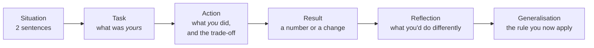

# Googleyness & Leadership

One round of the onsite is behavioural, and it is graded as seriously as the
coding rounds — on two of the four attributes, Leadership and Googleyness,
that the hiring committee reads first when deciding level. You have passed
the hiring assessment, which was a questionnaire about how you work. This
round is a person asking for evidence, and pushing on it.

This chapter has three parts: what the round is grading, the answer shape
that gets credit, and a question bank scoped to the two postings. **Every
model answer is a skeleton**, pointing at your real stories in
[Contentstack](../00-experience/contentstack.md) and
[BestPeers](../00-experience/bestpeers.md), with `FILL IN` where only you
know the detail. Nothing here should be said in an interview until the
blanks are filled with something true.

---

## What the round grades

Google's public interview guidance names the attributes; the L5 signals are
what third-party accounts and the postings themselves consistently describe.

| Attribute | What the interviewer is listening for | L5 signal |
| --- | --- | --- |
| **Leadership** (emergent) | Stepping up when your skills are needed, without a title; setting direction; bringing others along; knowing when to step back | You changed what a *group* did, not just what you did. You influenced people you didn't manage. You mentored and can say what changed in the person |
| **Googleyness** | Comfort with ambiguity; humility and owning mistakes; collaboration; putting the user and the mission first; doing the right thing when it's inconvenient | A real failure with a real change afterwards. A time you were wrong and said so. A decision that cost you something because it was right |
| **Navigating ambiguity** *(both postings name it)* | Working out what to build when nobody told you | You started from a blank page and can describe the first wrong turn |
| **Cross-functional work** *(both postings)* | Partnering with security engineers, PMs, TPMs, remote teams | Concrete mechanics: how the disagreement was resolved, not that it was |
| **Mentoring** *(both postings)* | Growing junior engineers | Named, specific, with an outcome for the other person |

The interviewer will ask for one story, then dig: *what did you personally
do; who else was involved; what would you do differently; what happened
after.* The dig is where the level is decided, and vague answers to the dig
read as inflation even when the story is true — the point
[WEAK-SPOTS](../WEAK-SPOTS.md#4-led-rbac-design-and-implementation-0-to-1--attribution)
makes about attribution.

---

## The shape that gets credit

STAR is the floor. Google interviewers reward two additions.

*The last two boxes are the senior half. A story without them is an anecdote; with them it's judgement.*

- **Boundary.** Say exactly what was yours and what wasn't. "The platform
  served that volume; I owned the auth layer in front of it" is stronger
  than a claim on the whole thing, because it survives the dig.
- **Trade-off.** Name what you gave up. Every real decision cost something.
- **Reflection.** One thing you'd do differently. Not a humblebrag ("I'd
  have done it even faster"); a real one.
- **Generalisation.** The rule you carry now. That's what makes the story
  evidence of judgement rather than luck.

Length: ninety seconds to two minutes for the story, then stop and let them
dig. Have six stories that cover the attributes between them, and know
which story answers which question, because you'll be asked to tell the
same one from different angles.

**Your six.** These exist in the experience chapters; the blanks are what
make them yours.

| Story | Best for | Where |
| --- | --- | --- |
| RBAC from 0 to 1 | Ambiguity, ownership, 0→1, a wrong first design | [Story 1](../00-experience/contentstack.md#story-1--rbac-from-0-to-1-flagship) |
| Auth as a platform, 9 teams | Influence without authority, adoption, cross-team | [Story 4](../00-experience/contentstack.md#story-4--auth-as-a-platform-the-grpc-npm-package) |
| Audit remediation 150 → 10 | Prioritisation, working with security engineers, delivery | [Story 3](../00-experience/contentstack.md#story-3--security-audit-remediation-150--10) |
| 13s → 200ms | Diagnosis, a refactor justified and shipped safely | [Story 5](../00-experience/contentstack.md#story-5--policy-evaluation-and-caching-13s--under-200ms) |
| Owning auth incidents | Pressure, communication, RCA, what changed after | [Story 7](../00-experience/contentstack.md#story-7--owning-auth-incidents) |
| Leading without the title | Emergent leadership, mentoring, disagreement | [BestPeers Story 1](../00-experience/bestpeers.md#story-1--technical-leadership-without-the-title) |

---

## The question bank

Scoped to what the two postings say they want: new-hub culture, alignment
across teams, security judgement, mentoring, autonomy. Each answer is a
skeleton with the story to hang it on, the dig to expect, and what a weak
answer sounds like.

### Q: Tell me about a time you built something from nothing, with no clear requirements.
**Level:** senior · **Tags:** google-leadership, ambiguity, ownership

Model answer

**Story:** [RBAC from 0 to 1](../00-experience/contentstack.md#story-1--rbac-from-0-to-1-flagship).

**Skeleton.** Situation: the product had two fixed roles and enterprise
customers asking for custom permissions; no model, no spec. Task: I owned
designing and shipping the permission model. Action: how I *found* the
requirements — which customers I talked to, which internal teams, what the
first design was and why it didn't survive. Result: the model shipped,
existing customers migrated without breakage, and the numbers that
followed. Reflection: the thing I'd do differently. Generalisation: "when
requirements are missing I go find three concrete users and design for the
hardest one."

The interviewer is listening for the *blank page* part — how you reduced
ambiguity — more than the result.

> **FILL IN:** the first design that didn't survive contact with reality,
> and what killed it. That single detail is what proves you were there.

> **FILL IN:** who you talked to in the first two weeks, and what you
> learned that changed the design.

**The dig:** "Who else was on it?" "What did you personally build versus
review?" "How did you know you were done?" Boundary answers, ready.

**Weak version:** "I designed the RBAC system end to end." No blank page,
no wrong turn, no boundary. Reads as inflation.

**Follow-ups:**

1. Q: What would you do differently if you started it again tomorrow?
   

Answer

   A real one, specific to the design. Candidates: modelling something as
   a role that should have been an attribute; under-estimating migration;
   not instrumenting adoption from day one.

   > **FILL IN:** the actual answer. "Nothing" is a no-hire signal.

   

### Q: Tell me about a time you got several teams to adopt a technical direction without having authority over them.
**Level:** senior · **Tags:** google-leadership, influence, cross-team

Model answer

**Story:** [Auth as a platform, the gRPC npm package](../00-experience/contentstack.md#story-4--auth-as-a-platform-the-grpc-npm-package).

**Skeleton.** Situation: nine teams each handling auth their own way; I had
no authority over any of them. Task: make one implementation the standard.
Action: the *mechanics* of influence — what made adoption easier than
not adopting, who the first adopter was and why, what objection the
hardest team had and what changed their mind, what I gave up to get
agreement. Result: nine teams on one library. Reflection and rule: "I don't
win adoption with a mandate; I win it by making the right thing the path
of least resistance and getting one credible team on first."

**The dig:** "Which team resisted, and why?" "What did you change in
response to their pushback?" "Did anyone not adopt?"

> **FILL IN:** the hardest team, their specific objection, and what
> changed. Without it this is a slogan.

**Weak version:** "I built a package and everyone used it." Adoption
without friction isn't leadership; it's luck, and the interviewer knows it.

**Follow-ups:**

1. Q: How would you do this at Google, where the teams are in three time zones and you're the new hub?
   

Answer

   Same mechanics, more writing. A design doc that's honest about
   trade-offs, circulated before any meeting; one early adopter in the
   partner team's own time zone; adoption metrics visible to everyone;
   and never asking for a decision in a meeting the decision-makers can't
   attend. The postings say "driving technical alignment" — this is the
   answer to what that looks like in practice.

   

### Q: Tell me about a time you pushed back on a decision for security reasons.
**Level:** senior · **Tags:** google-leadership, security, conflict

Model answer

**Story:** [Session governance and 2FA](../00-experience/contentstack.md#story-6--session-governance-and-2fa-hardening)
or the [audit remediation](../00-experience/contentstack.md#story-3--security-audit-remediation-150--10)
— whichever contains a real disagreement.

**Skeleton.** Situation: a product or deadline pressure that conflicted with
a control — a session timeout customers found annoying, a finding
someone wanted to defer. Task: mine to decide, or to argue. Action: how I
made the risk concrete for a non-security audience (the specific attack,
the specific customer impact), what compromise I offered, and where I held
the line. Result: what shipped. Reflection: whether I escalated at the
right time. Rule: "I translate security into the other person's risk
language, and I offer the smallest change that closes the risk."

Both postings want someone who partners with product and security
engineers; the interviewer wants to see you hold a position *and* stay
collaborative.

> **FILL IN:** the actual disagreement — who wanted what, what you
> proposed instead, and the outcome. If the honest answer is that you
> lost the argument, that's a fine story too, told with what you learned.

**Weak version:** "I always insist on security." No trade-off, no
collaboration, and Google specifically doesn't want that.

**Follow-ups:**

1. Q: When is it right to *not* push back?
   

Answer

   When the risk is genuinely low, the mitigation is disproportionate, or
   a compensating control exists — and I've said so in writing so the
   acceptance is a decision, not a drift. Security that blocks everything
   gets routed around; the credibility to win the important argument comes
   from conceding the unimportant ones.

   

### Q: Tell me about someone you mentored. What changed for them?
**Level:** intermediate · **Tags:** google-leadership, mentoring

Model answer

**Story:** [Leading without the title](../00-experience/bestpeers.md#story-1--technical-leadership-without-the-title),
or the mentoring that happened during the platform rollout.

**Skeleton.** A named (or role-described) person, where they started, what
you did — not "I answered questions" but a mechanism: pairing on design,
giving them ownership of a real piece, reviewing for reasoning rather than
correctness — and what they could do afterwards that they couldn't before.
Reflection: something you got wrong as a mentor. Rule: "I give people
something that's theirs, early, and review the thinking, not the code."

Both postings say "mentor junior engineers"; the hub framing means they'll
also ask how you'd do it remotely — the answer is in
[the two roles](02-the-two-roles.md#q-what-would-you-do-in-your-first-90-days-in-a-brand-new-hub).

> **FILL IN:** the person, the starting point, the mechanism, and the
> observable change. This question is unanswerable without a real example.

**Weak version:** "I mentored the junior developers on the team." Plural,
no mechanism, no outcome.

**Follow-ups:**

1. Q: What did you get wrong as a mentor?
   

Answer

   Common honest answers: doing it for them when under deadline;
   feedback too soft too long; assuming they'd ask. Pick the true one.

   > **FILL IN:** yours.

   

### Q: Tell me about a failure. What changed because of it?
**Level:** senior · **Tags:** google-leadership, googleyness, failure

Model answer

**Story:** an incident from [owning auth incidents](../00-experience/contentstack.md#story-7--owning-auth-incidents),
or the first RBAC design that didn't survive.

**Skeleton.** A real failure with your name on it — not a team failure, not
a "failure" that's secretly a success. What happened, what you did in the
moment, and — the part that's graded — what you changed afterwards that
was structural: a check that now exists, a process that now runs, a habit
you now have. Rule: "I treat every incident I caused as a missing control,
and I build the control."

Googleyness is largely this question. The interviewer is checking for
ownership without defensiveness.

> **FILL IN:** the failure. [Hard questions](../00-experience/hard-questions.md#tell-me-about-a-time-you-failed)
> has the framing; this needs the fact.

**Weak version:** "I worked too hard once." Or a failure that belonged to
someone else.

**Follow-ups:**

1. Q: How did you communicate it at the time?
   

Answer

   Early, to the people affected, with what I knew and didn't yet know,
   and a time for the next update. The incident-communication shape from
   Story 7. The dig here is whether I told people before I was sure — the
   right answer is yes.

   

### Q: Tell me about a time you disagreed with your manager or tech lead.
**Level:** intermediate · **Tags:** google-leadership, conflict, communication

Model answer

**Story:** the monolith split at [BestPeers](../00-experience/bestpeers.md#story-2--splitting-the-monolith-into-3-services)
or a decision during the platform work.

**Skeleton.** The disagreement stated fairly — their position had merit,
say what it was. How you made your case: data, a prototype, a written
doc. How it resolved: you won, you lost, or you found a third option. What
you did after losing, if you lost — committed fully, which is the Googleyness
signal. Rule: "disagree in writing with evidence, decide together, then
commit without relitigating."

> **FILL IN:** a real one. Interviewers can tell a constructed disagreement
> from a lived one by the dig: "what exactly did they say?"

**Weak version:** a disagreement where you were obviously right and they
were obviously wrong. Real ones aren't like that.

**Follow-ups:**

1. Q: Have you ever been wrong in one of these?
   

Answer

   Yes, and the story where I was is the stronger one to tell. Say what
   convinced me, and that I said so.

   > **FILL IN:** the time you were wrong.

   

### Q: Describe a production incident you handled. Walk me through it.
**Level:** senior · **Tags:** google-leadership, incidents, pressure

Model answer

**Story:** [owning auth incidents](../00-experience/contentstack.md#story-7--owning-auth-incidents),
the worst one.

**Skeleton.** The timeline: detection (how did you find out — alert or
customer?), triage (what you looked at first and why), mitigation (what
stopped the bleeding, and the trade-off — did you fail open?),
communication (who you told, when), resolution, and the RCA with the
control that came out of it. The interviewer is listening for calm
sequencing and for the *after*. Rule: "mitigate before diagnose; communicate
before certain; every incident leaves a control behind."

> **FILL IN:** the incident's actual timeline and the control it produced.
> The chapter has the shape; this needs the times and the numbers.

**Weak version:** the story ends when the incident ends. No RCA, no change.

**Follow-ups:**

1. Q: What would a Google-scale version of that incident have needed?
   

Answer

   Automated detection before customers noticed; a rollback that's a
   button, not a procedure; a decision cache so the auth path degrades
   rather than fails; and an incident channel with a single commander.
   That's the [observability and operations](30-observability-slos-and-operations.md)
   chapter, said out loud.

   

### Q: Tell me about a time you had to prioritise between conflicting asks from different stakeholders.
**Level:** intermediate · **Tags:** google-leadership, prioritisation

Model answer

**Story:** [audit remediation 150 → 10](../00-experience/contentstack.md#story-3--security-audit-remediation-150--10)
— the prioritisation of findings against product deadlines.

**Skeleton.** Who wanted what (security wanted everything fixed; product
wanted the roadmap; customers wanted specific findings closed). The
framework you used to rank — risk × exposure × effort, or whatever it
actually was — and how you made it *visible* so the ranking wasn't your
opinion. What you deferred and how you made that a recorded decision.
Result. Rule: "I make the prioritisation legible so the disagreement is
about the criteria, not about me."

> **FILL IN:** the actual ranking criteria and one finding you deliberately
> deferred — and whether that ever bit you.

**Weak version:** "I did the most important ones first." Important by
what measure, decided by whom?

**Follow-ups:**

1. Q: How did you handle the stakeholder whose ask you deprioritised?
   

Answer

   Told them directly, with the criteria and where their item sat, and
   what would move it up. People accept "no, and here's why" far better
   than silence, and the criteria let them argue the ranking rather than
   the person.

   

### Q: Tell me about a time you gave someone difficult feedback.
**Level:** intermediate · **Tags:** google-leadership, feedback

Model answer

**Skeleton.** The situation — a code-quality pattern, a missed commitment,
a design that was going to fail. What you said, how you said it (privately,
specifically, about the work), and what you offered alongside it. What
changed. Reflection: whether you waited too long. Rule: "specific,
private, early, and paired with help."

For a senior role in a new hub where you'll set the review culture, this
one matters more than it looks.

> **FILL IN:** a real instance. If none comes to mind, that itself is
> worth reflecting on before the round.

**Weak version:** feedback that was really praise, or feedback delivered
in a review comment with no conversation.

**Follow-ups:**

1. Q: What if they didn't take it well?
   

Answer

   Listen first — the reaction usually contains information about
   something I didn't see. Then restate the specific behaviour and the
   impact, not the judgement, and agree one concrete next step. And follow
   up, because feedback without follow-up is just an unpleasant
   conversation.

   

### Q: Tell me about something you had to learn very quickly.
**Level:** foundation · **Tags:** google-leadership, learning, gca

Model answer

**Story:** SAML for the enterprise SSO work
([Story 2](../00-experience/contentstack.md#story-2--unifying-oauth-sso-and-scim)),
or OPA/Rego for policy evaluation ([Story 5](../00-experience/contentstack.md#story-5--policy-evaluation-and-caching-13s--under-200ms)),
or the AI-tooling work ([Story 8](../00-experience/contentstack.md#story-8--ai-adoption-and-tooling)).

**Skeleton.** What you didn't know, why it was suddenly needed, *how* you
learned it — the spec, a reference implementation, a person — and how you
knew you'd learned enough. What you built with it. Rule: "I learn from the
primary source and a working example, and I ship something small
immediately to find out what I misunderstood."

This is General Cognitive Ability wearing a behavioural costume; the
interviewer is listening for the method.

> **FILL IN:** which one, and the concrete first thing you built with it.

**Follow-ups:**

1. Q: What did you get wrong at first?
   

Answer

   There's always something. For SAML, common honest answers are clock
   skew, signature scope, or IdP-initiated flows; for Rego, the evaluation
   model. Say yours.

   > **FILL IN:** the misunderstanding.

   

### Q: Why Google, and why this team?
**Level:** intermediate · **Tags:** google-leadership, motivation

Model answer

Answered in [the two roles](02-the-two-roles.md#q-why-this-team-and-why-google-security-rather-than-a-product-team).
The behavioural interviewer asks it too, and is listening for whether the
answer is about the *work* — the leverage of class-level controls, the 0→1
in a new hub — rather than the brand.

Keep it under a minute. Name one specific thing about the team's public
work. Then stop.

> **FILL IN:** the specific thing.

**Follow-ups:**

1. Q: What would make you leave in a year?
   

Answer

   Honest and short: if the role turned out to be maintaining rather than
   building, or if the hub didn't get the ownership the posting describes.
   Framed as what I'm looking for, not as a threat.

   

### Q: How do you handle ambiguity day to day — not a project, just a normal week?
**Level:** intermediate · **Tags:** google-leadership, ambiguity, googleyness

Model answer

**Skeleton.** Not a story so much as a method, illustrated once. When the
ask is unclear: write down what I think it means and send it, because a
wrong written interpretation gets corrected in an hour and a wrong silent
one gets corrected in a month. Find the person who'll consume the result
and ask them what "done" looks like. Ship the smallest thing that tests the
interpretation. And be explicit about what I decided on my own so people
can object.

Then one example — a week in the platform rollout or the audit where the
requirement was a sentence and the work was a month.

> **FILL IN:** the example.

**Weak version:** "I'm comfortable with ambiguity." That's a claim; the
question wants a method.

**Follow-ups:**

1. Q: When do you escalate instead of deciding?
   

Answer

   When the decision is hard to reverse, when it commits other teams, or
   when I'd need information only someone else has. Everything else I
   decide and announce. The failure mode at senior level is escalating too
   much, not too little.

   

---

## Before the round

- Fill every `FILL IN` above. Then run `/mock-interview googleyness` — it
  will dig where the blanks were.
- Practise the six stories out loud, timed, until each is under two minutes
  with the boundary, trade-off, reflection and rule intact.
- Re-read [hard questions](../00-experience/hard-questions.md) for the
  "why did you leave" and "tell me about yourself" openers — the G&L round
  usually starts with one.
- Prepare two questions for the interviewer from
  [the two roles](02-the-two-roles.md#questions-to-ask-each-interviewer).

---

## Glossary

- **Emergent leadership** — Google's term: leading when your skills are needed, without a title, and stepping back when they aren't.
- **Googleyness** — the attribute covering ambiguity, humility, collaboration and doing the right thing.
- **STAR** — Situation, Task, Action, Result; the floor for a behavioural answer.
- **Reflection / generalisation** — the two additions that turn a story into evidence of judgement.
- **Boundary** — the explicit statement of what was yours versus the team's; what survives the dig.
- **The dig** — the follow-ups that test whether the story is real: who else, what did you do, what would you change.
