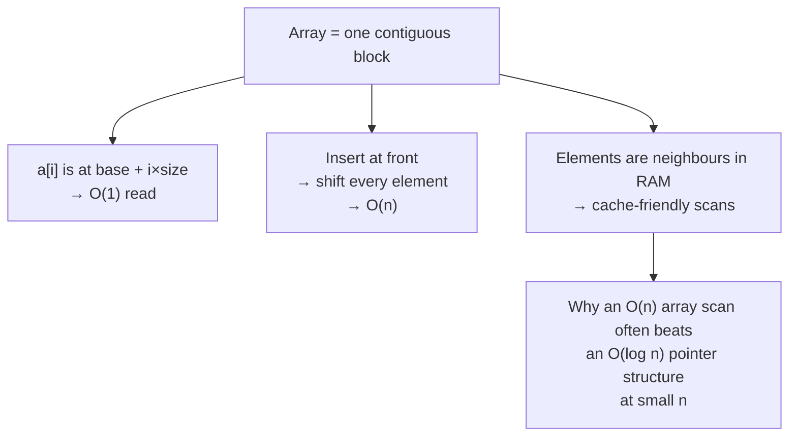

# Arrays — the structure everything else is built on

Most interview problems are array problems, including many that look like
something else. A string is an array of characters, a heap is an array with
index arithmetic, a matrix is an array of arrays, and a graph is usually an
array of adjacency lists. Get arrays genuinely solid and half the field comes
with it.

*In the interview: array problems arrive as the warm-up that is not a warm-up — two pointers or a prefix sum gets you to O(n), and the follow-up is almost always "now do it in O(1) space" or "now the values can be negative".*

[Chapter 02](05-choosing-the-approach.md) tells you *which* technique applies.
This chapter is the structure itself — what it costs, the moves that work on it,
and the bugs that cost people the round.

---

## The costs

Everything you decide about an array follows from this table. Know it cold.

| Operation | Cost | Why |
| --- | --- | --- |
| Read or write `a[i]` | **O(1)** | The address is `base + i × size`. One multiplication |
| Append (`push`) | **O(1)** amortised | Occasionally doubles capacity and copies, but averaged out it's constant |
| Remove from the end (`pop`) | **O(1)** | Nothing moves |
| Insert or delete at the **front** or middle | **O(n)** | Everything after it shifts |
| Search an unsorted array | **O(n)** | You must look at everything |
| Search a **sorted** array | **O(log n)** | Binary search |
| Sort | **O(n log n)** | Comparison sorting's lower bound |

**The one that catches people out is `shift()`/`unshift()` — they are O(n).**
Using `array.shift()` as a queue in a BFS makes it O(n²) rather than O(n). In a
timed round that's usually accepted, but you should *say* you know, and know
that the right answer is an index pointer or a ring-buffer deque.

**The core trade-off,** and the sentence to have ready: an array gives you O(1)
random access and pays for it with O(n) insertion in the middle. A linked list
inverts exactly that. Everything else about choosing between them is detail.

---

## How it actually works


*Contiguity buys constant-time indexing and fast scanning, and charges for it on every insertion that isn't at the end.*

### Who's who

| Term | What it means here |
| --- | --- |
| **Index** | Position, zero-based. `a[0]` is the first element, `a[n-1]` the last |
| **Length** | `n`. The number of elements, always one more than the last index |
| **Contiguous** | Stored as one unbroken block of memory |
| **Subarray** | A **contiguous** slice. `[2,3]` is a subarray of `[1,2,3,4]` |
| **Subsequence** | Elements in order but **not necessarily adjacent**. `[1,3]` is a subsequence, not a subarray |
| **Subset** | Any selection, order irrelevant |
| **In place** | Modifying the input rather than allocating a new array — O(1) extra space |

**Subarray vs subsequence is a real trap.** Contiguity changes the entire
approach: subarray problems are sliding windows and prefix sums, subsequence
problems are almost always DP. Misreading one for the other sends you down a
technique that cannot work. If the problem doesn't say, ask.

### Why contiguity matters beyond the complexity

Elements sit next to each other in memory, so scanning one pulls its neighbours
into cache. This is why a linear scan of 1,000 array elements often beats a
"better" pointer-chasing structure — the constant factor is enormous. You won't
be graded on it, but it's a good thing to know when someone asks why arrays are
the default.

---

## The techniques, in the order you should learn them

### 1. One pass with a running value

The simplest and most underrated. Track a running max, min, sum or count while
scanning once. Many problems that look like they need sorting or nested loops
are a single pass and one variable.

```js
// Best time to buy and sell stock: one pass, two variables
let minSoFar = Infinity, best = 0;
for (const price of prices) {
  best = Math.max(best, price - minSoFar);  // sell today, having bought at the min
  minSoFar = Math.min(minSoFar, price);     // update AFTER — can't sell before you buy
}
```

The comment on that last line is the entire bug people ship: update the running
minimum *after* computing the profit, or you allow buying and selling on the
same day.

### 2. Hash map to kill the inner loop

If you're writing `for i { for j { ... } }` to find something, a `Map` almost
certainly removes the inner loop. O(n²) → O(n), paying O(n) space.

### 3. Prefix sums

Range questions in O(1) after an O(n) build, and — combined with a map — the
count of subarrays hitting a target. Full treatment in
[chapter 05](05-choosing-the-approach.md#2-prefix-sum--answer-range-questions-in-o1).

### 4. Two pointers

Sorted input, or in-place work with O(1) space. Opposite ends for pairs;
same-direction read/write pointers for filtering in place.

```js
// Move all zeroes to the end, in place, preserving order
let write = 0;
for (let read = 0; read < a.length; read++) {
  if (a[read] !== 0) [a[write++], a[read]] = [a[read], a[write]];
}
```

The read/write pointer pair is the workhorse of in-place array work — removing
duplicates, filtering, partitioning around a pivot all use it.

### 5. Sliding window

Contiguous runs, when the values are non-negative so the metric moves
monotonically as the window grows and shrinks.

### 6. Sort first

O(n log n) that you'll often get back many times over. Sorting makes duplicates
adjacent, makes two pointers legal, and makes intervals sweepable.

### 7. Cyclic sort / index-as-hash

Values in a known range `1..n` and an O(1)-space requirement. The array becomes
its own hash map.

---

## The bugs that actually cost you the round

| Bug | The fix |
| --- | --- |
| **Off-by-one on the last index** | The last element is `a[n-1]`. Loops that must reach it are `i < n`, not `i <= n` |
| **Mutating while iterating** | Deleting from an array you're looping over skips elements. Build a new array, or iterate backwards |
| **`sort()` sorts as strings** | `[10, 9, 1].sort()` gives `[1, 10, 9]`. **Always** pass a comparator: `.sort((a, b) => a - b)` |
| **Empty input** | `a[0]` on `[]` is `undefined`, and `Math.max(...[])` is `-Infinity`. Handle `n === 0` explicitly |
| **Single element** | Two-pointer loops with `l < r` do nothing when `n === 1`. Check whether that's correct for your problem |
| **All duplicates / all negatives** | Kadane's initialised to `0` returns `0` on an all-negative array. Initialise to `a[0]` |
| **Integer overflow** | Rare in JS (doubles to 2⁵³), but say so if asked — in Java or C++ `(l + r) / 2` overflows and `l + (r - l) / 2` doesn't |
| **`shift()` in a hot loop** | O(n) each. Use an index pointer instead of removing from the front |

**The JS `sort()` default is the single most common silent bug in these rounds.**
It stringifies. Say the comparator out loud as you write it.

---

## Practice ladder

In order. Each rung teaches something the next assumes.

| # | Problem | What it teaches |
| --- | --- | --- |
| 1 | Two sum | Hash map removes the inner loop |
| 2 | Best time to buy and sell stock | One pass with a running value |
| 3 | Move zeroes / remove duplicates in place | Read/write two pointers |
| 4 | Pairs with a given sum, sorted input | Opposite-end two pointers |
| 5 | Max sum contiguous subarray (Kadane's) | One-variable DP; the all-negative edge case |
| 6 | Equilibrium index | Prefix sums |
| 7 | Longest subarray with zero sum | Prefix sum **+ hash map** |
| 8 | Subarray sum equals k *(count)* | The same, for counting — seed the map with `{0: 1}` |
| 9 | Product of array except self | Forward + backward passes |
| 10 | Rain water trapped | Forward + backward passes, harder combine |
| 11 | First missing positive | Cyclic sort, O(1) space |
| 12 | Merge intervals | Sort first, then sweep |

**Exit test:** given an unseen array problem, you can say within a minute
whether it wants a hash map, a prefix sum, a sliding window, or two pointers —
*and* say why. Problems 6 through 10 are the ones that make that instinct real;
if they're shaky, redo them rather than pressing on.

---

## Data structures

A DSA round is testing that you reach for the right built-in. For arrays in
JS/TS:

| Need | Use | Note |
| --- | --- | --- |
| The array itself | `Array` / `[]` | `new Array(n).fill(0)` to preallocate. `Array.from({length: n}, (_, i) => i)` when you need indices |
| Seen-before checks | `Set` | O(1) `has`. Prefer over `includes()`, which is O(n) and turns your loop quadratic |
| Counting occurrences | `Map` | `m.set(k, (m.get(k) ?? 0) + 1)`. Use `Map` over a plain object — no prototype keys, and numeric keys stay numeric |
| Prefix sums | `Array` of length `n+1` | The leading `0` is what makes ranges starting at index 0 work without a special case |
| A queue (for BFS) | `Array` + an index pointer | Never `shift()`. `let head = 0; while (head < q.length) { const x = q[head++]; }` |
| A stack | `Array` + `push`/`pop`/`at(-1)` | Both ends are O(1) — this is the one place arrays are perfect |
| Fixed-size numeric work | `Int32Array` etc. | Rarely needed in an interview; mention it only if asked about memory |

**Pseudocode — the in-place read/write filter, since it underlies so much**

```js
// Remove all instances of `val`, in place, returning the new length.
// The pattern: `write` marks where the next kept element goes; `read` scans.
// Everything before `write` is the answer; everything after is garbage.
function removeElement(a, val) {
  let write = 0;
  for (let read = 0; read < a.length; read++) {
    if (a[read] !== val) {
      a[write] = a[read];   // keep it, compacting toward the front
      write++;
    }
  }
  return write;             // a[0..write) is the result; the tail is untouched junk
}
```

This is O(n) time and O(1) space, and the same skeleton solves remove-duplicates
(compare against `a[write-1]` instead), move-zeroes (swap rather than overwrite,
to preserve the zeroes), and partition-around-a-pivot. Learn the skeleton, not
the three problems.

---

## Worked problems

Four from the ladder, solved the way you'd solve them in the round: say the
brute force, name the insight, write it, test it, state the cost.

### Q: Subarray sum equals k — count the contiguous subarrays whose sum is exactly k
**Level:** intermediate · **Tags:** coding, prefix-sum, hash-map, arrays

<details><summary>Model answer</summary>

**Problem.** Given an integer array `nums` and an integer `k`, return the number
of contiguous subarrays whose elements sum to `k`. `nums = [1, 2, 1, 2, 1], k = 3`
→ `4` (`[1,2]`, `[2,1]`, `[1,2]`, `[2,1]`).

**Clarify first.** Can values be negative or zero? (Yes — that rules out a
sliding window.) How large is `n`? (Up to 10⁵ — so O(n²) will not pass.) Do we
return the count or the subarrays themselves? (The count.) Proceed assuming
negatives are allowed and only the count is needed.

**Brute force.** For every start index, extend an end index and accumulate the
sum, counting each time it hits `k`. O(n²) time, O(1) space. Correct, and worth
saying so you can move past it.

**The insight.** Let `P[i]` be the sum of the first `i` elements. A subarray
`(j, i]` sums to `P[i] − P[j]`. So while scanning, the number of valid subarrays
ending at `i` is the number of earlier prefix sums equal to `P[i] − k`. A hash
map from prefix-sum value to how many times it has occurred answers that in
O(1), and seeding it with `{0: 1}` handles subarrays that start at index 0.

**Algorithm.**
1. `seen = Map{0 → 1}`, `prefix = 0`, `count = 0`.
2. For each `x` in `nums`: `prefix += x`; `count += seen.get(prefix − k) ?? 0`;
   increment `seen[prefix]`.
3. Return `count`.

```js
function subarraySum(nums, k) {
  const seen = new Map([[0, 1]]);       // prefix 0 occurs once, before any element
  let prefix = 0, count = 0;
  for (const x of nums) {
    prefix += x;
    count += seen.get(prefix - k) ?? 0; // look up BEFORE recording this prefix
    seen.set(prefix, (seen.get(prefix) ?? 0) + 1);
  }
  return count;
}
```

The lookup happens before the insert on purpose: when `k === 0`, inserting
first would let a subarray of length zero count itself.

**Complexity.** O(n) time — one pass with O(1) map operations. O(n) space for
the map in the worst case (all prefix sums distinct).

**Test it.**
- `[1,2,1,2,1], k=3` → 4.
- `[1,-1,0], k=0` → 3 (`[1,-1]`, `[0]`, `[1,-1,0]`). Negatives and the
  lookup-before-insert order both matter here.
- `[3], k=3` → 1 — the seed `{0:1}` is what makes this work.
- `[], k=5` → 0.

**What the interviewer is checking.** That you say "negatives break the sliding
window" unprompted, and that you can explain why the map is seeded with `0 → 1`
rather than reciting it.

</details>

**Follow-ups:**

1. Q: What changes if all numbers are positive?
   <details><summary>Answer</summary>

   Then the running sum is monotonic in the window size, so a two-pointer
   sliding window works in O(1) space: grow the right edge while the sum is
   below `k`, shrink from the left while it is above. The map solution still
   works; the window is just cheaper. Saying which constraint made each
   approach legal is the point of the follow-up.

   </details>

2. Q: Return the *longest* subarray with sum k instead of the count.
   <details><summary>Answer</summary>

   Same prefix-sum idea, but the map now stores the **first** index at which
   each prefix sum occurred, and you never overwrite it. At index `i`, if
   `prefix − k` is in the map, the candidate length is `i − map.get(prefix − k)`.
   Keeping the earliest index maximises that difference.

   ```js
   const first = new Map([[0, -1]]);
   let prefix = 0, best = 0;
   for (let i = 0; i < nums.length; i++) {
     prefix += nums[i];
     if (first.has(prefix - k)) best = Math.max(best, i - first.get(prefix - k));
     if (!first.has(prefix)) first.set(prefix, i);
   }
   ```

   </details>

3. Q: The array does not fit in memory — it arrives as a stream. What survives?
   <details><summary>Answer</summary>

   The algorithm is already one pass and never looks back at the array, so it
   is naturally streaming. The map is the only state, and it grows with the
   number of distinct prefix sums; if that is a concern you would need to bound
   it, which changes the problem (approximate counting, or a bounded window).
   The honest answer is that the count is exact only if the map fits.

   </details>

### Q: Trapping rain water — how much water sits between the bars after it rains
**Level:** senior · **Tags:** coding, two-pointers, prefix-max, arrays

<details><summary>Model answer</summary>

**Problem.** `height[i]` is the height of bar `i`, width 1. Return the total
water trapped. `[0,1,0,2,1,0,1,3,2,1,2,1]` → `6`.

**Clarify first.** Are heights non-negative integers? (Yes.) Can `n` be 0 or 1?
(Yes — answer 0.) Is O(n) extra space acceptable, or is O(1) wanted? (Start
with O(n), offer O(1).)

**Brute force.** For each bar, scan left for the tallest bar and right for the
tallest bar; water above bar `i` is `min(maxLeft, maxRight) − height[i]`,
clamped at 0. O(n²) time. The formula is right; the scanning is the waste.

**The insight.** The water level over bar `i` depends only on the tallest bar
to its left and the tallest to its right. Precompute both in two passes and the
per-bar answer is O(1). Then notice you only need whichever side is *smaller*
— so two pointers walking inward, each carrying its own running max, can
decide the water at the shorter side without knowing the far side exactly.

**Algorithm.** (Two-pointer version.)
1. `l = 0`, `r = n − 1`, `maxL = maxR = 0`, `water = 0`.
2. While `l < r`: if `height[l] < height[r]`, the left side is the bottleneck:
   `maxL = max(maxL, height[l])`, `water += maxL − height[l]`, `l++`.
   Otherwise do the mirror on the right.
3. Return `water`.

```js
function trap(height) {
  let l = 0, r = height.length - 1;
  let maxL = 0, maxR = 0, water = 0;
  while (l < r) {
    if (height[l] < height[r]) {
      maxL = Math.max(maxL, height[l]);
      water += maxL - height[l];   // safe: some bar >= maxL exists on the right
      l++;
    } else {
      maxR = Math.max(maxR, height[r]);
      water += maxR - height[r];
      r--;
    }
  }
  return water;
}
```

Why the shorter side is safe to settle: if `height[l] < height[r]`, then the
right side already has a bar at least as tall as `height[r] > height[l]`, so
the water at `l` is bounded by `maxL`, not by anything on the right.

**Complexity.** O(n) time, O(1) space. The two-array version is O(n) space.

**Test it.**
- `[0,1,0,2,1,0,1,3,2,1,2,1]` → 6.
- `[4,2,0,3,2,5]` → 9.
- `[3,2,1]` (monotonic) → 0 — nothing can be trapped.
- `[]` and `[5]` → 0.

**What the interviewer is checking.** That you give the O(n)-space two-pass
version confidently first, and can then *argue* why the two-pointer version is
correct rather than just produce it.

</details>

**Follow-ups:**

1. Q: Extend to a 2-D height map.
   <details><summary>Answer</summary>

   Two pointers do not generalise, but the "water is bounded by the lowest
   boundary" idea does. Push every border cell into a min-heap keyed by
   height. Repeatedly pop the lowest boundary, look at its unvisited
   neighbours: any neighbour lower than the current boundary level traps
   `level − height` water, then push the neighbour with height
   `max(level, height)`. This is a BFS driven by a heap — O(mn log(mn)).

   </details>

2. Q: Why can't a single pass with one running max work?
   <details><summary>Answer</summary>

   Because the water over a bar depends on the future — the tallest bar to its
   right. One left-to-right pass knows `maxL` but not `maxR`, so it cannot
   commit an answer. The two-pointer version gets away with it only because
   at each step it commits the side whose bound is already known to be the
   tighter one.

   </details>

### Q: First missing positive — smallest positive integer absent from the array, in O(n) time and O(1) space
**Level:** senior · **Tags:** coding, cyclic-sort, index-as-hash, arrays

<details><summary>Model answer</summary>

**Problem.** `nums = [3, 4, -1, 1]` → `2`. `[1, 2, 0]` → `3`. `[7, 8, 9]` → `1`.

**Clarify first.** May we modify the input? (Yes — O(1) space is only
achievable if so.) Range of values? (Any 32-bit integer.) Duplicates? (Allowed.)

**Brute force.** Put everything in a `Set`, then check 1, 2, 3, … until one is
missing. O(n) time, O(n) space. Or sort and scan — O(n log n), O(1). Both are
fine first answers; the interviewer wants O(n)/O(1).

**The insight.** The answer is always in `1..n+1`: if all of `1..n` are present
the answer is `n+1`, otherwise it is the first gap. So values outside `1..n`
are irrelevant, and the array has exactly enough slots to use index `v − 1` as
the home of value `v`. Swap each value into its home; then the first index `i`
whose occupant is not `i + 1` names the answer.

**Algorithm.**
1. For each `i`, while `nums[i]` is in `1..n` and not already at its home
   `nums[nums[i] − 1]`, swap it there.
2. Scan: the first `i` with `nums[i] !== i + 1` gives `i + 1`.
3. If none, return `n + 1`.

```js
function firstMissingPositive(nums) {
  const n = nums.length;
  for (let i = 0; i < n; i++) {
    while (nums[i] >= 1 && nums[i] <= n && nums[nums[i] - 1] !== nums[i]) {
      const home = nums[i] - 1;
      [nums[i], nums[home]] = [nums[home], nums[i]];   // put nums[i] where it belongs
    }
  }
  for (let i = 0; i < n; i++) if (nums[i] !== i + 1) return i + 1;
  return n + 1;
}
```

The `nums[nums[i] − 1] !== nums[i]` guard is what makes duplicates terminate:
without it two equal values swap with each other forever.

**Complexity.** O(n) time — each swap moves one value to its final home, so
there are at most `n` swaps in total across all iterations. O(1) extra space.

**Test it.**
- `[3,4,-1,1]` → after placing: `[1,-1,3,4]` → index 1 holds −1 → `2`.
- `[1,2,0]` → `3`.
- `[7,8,9]` → nothing placed → `1`.
- `[1,1]` → the duplicate guard stops the loop → `2`.

**What the interviewer is checking.** The amortised argument — why a nested
`while` inside a `for` is still O(n). Say it before being asked.

</details>

**Follow-ups:**

1. Q: What if you may not modify the input?
   <details><summary>Answer</summary>

   Then O(1) extra space is not achievable in general; use the `Set` version
   (O(n) space) or, if the values are bounded and you are allowed a bitset,
   an `n`-bit presence array — still O(n) bits, but a much smaller constant.

   </details>

2. Q: Find *all* missing numbers in `1..n` instead.
   <details><summary>Answer</summary>

   Identical placement pass, then collect every `i + 1` where
   `nums[i] !== i + 1`. Or, if the input must stay readable, mark presence by
   negating `nums[|v| − 1]` for each value `v` in range — the sign is the bit.

   </details>

### Q: Merge intervals — collapse overlapping ranges into disjoint ones
**Level:** intermediate · **Tags:** coding, sort-first, sweep, intervals

<details><summary>Model answer</summary>

**Problem.** Given `intervals = [[1,3],[2,6],[8,10],[15,18]]`, return
`[[1,6],[8,10],[15,18]]`.

**Clarify first.** Are the intervals closed — does `[1,4]` overlap `[4,5]`?
(Yes, touching counts as overlap.) Is the input sorted? (No.) Can `start > end`
appear? (No.) Output order? (By start.)

**Brute force.** Repeatedly find any two overlapping intervals and merge them
until none overlap. O(n²) or worse and fiddly. Mention it only to dismiss it.

**The insight.** Sort by start. Once sorted, an interval can only overlap the
*last* merged interval, because everything before that ended earlier. So one
sweep with a single "current" interval does it.

**Algorithm.**
1. Sort by start.
2. `out = [first]`. For each next interval: if its start ≤ end of `out`'s last,
   extend that last's end to `max(end, its end)`; otherwise push it.
3. Return `out`.

```js
function merge(intervals) {
  if (intervals.length === 0) return [];
  intervals.sort((a, b) => a[0] - b[0]);       // comparator, or it sorts as strings
  const out = [intervals[0].slice()];          // copy so we don't mutate the input
  for (let i = 1; i < intervals.length; i++) {
    const [s, e] = intervals[i];
    const last = out[out.length - 1];
    if (s <= last[1]) last[1] = Math.max(last[1], e);  // overlap or touch → extend
    else out.push([s, e]);
  }
  return out;
}
```

`Math.max` on the end is the line people drop: `[1,10],[2,3]` must stay
`[1,10]`, not shrink to `[1,3]`.

**Complexity.** O(n log n) for the sort, then O(n) sweep. O(n) for the output
(O(log n) sort stack aside).

**Test it.**
- `[[1,3],[2,6],[8,10],[15,18]]` → `[[1,6],[8,10],[15,18]]`.
- `[[1,4],[4,5]]` → `[[1,5]]` — touching.
- `[[1,10],[2,3]]` → `[[1,10]]` — the contained case.
- `[]` → `[]`; `[[1,2]]` → `[[1,2]]`.

**What the interviewer is checking.** The comparator on `sort`, the containment
case, and whether you handle "touching" the way you said you would when you
clarified.

</details>

**Follow-ups:**

1. Q: Insert a new interval into an already-merged sorted list.
   <details><summary>Answer</summary>

   Three phases, no sort needed: copy intervals that end before the new one
   starts; merge everything that overlaps the new one into it (`start = min`,
   `end = max`); copy the rest. O(n).

   </details>

2. Q: Given meeting intervals, what is the minimum number of rooms?
   <details><summary>Answer</summary>

   Not a merge — a sweep. Sort starts and ends separately; walk the starts,
   and each time a start comes before the earliest unfinished end, you need a
   new room; when an end passes, release one. The peak concurrency is the
   answer. Equivalent: a min-heap of end times. O(n log n).

   </details>

3. Q: Intervals arrive as a stream and you must answer "total covered length" at any time.
   <details><summary>Answer</summary>

   Keep the merged list in a balanced ordered structure keyed by start (in JS,
   a sorted array with binary search is the pragmatic version). Each insert is
   the "insert interval" follow-up applied to the neighbours, and you maintain
   a running covered length as you merge. Worst case an insert can swallow
   many intervals, but amortised each interval is removed at most once.

   </details>

---


## Problem bank — every array problem type

The worked problems above are the hard end. This bank is the full sweep: every
array problem type from the Scaler DSA track (intro arrays, prefix sums, carry
forward, subarrays, contribution technique, sliding window, hashing on arrays,
sorting, and the interview-problem set), grouped by the technique that solves
it. Each one has the brute force, the insight, the algorithm and TypeScript.

String problems live in [chapter 07](07-strings-and-hashing.md#problem-bank-every-string-problem-type),
2-D arrays in [chapter 13](13-matrices-and-grids.md#problem-bank-2-d-array-problems),
and subsequence/subset enumeration in [chapter 14](14-recursion-and-backtracking.md#problem-bank-recursion-fundamentals).

| Group | Problems |
| --- | --- |
| Basics and in-place | count elements with a greater element, pair with sum k, reverse, reverse a range, rotate by k |
| Prefix sums | range-sum queries, equilibrium index, even-count queries, even-indexed-sum queries, special index |
| Carry forward | leaders in an array |
| Subarrays and contribution | print a subarray, every subarray sum, sum of all subarray sums, max subarray sum (Kadane), sum of all subsequence sums |
| Sliding window | max sum of a size-k window, minimum swaps to group elements ≤ B |
| Hashing on arrays | frequency queries, first repeating / non-repeating, distinct count, distinct in every window, zero-sum subarray, equal 0s and 1s |
| Sorting | elements-removal min cost, noble integers, sort by factor count |
| Interview set | majority element, max consecutive 1s with one replace / one swap, increasing triplets |

---

### Basics and in-place

The warm-ups. Each one has an O(n²) "check everything" answer and an O(n)
answer that comes from **one observation** — say the observation out loud
before writing code.

### Q: Count the elements that have at least one element strictly greater than them
**Level:** foundation · **Tags:** coding, arrays, observation, scaler

<details><summary>Model answer</summary>

**Problem.** `[3, 1, 2, 6, 8, 4, 8, 5]` → `6`. Every element except the two 8s
has something bigger somewhere in the array.

**Brute force.** For each element scan the whole array for anything bigger.
O(n²) time, O(1) space.

**The insight.** Only the **maximum** can fail — every non-max element has the
max above it, and every copy of the max has nothing above it. So the answer is
`n − (count of the maximum)`.

**Algorithm.**
1. One pass to find `max`.
2. One pass to count how many equal `max`.
3. Return `n − countMax`.

```ts
function countHavingGreater(a: number[]): number {
  let max = -Infinity, countMax = 0;
  for (const x of a) {
    if (x > max) { max = x; countMax = 1; }   // new max resets the count
    else if (x === max) countMax++;
  }
  return a.length - countMax;
}
```

**Complexity.** O(n) time (a single pass here), O(1) space.

**Test it.** `[5,5,5]` → 0 (all are the max). `[1]` → 0. `[2,1]` → 1.

</details>

**Follow-ups:**
1. Q: Count elements that have at least **two** elements greater than them.
   <details><summary>Answer</summary>

   Track the largest and second-largest *distinct* values' counts. An element
   fails if it is the max, or if it is the second max and the max occurs only
   once. Answer = `n − countMax − (countMax === 1 ? countSecond : 0)`. Still
   O(n), O(1) space.

   </details>

### Q: Is there a pair (i ≠ j) with a[i] + a[j] = k?
**Level:** foundation · **Tags:** coding, arrays, hash-set, two-pointers, scaler

<details><summary>Model answer</summary>

**Problem.** `[3, -2, 1, 4, 3, 6, 8], k = 10` → `true` (4 + 6). `k = 6` with
`[3, 2, 5]` → `false`: 3 + 3 would need index 0 twice.

**Brute force.** Every pair `i < j`. O(n²) time, O(1) space.

**Three real answers, pick by constraint.**

| Approach | Time | Space | Use when |
| --- | --- | --- | --- |
| Hash set, one pass | O(n) | O(n) | Default |
| Sort + two pointers | O(n log n) | O(1)* | Memory is tight, or input already sorted |
| Brute force | O(n²) | O(1) | n is tiny |

**The insight (hash set).** Scan left to right; for each `x`, ask "have I
already seen `k − x`?". Checking **before** inserting `x` is what enforces
`i ≠ j` — `x` cannot pair with itself because it is not in the set yet.

```ts
function hasPairSum(a: number[], k: number): boolean {
  const seen = new Set<number>();
  for (const x of a) {
    if (seen.has(k - x)) return true;  // partner came earlier
    seen.add(x);                        // insert AFTER the check → i !== j
  }
  return false;
}

// Sorted variant: move the pointer on the side that fixes the sum.
function hasPairSumSorted(a: number[], k: number): boolean {
  const s = [...a].sort((x, y) => x - y);
  let i = 0, j = s.length - 1;
  while (i < j) {
    const sum = s[i] + s[j];
    if (sum === k) return true;
    if (sum < k) i++; else j--;         // too small → need bigger left value
  }
  return false;
}
```

**Complexity.** Hash: O(n) / O(n). Sorted: O(n log n) / O(1) extra if you may
sort in place.

**Test it.** `[5], k=10` → false (needs two indices). `[5,5], k=10` → true.
`[], k=0` → false.

</details>

**Follow-ups:**
1. Q: Count the pairs instead of checking existence.
   <details><summary>Answer</summary>

   Keep a frequency `Map` instead of a `Set`; for each `x`, add
   `freq.get(k − x) ?? 0` to the answer, then increment `freq[x]`. Each pair
   is counted exactly once, when its right element is visited.

   </details>
2. Q: Why can't you just insert everything first and then check?
   <details><summary>Answer</summary>

   Because `x + x = k` would then find `x` itself. If you do insert first, you
   need frequencies and the rule "if `k − x === x`, require frequency ≥ 2".
   Check-then-insert avoids the special case entirely.

   </details>

### Q: Reverse an array in place — and reverse only the range [s, e]
**Level:** foundation · **Tags:** coding, arrays, two-pointers, in-place, scaler

<details><summary>Model answer</summary>

**Problem.** `[9, 2, 8, 3, 4, 10, 8, 1]` → `[1, 8, 10, 4, 3, 8, 2, 9]`, mutating
the input. The range version: reverse only indices `s..e` inclusive.

**The insight.** Swap the two ends and walk inward. The full reverse is just
the range reverse with `s = 0, e = n − 1`, so write the range one and reuse it.

**Algorithm.** `i = s`, `j = e`; while `i < j`: swap `a[i]`, `a[j]`; `i++`, `j--`.

```ts
function reverseRange(a: number[], s: number, e: number): void {
  for (let i = s, j = e; i < j; i++, j--) {
    [a[i], a[j]] = [a[j], a[i]];
  }
}
const reverse = (a: number[]) => reverseRange(a, 0, a.length - 1);
```

**Complexity.** O(e − s) time — about (e − s)/2 swaps. O(1) space.

**Test it.** Odd length leaves the middle alone; even length swaps every
element; `s === e` does nothing; empty array does nothing.

</details>

**Follow-ups:**
1. Q: Why `i < j` and not `i <= j` or `i !== j`?
   <details><summary>Answer</summary>

   `i <= j` swaps the middle with itself — harmless but wasteful. `i !== j`
   is a bug on even lengths: the pointers cross without ever being equal and
   the loop runs off the end, reversing everything back.

   </details>

### Q: Rotate an array to the right by k steps, in place
**Level:** intermediate · **Tags:** coding, arrays, in-place, reversal, scaler

<details><summary>Model answer</summary>

**Problem.** Rotating right once moves the last element to the front.
`[3, 2, 1, 4, 6, 9, 8], k = 3` → `[6, 9, 8, 3, 2, 1, 4]`. A common
interview problem in this exact form.

**Brute force.** Do k single rotations, each shifting the whole array. O(n·k).
A temp array gives O(n) time but O(n) space.

**The insight.** Right rotation by k = the last k elements move to the front,
each block keeping its order. Reverse the whole array (blocks swap places but
each is backwards), then reverse each block back.

**Algorithm.**
1. `k %= n` — rotating by n is the identity; `k = 10, n = 7` is really 3.
2. Reverse `[0, n−1]`.
3. Reverse `[0, k−1]`.
4. Reverse `[k, n−1]`.

```ts
function rotateRight(a: number[], k: number): void {
  const n = a.length;
  if (n === 0) return;
  k %= n;                          // k can exceed n
  reverseRange(a, 0, n - 1);       // [8,9,6,4,1,2,3]
  reverseRange(a, 0, k - 1);       // [6,9,8,4,1,2,3]
  reverseRange(a, k, n - 1);       // [6,9,8,3,2,1,4]
}
```

**Complexity.** O(n) time — each element is swapped at most twice. O(1) space.

**Test it.** `k = 0` and `k = n` → unchanged. `k > n` works via the modulo.
Empty array → return before `% 0` produces `NaN`.

</details>

**Follow-ups:**
1. Q: Rotate **left** by k instead.
   <details><summary>Answer</summary>

   Left by k equals right by `n − k`. Or reverse the first k, reverse the rest,
   then reverse the whole — the same three reversals in the other order.

   </details>

---

### Prefix sums

`pf[i] = a[0] + … + a[i]`. Once built in O(n), the sum of any range `[L, R]` is
`pf[R] − pf[L−1]` (or `pf[R]` when `L = 0`) in O(1). Anything additive — sums,
counts of evens, counts of a character — gets the same trick. Signal: **many
range queries on an array that doesn't change.**

### Q: Answer Q range-sum queries on an array
**Level:** foundation · **Tags:** coding, prefix-sum, arrays, scaler

<details><summary>Model answer</summary>

**Problem.** `a = [-3, 6, 2, 4, 5, 2, 8, -9, 3, 1]`, queries
`[[4, 8], [3, 7], [1, 3], [0, 4], [7, 7]]` → `[9, 10, 12, 14, -9]`.

**Brute force.** Loop `L..R` for every query: O(Q·N). With N, Q = 10⁵ that is
10¹⁰ — a TLE.

**The insight.** Precompute `pf` once. `sum(L, R) = pf[R] − pf[L − 1]`. Using an
array of length `n + 1` with a leading 0 removes the `L = 0` special case.

**Algorithm.**
1. `pf[0] = 0`, `pf[i + 1] = pf[i] + a[i]`.
2. Each query: `pf[R + 1] − pf[L]`.

```ts
function rangeSums(a: number[], queries: [number, number][]): number[] {
  const pf = new Array<number>(a.length + 1).fill(0);
  for (let i = 0; i < a.length; i++) pf[i + 1] = pf[i] + a[i];
  return queries.map(([L, R]) => pf[R + 1] - pf[L]);   // O(1) per query
}
```

**Complexity.** O(N + Q) time, O(N) space.

**Test it.** A query `[i, i]` returns `a[i]`. `[0, n−1]` returns the total.

</details>

**Follow-ups:**
1. Q: Can you do it with O(1) extra space?
   <details><summary>Answer</summary>

   Yes, if you may modify the input: overwrite `a[i] += a[i − 1]` in place and
   use `a[R] − (L > 0 ? a[L − 1] : 0)`. Mention that it destroys the original
   array — ask before doing it.

   </details>
2. Q: The array is updated between queries. Now what?
   <details><summary>Answer</summary>

   A prefix array costs O(n) per update. Use a **Fenwick tree** (binary indexed
   tree) or a segment tree: O(log n) for both update and range sum.

   </details>

### Q: Count the equilibrium indices — where the sum on the left equals the sum on the right
**Level:** foundation · **Tags:** coding, prefix-sum, arrays, scaler

<details><summary>Model answer</summary>

**Problem.** Index `i` is an equilibrium index if
`sum(a[0..i−1]) === sum(a[i+1..n−1])` (an empty side sums to 0).
`[-7, 1, 5, 2, -4, 3, 0]` → `2` (indices 3 and 6).

**Brute force.** For each `i`, sum both sides: O(n²).

**The insight.** `left = pf[i−1]`, `right = total − pf[i]`. You don't even need
the prefix array — carry the left sum and derive the right from the total.

```ts
function countEquilibrium(a: number[]): number {
  const total = a.reduce((s, x) => s + x, 0);
  let left = 0, count = 0;
  for (const x of a) {
    const right = total - left - x;   // everything after this element
    if (left === right) count++;
    left += x;                        // x joins the left side for the next index
  }
  return count;
}
```

**Complexity.** O(n) time, O(1) space.

**Test it.** `[1]` → 1 (both sides empty). `[1, -1]` → 0. `[0, 0, 0]` → 3.

</details>

**Follow-ups:**
1. Q: Return the first equilibrium index instead of the count.
   <details><summary>Answer</summary>

   Same loop; `return i` on the first match, `-1` at the end.

   </details>

### Q: For Q queries [L, R], count the even numbers in the range
**Level:** foundation · **Tags:** coding, prefix-sum, prefix-count, arrays, scaler

<details><summary>Model answer</summary>

**Problem.** `a = [2, 1, 4, 3, 5, 8, 6, 9, 7, 10]`, query `[2, 6]` → `3` (4, 8, 6).

**The insight.** Prefix sums work on any additive quantity. Map each element to
1 if even, 0 if odd, and prefix-sum *that*. Same trick for "count of 'a's in a
substring" or "count of primes in a range".

```ts
function evenCounts(a: number[], queries: [number, number][]): number[] {
  const pc = new Array<number>(a.length + 1).fill(0);
  for (let i = 0; i < a.length; i++) pc[i + 1] = pc[i] + (a[i] % 2 === 0 ? 1 : 0);
  return queries.map(([L, R]) => pc[R + 1] - pc[L]);
}
```

**Complexity.** O(N + Q) time, O(N) space.

**Test it.** Negative evens: `-4 % 2 === -0`, and `-0 === 0` is true, so it
works — but `-3 % 2 === -1`, so never test oddness with `=== 1`.

</details>

**Follow-ups:**
1. Q: Why is `x % 2 === 1` a bug in JavaScript?
   <details><summary>Answer</summary>

   JS `%` keeps the sign of the dividend: `-3 % 2 === -1`. Test `x % 2 !== 0`
   for odd, or use `(x & 1) === 1`, which works for negative 32-bit integers
   because two's complement keeps the low bit.

   </details>

### Q: For Q queries [L, R], return the sum of elements at even indices within the range
**Level:** intermediate · **Tags:** coding, prefix-sum, arrays, scaler

<details><summary>Model answer</summary>

**Problem.** `a = [2, 3, 1, 6, 4, 5]`, query `[1, 4]` → indices 2 and 4 →
`1 + 4 = 5`.

**The insight.** Build a prefix sum that only accumulates even-indexed
elements: `pe[i] = pe[i−1] + (i even ? a[i] : 0)`. Then the query is the usual
difference. The parity is of the **index in the original array**, not the
position within the range.

```ts
function evenIndexSums(a: number[], queries: [number, number][]): number[] {
  const pe = new Array<number>(a.length + 1).fill(0);
  for (let i = 0; i < a.length; i++) pe[i + 1] = pe[i] + (i % 2 === 0 ? a[i] : 0);
  return queries.map(([L, R]) => pe[R + 1] - pe[L]);
}
```

**Complexity.** O(N + Q) time, O(N) space.

**Test it.** `[1, 1]` → 0 (index 1 is odd). `[0, 0]` → `a[0]`.

</details>

**Follow-ups:**
1. Q: Odd-indexed sums?
   <details><summary>Answer</summary>

   A second array `po` accumulating when `i` is odd — or note that
   `po = rangeTotal − pe`, so one plain prefix array plus `pe` answers both.

   </details>

### Q: Count the special indices — removing a[i] makes the even-indexed sum equal the odd-indexed sum
**Level:** senior · **Tags:** coding, prefix-sum, arrays, index-shift, scaler

<details><summary>Model answer</summary>

**Problem.** `a = [2, 1, 6, 4]` → `1`. Removing index 1 gives `[2, 6, 4]`:
even-indexed sum `2 + 4 = 6`, odd-indexed sum `6`.

**Brute force.** Remove each index, recompute both sums: O(n²).

**The insight.** Removing index `i` does not change the parity of anything
before `i`, but **flips the parity of everything after it** (each shifts left
by one). So:

- new even sum = `evenSum(0, i−1) + oddSum(i+1, n−1)`
- new odd sum = `oddSum(0, i−1) + evenSum(i+1, n−1)`

With two prefix arrays (even-indexed and odd-indexed sums) each term is O(1).

**Algorithm.**
1. Build `pe` and `po` (length `n + 1`, leading 0).
2. For each `i`: compute the two new sums from the formulas; count if equal.

```ts
function countSpecialIndices(a: number[]): number {
  const n = a.length;
  const pe = new Array<number>(n + 1).fill(0);
  const po = new Array<number>(n + 1).fill(0);
  for (let i = 0; i < n; i++) {
    pe[i + 1] = pe[i] + (i % 2 === 0 ? a[i] : 0);
    po[i + 1] = po[i] + (i % 2 === 1 ? a[i] : 0);
  }
  let count = 0;
  for (let i = 0; i < n; i++) {
    // [0, i-1] keeps its parity; [i+1, n-1] swaps parity after the shift
    const even = pe[i] + (po[n] - po[i + 1]);
    const odd  = po[i] + (pe[n] - pe[i + 1]);
    if (even === odd) count++;
  }
  return count;
}
```

**Complexity.** O(n) time, O(n) space.

**Test it.** `[2, 1, 6, 4]` → 1. `[1, 1, 1]` → 3 (removing any leaves `[1, 1]`).
`[1]` → 1 (removing it leaves two empty sums, both 0).

**What the interviewer is checking.** That you spot the parity flip after the
removed index. Candidates who miss it write prefix sums that give the wrong
answer on the first example and don't know why.

</details>

**Follow-ups:**
1. Q: Can you do it with O(1) extra space?
   <details><summary>Answer</summary>

   Yes. Precompute the total even and odd sums, then sweep left to right
   carrying `leftEven` and `leftOdd`. The right-side sums are
   `totalEven − leftEven − (i even ? a[i] : 0)` and similarly for odd.

   </details>

---

### Carry forward

Instead of looking ahead or behind for every element, **carry a running value**
(a count, a max, a min) through a single pass — often scanning right to left so
that "everything after me" is already summarised. Character-pair counting uses
the same idea and lives in the strings bank.

### Q: Count the leaders — elements strictly greater than every element to their right
**Level:** foundation · **Tags:** coding, carry-forward, arrays, scaler

<details><summary>Model answer</summary>

**Problem.** `[15, -1, 7, 2, 5, 4, 2, 3]` → leaders are 15, 7, 5, 4, 3 → `5`.
The last element is always a leader.

**Brute force.** For each `i` scan everything to its right: O(n²).

**The insight.** Walk right to left carrying `maxSoFar` — the max of
everything to the right. An element is a leader exactly when it beats it.

```ts
function countLeaders(a: number[]): number {
  let maxRight = -Infinity, count = 0;
  for (let i = a.length - 1; i >= 0; i--) {
    if (a[i] > maxRight) {   // strictly greater than all on the right
      count++;
      maxRight = a[i];
    }
  }
  return count;
}
```

**Complexity.** O(n) time, O(1) space.

**Test it.** Strictly decreasing → n. All equal → 1 (only the last).

</details>

**Follow-ups:**
1. Q: Return the leaders in left-to-right order.
   <details><summary>Answer</summary>

   Collect them during the right-to-left pass, then reverse the list once at the
   end — O(n). Don't `unshift` each, which is O(n) per call.

   </details>

---

### Subarrays and the contribution technique

A subarray is a **contiguous** slice. An array of length n has
`n(n + 1) / 2` of them — one per (start, end) pair with `start ≤ end`. Single
elements and the whole array count; the empty slice does not.

**Contribution technique:** instead of enumerating every subarray and summing,
ask *how many subarrays contain `a[i]`* — it is `(i + 1) × (n − i)` (choices of
start × choices of end) — and add `a[i]` that many times.

### Q: Print the subarray from s to e, then print every subarray
**Level:** foundation · **Tags:** coding, subarrays, arrays, scaler

<details><summary>Model answer</summary>

**Problem.** `[6, 8, 1, 3]`: print `a[s..e]`; then print all 10 subarrays.

**Algorithm.** Fix `s`, fix `e ≥ s`, print `a[s..e]`. Three nested loops.

```ts
function printAllSubarrays(a: number[]): void {
  for (let s = 0; s < a.length; s++) {
    for (let e = s; e < a.length; e++) {
      console.log(a.slice(s, e + 1).join(' '));  // the inner "print s..e" loop
    }
  }
}
```

**Complexity.** O(n³) time — n²/2 subarrays, each up to n long to print. You
can't beat it: the *output* is O(n³) in size. O(1) extra space besides output.

</details>

**Follow-ups:**
1. Q: How many subarrays contain index i?
   <details><summary>Answer</summary>

   Start can be any of `0..i` (i + 1 choices), end any of `i..n−1` (n − i
   choices): `(i + 1)(n − i)`. That count is the whole contribution technique.

   </details>

### Q: Print the sum of every subarray — from O(n³) to O(n²) with O(1) space
**Level:** foundation · **Tags:** coding, subarrays, prefix-sum, carry-forward, scaler

<details><summary>Model answer</summary>

**Problem.** `[6, 8, 1, 3]` → `6, 14, 15, 18, 8, 9, 12, 1, 4, 3`.

**Three versions — say all three, write the last.**

| Version | Time | Space |
| --- | --- | --- |
| Loop s, loop e, loop to sum | O(n³) | O(1) |
| Prefix sums: `pf[e+1] − pf[s]` | O(n²) | O(n) |
| Carry forward: extend the sum as `e` grows | O(n²) | O(1) |

**The insight.** For a fixed start, the sum of `a[s..e]` is the sum of
`a[s..e−1]` plus `a[e]`. Carry it.

```ts
function allSubarraySums(a: number[]): number[] {
  const out: number[] = [];
  for (let s = 0; s < a.length; s++) {
    let sum = 0;                        // reset per start
    for (let e = s; e < a.length; e++) {
      sum += a[e];                      // carry forward instead of re-summing
      out.push(sum);
    }
  }
  return out;
}
```

**Complexity.** O(n²) time, O(1) extra space (excluding the output).

</details>

**Follow-ups:**
1. Q: Max subarray sum among all of them?
   <details><summary>Answer</summary>

   Track `max` in the same double loop for O(n²), or use Kadane's algorithm
   (next question) for O(n).

   </details>

### Q: Return the sum of all subarray sums, in O(n)
**Level:** intermediate · **Tags:** coding, contribution-technique, subarrays, arrays, scaler

<details><summary>Model answer</summary>

**Problem.** `[6, 8, -1, 7]` → `94` (sum of all 10 subarray sums).

**Brute force.** Generate every subarray sum (previous question) and add them:
O(n²).

**The insight.** Element `a[i]` appears in `(i + 1)(n − i)` subarrays. So the
total is `Σ a[i] · (i + 1) · (n − i)`. For `[6, 8, -1, 7]`: 6·4 + 8·6 + (−1)·6 +
7·4 = 24 + 48 − 6 + 28 = 94.

```ts
function sumOfAllSubarraySums(a: number[]): number {
  const n = a.length;
  let total = 0;
  for (let i = 0; i < n; i++) {
    total += a[i] * (i + 1) * (n - i);   // occurrences × value
  }
  return total;
}
```

**Complexity.** O(n) time, O(1) space.

**Test it.** `[1]` → 1. `[1, 1]` → 1 + 1 + 2 = 4 = 1·2 + 1·2.

**Watch for overflow.** With n = 10⁵ and values 10⁹ the total reaches ~10²³ —
past `Number.MAX_SAFE_INTEGER` (≈ 9·10¹⁵). Say so, then use `BigInt` or
return the answer modulo 10⁹ + 7 as the problem usually asks.

</details>

**Follow-ups:**
1. Q: Return it modulo 10⁹ + 7 without BigInt.
   <details><summary>Answer</summary>

   `(i + 1)(n − i)` fits (≤ 2.5·10⁹), but `a[i] × that` does not fit exactly in
   a double. Reduce each factor mod M and multiply with a safe mulmod — or,
   simplest in TS, do that one multiplication in `BigInt`:
   `total = (total + Number((BigInt(a[i] % M + M) * BigInt(cnt % M)) % BigInt(M))) % M`.

   </details>
2. Q: Sum of all subarray **maximums**?
   <details><summary>Answer</summary>

   Same contribution idea, but the count is "subarrays where `a[i]` is the
   max": `(i − prevGreater) × (nextGreaterOrEqual − i)`, found with a monotonic
   stack in O(n). See [chapter 09](09-stacks-queues-monotonic.md).

   </details>

### Q: Maximum subarray sum (Kadane's algorithm)
**Level:** intermediate · **Tags:** coding, kadane, subarrays, dp, scaler

<details><summary>Model answer</summary>

**Problem.** `[-2, 1, -3, 4, -1, 2, 1, -5, 4]` → `6` (`[4, -1, 2, 1]`).
At least one element must be taken.

**Brute force.** All subarray sums with carry-forward: O(n²).

**The insight.** Let `best` ending at `i` be `max(a[i], bestEndingAt(i−1) + a[i])`
— a negative running sum can only hurt what comes next, so drop it and start
fresh. The answer is the max over all `i`.

```ts
function maxSubarraySum(a: number[]): number {
  let cur = a[0], best = a[0];          // seed with a[0], NOT 0 — all-negative input
  for (let i = 1; i < a.length; i++) {
    cur = Math.max(a[i], cur + a[i]);   // extend, or restart at i
    best = Math.max(best, cur);
  }
  return best;
}
```

**Complexity.** O(n) time, O(1) space.

**Test it.** All negative `[-3, -1, -2]` → -1 (seeding with 0 would wrongly
return 0). Single element. All positive → the total.

</details>

**Follow-ups:**
1. Q: Return the start and end indices too.
   <details><summary>Answer</summary>

   Track `curStart`: when `a[i] > cur + a[i]` (restart), set `curStart = i`.
   When `cur` beats `best`, record `[curStart, i]`.

   </details>

### Q: Sum of all subsequence sums of an array of n elements
**Level:** intermediate · **Tags:** coding, contribution-technique, subsequences, arrays, scaler

<details><summary>Model answer</summary>

**Problem.** `[1, 2, 3]` → subsequences `{1},{2},{3},{1,2},{1,3},{2,3},{1,2,3}`
sum to `1+2+3+3+4+5+6 = 24`.

**Brute force.** Enumerate all 2ⁿ subsequences (bitmasks, see
[chapter 14](14-recursion-and-backtracking.md)) and sum each: O(n·2ⁿ).

**The insight.** Contribution again. `a[i]` is in a subsequence iff it is
chosen; each of the other `n − 1` elements is free, so `a[i]` appears in
`2ⁿ⁻¹` subsequences. Total = `(Σ a) · 2ⁿ⁻¹`. Check: 6 · 4 = 24.

```ts
function sumOfAllSubsequenceSums(a: number[]): bigint {
  if (a.length === 0) return 0n;
  const total = a.reduce((s, x) => s + BigInt(x), 0n);
  return total * (1n << BigInt(a.length - 1));   // 2^(n-1) grows fast → BigInt
}
```

**Complexity.** O(n) time, O(1) space.

</details>

**Follow-ups:**
1. Q: Why does the subarray version use `(i+1)(n−i)` but this uses `2ⁿ⁻¹` for every i?
   <details><summary>Answer</summary>

   Subarrays must be contiguous, so how many contain `a[i]` depends on its
   position. Subsequences only need order, and each other element is
   independently in or out, so every position is contained equally often.

   </details>

---

### Sliding window

A **fixed-size** window of length k: compute the first window, then slide by
adding the element that enters and subtracting the one that leaves — O(1) per
step instead of O(k). Variable-size windows are in the
[strings chapter](07-strings-and-hashing.md).

### Q: Maximum sum of any subarray of size k
**Level:** foundation · **Tags:** coding, sliding-window, arrays, scaler

<details><summary>Model answer</summary>

**Problem.** `[-3, 4, -2, 5, 3, -2, 8, 2, -1, 4], k = 5` → `16`
(`[5, 3, -2, 8, 2]`).

**Brute force.** Sum each of the `n − k + 1` windows: O(n·k). Prefix sums give
O(n) time with O(n) space.

**The insight.** Neighbouring windows share `k − 1` elements. Slide: add
`a[e]`, subtract `a[e − k]`. O(1) space.

```ts
function maxWindowSum(a: number[], k: number): number {
  let sum = 0;
  for (let i = 0; i < k; i++) sum += a[i];      // first window
  let best = sum;
  for (let e = k; e < a.length; e++) {
    sum += a[e] - a[e - k];                     // enter a[e], leave a[e-k]
    best = Math.max(best, sum);
  }
  return best;
}
```

**Complexity.** O(n) time, O(1) space.

**Test it.** `k === n` → total. `k === 1` → max element. Clarify `k > n`
(usually invalid input).

</details>

**Follow-ups:**
1. Q: Return the start index of the best window.
   <details><summary>Answer</summary>

   When `sum > best`, record `start = e − k + 1`. Initialise `start = 0`.

   </details>

### Q: Minimum swaps to bring all elements ≤ B together
**Level:** intermediate · **Tags:** coding, sliding-window, arrays, scaler

<details><summary>Model answer</summary>

**Problem.** `a = [1, 12, 10, 3, 14, 10, 5], B = 8` → `2`. Any element may be
swapped with any other.

**The insight.** Let `k` = number of elements ≤ B. At the end they must occupy
*some* window of length k. For a given window, the swaps needed = the number of
"bad" elements (> B) inside it — each is swapped with a good one outside. So
slide a window of size k and minimise the bad count.

**Algorithm.**
1. `k = count(x ≤ B)`. If `k ≤ 1` return 0.
2. `bad` = count of `> B` in `a[0..k−1]`.
3. Slide: when `a[e]` enters, `bad += a[e] > B`; when `a[e−k]` leaves,
   `bad −= a[e−k] > B`. Track the minimum.

```ts
function minSwaps(a: number[], B: number): number {
  const k = a.filter((x) => x <= B).length;
  if (k <= 1) return 0;
  let bad = 0;
  for (let i = 0; i < k; i++) if (a[i] > B) bad++;
  let best = bad;
  for (let e = k; e < a.length; e++) {
    if (a[e] > B) bad++;           // entering
    if (a[e - k] > B) bad--;       // leaving
    best = Math.min(best, bad);
  }
  return best;
}
```

**Complexity.** O(n) time, O(1) space.

**Test it.** `[1, 12, 10, 3, 14, 10, 5], B = 8`: k = 3 (1, 3, 5). Every
size-3 window holds exactly two elements > 8, so the answer is 2 — e.g. swap
12↔3 and 10↔5 to get `[1, 3, 5, …]`. `[1, 2, 3], B = 5` → 0. No element ≤ B
→ 0.

</details>

**Follow-ups:**
1. Q: The array is circular. What changes?
   <details><summary>Answer</summary>

   Slide the window over `2n − 1` positions using indices modulo n (or over
   `a.concat(a)`) so windows that wrap around are considered.

   </details>

---

### Hashing on arrays

A `Map` gives O(1) average lookup, a `Set` is a `Map` without values. The
questions that reach for them: *have I seen this before?* (set), *how many
times?* (frequency map), *where did I first see it?* (map to index). Prefix
sum + hash map is the move for subarray-sum questions with negatives. Hash-map
internals and string keys are in [chapter 07](07-strings-and-hashing.md).

### Q: Answer Q frequency queries — how many times does x occur in the array?
**Level:** foundation · **Tags:** coding, hash-map, frequency, arrays, scaler

<details><summary>Model answer</summary>

**Problem.** `a = [2, 6, 3, 8, 2, 8, 2, 3, 8, 10, 6]`, queries `[2, 8, 3, 5]` →
`[3, 3, 2, 0]`. N, Q up to 10⁵.

**Brute force.** Scan the array per query: O(N·Q) = 10¹⁰.

**The insight.** Build a frequency map once, answer each query in O(1).

```ts
function frequencyQueries(a: number[], queries: number[]): number[] {
  const freq = new Map<number, number>();
  for (const x of a) freq.set(x, (freq.get(x) ?? 0) + 1);
  return queries.map((q) => freq.get(q) ?? 0);   // missing key → 0
}
```

**Complexity.** O(N + Q) average time, O(distinct) space.

</details>

**Follow-ups:**
1. Q: Why `Map` rather than a plain object `{}`?
   <details><summary>Answer</summary>

   Object keys are coerced to strings (`1` and `"1"` collide), inherit
   prototype keys like `constructor`, and have no O(1) `size`. `Map` keeps key
   types and has none of those traps.

   </details>

### Q: First non-repeating element, and first repeating element
**Level:** foundation · **Tags:** coding, hash-map, frequency, arrays, scaler

<details><summary>Model answer</summary>

**Problem.** First **non-repeating**: the first element (by index) whose
frequency is 1. `[1, 2, 3, 1, 2, 5]` → `3`. First **repeating**: the first
element (by index) that occurs more than once. `[10, 5, 3, 4, 3, 5, 6]` → `5`
(index 1; 3 also repeats but first appears later).

**The insight.** Two passes. Pass 1 builds the frequency map. Pass 2 walks the
**array** (not the map — you need array order) and returns the first element
meeting the condition.

```ts
function firstNonRepeating(a: number[]): number | undefined {
  const freq = new Map<number, number>();
  for (const x of a) freq.set(x, (freq.get(x) ?? 0) + 1);
  return a.find((x) => freq.get(x) === 1);
}

function firstRepeating(a: number[]): number | undefined {
  const freq = new Map<number, number>();
  for (const x of a) freq.set(x, (freq.get(x) ?? 0) + 1);
  return a.find((x) => freq.get(x)! > 1);
}
```

**Complexity.** O(n) time, O(n) space.

**Test it.** No answer → `undefined` (or `-1` if asked). All distinct → first
non-repeating is `a[0]`.

</details>

**Follow-ups:**
1. Q: "First repeating" can also mean "the first element you *see* for the second time". How does that differ?
   <details><summary>Answer</summary>

   `[10, 5, 3, 4, 3, 5, 6]`: the first element seen twice while scanning is 3
   (at index 4), not 5. That version is one pass with a `Set`: return `x` as
   soon as `seen.has(x)`. Ask which one they mean — it's a deliberate
   ambiguity.

   </details>

### Q: Count the distinct elements, and check whether all elements are distinct
**Level:** foundation · **Tags:** coding, hash-set, arrays, scaler

<details><summary>Model answer</summary>

**Problem.** `[3, 5, 6, 5, 4]` → 4 distinct. All distinct? `[5, 6, 8, 3, 2, 7]`
→ true; `[5, 6, 8, 3, 2, 7, 3]` → false.

**The insight.** A `Set` drops duplicates on insert. Distinct count is its
size; all-distinct means `size === n`, or return early on the first repeat.

```ts
const countDistinct = (a: number[]) => new Set(a).size;

function allDistinct(a: number[]): boolean {
  const seen = new Set<number>();
  for (const x of a) {
    if (seen.has(x)) return false;   // early exit on the first repeat
    seen.add(x);
  }
  return true;
}
```

**Complexity.** O(n) time, O(n) space. Without extra space: sort and compare
neighbours, O(n log n).

</details>

**Follow-ups:**
1. Q: Values are in [1, n]. Check all distinct in O(1) space.
   <details><summary>Answer</summary>

   Use the array as the hash: for each `x`, look at `a[|x| − 1]`; if it's
   already negative, `|x|` is a repeat, otherwise negate it. Restore signs
   afterwards if the caller needs the array back.

   </details>

### Q: Count the distinct elements in every window of size k
**Level:** intermediate · **Tags:** coding, sliding-window, hash-map, arrays, scaler

<details><summary>Model answer</summary>

**Problem.** `[1, 2, 1, 3, 4, 3], k = 3` → `[2, 3, 3, 2]`.

**Brute force.** A fresh `Set` per window: O(n·k).

**Why a Set isn't enough when sliding.** When `1` leaves the window
`[1, 2, 1]`, another `1` is still inside — deleting it from a set would be
wrong. You need counts.

**The insight.** Frequency map over the window. On leave, decrement and delete
the key when it hits 0; the answer per window is `map.size`.

```ts
function distinctInWindows(a: number[], k: number): number[] {
  const freq = new Map<number, number>();
  const out: number[] = [];
  for (let e = 0; e < a.length; e++) {
    freq.set(a[e], (freq.get(a[e]) ?? 0) + 1);          // enter
    if (e >= k) {
      const out_ = a[e - k];                             // leave
      const c = freq.get(out_)! - 1;
      if (c === 0) freq.delete(out_); else freq.set(out_, c);
    }
    if (e >= k - 1) out.push(freq.size);
  }
  return out;
}
```

**Complexity.** O(n) average time, O(k) space.

</details>

**Follow-ups:**
1. Q: What's the bug if you forget to delete zero-count keys?
   <details><summary>Answer</summary>

   `map.size` counts keys with count 0 as still present, so the distinct count
   only ever grows. Either delete at zero or maintain a separate `distinct`
   counter that changes on 0→1 and 1→0 transitions.

   </details>

### Q: Does a subarray with sum 0 exist?
**Level:** intermediate · **Tags:** coding, prefix-sum, hash-set, arrays, scaler

<details><summary>Model answer</summary>

**Problem.** `[2, 2, 1, -3, 4, 3, 1, -2, -3, 2]` → `true` (`[2, 1, -3]`).

**Brute force.** Every subarray sum with carry-forward: O(n²).

**The insight.** `sum(i+1..j) = pf[j] − pf[i]`. It is 0 iff two prefix sums are
equal. So: does any prefix sum repeat — counting the empty prefix 0? Seeding the
set with 0 catches subarrays starting at index 0.

```ts
function hasZeroSumSubarray(a: number[]): boolean {
  const seen = new Set<number>([0]);   // empty prefix
  let pf = 0;
  for (const x of a) {
    pf += x;
    if (seen.has(pf)) return true;     // same prefix twice → zero-sum between them
    seen.add(pf);
  }
  return false;
}
```

**Complexity.** O(n) time, O(n) space.

**Test it.** `[0]` → true. `[1, -1]` → true (needs the seed). `[1, 2, 3]` → false.

</details>

**Follow-ups:**
1. Q: Longest zero-sum subarray?
   <details><summary>Answer</summary>

   Store the **first** index of each prefix sum (`Map` seeded `0 → -1`); on a
   repeat at `j`, candidate length is `j − first.get(pf)`. Never overwrite.

   </details>
2. Q: Count the zero-sum subarrays?
   <details><summary>Answer</summary>

   Frequency map of prefix sums seeded `{0: 1}`; add `freq.get(pf)` before
   incrementing. This is subarray-sum-equals-k with k = 0 — the worked problem
   at the top of this chapter.

   </details>

### Q: Count subarrays with an equal number of 0s and 1s
**Level:** intermediate · **Tags:** coding, prefix-sum, hash-map, binary-array, scaler

<details><summary>Model answer</summary>

**Problem.** `[1, 0, 1, 1, 0]` → `4` (`[1,0]`, `[0,1]`, `[0,1,1,0]`, and
`[1,0]` at the end).

**The insight.** Map `0 → -1`. Equal counts ⇔ the subarray sums to 0. Now
it's "count zero-sum subarrays": frequency map of prefix sums seeded
`{0: 1}`.

```ts
function countEqual01(a: (0 | 1)[]): number {
  const freq = new Map<number, number>([[0, 1]]);
  let pf = 0, count = 0;
  for (const x of a) {
    pf += x === 1 ? 1 : -1;
    count += freq.get(pf) ?? 0;          // every earlier equal prefix closes a subarray
    freq.set(pf, (freq.get(pf) ?? 0) + 1);
  }
  return count;
}
```

**Complexity.** O(n) time, O(n) space.

</details>

**Follow-ups:**
1. Q: Longest such subarray?
   <details><summary>Answer</summary>

   First-occurrence map seeded `0 → -1`; `best = max(best, i − first.get(pf))`.
   This is LeetCode "Contiguous Array".

   </details>

---

### Sorting as a tool

`arr.sort((a, b) => a - b)` is O(n log n). **Never call `.sort()` without a
comparator on numbers** — the default compares strings, so `[10, 9, 1]` sorts
to `[1, 10, 9]`. Sort first when order makes the answer local: greedy choices,
counting "how many are smaller", pairing neighbours.

### Q: Elements removal — minimum total cost to remove every element
**Level:** intermediate · **Tags:** coding, sorting, greedy, arrays, scaler

<details><summary>Model answer</summary>

**Problem.** Remove elements one at a time; removing any element costs the sum
of the array **before** the removal. `[2, 1, 4]` → `11`: remove 4 (cost 7),
then 2 (cost 3), then 1 (cost 1).

**The insight.** The element removed at step `j` (0-based) is paid for in
steps `0..j`, i.e. `j + 1` times. To minimise, the largest elements must be
paid for fewest times — remove in **descending** order. Then the element at
sorted-descending index `i` contributes `a[i] · (i + 1)`.

```ts
function minRemovalCost(a: number[]): number {
  const s = [...a].sort((x, y) => y - x);   // largest first
  let cost = 0;
  for (let i = 0; i < s.length; i++) cost += s[i] * (i + 1);
  return cost;
}
```

**Complexity.** O(n log n) time, O(n) for the copy (O(1) if sorting in place).

**Test it.** `[2, 1, 4]` → 4·1 + 2·2 + 1·3 = 11. Single element → itself.

</details>

**Follow-ups:**
1. Q: Prove descending order is optimal.
   <details><summary>Answer</summary>

   Exchange argument. Suppose two adjacent removals put a smaller `x` before a
larger `y`. Swapping them leaves every other step's cost unchanged; `y` is now
counted in one fewer step and `x` in one more, so the total changes by
`x − y < 0`. Any order with such an inversion can be improved, so the optimum
has none — it is descending.

   </details>

### Q: Noble integers — count elements whose value equals the number of elements smaller than them
**Level:** intermediate · **Tags:** coding, sorting, arrays, scaler

<details><summary>Model answer</summary>

**Problem.** `a[i]` is noble if `count(x < a[i]) === a[i]`.
Distinct: `[1, -5, 3, 5, -10, 4]` → `3` (3, 4 and 5 — sorted it's
`[-10, -5, 1, 3, 4, 5]`, and 3 is at index 3, 4 at 4, 5 at 5).
With duplicates: `[-1, -5, 3, 5, -10, 4, 3]` sorted is
`[-10, -5, -1, 3, 3, 4, 5]` → `2` (both 3s have exactly three smaller
elements; 4 has five smaller, 5 has six).

**Brute force.** For each element count the smaller ones: O(n²).

**The insight.** After sorting ascending, the number of elements smaller than
`a[i]` is `i` — **if distinct**. With duplicates it's the index of the
*first occurrence* of that value: carry `lessCount`, and only update it when
the value changes.

```ts
function countNoble(a: number[]): number {
  const s = [...a].sort((x, y) => x - y);
  let count = 0, less = 0;
  for (let i = 0; i < s.length; i++) {
    if (i > 0 && s[i] !== s[i - 1]) less = i;  // new value: everything before is smaller
    if (s[i] === less) count++;
  }
  return count;
}
```

**Complexity.** O(n log n) time, O(n) space for the copy.

**Test it.** `[1, -5, 3, 5, -10, 4]` → 3. `[0]` → 1 (nothing is smaller than
0 here, and it equals 0). `[2, 2, 2]` → 0.

</details>

**Follow-ups:**
1. Q: Why does the distinct-only version (`s[i] === i`) break with duplicates?
   <details><summary>Answer</summary>

   In `[1, 2, 2]` the second 2 sits at index 2, but only one element (1) is
   smaller. `i` counts equal elements too; the first-occurrence index doesn't.

   </details>

### Q: Sort an array by number of factors, breaking ties by value
**Level:** intermediate · **Tags:** coding, sorting, comparator, arrays, scaler

<details><summary>Model answer</summary>

**Problem.** `[6, 8, 9]` → factor counts 4, 4, 3 → `[9, 6, 8]`.

**The insight.** Sorting is by any key you like — write a comparator.
Precompute each value's factor count once (O(√x) each), not inside the
comparator, which runs O(n log n) times.

```ts
function countFactors(x: number): number {
  let c = 0;
  for (let i = 1; i * i <= x; i++) {
    if (x % i === 0) c += i * i === x ? 1 : 2;   // i and x/i; once for a perfect square
  }
  return c;
}

function sortByFactors(a: number[]): number[] {
  const f = new Map(a.map((x) => [x, countFactors(x)] as const));
  return [...a].sort((x, y) => f.get(x)! - f.get(y)! || x - y);  // tie → by value
}
```

**Complexity.** O(n·√V + n log n) time, O(n) space.

**Comparator contract.** Return negative if `x` goes first, positive if `y`
does, 0 if equal. `a - b` sorts ascending; `b - a` descending. `||` chains a
tie-breaker because 0 is falsy.

</details>

**Follow-ups:**
1. Q: Is `Array.prototype.sort` stable, and when does it matter?
   <details><summary>Answer</summary>

   Yes — stable since ES2019 (TimSort in V8). It matters when you sort by one
   key and rely on the previous order for ties, e.g. sorting records by
   department after they were already sorted by name.

   </details>

---

### Interview problem set

### Q: Majority element — the value occurring more than n/2 times (Boyer–Moore voting)
**Level:** intermediate · **Tags:** coding, boyer-moore, arrays, scaler

<details><summary>Model answer</summary>

**Problem.** `[3, 4, 3, 6, 1, 3, 2, 5, 3, 3, 3]` → `3` (6 of 11). Assume or
verify that it exists.

**Brute force.** Count every element: O(n²). Hash-map frequency: O(n) time,
O(n) space. Sort and take the middle: O(n log n).

**The insight.** Remove two *different* elements and the majority stays the
majority of what's left (it loses at most one, the rest lose at least one).
Boyer–Moore does this implicitly: keep a candidate and a count; a matching
element votes +1, a different one cancels a vote.

```ts
function majorityElement(a: number[]): number {
  let cand = 0, count = 0;
  for (const x of a) {
    if (count === 0) cand = x;        // previous candidate fully cancelled
    count += x === cand ? 1 : -1;
  }
  // Verify — the vote only guarantees correctness IF a majority exists.
  const occ = a.filter((x) => x === cand).length;
  return occ > a.length / 2 ? cand : -1;
}
```

**Complexity.** O(n) time, O(1) space.

**Test it.** `[1]` → 1. `[1, 2]` → -1 (no majority; the verify pass matters).

</details>

**Follow-ups:**
1. Q: All elements occurring more than n/3 times?
   <details><summary>Answer</summary>

   At most two can exist. Keep two candidates and two counts; a new element
   matching neither decrements both. Verify both with a second pass.

   </details>

### Q: Max consecutive 1s if you may replace at most one 0 with 1
**Level:** intermediate · **Tags:** coding, arrays, binary-array, carry-forward, scaler

<details><summary>Model answer</summary>

**Problem.** `[1, 1, 0, 1, 1, 0, 1, 1, 1]` → `6` (flip index 5).

**Brute force.** Try flipping each 0 and scan: O(n²).

**The insight.** For each 0, the run you'd get by flipping it is
`left1s + 1 + right1s`. Precompute, or scan with a sliding window that allows
at most one 0 inside.

```ts
function maxOnesOneFlip(a: (0 | 1)[]): number {
  let best = 0, zeros = 0, s = 0;
  for (let e = 0; e < a.length; e++) {
    if (a[e] === 0) zeros++;
    while (zeros > 1) {             // too many zeros → shrink from the left
      if (a[s] === 0) zeros--;
      s++;
    }
    best = Math.max(best, e - s + 1);
  }
  return best;
}
```

**Complexity.** O(n) time (each index enters and leaves once), O(1) space.

**Test it.** All 1s → n. All 0s → 1. `[0]` → 1.

</details>

**Follow-ups:**
1. Q: At most k flips?
   <details><summary>Answer</summary>

   Same window with `zeros > k` as the shrink condition — LeetCode "Max
   Consecutive Ones III".

   </details>

### Q: Max consecutive 1s if you may swap one 0 with a 1 elsewhere
**Level:** intermediate · **Tags:** coding, arrays, binary-array, scaler

<details><summary>Model answer</summary>

**Problem.** Same as the replace version, but the 1 you place must come from
somewhere else in the array. `[1, 1, 0, 1, 1, 0, 1, 1]` → `5`: you can join
`11_11` into five 1s by swapping in a 1 from the far end — but not six,
because there are only six 1s in total and one of them moved.

**The insight.** Compute the replace answer for each 0: `left + right + 1`.
But you can only add a 1 if one exists **outside** those two runs:
`candidate = min(left + right + 1, totalOnes)`.

```ts
function maxOnesOneSwap(a: (0 | 1)[]): number {
  const n = a.length;
  const total = a.reduce<number>((s, x) => s + x, 0);
  if (total === n) return n;                 // no zero to swap
  if (total === 0) return 0;
  // left[i]: consecutive 1s ending just before i; right[i]: starting just after i
  const left = new Array<number>(n).fill(0), right = new Array<number>(n).fill(0);
  for (let i = 1; i < n; i++) left[i] = a[i - 1] === 1 ? left[i - 1] + 1 : 0;
  for (let i = n - 2; i >= 0; i--) right[i] = a[i + 1] === 1 ? right[i + 1] + 1 : 0;
  let best = 0;
  for (let i = 0; i < n; i++) {
    if (a[i] === 0) best = Math.max(best, Math.min(left[i] + right[i] + 1, total));
  }
  return best;
}
```

**Complexity.** O(n) time, O(n) space (O(1) is possible by counting runs on
the fly).

**Test it.** `[1, 0, 1]` → 2 (only two 1s exist). `[0, 0]` → 0. All 1s → n.

</details>

**Follow-ups:**
1. Q: Why cap at `totalOnes` rather than `totalOnes − 1`?
   <details><summary>Answer</summary>

   If there's a 1 outside the joined runs, you move it into the gap and get
   `left + right + 1`, which is ≤ total. If there isn't, all 1s are already in
   the two runs, so `left + right = total` and the best you can do is `total`
   (move one end 1 into the gap). `min(…, total)` covers both.

   </details>

### Q: Count triplets i < j < k with a[i] < a[j] < a[k]
**Level:** intermediate · **Tags:** coding, arrays, counting, scaler

<details><summary>Model answer</summary>

**Problem.** `[2, 6, 9, 4, 10]` → `5`: (2,6,9), (2,6,10), (2,9,10), (2,4,10),
(6,9,10). Asked at Goldman Sachs.

**Brute force.** Three nested loops: O(n³).

**The insight.** Fix the **middle** element `j`. The triplets with middle `j`
are `(smaller on the left) × (greater on the right)`. Two linear scans per `j`.

```ts
function countIncreasingTriplets(a: number[]): number {
  let total = 0;
  for (let j = 1; j < a.length - 1; j++) {
    let less = 0, greater = 0;
    for (let i = 0; i < j; i++) if (a[i] < a[j]) less++;
    for (let k = j + 1; k < a.length; k++) if (a[k] > a[j]) greater++;
    total += less * greater;      // every (i, k) pairing works
  }
  return total;
}
```

**Complexity.** O(n²) time, O(1) space.

**Test it.** Decreasing array → 0. `[1, 2, 3]` → 1.

</details>

**Follow-ups:**
1. Q: Get it to O(n log n).
   <details><summary>Answer</summary>

   Count "smaller on the left" for every `j` with a Fenwick tree over
   compressed values (sweep left to right, query prefix count, then insert),
   and "greater on the right" with a second sweep right to left. Then sum the
   products.

   </details>

---

## Interview Q&A

### Q: When would you use an array over a linked list, and why?
**Level:** foundation · **Tags:** dsa, arrays, data-structures

<details><summary>Model answer</summary>

Almost always an array, and the reason is random access plus cache behaviour.

An array is one contiguous block, so `a[i]` is a single address calculation —
O(1). A linked list has to walk from the head, so the same access is O(n). If
the algorithm ever indexes, sorts, or binary searches, an array is the only
sensible choice.

What you pay for that is insertion. Inserting or deleting anywhere but the end
shifts everything after it, so it's O(n), where a linked list does it in O(1)
*once you already hold the node*. That caveat matters — finding the node is
still O(n), so the linked list only wins when you're already there, which in
practice means you're building something like an LRU cache where a hash map
hands you the node directly.

The part people miss is the constant factor. Array elements are neighbours in
memory, so scanning one pulls the next few into cache. A linked list chases
pointers all over the heap. In practice a linear array scan beats a linked list
for most workloads at small and medium n even when the complexity says
otherwise.

So my default is an array, and I'd switch to a linked list for a specific
structural reason: frequent insertion in the middle where I already have the
node, or when I need to splice nodes between structures without copying — which
is exactly the LRU case.

</details>

**Follow-ups:**

1. Q: What's the difference between a subarray, a subsequence and a subset — and why does it matter?
   <details><summary>Answer</summary>

   A subarray is contiguous — a slice. A subsequence keeps the original order
   but can skip elements. A subset is any selection with order irrelevant.

   It matters because it decides the technique entirely. Contiguity is what
   makes a sliding window legal: you can grow the right edge and shrink the
   left, and every candidate is a window. A subsequence has no such structure —
   you're choosing include-or-skip at each element, which is a decision tree,
   which is DP or backtracking.

   So "longest subarray with sum k" is prefix sums, and "longest common
   subsequence" is 2-D DP. Reading one as the other sends you down a technique
   that cannot work no matter how well you implement it.

   If the problem statement is ambiguous I'd ask, because it's the single
   highest-value clarifying question on an array problem.

   </details>

2. Q: Why is `push` O(1) if the array sometimes has to grow?
   <details><summary>Answer</summary>

   It's O(1) *amortised*, which means averaged over a sequence of operations
   rather than guaranteed for each one.

   When the backing store fills, the runtime allocates a bigger one — typically
   double — and copies everything across, which is O(n) for that single push.
   But because capacity doubles, that copy happens increasingly rarely: after n
   pushes you've copied roughly n elements in total across all resizes, so the
   average per push is constant.

   The distinction worth drawing is that amortised O(1) is not the same as
   worst-case O(1). Any individual push can be O(n), which matters for real-time
   systems where you care about the tail rather than the average — there you'd
   preallocate.

   Same reasoning applies to hash map resizing, which is why hash operations are
   quoted as amortised O(1) too.

   </details>

### Q: How do you find a duplicate in an array, and how does the answer change with constraints?
**Level:** intermediate · **Tags:** dsa, arrays, trade-offs

<details><summary>Model answer</summary>

There are four answers and the constraints pick between them — which is really
what the question is testing.

The default is a `Set`: scan once, and the first value already present is the
duplicate. O(n) time, O(n) space. That's what I'd give first.

If I'm told O(1) extra space is required, the Set is out. If I'm allowed to
mutate the input, sorting makes duplicates adjacent, so a single pass finds
them — O(n log n) time, O(1) space, at the cost of destroying the order.

If the values are constrained to the range 1 to n, that's the real signal: the
array can be its own hash map. Value v belongs at index v-1, so I either swap
each value home — cyclic sort — or mark presence by negating the value at its
home index, using the sign bit as free storage. O(n) time, O(1) space, but it
mutates the input, which I'd flag.

And if I can't mutate *and* need O(1) space *and* values are 1 to n with exactly
one duplicate, it's Floyd's cycle detection. Treat each value as a pointer to an
index; a repeated value means two indices point to the same place, so the
sequence forms a cycle and the entry to the cycle is the duplicate. O(n) time,
O(1) space, input untouched.

The point I'd make explicitly is that "find the duplicate" isn't one problem —
the constraints on space, mutability and value range select the algorithm, so
those are the first things I'd ask about.

</details>

**Follow-ups:**

1. Q: Your interviewer says the array can't be modified and you have O(1) space. Now what?
   <details><summary>Answer</summary>

   That combination is the tell for Floyd's cycle detection, assuming the values
   are in the range 1 to n.

   The reframing is the clever part: read `a[i]` not as a number but as a
   pointer to index `a[i]`. Following those pointers gives you a sequence, and
   because every value is a valid index, the sequence can never terminate — so
   it must eventually repeat, forming a cycle. A duplicated value means two
   different indices point at the same place, which is exactly the entry point
   of that cycle.

   So it's the linked-list algorithm: a slow pointer moving one step and a fast
   one moving two until they meet, then reset one to the start and advance both
   one step at a time. Where they meet again is the cycle entrance, which is the
   duplicate. O(n) time, O(1) space, nothing mutated.

   I'd be honest that this is a "know it or don't" problem rather than something
   you derive under time pressure — but recognising that the constraints are
   pointing at cycle detection is the derivable part, and that's what I'd talk
   through.

   </details>

---

## What a weak answer sounds like

- **Nested loops on a large input** without noticing a hash map removes one.
- **`arr.sort()` with no comparator** on numbers. It sorts as strings, and it's
  the most common silent bug in these rounds.
- **`includes()` inside a loop.** That's O(n) inside O(n). Use a `Set`.
- **Confusing subarray with subsequence**, then reaching for a sliding window on
  a problem that needs DP.
- **`shift()` as a queue** with no acknowledgement that it's O(n).
- **No edge cases stated.** Empty, single element, all duplicates, all negative.
  Naming them before you're asked is a strong signal.
- **Kadane's initialised to zero**, which silently returns 0 for an all-negative
  array instead of the largest element.

---

## Glossary

- **Contiguous** — stored as one unbroken block of memory.
- **Subarray** — a contiguous slice.
- **Subsequence** — elements in original order, gaps allowed.
- **Subset** — any selection, order irrelevant.
- **In place** — modifying the input, O(1) extra space.
- **Amortised O(1)** — constant on average over a sequence, though a single operation may be O(n).
- **Prefix sum** — precomputed running totals; range sums become one subtraction.
- **Two pointers** — indices converging from both ends, or a read/write pair.
- **Read/write pointers** — the in-place filtering skeleton: `write` marks where the next kept element goes.
- **Kadane's algorithm** — one-variable DP for maximum contiguous sum.
- **Cyclic sort** — placing values `1..n` at their own indices for O(1) extra space.
- **Cache locality** — neighbouring elements loading together, which is why array scans are fast beyond what complexity suggests.

---

## Exercises

Write each solution in the editor and run it. Problems marked **core** are the
must-solve set; the rest deepen the same patterns. Every solution is checked
against the tests below — including a large input where complexity matters.

### Exercise: Count elements that have a greater element
**Level:** foundation · **Topic:** observation: only the max fails · **Hint:** Which elements can never have anything bigger than them?
**Function:** `countHavingGreater(a: number[]): number`
**Source:** scaler

Return how many elements of `a` have at least one element strictly greater than them somewhere in the array.
`[3, 1, 2, 6, 8, 4, 8, 5]` → `6` (everything except the two 8s).

```tests
[{"args": [[3, 1, 2, 6, 8, 4, 8, 5]], "expected": 6},
 {"args": [[5, 5, 5]], "expected": 0},
 {"args": [[1]], "expected": 0},
 {"args": [[2, 1]], "expected": 1},
 {"args": [[-1, -2, -3]], "expected": 2},
 {"args": [[]], "expected": 0},
 {"gen": "[Array.from({length: 100000}, (_, i) => ((i * 7919) % 2001) - 1000)]", "perf": true, "label": "n = 100,000"}]
```

<details><summary>Solution</summary>

```ts
function countHavingGreater(a: number[]): number {
  let max = -Infinity, countMax = 0;
  for (const x of a) {
    if (x > max) { max = x; countMax = 1; }
    else if (x === max) countMax++;
  }
  return a.length - countMax;
}
```
</details>

### Exercise: Pair with sum k
**Level:** foundation · **Topic:** hash set, check before insert · **Hint:** For each x, has its partner k − x already appeared?
**Function:** `hasPairSum(a: number[], k: number): boolean`
**Core:** true · **Source:** scaler

Return `true` if two **different indices** i ≠ j have `a[i] + a[j] === k`.
`[3, -2, 1, 4, 3, 6, 8], k = 10` → `true` (4 + 6). `[3, 2, 5], k = 6` → `false` (3 + 3 would reuse index 0).

```tests
[{"args": [[3, -2, 1, 4, 3, 6, 8], 10], "expected": true},
 {"args": [[3, 2, 5], 6], "expected": false},
 {"args": [[5], 10], "expected": false},
 {"args": [[5, 5], 10], "expected": true},
 {"args": [[], 0], "expected": false},
 {"args": [[1, 2, 3, 4], 8], "expected": false},
 {"args": [[-3, 3], 0], "expected": true},
 {"gen": "[Array.from({length: 100000}, (_, i) => ((i * 7919) % 2001) - 1000), 5000]", "perf": true, "label": "n = 100,000, no pair"}]
```

<details><summary>Solution</summary>

```ts
function hasPairSum(a: number[], k: number): boolean {
  const seen = new Set<number>();
  for (const x of a) {
    if (seen.has(k - x)) return true;
    seen.add(x);
  }
  return false;
}
```
</details>

### Exercise: Reverse a range in place
**Level:** foundation · **Topic:** two pointers from both ends · **Hint:** Swap the ends and walk inward until the pointers meet.
**Function:** `reverseRange(a: number[], s: number, e: number): number[]`
**Source:** scaler

Reverse `a[s..e]` (inclusive) **in place** and return `a`.
`[1, 2, 3, 4, 5, 6], s = 1, e = 4` → `[1, 5, 4, 3, 2, 6]`.

```tests
[{"args": [[1, 2, 3, 4, 5, 6], 1, 4], "expected": [1, 5, 4, 3, 2, 6]},
 {"args": [[9, 2, 8, 3, 4, 10, 8, 1], 0, 7], "expected": [1, 8, 10, 4, 3, 8, 2, 9]},
 {"args": [[1, 2, 3], 1, 1], "expected": [1, 2, 3]},
 {"args": [[1, 2], 0, 1], "expected": [2, 1]},
 {"args": [[7], 0, 0], "expected": [7]}]
```

<details><summary>Solution</summary>

```ts
function reverseRange(a: number[], s: number, e: number): number[] {
  for (let i = s, j = e; i < j; i++, j--) [a[i], a[j]] = [a[j], a[i]];
  return a;
}
```
</details>

### Exercise: Rotate an array right by k
**Level:** intermediate · **Topic:** three reversals · **Hint:** Right-rotating moves the last k to the front — reversal can do that in place.
**Function:** `rotateRight(a: number[], k: number): number[]`
**Core:** true · **Source:** scaler

Rotate `a` to the right by `k` steps in place (O(1) extra space) and return it. `k` may exceed `a.length`.
`[3, 2, 1, 4, 6, 9, 8], k = 3` → `[6, 9, 8, 3, 2, 1, 4]`.

```tests
[{"args": [[3, 2, 1, 4, 6, 9, 8], 3], "expected": [6, 9, 8, 3, 2, 1, 4]},
 {"args": [[1, 2, 3], 4], "expected": [3, 1, 2]},
 {"args": [[1, 2, 3], 0], "expected": [1, 2, 3]},
 {"args": [[1, 2, 3], 3], "expected": [1, 2, 3]},
 {"args": [[], 5], "expected": []},
 {"args": [[1], 100], "expected": [1]},
 {"gen": "[Array.from({length: 100000}, (_, i) => ((i * 7919) % 2001) - 1000), 123457]", "perf": true, "label": "n = 100,000, k > n"}]
```

<details><summary>Solution</summary>

```ts
function rotateRight(a: number[], k: number): number[] {
  const n = a.length;
  if (n === 0) return a;
  k %= n;
  const rev = (s: number, e: number) => { for (; s < e; s++, e--) [a[s], a[e]] = [a[e], a[s]]; };
  rev(0, n - 1);
  rev(0, k - 1);
  rev(k, n - 1);
  return a;
}
```
</details>

### Exercise: Range-sum queries
**Level:** foundation · **Topic:** prefix sums · **Hint:** Precompute once so every query is a subtraction.
**Function:** `rangeSums(a: number[], queries: number[][]): number[]`
**Core:** true · **Source:** scaler

Each query `[L, R]` asks for `a[L] + … + a[R]`. Return the answers in order. N and Q can both be 10⁵, so O(N·Q) is too slow.
`a = [-3, 6, 2, 4, 5, 2, 8, -9, 3, 1]`, queries `[[4,8],[3,7],[1,3],[0,4],[7,7]]` → `[9, 10, 12, 14, -9]`.

```tests
[{"args": [[-3, 6, 2, 4, 5, 2, 8, -9, 3, 1], [[4, 8], [3, 7], [1, 3], [0, 4], [7, 7]]], "expected": [9, 10, 12, 14, -9]},
 {"args": [[5], [[0, 0]]], "expected": [5]},
 {"args": [[1, 2, 3], []], "expected": []},
 {"args": [[1, -1, 1, -1], [[0, 3], [1, 2]]], "expected": [0, 0]},
 {"gen": "[Array.from({length: 100000}, (_, i) => ((i * 7919) % 2001) - 1000), Array.from({length: 100000}, (_, i) => [i % 50000, 50000 + (i % 50000)])]", "perf": true, "label": "N = Q = 100,000"}]
```

<details><summary>Solution</summary>

```ts
function rangeSums(a: number[], queries: number[][]): number[] {
  const pf = new Array<number>(a.length + 1).fill(0);
  for (let i = 0; i < a.length; i++) pf[i + 1] = pf[i] + a[i];
  return queries.map(([L, R]) => pf[R + 1] - pf[L]);
}
```
</details>

### Exercise: Count equilibrium indices
**Level:** foundation · **Topic:** prefix sums / running left sum · **Hint:** Right sum = total − left − a[i].
**Function:** `countEquilibrium(a: number[]): number`
**Source:** scaler

Index `i` is an equilibrium index if the sum of elements before it equals the sum of elements after it (an empty side sums to 0). Count them.
`[-7, 1, 5, 2, -4, 3, 0]` → `2` (indices 3 and 6).

```tests
[{"args": [[-7, 1, 5, 2, -4, 3, 0]], "expected": 2},
 {"args": [[1]], "expected": 1},
 {"args": [[1, -1]], "expected": 0},
 {"args": [[0, 0, 0]], "expected": 3},
 {"args": [[1, 2, 3]], "expected": 0},
 {"args": [[2, 0, 2]], "expected": 1}]
```

<details><summary>Solution</summary>

```ts
function countEquilibrium(a: number[]): number {
  const total = a.reduce((s, x) => s + x, 0);
  let left = 0, count = 0;
  for (const x of a) {
    if (left === total - left - x) count++;
    left += x;
  }
  return count;
}
```
</details>

### Exercise: Count evens in a range
**Level:** foundation · **Topic:** prefix count · **Hint:** Prefix-sum a 0/1 array: 1 where the value is even.
**Function:** `evenCounts(a: number[], queries: number[][]): number[]`
**Source:** scaler

For each query `[L, R]`, return how many elements in `a[L..R]` are even. Values can be negative.
`a = [2, 1, 4, 3, 5, 8, 6, 9, 7, 10]`, query `[2, 6]` → `3`.

```tests
[{"args": [[2, 1, 4, 3, 5, 8, 6, 9, 7, 10], [[2, 6], [0, 9], [1, 1]]], "expected": [3, 5, 0]},
 {"args": [[-4, -3, 0], [[0, 2]]], "expected": [2]},
 {"args": [[1, 3], [[0, 1]]], "expected": [0]}]
```

<details><summary>Solution</summary>

```ts
function evenCounts(a: number[], queries: number[][]): number[] {
  const pc = new Array<number>(a.length + 1).fill(0);
  for (let i = 0; i < a.length; i++) pc[i + 1] = pc[i] + (a[i] % 2 === 0 ? 1 : 0);
  return queries.map(([L, R]) => pc[R + 1] - pc[L]);
}
```
</details>

### Exercise: Sum of even-indexed elements in a range
**Level:** foundation · **Topic:** prefix sum over a filtered array · **Hint:** Parity is of the index in the original array, not the position in the range.
**Function:** `evenIndexSums(a: number[], queries: number[][]): number[]`
**Source:** scaler

For each query `[L, R]`, return the sum of `a[i]` for every **even index** `i` with `L ≤ i ≤ R`.
`a = [2, 3, 1, 6, 4, 5]`, query `[1, 4]` → `1 + 4 = 5`.

```tests
[{"args": [[2, 3, 1, 6, 4, 5], [[1, 4], [0, 5], [1, 1], [0, 0]]], "expected": [5, 7, 0, 2]},
 {"args": [[-1, -2, -3], [[0, 2]]], "expected": [-4]}]
```

<details><summary>Solution</summary>

```ts
function evenIndexSums(a: number[], queries: number[][]): number[] {
  const pe = new Array<number>(a.length + 1).fill(0);
  for (let i = 0; i < a.length; i++) pe[i + 1] = pe[i] + (i % 2 === 0 ? a[i] : 0);
  return queries.map(([L, R]) => pe[R + 1] - pe[L]);
}
```
</details>

### Exercise: Special indices
**Level:** senior · **Topic:** prefix sums with a parity flip · **Hint:** Removing index i flips the parity of every index after it.
**Function:** `countSpecialIndices(a: number[]): number`
**Core:** true · **Source:** scaler

An index is **special** if, after removing it, the sum of even-indexed elements equals the sum of odd-indexed elements. Count them in O(n).
`[2, 1, 6, 4]` → `1` (remove index 1 → `[2, 6, 4]`: 2 + 4 = 6).

```tests
[{"args": [[2, 1, 6, 4]], "expected": 1},
 {"args": [[1, 1, 1]], "expected": 3},
 {"args": [[1]], "expected": 1},
 {"args": [[1, 2]], "expected": 0},
 {"args": [[4, 3, 2, 7, 6, -2]], "expected": 2},
 {"gen": "[Array.from({length: 100000}, (_, i) => ((i * 7919) % 2001) - 1000)]", "perf": true, "label": "n = 100,000"}]
```

<details><summary>Solution</summary>

```ts
function countSpecialIndices(a: number[]): number {
  const n = a.length;
  const pe = new Array<number>(n + 1).fill(0), po = new Array<number>(n + 1).fill(0);
  for (let i = 0; i < n; i++) {
    pe[i + 1] = pe[i] + (i % 2 === 0 ? a[i] : 0);
    po[i + 1] = po[i] + (i % 2 === 1 ? a[i] : 0);
  }
  let count = 0;
  for (let i = 0; i < n; i++) {
    const even = pe[i] + (po[n] - po[i + 1]);
    const odd = po[i] + (pe[n] - pe[i + 1]);
    if (even === odd) count++;
  }
  return count;
}
```
</details>

### Exercise: Count the leaders
**Level:** foundation · **Topic:** carry forward from the right · **Hint:** Walk right to left carrying the max of everything to the right.
**Function:** `countLeaders(a: number[]): number`
**Core:** true · **Source:** scaler

A leader is strictly greater than every element to its right; the last element is always a leader. Count the leaders.
`[15, -1, 7, 2, 5, 4, 2, 3]` → `5` (15, 7, 5, 4, 3).

```tests
[{"args": [[15, -1, 7, 2, 5, 4, 2, 3]], "expected": 5},
 {"args": [[5, 4, 3, 2, 1]], "expected": 5},
 {"args": [[1, 1, 1]], "expected": 1},
 {"args": [[1, 2, 3]], "expected": 1},
 {"args": [[7]], "expected": 1},
 {"args": [[]], "expected": 0}]
```

<details><summary>Solution</summary>

```ts
function countLeaders(a: number[]): number {
  let maxRight = -Infinity, count = 0;
  for (let i = a.length - 1; i >= 0; i--) {
    if (a[i] > maxRight) { count++; maxRight = a[i]; }
  }
  return count;
}
```
</details>

### Exercise: All subarrays
**Level:** foundation · **Topic:** fix start, extend end · **Hint:** Two loops choose (start, end); slice between them.
**Function:** `allSubarrays(a: number[]): number[][]`
**Source:** scaler

Return every contiguous subarray, ordered by start index, then by end index.
`[1, 2, 3]` → `[[1], [1, 2], [1, 2, 3], [2], [2, 3], [3]]`.

```tests
[{"args": [[1, 2, 3]], "expected": [[1], [1, 2], [1, 2, 3], [2], [2, 3], [3]]},
 {"args": [[5]], "expected": [[5]]},
 {"args": [[]], "expected": []},
 {"args": [[4, 4]], "expected": [[4], [4, 4], [4]]}]
```

<details><summary>Solution</summary>

```ts
function allSubarrays(a: number[]): number[][] {
  const out: number[][] = [];
  for (let s = 0; s < a.length; s++) {
    for (let e = s; e < a.length; e++) out.push(a.slice(s, e + 1));
  }
  return out;
}
```
</details>

### Exercise: Every subarray sum
**Level:** foundation · **Topic:** carry forward the running sum · **Hint:** For a fixed start, each new end adds one element to the previous sum.
**Function:** `allSubarraySums(a: number[]): number[]`
**Source:** scaler

Return the sum of every subarray, ordered by start, then end — in O(n²) time and O(1) extra space.
`[6, 8, 1, 3]` → `[6, 14, 15, 18, 8, 9, 12, 1, 4, 3]`.

```tests
[{"args": [[6, 8, 1, 3]], "expected": [6, 14, 15, 18, 8, 9, 12, 1, 4, 3]},
 {"args": [[5]], "expected": [5]},
 {"args": [[]], "expected": []},
 {"args": [[-1, 1]], "expected": [-1, 0, 1]}]
```

<details><summary>Solution</summary>

```ts
function allSubarraySums(a: number[]): number[] {
  const out: number[] = [];
  for (let s = 0; s < a.length; s++) {
    let sum = 0;
    for (let e = s; e < a.length; e++) { sum += a[e]; out.push(sum); }
  }
  return out;
}
```
</details>

### Exercise: Sum of all subarray sums
**Level:** intermediate · **Topic:** contribution technique · **Hint:** How many subarrays contain index i?
**Function:** `sumOfAllSubarraySums(a: number[]): number`
**Core:** true · **Source:** scaler

Return the sum of the sums of all subarrays, in O(n).
`[6, 8, -1, 7]` → `94`.

```tests
[{"args": [[6, 8, -1, 7]], "expected": 94},
 {"args": [[1]], "expected": 1},
 {"args": [[1, 1]], "expected": 4},
 {"args": [[]], "expected": 0},
 {"args": [[1, 2, 3]], "expected": 20},
 {"args": [[-2, 5]], "expected": 6},
 {"gen": "[Array.from({length: 100000}, (_, i) => ((i * 7919) % 2001) - 1000)]", "perf": true, "label": "n = 100,000"}]
```

<details><summary>Solution</summary>

```ts
function sumOfAllSubarraySums(a: number[]): number {
  const n = a.length;
  let total = 0;
  for (let i = 0; i < n; i++) total += a[i] * (i + 1) * (n - i);
  return total;
}
```
</details>

### Exercise: Maximum subarray sum (Kadane)
**Level:** intermediate · **Topic:** Kadane's algorithm · **Hint:** A negative running sum only hurts what comes next.
**Function:** `maxSubarraySum(a: number[]): number`
**Core:** true · **Source:** scaler

Return the largest sum of a non-empty contiguous subarray. `a` has at least one element.
`[-2, 1, -3, 4, -1, 2, 1, -5, 4]` → `6`.

```tests
[{"args": [[-2, 1, -3, 4, -1, 2, 1, -5, 4]], "expected": 6},
 {"args": [[-3, -1, -2]], "expected": -1, "label": "all negative"},
 {"args": [[5]], "expected": 5},
 {"args": [[1, 2, 3]], "expected": 6},
 {"args": [[2, -1, 2]], "expected": 3},
 {"args": [[-1, 0, -2]], "expected": 0},
 {"gen": "[Array.from({length: 100000}, (_, i) => ((i * 7919) % 2001) - 1000)]", "perf": true, "label": "n = 100,000"}]
```

<details><summary>Solution</summary>

```ts
function maxSubarraySum(a: number[]): number {
  let cur = a[0], best = a[0];
  for (let i = 1; i < a.length; i++) {
    cur = Math.max(a[i], cur + a[i]);
    best = Math.max(best, cur);
  }
  return best;
}
```
</details>

### Exercise: Sum of all subsequence sums
**Level:** intermediate · **Topic:** contribution technique · **Hint:** In how many subsequences does each element appear?
**Function:** `sumOfAllSubsequenceSums(a: number[]): number`
**Source:** scaler

Return the sum of the sums of all non-empty subsequences. `a.length ≤ 20`.
`[1, 2, 3]` → `24`.

```tests
[{"args": [[1, 2, 3]], "expected": 24},
 {"args": [[5]], "expected": 5},
 {"args": [[]], "expected": 0},
 {"args": [[1, 1]], "expected": 4},
 {"args": [[2, -2, 7]], "expected": 28}]
```

<details><summary>Solution</summary>

```ts
function sumOfAllSubsequenceSums(a: number[]): number {
  if (a.length === 0) return 0;
  const total = a.reduce((s, x) => s + x, 0);
  return total * 2 ** (a.length - 1);
}
```
</details>

### Exercise: Maximum sum of a size-k window
**Level:** foundation · **Topic:** fixed sliding window · **Hint:** Neighbouring windows share k − 1 elements.
**Function:** `maxWindowSum(a: number[], k: number): number`
**Core:** true · **Source:** scaler

Return the maximum sum of any contiguous subarray of exactly `k` elements (1 ≤ k ≤ n).
`[-3, 4, -2, 5, 3, -2, 8, 2, -1, 4], k = 5` → `16`.

```tests
[{"args": [[-3, 4, -2, 5, 3, -2, 8, 2, -1, 4], 5], "expected": 16},
 {"args": [[1, 2, 3], 3], "expected": 6},
 {"args": [[4, -1, 9], 1], "expected": 9},
 {"args": [[-5, -2, -3], 2], "expected": -5},
 {"gen": "[Array.from({length: 100000}, (_, i) => ((i * 7919) % 2001) - 1000), 1000]", "perf": true, "label": "n = 100,000, k = 1,000"}]
```

<details><summary>Solution</summary>

```ts
function maxWindowSum(a: number[], k: number): number {
  let sum = 0;
  for (let i = 0; i < k; i++) sum += a[i];
  let best = sum;
  for (let e = k; e < a.length; e++) {
    sum += a[e] - a[e - k];
    best = Math.max(best, sum);
  }
  return best;
}
```
</details>

### Exercise: Minimum swaps to group elements ≤ B
**Level:** intermediate · **Topic:** fixed sliding window of size k · **Hint:** The good elements must end up in some window of length k = count(≤ B).
**Function:** `minSwaps(a: number[], B: number): number`
**Source:** scaler

Return the minimum number of swaps (any two elements) needed to bring all elements `≤ B` together.
`[1, 12, 10, 3, 14, 10, 5], B = 8` → `2`.

```tests
[{"args": [[1, 12, 10, 3, 14, 10, 5], 8], "expected": 2},
 {"args": [[1, 2, 3], 5], "expected": 0},
 {"args": [[10, 1, 10, 1, 10, 1], 5], "expected": 1},
 {"args": [[9, 9], 5], "expected": 0},
 {"args": [[5, 17, 100, 11], 20], "expected": 1}]
```

<details><summary>Solution</summary>

```ts
function minSwaps(a: number[], B: number): number {
  const k = a.filter((x) => x <= B).length;
  if (k <= 1) return 0;
  let bad = 0;
  for (let i = 0; i < k; i++) if (a[i] > B) bad++;
  let best = bad;
  for (let e = k; e < a.length; e++) {
    if (a[e] > B) bad++;
    if (a[e - k] > B) bad--;
    best = Math.min(best, bad);
  }
  return best;
}
```
</details>

### Exercise: Frequency queries
**Level:** foundation · **Topic:** frequency map · **Hint:** Count once, then each query is a lookup.
**Function:** `frequencyQueries(a: number[], queries: number[]): number[]`
**Source:** scaler

For each query value `x`, return how many times it occurs in `a`.
`a = [2, 6, 3, 8, 2, 8, 2, 3, 8, 10, 6]`, queries `[2, 8, 3, 5]` → `[3, 3, 2, 0]`.

```tests
[{"args": [[2, 6, 3, 8, 2, 8, 2, 3, 8, 10, 6], [2, 8, 3, 5]], "expected": [3, 3, 2, 0]},
 {"args": [[], [1]], "expected": [0]},
 {"args": [[-1, -1], [-1, 1]], "expected": [2, 0]}]
```

<details><summary>Solution</summary>

```ts
function frequencyQueries(a: number[], queries: number[]): number[] {
  const freq = new Map<number, number>();
  for (const x of a) freq.set(x, (freq.get(x) ?? 0) + 1);
  return queries.map((q) => freq.get(q) ?? 0);
}
```
</details>

### Exercise: First non-repeating element
**Level:** foundation · **Topic:** frequency map, then scan the array · **Hint:** The map gives counts; the array gives order.
**Function:** `firstNonRepeating(a: number[]): number`
**Source:** scaler

Return the first element (by index) that occurs exactly once, or `-1` if there is none.
`[1, 2, 3, 1, 2, 5]` → `3`.

```tests
[{"args": [[1, 2, 3, 1, 2, 5]], "expected": 3},
 {"args": [[1, 1]], "expected": -1},
 {"args": [[7]], "expected": 7},
 {"args": [[4, 5, 4, 5, 6, 6]], "expected": -1},
 {"args": [[9, 8, 9]], "expected": 8}]
```

<details><summary>Solution</summary>

```ts
function firstNonRepeating(a: number[]): number {
  const freq = new Map<number, number>();
  for (const x of a) freq.set(x, (freq.get(x) ?? 0) + 1);
  for (const x of a) if (freq.get(x) === 1) return x;
  return -1;
}
```
</details>

### Exercise: First repeating element
**Level:** foundation · **Topic:** frequency map, then scan the array · **Hint:** The first element by index whose count is above one.
**Function:** `firstRepeating(a: number[]): number`
**Source:** scaler

Return the first element (by index) that occurs more than once, or `-1`.
`[10, 5, 3, 4, 3, 5, 6]` → `5` (it appears at index 1; 3 first appears later).

```tests
[{"args": [[10, 5, 3, 4, 3, 5, 6]], "expected": 5},
 {"args": [[1, 2, 3]], "expected": -1},
 {"args": [[2, 2]], "expected": 2},
 {"args": [[6, 10, 5, 4, 9, 120]], "expected": -1}]
```

<details><summary>Solution</summary>

```ts
function firstRepeating(a: number[]): number {
  const freq = new Map<number, number>();
  for (const x of a) freq.set(x, (freq.get(x) ?? 0) + 1);
  for (const x of a) if ((freq.get(x) ?? 0) > 1) return x;
  return -1;
}
```
</details>

### Exercise: Count distinct elements
**Level:** foundation · **Topic:** hash set · **Hint:** A Set drops duplicates for you.
**Function:** `countDistinct(a: number[]): number`
**Source:** scaler

Return the number of distinct values in `a`. `[3, 5, 6, 5, 4]` → `4`.

```tests
[{"args": [[3, 5, 6, 5, 4]], "expected": 4},
 {"args": [[]], "expected": 0},
 {"args": [[1, 1, 1]], "expected": 1},
 {"args": [[-1, 1, 0]], "expected": 3}]
```

<details><summary>Solution</summary>

```ts
function countDistinct(a: number[]): number {
  return new Set(a).size;
}
```
</details>

### Exercise: Are all elements distinct?
**Level:** foundation · **Topic:** hash set with early exit · **Hint:** Stop at the first value you've already seen.
**Function:** `allDistinct(a: number[]): boolean`
**Source:** scaler

Return `true` if no value repeats. `[5, 6, 8, 3, 2, 7]` → `true`; `[5, 6, 8, 3, 2, 7, 3]` → `false`.

```tests
[{"args": [[5, 6, 8, 3, 2, 7]], "expected": true},
 {"args": [[5, 6, 8, 3, 2, 7, 3]], "expected": false},
 {"args": [[]], "expected": true},
 {"args": [[0, 0]], "expected": false}]
```

<details><summary>Solution</summary>

```ts
function allDistinct(a: number[]): boolean {
  const seen = new Set<number>();
  for (const x of a) {
    if (seen.has(x)) return false;
    seen.add(x);
  }
  return true;
}
```
</details>

### Exercise: Distinct elements in every window
**Level:** intermediate · **Topic:** sliding window + frequency map · **Hint:** A Set can't tell whether another copy is still inside the window — counts can.
**Function:** `distinctInWindows(a: number[], k: number): number[]`
**Core:** true · **Source:** scaler

Return the number of distinct values in every window of size `k`, left to right.
`[1, 2, 1, 3, 4, 3], k = 3` → `[2, 3, 3, 2]`.

```tests
[{"args": [[1, 2, 1, 3, 4, 3], 3], "expected": [2, 3, 3, 2]},
 {"args": [[1, 1, 1], 2], "expected": [1, 1]},
 {"args": [[1, 2, 3], 1], "expected": [1, 1, 1]},
 {"args": [[1, 2, 3], 3], "expected": [3]},
 {"gen": "[Array.from({length: 100000}, (_, i) => i % 97), 500]", "perf": true, "label": "n = 100,000, k = 500"}]
```

<details><summary>Solution</summary>

```ts
function distinctInWindows(a: number[], k: number): number[] {
  const freq = new Map<number, number>();
  const out: number[] = [];
  for (let e = 0; e < a.length; e++) {
    freq.set(a[e], (freq.get(a[e]) ?? 0) + 1);
    if (e >= k) {
      const x = a[e - k];
      const c = freq.get(x)! - 1;
      if (c === 0) freq.delete(x); else freq.set(x, c);
    }
    if (e >= k - 1) out.push(freq.size);
  }
  return out;
}
```
</details>

### Exercise: Is there a zero-sum subarray?
**Level:** intermediate · **Topic:** prefix sum + hash set · **Hint:** A subarray sums to 0 exactly when two prefix sums are equal.
**Function:** `hasZeroSumSubarray(a: number[]): boolean`
**Core:** true · **Source:** scaler

Return `true` if some non-empty contiguous subarray sums to 0.
`[2, 2, 1, -3, 4, 3, 1, -2, -3, 2]` → `true` (`[2, 1, -3]`).

```tests
[{"args": [[2, 2, 1, -3, 4, 3, 1, -2, -3, 2]], "expected": true},
 {"args": [[1, -1]], "expected": true},
 {"args": [[1, 2, 3]], "expected": false},
 {"args": [[0]], "expected": true},
 {"args": [[]], "expected": false},
 {"args": [[4, -2, -2]], "expected": true},
 {"gen": "[Array.from({length: 100000}, (_, i) => i + 1)]", "perf": true, "label": "n = 100,000, no zero sum"}]
```

<details><summary>Solution</summary>

```ts
function hasZeroSumSubarray(a: number[]): boolean {
  const seen = new Set<number>([0]);
  let pf = 0;
  for (const x of a) {
    pf += x;
    if (seen.has(pf)) return true;
    seen.add(pf);
  }
  return false;
}
```
</details>

### Exercise: Count subarrays with equal 0s and 1s
**Level:** intermediate · **Topic:** map 0 → −1, count zero-sum subarrays · **Hint:** Equal counts means the ±1 sum is zero.
**Function:** `countEqual01(a: number[]): number`
**Source:** scaler

`a` holds only 0s and 1s. Count the subarrays with as many 0s as 1s.
`[1, 0, 1, 1, 0]` → `4`.

```tests
[{"args": [[1, 0, 1, 1, 0]], "expected": 4},
 {"args": [[0, 1]], "expected": 1},
 {"args": [[1, 1, 1]], "expected": 0},
 {"args": [[0, 1, 0, 1]], "expected": 4},
 {"args": [[]], "expected": 0}]
```

<details><summary>Solution</summary>

```ts
function countEqual01(a: number[]): number {
  const freq = new Map<number, number>([[0, 1]]);
  let pf = 0, count = 0;
  for (const x of a) {
    pf += x === 1 ? 1 : -1;
    count += freq.get(pf) ?? 0;
    freq.set(pf, (freq.get(pf) ?? 0) + 1);
  }
  return count;
}
```
</details>

### Exercise: Elements removal — minimum cost
**Level:** intermediate · **Topic:** sort, greedy · **Hint:** The element removed at step j is paid for j + 1 times.
**Function:** `minRemovalCost(a: number[]): number`
**Source:** scaler

Remove every element one at a time; each removal costs the sum of the array **before** it. Return the minimum total cost.
`[2, 1, 4]` → `11` (remove 4, then 2, then 1).

```tests
[{"args": [[2, 1, 4]], "expected": 11},
 {"args": [[5]], "expected": 5},
 {"args": [[]], "expected": 0},
 {"args": [[1, 1, 1]], "expected": 6},
 {"args": [[3, 6, 2, 1]], "expected": 22}]
```

<details><summary>Solution</summary>

```ts
function minRemovalCost(a: number[]): number {
  const s = [...a].sort((x, y) => y - x);
  let cost = 0;
  for (let i = 0; i < s.length; i++) cost += s[i] * (i + 1);
  return cost;
}
```
</details>

### Exercise: Noble integers
**Level:** intermediate · **Topic:** sort, count smaller with duplicates · **Hint:** After sorting, the number smaller than a value is its first index.
**Function:** `countNoble(a: number[]): number`
**Source:** scaler

An element is **noble** if its value equals the number of elements strictly smaller than it. Count the noble elements (duplicates each count).
`[1, -5, 3, 5, -10, 4]` → `3`; `[-1, -5, 3, 5, -10, 4, 3]` → `2`.

```tests
[{"args": [[1, -5, 3, 5, -10, 4]], "expected": 3},
 {"args": [[-1, -5, 3, 5, -10, 4, 3]], "expected": 2},
 {"args": [[0]], "expected": 1},
 {"args": [[2, 2, 2]], "expected": 0},
 {"args": [[]], "expected": 0},
 {"args": [[1, 1, 3, 3]], "expected": 0}]
```

<details><summary>Solution</summary>

```ts
function countNoble(a: number[]): number {
  const s = [...a].sort((x, y) => x - y);
  let count = 0, less = 0;
  for (let i = 0; i < s.length; i++) {
    if (i > 0 && s[i] !== s[i - 1]) less = i;
    if (s[i] === less) count++;
  }
  return count;
}
```
</details>

### Exercise: Sort by number of factors
**Level:** intermediate · **Topic:** custom comparator · **Hint:** Precompute each value's factor count; tie-break by value.
**Function:** `sortByFactors(a: number[]): number[]`
**Source:** scaler

Sort positive integers by their number of factors (ascending), breaking ties by value (ascending).
`[6, 8, 9]` → `[9, 6, 8]` (3, 4, 4 factors).

```tests
[{"args": [[6, 8, 9]], "expected": [9, 6, 8]},
 {"args": [[1, 2, 3, 4]], "expected": [1, 2, 3, 4]},
 {"args": [[36, 12, 7, 1]], "expected": [1, 7, 12, 36]},
 {"args": [[]], "expected": []}]
```

<details><summary>Solution</summary>

```ts
function sortByFactors(a: number[]): number[] {
  const factors = (x: number) => {
    let c = 0;
    for (let i = 1; i * i <= x; i++) if (x % i === 0) c += i * i === x ? 1 : 2;
    return c;
  };
  const f = new Map(a.map((x) => [x, factors(x)] as const));
  return [...a].sort((x, y) => f.get(x)! - f.get(y)! || x - y);
}
```
</details>

### Exercise: Majority element
**Level:** intermediate · **Topic:** Boyer–Moore voting · **Hint:** Cancel pairs of different elements; the majority survives.
**Function:** `majorityElement(a: number[]): number`
**Core:** true · **Source:** scaler

Return the value occurring more than `n / 2` times, or `-1` if none does. O(n) time, O(1) space.
`[3, 4, 3, 6, 1, 3, 2, 5, 3, 3, 3]` → `3`.

```tests
[{"args": [[3, 4, 3, 6, 1, 3, 2, 5, 3, 3, 3]], "expected": 3},
 {"args": [[1]], "expected": 1},
 {"args": [[1, 2]], "expected": -1},
 {"args": [[2, 2, 1, 1, 2]], "expected": 2},
 {"args": [[1, 2, 3]], "expected": -1},
 {"gen": "[Array.from({length: 100001}, (_, i) => (i % 2 === 0 ? 7 : i))]", "perf": true, "label": "n = 100,001"}]
```

<details><summary>Solution</summary>

```ts
function majorityElement(a: number[]): number {
  let cand = 0, count = 0;
  for (const x of a) {
    if (count === 0) cand = x;
    count += x === cand ? 1 : -1;
  }
  const occ = a.filter((x) => x === cand).length;
  return occ > a.length / 2 ? cand : -1;
}
```
</details>

### Exercise: Max consecutive 1s with one flip
**Level:** intermediate · **Topic:** variable sliding window · **Hint:** Keep a window with at most one 0 inside it.
**Function:** `maxOnesOneFlip(a: number[]): number`
**Core:** true · **Source:** scaler

`a` holds 0s and 1s. You may change at most one 0 into a 1. Return the longest run of 1s you can get.
`[1, 1, 0, 1, 1, 0, 1, 1, 1]` → `6`.

```tests
[{"args": [[1, 1, 0, 1, 1, 0, 1, 1, 1]], "expected": 6},
 {"args": [[1, 1, 1]], "expected": 3},
 {"args": [[0, 0]], "expected": 1},
 {"args": [[0]], "expected": 1},
 {"args": [[1, 0, 1, 0, 1]], "expected": 3}]
```

<details><summary>Solution</summary>

```ts
function maxOnesOneFlip(a: number[]): number {
  let best = 0, zeros = 0, s = 0;
  for (let e = 0; e < a.length; e++) {
    if (a[e] === 0) zeros++;
    while (zeros > 1) { if (a[s] === 0) zeros--; s++; }
    best = Math.max(best, e - s + 1);
  }
  return best;
}
```
</details>

### Exercise: Max consecutive 1s with one swap
**Level:** intermediate · **Topic:** runs of 1s around each 0 · **Hint:** The 1 you move in has to come from somewhere — cap by the total.
**Function:** `maxOnesOneSwap(a: number[]): number`
**Source:** scaler

`a` holds 0s and 1s. You may swap one 0 with one 1 anywhere in the array. Return the longest run of 1s you can get.
`[1, 1, 0, 1, 1, 0, 1, 1]` → `5`; `[1, 0, 1]` → `2`.

```tests
[{"args": [[1, 1, 0, 1, 1, 0, 1, 1]], "expected": 5},
 {"args": [[1, 0, 1]], "expected": 2},
 {"args": [[0, 0]], "expected": 0},
 {"args": [[1, 1, 1]], "expected": 3},
 {"args": [[1, 1, 0, 1, 1, 1, 0, 1]], "expected": 6}]
```

<details><summary>Solution</summary>

```ts
function maxOnesOneSwap(a: number[]): number {
  const n = a.length;
  const total = a.reduce((s, x) => s + x, 0);
  if (total === n) return n;
  if (total === 0) return 0;
  const left = new Array<number>(n).fill(0), right = new Array<number>(n).fill(0);
  for (let i = 1; i < n; i++) left[i] = a[i - 1] === 1 ? left[i - 1] + 1 : 0;
  for (let i = n - 2; i >= 0; i--) right[i] = a[i + 1] === 1 ? right[i + 1] + 1 : 0;
  let best = 0;
  for (let i = 0; i < n; i++) {
    if (a[i] === 0) best = Math.max(best, Math.min(left[i] + right[i] + 1, total));
  }
  return best;
}
```
</details>

### Exercise: Count increasing triplets
**Level:** intermediate · **Topic:** fix the middle element · **Hint:** Triplets with middle j = (smaller on the left) × (greater on the right).
**Function:** `countIncreasingTriplets(a: number[]): number`
**Source:** scaler

Count index triplets `i < j < k` with `a[i] < a[j] < a[k]`.
`[2, 6, 9, 4, 10]` → `5`.

```tests
[{"args": [[2, 6, 9, 4, 10]], "expected": 5},
 {"args": [[1, 2, 3]], "expected": 1},
 {"args": [[3, 2, 1]], "expected": 0},
 {"args": [[1, 1, 1]], "expected": 0},
 {"args": [[1, 2, 3, 4]], "expected": 4}]
```

<details><summary>Solution</summary>

```ts
function countIncreasingTriplets(a: number[]): number {
  let total = 0;
  for (let j = 1; j < a.length - 1; j++) {
    let less = 0, greater = 0;
    for (let i = 0; i < j; i++) if (a[i] < a[j]) less++;
    for (let k = j + 1; k < a.length; k++) if (a[k] > a[j]) greater++;
    total += less * greater;
  }
  return total;
}
```
</details>

### Exercise: Subarray sum equals k
**Level:** intermediate · **Topic:** prefix sum + hash map (count) · **Hint:** Seed the map with prefix 0 seen once.
**Function:** `subarraySum(nums: number[], k: number): number`
**Core:** true

Count contiguous subarrays whose sum is exactly `k`. Values may be negative.
`[1, 2, 1, 2, 1], k = 3` → `4`.

```tests
[{"args": [[1, 2, 1, 2, 1], 3], "expected": 4},
 {"args": [[1, -1, 0], 0], "expected": 3},
 {"args": [[3], 3], "expected": 1},
 {"args": [[], 5], "expected": 0},
 {"args": [[1, 1, 1], 2], "expected": 2},
 {"gen": "[Array.from({length: 100000}, (_, i) => ((i * 7919) % 2001) - 1000), 0]", "perf": true, "label": "n = 100,000"}]
```

<details><summary>Solution</summary>

```ts
function subarraySum(nums: number[], k: number): number {
  const seen = new Map<number, number>([[0, 1]]);
  let prefix = 0, count = 0;
  for (const x of nums) {
    prefix += x;
    count += seen.get(prefix - k) ?? 0;
    seen.set(prefix, (seen.get(prefix) ?? 0) + 1);
  }
  return count;
}
```
</details>

### Exercise: Trapping rain water
**Level:** senior · **Topic:** two pointers with running maxima · **Hint:** Water above a bar is capped by the smaller of the tallest bars on each side.
**Function:** `trap(height: number[]): number`
**Core:** true

`height[i]` is a bar of width 1. Return how much water is trapped after rain, in O(n) time and O(1) space.
`[0, 1, 0, 2, 1, 0, 1, 3, 2, 1, 2, 1]` → `6`.

```tests
[{"args": [[0, 1, 0, 2, 1, 0, 1, 3, 2, 1, 2, 1]], "expected": 6},
 {"args": [[4, 2, 0, 3, 2, 5]], "expected": 9},
 {"args": [[]], "expected": 0},
 {"args": [[1, 2, 3]], "expected": 0},
 {"args": [[3, 0, 3]], "expected": 3},
 {"gen": "[Array.from({length: 100000}, (_, i) => (i * 31) % 97)]", "perf": true, "label": "n = 100,000"}]
```

<details><summary>Solution</summary>

```ts
function trap(height: number[]): number {
  let l = 0, r = height.length - 1, leftMax = 0, rightMax = 0, water = 0;
  while (l < r) {
    if (height[l] < height[r]) {
      leftMax = Math.max(leftMax, height[l]);
      water += leftMax - height[l++];
    } else {
      rightMax = Math.max(rightMax, height[r]);
      water += rightMax - height[r--];
    }
  }
  return water;
}
```
</details>

### Exercise: First missing positive
**Level:** senior · **Topic:** cyclic sort / index as hash · **Hint:** Put each value v in 1..n at index v − 1.
**Function:** `firstMissingPositive(nums: number[]): number`

Return the smallest positive integer not in `nums`, in O(n) time and O(1) extra space.
`[3, 4, -1, 1]` → `2`; `[1, 2, 0]` → `3`.

```tests
[{"args": [[3, 4, -1, 1]], "expected": 2},
 {"args": [[1, 2, 0]], "expected": 3},
 {"args": [[7, 8, 9]], "expected": 1},
 {"args": [[]], "expected": 1},
 {"args": [[1, 1]], "expected": 2},
 {"args": [[2, 1]], "expected": 3}]
```

<details><summary>Solution</summary>

```ts
function firstMissingPositive(nums: number[]): number {
  const n = nums.length;
  for (let i = 0; i < n; i++) {
    while (nums[i] >= 1 && nums[i] <= n && nums[nums[i] - 1] !== nums[i]) {
      const j = nums[i] - 1;
      [nums[i], nums[j]] = [nums[j], nums[i]];
    }
  }
  for (let i = 0; i < n; i++) if (nums[i] !== i + 1) return i + 1;
  return n + 1;
}
```
</details>

### Exercise: Merge intervals
**Level:** intermediate · **Topic:** sort by start, then sweep · **Hint:** After sorting, an interval overlaps only the one you're building.
**Function:** `merge(intervals: number[][]): number[][]`
**Core:** true

Merge overlapping intervals (touching counts as overlapping) and return them sorted by start.
`[[1,3],[2,6],[8,10],[15,18]]` → `[[1,6],[8,10],[15,18]]`.

```tests
[{"args": [[[1, 3], [2, 6], [8, 10], [15, 18]]], "expected": [[1, 6], [8, 10], [15, 18]]},
 {"args": [[[1, 4], [4, 5]]], "expected": [[1, 5]]},
 {"args": [[]], "expected": []},
 {"args": [[[5, 6], [1, 2]]], "expected": [[1, 2], [5, 6]]},
 {"args": [[[1, 10], [2, 3], [4, 5]]], "expected": [[1, 10]]}]
```

<details><summary>Solution</summary>

```ts
function merge(intervals: number[][]): number[][] {
  const s = [...intervals].sort((a, b) => a[0] - b[0]);
  const out: number[][] = [];
  for (const [a, b] of s) {
    const last = out[out.length - 1];
    if (last && a <= last[1]) last[1] = Math.max(last[1], b);
    else out.push([a, b]);
  }
  return out;
}
```
</details>

---

### Exercise: Range increment queries
**Level:** intermediate · **Topic:** difference array · **Hint:** Don't touch every index in the range — mark the start, undo it one past the end, and recover the array with one prefix sum at the end.
**Function:** `rangeIncrement(n: number, queries: number[][]): number[]`
**Core:** true · **Source:** scaler

`a` starts as `n` zeros. Each query `[start, end, val]` adds `val` to every index from `start` to `end` inclusive. Apply all Q queries and return the final array. N and Q can both be 10⁵, so applying each query by walking its range (O(N·Q)) is too slow. This is the write-side twin of "Range-sum queries" above: that one precomputes once to answer range-*read* queries in O(1); this one applies range-*write* queries in O(1) each and recovers the array with a single prefix sum at the end.
`n = 5`, queries `[[1,3,2],[2,4,3],[0,2,-2]]` → `[-2, 0, 3, 5, 3]`.

```tests
[{"args": [5, [[1, 3, 2], [2, 4, 3], [0, 2, -2]]], "expected": [-2, 0, 3, 5, 3]},
 {"args": [1, [[0, 0, 5]]], "expected": [5]},
 {"args": [3, []], "expected": [0, 0, 0]},
 {"args": [4, [[0, 3, 1]]], "expected": [1, 1, 1, 1]},
 {"gen": "[100000, Array.from({length: 100000}, (_, i) => { const s = i % 100000; const e = Math.min(99999, s + 20); return [s, e, (i % 7) - 3]; })]", "perf": true, "label": "N = Q = 100,000"}]
```

<details><summary>Solution</summary>

```ts
function rangeIncrement(n: number, queries: number[][]): number[] {
  const diff = new Array<number>(n + 1).fill(0);
  for (const [start, end, val] of queries) {
    diff[start] += val;
    diff[end + 1] -= val;
  }
  const out = new Array<number>(n).fill(0);
  let running = 0;
  for (let i = 0; i < n; i++) {
    running += diff[i];
    out[i] = running;
  }
  return out;
}
```
</details>

---

## In brief

- **An array is contiguous memory:** O(1) index, O(n) insert or delete in the middle, cache-friendly scans.
- **Hash map kills the inner loop** — "have I seen k − x?" turns pair problems into one pass.
- **Prefix sums** answer any range sum in O(1) after O(n) setup; with a hash map they handle subarray-sum questions with negatives.
- **Carry forward** a running max, count or sum instead of looking back — often scanning right to left.
- **Contribution technique:** element i sits in (i + 1)(n − i) subarrays — sum over elements instead of over subarrays.
- **Sliding window** for contiguous ranges with a monotonic condition (fixed size, or all-positive values).
- **Sort first** when order makes the answer local; **reversal** rotates in place.

## Quiz

### MCQ: You need the count of subarrays summing to k, and values can be negative. Which technique?
- [ ] Sliding window
- [ ] Two pointers on the sorted array
- [x] Prefix sum + hash map of prefix counts
- [ ] Binary search
**Why:** Negatives break the window's monotonicity; count earlier prefixes equal to prefix − k.

### MCQ: Why seed the prefix-count map with {0: 1}?
- [ ] To avoid division by zero
- [x] So subarrays starting at index 0 are counted
- [ ] To handle negative k
- [ ] It's only needed for empty arrays
**Why:** A subarray [0..i] sums to k when prefix(i) − 0 = k — the empty prefix must already be counted.

### MCQ: How many subarrays does an array of length n have?
- [ ] n
- [ ] 2ⁿ
- [x] n(n + 1) / 2
- [ ] n²
**Why:** One per (start, end) pair with start ≤ end.

### MCQ: In how many subarrays does element i (0-based) of an n-element array appear?
- [ ] i + 1
- [ ] n − i
- [x] (i + 1)(n − i)
- [ ] 2ⁿ⁻¹
**Why:** Choose a start in 0..i and an end in i..n−1.

### MCQ: Kadane's algorithm seeded with `best = 0` fails on…
- [ ] An all-positive array
- [x] An all-negative array
- [ ] An empty array
- [ ] A sorted array
**Why:** The answer must be a non-empty subarray; seed with a[0] so an all-negative array returns its largest element.

### MCQ: Rotating right by k in O(1) space uses…
- [ ] A temp array of size k
- [ ] k single-step rotations
- [x] Reverse all, then reverse the first k, then the rest
- [ ] Sorting
**Why:** Three reversals put the last k elements in front with both blocks in order.

### MCQ: Leaders (greater than everything to their right) are found fastest by…
- [ ] Nested loops
- [ ] Sorting
- [x] Scanning right to left carrying the max so far
- [ ] A hash set
**Why:** The running max of the suffix is exactly what each element must beat.

### MCQ: Why can't a plain Set track the distinct count of a sliding window?
- [ ] Sets are slow
- [x] Removing a leaving value is wrong if another copy is still inside
- [ ] Sets don't store numbers
- [ ] The window size changes
**Why:** You need counts: decrement on leave and delete the key only at zero.

### MCQ: Boyer–Moore majority voting needs a second pass because…
- [ ] The first pass is O(n²)
- [x] It only guarantees the right answer if a majority exists
- [ ] It sorts the array
- [ ] It uses O(n) space
**Why:** With no majority the surviving candidate is arbitrary — verify its count.

### MCQ: `[10, 9, 1].sort()` in JavaScript returns…
- [ ] [1, 9, 10]
- [x] [1, 10, 9]
- [ ] [10, 9, 1]
- [ ] It throws
**Why:** The default comparator compares strings; always pass (a, b) => a − b for numbers.
