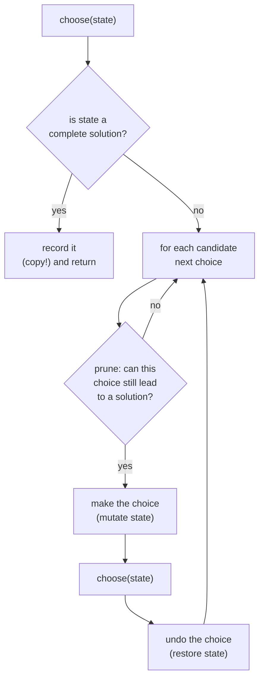

# Recursion and backtracking — enumerate, prune, undo

Backtracking is the technique for problems that ask for *all* solutions, or
*any* solution, when there is no shortcut: subsets, permutations, placements,
paths through a grid. You build a candidate one decision at a time, and the
moment a partial candidate cannot lead to a valid answer you abandon it and
step back. The skill is not the recursion — it is knowing what a "decision"
is, when to prune, and remembering to undo.

*In the interview: backtracking shows up as "generate all X" or "does any
X exist" — subsets, combinations, N-Queens, word search — and the follow-up
twist is "now there are duplicates in the input", "now count instead of
enumerate" (which is where DP takes over), or "how big before this stops
being feasible".*

[Dynamic programming](15-dynamic-programming.md) is the next chapter for a
reason: it is what you reach for when backtracking's tree has overlapping
subproblems and you only need a count or an optimum, not the list.

---

## The costs

Backtracking is exponential by nature. Your job is to *state* the bound and
then explain what pruning buys.

| Problem shape | Solutions | Time to enumerate |
| --- | --- | --- |
| Subsets of n items | 2ⁿ | **O(n · 2ⁿ)** — each subset copied |
| Permutations of n items | n! | **O(n · n!)** |
| Combinations of k from n | C(n, k) | O(k · C(n, k)) |
| N-Queens | ~small | O(n!) worst, far less with pruning |
| Word search in an m×n grid, word length L | — | O(m · n · 3ᴸ) — three directions after the first step |
| Generate parentheses, n pairs | Catalan(n) ≈ 4ⁿ / n^1.5 | O(4ⁿ / √n) |

**The sentence to have ready:** "this is exponential because the output is
exponential — there are 2ⁿ subsets, so any algorithm that lists them is at
least O(2ⁿ). Pruning reduces the constant, not the class." When the question
only wants a count or a best value, say "then I don't need to enumerate, and
this becomes DP".

---

## How it actually works


*Every backtracking solution is this loop: check, choose, recurse, undo. The bugs live in the copy on record and the undo after recurse.*

### Who's who

| Term | Meaning |
| --- | --- |
| **State / path** | The partial candidate being built — usually an array you push to and pop from |
| **Choice** | One decision: include this element, place a queen in this column, take this character |
| **Decision tree** | Every choice is a branch; leaves are complete candidates |
| **Prune** | Skip a branch without exploring it because it cannot succeed |
| **Undo** | Reverse the mutation after the recursive call returns, so siblings see clean state |
| **Start index** | For combinations/subsets: only consider elements after the last chosen, so `{1,2}` and `{2,1}` are not both produced |
| **Used set** | For permutations: which elements are already in the path |
| **Feasibility check** | The predicate behind the prune — column/diagonal free, sum not exceeded, characters remaining |

---

## The techniques, in the order you should learn them

### 1. Include / exclude (subsets)

Two branches per element: take it or skip it. Depth `n`, 2ⁿ leaves. The
cleanest form iterates a start index so each subset is generated once.

### 2. Start index (combinations, combination sum)

Pass `start` into the recursion and only loop `i` from `start`. This is
what stops `[1,2]` and `[2,1]` both appearing. For combination sum with
reuse allowed, recurse with `i` (not `i + 1`); without reuse, `i + 1`.

### 3. Used set (permutations)

Order matters, so every element is a candidate at every depth *unless
already used*. A boolean array beats a `Set` for speed and reads cleanly.

### 4. Prune by feasibility

Sort the input first, then `break` (not `continue`) as soon as a candidate
would exceed the target — everything after it is larger too. This turns
combination sum from hopeless to fast.

### 5. Skip duplicates

Sort, then at each depth skip a value equal to the previous sibling:
`if (i > start && nums[i] === nums[i - 1]) continue;`. For permutations with
duplicates, the condition is `nums[i] === nums[i−1] && !used[i−1]`.

### 6. Constraint-tracking (N-Queens)

Instead of checking the board, keep sets of occupied columns and diagonals
(`r − c` and `r + c` are constant along each diagonal). The feasibility check
becomes three `has` calls.

### 7. Grid DFS with in-place marking (word search)

Mark a cell visited by overwriting it (`'#'`), recurse in four directions,
restore it. No visited set to copy.

---

## The bugs that actually cost you the round

| Bug | The fix |
| --- | --- |
| **Recording the path by reference** | `result.push(path)` stores the same array every time and it ends up empty. `result.push([...path])` or `path.slice()` |
| **Forgetting the undo** | The `pop()` after the recursive call. Without it, siblings inherit the wrong state |
| **`continue` where `break` is right** | Once a sorted candidate exceeds the target, every later one does too. `break` prunes the whole tail |
| **Duplicate outputs** | Missing start index (combinations) or missing the sorted-skip (inputs with repeats) |
| **Off-by-one on the start index** | `i` for "reuse allowed", `i + 1` for "each element once" — say which the problem is |
| **Not restoring the grid** | Word search that never un-marks `'#'` finds the first word and nothing else |
| **Stack depth** | Depth equals path length, so usually fine — but say it if `n` could be 10⁵ |

---

## Practice ladder

| # | Problem | What it teaches |
| --- | --- | --- |
| 1 | Subsets | Include/exclude, copy on record |
| 2 | Subsets II (duplicates) | Sort + skip equal siblings |
| 3 | Permutations | Used array; order matters |
| 4 | Combination sum | Start index with reuse; sort + break |
| 5 | Letter combinations of a phone number | Choice = one of several characters per position |
| 6 | Generate parentheses | Prune by a counting invariant, not a feasibility scan |
| 7 | Palindrome partitioning | Choice = where to cut; check before recursing |
| 8 | Word search | Grid DFS, mark and restore |
| 9 | N-Queens | Diagonal sets; count vs enumerate |
| 10 | Sudoku solver | The same as N-Queens with three constraint sets and early exit on first solution |

**Exit test:** for any "list all…" problem you can name the choice at each
level, the pruning condition, and the undo, before writing a line.

---

## Data structures

| Need | Use | Note |
| --- | --- | --- |
| The current path | `Array` + `push`/`pop` | Both O(1). Copy on record with `slice()` |
| Used elements (permutations) | `Array(n).fill(false)` | Faster than `Set`, and you can read it in a debugger |
| Occupied columns/diagonals | `Set` of numbers | `r − c` and `r + c` identify the two diagonals |
| Visited grid cells | Overwrite in place | `'#'` marker, restore after recursion |
| Results | `Array` of arrays | Or a counter, if the question only wants a count |

**Pseudocode — the skeleton every problem in this chapter is a variant of**

```js
function backtrack(nums) {
  const results = [];
  const path = [];

  function choose(start) {
    results.push([...path]);                 // record a COPY — path is reused
    for (let i = start; i < nums.length; i++) {
      // if (!feasible(nums[i])) break;      // prune here, on sorted input
      path.push(nums[i]);                    // make the choice
      choose(i + 1);                         // i+1: each element at most once
      path.pop();                            // undo, so the next sibling starts clean
    }
  }
  choose(0);
  return results;
}
```

This exact function generates all subsets. Change `i + 1` to `i` and add a
target and you have combination sum; replace the start index with a used
array and you have permutations. Learn the skeleton, then learn what each
problem changes.

---

## Worked problems

### Q: Subsets — every subset of a set of distinct integers
**Level:** intermediate · **Tags:** coding, backtracking, subsets

<details><summary>Model answer</summary>

**Problem.** `[1,2,3]` → `[[],[1],[1,2],[1,2,3],[1,3],[2],[2,3],[3]]` (any
order).

**Clarify first.** Distinct elements? (Yes — duplicates change the approach.)
Output order? (Any.) Size of `n`? (Small — up to ~20; the output is 2ⁿ.)

**Brute force.** Iterate the integers `0..2ⁿ−1` and use each bit as an
include flag. That is actually a fine answer — O(n · 2ⁿ) and iterative. Say
it, then show the recursive one because it generalises.

**The insight.** A subset is a sequence of include/exclude decisions. With a
start index, each recursion level picks the *next* element to include from
those after the last one, so every subset is produced exactly once and the
current path is always a valid subset — record it on entry.

**Algorithm.**
1. `choose(start)`: record a copy of `path`.
2. For `i` from `start`: push `nums[i]`, `choose(i + 1)`, pop.

```js
function subsets(nums) {
  const results = [];
  const path = [];
  function choose(start) {
    results.push([...path]);
    for (let i = start; i < nums.length; i++) {
      path.push(nums[i]);
      choose(i + 1);
      path.pop();
    }
  }
  choose(0);
  return results;
}
```

**Complexity.** O(n · 2ⁿ) time — 2ⁿ subsets, each copied in up to O(n).
O(n) recursion depth plus the output.

**Test it.**
- `[1,2,3]` → 8 subsets.
- `[]` → `[[]]`.
- `[5]` → `[[],[5]]`.
- Trace `[1,2]`: record `[]`; push 1, record `[1]`; push 2, record `[1,2]`;
  pop, pop; push 2, record `[2]`.

**What the interviewer is checking.** The copy on record, and that you can
state the bit-mask alternative.

</details>

**Follow-ups:**

1. Q: The input has duplicates — return unique subsets only.
   <details><summary>Answer</summary>

   Sort first, then skip a candidate equal to its previous sibling at the
   same depth:
   ```js
   for (let i = start; i < nums.length; i++) {
     if (i > start && nums[i] === nums[i - 1]) continue;
     ...
   }
   ```
   `i > start` (not `i > 0`) is the detail: the first occurrence at each
   depth is always allowed; only later equal siblings are skipped.

   </details>

2. Q: Only subsets of size k.
   <details><summary>Answer</summary>

   Record only when `path.length === k`, and prune: if
   `path.length + (nums.length − i) < k` there are not enough elements left,
   so `break`. That is the "combinations" problem.

   </details>

### Q: Permutations — every ordering of distinct integers
**Level:** intermediate · **Tags:** coding, backtracking, permutations, used-array

<details><summary>Model answer</summary>

**Problem.** `[1,2,3]` → six arrays: `[1,2,3],[1,3,2],[2,1,3],[2,3,1],[3,1,2],[3,2,1]`.

**Clarify first.** Distinct? (Yes.) `n` small? (Yes — n! output.) Any order?
(Yes.)

**Brute force.** Generate all nⁿ sequences and filter those with no repeats.
Correct, wasteful. Say it briefly.

**The insight.** Unlike subsets, order matters, so every unused element is a
candidate at every position. A `used` array tracks membership in O(1). A
permutation is complete when the path has `n` elements.

**Algorithm.**
1. If `path.length === n`, record a copy.
2. For each `i` not used: mark, push, recurse, pop, unmark.

```js
function permute(nums) {
  const results = [];
  const path = [];
  const used = new Array(nums.length).fill(false);
  function choose() {
    if (path.length === nums.length) { results.push([...path]); return; }
    for (let i = 0; i < nums.length; i++) {
      if (used[i]) continue;
      used[i] = true; path.push(nums[i]);
      choose();
      path.pop(); used[i] = false;         // undo both mutations
    }
  }
  choose();
  return results;
}
```

**Complexity.** O(n · n!) time, O(n) space beyond the output.

**Test it.**
- `[1,2,3]` → 6 results, all distinct.
- `[1]` → `[[1]]`; `[]` → `[[]]`.
- Check that `used` is fully `false` after the call — it is, if every mark
  has a matching unmark.

**What the interviewer is checking.** That you undo *both* the path and the
used flag, and that you can explain why there is no start index here.

</details>

**Follow-ups:**

1. Q: With duplicates in the input — unique permutations only.
   <details><summary>Answer</summary>

   Sort, then skip `nums[i]` when `nums[i] === nums[i−1] && !used[i−1]`.
   The `!used[i−1]` half means: among equal values, always take them in
   index order, so you never produce the same arrangement by picking the
   second copy before the first.

   </details>

2. Q: Do it in place with swaps, no used array.
   <details><summary>Answer</summary>

   Fix position `p`: for each `i ≥ p`, swap `nums[p]` and `nums[i]`, recurse
   on `p + 1`, swap back. O(1) extra space, same time. Output order differs
   and the duplicate-skipping rule becomes a per-level `Set` of values
   already placed at `p`.

   </details>

### Q: Combination sum — all combinations of candidates (reuse allowed) that sum to a target
**Level:** intermediate · **Tags:** coding, backtracking, start-index, pruning

<details><summary>Model answer</summary>

**Problem.** `candidates = [2,3,6,7], target = 7` → `[[2,2,3],[7]]`.
Candidates are distinct positive integers; each may be used any number of
times.

**Clarify first.** Positive only? (Yes — that is what makes pruning valid.)
Unlimited reuse? (Yes.) Are `[2,2,3]` and `[3,2,2]` the same? (Yes — one
combination.)

**Brute force.** Enumerate all multisets up to size `target / min` — same
tree without pruning. Say it and go straight to the pruned version.

**The insight.** Start index prevents reorderings of the same combination.
Recursing with `i` rather than `i + 1` allows reuse. Sorting the candidates
lets you `break` as soon as a candidate exceeds the remaining target — every
later candidate is larger.

**Algorithm.**
1. Sort.
2. `choose(start, remaining)`: if `remaining === 0`, record. For `i` from
   `start`: if `candidates[i] > remaining`, break; push, recurse with
   `(i, remaining − candidates[i])`, pop.

```js
function combinationSum(candidates, target) {
  candidates.sort((a, b) => a - b);
  const results = [];
  const path = [];
  function choose(start, remaining) {
    if (remaining === 0) { results.push([...path]); return; }
    for (let i = start; i < candidates.length; i++) {
      if (candidates[i] > remaining) break;    // sorted → all later ones too big
      path.push(candidates[i]);
      choose(i, remaining - candidates[i]);    // i, not i+1: reuse allowed
      path.pop();
    }
  }
  choose(0, target);
  return results;
}
```

**Complexity.** Exponential in the worst case — bounded by
O(N^(T/M)) where `T` is the target and `M` the smallest candidate, since
that is the maximum depth. Pruning makes it fast in practice.

**Test it.**
- `[2,3,6,7], 7` → `[[2,2,3],[7]]`.
- `[2], 1` → `[]`.
- `[1], 2` → `[[1,1]]`.
- `[2,3,5], 8` → `[[2,2,2,2],[2,3,3],[3,5]]`.

**What the interviewer is checking.** `i` vs `i + 1`, and `break` vs
`continue`. Both are one-character decisions with a reason each.

</details>

**Follow-ups:**

1. Q: Each candidate may be used at most once, and the input has duplicates.
   <details><summary>Answer</summary>

   Recurse with `i + 1`, and add the sorted-skip
   `if (i > start && candidates[i] === candidates[i−1]) continue;`. That is
   Combination Sum II.

   </details>

2. Q: Only the *number* of combinations, target up to 10⁴.
   <details><summary>Answer</summary>

   Enumeration is out. `ways[t] = Σ ways[t − c]` over candidates `c`, with
   the outer loop over candidates and the inner over `t` so each combination
   is counted once regardless of order. O(N · T). This is the coin-change
   counting DP in the [next chapter](15-dynamic-programming.md).

   </details>

### Q: Generate parentheses — all well-formed strings of n pairs
**Level:** intermediate · **Tags:** coding, backtracking, invariant-pruning

<details><summary>Model answer</summary>

**Problem.** `n = 3` → `["((()))","(()())","(())()","()(())","()()()"]`.

**Clarify first.** Only round brackets? (Yes.) Order? (Any.) `n = 0`?
(`[""]`.)

**Brute force.** Generate all 2^(2n) strings of `(` and `)` and keep the
balanced ones — validate each with a counter. O(2n · 4ⁿ).

**The insight.** A prefix can be extended to a valid string iff it never has
more `)` than `(` and uses at most `n` of each. So the decision at each
position is: add `(` if fewer than `n` used; add `)` if fewer than `(` so
far. Pruning by these two counters means every leaf is valid — no
validation pass.

**Algorithm.**
1. `choose(str, open, close)`: if `str.length === 2n`, record.
2. If `open < n`, recurse with `(`.
3. If `close < open`, recurse with `)`.

```js
function generateParenthesis(n) {
  const results = [];
  function choose(str, open, close) {
    if (str.length === 2 * n) { results.push(str); return; }
    if (open < n)      choose(str + '(', open + 1, close);
    if (close < open)  choose(str + ')', open, close + 1);
  }
  choose('', 0, 0);
  return results;
}
```

Strings are immutable in JS, so `str + '('` is the "make choice" and there
is no explicit undo — each call has its own string.

**Complexity.** Output is the n-th Catalan number, ≈ 4ⁿ / n^1.5; total work
is O(that × n) for the string building. O(n) depth.

**Test it.**
- `n = 1` → `["()"]`.
- `n = 2` → `["(())","()()"]`.
- `n = 3` → 5 strings.
- `n = 0` → `[""]`.

**What the interviewer is checking.** Whether you prune with an invariant
(two counters) or generate-then-filter. The former shows you understood the
structure.

</details>

**Follow-ups:**

1. Q: Count them without generating.
   <details><summary>Answer</summary>

   Catalan: `C(0) = 1`, `C(n) = Σ C(i) · C(n−1−i)` for `i` in `0..n−1`
   (choose where the matching `)` of the first `(` goes). O(n²) DP, or the
   closed form `C(2n, n) / (n + 1)`.

   </details>

2. Q: Three bracket types, and the string must be well-formed across all of them.
   <details><summary>Answer</summary>

   Counters no longer suffice — `([)]` has balanced counts but is invalid.
   Track a stack of open brackets in the path; you may close only with the
   matching type of the stack top. Same skeleton, richer state.

   </details>

### Q: Word search — does a word exist as a path of adjacent cells in a grid
**Level:** senior · **Tags:** coding, backtracking, grid-dfs, mark-and-restore

<details><summary>Model answer</summary>

**Problem.** `board = [["A","B","C","E"],["S","F","C","S"],["A","D","E","E"]]`,
`word = "ABCCED"` → `true`; `"ABCB"` → `false` (a cell may not be reused).

**Clarify first.** Adjacent means 4-directional? (Yes.) Cells may not be
reused within one path? (Correct.) May I mutate the board temporarily?
(Yes — otherwise use a visited set.) Grid and word sizes? (Up to ~200 cells,
word ≤ 15.)

**Brute force.** From every cell, try every path of length `L` — same DFS
without the character check at each step, which is 4ᴸ per start. The
character check *is* the pruning.

**The insight.** DFS from every cell whose letter matches `word[0]`. At each
step, match the current letter, mark the cell (overwrite with `'#'`), try
four neighbours for the next letter, restore. The early letter mismatch
prunes almost everything.

**Algorithm.**
1. For each cell `(r, c)`: if `dfs(r, c, 0)` return true.
2. `dfs(r, c, k)`: out of bounds or `board[r][c] !== word[k]` → false. If
   `k === word.length − 1` → true. Mark; recurse 4 ways with `k + 1`;
   restore; return the OR.

```js
function exist(board, word) {
  const R = board.length, C = board[0].length;
  function dfs(r, c, k) {
    if (r < 0 || c < 0 || r >= R || c >= C || board[r][c] !== word[k]) return false;
    if (k === word.length - 1) return true;
    const saved = board[r][c];
    board[r][c] = '#';                          // mark visited in place
    const found = dfs(r + 1, c, k + 1) || dfs(r - 1, c, k + 1) ||
                  dfs(r, c + 1, k + 1) || dfs(r, c - 1, k + 1);
    board[r][c] = saved;                        // restore before returning
    return found;
  }
  for (let r = 0; r < R; r++)
    for (let c = 0; c < C; c++)
      if (dfs(r, c, 0)) return true;
  return false;
}
```

The `||` short-circuit is deliberate — the first success stops the search —
but restoration must still happen, which is why `found` is computed before
the restore rather than returned directly from inside the chain.

**Complexity.** O(R · C · 3ᴸ) — after the first step each cell has at most
three unvisited neighbours. O(L) recursion depth.

**Test it.**
- `"ABCCED"` → true; `"SEE"` → true; `"ABCB"` → false.
- Single-cell board `[["A"]]`, word `"A"` → true; `"AA"` → false.
- After the call, the board is unchanged — assert it.

**What the interviewer is checking.** Mark *and* restore, and that the
mismatch check happens before the base case so the last letter is actually
compared.

</details>

**Follow-ups:**

1. Q: Search for many words at once (Word Search II).
   <details><summary>Answer</summary>

   Build a trie of the words and DFS the grid *along the trie*: at each
   cell, descend to the child for that letter or stop. Each grid path is
   explored once for all words instead of once per word. Remove a word from
   the trie once found to prune further. O(R · C · 4 · 3^(L−1)) worst case
   but vastly faster in practice.

   </details>

2. Q: A cell can be reused — what changes?
   <details><summary>Answer</summary>

   Remove the mark/restore. But now "path exists" for a word like `"AAAA"`
   on a board with two adjacent `A`s is trivially true, and the search can
   loop — bound the depth by the word length (it already is, via `k`).

   </details>

### Q: N-Queens — place n queens on an n×n board so none attack another
**Level:** senior · **Tags:** coding, backtracking, constraint-sets, n-queens

<details><summary>Model answer</summary>

**Problem.** Return all distinct boards. `n = 4` → 2 solutions:
`[".Q..","...Q","Q...","..Q."]` and `["..Q.","Q...","...Q",".Q.."]`.

**Clarify first.** Return boards as strings, or just the count? (Boards —
count is the follow-up.) `n = 1` → one solution; `n = 2, 3` → none.

**Brute force.** Try every placement of `n` queens on `n²` cells and check:
C(n², n). Say it to dismiss it.

**The insight.** One queen per row is forced, so the decision at row `r` is
only *which column*. A placement is legal iff the column, the `r − c`
diagonal and the `r + c` anti-diagonal are all unoccupied. Three `Set`s
make that an O(1) check, and the row-by-row structure means the recursion
depth is `n`.

**Algorithm.**
1. `place(r)`: if `r === n`, record the board.
2. For each column `c`: if `c`, `r − c`, `r + c` are all free, occupy them,
   set `cols[r] = c`, recurse `r + 1`, then release.

```js
function solveNQueens(n) {
  const results = [];
  const queenCol = new Array(n).fill(-1);     // queenCol[r] = column of the queen in row r
  const cols = new Set(), diag = new Set(), anti = new Set();

  function place(r) {
    if (r === n) {
      results.push(queenCol.map(c => '.'.repeat(c) + 'Q' + '.'.repeat(n - c - 1)));
      return;
    }
    for (let c = 0; c < n; c++) {
      if (cols.has(c) || diag.has(r - c) || anti.has(r + c)) continue;
      cols.add(c); diag.add(r - c); anti.add(r + c); queenCol[r] = c;
      place(r + 1);
      cols.delete(c); diag.delete(r - c); anti.delete(r + c);   // undo all three
    }
  }
  place(0);
  return results;
}
```

**Complexity.** O(n!) upper bound on the tree (row 0 has n choices, row 1 at
most n − 2 legal, …); each solution costs O(n²) to render. O(n) space for
the sets and depth.

**Test it.**
- `n = 4` → 2 boards, matching the ones above.
- `n = 1` → `[["Q"]]`.
- `n = 2` and `n = 3` → `[]`.
- `n = 8` → 92 solutions (the classical number — a good sanity check).

**What the interviewer is checking.** The diagonal identities `r − c` and
`r + c`, and undoing all three sets. Also whether you know to fix one queen
per row rather than searching cells.

</details>

**Follow-ups:**

1. Q: Only count the solutions for n up to 14.
   <details><summary>Answer</summary>

   Drop the board rendering and increment a counter at `r === n`. For speed,
   replace the three `Set`s with three bitmasks (`cols`, `diag << 1`,
   `anti >> 1` shifted per row) — the same algorithm in O(1) per check with
   tiny constants. n = 14 is ~365k solutions and runs in well under a second.

   </details>

2. Q: Why is Sudoku the same problem?
   <details><summary>Answer</summary>

   Cell by cell, choose a digit not in the row, column or 3×3 box (three
   constraint sets, indexed by row, column and box id), recurse, undo. The
   difference is you stop at the first full board rather than enumerating
   all. Pick the empty cell with the fewest legal digits first — that
   heuristic is what makes hard puzzles fast.

   </details>

---

## Problem bank — recursion fundamentals

Backtracking (above) is recursion with undo. This bank is the recursion
underneath it, from the Scaler track: how to write a recursive function at all,
how to cost one, fast exponentiation, the Josephus problem, and enumerating
subsequences and subsets.

| Group | Problems |
| --- | --- |
| Writing recursion | sum of 1..N, factorial, Nth Fibonacci, print 1..N and N..1 |
| Costing recursion | time and space complexity of recursive code |
| Power | aⁿ in O(n) and O(log n), aⁿ mod m |
| Classic | Josephus problem |
| Subsequences and subsets | subarray vs subsequence vs subset, count subsequences with sum K |

**The three steps — say them before writing any recursive function.**

1. **Assumption.** Decide what the function *does*, in one sentence, and trust
   it for smaller inputs. `sum(n)` returns 1 + 2 + … + n.
2. **Main logic.** Solve the problem using the answer for a smaller instance.
   `sum(n) = n + sum(n − 1)`.
3. **Base case.** The smallest input you can answer directly, which stops the
   recursion. `sum(1) = 1` (or `sum(0) = 0`).

Missing step 3 is a stack overflow. A step 2 that doesn't shrink the input is
also a stack overflow.

---

### Writing recursion

### Q: Sum of 1..N and N! recursively
**Level:** foundation · **Tags:** coding, recursion, scaler

<details><summary>Model answer</summary>

**Problem.** `sum(5)` → 15. `factorial(4)` → 24.

**Applying the three steps.** Assumption: `f(n)` returns the answer for n.
Main logic: `sum(n) = n + sum(n − 1)`, `fact(n) = n × fact(n − 1)`. Base case:
`sum(0) = 0`, `fact(0) = 1` (the empty product).

```ts
function sum(n: number): number {
  if (n === 0) return 0;          // base case
  return n + sum(n - 1);          // main logic on a smaller instance
}

function factorial(n: number): number {
  if (n <= 1) return 1;
  return n * factorial(n - 1);
}
```

**Tracing `sum(3)`.** `sum(3)` waits on `sum(2)`, which waits on `sum(1)`,
which waits on `sum(0) = 0`. Then the stack unwinds: `1 + 0 = 1`, `2 + 1 = 3`,
`3 + 3 = 6`. Being able to draw this stack on the whiteboard is the skill the
question is testing.

**Complexity.** O(n) time (n calls, O(1) each), O(n) space (n frames on the
stack at the deepest point).

</details>

**Follow-ups:**
1. Q: `factorial(25)` returns `1.5511210043330986e+25`. What's wrong?
   <details><summary>Answer</summary>

   Past 18! (~6.4·10¹⁵) the result exceeds `Number.MAX_SAFE_INTEGER`, so it's
   an approximation. Use `BigInt` for exact values, or compute it modulo a
   prime if the problem asks — see the modular arithmetic bank in
   [chapter 04](04-patterns-and-complexity.md).

   </details>

### Q: The Nth Fibonacci number, recursively — and why the naive version is exponential
**Level:** foundation · **Tags:** coding, recursion, fibonacci, memoisation, scaler

<details><summary>Model answer</summary>

**Problem.** `fib(0) = 0, fib(1) = 1, fib(n) = fib(n−1) + fib(n−2)`.
`0 1 1 2 3 5 8 13 21 34 55` → `fib(10) = 55`.

```ts
function fib(n: number): number {
  if (n <= 1) return n;                  // two base cases: 0 and 1
  return fib(n - 1) + fib(n - 2);
}

function fibMemo(n: number, memo = new Map<number, number>()): number {
  if (n <= 1) return n;
  if (memo.has(n)) return memo.get(n)!;
  const v = fibMemo(n - 1, memo) + fibMemo(n - 2, memo);
  memo.set(n, v);
  return v;
}
```

**Complexity.** Naive: every call makes two more, so about 2ⁿ calls (more
precisely φⁿ ≈ 1.618ⁿ) — O(2ⁿ) time. Space is O(n), because only one branch
is on the stack at a time: space = **max depth**, not number of calls. With
memoisation each `n` is computed once: O(n) time, O(n) space. Iteratively with
two variables: O(n) time, O(1) space.

</details>

**Follow-ups:**
1. Q: Why is the space O(n) when there are 2ⁿ calls?
   <details><summary>Answer</summary>

   Space counts frames alive **at the same time**. `fib(n − 2)` is only called
   after `fib(n − 1)` has fully returned and its frames are gone. The deepest
   chain is `n → n−1 → … → 1`, so n frames.

   </details>
2. Q: Can you beat O(n)?
   <details><summary>Answer</summary>

   Yes — `[[1,1],[1,0]]ⁿ` contains `fib(n)`, and matrix fast exponentiation
   computes it in O(log n) multiplications. Same idea as fast power below.

   </details>

### Q: Print 1..N in increasing order and N..1 in decreasing order using recursion
**Level:** foundation · **Tags:** coding, recursion, scaler

<details><summary>Model answer</summary>

**Problem.** `n = 4` → `1 2 3 4` and `4 3 2 1`.

**The insight.** Both are "handle n, recurse on n − 1". The only difference is
**whether you print before or after the recursive call**. Print after → the
smaller numbers come out first (increasing). Print before → decreasing.

```ts
function increasing(n: number, out: number[] = []): number[] {
  if (n === 0) return out;
  increasing(n - 1, out);     // print 1..n-1 first
  out.push(n);                // then n
  return out;
}

function decreasing(n: number, out: number[] = []): number[] {
  if (n === 0) return out;
  out.push(n);                // n first
  decreasing(n - 1, out);     // then n-1..1
  return out;
}
```

**Complexity.** O(n) time, O(n) stack space.

</details>

**Follow-ups:**
1. Q: What's the general lesson?
   <details><summary>Answer</summary>

   Work before the recursive call happens on the way **down** (pre-order);
   work after happens on the way **up** (post-order). The same distinction
   drives tree traversals and printing a linked list in reverse.

   </details>

---

### Costing recursion

### Q: How do you find the time and space complexity of a recursive function?
**Level:** intermediate · **Tags:** coding, recursion, complexity, recurrence, scaler

<details><summary>Model answer</summary>

**Time = (number of calls) × (work per call, excluding the recursive calls).**
**Space = (maximum depth of the call stack) × (space per frame).**

Two ways to get the number of calls:

1. **Draw the recursion tree.** Count nodes. `sum(n)`: a chain of n nodes →
   O(n). `fib(n)`: a binary tree of depth n → O(2ⁿ).
2. **Write the recurrence and expand it.** `T(n) = T(n−1) + 1` → `T(n) = n`.
   `T(n) = 2T(n−1) + 1` → `2ⁿ`. `T(n) = T(n/2) + 1` → `log n`.
   `T(n) = 2T(n/2) + n` (merge sort) → `n log n`.

| Function | Recurrence | Time | Space |
| --- | --- | --- | --- |
| `sum(n)`, `factorial(n)` | T(n) = T(n−1) + 1 | O(n) | O(n) |
| `fib(n)` naive | T(n) = T(n−1) + T(n−2) + 1 | O(2ⁿ) | O(n) |
| `pow(a, n)` via `pow(a, n−1)` | T(n) = T(n−1) + 1 | O(n) | O(n) |
| `pow` calling `pow(a, n/2)` **twice** | T(n) = 2T(n/2) + 1 | O(n) | O(log n) |
| `pow` calling `pow(a, n/2)` **once** | T(n) = T(n/2) + 1 | O(log n) | O(log n) |
| Merge sort | T(n) = 2T(n/2) + n | O(n log n) | O(n) |

</details>

**Follow-ups:**
1. Q: Why does calling `pow(a, n/2)` twice make it O(n) even though n halves?
   <details><summary>Answer</summary>

   Each level doubles the number of calls while n halves: 1 + 2 + 4 + … + n
   ≈ 2n calls. Halving the input only helps if the number of calls doesn't
   double to match. Store the half result in a variable and use it twice.

   </details>

---

### Power

### Q: Compute aⁿ recursively — O(n), then O(log n)
**Level:** intermediate · **Tags:** coding, recursion, fast-power, divide-and-conquer, scaler

<details><summary>Model answer</summary>

**Problem.** `pow(2, 10)` → 1024 without `Math.pow` or `**`.

**Naive.** `aⁿ = a × aⁿ⁻¹`, base case `a⁰ = 1`. O(n) time, O(n) stack.

**The insight.** `aⁿ = (aⁿᐟ²)²` when n is even, and `a × (a⌊ⁿᐟ²⌋)²` when n is
odd. Compute the half **once**, store it, square it.

```ts
function powNaive(a: number, n: number): number {
  if (n === 0) return 1;
  return a * powNaive(a, n - 1);
}

function powFast(a: number, n: number): number {
  if (n === 0) return 1;
  const half = powFast(a, Math.floor(n / 2));  // ONE recursive call
  return n % 2 === 0 ? half * half : half * half * a;
}
```

The trap the lecture calls "fake smart power": writing
`powFast(a, n/2) * powFast(a, n/2)` looks logarithmic but makes two calls per
level — O(n) again.

**Complexity.** O(log n) time, O(log n) stack space.

**Test it.** `n = 0` → 1. `n = 1` → a. `a = 0, n = 0` → 1 by convention (ask).
`pow(2, 10)` → 1024. Negative n: return `1 / powFast(a, −n)` if allowed.

</details>

**Follow-ups:**
1. Q: Do it iteratively in O(1) space.
   <details><summary>Answer</summary>

   Walk the bits of n: `result = 1; while (n > 0) { if (n & 1) result *= a; a *= a; n >>= 1; }`.
   Each bit of n decides whether the current `a^(2^k)` is multiplied in.

   </details>

### Q: Compute aⁿ mod m, with a, m up to 10⁹ and n up to 10⁹
**Level:** intermediate · **Tags:** coding, recursion, fast-power, modular-arithmetic, scaler

<details><summary>Model answer</summary>

**Problem.** `a = 2, n = 10, m = 1000` → `24`. Negative `a` must give a
non-negative answer.

**The insight.** Fast power, reducing mod m after **every** multiplication:
`(x·y) mod m = ((x mod m)·(y mod m)) mod m`. But in JS, `half * half` can be
up to (10⁹)² = 10¹⁸ — past 2⁵³, so the `%` is computed on an already-rounded
number and is **silently wrong**. Use `BigInt` for the multiplication.

```ts
function powMod(a: number, n: number, m: number): number {
  const M = BigInt(m);
  const go = (base: bigint, e: number): bigint => {
    if (e === 0) return 1n % M;                        // m = 1 → 0
    const half = go(base, Math.floor(e / 2));
    const sq = (half * half) % M;                      // exact: BigInt has no overflow
    return e % 2 === 0 ? sq : (sq * base) % M;
  };
  const base = ((BigInt(a) % M) + M) % M;              // normalise negative a
  return Number(go(base, n));
}
```

**Complexity.** O(log n) multiplications, O(log n) stack.

**Test it.** `powMod(2, 10, 1000)` → 24. `powMod(-2, 3, 5)` → `(-8 mod 5)` = 2.
`powMod(5, 0, 1)` → 0.

</details>

**Follow-ups:**
1. Q: In Java/C++ what's the equivalent pitfall?
   <details><summary>Answer</summary>

   `int × int` overflows 32 bits before the `%`. Cast to `long` before
   multiplying: `(long) half * half % m`. With m ≤ ~3·10⁹ the product fits in a
   signed 64-bit long.

   </details>

---

### Classic

### Q: The Josephus problem — n people in a circle, each kills the next and passes the knife; who survives?
**Level:** intermediate · **Tags:** coding, recursion, josephus, bits, scaler

<details><summary>Model answer</summary>

**Problem.** People 1..n stand in a circle. Person 1 holds the knife, kills
the next living person clockwise, and passes the knife to the one after that.
Repeat until one remains. `n = 5` → `3`; `n = 8` → `1`.

**Brute force.** Simulate with an array or a circular list: O(n²) or O(n).

**The insight (k = 2).** When n is a power of two, every round kills exactly
half and the knife returns to whoever held it at the start — so **the starter
survives**. For any other n, kill people until the number alive is the largest
power of two `p ≤ n`. That takes `n − p` kills, after which the knife is held
by person `2(n − p) + 1` — and they are now the starter of a power-of-two
circle, so they survive.

```ts
function josephus2(n: number): number {
  let p = 1;
  while (p * 2 <= n) p *= 2;          // largest power of two ≤ n
  return 2 * (n - p) + 1;
}
```

Check: n = 5, p = 4 → 2·1 + 1 = 3 ✓. n = 8 → 1 ✓. n = 6 → 5.

**General k (every k-th person dies).** Recurrence, 0-indexed:
`J(1) = 0`, `J(n) = (J(n − 1) + k) mod n`. After the first death the circle
has n − 1 people, renumbered starting just past the victim — shift the
smaller answer back by k.

```ts
function josephus(n: number, k: number): number {   // 1-indexed answer
  let pos = 0;                                      // J(1) = 0
  for (let size = 2; size <= n; size++) pos = (pos + k) % size;
  return pos + 1;
}
```

**Complexity.** k = 2 closed form: O(log n). General: O(n) time, O(1) space
(the iterative form of the recursion).

</details>

**Follow-ups:**
1. Q: Express the k = 2 answer with bits.
   <details><summary>Answer</summary>

   Take n's binary representation and rotate the leading 1 to the end:
   n = 5 = `101` → `011` = 3. That's the same as `2(n − p) + 1`, since
   `n − p` drops the top bit and `×2 + 1` shifts left and appends a 1.

   </details>

---

### Subsequences and subsets

| | Subarray | Subsequence | Subset |
| --- | --- | --- | --- |
| Contiguous? | Yes | No | No |
| Order kept? | Yes | Yes | Doesn't matter |
| Count for n elements | n(n + 1)/2 | 2ⁿ (incl. empty) | 2ⁿ (incl. empty) |
| Can you sort first? | No — changes which are contiguous | No — changes order | **Yes** — order doesn't matter |

Every subarray is a subsequence; not every subsequence is a subarray. For
problems that depend only on *which* elements are chosen (a sum, a max),
subsequences and subsets are interchangeable — and then sorting is allowed.

### Q: Count the subsequences whose sum equals K
**Level:** intermediate · **Tags:** coding, subsequences, bitmask, recursion, scaler

<details><summary>Model answer</summary>

**Problem.** `a = [1, 4, 6, 7, 3], K = 10` → `3` (`{4, 6}`, `{7, 3}`,
`{1, 6, 3}`). n ≤ 20.

**The insight.** n ≤ 20 means 2²⁰ ≈ 10⁶ subsequences — enumerating all of
them is the intended solution. Two equivalent ways:

1. **Bitmask.** Every integer `mask` in `[0, 2ⁿ)` is a subsequence: bit `j`
   set ⇔ `a[j]` is chosen.
2. **Include / exclude recursion.** At index i, either take `a[i]` or don't.

```ts
function countSubseqSumBitmask(a: number[], K: number): number {
  const n = a.length;
  let count = 0;
  for (let mask = 1; mask < (1 << n); mask++) {       // skip mask 0 = empty
    let s = 0;
    for (let j = 0; j < n; j++) if (mask & (1 << j)) s += a[j];
    if (s === K) count++;
  }
  return count;
}

function countSubseqSumRec(a: number[], K: number): number {
  const go = (i: number, sum: number, taken: boolean): number => {
    if (i === a.length) return sum === K && taken ? 1 : 0;
    return go(i + 1, sum + a[i], true)    // include a[i]
         + go(i + 1, sum, taken);         // exclude a[i]
  };
  return go(0, 0, false);
}
```

**Complexity.** Bitmask O(n·2ⁿ) time, O(1) space. Recursion O(2ⁿ) time,
O(n) stack.

**Test it.** `K = 0` — does the empty subsequence count? Ask. Both versions
above exclude it.

</details>

**Follow-ups:**
1. Q: n is 1000 and values are small non-negative integers. Now what?
   <details><summary>Answer</summary>

   2¹⁰⁰⁰ is impossible; it's subset-sum counting DP:
   `dp[s] += dp[s − x]` iterating s downwards for each x. O(n·K) time, O(K)
   space. See [chapter 15](15-dynamic-programming.md).

   </details>
2. Q: n = 40?
   <details><summary>Answer</summary>

   Meet in the middle: enumerate the 2²⁰ sums of each half, sort one list, and
   for every sum s in the other count occurrences of `K − s` by binary search
   (or a hash map). O(2ⁿᐟ² · n).

   </details>

---

## Interview Q&A

### Q: How do you decide between backtracking and dynamic programming for a problem?
**Level:** intermediate · **Tags:** coding, backtracking, dp, technique-choice

<details><summary>Model answer</summary>

I ask what the output is. If it's *the list* of solutions — every subset,
every valid board, every path — I have to enumerate them, the output is
exponential, and backtracking is the tool. Pruning trims the tree but the
class stays exponential because the answer itself is that big.

If the output is a *number* — a count, a maximum, a boolean "does one
exist" — then I don't need to see every solution, and I check whether the
recursion has overlapping subproblems: does `solve(i, remaining)` get called
with the same arguments from different branches? If yes, memoise it and it
becomes DP with a polynomial bound.

The tell in an interview is the follow-up. Combination sum asks for the
list — backtracking. "How many ways to make the target" is the same tree,
counted — that's the coin-change DP. Being able to say "same recursion,
different question, so I'd switch from enumerating to memoising" is the
answer they're listening for.

</details>

**Follow-ups:**

1. Q: Can backtracking ever be the right choice for a count?
   <details><summary>Answer</summary>

   When the subproblems don't overlap, memoisation buys nothing. N-Queens
   counting is the example — the state is the full set of occupied columns
   and diagonals, so no two branches share a subproblem, and the
   backtracking with bitmasks *is* the best known practical method.

   </details>

### Q: What is the general skeleton of a backtracking solution, and where do the bugs hide?
**Level:** foundation · **Tags:** coding, backtracking, skeleton

<details><summary>Model answer</summary>

Four lines, always: check whether the state is complete and record it if so;
loop over the candidate choices; for each, make the choice, recurse, undo
the choice. Everything else is problem-specific pruning.

The bugs live in two places. The record step — pushing `path` itself rather
than a copy, so every entry in the result is the same array, which ends up
empty. And the undo — forgetting the `pop()`, or undoing only one of two
mutations when there's also a `used` flag or a constraint set, so siblings
see a polluted state.

The third, subtler one is `continue` versus `break` in the pruning check.
If the candidates are sorted and one is already too large, every later one
is too — `break`. Using `continue` there is still correct, just
exponentially slower, which is the kind of thing that is right on the small
example and wrong on the follow-up.

</details>

**Follow-ups:**

1. Q: How do you avoid duplicate results when the input has repeated values?
   <details><summary>Answer</summary>

   Sort, then at each depth skip a candidate equal to the *previous sibling*
   — `i > start && nums[i] === nums[i − 1]`. The first copy at each level is
   always allowed; later copies are redundant because they'd generate the
   same subtree. For permutations the condition is
   `nums[i] === nums[i − 1] && !used[i − 1]`.

   </details>

---

## What a weak answer sounds like

- "I'll generate everything and then filter." Fine as the stated brute force;
  a problem if it is the final answer.
- Writing `results.push(path)` and being surprised that the output is a list
  of empty arrays.
- Not being able to say why the algorithm is exponential — "because
  recursion" is not a reason; "because there are 2ⁿ subsets" is.
- Reaching for backtracking on a counting problem with a target of 10⁴ and
  not noticing it will never finish.

---

## Glossary

| Term | Meaning |
| --- | --- |
| **Backtracking** | Depth-first construction of candidates with pruning and undo |
| **Prune** | Abandon a partial candidate that cannot become a solution |
| **Start index** | Parameter ensuring combinations are generated in one canonical order |
| **Used array** | Per-element flag for permutations, where order matters |
| **Catalan number** | Count of well-formed bracket strings with n pairs; ≈ 4ⁿ / n^1.5 |
| **Mark and restore** | Visiting a grid cell by overwriting it, then putting the value back |
| **Memoisation** | Caching recursive results — the bridge from backtracking to DP |

---

## Exercises

Before each one, say the three steps out loud: what the function returns, how the
answer uses a smaller call, and the base case. Problems marked **core** are the
must-solve set. Where the order of results doesn't matter, the tests accept any order.

### Exercise: Sum of 1..N, recursively
**Level:** foundation · **Topic:** recursion: n + sum(n − 1) · **Hint:** Base case first: what is the sum up to 0?
**Function:** `sumTo(n: number): number`
**Source:** scaler

Return 1 + 2 + … + n using recursion (n ≥ 0). `5` → `15`.

```tests
[{"args": [5], "expected": 15},
 {"args": [0], "expected": 0},
 {"args": [1], "expected": 1},
 {"args": [100], "expected": 5050}]
```

<details><summary>Solution</summary>

```ts
function sumTo(n: number): number {
  if (n === 0) return 0;
  return n + sumTo(n - 1);
}
```
</details>

### Exercise: Factorial
**Level:** foundation · **Topic:** recursion: n × fact(n − 1) · **Hint:** 0! = 1 — the empty product.
**Function:** `factorial(n: number): number`
**Source:** scaler

Return n! for 0 ≤ n ≤ 18 (every answer is exact in a JS number). `4` → `24`.

```tests
[{"args": [4], "expected": 24},
 {"args": [0], "expected": 1},
 {"args": [1], "expected": 1},
 {"args": [10], "expected": 3628800},
 {"args": [18], "expected": 6402373705728000}]
```

<details><summary>Solution</summary>

```ts
function factorial(n: number): number {
  return n <= 1 ? 1 : n * factorial(n - 1);
}
```
</details>

### Exercise: Nth Fibonacci number
**Level:** foundation · **Topic:** recursion + memoisation · **Hint:** Naive recursion is O(2ⁿ): remember what you've computed.
**Function:** `fib(n: number): number`
**Core:** true · **Source:** scaler

`fib(0) = 0`, `fib(1) = 1`, `fib(n) = fib(n−1) + fib(n−2)`. Return `fib(n)` for n ≤ 70 — fast.
`10` → `55`.

```tests
[{"args": [10], "expected": 55},
 {"args": [0], "expected": 0},
 {"args": [1], "expected": 1},
 {"args": [2], "expected": 1},
 {"args": [50], "expected": 12586269025},
 {"args": [70], "expected": 190392490709135}]
```

<details><summary>Solution</summary>

```ts
function fib(n: number, memo: Map<number, number> = new Map()): number {
  if (n <= 1) return n;
  if (memo.has(n)) return memo.get(n)!;
  const v = fib(n - 1, memo) + fib(n - 2, memo);
  memo.set(n, v);
  return v;
}
```
</details>

### Exercise: 1..N and N..1
**Level:** foundation · **Topic:** work before vs after the recursive call · **Hint:** Pushing after the call gives increasing order; before gives decreasing.
**Function:** `incDec(n: number): number[][]`
**Source:** scaler

Return `[increasing, decreasing]`: `[1..n]` and `[n..1]`, both built recursively. `3` → `[[1,2,3],[3,2,1]]`.

```tests
[{"args": [3], "expected": [[1, 2, 3], [3, 2, 1]]},
 {"args": [1], "expected": [[1], [1]]},
 {"args": [0], "expected": [[], []]}]
```

<details><summary>Solution</summary>

```ts
function incDec(n: number): number[][] {
  const inc: number[] = [], dec: number[] = [];
  const up = (k: number) => { if (k === 0) return; up(k - 1); inc.push(k); };
  const down = (k: number) => { if (k === 0) return; dec.push(k); down(k - 1); };
  up(n);
  down(n);
  return [inc, dec];
}
```
</details>

### Exercise: Fast power
**Level:** intermediate · **Topic:** divide and conquer on the exponent · **Hint:** Compute the half power once, then square it.
**Function:** `power(a: number, n: number): number`
**Core:** true · **Source:** scaler

Return aⁿ for integer n ≥ 0 in O(log n) multiplications, without `**` or `Math.pow`. Answers stay within exact integers.
`(2, 10)` → `1024`.

```tests
[{"args": [2, 10], "expected": 1024},
 {"args": [3, 0], "expected": 1},
 {"args": [3, 5], "expected": 243},
 {"args": [-2, 3], "expected": -8},
 {"args": [1, 1000000000], "expected": 1},
 {"args": [0, 0], "expected": 1}]
```

<details><summary>Solution</summary>

```ts
function power(a: number, n: number): number {
  if (n === 0) return 1;
  const half = power(a, Math.floor(n / 2));
  return n % 2 === 0 ? half * half : half * half * a;
}
```
</details>

### Exercise: Power mod m
**Level:** intermediate · **Topic:** fast power + BigInt multiplication · **Hint:** (10⁹)² doesn't fit exactly in a double — multiply in BigInt.
**Function:** `powMod(a: number, n: number, m: number): number`
**Core:** true · **Source:** scaler

Return `aⁿ mod m` as a non-negative number, with a, n, m up to 10⁹ and a possibly negative.
`(2, 10, 1000)` → `24`; `(-2, 3, 5)` → `2`.

```tests
[{"args": [2, 10, 1000], "expected": 24},
 {"args": [-2, 3, 5], "expected": 2},
 {"args": [5, 0, 1], "expected": 0},
 {"args": [123456789, 987654321, 1000000007], "expected": 652541198},
 {"args": [7, 1, 13], "expected": 7}]
```

<details><summary>Solution</summary>

```ts
function powMod(a: number, n: number, m: number): number {
  const M = BigInt(m);
  let base = ((BigInt(a) % M) + M) % M;
  let result = 1n % M, e = n;
  while (e > 0) {
    if (e % 2 === 1) result = (result * base) % M;
    base = (base * base) % M;
    e = Math.floor(e / 2);
  }
  return Number(result);
}
```
</details>

### Exercise: Josephus problem
**Level:** intermediate · **Topic:** recurrence J(n) = (J(n − 1) + k) mod n · **Hint:** After one death the circle is the same problem, renumbered.
**Function:** `josephus(n: number, k: number): number`
**Source:** scaler

People 1..n stand in a circle; counting from person 1, every k-th person is removed. Return the survivor (1-based).
`(5, 2)` → `3`; `(7, 3)` → `4`.

```tests
[{"args": [5, 2], "expected": 3},
 {"args": [7, 3], "expected": 4},
 {"args": [1, 5], "expected": 1},
 {"args": [6, 2], "expected": 5},
 {"args": [8, 2], "expected": 1},
 {"args": [40, 7], "expected": 24}]
```

<details><summary>Solution</summary>

```ts
function josephus(n: number, k: number): number {
  let pos = 0;
  for (let size = 2; size <= n; size++) pos = (pos + k) % size;
  return pos + 1;
}
```
</details>

### Exercise: Count subsequences with sum K
**Level:** intermediate · **Topic:** include / exclude recursion (or bitmasks) · **Hint:** Each element is either in or out — that's a binary tree of choices.
**Function:** `countSubseqSum(a: number[], K: number): number`
**Core:** true · **Source:** scaler

Count the non-empty subsequences of `a` (n ≤ 20) whose sum is `K`.
`[1, 4, 6, 7, 3], K = 10` → `3`.

```tests
[{"args": [[1, 4, 6, 7, 3], 10], "expected": 3},
 {"args": [[1, 1, 1], 2], "expected": 3},
 {"args": [[5], 5], "expected": 1},
 {"args": [[], 0], "expected": 0},
 {"args": [[2, -2], 0], "expected": 1}]
```

<details><summary>Solution</summary>

```ts
function countSubseqSum(a: number[], K: number): number {
  const go = (i: number, sum: number, taken: boolean): number => {
    if (i === a.length) return taken && sum === K ? 1 : 0;
    return go(i + 1, sum + a[i], true) + go(i + 1, sum, taken);
  };
  return go(0, 0, false);
}
```
</details>

### Exercise: Subsets
**Level:** intermediate · **Topic:** backtracking: include / exclude · **Hint:** At each index, branch on taking it or not.
**Function:** `subsets(nums: number[]): number[][]`
**Core:** true · **Compare:** unordered

Return every subset of distinct integers, each subset in the input's order. Subsets may come in any order.
`[1, 2, 3]` → `[[],[1],[1,2],[1,2,3],[1,3],[2],[2,3],[3]]`.

```tests
[{"args": [[1, 2, 3]], "expected": [[], [1], [1, 2], [1, 2, 3], [1, 3], [2], [2, 3], [3]]},
 {"args": [[]], "expected": [[]]},
 {"args": [[5]], "expected": [[], [5]]}]
```

<details><summary>Solution</summary>

```ts
function subsets(nums: number[]): number[][] {
  const out: number[][] = [], cur: number[] = [];
  const go = (i: number) => {
    if (i === nums.length) { out.push([...cur]); return; }
    cur.push(nums[i]); go(i + 1); cur.pop();
    go(i + 1);
  };
  go(0);
  return out;
}
```
</details>

### Exercise: Permutations
**Level:** intermediate · **Topic:** backtracking with a used set · **Hint:** Choose any unused element for the next slot, then undo.
**Function:** `permute(nums: number[]): number[][]`
**Core:** true · **Compare:** unordered

Return every ordering of distinct integers, in any order. `[1, 2, 3]` → 6 permutations.

```tests
[{"args": [[1, 2, 3]], "expected": [[1, 2, 3], [1, 3, 2], [2, 1, 3], [2, 3, 1], [3, 1, 2], [3, 2, 1]]},
 {"args": [[1]], "expected": [[1]]},
 {"args": [[0, 1]], "expected": [[0, 1], [1, 0]]}]
```

<details><summary>Solution</summary>

```ts
function permute(nums: number[]): number[][] {
  const out: number[][] = [], cur: number[] = [], used = new Array<boolean>(nums.length).fill(false);
  const go = () => {
    if (cur.length === nums.length) { out.push([...cur]); return; }
    for (let i = 0; i < nums.length; i++) {
      if (used[i]) continue;
      used[i] = true; cur.push(nums[i]);
      go();
      cur.pop(); used[i] = false;
    }
  };
  go();
  return out;
}
```
</details>

### Exercise: Combination sum
**Level:** intermediate · **Topic:** backtracking with a start index · **Hint:** Pass the same index again to allow reuse; never go backwards.
**Function:** `combinationSum(candidates: number[], target: number): number[][]`
**Compare:** unordered

Distinct positive candidates, each usable any number of times. Return every combination summing to `target`, each in non-decreasing order; combinations in any order.
`[2, 3, 6, 7], 7` → `[[2,2,3],[7]]`.

```tests
[{"args": [[2, 3, 6, 7], 7], "expected": [[2, 2, 3], [7]]},
 {"args": [[2, 3, 5], 8], "expected": [[2, 2, 2, 2], [2, 3, 3], [3, 5]]},
 {"args": [[2], 1], "expected": []}]
```

<details><summary>Solution</summary>

```ts
function combinationSum(candidates: number[], target: number): number[][] {
  const c = [...candidates].sort((a, b) => a - b), out: number[][] = [], cur: number[] = [];
  const go = (start: number, left: number) => {
    if (left === 0) { out.push([...cur]); return; }
    for (let i = start; i < c.length && c[i] <= left; i++) {
      cur.push(c[i]); go(i, left - c[i]); cur.pop();
    }
  };
  go(0, target);
  return out;
}
```
</details>

### Exercise: Generate parentheses
**Level:** intermediate · **Topic:** backtracking with open/close counts · **Hint:** Add '(' while opens remain; add ')' only when it wouldn't unbalance.
**Function:** `generateParenthesis(n: number): string[]`
**Compare:** unordered

Return every well-formed string of `n` pairs of parentheses, in any order. `3` → 5 strings.

```tests
[{"args": [3], "expected": ["((()))", "(()())", "(())()", "()(())", "()()()"]},
 {"args": [1], "expected": ["()"]},
 {"args": [0], "expected": [""]}]
```

<details><summary>Solution</summary>

```ts
function generateParenthesis(n: number): string[] {
  const out: string[] = [];
  const go = (s: string, open: number, close: number) => {
    if (s.length === 2 * n) { out.push(s); return; }
    if (open < n) go(s + '(', open + 1, close);
    if (close < open) go(s + ')', open, close + 1);
  };
  go('', 0, 0);
  return out;
}
```
</details>

### Exercise: Word search
**Level:** intermediate · **Topic:** grid DFS with in-place marking · **Hint:** Mark a cell as used on the way down; restore it on the way back.
**Function:** `exist(board: string[][], word: string): boolean`

Return whether `word` can be traced through horizontally/vertically adjacent cells, using each cell at most once.

```tests
[{"args": [[["A", "B", "C", "E"], ["S", "F", "C", "S"], ["A", "D", "E", "E"]], "ABCCED"], "expected": true},
 {"args": [[["A", "B", "C", "E"], ["S", "F", "C", "S"], ["A", "D", "E", "E"]], "SEE"], "expected": true},
 {"args": [[["A", "B", "C", "E"], ["S", "F", "C", "S"], ["A", "D", "E", "E"]], "ABCB"], "expected": false},
 {"args": [[["a"]], "a"], "expected": true}]
```

<details><summary>Solution</summary>

```ts
function exist(board: string[][], word: string): boolean {
  const n = board.length, m = board[0].length;
  const dfs = (i: number, j: number, k: number): boolean => {
    if (k === word.length) return true;
    if (i < 0 || j < 0 || i >= n || j >= m || board[i][j] !== word[k]) return false;
    const ch = board[i][j];
    board[i][j] = '#';
    const found = dfs(i + 1, j, k + 1) || dfs(i - 1, j, k + 1) || dfs(i, j + 1, k + 1) || dfs(i, j - 1, k + 1);
    board[i][j] = ch;
    return found;
  };
  for (let i = 0; i < n; i++) for (let j = 0; j < m; j++) if (dfs(i, j, 0)) return true;
  return false;
}
```
</details>

### Exercise: N-Queens (count)
**Level:** senior · **Topic:** backtracking with column and diagonal sets · **Hint:** Place one queen per row; track used columns and both diagonals.
**Function:** `totalNQueens(n: number): number`

Return the number of ways to place `n` queens on an n×n board so none attack each other. `4` → `2`, `8` → `92`.

```tests
[{"args": [4], "expected": 2},
 {"args": [1], "expected": 1},
 {"args": [2], "expected": 0},
 {"args": [8], "expected": 92},
 {"args": [6], "expected": 4}]
```

<details><summary>Solution</summary>

```ts
function totalNQueens(n: number): number {
  const cols = new Set<number>(), d1 = new Set<number>(), d2 = new Set<number>();
  const go = (r: number): number => {
    if (r === n) return 1;
    let count = 0;
    for (let c = 0; c < n; c++) {
      if (cols.has(c) || d1.has(r - c) || d2.has(r + c)) continue;
      cols.add(c); d1.add(r - c); d2.add(r + c);
      count += go(r + 1);
      cols.delete(c); d1.delete(r - c); d2.delete(r + c);
    }
    return count;
  };
  return go(0);
}
```
</details>

---

## In brief

- **Three steps:** decide what the function returns, solve n using a smaller call, write the base case that stops it.
- **Time = number of calls × work per call; space = maximum stack depth** — not the number of calls.
- **Naive Fibonacci is O(2ⁿ);** memoise and it's O(n).
- **Fast power:** compute the half once and square it — O(log n). Calling the half twice is O(n) again.
- **Work before the recursive call happens on the way down; after it, on the way up.**
- **Backtracking = choose, recurse, undo.** Subsets (include/exclude), permutations (used set), combinations (start index).
- **Subarray vs subsequence vs subset:** contiguous / ordered / neither — n(n+1)/2 vs 2ⁿ vs 2ⁿ.

## Quiz

### MCQ: What is the space complexity of naive recursive fib(n)?
- [ ] O(2ⁿ)
- [x] O(n)
- [ ] O(1)
- [ ] O(log n)
**Why:** Space is the deepest chain of frames alive at once (n), not the total number of calls.

### MCQ: `pow(a, n) = pow(a, n/2) * pow(a, n/2)` (two calls) runs in…
- [ ] O(log n)
- [x] O(n)
- [ ] O(n log n)
- [ ] O(1)
**Why:** Calls double as n halves: 1 + 2 + 4 + … + n ≈ 2n. Store the half and square it.

### MCQ: T(n) = T(n/2) + 1 solves to…
- [ ] O(n)
- [x] O(log n)
- [ ] O(n log n)
- [ ] O(1)
**Why:** The problem halves each step: log₂ n levels of constant work.

### MCQ: A recursive function has no base case. What happens?
- [ ] It returns undefined
- [x] It loops until a stack overflow (RangeError)
- [ ] It runs once
- [ ] The compiler adds one
**Why:** Each call makes another; the stack runs out.

### MCQ: Printing 1..n increasingly with `f(n)`: where does the print go?
- [ ] Before calling f(n − 1)
- [x] After calling f(n − 1)
- [ ] Either place
- [ ] In the base case only
**Why:** Printing after the smaller call means 1..n−1 print first.

### MCQ: How many subsequences (including empty) does an array of n elements have?
- [ ] n
- [ ] n(n+1)/2
- [x] 2ⁿ
- [ ] n!
**Why:** Each element is independently in or out.

### MCQ: Which of these may you sort first without changing the answer?
- [ ] Count of subarrays with sum k
- [ ] Longest increasing subsequence
- [x] Count of subsets with sum k
- [ ] Max subarray sum
**Why:** Subsets ignore order; subarrays and subsequences depend on it.

### MCQ: Josephus with k = 2 and n a power of two — who survives?
- [ ] The last person
- [x] The person holding the knife at the start
- [ ] Person n / 2
- [ ] It depends on n
**Why:** Each round removes exactly half and returns the knife to the starter.

### MCQ: In backtracking, why undo the choice after the recursive call?
- [ ] To save memory
- [x] So the shared state is correct for the next sibling choice
- [ ] To make it iterative
- [ ] It's optional style
**Why:** The same `cur` array is reused across branches; leave it as you found it.
