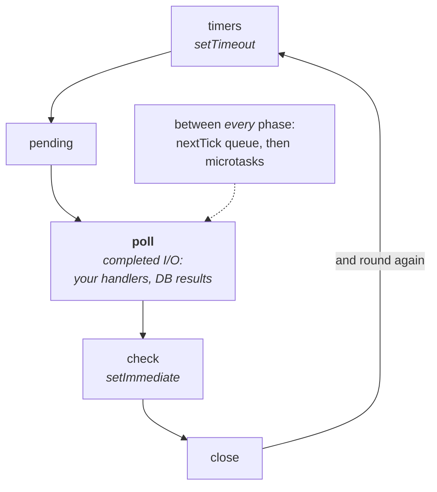
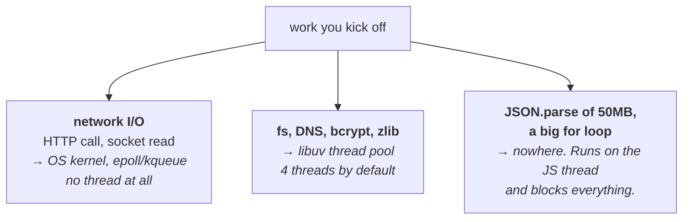

# Node.js internals

Your primary language. Interviewers go past "what is Node" into the event loop,
because that's where people either understand it or have been copying patterns.

---

## The one-sentence version

Node runs your JavaScript on **one thread**, and hands slow work (files,
network, DNS) to the operating system. When that work finishes, Node runs your
callback. That's it — everything else is detail.

The consequence you must internalise: **if your code blocks that one thread,
nothing else happens.** Not other requests, not timers, nothing.

---

## The event loop


*Microtasks drain between phases, not after all of them — which is why an await resumes before the loop moves on, not on the next lap.*

Node's loop runs through phases in order, over and over: **timers**
(`setTimeout`/`setInterval` callbacks whose time has come) → **pending** (some
deferred system errors) → **poll** (where almost everything happens — completed
I/O callbacks: your HTTP handlers, DB results) → **check** (`setImmediate`) →
**close** (`socket.on('close')`), then back to timers. Between *every* phase the
`process.nextTick` queue drains first, then the Promise microtask queue — an
`await` resumes there, not in a phase.

**Microtasks run between phases, not after all of them.** Promise callbacks and
`process.nextTick` drain completely before the loop moves on. So a promise
chain that never ends can starve the loop just as badly as a `while(true)`.

The ordering question people get asked:

```js
setTimeout(() => console.log('timeout'), 0);
setImmediate(() => console.log('immediate'));
Promise.resolve().then(() => console.log('promise'));
process.nextTick(() => console.log('nextTick'));
console.log('sync');

// sync, nextTick, promise, then timeout/immediate in a
// non-deterministic order at the top level
```

`nextTick` beats promises. Both beat anything in a loop phase. And
`setTimeout(0)` vs `setImmediate` at top level genuinely isn't deterministic —
it depends how long startup took. Inside an I/O callback, `setImmediate`
always wins, because you're already past the timers phase.

### Where work actually goes


*Only the third box is a problem, and it is the one people forget: it does not offload anywhere, so it stops every other request too.*

Your JavaScript runs on **one thread** — that's the constraint. Work you kick
off goes to one of three places. (a) Network I/O — an HTTP call, a socket read —
goes to the **OS kernel** (epoll/kqueue) and uses no thread at all. (b)
`fs.readFile`, DNS, `bcrypt.hash`, zlib go to the **libuv thread pool** (4
threads by default). (c) A `JSON.parse` of 50MB, a big `for` loop, synchronous
crypto — none of that offloads anywhere; it runs **right there on the JS
thread**, and every other request waits. Results from (a) and (b) land on the
callback queue and the event loop picks them up.

**Branch c is the only genuinely dangerous one.** Async ≠ parallel: `await`
frees the thread, a `for` loop does not. And note branch b has only four
threads — five concurrent `bcrypt` calls means the fifth queues.

Branch c — synchronous CPU work on the JS thread — is the whole reason Node is
bad at CPU-bound work, and branch b's four-thread pool is the reason `bcrypt`
on five concurrent logins queues.

## The thread pool

Node isn't purely single-threaded. **libuv keeps a pool of 4 threads by
default** (`UV_THREADPOOL_SIZE`) for work the OS can't do asynchronously:

- File system operations
- DNS lookups (`dns.lookup`)
- `crypto.pbkdf2`, `bcrypt`, zlib compression

Network I/O does **not** use the pool — that's genuinely async at the OS level
(epoll/kqueue).

**Why this matters:** hash five passwords concurrently with bcrypt and the
fifth waits, because the pool is full. That looks like a mysterious latency
spike under load, and it's a very natural follow-up given your auth background.

## Blocking the loop

The classic ways:

```js
// CPU-bound work
JSON.parse(hugeString);
array.sort();                    // on a very large array
crypto.pbkdf2Sync(...);          // the Sync variants

// Accidentally quadratic
for (const a of big) for (const b of big) { ... }

// A catastrophic regex on user input (ReDoS)
/^(a+)+$/.test(userInput);
```

Fixes, in order of preference: don't do it (stream, paginate, precompute); move
it to a **worker thread** (`worker_threads`) for CPU work; move it to a
separate service or a queue; or break it into chunks with `setImmediate` so the
loop can breathe between them.

## Scaling across cores

One process uses one core. Two options:

- **Cluster module** — forks N workers sharing a port. Built in.
- **A process manager** (PM2) or your orchestrator running N containers.
  Usually simpler in production, since you already have restarts and health
  checks there.

**Worker threads are for CPU work, not for concurrency.** They share memory via
`SharedArrayBuffer` but each has its own event loop. Don't reach for them to
handle more requests — reach for more processes.

## Memory and leaks

Node's heap defaults are modest, and the usual leak sources are dull:

- Growing a module-level array or `Map` forever (a cache with no eviction)
- Event listeners added per request and never removed — watch for
  `MaxListenersExceededWarning`
- Closures holding large objects alive
- Timers never cleared

Diagnose with heap snapshots taken minutes apart and compared, or `clinic.js`.
The tell is a heap that grows and never returns to baseline after GC.


## Building it

**Libraries — for diagnosing this, not implementing it**

| Need | Library | Why |
| --- | --- | --- |
| Find what's blocking the loop | `clinic.js` (`clinic doctor`, `clinic flame`) | Flame graphs pinpoint the synchronous function actually eating the event loop |
| Load-test to reproduce it | `autocannon` | Cheap way to generate the concurrent load that surfaces a blocking handler |
| Offload real CPU work | `piscina` (worker threads pool) | The correct fix for "Blocking the loop" — a thread pool for JS execution, distinct from libuv's I/O thread pool |

**Pseudocode — offloading with piscina**

```ts
import Piscina from 'piscina';
const pool = new Piscina({ filename: './hash-worker.js' });

app.post('/hash', async (req, res) => {
  const result = await pool.run(req.body.password);  // runs on a worker thread
  res.json({ result });                                // event loop stays free
});
```

---

## Interview Q&A

### Q: Explain the event loop.
**Level:** intermediate · **Tags:** nodejs, event-loop

<details><summary>Model answer</summary>

Node runs your JavaScript on a single thread. When you do something slow — a
network call, a file read — Node hands it to the OS and carries on. When it
finishes, your callback goes on a queue, and the event loop picks it up.

The loop has phases it cycles through: timers for `setTimeout`, a poll phase
where most I/O callbacks run, a check phase for `setImmediate`, and a close
phase. Between every phase it drains two microtask queues — `process.nextTick`
first, then promise callbacks.

That microtask detail matters: promises don't wait for the next loop iteration,
they run between phases. So an endless promise chain starves the loop just as
effectively as an infinite `for` loop.

The practical consequence of all of it is that anything CPU-heavy on that
thread blocks *everything* — every other request, every timer. Which is why
Node is excellent for I/O-bound work and poor for CPU-bound work unless you
move it off the main thread.

</details>

**Follow-ups:**

1. Q: If Node is single-threaded, how does it read files concurrently?
   <details><summary>Answer</summary>

   It isn't purely single-threaded — only *your JavaScript* is. Underneath,
   libuv keeps a thread pool, four threads by default, for work the OS can't do
   asynchronously.

   File I/O goes to that pool. So does DNS lookup, and CPU-ish built-ins like
   `crypto.pbkdf2` and zlib.

   Network I/O is different — it doesn't use the pool at all, because operating
   systems provide genuinely async network primitives like epoll and kqueue.
   That's why Node handles thousands of concurrent sockets happily but only
   four concurrent file reads.

   The gotcha worth knowing: bcrypt uses the pool. Hash five passwords at once
   and the fifth queues behind the others. Under login load that shows up as
   unexplained latency, and raising `UV_THREADPOOL_SIZE` is the usual fix.

   </details>

2. Q: A Node service becomes slow under load but CPU is only at 40%. What's happening?
   <details><summary>Answer</summary>

   40% CPU across multiple cores can still mean **one core pinned at 100%** —
   Node uses one core per process, so if you have four cores and one busy
   process, the machine reports 25%. That's the first thing I'd check: per-core
   usage, not aggregate.

   Then event loop lag — how long the loop takes to come back around. If it's in
   the hundreds of milliseconds, something is blocking, and I'd look for
   synchronous work: a big `JSON.parse`, a sort on a large array, a `Sync`
   crypto call, or a regex backtracking on user input.

   Third possibility: the thread pool is saturated. Lots of concurrent bcrypt
   or file operations queue behind four threads while the CPU looks idle,
   because they're waiting rather than working.

   Fourth: it isn't Node at all — a slow downstream, an exhausted connection
   pool, or GC pauses from a heap that's too small.

   The instrument I'd want is event loop lag as a metric, because it separates
   "we're busy" from "we're blocked", and those need different fixes.

   </details>

### Q: How do you handle CPU-heavy work in Node?
**Level:** senior · **Tags:** nodejs, performance, workers

<details><summary>Model answer</summary>

First, try not to do it on the request path at all. Stream instead of buffering,
paginate instead of processing everything, precompute and cache, or push it to
a background job. Most "CPU-heavy in Node" problems are really design problems.

If it genuinely has to happen in-process, **worker threads**. They each get
their own event loop and V8 isolate, so the main thread stays responsive, and
you can share memory through `SharedArrayBuffer` when copying would be
expensive. Good for image processing, big parsing jobs, heavy crypto.

If it's substantial, a **separate service** is often better — possibly in a
language better suited to it. That's a legitimate use for Go alongside Node.

And if it's naturally chunkable, break it up and yield with `setImmediate`
between chunks so the loop can serve other requests in between. Cruder, but it
needs no new infrastructure.

The thing I'd be clear about: worker threads are for CPU work, not for handling
more requests. For concurrency you want more processes — cluster, or more
containers — because that's what actually uses more cores for I/O.

</details>

---

## What a weak answer sounds like

- **"Node is single-threaded."** True of your JavaScript, but there's a thread
  pool underneath, and that distinction explains real production behaviour.
- **"Async means it runs in parallel."** Async means it doesn't block. One
  thread still runs your code.
- **Reaching for worker threads to handle more traffic.** That's what processes
  are for.
- **No idea what blocks the loop.** It's the single most common Node
  performance bug.
- **Not knowing microtasks run between phases.**

---

## Glossary

- **Event loop** — the cycle that picks up completed work and runs callbacks.
- **libuv** — the C library providing the loop and the thread pool.
- **Thread pool** — 4 threads by default, for file I/O, DNS and some crypto.
- **Microtask** — `nextTick` and promise callbacks; run between phases.
- **Event loop lag** — how delayed the loop is; the key health metric.
- **Worker threads** — separate isolates for CPU work.
- **Cluster** — forking processes to use multiple cores.
- **ReDoS** — a regex that backtracks catastrophically on crafted input.
