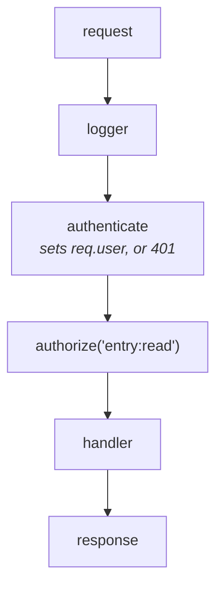
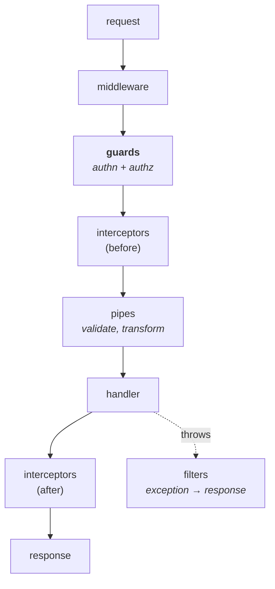

# Express, NestJS and Fastify

Three frameworks on your resume. The useful thing to know is what each is
*for*, and where NestJS's structure earns its complexity.

---

## The three in one table

| | **Express** | **Fastify** | **NestJS** |
| --- | --- | --- | --- |
| Style | Minimal, unopinionated | Minimal, performance-focused | Opinionated, structured |
| Structure | You decide everything | You decide everything | Modules, DI, decorators |
| Speed | Baseline | ~2× Express | Runs on Express *or* Fastify |
| Good for | Small services, full control | High-throughput APIs | Large apps, big teams |
| Cost | Every project looks different | Smaller ecosystem | Learning curve, more ceremony |

**NestJS isn't a competitor to the other two** — it's a layer on top. You pick
Express or Fastify as its underlying HTTP adapter.

---

## Express: middleware is the whole idea


*Middleware runs in registration order, which is the whole model — put authenticate before anything that reads req.user or it is simply undefined.*

Everything is a function that gets `(req, res, next)` and either responds or
calls `next()`.

```js
app.use(logger);          // runs on every request
app.use(authenticate);    // attaches req.user, or responds 401
app.get('/entries', authorize('entry:read'), handler);
```

Order matters — middleware runs in the order you register it. Put
authentication before anything that needs `req.user`.

**Error handling is the bit people get wrong.** Express identifies an error
handler by its **four** arguments:

```js
app.use((err, req, res, next) => { ... });   // 4 args = error handler
```

And in Express 4, **errors thrown in async handlers are not caught** — the
request hangs until it times out. You either wrap every async handler or use a
helper:

```js
const wrap = fn => (req, res, next) => Promise.resolve(fn(req, res, next)).catch(next);
app.get('/x', wrap(async (req, res) => { ... }));
```

Express 5 fixes this by forwarding rejected promises automatically.

---

## Passport.js: authentication as middleware

The de-facto authentication middleware for Express, and it sits exactly where
the previous section leaves off — `authenticate` in that chain is usually
Passport.

The model is small and worth being able to state in one breath: **a strategy
verifies a credential and hands back a user; Passport puts it on `req.user`.**
Everything else is a strategy — `passport-local` for username/password,
`passport-jwt` for a bearer token, `passport-saml` for SAML SSO,
`openid-client` for OIDC, plus one per social provider.

```js
passport.use(new JwtStrategy(
  { jwtFromRequest: ExtractJwt.fromAuthHeaderAsBearerToken(), secretOrKeyProvider: jwks },
  // done(err, user) - the whole contract. Return false, not an error, for a
  // valid-but-unknown subject: it is a 401, not a 500.
  async (payload, done) => {
    const user = await users.findById(payload.sub);
    return user ? done(null, user) : done(null, false);
  },
));

app.get('/entries', passport.authenticate('jwt', { session: false }), handler);
```

**Sessions vs stateless is the decision people get wrong.** By default Passport
establishes a login session and needs `serializeUser`/`deserializeUser` to
decide what goes in the session store. For a token-authenticated API you want
`{ session: false }` on every call — otherwise you are minting a server-side
session per request, which quietly recreates the state you chose JWTs to avoid.

**What it does and doesn't give you.** It authenticates. It has no opinion at
all about authorization — no roles, no permissions, no policy. That is your
`authorize('entry:read')` middleware and, at your scale, OPA/Rego behind it.
Confusing the two is the single most common Passport mistake, and being clear
about the boundary is a good signal.

**Where teams outgrow it**, which is the interesting half of the answer:

- It is Express-shaped. On NestJS you use `@nestjs/passport`, which wraps it in
  guards; on Fastify the ecosystem prefers `@fastify/jwt` and plugins.
- Many strategies are thin, lightly maintained community packages. For anything
  load-bearing — SAML, OIDC — a maintained protocol library (`openid-client`,
  and see [SAML](../01-auth-identity/04-saml-sso.md) for why signature and
  audience validation is where the bugs live) beats a wrapper you have to audit
  yourself.
- Once you are the identity provider rather than a consumer of one, Passport
  covers only the front door. Token issuance, refresh rotation, introspection
  and session governance all sit outside it.

That last point is the honest framing for your own background: Passport is the
right tool for adding login to an application, and the wrong shape for building
the auth platform other applications log into.

---

## Fastify: speed and schemas

Faster mostly because of **schema-based serialisation**. You declare the shape
of your response, and Fastify compiles a fast serialiser for it instead of
using generic `JSON.stringify`.

```js
fastify.get('/user/:id', {
  schema: {
    params: { type: 'object', properties: { id: { type: 'string' } } },
    response: {
      200: { type: 'object', properties: { id: {type:'string'}, name: {type:'string'} } }
    }
  }
}, handler);
```

Two benefits beyond speed, and they're the ones worth mentioning:

- **Input validation is free** — the schema rejects bad requests before your
  handler runs.
- **Response serialisation only emits declared fields.** So a field you forgot
  to strip — a password hash, an internal flag — simply doesn't get sent. That's
  a genuine security benefit, not just a performance one.

Fastify uses **plugins with encapsulation**: something registered inside a
plugin is scoped to it, rather than Express's global middleware chain. Cleaner
for larger apps.

---

## NestJS: structure for teams

Angular-inspired: modules, dependency injection, decorators.

```ts
@Controller('entries')
export class EntriesController {
  constructor(private readonly entries: EntriesService) {}   // injected

  @Get(':id')
  @UseGuards(AuthGuard, PermissionGuard)                     // authz here
  findOne(@Param('id') id: string) {
    return this.entries.findOne(id);
  }
}
```

### The request pipeline — worth knowing in order


*Guards are where RBAC belongs: a permission declared next to the route and enforced centrally, rather than an if-statement someone can forget inside a handler.*

A request passes through **middleware → guards → interceptors (before) → pipes →
handler → interceptors (after) → response**, and a thrown exception is diverted
to **filters**, which turn it into a response.

- **Guards** — return true/false. This is where authentication and
  authorization live.
- **Interceptors** — wrap the handler; logging, timing, response shaping,
  caching.
- **Pipes** — validate and transform input (`ValidationPipe` with
  `class-validator`).
- **Filters** — catch exceptions and turn them into responses.

**Why this matters for you:** guards are the natural place for RBAC. A
`@RequirePermission('entry:publish')` decorator plus a guard that checks it
means authorization is declared next to the route and enforced centrally —
rather than an `if` statement someone can forget inside a handler. That's
exactly the "make correct auth the easy path" argument from your auth package
story.

### Dependency injection

You declare what you need in the constructor; Nest supplies it. The real
benefit is testing — swap a real service for a mock without touching the class
under test.


## Building it

**Pseudocode — the `PermissionGuard` from the pipeline above**

The controller snippet already shows `@UseGuards(AuthGuard, PermissionGuard)`;
here's what actually goes inside it, wiring the RBAC library from
[rbac-abac](../01-auth-identity/08-rbac-abac.md) into the framework's guard
stage rather than a hand-checked `if`:

```ts
@Injectable()
export class PermissionGuard implements CanActivate {
  constructor(private reflector: Reflector, private enforcer: Enforcer) {}

  async canActivate(ctx: ExecutionContext): Promise<boolean> {
    const required = this.reflector.get<string>('permission', ctx.getHandler());
    const { user, params } = ctx.switchToHttp().getRequest();
    return this.enforcer.enforce(user.id, user.tenantId, params.id, required);
  }
}
```

This is what "guards are where RBAC belongs" cashes out to in code: the
permission is a decorator argument on the route, not a line buried in the
handler someone can forget to add.

---

## Interview Q&A

### Q: When would you choose NestJS over Express?
**Level:** intermediate · **Tags:** nestjs, express, architecture

<details><summary>Model answer</summary>

It's really a question about team size and application lifetime.

Express gives you nothing and asks nothing. That's ideal for a small service or
when you want full control — but on a large codebase with several people, every
module ends up structured differently, because there's no convention to follow.

NestJS gives you modules, dependency injection, and a defined request pipeline.
The value is consistency: any developer opening any module finds the same
shape. The DI also makes testing much easier, since you inject mocks instead of
monkey-patching.

The cost is real: more ceremony, a learning curve, and a lot of boilerplate for
a small service.

So: Express or Fastify for something small and focused; NestJS when the
codebase will be large, long-lived, and worked on by several people. For an
auth platform with many endpoints and consistent cross-cutting concerns, Nest's
guards and interceptors are worth the overhead on their own.

</details>

**Follow-ups:**

1. Q: What are guards, and why put authorization there?
   <details><summary>Answer</summary>

   A guard runs before the handler and returns true or false — proceed, or
   reject with a 403.

   Putting authorization there means it's **declarative and central**. You write
   `@UseGuards(PermissionGuard)` with a required permission next to the route,
   and one guard implementation enforces it everywhere. Compare that with an
   `if` check at the top of each handler, which someone will eventually forget
   on a new endpoint — and a missing authorization check fails silently, because
   nothing errors, it just permits.

   It also keeps handlers focused on business logic rather than access control,
   and it means changing how permissions are evaluated is one file rather than
   a hundred.

   That's the same argument as the shared auth package: make the correct thing
   the default path so it can't be skipped by accident.

   </details>

2. Q: Where does Fastify's speed actually come from?
   <details><summary>Answer</summary>

   Mostly serialisation. If you declare a response schema, Fastify compiles a
   purpose-built serialiser for that exact shape, which is substantially faster
   than generic `JSON.stringify` — and for a JSON API, serialisation is a large
   share of the per-request cost.

   It also has a faster router (radix tree), a lighter internal middleware
   model, and schema-based input validation that rejects bad requests before
   your code runs.

   The part I find more interesting than the speed is that response schemas
   **only emit declared fields**. A field you forgot to strip — a password
   hash, an internal flag — is simply not serialised. That turns "remember to
   sanitise output" into something the framework enforces.

   Honest caveat: for most applications the framework isn't the bottleneck. The
   database is. Choosing Fastify for raw throughput matters at high request
   rates; below that, the schema-driven validation is the better reason.

   </details>

### Q: How do you handle errors in an Express app?
**Level:** intermediate · **Tags:** express, errors

<details><summary>Model answer</summary>

Express recognises an error handler by its arity — four arguments,
`(err, req, res, next)` — and it should be registered last, after all routes.

The trap is async. In Express 4, a rejected promise inside an async handler is
**not** caught, so the request just hangs until the client times out and you
get no error at all. You either wrap every async handler in something that
catches and calls `next(err)`, or use a library that does it. Express 5 forwards
rejections automatically, which removes the footgun.

Beyond the mechanics, what I'd want in the handler: distinguish operational
errors (bad input, not found, unauthorised) from programmer errors, since the
first are expected and the second mean something is broken. Log with a
correlation id so one request can be traced across services. Never leak stack
traces or internal messages to the client. And return a consistent error shape,
because clients have to parse it.

For an auth service specifically, error messages need care: "user not found"
versus "wrong password" tells an attacker which usernames exist. The response
should be the same either way.

</details>

---

## What a weak answer sounds like

- **"NestJS is better than Express."** Different tools. Nest runs *on* Express.
- **Not knowing async errors are unhandled in Express 4.** It's the most common
  real bug in Express apps.
- **Authorization inside handlers** rather than in guards or middleware —
  it's the pattern that leads to a forgotten check.
- **"Fastify is faster"** with no idea why.

---

## Glossary

- **Middleware** — a function in the request chain; calls `next()` or responds.
- **Guard** — Nest's yes/no check before a handler; where authz belongs.
- **Interceptor** — wraps the handler, before and after.
- **Pipe** — validates and transforms input.
- **Filter** — turns exceptions into responses.
- **DI** — dependencies supplied by the framework, not constructed by hand.
- **Response schema** — declares output shape; faster, and only emits declared
  fields.
- **Encapsulation (Fastify)** — plugin-scoped registration instead of global.
- **Strategy (PassportJS)** — a credential verifier; returns a user, or
  `false` for valid-but-unknown, which is a 401 rather than a 500.
- **`{ session: false }`** — tells PassportJS not to mint a server-side
  session per request; what you want for a token-authenticated API.
