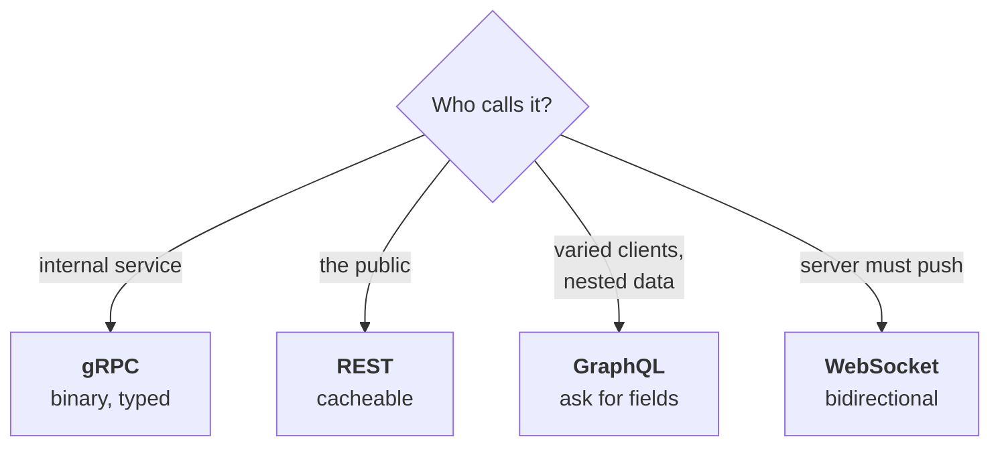

# REST, GraphQL, gRPC and WebSockets

Four ways for systems to talk. The interview question is never "what is REST" —
it's "why did you pick this one", which you answered in real life when you
chose gRPC for the auth package.

---

## In brief

- **Start from who calls it, not from abstract merits.** Internal
  service-to-service → gRPC; server must push to a live client →
  WebSocket (or SSE for one-way); public/browser with uniform data →
  REST; public/browser with wildly varying client needs → GraphQL. The
  edge and the interior have different needs, which is why a platform
  commonly runs REST outside and gRPC inside rather than picking one.
- **401 vs 403 is the one to get right in an auth interview**: 401 means
  "I don't know who you are," 403 means "I know, and no." Getting this
  backwards is a specific, checkable tell.
- **GraphQL's N+1 problem is invisible in the query itself** — a query for
  100 users and their posts naively becomes 101 database queries, one per
  resolver call. DataLoader batches and dedupes keys within a request
  (101 queries → 2), and knowing that name specifically is the signal.
- **GraphQL authorization has to live at the resolver level, not the
  endpoint** — a single query can traverse into data the caller shouldn't
  reach, since there's no one endpoint to gate. This is more surface area
  to get right than REST's one-check-per-endpoint model.
- **Protobuf field numbers are the wire contract, and they're
  append-only**: adding a field is safe (old clients ignore it); removing
  one must mark the number `reserved` so nothing reuses it; changing a
  type breaks everything. This additive-only discipline is what lets nine
  teams run different client versions against the same server
  indefinitely, without a synchronized deploy.
- **gRPC's real cost is at the edge, not internally**: browsers need
  grpc-web plus a proxy, you can't easily `curl` it, and load balancers
  need HTTP/2 awareness — naive L4 balancing sends all of one client's
  calls to a single server because connections are long-lived. None of
  that matters for service-to-service traffic, which is exactly where
  gRPC fits.
- **WebSockets need the same "recheck periodically" discipline as any
  long-lived session** — authenticating only at the handshake means a
  terminated user with an already-open socket keeps receiving data past
  their revocation.

---

## The comparison


*Start from who calls it and the choice usually makes itself — arguing the merits in the abstract is how this question gets failed.*

| | **REST** | **GraphQL** | **gRPC** | **WebSocket** |
| --- | --- | --- | --- | --- |
| Format | JSON over HTTP | JSON over HTTP | Protobuf over HTTP/2 | Any, over TCP |
| Shape | Resources + verbs | One endpoint, you ask for fields | Typed method calls | Bidirectional stream |
| Contract | OpenAPI (optional) | Schema (required) | `.proto` (required) | Yours |
| Browser | Native | Native | Needs grpc-web | Native |
| Best at | Public APIs | Varied clients, nested data | Internal service calls | Real-time push |
| Weak at | Over/under-fetching | Caching, query cost | Browsers, debuggability | Scaling stateful conns |

### Choosing between them

Start from **who calls it**. Service-to-service and internal → **gRPC** (binary,
typed contract, HTTP/2 connection reuse). Server pushing to a live client →
**WebSocket**, or **SSE** if it's one-way. Browser or public API → then ask
whether clients need wildly different shapes of data: no → **REST** (cacheable,
debuggable, universally understood); yes, deeply nested → **GraphQL**, at the
cost of caching and per-field authz.

That first split is the one that matters: **the edge and the interior have
different needs**, which is why a platform commonly runs REST outside and gRPC
inside rather than picking one.

---

## REST

Resources as nouns, HTTP verbs as actions. `GET /entries/123`.

The parts people get wrong:

- **Verbs have meanings.** `GET` is safe (no side effects) and `GET`, `PUT`,
  `DELETE` are idempotent. `POST` isn't. Those aren't style rules — caches,
  proxies and retry logic depend on them.
- **Status codes matter.** 400 (your request is malformed), 401 (not
  authenticated), 403 (authenticated but not allowed), 404, 409 (conflict), 422
  (understood but invalid), 429 (rate limited).
- **401 vs 403 is the one to get right in an auth interview.** 401 means "I
  don't know who you are"; 403 means "I know, and no".

**Over-fetching and under-fetching** are its main weaknesses: an endpoint
returns more than a mobile client needs, or a screen needs three calls to
assemble one view.

---

## GraphQL

One endpoint. The client sends a query naming exactly the fields it wants.

Great when you have many different clients with different needs, or deeply
nested data. The costs are real and worth naming:

- **Caching is harder.** REST caches on URL; every GraphQL request is a POST to
  the same URL with a different body, so HTTP caching doesn't apply.
- **N+1 queries.** A query for 100 users each with their posts naively becomes
  101 database queries. **DataLoader** batches and dedupes within a request —
  if you mention GraphQL, know this.
- **Unbounded query cost.** A client can request something enormous. You need
  query depth limits, complexity scoring, or persisted queries.
- **Authorization is per-field**, not per-endpoint, which is more surface area
  to get right.

That last point is worth raising given your background: with REST you check
permission at the endpoint. With GraphQL a single query can traverse into data
the user shouldn't see, so checks have to live at the resolver level.

---

## gRPC

Typed remote calls. You define the contract in a `.proto` file and generate
client and server code from it.

```protobuf
service AuthService {
  rpc CheckPermission(CheckRequest) returns (CheckResponse);
}
message CheckRequest {
  string user_id = 1;      // field NUMBERS are the wire contract
  string tenant_id = 2;
  string permission = 3;
}
```

**Why it fits internal service calls:**

- **Protobuf is compact and fast** — binary, much cheaper to serialise than
  JSON. On a hot path multiplied by every request, that matters.
- **HTTP/2 multiplexes** many calls over one connection, so there's no
  per-call handshake.
- **Generated clients** mean a breaking change is a compile error in the
  consuming service, not a 3am runtime surprise.
- **Streaming** in either or both directions.

**Where it's bad:** browsers can't speak it natively (grpc-web needs a proxy);
you can't `curl` it easily; load balancers need HTTP/2 awareness, and because
connections are long-lived, naive L4 balancing sends all of one client's calls
to one server.

### Protobuf compatibility — the rule that matters

**Field numbers are the contract.** Never reuse or renumber them.

- Adding a field: fine, old clients ignore it.
- Removing a field: mark it `reserved` so nobody reuses the number.
- Changing a type: breaks everything.

This is what lets nine teams run different versions against the same server —
which was exactly your situation. You can't deploy nine services at once, so
the wire format has to tolerate mixed versions indefinitely.

---

## WebSockets

A persistent bidirectional connection. For genuine push — chat, collaboration,
live dashboards.

The hard part is that they're **stateful**: a connection lives on one server,
so you need a pub/sub backplane (Redis) for any instance to reach any
connection. See
[messaging streams](../02-google-loop/27-messaging-streams.md).

**Auth note:** authenticate at the handshake, then re-check periodically. A
long-lived socket outlives token expiry and session revocation, so a terminated
user can keep receiving data over an already-open connection.


## Building it

**Libraries**

| Style | Library | Why |
| --- | --- | --- |
| REST | Express or Fastify — see [frameworks](02-frameworks.md) | Already covered there; nothing style-specific to add |
| GraphQL | `apollo-server` or `graphql-yoga` | Schema-first, resolver wiring, and query-cost limiting out of the box |
| gRPC | `@grpc/grpc-js` + `ts-proto` | `ts-proto` generates typed clients/servers from `.proto` — avoids hand-writing the generated code |
| WebSocket | `ws` (bare) or `socket.io` | `socket.io` adds rooms, reconnection and fallback transport; `ws` when you want nothing extra |

**Pseudocode — a gRPC service, since it's the one you actually shipped**

```proto
service AuthzService {
  rpc Check (CheckRequest) returns (CheckResponse);
}
```

```ts
// server
server.addService(AuthzService, {
  check: async (call, callback) => {
    const allowed = await enforcer.enforce(call.request.userId, call.request.action);
    callback(null, { allowed });
  },
});

// client, from any service consuming the auth package
const res = await authzClient.check({ userId, action: 'entry:publish' });
```

---

## Interview Q&A

### Q: Why did you choose gRPC over REST for an internal service?
**Level:** intermediate · **Tags:** grpc, api-design

<details><summary>Model answer</summary>

Three reasons, in order of importance.

**It was on the hot path.** Every request in every service made an
authorization call, so per-call cost multiplied by total platform traffic.
Protobuf is binary and much cheaper to serialise than JSON, and HTTP/2 reuses
connections so there's no per-call handshake.

**Typed contracts.** The `.proto` file *is* the contract, and clients are
generated from it. Across nine consuming teams that's worth a lot — a breaking
change surfaces as a compile error rather than a runtime failure in someone
else's service.

**Streaming**, if we needed to push policy or revocation updates rather than
having every service poll.

The honest counterpoint is that gRPC is worse at the edge — browsers need
grpc-web and a proxy, it's harder to debug with curl, and load balancers need
HTTP/2 awareness. None of that applies to internal service-to-service calls,
which is exactly where it fits.

For a public API I'd still choose REST, because ubiquity and debuggability
matter more there than serialisation cost.

</details>

**Follow-ups:**

1. Q: How do you make a breaking change across nine teams?
   <details><summary>Answer</summary>

   You don't, is the short answer — you avoid needing to, because you can't
   deploy nine services simultaneously and any design requiring that will fail.

   On the wire, be additive only: never reuse or renumber a field, mark removed
   fields `reserved`, never change a type. Old clients then keep working against
   a newer server indefinitely, which is the property you need when you don't
   control anyone's deploy schedule.

   If a genuine breaking change is unavoidable, run both versions in parallel —
   a new method name, or a versioned service — migrate teams individually with
   help, and only then remove the old one, with a deadline that's communicated
   early and actually enforced. Without a deadline nobody moves.

   And instrument it: log which version each caller uses, so you know when
   usage of the old path has actually hit zero rather than assuming.

   </details>

2. Q: What's the N+1 problem in GraphQL and how do you fix it?
   <details><summary>Answer</summary>

   A query asks for 100 users and each user's posts. The resolver for users
   runs one query, then the posts resolver runs once **per user** — 101 queries
   for one request. It's invisible in the query itself, which is what makes it
   dangerous: the client wrote something innocuous.

   The standard fix is **DataLoader**. Instead of querying immediately, each
   resolver registers the key it needs; DataLoader collects them within a tick,
   issues one batched query for all of them, and hands each resolver its result.
   It also dedupes repeated keys within the request.

   So 101 queries become 2. It's per-request, so there's no stale-cache risk.

   Alternatives: look ahead at the query AST and join up front, or precompute.
   But DataLoader is the standard answer and knowing the name matters.

   The broader point is that GraphQL moves query planning from the server to the
   client, so the server needs its own defences — batching, depth limits,
   complexity scoring — or a client can accidentally write something very
   expensive.

   </details>

### Q: When is REST the better choice?
**Level:** intermediate · **Tags:** rest, api-design

<details><summary>Model answer</summary>

For public APIs, almost always. Everyone knows it, every language has a client,
you can debug it with curl, and it works through every proxy and browser.

It also gets HTTP caching for free — cache on URL, use ETags and
`Cache-Control` — which GraphQL largely gives up, since every request is a POST
to the same endpoint.

And it's simple to reason about: one URL, one resource, one obvious permission
check at the endpoint. With GraphQL, authorization moves to the field level,
because a single query can traverse into data the caller shouldn't reach.
That's more surface area to get right, and it's a genuine security
consideration rather than a style preference.

I'd reach for GraphQL when there are many different clients with genuinely
different data needs, or when the data is deeply nested and REST would mean
lots of round trips. And gRPC for internal service calls where performance and
typed contracts matter.

The pattern I'd actually build is often all three: REST at the public edge,
gRPC internally, GraphQL only if client diversity justifies it.

</details>

---

## What a weak answer sounds like

- **"GraphQL is better than REST."** Different trades; GraphQL gives up HTTP
  caching and adds query-cost and per-field authorization problems.
- **Not knowing 401 vs 403** — bad in any interview, worse in an auth one.
- **"gRPC is faster"** with no mention of Protobuf, HTTP/2, or the edge
  drawbacks.
- **Not knowing DataLoader** while claiming GraphQL.
- **Reusing Protobuf field numbers.** Silently corrupts data for old clients.

---

## Quiz

### MCQ: What's the recommended starting question for choosing between REST, GraphQL, gRPC, and WebSockets?
- [ ] Which one is fastest in benchmarks?
- [x] Who calls it — internal service, public client, varied clients needing different shapes, or a server that must push data?
- [ ] Which one the team already knows best
- [ ] Which one has the most mature tooling
**Why:** Arguing the abstract merits of each style is how this question gets failed — starting from the caller's actual needs (internal vs. public, uniform vs. varied data, push vs. pull) usually makes the choice itself.

### MCQ: In HTTP status codes, what's the difference between 401 and 403?
- [ ] They're interchangeable synonyms
- [x] 401 means "I don't know who you are" (not authenticated); 403 means "I know who you are, and you're not allowed" (authenticated but not authorized)
- [ ] 401 is for GET requests; 403 is for POST requests
- [ ] 403 always implies a server-side bug
**Why:** Getting this backwards is a specific, checkable mistake — especially costly in an interview for an auth-focused role, where the two codes map to fundamentally different failure states.

### MCQ: Why does a GraphQL query for 100 users, each with their posts, naively trigger 101 database queries?
- [ ] GraphQL always executes queries twice for validation
- [x] Each field resolver runs independently — the users resolver runs once, then the posts resolver runs once per individual user, with no batching by default
- [ ] The GraphQL schema requires separate queries for each field type
- [ ] It's a bug specific to one GraphQL server implementation
**Why:** This is the N+1 problem — it's invisible in the query itself, which is exactly what makes it dangerous: a client can write something innocuous-looking that generates a huge number of database round trips.

### MCQ: How does DataLoader fix the GraphQL N+1 problem?
- [ ] It caches every query result indefinitely across all requests
- [x] It collects the keys each resolver needs within a tick, issues one batched query for all of them, and dedupes repeated keys within that single request
- [ ] It rewrites the client's GraphQL query into SQL directly
- [ ] It limits how many fields a client can request per query
**Why:** 101 individual queries become effectively 2 batched ones — and because batching happens per-request, there's no stale-cache risk the way a longer-lived cache would introduce.

### MCQ: Why does authorization in GraphQL need to happen at the resolver level rather than at a single endpoint check?
- [ ] GraphQL doesn't support endpoint-level authorization at all
- [x] A single GraphQL query can traverse into deeply nested data the caller shouldn't be able to see, since there's no one endpoint boundary to gate the whole request
- [ ] Resolver-level checks are faster than endpoint-level checks
- [ ] It's a GraphQL server configuration requirement, not a security concern
**Why:** With REST, one endpoint maps to one permission check; with GraphQL, one query can reach many different pieces of data, so each resolver needs its own authorization check — more surface area to get right.

### MCQ: In Protobuf, what happens if you remove a field from a `.proto` message definition without marking its number `reserved`?
- [ ] Nothing — Protobuf automatically prevents number reuse
- [x] A future field could be assigned the same number, causing old clients (or old serialized data) to misinterpret that field's data as the new one — silent data corruption
- [ ] The build simply fails with a compile error
- [ ] It only affects performance, not correctness
**Why:** Field numbers are the actual wire contract in Protobuf — `reserved` prevents a future developer from accidentally reusing a number that already has a meaning baked into deployed clients or stored data.

### MCQ: Why can nine different teams run different client versions against the same gRPC server indefinitely, without a synchronized deploy?
- [ ] gRPC automatically translates between different protocol versions
- [x] Protobuf's additive-only compatibility rule (never reuse/renumber fields, mark removed fields reserved) means old clients keep working correctly against a newer server
- [ ] gRPC servers run a separate instance for each client version
- [ ] Field numbers are ignored at runtime, so mismatches don't matter
**Why:** This discipline is exactly what makes a wire format tolerant of mixed versions — you can't force nine independent teams to deploy simultaneously, so the contract itself has to remain backward compatible.

### MCQ: What makes gRPC poorly suited for browser-facing, public-facing APIs specifically?
- [ ] It's slower than REST at every scale
- [x] Browsers can't speak gRPC natively (requiring grpc-web plus a proxy), it's hard to debug with `curl`, and load balancers need HTTP/2 awareness — none of which matter for internal service calls
- [ ] gRPC doesn't support JSON payloads at all
- [ ] gRPC requires a paid license for public use
**Why:** These are all edge-specific costs — they don't apply to service-to-service traffic, which is exactly why a platform often runs gRPC internally and REST at the public edge rather than choosing one universally.

### MCQ: Why does naive Layer 4 load balancing cause problems for gRPC specifically, compared to typical REST traffic?
- [ ] gRPC doesn't use TCP, so L4 balancing can't route it at all
- [x] gRPC connections are long-lived (HTTP/2, multiplexed), so L4 balancing — which routes at the connection level — can send all of one client's many calls to a single server instead of spreading them
- [ ] L4 balancers can't parse binary Protobuf payloads
- [ ] gRPC requires a minimum of three backend servers to function
- [ ] REST doesn't work with L4 load balancers either
**Why:** REST's typical short-lived HTTP/1.1 connections get load-balanced roughly per-request; gRPC's persistent multiplexed connection means the balancing decision happens once per connection, not per call, unskewing it requires L7 (HTTP/2-aware) balancing.

### MCQ: Why must a WebSocket connection be re-authenticated or re-checked periodically, not just verified once at the handshake?
- [ ] WebSocket connections automatically expire every 60 seconds
- [x] A long-lived socket connection can outlive the user's token expiry or an explicit session revocation, so a terminated user could keep receiving data over an already-open connection
- [ ] Handshake-time authentication is technically impossible for WebSockets
- [ ] It's only a concern for connections lasting longer than 24 hours
**Why:** Unlike a typical REST request that re-authenticates on every call, a WebSocket's single handshake-time check doesn't automatically get re-validated as the connection stays open — revocation needs an explicit mechanism to actually close it.

---

## Glossary

- **Idempotent verb** — `GET`, `PUT`, `DELETE`; safe to retry.
- **Over/under-fetching** — getting more than you need, or needing more calls.
- **Resolver** — the function producing one GraphQL field.
- **DataLoader** — batches and dedupes resolver loads within a request.
- **Persisted query** — a pre-registered GraphQL query, referenced by id.
- **Protobuf field number** — the wire contract; never reuse or renumber.
- **HTTP/2 multiplexing** — many concurrent calls on one connection.
- **grpc-web** — a proxy layer letting browsers speak gRPC.
