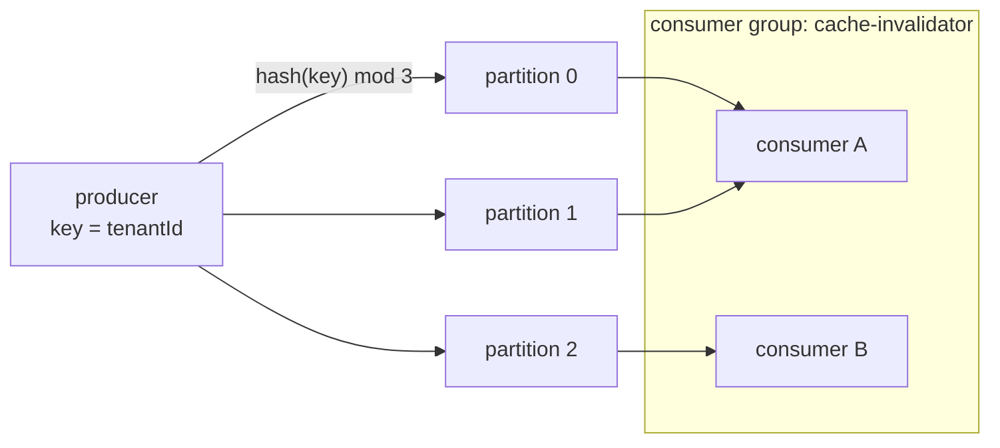
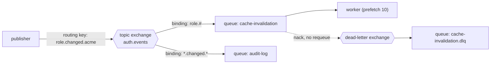
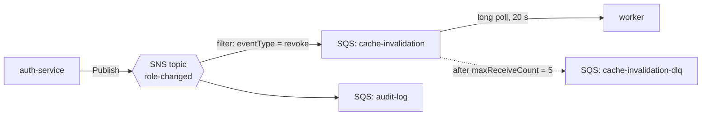

# Messaging in practice: Kafka, RabbitMQ, SQS and SNS

[Messaging, queues and streams](../02-google-loop/27-messaging-streams.md)
teaches the theory: queue vs log, ordering per partition, ack timing and
delivery semantics. This chapter is the other half — how the three brokers you
will actually be asked about **work and are wired up**. Kafka and RabbitMQ are
on your resume; SQS and SNS are what an AWS shop uses for the same jobs.

*In the interview: "Kafka or RabbitMQ?" is the warm-up. The follow-ups are
where it's decided — what happens on a consumer crash, how you retry without
blocking, how you get exactly-once, what you'd use on AWS instead.*

---

## The three, in one table

| | **Kafka** | **RabbitMQ** | **SQS (+ SNS)** |
| --- | --- | --- | --- |
| Model | Partitioned, replicated **log** | **Broker** routing messages into queues | Managed **queue** (SQS); managed **pub/sub** (SNS) |
| Consumers | Consumer groups; each partition read by one member | Compete on a queue | Compete on a queue |
| Replay | Yes — rewind the offset | No — acked means gone | No (after deletion) |
| Ordering | Per partition (per key) | Per queue, single consumer | Standard: best-effort. FIFO: per `MessageGroupId` |
| Routing | By topic + key → partition | **Exchanges** + bindings (rich) | SNS filter policies; EventBridge rules |
| Retry / DLQ | Build it: retry topics + DLQ topic | Dead-letter exchange + TTL | Redrive policy `maxReceiveCount` → DLQ |
| You run it? | Yes, or MSK / Confluent Cloud | Yes, or Amazon MQ / CloudAMQP | No — fully managed |
| Reach for it when | Event streams, many consumers, replay, high throughput | Work queues, complex routing, per-message control | You're on AWS and want zero ops |

---

## Kafka


*The key picks the partition, the partition is the unit of order, and within a group each partition has exactly one reader. Adding a third consumer here helps; a fourth would sit idle.*

### Who's who

| Part | What it is |
| --- | --- |
| **Topic** | A named stream, split into **partitions** |
| **Partition** | An append-only, ordered log; messages get increasing **offsets** |
| **Key** | Chooses the partition (`hash(key) mod partitions`) — same key, same partition, same order |
| **Broker** | A Kafka server; each partition has one **leader** and follower **replicas** |
| **ISR** | In-sync replicas — the followers caught up with the leader |
| **Consumer group** | Consumers sharing the work: each partition assigned to one member |
| **Committed offset** | Where the group resumes after a restart, stored in the `__consumer_offsets` topic |

### The steps, from produce to commit

1. The producer serialises the message and hashes the **key** to a partition.
   No key → spread across partitions (no ordering).
2. It sends to that partition's **leader**. With `acks=all`, the leader
   replies only when every in-sync replica has the write; with
   `min.insync.replicas=2` and replication factor 3, a write succeeds only if
   at least two copies exist — so losing one broker loses no acknowledged data.
3. With the **idempotent producer** (`enable.idempotence=true`, the default
   since Kafka 3.0), each message carries a producer id and sequence number, so
   a retried send after a timeout is de-duplicated by the broker instead of
   written twice.
4. A consumer in the group is assigned partitions and **polls** batches from
   its committed offset.
5. It processes each message, then **commits** the offset of the *next*
   message to read. Commit after processing → at-least-once. Commit before →
   at-most-once.
6. If a consumer dies or a new one joins, the group **rebalances**: partitions
   move, and the new owner resumes from the last committed offset — so
   anything processed but not yet committed is processed again. That's why
   handlers must be **idempotent**.

### What each setting protects against

| Setting | Stops | Without it |
| --- | --- | --- |
| `acks=all` + `min.insync.replicas=2` | Losing acknowledged writes when a broker dies | `acks=1` loses whatever the leader had not replicated |
| Idempotent producer | Duplicates from producer retries | A network timeout + retry writes the message twice |
| Keying by the ordered entity | Out-of-order processing for one entity | Events for one tenant land on different partitions |
| Manual commit after processing | Silently skipping messages on a crash | Auto-commit may commit before your handler finishes |
| Cooperative-sticky assignor / static membership | Stop-the-world rebalances on every deploy | Every restart pauses the whole group |

**Exactly-once in Kafka's sense.** Transactions (`transactional.id`) let a
producer write to several partitions *and* commit consumer offsets atomically,
and consumers with `isolation.level=read_committed` never see aborted writes.
That gives exactly-once for **Kafka → Kafka** pipelines (read, transform,
write). The moment the side effect is outside Kafka — a database write, an
email — you are back to at-least-once plus an idempotent handler.

**Log compaction** (`cleanup.policy=compact`) keeps only the latest message per
key, forever, and a message with a null value (a **tombstone**) deletes the
key. It turns a topic into a changelog you can rebuild a table from — for
example the current role assignments per user.

**Retries without blocking the partition.** Kafka has no built-in DLQ for
consumers. The pattern: on a retryable failure, publish the message to
`topic.retry.1m` (consumed by a worker that waits until the message is a
minute old), then `topic.retry.10m`, then `topic.dlq`, and **commit the
original** so the partition keeps moving. Never retry forever in place — one
poison message stalls every message behind it on that partition.

---

## RabbitMQ


*Publishers never write to queues directly — they publish to an exchange, and bindings decide which queues get a copy. Failures leave through the dead-letter exchange instead of looping.*

### Who's who

| Part | What it is |
| --- | --- |
| **Exchange** | Receives published messages and routes them |
| **Binding** | A rule linking an exchange to a queue (with a pattern) |
| **Queue** | Holds messages until a consumer acks them |
| **Routing key** | A string on each message that bindings match against |
| **Prefetch** | How many unacked messages a consumer may hold at once |
| **DLX** | Dead-letter exchange — where rejected or expired messages go |

**The four exchange types:**

| Type | Routes to | Example |
| --- | --- | --- |
| **direct** | Queues whose binding key equals the routing key | `email.send` → the email queue |
| **topic** | Pattern match: `*` = exactly one word, `#` = zero or more | `role.#` matches `role.changed.acme` |
| **fanout** | Every bound queue, ignoring the key | Broadcast a cache flush |
| **headers** | Match on message headers instead of the key | Rare; routing on several attributes |

### The steps of one message

1. The publisher sends to an exchange with a routing key. With **publisher
   confirms** (`createConfirmChannel`), the broker acknowledges once the
   message is safely enqueued (and replicated, for quorum queues).
2. The exchange copies the message into every queue whose binding matches.
3. The broker pushes messages to consumers, at most **prefetch** unacked at a
   time per consumer — the knob for fair distribution and backpressure.
4. The consumer processes, then `ack`s. On failure it `nack`s:
   `requeue=true` puts it back (risk: an infinite loop on a poison message);
   `requeue=false` sends it to the queue's **dead-letter exchange**.
5. **Delayed retry** without plugins: dead-letter into a *retry queue* that has
   a message TTL (`x-message-ttl`) and whose own DLX points back to the main
   exchange — the message waits out the TTL, then returns for another try.
6. **Quorum queues** (`x-queue-type: quorum`) replicate each queue with Raft
   across nodes; they are the durable default today (classic mirrored queues
   were removed in RabbitMQ 4.0). They also support `x-delivery-limit`, which
   dead-letters a message after N redeliveries — built-in poison-message
   protection.

---

## SQS and SNS


*SNS copies each event to every subscribed queue (fan-out); each SQS queue then buffers for its own consumers, and the redrive policy moves repeat failures to a DLQ.*

### SQS: the mechanics that get asked

| Concept | What it means |
| --- | --- |
| **Standard queue** | At-least-once, best-effort ordering, practically unlimited throughput |
| **FIFO queue** | Ordered per **`MessageGroupId`**; de-duplicates by **`MessageDeduplicationId`** within a 5-minute window; lower throughput (higher with high-throughput mode) |
| **Visibility timeout** | After a receive, the message is hidden for this long (default 30 s, max 12 h). Delete it to finish; if you don't, it reappears for another consumer |
| **`ChangeMessageVisibility`** | Extend the timeout while a long job is still running |
| **Long polling** | `WaitTimeSeconds` up to 20 — waits for messages instead of returning empty; fewer empty receives, lower cost |
| **Redrive policy** | After `maxReceiveCount` receives without a delete, move the message to the DLQ |
| **Retention** | Default 4 days, up to 14 |
| **Payload size** | Small — the limit was 256 KB for years and was raised to 1 MiB in 2025. Put large payloads in S3 and send a pointer |

**The consumer loop, step by step:**

1. `ReceiveMessage` with `WaitTimeSeconds: 20`, `MaxNumberOfMessages: 10`.
2. Each received message is now invisible for the visibility timeout.
3. Process it idempotently (at-least-once means duplicates happen: a message
   can be delivered twice if the timeout expires mid-processing).
4. `DeleteMessage` with its **receipt handle**. This is the ack.
5. A failure means no delete: the message reappears after the timeout, and
   after `maxReceiveCount` attempts the redrive policy moves it to the DLQ.

**With Lambda** as the consumer, the event source mapping polls for you and
invokes with a batch. Return `batchItemFailures` (with
`ReportBatchItemFailures` enabled) to retry only the failed messages —
otherwise one bad message fails and retries the whole batch.

### SNS and EventBridge

**SNS** is pub/sub: one publish, delivered to every subscription (SQS, Lambda,
HTTPS, email, SMS). **Fan-out** is the canonical pattern — SNS topic → one
SQS queue per consumer — so each consumer gets its own buffer, retries and DLQ.
**Filter policies** on a subscription deliver only matching messages (on
attributes or the body). The SQS queue needs a policy allowing that SNS topic
to `sqs:SendMessage`.

**EventBridge** is an event bus with content-based **rules** (JSON event
patterns), many target types, SaaS partner sources, archive and replay, and a
scheduler. Choose it for routing many event types to many consumers by
content, or for SaaS events. Choose SNS for high-throughput, low-latency
fan-out.

---

## Same job, three brokers

| Requirement | Kafka | RabbitMQ | AWS |
| --- | --- | --- | --- |
| Invalidate policy caches on every role change, in order per tenant | Topic `role-changes`, key = `tenantId`, one consumer group per service | Topic exchange, routing key `role.changed.<tenant>`, queue per service (ordering needs one consumer per queue) | SNS FIFO → SQS FIFO per service, `MessageGroupId = tenantId` |
| Send emails (do each once; retry failures) | Possible, but a queue fits better | Direct exchange → `email` queue, DLX + TTL retry | SQS standard + DLQ, Lambda consumer |
| Audit log that analytics replays later | **Best fit** — retention + replay, compacted or time-retained | Poor — no replay | Kinesis or Kafka (MSK); SQS can't replay |

---

## Building it

**Libraries**

| Need | Library | Why |
| --- | --- | --- |
| Kafka | `@confluentinc/kafka-javascript` or `kafkajs` | Confluent's client wraps librdkafka and offers a KafkaJS-compatible API; `kafkajs` is pure JS but no longer actively maintained — say that if you name it |
| RabbitMQ | `amqplib` | The standard AMQP 0-9-1 client; confirm channels, prefetch, manual ack |
| SQS / SNS | `@aws-sdk/client-sqs`, `@aws-sdk/client-sns` | AWS SDK v3, modular; `sqs-consumer` wraps the polling loop if you don't want to |
| Idempotency store | Redis `SET key NX EX` or a unique DB constraint | Records processed message ids so duplicates are no-ops |

**Pseudocode — an idempotent Kafka consumer with manual commits and a DLQ**

```ts
await consumer.subscribe({ topic: 'role-changes' });
await consumer.run({
  autoCommit: false,                                   // we decide when it's done
  eachMessage: async ({ topic, partition, message }) => {
    const id = message.headers?.eventId?.toString()!;
    // SET NX: only the first delivery of this event id wins; duplicates skip.
    const first = await redis.set(`seen:${id}`, '1', 'EX', 86_400, 'NX');
    if (first) {
      try {
        await invalidatePolicyCache(JSON.parse(message.value!.toString()));
      } catch (err) {
        await redis.del(`seen:${id}`);                 // allow a genuine retry
        await producer.send({ topic: 'role-changes.dlq', messages: [message] });
      }
    }
    // Commit the NEXT offset — Kafka resumes from the committed position.
    await consumer.commitOffsets([{ topic, partition, offset: (BigInt(message.offset) + 1n).toString() }]);
  },
});
```

**Pseudocode — a RabbitMQ worker with prefetch and dead-lettering**

```ts
const ch = await conn.createChannel();
await ch.assertExchange('auth.events', 'topic', { durable: true });
await ch.assertExchange('auth.dlx', 'fanout', { durable: true });
await ch.assertQueue('cache-invalidation', {
  durable: true,
  arguments: { 'x-queue-type': 'quorum', 'x-dead-letter-exchange': 'auth.dlx', 'x-delivery-limit': 5 },
});
await ch.bindQueue('cache-invalidation', 'auth.events', 'role.#');
await ch.prefetch(10);                                 // at most 10 unacked in flight
await ch.consume('cache-invalidation', async (msg) => {
  if (!msg) return;
  try {
    await invalidatePolicyCache(JSON.parse(msg.content.toString()));
    ch.ack(msg);
  } catch {
    ch.nack(msg, false, false);                        // no requeue → dead-letter exchange
  }
});
```

**Pseudocode — an SQS long-poll consumer that deletes only on success**

```ts
while (running) {
  const { Messages = [] } = await sqs.send(new ReceiveMessageCommand({
    QueueUrl, MaxNumberOfMessages: 10, WaitTimeSeconds: 20,   // long polling
  }));
  await Promise.all(Messages.map(async (m) => {
    try {
      await handleIdempotently(JSON.parse(m.Body!));
      await sqs.send(new DeleteMessageCommand({ QueueUrl, ReceiptHandle: m.ReceiptHandle! }));
    } catch {
      // No delete: it reappears after the visibility timeout; the redrive
      // policy moves it to the DLQ after maxReceiveCount attempts.
    }
  }));
}
```

---

## Interview Q&A

### Q: Kafka, RabbitMQ or SQS — how do you choose?
**Level:** intermediate · **Tags:** kafka, rabbitmq, sqs, messaging

<details><summary>Model answer</summary>

Start from the **consumption pattern**, not the product.

- **Several independent consumers of the same events, or replay needed** →
  a log: **Kafka** (or Kinesis/MSK on AWS). Consumer groups each keep their own
  offset, retention lets a new service backfill from history, and throughput
  is very high because writes are sequential appends.
- **Work to be done once, with per-message retry, priorities or rich
  routing** → a broker: **RabbitMQ**. Exchanges and bindings route by pattern,
  per-message ack/nack and dead-lettering are built in, and prefetch gives
  fair dispatch.
- **On AWS and the job is a simple queue or fan-out** → **SQS** (and **SNS**
  for fan-out). No brokers to run, scaling is automatic, DLQs are a setting.

Then say the operational cost out loud: Kafka is the most to operate (unless
managed), RabbitMQ less, SQS none. And name what each is bad at: Kafka at
per-message routing and delayed retry, RabbitMQ at replay, SQS at ordering
(unless FIFO, with its throughput limits) and replay.

</details>

**Follow-ups:**

1. Q: How do you get exactly-once processing?
   <details><summary>Answer</summary>

   Across a network, delivery is at-least-once; "exactly-once" is achieved by
   making the **effect** idempotent. Deduplicate by a message/event id (a
   unique constraint or Redis `SET NX`), or make the operation naturally
   idempotent (set a value rather than increment). Kafka transactions give
   exactly-once only for Kafka-to-Kafka pipelines; SQS FIFO de-duplicates
   sends within 5 minutes — neither covers your database write.

   </details>

2. Q: A poison message keeps failing. What happens in each system?
   <details><summary>Answer</summary>

   **Kafka:** it blocks its partition if you retry in place — publish it to a
   retry/DLQ topic and commit past it. **RabbitMQ:** `nack` without requeue
   sends it to the DLX; a quorum queue's `x-delivery-limit` does it
   automatically. **SQS:** after `maxReceiveCount` receives, the redrive policy
   moves it to the DLQ. In every case: alert on DLQ depth, and have a
   documented redrive (replay) procedure.

   </details>

### Q: Role changes must invalidate cached authorization decisions across five services. Design the messaging.
**Level:** senior · **Tags:** kafka, sns, caching, authorization, messaging

<details><summary>Model answer</summary>

**Requirements first.** Every service must see every role change (fan-out),
per-tenant order matters (a grant then a revoke must not apply in reverse),
and a missed invalidation is a **security bug** (a revoked user stays
authorised), so loss is not acceptable.

**Shape.** Publish a `RoleChanged {tenantId, userId, version}` event after the
role change commits — via a **transactional outbox**, so the event can't be
lost if the service crashes between the DB write and the publish. Then:

- **Kafka:** topic keyed by `tenantId` (per-tenant order), one consumer group
  per service (each gets every event), `acks=all`, idempotent consumers.
- **AWS:** SNS FIFO topic → one SQS FIFO queue per service,
  `MessageGroupId = tenantId`.

**Consumers** don't delete individual keys — they bump a **per-user or
per-tenant version** that is part of the cache key, so every stale entry
becomes unreachable at once (the pattern from [Story 5](../00-experience/contentstack.md)). Include `version` in
the event so an out-of-order or duplicate event can be ignored if it's older
than what's applied.

**Backstop.** A short TTL on cached decisions bounds the damage if an event is
delayed, and the most sensitive actions bypass the cache.

</details>

**Follow-ups:**

1. Q: Why an outbox rather than publishing right after the DB commit?
   <details><summary>Answer</summary>

   Because the process can crash between the commit and the publish, and then
   the role change happened but no service ever hears about it. The outbox
   writes the event row **in the same transaction** as the change; a relay
   (poller or CDC such as Debezium) publishes it afterwards and marks it sent.
   At-least-once again — so consumers stay idempotent.

   </details>

---

## What a weak answer sounds like

- **"Kafka guarantees exactly-once."** Only inside Kafka; your database write
  still needs idempotency.
- **"Just requeue failed messages."** A poison message then loops forever and
  starves the queue.
- **"SQS keeps order."** Standard queues don't; FIFO does, per message group.
- **"Auto-commit is fine."** It can commit offsets before your handler
  finishes — a crash then skips messages.
- **Publishing directly after the DB write** with no outbox — the gap where
  events are lost.

---

## Quiz

### MCQ: Kafka guarantees message order…
- [ ] Across the whole topic
- [x] Within a partition only
- [ ] Within a consumer group
- [ ] Only when there is a single broker
**Why:** Order is a property of one partition's log; messages with the same key go to the same partition.

### MCQ: A consumer group has 4 consumers and the topic has 3 partitions. What happens?
- [ ] Each partition is read by all 4 consumers
- [ ] Kafka creates a 4th partition
- [x] One consumer sits idle
- [ ] The group fails to start
**Why:** Each partition is assigned to exactly one member of a group, so parallelism is capped at the partition count.

### MCQ: Which producer setup stops a timed-out-then-retried send from being written twice?
- [ ] `acks=0`
- [x] The idempotent producer (producer id + sequence numbers)
- [ ] Log compaction
- [ ] `read_committed` consumers
**Why:** The broker de-duplicates by producer id and sequence number, so a retry of an already-written batch is dropped.

### MCQ: Committing the offset *before* processing gives which delivery semantics?
- [x] At-most-once
- [ ] At-least-once
- [ ] Exactly-once
- [ ] Effectively-once
**Why:** If the consumer crashes after the commit but before processing, that message is never processed.

### MCQ: What does a Kafka tombstone do in a compacted topic?
- [ ] Marks a partition as deleted
- [x] Deletes the key: a message with that key and a null value
- [ ] Pauses a consumer group
- [ ] Moves a message to the DLQ
**Why:** Compaction keeps the latest value per key; a null value eventually removes the key entirely.

### MCQ: In RabbitMQ, a topic exchange binding `role.#` matches which routing key?
- [ ] `user.role.changed`
- [x] `role.changed.acme`
- [ ] `roles.changed`
- [ ] None — `#` is not valid
**Why:** `#` matches zero or more words after `role.`; the key must start with the word `role`.

### MCQ: What does `prefetch(10)` control on a RabbitMQ channel?
- [ ] How many messages are batched per publish
- [x] How many unacknowledged messages a consumer may hold at once
- [ ] How many consumers may attach to a queue
- [ ] How many redeliveries before dead-lettering
**Why:** Prefetch caps unacked in-flight messages, giving fair dispatch and backpressure.

### MCQ: A worker calls `nack(msg, false, false)`. Where does the message go?
- [ ] Back to the head of the queue
- [x] To the queue's dead-letter exchange, if one is configured
- [ ] It is redelivered to another consumer immediately
- [ ] Back to the publisher
**Why:** `requeue=false` rejects the message; a queue with `x-dead-letter-exchange` routes it there, otherwise it is dropped.

### MCQ: An SQS worker crashes mid-job without deleting the message. What happens?
- [ ] The message is lost
- [x] It becomes visible again after the visibility timeout and is redelivered
- [ ] SQS moves it to the DLQ immediately
- [ ] The queue is blocked until an operator intervenes
**Why:** Delete is the ack; until it happens, the message returns after the visibility timeout, and the redrive policy DLQs it after `maxReceiveCount`.

### MCQ: What does SQS FIFO use to decide ordering?
- [ ] The receive timestamp
- [x] `MessageGroupId` — messages in the same group are delivered in order
- [ ] `MessageDeduplicationId`
- [ ] The queue as a whole, one message at a time
**Why:** Ordering is per message group; different groups are processed in parallel. The dedup id is for duplicates, not order.

### MCQ: Why fan out with SNS → one SQS queue per consumer rather than all consumers reading one queue?
- [ ] SQS can't have more than one consumer
- [x] Each consumer then gets every message, with its own buffer, retries and DLQ
- [ ] SNS delivers faster than SQS
- [ ] It enables exactly-once delivery
**Why:** Consumers on one queue compete — each message goes to one of them. Separate queues give every subscriber its own copy.

### MCQ: A Lambda processes a batch of 10 SQS messages and one fails. How do you avoid retrying all 10?
- [ ] Increase the visibility timeout
- [ ] Use a FIFO queue
- [x] Return `batchItemFailures` with the failed message id (ReportBatchItemFailures)
- [ ] Set `maxReceiveCount` to 1
**Why:** Partial batch responses tell the event source mapping which messages failed; the rest are deleted.

---

## Glossary

- **Partition** — Kafka's unit of order and parallelism; an append-only log.
- **Offset** — a message's position in a partition; consumers commit the next one to read.
- **ISR** — in-sync replicas; `acks=all` waits for them.
- **Idempotent producer** — broker-side de-duplication of retried sends.
- **Compaction / tombstone** — keep the latest value per key; a null value deletes the key.
- **Rebalance** — reassigning partitions when group membership changes.
- **Exchange / binding** — RabbitMQ's router and its routing rules.
- **Prefetch** — the cap on unacked messages per consumer.
- **DLX / DLQ** — dead-letter exchange / queue for messages that won't process.
- **Quorum queue** — RabbitMQ's Raft-replicated durable queue.
- **Visibility timeout** — how long a received SQS message stays hidden.
- **Redrive policy** — moves an SQS message to the DLQ after `maxReceiveCount`.
- **Fan-out** — one published event delivered to many independent consumers.
- **Transactional outbox** — writing the event in the same DB transaction as the change, published later.
