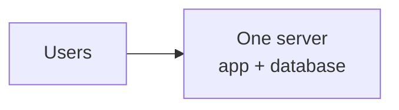
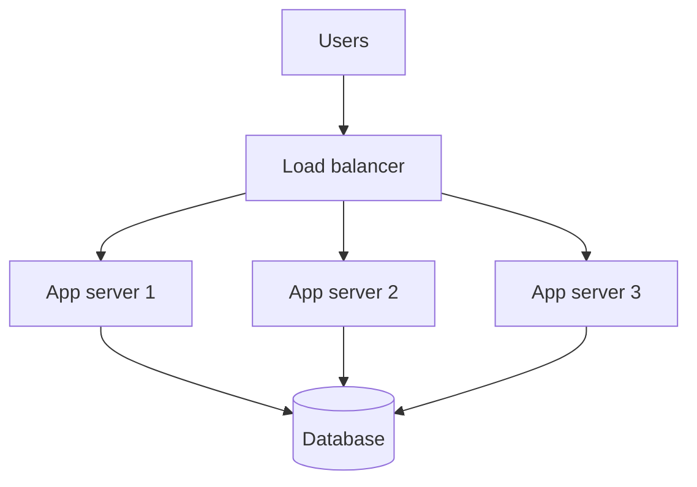
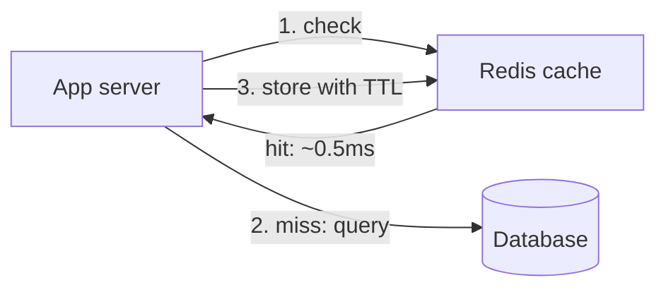
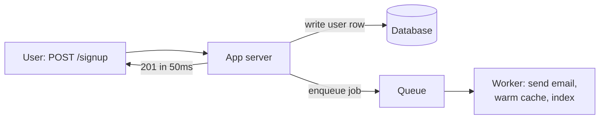

# Start here — what system design actually is

If you have never done a system design round, the format is disorienting in a
way that a coding round isn't. There's no test suite, no correct answer, and the
interviewer says something like "design Twitter" and then goes quiet.

This chapter explains what is really being asked, teaches the vocabulary, and
then builds one system from a single server up to ten million users — meeting
each piece of technology at the moment the problem appears rather than as a
list to memorise.

Read this before [the method](01-the-method.md), which assumes you already know
what the boxes are.

---

## What the question actually is

"Design a URL shortener" is not a request for a URL shortener. Nobody in the
room needs one. The question being asked is:

> *When you're handed a vague problem and a whiteboard, do you reason like
> someone I'd trust with our architecture?*

Which unpacks into five things they're watching for:

| They're checking | What it looks like when you do it |
| --- | --- |
| **Do you clarify before building?** | You ask how many users, what "shorten" must guarantee, whether analytics matter — *before* drawing anything |
| **Can you size things?** | "50M writes a day is ~600 writes/second, which is small; the 10:1 read ratio is what matters" |
| **Do you know the standard parts?** | You reach for a cache, a queue, a load balancer without ceremony |
| **Do you name trade-offs?** | "I'd take eventual consistency here, which means a user might briefly not see their own link — acceptable, and here's how I'd fix it if it weren't" |
| **Do you know what breaks?** | "The hot key is the failure mode: one viral link concentrates on a single shard" |

The fourth is the one that separates levels. A junior answer lists components.
A senior answer says *this, therefore not that, and here's the cost I accepted.*

**The most common way to fail is silence.** They cannot grade thinking they
can't hear. Narrate constantly, including the dead ends: "I considered putting
this in the database, but the write rate makes that the bottleneck, so — queue."

---

## The vocabulary of a design

Six words cover nearly every box you will draw.

| Word | Plain meaning |
| --- | --- |
| **Client** | Whatever the user holds — browser, phone app, another company's server |
| **Server** | A machine running your code that answers requests |
| **API** | The list of things a client is allowed to ask for: `POST /links`, `GET /{code}` |
| **Database** | Where data lives so it survives a restart. The source of truth |
| **Cache** | A small fast copy of frequently-read data. Milliseconds instead of tens of milliseconds, at the cost of possibly being stale |
| **Queue** | A to-do list for work the user doesn't have to wait for |

And four properties you'll be asked to reason about:

- **Latency** — how long one request takes. Users feel this.
- **Throughput** — how many requests per second you can handle. Capacity
  planning is this.
- **Availability** — the share of time the system works. Quoted in nines:
  99.9% is ~43 minutes of downtime a month; 99.99% is ~4 minutes.
- **Consistency** — whether everyone sees the same data at the same moment, or
  whether some readers can be briefly behind.

The last two fight each other, and choosing between them out loud is most of
what a senior answer sounds like. The formal version is
[CAP and PACELC](../02-distributed-systems/02-cap-pacelc-consistency.md).

---

## One user to ten million, one problem at a time

This is the spine of the whole discipline. Every architecture you'll ever see is
somewhere on this ladder, and each rung exists because the previous one broke in
a specific, nameable way.

### Stage 1 — one server


*Where everything starts, and where far more systems could stay than actually do.*

Your app and your database on one machine. It serves real traffic, it's easy to
reason about, and it deploys in a minute. Do not be embarrassed by it — plenty
of profitable businesses run on this.

**What breaks:** the machine reboots and you're entirely offline; and the
database competes with your app for memory, so a heavy query makes every request
slow.

### Stage 2 — split the database off

Move the database to its own machine. They now scale independently — the
database gets memory, the app gets CPU — and a deploy of your app no longer
risks the data.

**What breaks:** one app server still caps how many concurrent users you serve,
and it's still a single point of failure.

### Stage 3 — several app servers behind a load balancer


*The first genuinely distributed shape: interchangeable app servers, one address, one machine's death survivable.*

The **load balancer** (Nginx, or an AWS ALB) takes one public address and
spreads requests across servers, skipping any that stop answering health checks.
Now you add capacity by adding machines, and one dying is survivable.

**The catch that trips everyone up:** this only works if your app servers are
**stateless** — nothing kept in one server's memory that a later request needs.
If server 2 holds the user's session, the user must always reach server 2, and
you've lost the interchangeability you just paid for. So sessions move out, into
Redis or into a signed token. Uploaded files move out too, into S3 — a file on
one server's disk is the same bug wearing a different hat.

**What breaks:** every request still hits one database, and reads pile up.

### Stage 4 — cache the reads


*Cache-aside: the application asks the cache first and fills it on a miss, which is the pattern behind almost every "we made it 50× faster" story.*

Most systems read far more than they write — 10:1 is typical, 100:1 is common.
So keep the hot data in memory, in **Redis**, and answer from there.

1. Request arrives; app asks Redis for `user:42`.
2. **Hit** — return it, ~0.5ms, database untouched.
3. **Miss** — query the database (~20ms), store the result in Redis with a
   **TTL** (say 300 seconds), return it.

The TTL is doing two jobs: it expires data you no longer need, and it bounds how
wrong you can be. Even if you forget to invalidate somewhere, staleness has a
ceiling.

> This stage is where the biggest number on this resume comes from: caching
> permission decisions rather than recomputing them took a check from 13s to
> 200ms. See [contentstack §5](../00-experience/contentstack.md).

**What breaks:** cache invalidation — the copy in Redis and the row in the
database disagree; and the **stampede**, where a popular key expires and a
thousand simultaneous requests all miss and hit the database at once.
[Caching at scale](../02-distributed-systems/07-caching-at-scale.md) is entirely
about these two.

### Stage 5 — replicate the database

One database is still one point of failure, and writes still contend with reads.
So run a **leader** that takes all writes and several **followers** that copy
from it and serve reads.

- Writes go to the leader. Reads go to a follower.
- If the leader dies, a follower is promoted — that's **failover**.

**The new problem, and it's the classic:** replication takes milliseconds, so a
user can write and then immediately read from a follower that hasn't caught up
— *"I just saved that and it's gone."* This is **replication lag**, and the
standard fix is **read-your-writes consistency**: route a user's reads to the
leader for a few seconds after they write.

**What breaks:** one leader can only absorb so many writes, and the dataset
eventually outgrows one machine's disk.

### Stage 6 — move slow work off the request path


*The user waits only for what they actually need; everything else becomes a job, and the response time stops depending on a mail server.*

The user signs up. They need their account created. They do **not** need to wait
while you send a welcome email, generate a thumbnail, and update a search index
— all of which are slow and any of which can fail.

So: do the essential write, put a job on a **queue** (SQS, BullMQ, RabbitMQ),
return immediately. A **worker** picks it up. The response gets faster and stops
depending on a third-party mail provider being up.

**The rule** for what belongs on a queue: *does the user need the result of this
to consider their action done?* No → queue it.

**What breaks:** a job can run twice — the worker crashes after doing the work
but before acknowledging — so jobs must be **idempotent**. Sending the welcome
email twice is a bug you will actually ship if you don't design for it.

### Stage 7 — split the database

Two different moves, often confused, and knowing the difference matters:

- **Vertical partitioning / separate services** — different tables to different
  databases. Users here, orders there. Simple, and the point at which "should
  this be a microservice" starts being a real question.
- **Sharding (horizontal partitioning)** — the *same* table split across
  machines by a key. Users A–M on shard 1, N–Z on shard 2.

Sharding is the big one, and its whole difficulty is the **shard key**. Pick
badly and you get a **hot shard** — one machine with all the traffic while the
others idle. Shard a multi-tenant SaaS by tenant ID and your largest customer
lands entirely on one machine.

Also: `hash(key) mod N` looks fine and is a trap, because adding a machine
changes `N` and remaps almost every key. **Consistent hashing** exists to move
only ~1/N of the keys instead.
[Replication and partitioning](../02-distributed-systems/03-replication-partitioning.md)
covers both properly.

### Stage 8 — the rest of the world

Beyond this, the moves are: a **CDN** so static assets never reach you at all;
**multi-region** for latency and disaster recovery, which forces genuinely hard
consistency decisions; and splitting the monolith into **services** so teams
deploy independently — a real organisational win with a real distributed-systems
bill attached.

### The ladder, in one table

| Stage | The move | Because | Cost you take on |
| --- | --- | --- | --- |
| 1 | One server | Start here | Single point of failure |
| 2 | Separate the database | They compete for resources | One more machine |
| 3 | Load balancer + N app servers | One server caps capacity | Must be stateless |
| 4 | Add a cache | Reads dominate | Invalidation, stampedes |
| 5 | Replicate the database | Read load, and failover | Replication lag |
| 6 | Queue + workers | Slow work delays users | Duplicate execution |
| 7 | Shard | Writes and data outgrow one machine | Hot shards, no cross-shard joins |
| 8 | CDN, regions, services | Global users, team autonomy | Real distributed complexity |

**Never skip rungs in an interview.** Proposing shards and Kafka for a system
doing 200 requests per second is the clearest possible signal that you're
pattern-matching rather than reasoning. The strong answer starts simple and says
*what would have to be true* to justify each next step.

---

## Estimation, gently

You'll be asked "how many servers" or "how much storage", and the point is not
precision — it's whether you can reason about scale at all. Round aggressively;
nobody is checking your arithmetic.

**The only conversion you must know:**

```
1 million per day   ≈  12 per second
100 million per day ≈  1,200 per second
1 billion per day   ≈  12,000 per second
```

(86,400 seconds in a day; call it 100,000 and divide.)

**Sizes to hold in your head:** a typical database row ~1 KB; a thumbnail
~50 KB; a photo ~2 MB; a minute of video ~10 MB.

**Then two multipliers:** peak traffic is roughly 2–3× the average, and reads
usually outnumber writes 10:1 or more.

Worked, in fifteen seconds: *100M requests/day ≈ 1,200/s average, so ~3,000/s at
peak. If a server handles 1,000 requests/second, that's 3 servers — call it 5
for headroom and failures. At 1 KB per record and 10M new records a day, that's
10 GB/day, ~3.6 TB a year. Fits on one machine for now, so no sharding yet.*

That paragraph is the entire skill. [Estimation](02-estimation.md) does it
properly, including this resume's own 2–3B/day figure.

---

## The three questions to ask, always

Whatever the prompt, these three earn their time:

1. **"What scale?"** — users, requests per second, data volume. Everything
   downstream depends on it, and it's the question juniors skip.
2. **"What has to be consistent, and what can be stale?"** — this decides your
   database and your caching strategy in one answer.
3. **"What's in scope?"** — "Design Twitter" is a week of work. Agreeing to
   cover posting and the timeline, and explicitly deferring search, DMs and
   trending, is a senior move, not a dodge.

---

## Reference stack

The technologies you'd actually name for each rung of the ladder. Depth on each
is in [the technology landscape](../02-distributed-systems/00b-the-technology-landscape.md);
what matters here is having a default so you don't stall.

| Box on the whiteboard | Default answer | Say this if pushed |
| --- | --- | --- |
| Load balancer | AWS ALB, or Nginx self-hosted | "L7 so I can route on path and retry; health checks eject a bad instance" |
| App servers | Node/NestJS or Go, in containers on ECS | "Stateless, so scaling is an infrastructure concern" |
| Cache | Redis (ElastiCache) | "Cache-aside with a TTL; the TTL bounds staleness even if invalidation is missed" |
| Primary database | PostgreSQL (Aurora) | "Transactions and joins by default; I move off it for a stated reason" |
| High-write / simple-key store | DynamoDB or Cassandra | "When writes outgrow one leader and I already know my access patterns" |
| Queue | SQS, or BullMQ on existing Redis | "Consumers must be idempotent — at-least-once means duplicates" |
| Event stream | Kafka | "Only when several independent consumers need the same events, or I need replay" |
| Blobs | S3 + CloudFront | "Never on an instance's disk — that's state pinned to a machine" |
| Search | Elasticsearch, fed from Postgres | "A derived index, rebuildable. Never the system of record" |
| Observability | OpenTelemetry → Prometheus/Grafana | "p99, not averages, and a correlation ID through every hop" |

---

## Interview Q&A

### Q: How would you scale a system from one server to millions of users?
**Level:** foundation · **Tags:** scaling, system-design, architecture

<details><summary>Model answer</summary>

I'd go in stages, and the important part is that each stage is forced by a
specific bottleneck rather than adopted because it's standard.

Start with one server running the app and database. Split the database onto its
own machine first, so they stop competing for memory and can scale separately.

When one app server caps out, put a load balancer in front of several. That
forces the app tier to be stateless — sessions into Redis or a signed token,
uploads into S3 — because otherwise you need sticky routing and you've thrown
away the interchangeability you just paid for.

Then the database is the bottleneck, and reads come first because reads dominate
by roughly 10:1. Add a cache, cache-aside with a TTL. Then read replicas, which
introduces replication lag and the read-your-writes problem — a user not seeing
their own edit — which I'd solve by pinning their reads to the leader briefly
after a write.

Next, move anything off the request path that the user doesn't need the result
of: emails, thumbnails, indexing, onto a queue with workers. That cuts response
time and decouples me from a third party's uptime, and it means workers have to
be idempotent because at-least-once delivery is what you actually get.

Only after all that would I shard, because it's the one that's genuinely hard to
undo: the shard key decides everything, a bad one gives you a hot shard, and
cross-shard queries and joins stop being available.

What I'd stress is the discipline of not skipping. Most systems never need
stages 7 or 8, and proposing them at 200 requests a second is solving a problem
nobody has while taking on complexity that's permanent.

</details>

**Follow-ups:**

1. Q: Why does adding a load balancer force your servers to be stateless?
   <details><summary>Answer</summary>

   Because the load balancer's value is that any server can take any request,
   and state in one server's memory destroys exactly that property.

   If a session lives on instance 2, then that user's every request has to reach
   instance 2. You need sticky sessions, and now a deploy that replaces
   instances logs people out, an instance dying loses their state, and the
   balancer can't actually balance because it's pinned.

   So state relocates rather than disappearing: sessions into Redis or a signed
   JWT, uploads into S3, in-progress work into a queue. Files on local disk are
   the version of this people miss — same problem, and it shows up as "the image
   works on some page loads".

   The exception is when the state is large and extremely hot, like a
   collaborative editing session, where fetching it per request costs more than
   the pinning does. Then you shard by document and route deliberately — but
   that's a chosen design with a reason, not an accident.

   </details>

2. Q: At what point would you actually shard, and how would you pick the key?
   <details><summary>Answer</summary>

   When one leader genuinely can't take the write volume, or the dataset won't
   fit one machine's disk, and I've already exhausted the cheaper options —
   caching, read replicas, archiving cold data, a bigger instance. Sharding is
   the hardest of these to reverse, so it goes last.

   For the key I'm optimising for two things: even distribution, and keeping
   the queries I actually run inside one shard. Those conflict, which is the
   whole difficulty.

   User ID is usually a good key because traffic per user is fairly uniform and
   most queries are scoped to a user. Tenant ID in multi-tenant SaaS is the
   tempting one that bites — it keeps queries local, but tenant sizes vary by
   orders of magnitude and your biggest customer lands on one machine. The fix
   is a composite key, or splitting the largest tenants across shards
   deliberately.

   I'd use consistent hashing rather than `mod N`, because `mod N` remaps nearly
   every key when you add a machine while consistent hashing moves about 1/N of
   them. And I'd say out loud what I'm giving up: cross-shard joins and
   transactions, and the fact that a query without the shard key has to fan out
   to every shard.

   </details>

### Q: What are you actually being assessed on in a system design interview?
**Level:** foundation · **Tags:** interview-process, system-design

<details><summary>Model answer</summary>

Whether I can take a vague problem and drive it to a defensible design out
loud — not whether I produce a specific diagram.

Concretely, five things. Do I clarify scale and scope before drawing anything,
because a design for a thousand users and one for a hundred million are
different designs. Can I do rough capacity maths well enough to know whether
something is a real problem. Do I know the standard components and reach for
them naturally. Do I state trade-offs — this choice, therefore not that, and
here's the cost I'm accepting. And do I know what breaks: hot keys, replication
lag, cache stampedes, the thundering herd after a failover.

The trade-off one is what distinguishes levels. Listing components is a junior
answer. Saying "I'd take eventual consistency on the feed because a
one-second-stale post is invisible to users, but the payment path gets a
transaction because a half-applied transfer isn't stale, it's wrong" — that's
the senior version, and it's the same knowledge expressed with a reason
attached.

The practical failure mode is silence. They can't grade thinking they can't
hear, so I narrate continuously, including the options I reject and why. And I
manage the clock: requirements and estimation early, then most of the time in
one deep dive, because breadth with no depth reads as never having built any
of it.

</details>

**Follow-ups:**

1. Q: The interviewer says "design Twitter" and stops talking. What are your first sixty seconds?
   <details><summary>Answer</summary>

   Scope and scale, before a single box goes on the board.

   I'd say something like: "Twitter is enormous, so let me agree what we're
   building. I'd propose posting a tweet, following someone, and rendering a
   home timeline — and explicitly leave out search, DMs, trending and ads unless
   you'd rather I cover one of those." That's a scoping decision, and making it
   deliberately is itself part of what's graded.

   Then numbers: how many daily actives, roughly what read-to-write ratio.
   If they say "you tell me", I pick and state my assumption — 200 million
   daily actives, 100 million tweets a day, reads outnumbering writes a
   hundred to one — because a stated assumption can be corrected while a
   silent one can't.

   Then the one question that shapes the entire design: does a follower have to
   see a tweet immediately, or is a few seconds acceptable? Seconds are
   acceptable, and that single answer is what makes fan-out-on-write viable.

   Only then do I draw, and I say what I'm doing while I do it.

   </details>

---

## What a weak answer sounds like

- **Drawing before asking.** Boxes on the board in the first thirty seconds,
  with no idea of the scale, means the design is a guess.
- **Jumping to the end state.** Microservices, Kafka and sharding for a system
  that would run on one machine. It reads as memorised, not reasoned.
- **Listing without justifying.** "Load balancer, cache, database, queue" with
  no *because* is a vocabulary test you've passed and a design round you've
  failed.
- **Never mentioning failure.** A design with no answer for "what if the cache
  is down" or "what if that service is slow" is a diagram, not a system.
- **Going silent while thinking.** The single most common cause of a bad
  outcome, and entirely fixable.
- **Refusing to estimate.** "It depends on the data" instead of a rough number.
  Nobody wants precision; they want to see you reason about magnitude.

---

## Glossary

- **Load balancer** — spreads requests over servers and skips unhealthy ones.
- **Stateless** — keeps nothing between requests, so any instance can serve any request.
- **Sticky session** — routing a user always to the same server because it holds their state.
- **Cache-aside** — check the cache, fall back to the database, then fill the cache.
- **TTL** — time-to-live; how long a cached entry stays before expiring.
- **Cache stampede** — a hot key expires and every request hits the database at once.
- **Replication** — copying data to other machines for reads and failover.
- **Replication lag** — how far behind a follower is.
- **Read-your-writes** — a user always sees their own writes, even under lag.
- **Failover** — promoting a replica when the leader dies.
- **Sharding** — splitting one dataset across machines by a key.
- **Shard key** — the field that decides which machine holds a record.
- **Hot shard / hot key** — one shard or key taking a disproportionate share of traffic.
- **Consistent hashing** — key placement that moves only ~1/N of keys when N changes.
- **Idempotent** — running it twice has the same effect as running it once.
- **Nines** — availability shorthand; 99.9% ≈ 43 min/month of downtime, 99.99% ≈ 4 min.
