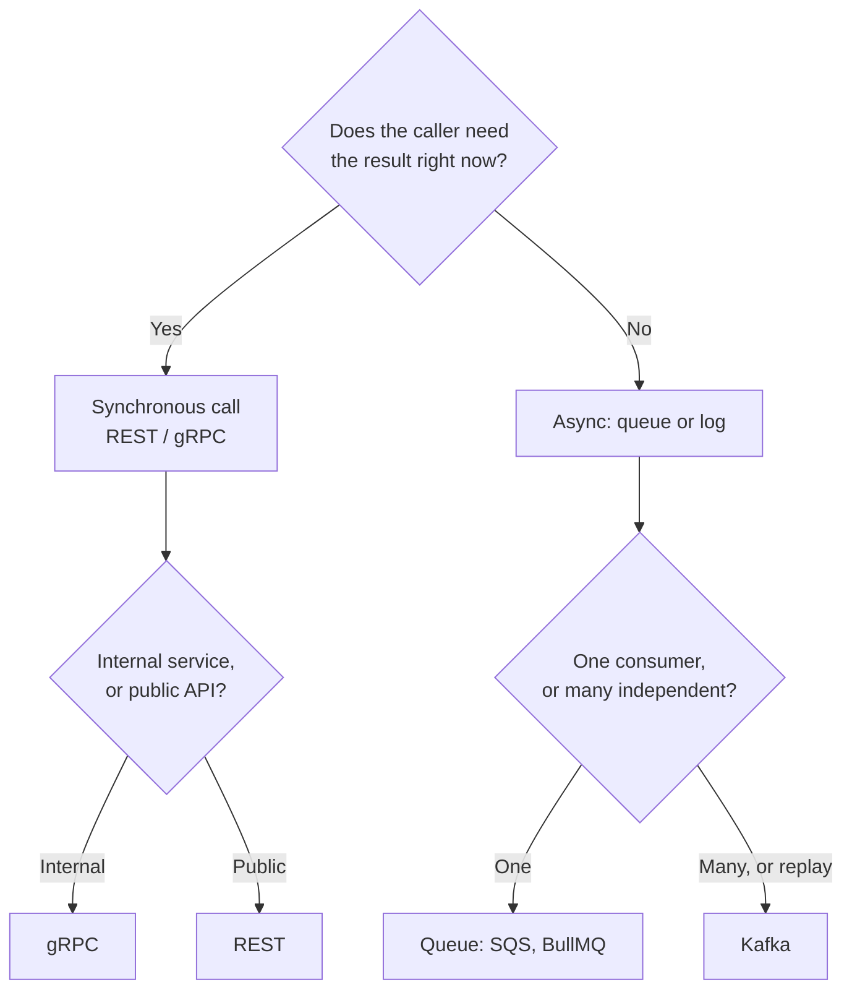
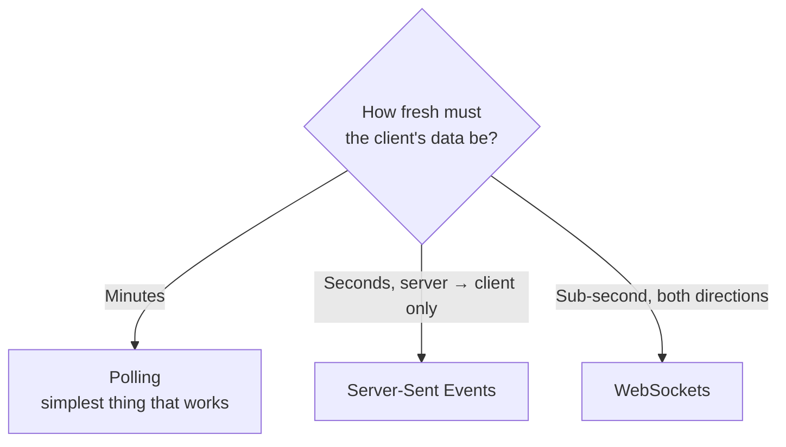

# The technology toolbox — choosing between the options

[The technology landscape](../02-distributed-systems/00b-the-technology-landscape.md)
says what exists. This chapter is the other half: the head-to-head choices you
get asked to *make and defend* — "why Postgres and not Mongo", "why a queue and
not just a call", "why not WebSockets".

Every section has the same shape: what the choice actually is, when each side
wins, and the one sentence to say out loud. Learn the sentences. In a design
round you have about fifteen seconds to justify a choice before the interviewer
moves on, and a crisp reason beats a thorough one.

**The meta-rule for all of it:** there is no best technology, only a fit. An
answer that says "X is better" is weaker than one that says "X, because this
system reads far more than it writes and can tolerate a second of staleness."

---

## How the choices connect

*Two questions — does the caller wait, and how many things care — decide most of the communication choices in a design.*

The two questions in that diagram are worth internalising, because they resolve
a surprising share of design decisions:

1. **Does the caller need the answer to continue?** If no, it should not be a
   blocking call. This is the single highest-leverage instinct in system design.
2. **How many independent things care about this event?** One means a queue.
   Several, or "we might want to replay it", means a log.

---

## Database: PostgreSQL vs MongoDB vs DynamoDB

The most-asked choice, and the one where a bad answer does the most damage.

| | **PostgreSQL** | **MongoDB** | **DynamoDB / Cassandra** |
| --- | --- | --- | --- |
| Data shape | Rows with a fixed schema | Documents, shape can vary | Key → value/document |
| Query flexibility | Anything, including queries you didn't plan | Good, weaker on joins | Only by the key you designed for |
| Transactions | Full ACID across rows | Available, model discourages needing them | Single-item, essentially |
| Scaling writes | One leader (then shard, which is work) | Sharding built in | Effectively linear, no leader |
| Operations | Well understood everywhere | Well understood | Managed, or a real cluster to run |

**Pick Postgres** unless you have a reason not to. It assumes the least about
your future: joins, constraints, transactions, and the ability to answer a
question you didn't anticipate. Most systems are this, and JSONB covers "but the
shape varies" without leaving.

**Pick MongoDB** when records genuinely vary in structure or nest deeply — a CMS
where every content type has different fields, or documents you always read
whole. If you find yourself modelling twelve nullable columns, that's the signal.

**Pick DynamoDB or Cassandra** when write volume exceeds what one leader can
absorb, or writes must be accepted in multiple regions, *and* you already know
every access pattern — because you design the table per query and joins don't
exist.

> **Say this:** "Postgres by default — transactions and ad-hoc queries are worth
> a lot while access patterns are still moving. I'd move to Dynamo if writes
> outgrew a single leader, and I'd accept designing the table around known
> queries as the price."

**The trap:** choosing a store because it's "web scale" when you have 500
writes a second. Postgres handles that on a laptop. Interviewers are listening
for whether you know that.

---

## Cache: Redis vs Memcached vs "no cache"

| | **Redis** | **Memcached** | **No cache** |
| --- | --- | --- | --- |
| Stores | Strings, hashes, lists, sets, sorted sets, streams | Strings only | — |
| Extras | Persistence, pub/sub, Lua scripting, TTLs | Nothing, deliberately | — |
| Also useful for | Sessions, rate limits, locks, leaderboards, queues | Caching, and only caching | — |

**Redis, essentially always.** Memcached is marginally faster and simpler for
pure key-value caching, and that margin has almost never been the deciding
factor. Redis's data structures mean one system covers five needs.

**"No cache" is a real answer** and worth having the courage to give. A cache
adds a second copy of the truth, and therefore invalidation bugs, stampedes and
a new failure mode. If the database comfortably serves the load, adding Redis is
complexity you're taking on for nothing.

> **Say this:** "Redis, cache-aside with a TTL. The TTL bounds staleness even if
> an invalidation gets missed, which it will. And I'd check the database
> actually needs the help first — a cache is a second source of truth and
> they disagree eventually."

**What you must be able to discuss:** invalidation (how the cached copy learns
it's wrong), and the stampede (a hot key expires, a thousand requests miss
simultaneously, the database falls over). Those are the two follow-ups, always.
[Caching at scale](../02-distributed-systems/07-caching-at-scale.md).

---

## Async: Kafka vs RabbitMQ vs SQS vs a database table

| | **Kafka** | **RabbitMQ** | **SQS** | **DB table** |
| --- | --- | --- | --- | --- |
| Model | Durable, replayable log | Broker with routing | Managed queue | Rows with a status column |
| After reading | Retained for days | Deleted on ack | Deleted on ack | You update the row |
| Multiple consumers | Each group reads everything | Work is divided | Work is divided | Awkward |
| Replay history | Yes | No | No | Sort of |
| Ops cost | High — a cluster | Medium | Near zero | Zero |

**Start with SQS** (or BullMQ if Redis is already there). One producer, one
consumer, moderate volume: this is the answer, and reaching past it is
over-engineering.

**RabbitMQ** when you need per-message routing — priorities, topic exchanges,
one message going to different consumers by type.

**Kafka** when several *independent* consumers need the same events, or you need
replay, or throughput is genuinely large. "User signed up" reaching email,
analytics, CRM and the search indexer, each at its own pace, each able to rewind
after a bug — that is exactly Kafka's shape.

**A database table** with a `status` column is a legitimate queue at low volume
and one fewer system to run. It stops being legitimate when polling and lock
contention start showing up in your database metrics.

> **Say this:** "SQS unless multiple independent consumers need the same events
> or I need replay — then Kafka, and I'd be explicit that I'm taking on a
> cluster to operate."

**Non-negotiable follow-up:** all of these are **at-least-once**. Duplicates
happen. Consumers must be idempotent, and "exactly-once" as a product claim is
either false or means "at-least-once plus deduplication", which is idempotency
with better marketing. [Idempotency and transactions](../02-distributed-systems/05-idempotency-transactions.md).

---

## Service communication: REST vs gRPC vs GraphQL

| | **REST** | **gRPC** | **GraphQL** |
| --- | --- | --- | --- |
| Format | JSON over HTTP | Protobuf, binary, HTTP/2 | JSON, one endpoint |
| Contract | OpenAPI, if you keep it current | `.proto`, generates typed clients | Schema, strongly typed |
| Speed | Fine | Notably faster — binary + multiplexed | Fine |
| Best at | Public APIs, anything a browser calls | Internal service-to-service | Clients that need varying shapes of data |
| Weakness | Chatty; over- and under-fetching | Not browser-native without a proxy | Caching is hard; a bad query can be expensive |

**REST** for anything public or browser-facing. Universal, cacheable, debuggable
with `curl`, and every client already speaks it.

**gRPC** for internal calls between your own services. The `.proto` is a real
contract with generated types, so a field rename is a compile error rather than
a production incident, and binary framing over HTTP/2 measurably cuts latency on
a hot internal path.

**GraphQL** when many different clients need different slices of the same data
and you're tired of shipping `/users/:id/summary-for-mobile`. The cost is real:
HTTP caching mostly stops working, and you need depth limiting and query costing
or one client can write a query that takes the database down.

> **Say this:** "REST at the edge, gRPC between services. The proto contract is
> the actual argument — with nine teams consuming an internal API, a typed
> contract is what stops a rename becoming an outage."

[API styles](../04-backend/04-api-styles.md) covers all three in depth.

---

## Realtime: polling vs long polling vs SSE vs WebSockets

*Direction and freshness pick the transport; most "realtime" requirements are satisfied by the cheapest option on this chart.*

- **Polling** — the client asks every N seconds. Wasteful, trivial, works
  everywhere. Correct far more often than people admit.
- **Long polling** — the request stays open until there's news. A reasonable
  fallback where WebSockets are blocked.
- **Server-Sent Events (SSE)** — a one-way stream from server to client over
  plain HTTP, with automatic reconnection. Notifications, live feeds, progress
  bars. Underrated: much simpler than WebSockets and usually sufficient.
- **WebSockets** — a persistent two-way connection. Chat, collaborative editing,
  multiplayer. Genuinely bidirectional and genuinely more work.

**The cost of persistent connections** is the part to name: each one holds a
server socket, so a load balancer can't freely rebalance, deploys drop
connections, and scaling out means a pub/sub layer (Redis) so a message can
reach whichever server holds that user's socket.

> **Say this:** "SSE unless the client also needs to push. Persistent
> connections are state on a server, and that constrains scaling and deploys —
> worth it for chat, not for a notification badge."

---

## Sessions: server-side sessions vs JWTs

| | **Server-side session** | **JWT** |
| --- | --- | --- |
| Where state lives | Redis or a database | In the token itself |
| Validating a request | A lookup | Verify a signature — no lookup |
| Revoking | Delete it. Instant | Genuinely hard — that's the whole problem |
| Scaling | Needs a shared store | Nothing to share |

**Sessions** when you need instant revocation and control — internal tools,
banking, anything where "log this user out now" must actually mean now.

**JWTs** when you need stateless validation across many services, especially
when they're in different languages or owned by different teams. The cost is
revocation: a signed token is valid until it expires, so you need short lifetimes
plus refresh tokens, and typically a denylist for the emergency case — at which
point you've reintroduced a lookup on the path you made stateless. Say that out
loud; it's the honest version.

> **Say this:** "Short-lived access tokens — 5 to 15 minutes — with refresh
> tokens, and a denylist keyed by token ID for immediate revocation. That's a
> deliberate trade: I get stateless validation on the common path and pay a
> cache lookup only for the revocation guarantee."

This is the resume's home territory — [JWT](../01-auth-identity/06-jwt.md) and
[session revocation](05-design-rbac-sso-sessions.md#prompt-c--session-management-with-instant-revocation)
go much deeper, and it will be probed hard.

---

## Deployment: monolith vs microservices

The one where the fashionable answer is usually the wrong one.

| | **Monolith** | **Microservices** |
| --- | --- | --- |
| Deploy | One artifact | Many, independently |
| A call between modules | A function call, nanoseconds | A network call, and it can fail |
| Transactions | A database transaction | Sagas, and compensating actions |
| Debugging | One stack trace | Distributed tracing, or guesswork |
| Team scaling | Teams contend on one codebase | Teams own and ship independently |

**Start with a monolith.** Modular inside — clear boundaries, separate modules —
but one deployable. It's faster to build, far easier to debug, and boundaries
are cheap to move when you get them wrong, which you will.

**Split when the pain is organisational**: teams blocking each other on deploys,
one component needing wildly different scaling, or a piece with genuinely
different availability requirements. Notice that all three are about *teams and
operations*, not about the code being tidier.

**What you take on, and it's a lot:** every in-process call becomes a network
call that can time out; every cross-service transaction becomes a saga with
compensations; and you need distributed tracing before you need it, because the
first "it's slow somewhere" incident is unanswerable without it.

> **Say this:** "Modular monolith first. I'd split when teams start blocking
> each other on deploys or one component needs different scaling — the trigger
> is organisational, not aesthetic."

[Microservices](../04-backend/05-microservices.md) covers boundaries and the
split properly, including the shape of a real one.

---

## Compute: VMs vs containers vs serverless

| | **VMs / EC2** | **Containers (ECS, K8s)** | **Serverless (Lambda)** |
| --- | --- | --- | --- |
| Unit | A machine | A container image | A function |
| Scaling | Minutes | Seconds | Instant, per request |
| Idle cost | You pay | You pay | Nothing |
| Weakness | Slow, manual | Orchestration to operate | Cold starts, time limits, hard to test locally |

**Containers by default** — ECS or Fargate for a handful of services, Kubernetes
once you have many services and several teams. Proposing Kubernetes for six
services is a reliable signal you haven't operated it.

**Serverless** for spiky, event-driven, short work: webhook handlers, image
processing, scheduled jobs. Not for a latency-critical hot path, where cold
starts land in your p99.

> **Say this:** "Containers on ECS. Kubernetes when the number of services and
> teams justifies operating it — it's a distributed system I'd then also have to
> run."

---

## The one-page summary

| Choice | Default | Switch when |
| --- | --- | --- |
| Database | PostgreSQL | Documents vary wildly → Mongo; writes outgrow one leader → Dynamo/Cassandra |
| Cache | Redis, cache-aside + TTL | The database doesn't need help → no cache |
| Async | SQS / BullMQ | Many independent consumers or replay → Kafka |
| Internal calls | gRPC | Public or browser-facing → REST |
| Realtime | SSE | Client must push too → WebSockets |
| Auth | Short JWT + refresh + denylist | Revocation must be instant and simple → server sessions |
| Architecture | Modular monolith | Teams block each other on deploys → services |
| Compute | Containers on ECS | Many services and teams → Kubernetes; spiky glue → Lambda |
| Search | Elasticsearch, fed from Postgres | Never as the system of record |
| Files | S3 + CloudFront | Never a server's local disk |

---

## Reference stack

If you had to name one concrete stack and defend every piece, this is a
defensible one for the kind of system this book keeps designing — a
multi-tenant, auth-heavy API at high request volume:

| Layer | Choice | The defence in one line |
| --- | --- | --- |
| Edge | CloudFront → ALB | Static content never reaches the origin; L7 gives path routing and retries |
| Compute | NestJS on ECS Fargate | Stateless containers, no cluster to operate |
| Internal calls | gRPC (`@grpc/grpc-js`) | A typed `.proto` contract across teams beats hand-kept JSON docs |
| Primary store | Aurora PostgreSQL | ACID where permissions and billing live; managed failover |
| Cache | ElastiCache Redis (`ioredis`) | Sub-millisecond reads, plus rate limiting and sessions on one system |
| Async | SQS + workers | Managed, at-least-once, DLQ built in; idempotent consumers |
| Events | Kafka, only if several consumers need the stream | Named as a *conditional*, which is the senior form of the answer |
| Files | S3 | Durable, cheap, and keeps the app tier stateless |
| Policy | OPA / Rego, decisions cached in Redis | Policy as data, not `if` statements across nine services |
| Observability | OpenTelemetry → Datadog | One instrumentation, no vendor lock, p99 and traces from day one |

---

## Interview Q&A

### Q: You need to notify users in real time. Walk me through the options.
**Level:** intermediate · **Tags:** realtime, websockets, sse, technology-choice

Model answer

I'd start by asking what "real time" means here, because the answer changes the
transport completely — seconds is a very different system from sub-second, and
one-way is very different from bidirectional.

Four options, cheapest first. Polling: the client asks every N seconds. Wasteful
and trivially simple, and honestly correct for a lot of notification badges.
Long polling: the request hangs until there's news — a decent fallback where
persistent connections are blocked by a corporate proxy. Server-Sent Events: a
one-way stream from server to client over plain HTTP, with reconnection built
into the browser API. WebSockets: a persistent bidirectional connection.

For notifications I'd default to SSE, because notifications are one-directional
by nature and SSE is dramatically simpler operationally — it's just HTTP, so it
works with existing proxies, auth and load balancers. I'd go to WebSockets when
the client genuinely needs to push too: chat, presence, collaborative editing.

The cost I'd name is that persistent connections are state on a specific
server. A million connections is a million sockets held open, deploys drop them
all, and scaling out means a given user's socket lives on one instance — so
publishing a message needs a pub/sub layer, Redis typically, to reach whichever
instance holds it. That's a real piece of architecture you've just added.

And the fallback matters: connections drop constantly on mobile networks, so
the client needs reconnect with backoff, and the server needs to let it resume
from a last-seen event ID rather than losing whatever arrived while it was gone.

**Follow-ups:**

1. Q: You have a million concurrent WebSocket connections. What's hard?
   

Answer

   Four things, and they're all consequences of the connection being state.

   Routing: a user's socket lives on exactly one instance, so to send them a
   message you must reach that instance. The standard fix is Redis pub/sub — any
   instance publishes, the one holding the socket delivers — plus a registry of
   which instance owns which connection.

   Deploys: replacing instances drops every connection they hold, and a million
   clients reconnecting at once is a thundering herd that can take down the
   thing they're reconnecting to. You need staggered draining and reconnect
   jitter on the client.

   Capacity: connections are memory and file descriptors, so you scale on
   connection count, not CPU — the usual autoscaling signal is the wrong one
   and you'll be badly under-provisioned if you don't notice.

   And backpressure: a slow client whose buffer fills can't be allowed to
   consume server memory indefinitely. You need a bounded queue per connection
   and a policy for what happens when it's full — usually drop the client and
   let it resume by event ID.

   

### Q: Would you use microservices for a new product?
**Level:** senior · **Tags:** architecture, microservices, trade-offs

Model answer

For a new product, no — I'd build a modular monolith and keep the boundaries
sharp inside it.

The reason is that on a new product you don't yet know where the boundaries go.
Getting them wrong inside a monolith is a refactor; getting them wrong across
services is a migration with data movement and a coordinated deploy. You want
the mistakes to be cheap while you're still making a lot of them.

The costs are also immediate and the benefits aren't. Every in-process call
becomes a network call that can time out or partially fail. Anything spanning
two services loses database transactions and needs a saga with compensating
actions. Debugging needs distributed tracing you have to build before you need
it. And local development goes from "run the app" to "run eight things".

What I'd do instead is keep it splittable: clear module boundaries, no
reaching into another module's tables, communication through defined interfaces.
Then extracting a service later is mechanical rather than archaeological.

I'd split when there's a concrete trigger, and they're organisational rather
than technical. Teams blocking each other on a shared deploy pipeline. One
component with wildly different scaling — an image processor that needs fifty
instances while everything else needs three. Or different availability
requirements, where you want auth to stay up while the reporting module is
down.

The one I'd flag as genuinely valid on day one is a compliance boundary — if
payment data must live in an isolated system with its own access controls, that
justifies a separate service before any scaling argument does.

**Follow-ups:**

1. Q: You've split into services and now a request touches five of them. What did you need before doing that?
   

Answer

   Distributed tracing, and it needed to exist before the split rather than
   after the first incident.

   With five services, "the request is slow" has five possible answers and no
   single log file contains them. You need a correlation ID generated at the
   edge and propagated through every call and every log line, and spans per
   service so a trace shows where the three seconds actually went. OpenTelemetry
   into Jaeger or Datadog is the standard shape.

   Alongside it: per-service p99 latency and error rates rather than averages,
   because an average across five services hides which one has a bad tail. And
   timeouts with deadline propagation, so a caller doesn't wait on work whose
   deadline has already passed — without that, one slow service turns into
   thread exhaustion in the four services in front of it.

   The point I'd make is that this is a prerequisite, not follow-up work. A
   five-service call chain without tracing is a system where every performance
   question costs an afternoon.

   

---

## What a weak answer sounds like

- **"X is better than Y."** No qualifier, no workload. Every one of these
  choices is conditional and the condition is the answer.
- **Choosing for scale you don't have.** Cassandra at 500 writes a second,
  Kubernetes for six services, Kafka for one consumer.
- **Not naming the cost.** Every choice above has one. An answer with only
  benefits means you haven't run it in production.
- **"Exactly-once delivery."** It doesn't exist. At-least-once plus idempotency
  does, and the difference is the thing being tested.
- **Reaching for GraphQL or WebSockets by default.** Both are real tools with
  real operational costs, and both are frequently proposed where REST and SSE
  would do.
- **Forgetting the boring option.** "The database handles this load fine, so I
  wouldn't add a cache yet" is often the strongest thing you can say.

---

## Glossary

- **Cache-aside** — check the cache, fall back to the store, then fill the cache.
- **At-least-once** — delivery that may duplicate; the normal guarantee.
- **Idempotent consumer** — one where processing the same message twice is harmless.
- **DLQ** — dead-letter queue; where repeatedly failing messages go.
- **Protobuf / `.proto`** — gRPC's binary format and its contract file.
- **SSE** — Server-Sent Events; one-way server → client stream over HTTP.
- **Cold start** — the delay when a serverless function runs on a fresh instance.
- **Modular monolith** — one deployable with strict internal boundaries.
- **Saga** — a multi-step cross-service transaction with compensating actions.
- **Compensating action** — the undo step for an already-committed part of a saga.
- **Deadline propagation** — passing the remaining time budget down the call chain.
- **Denylist** — the set of tokens revoked before their natural expiry.
- **System of record** — the authoritative copy; everything else is derived.
