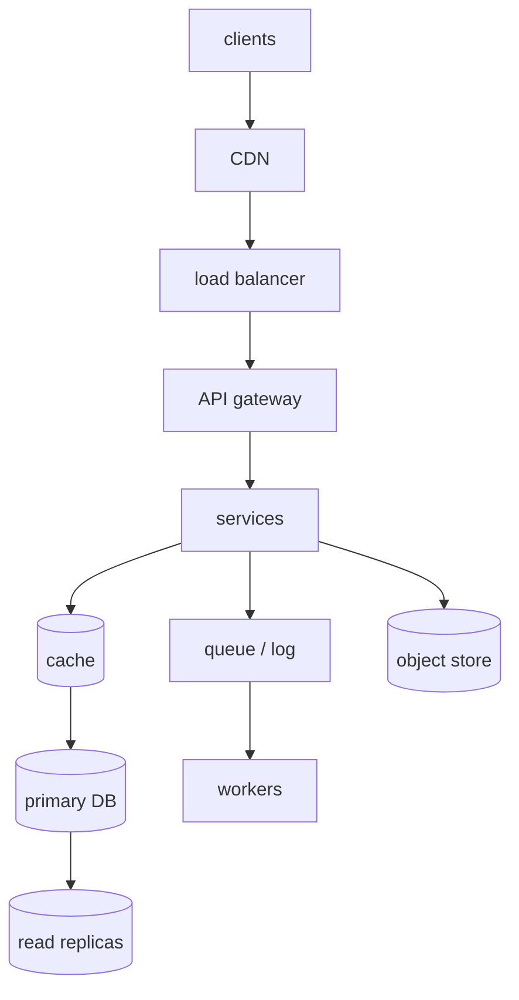
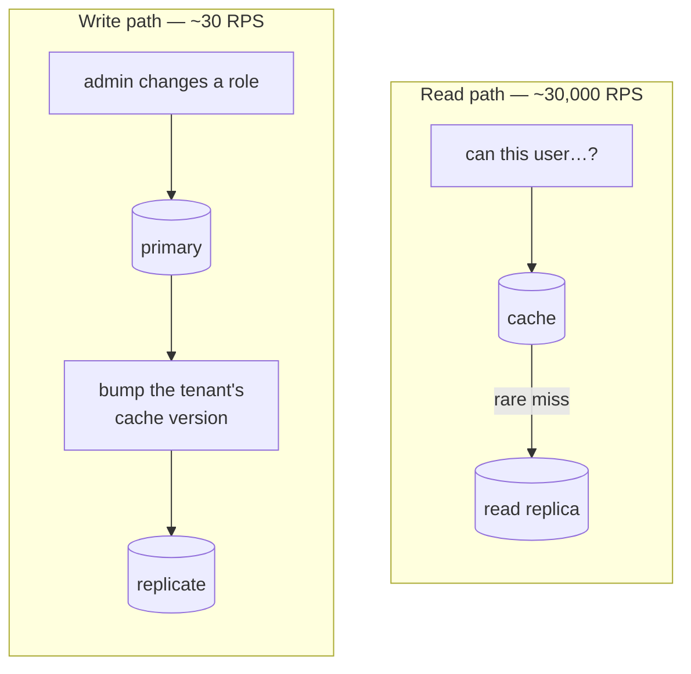

# Building blocks

The vocabulary of a design round. Each block below is a thing you *place* on
the whiteboard, with a reason and a cost.

---

## The standard architecture

*Most designs are a subset of this. Start with the subset you need — opening with the whole chain leaves you nowhere to go in the deep dive.*

The full chain, top to bottom: **clients → CDN → load balancer → API gateway →
services**, with services reading through a **cache** to a **primary DB** that
replicates to **read replicas**, pushing side effects onto a **queue/log** for
**workers**, and putting blobs in an **object store**.

Most designs are a subset of that. Start with the subset you need and add
under pressure — starting complex leaves nowhere to go in the deep dive.

---

## The blocks

### Load balancer

**L4** routes on IP/port — fast, protocol-agnostic. **L7** understands HTTP, so
it can route on path, terminate TLS, and retry. Most API traffic wants L7.

Algorithms: round-robin (simple), least-connections (better with uneven request
costs), consistent hashing (session affinity, cache locality).

**Health checks are the interesting part.** Shallow checks miss grey failure;
deep checks can cascade, draining every instance when one shared dependency
wobbles. The usual answer is shallow for liveness, deep for readiness, with
hysteresis.

### API gateway

The cross-cutting layer: authentication, rate limiting, routing, request
shaping. Putting these here avoids reimplementing them per service.

**The caution for your domain**: the gateway can do *coarse* authorization —
valid token, correct audience — but only the owning service knows ownership,
tenancy and state. A gateway as the *only* check makes the internal network an
implicit trust zone.

### Cache

Covered in depth in [caching at scale](../02-distributed-systems/07-caching-at-scale.md).
For design rounds, know where to place one and be ready for "how do you
invalidate it?"

### Databases

| Type | Model | Fits |
| --- | --- | --- |
| **Relational** | Tables, joins, ACID | Relationships, transactions, ad-hoc queries |
| **Document** | JSON documents | Nested data, flexible schema, one-document reads |
| **Key-value** | Hash | Sessions, caches, simple lookups |
| **Wide-column** | Rows with dynamic columns | Huge write volume, time series |
| **Graph** | Nodes and edges | Traversals — social, permissions graphs |
| **Search** | Inverted index | Full text, faceting |

**Choose from access patterns, not from data shape.** "How is this read?"
decides more than "what does it look like?" And it's normal to use several —
Postgres for core entities, Redis for sessions, Elasticsearch for search.

### Queue / log

Decouples in time, absorbs spikes, fans out. Queue for work distribution, log
for event streams and replay. See
[messaging streams](../02-distributed-systems/06-messaging-streams.md).

### CDN

Caches static and cacheable content at the edge. For anything media-heavy the
CDN hit rate is the number that determines both origin load and cost.

### Object storage

Blobs — images, video, backups, logs. Cheap, effectively unlimited, with
lifecycle tiering. Never store blobs in your database; store a reference.

---

## Diagrams to draw fast

**1. Request path** — clients → LB → service → cache → DB. The default opener.

*Three orders of magnitude apart, so they get different designs. The version bump on the left is where the correctness risk lives: a cached allow for a role you just removed is a security bug, not a stale read.*

**2. Read vs write path split** — worth drawing when they differ, which for an
auth system they dramatically do. The **write path** (an admin changes a role)
is ~30 RPS: hit the primary, bump the tenant's cache version so stale keys
become unreachable, replicate. The **read path** (every product service asking
"can this user…?") is ~30,000 RPS: served from cache, falling through to a read
replica only on a rare miss.

Three orders of magnitude apart, so they get different designs. The version
bump on write is where the correctness risk lives — a cached *allow* for a role
you just removed is a security bug, not a stale read.

**3. Sharding** — how keys map to nodes, and what happens when you add one.

**4. Failure** — what happens when each component dies. Interviewers love this
and candidates rarely volunteer it.

## Reference stack

The concrete technology behind each block, worth naming instead of the
generic term when the interviewer asks "with what":

| Block | Name this |
| --- | --- |
| Load balancer | Nginx, an AWS ALB, or Envoy |
| API gateway | Kong, or a hand-rolled Express/NestJS layer for a smaller system |
| Cache | Redis (`ioredis` client) — see [caching-at-scale](../02-distributed-systems/07-caching-at-scale.md) |
| Primary DB | PostgreSQL for anything relational and consistent; MongoDB when the shape is document-first |
| Queue / log | SQS for simple work queues, Kafka (`kafkajs`) when replay and multiple consumer groups matter |
| CDN | CloudFront, Fastly |
| Object storage | S3 |

Naming a real product signals you've operated one of these, not just drawn
the box.

---

## Interview Q&A

### Q: How do you choose a database for a system?
**Level:** intermediate · **Tags:** databases, design

Model answer

From access patterns rather than data shape, which is the mistake people make.
The question isn't "what does this data look like" but "how will it be read and
written".

The things I'd establish: read/write ratio; whether queries are known ahead of
time or ad-hoc; whether there are relationships to traverse; what consistency
each operation needs; and the scale, since that decides whether one node is
viable.

Then the fit. Relational when there are relationships, transactions, and
queries you can't fully predict — and it's the right default, because it's
flexible and well understood. Document when data is naturally nested and
usually read as one unit. Key-value for sessions and caches. Wide-column for
very high write volumes with known query patterns. Graph when traversals are
the workload. Search when it's full text.

Two things I'd add. It's normal to use several — Postgres for entities, Redis
for sessions, Elasticsearch for search — and that's not indecision, it's
matching the tool to the pattern. And I'd default to Postgres unless there's a
specific reason not to: it does JSON, full text and geospatial adequately, and
"boring, well-understood, and one system to operate" is worth a lot.

**Follow-ups:**

1. Q: When would you actually need NoSQL rather than Postgres?
   

Answer

   Fewer situations than people assume, and the honest version is that Postgres
   scales further than its reputation suggests.

   Genuine cases: write volume beyond what one primary can take, where you need
   horizontal write scaling and the data partitions cleanly — Cassandra-shaped
   workloads like metrics or event streams. A schema that genuinely varies per
   record. Very large scale with simple, known access patterns, where DynamoDB's
   operational model is worth the query limitations. Or a workload that's
   basically graph traversal.

   What isn't a reason: "we might need flexibility later", or read scale, which
   replicas and caching handle. Choosing a distributed database before you need
   one buys operational complexity and gives up joins, transactions and ad-hoc
   queries — usually a bad trade made early.

   I'd also note you can defer: Postgres with JSONB handles semi-structured data
   well, so you can keep flexibility without leaving relational.

   

### Q: Where would you put a cache, and what breaks?
**Level:** senior · **Tags:** caching, architecture

Answer

Several layers, and each has a different invalidation problem, which is really
the question.

**CDN** for static and public cacheable content — the biggest win for media,
invalidated by versioned URLs rather than purging.

**In-process** in the application — fastest, no network. The cost is that every
instance has its own copy, so invalidation must reach all of them, and they're
the invisible layer that makes "immediate" revocation not immediate.

**Shared cache**, Redis or Memcached — one copy, survives restarts, one network
hop. The usual home for sessions and computed results.

**Database-level** — query cache, materialised views.

What breaks: **stampede** when a hot key expires and every request misses at
once; **hot keys** saturating one shard; **stale reads**, which for content is
cosmetic and for authorization is a security bug; and **invalidation
complexity**, which grows fast once you have several layers.

The design rule I'd state: cache the thing that's expensive to compute, at the
layer closest to where it's consumed, with an invalidation strategy decided
*before* you add the cache — not after. And for anything security-relevant, use
versioned keys so a change invalidates everything derived at once.

---

## Glossary

- **L4 / L7 load balancing** — transport-level / application-level routing.
- **API gateway** — cross-cutting authn, rate limiting and routing.
- **Read replica** — a copy serving reads; lags the primary.
- **Object storage** — blob storage with lifecycle tiering.
- **CDN** — edge caching; the hit rate drives origin load and cost.
- **Materialised view** — a precomputed query result, refreshed on a schedule.
- **Sidecar** — a helper process alongside a service; keeps calls on localhost.
- **Blast radius** — how much breaks when one thing fails.
