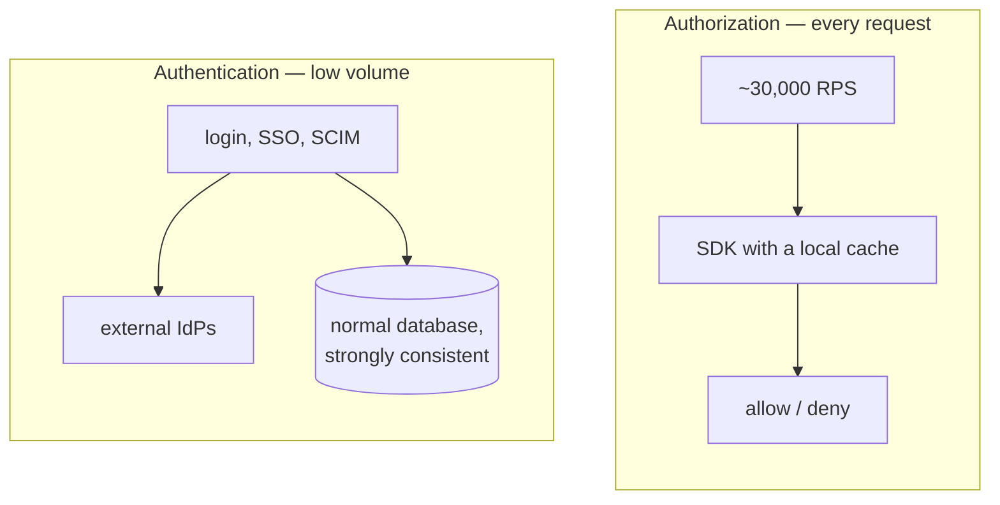
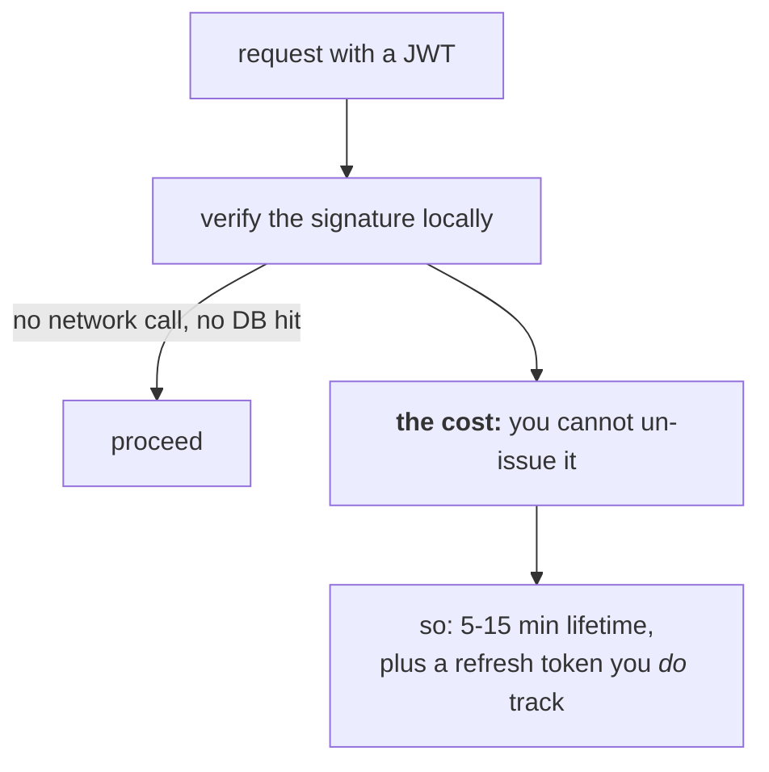

# Design: an auth service at 2–3B requests/day

Your flagship design question. It's the one you're most likely to get, because
it's on your resume — so you should be better at this than at any other prompt
in the book.

---

## The prompt

> Design an authentication and authorization service for a multi-tenant SaaS
> platform handling 2–3 billion requests per day.

---

## Step 1 — Ask before you draw

Questions worth asking out loud:

- Is this authentication (who are you), authorization (what can you do), or
  both? *Both, and they're different systems.*
- Multi-tenant — can one user belong to several organisations? *Yes. This
  changes everything, so establish it early.*
- Do we support enterprise SSO and provisioning? *Yes — SAML, OIDC, SCIM.*
- What latency can we add to a request? *Assume a few milliseconds. Auth sits
  in front of everything, so its latency is added to every request in the
  platform.*
- What happens if auth is down? *Everything is down. It's tier-0.*

**Say the last one out loud.** Realising auth is a hard dependency for the whole
platform — and that this constrains the design — is the thing that separates a
good answer from a generic one.

---

## Step 2 — The numbers

```
2.5B / day ÷ 100,000 s     ≈  30,000 RPS average
× 3 peak                   ≈  90,000 RPS peak

Reads (validate token, check permission)  ~30,000 RPS   ← everything
Writes (login, role change, revoke)       ~30 RPS       ← nothing
```

That 1000:1 split is the most useful fact in the whole design. **The write path
is easy. The read path is the entire problem.**

Working set is small too — a million active sessions at ~1KB each is about 1GB.
Auth data is tiny; it's the request rate that's big. So caching works
extremely well here.

---

## Step 3 — High-level design


*Splitting these two is the design. They share the word “auth” and share almost no requirements — one is a normal service, the other is the entire engineering problem.*

**Two paths, deliberately.** The write path is ~30 RPS and can be strongly
consistent for free. The read path is ~30,000 RPS and is the entire
engineering problem.

Two separate paths, because they have completely different needs:

**Authentication** (login, SSO, SCIM) — low volume, needs strong consistency,
talks to external identity providers. A normal service with a normal database.

**Authorization** (every request) — enormous volume, latency-critical. This is
where all the engineering goes.

---

## Step 4 — The design decisions that matter

### Token validation: stateless, no lookup


*Local validation is what makes 30k RPS affordable, and short lifetimes are the price. Say both halves — the trade is the answer, not the technique.*

Access tokens are signed JWTs, validated **locally** by whoever receives them.
No network call, no database hit. That's what makes 30k RPS affordable.

The cost: you can't un-issue a token. So keep them short-lived — 5 to 15
minutes — and pair them with a refresh token you *do* track server-side.

### Authorization: SDK with a local cache

Every service embeds an SDK that:

1. Checks its own in-memory cache first. Most requests stop here.
2. On a miss, calls the authz service over gRPC.
3. The authz service checks Redis, then falls back to Postgres and the policy
   engine.

Three layers, each catching most of what the layer below would have seen.

**Why not a central policy service every service calls?** Because that's a
network round trip on every single request, and it makes one service a hard
dependency for the entire platform. Local-first is the whole point.

### Cache keys and invalidation

Cache the **decision**, not the inputs — the boolean answer, keyed on:

```
authz:v{version}:{tenant}:{user}:{permission}:{resource}
```

That `version` is the important part. It's a counter stored per user (or per
tenant). Change someone's role and you bump the counter. Every old cache key
becomes unreachable instantly — you don't have to find and delete them.

This matters because **a stale "allow" for a revoked user is a security bug,
not just a stale read.** Ordinary caching thinking doesn't apply.

### Multi-tenancy

Every check carries a tenant. Resolve the tenant *before* looking up roles,
because "can this user publish?" has no answer without it — they might be an
admin in one org and a viewer in another.

If the tenant comes from the request rather than the token, **every endpoint
must verify the user actually belongs to that org.** Put that check in shared
middleware. Per-endpoint means someone eventually forgets, and that's a
cross-tenant data leak.

### What happens when things break

| Fails | Result |
| --- | --- |
| Auth service (login) | Existing sessions keep working; nobody new can log in. Degraded, not down. |
| Authz service | SDKs serve from local cache. Cached decisions keep working; uncached ones fail closed. |
| Redis | Slower — falls through to Postgres. Survivable. |
| Postgres primary | Reads work from replicas; no logins or role changes until failover. |

**Fail closed on authorization, always.** If you can't determine whether
someone is allowed, deny. Failing open means an attacker who can knock over
your authz service gets free access.

The nuance: don't choose between "fail closed" and "fail open" — **degrade**.
Serve from the cache during an outage, refuse anything not already cached, and
always fail closed on sensitive operations.

---

## Step 5 — Scaling and bottlenecks

**What breaks first at 10×?** Probably the authz service on cache misses. Fix
by improving the hit rate (cache per-role rather than per-user — far fewer
distinct keys, much more sharing), then by scaling horizontally, since it's
stateless.

**Hot tenants.** One huge customer saturates one Redis shard. Use composite
keys so they spread, or give the biggest customers dedicated capacity.

**Postgres writes.** At 30 writes/second, this isn't a problem for years.
Don't over-engineer it.


## Reference stack

This design is assembled from pieces already covered with their own
libraries and pseudocode — cite them directly rather than re-deriving:

| Piece | See |
| --- | --- |
| Token issuing/validation | [jwt](../01-auth-identity/06-jwt.md) — `jose` |
| Authorization SDK + local cache | [rbac-abac](../01-auth-identity/08-rbac-abac.md) — `casbin`, `ioredis` |
| OAuth/OIDC surface | [oauth2](../01-auth-identity/02-oauth2.md), [oidc](../01-auth-identity/03-oidc.md) — `oidc-provider` |

---

## Interview Q&A

### Design: An auth service handling 2–3B requests/day
**Level:** senior · **Time:** 45 min

**What a strong answer covers:**
- Separates authentication from authorization — different volumes, different designs
- Estimates RPS and, importantly, the read/write split
- Stateless local token validation, and admits the revocation cost
- Caching with a real invalidation story (versioned keys)
- Tenant resolved before roles; cross-tenant checks in shared middleware
- Fail-closed behaviour, and degradation rather than a binary choice
- Names auth as tier-0 and what that implies

<details><summary>Worked solution</summary>

Everything above. If you have 45 minutes, spend roughly: 5 on requirements, 5
on numbers, 10 on the high-level split between authn and authz, 15 on the
authorization read path (caching, invalidation, tenancy), and 5 on failure and
bottlenecks.

The single most important thing to land: **the read/write asymmetry**. Get that
out early and every subsequent decision follows naturally from it. Candidates
who miss it end up designing a general-purpose CRUD service and never explain
why any of it is hard.

The second: **invalidation is a security problem here**, not a freshness
problem. Saying that without being asked is a strong signal.

</details>

### Q: Why not just check the database on every authorization request?
**Level:** intermediate · **Tags:** design, caching, scale

<details><summary>Model answer</summary>

At 30,000 requests per second, a database lookup per request means 30,000
queries per second on the auth path alone — before any product work. You'd need
a large, sharded, heavily replicated cluster purely to answer "is this person
allowed?"

And it makes the database a hard dependency for every request in the platform.
Any wobble there and everything stops.

So you cache, in layers: in-process in each service first, then a shared Redis,
then the database. Most requests never leave the process.

The thing you have to solve to make that safe is invalidation. A cached "allow"
for someone whose access was just revoked is a security hole, not a stale read.
That's why I'd use versioned cache keys — bump a counter on the user and every
old key becomes unreachable at once, without having to hunt them down.

</details>

**Follow-ups:**

1. Q: How long between revoking someone's access and it actually taking effect?
   <details><summary>Answer</summary>

   Longer than people expect, because the delays stack up:

   - Time left on their access token (up to 15 minutes if it's stateless)
   - The in-process cache TTL in each service
   - Redis TTL
   - Replication lag, if the revocation was written to a primary and read from
     a replica

   So a system that advertises "instant" might really be several minutes.

   To make it genuinely fast: bump the version counter on revocation, which
   invalidates all cached decisions immediately. Publish the revocation to
   services so in-process caches clear rather than waiting to expire. Keep
   token TTLs short. And bypass the cache entirely for sensitive operations.

   The part I'd stress: **measure it end to end** rather than adding up the
   configured TTLs. The real number is usually worse than the arithmetic, and
   you don't want to find that out during a security incident.

   </details>

2. Q: Auth is a dependency for everything. How do you deploy it safely?
   <details><summary>Answer</summary>

   Very carefully, because a bad auth deploy is a total platform outage rather
   than a degraded feature.

   What I'd want: canary deploys, so a small percentage of traffic hits the new
   version first and error rates are compared before going further. Backward-
   compatible changes only — the token format and the gRPC contract have to
   keep working for old clients, since you can't deploy every service at once.
   Feature flags so behaviour changes can be turned off without a rollback.
   And shadow mode for anything that changes decisions: run the new logic
   alongside the old without enforcing it, and compare the answers on real
   traffic.

   That last one is the most valuable for authorization specifically. A change
   that makes the system *more* permissive won't show up as an error — it'll
   show up as a breach later. Comparing decisions catches it before it ships.

   </details>

---

## What a weak answer sounds like

- **Not separating authn from authz.** They have completely different loads and
  designs.
- **No read/write split.** It's the fact the whole design hangs on.
- **Caching with no invalidation story.** Especially bad here — it's a security
  gap.
- **Forgetting multi-tenancy.** It's on your resume; they will ask.
- **Failing open**, or not having thought about what happens when auth is down.
